## Readme

本笔记基于学堂在线[人工智能先修基础串讲 - 学堂在线](https://www.xuetangx.com/learn/XT08092021063/XT0809202106/12057235/video/20127679)课程 4.5小时学概率论

同时可以参考[数学和机器学习基础](../2.深度学习/1.数学和机器学习基础/index.md)
## 事件的运算及其概率

### 考试题型1·摸球问题（古典概型）

题1.在一个盒子中有4个黄球，5个白球。现从盒中随机取球，每次取1个，共取3次。 (1)若取后不放回,求这3个球中2个黄球,1个白球的概率; (2)若每次取后放回,求这3个球中2个黄球,1个白球的概率。

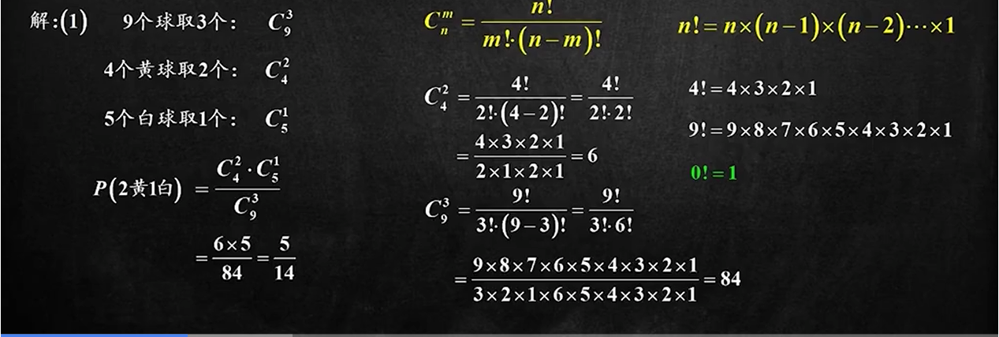

（2）永远是9个球

三次里面选两次

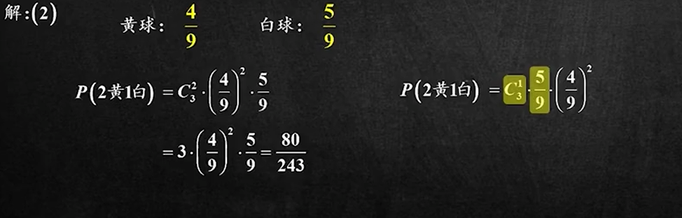

#### C怎么求

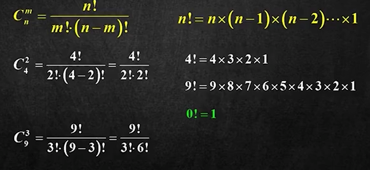

### 考试题型2·需要画图的题目（几何概型）

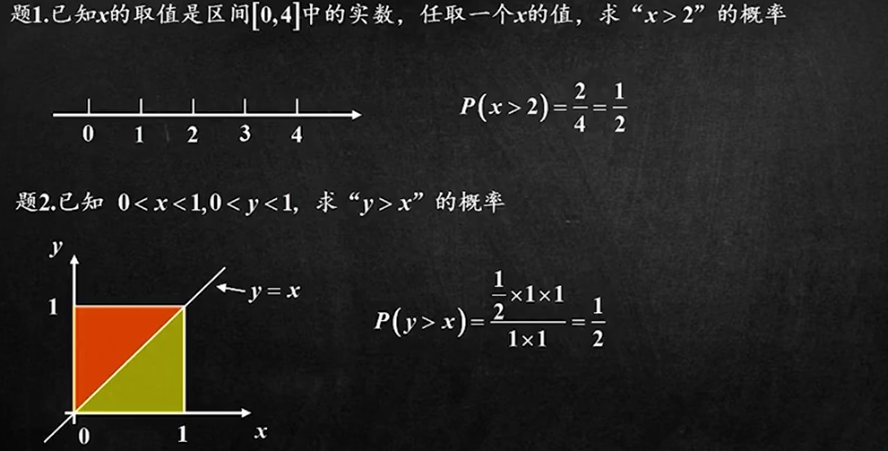

自设xy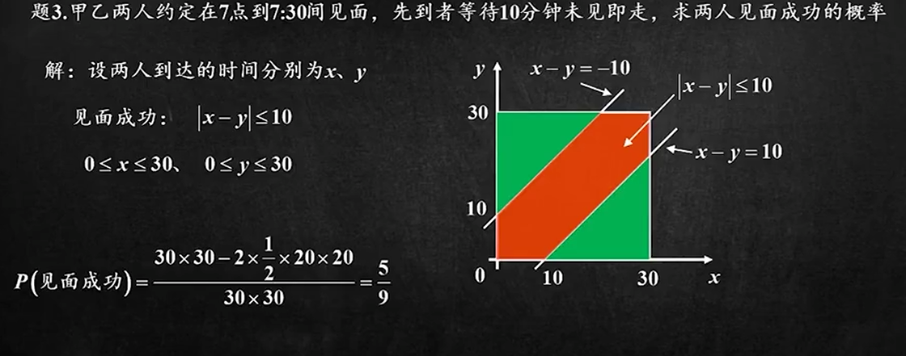

### 考试题型3·事件的公式与运算

#### 维恩图 文氏图

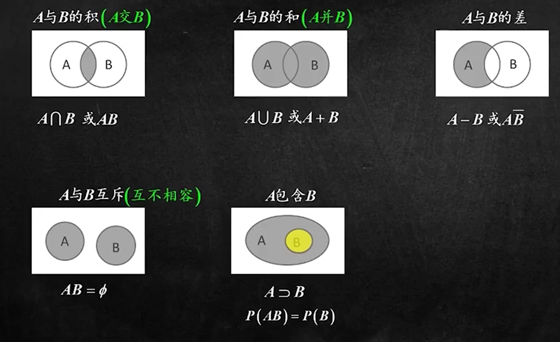

#### 必背公式

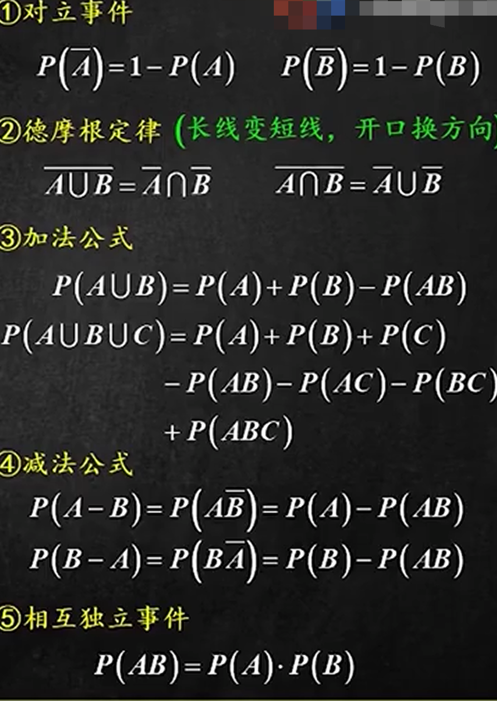

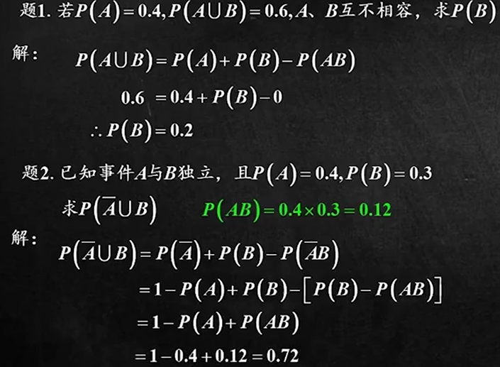

求A、B至少有一个发生的概率

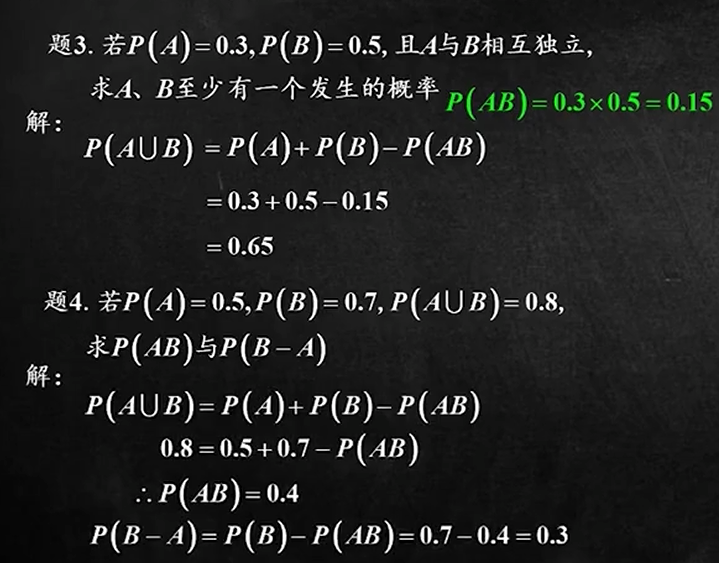

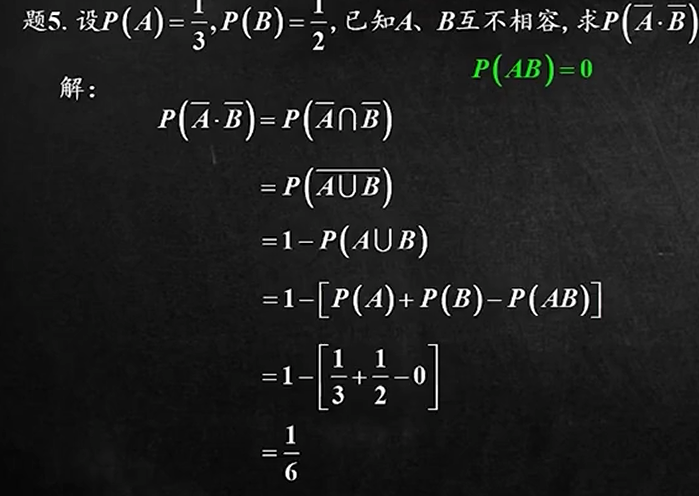

想到对立事件

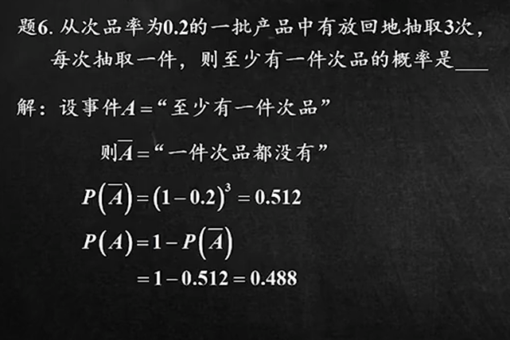

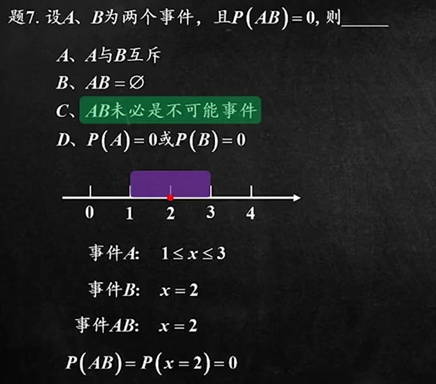

### 习题

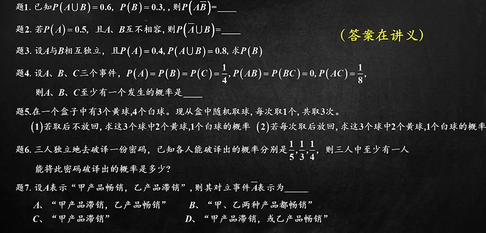