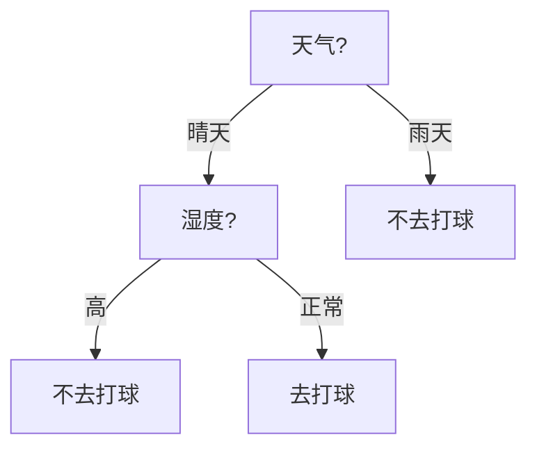
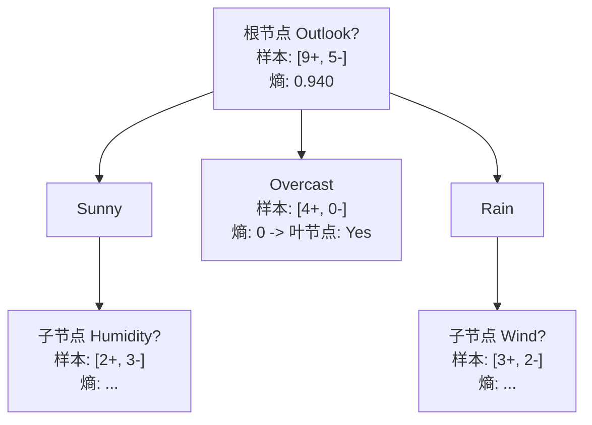
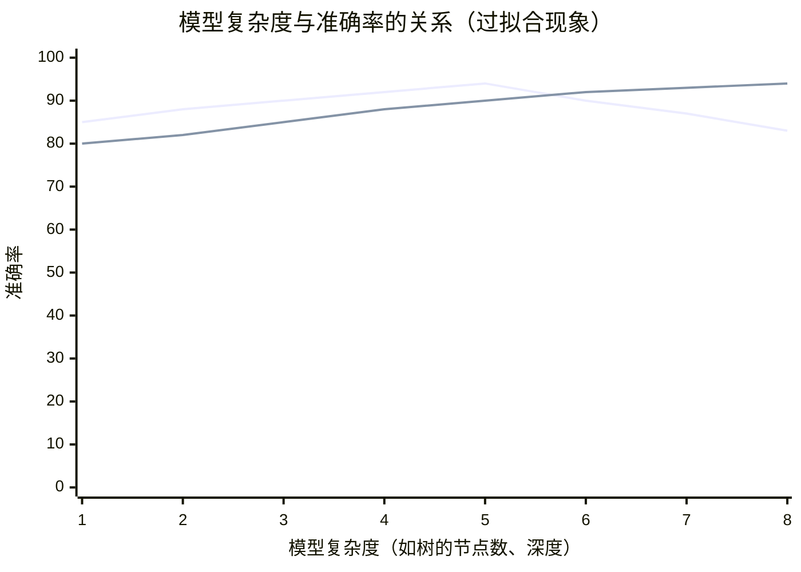
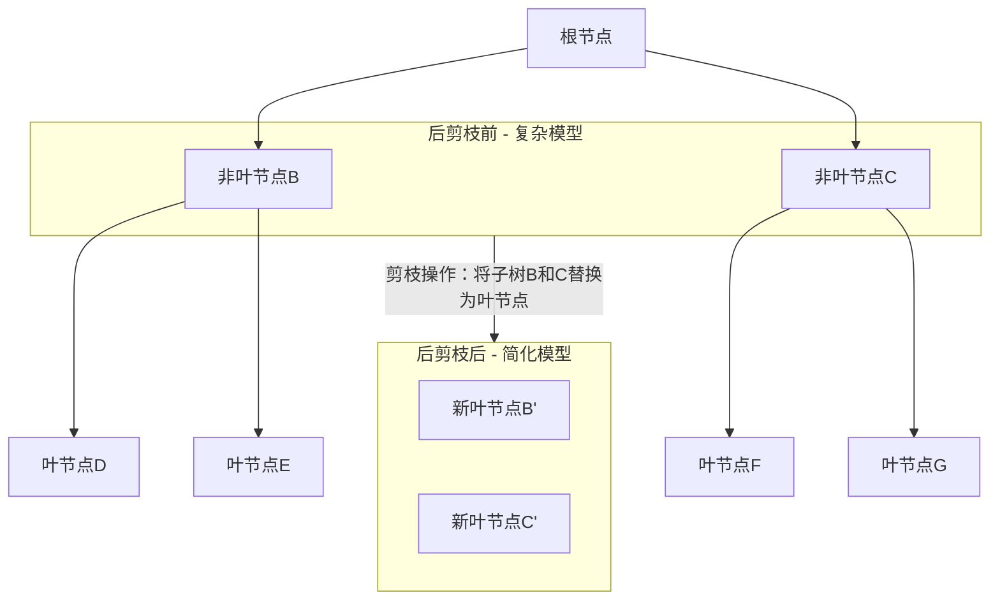
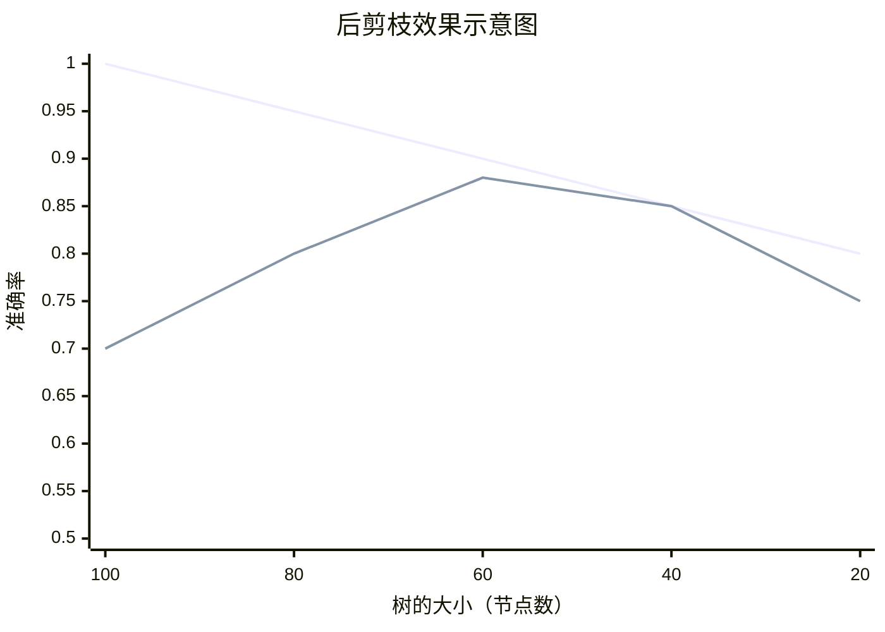

## 一、决策树学习基础

### 1. 什么是决策树？

决策树是一种模仿人类做决策过程的机器学习模型。它通过一系列的问题（即对特征的判断）来对数据进行分类或预测。就像我们平时做决定一样：

> “如果今天下雨，我就不去打球；如果不下雨，但风太大，我也不去；否则我就去。”

这其实就是一个简单的决策树。

#### 🔍 决策树的组成：
- **节点（Node）**：表示一个特征或属性。
- **边（Branch）**：表示特征的取值。
- **叶节点（Leaf）**：表示最终的分类结果或决策。

#### 📊 Mermaid 决策树结构示例：

---

### 2. 决策树适合解决什么问题？

决策树特别适合以下类型的问题：

- **分类问题**（预测类别标签）
- **特征是非数值的**（如：天气=晴/雨/阴）
- **特征之间没有明显的顺序或距离概念**
- **数据缺乏“相似度”度量**

#### 🍎 例子：水果分类

| 颜色 | 大小 | 形状   | 味道 | 类别 |
|------|------|--------|------|------|
| 红   | 小   | 球形   | 甜   | 樱桃 |
| 绿   | 大   | 球形   | 甜   | 西瓜 |
| 黄   | 中   | 细长   | 甜   | 香蕉 |

我们可以通过一系列问题（颜色？大小？形状？味道？）来分类水果。

---

### 3. 样本的表示方式

在决策树中，一个样本通常表示为一个**属性-值**对的集合，而不是数值向量。

例如：
- 一天的天气情况：`{天气=晴, 温度=暖, 湿度=正常, 风=强, 水温=暖, 预测=不变}`
- 一个水果：`{颜色=红, 大小=小, 形状=球形, 味道=甜}`

---

### 4. 如何构建决策树？——ID3算法简介

ID3是一种经典的决策树构建算法，它的核心思想是：

> **每一步选择“最能区分数据”的特征作为当前节点**

#### 🔁 算法流程：
1. 从根节点开始，所有数据都在这里。
2. 选择一个特征，使得按这个特征分裂后，数据的“不纯度”下降最多。
3. 对每个子节点重复步骤2，直到：
   - 所有样本属于同一类 → 变成叶节点
   - 没有特征可用 → 投票决定叶节点类别

---

### 5. 如何选择“最好”的特征？——信息增益（Information Gain）

我们用一个叫**信息增益（IG）** 的指标来衡量一个特征的好坏：

$$
\text{Gain}(S, A) = \text{Entropy}(S) - \sum_{v \in \text{Values}(A)} \frac{|S_v|}{|S|} \cdot \text{Entropy}(S_v)
$$

其中：
- $S$：当前节点的样本集合
- $A$：某个特征
- $S_v$：特征A取值为v的样本子集
- $\text{Entropy}(S)$：衡量S的“不纯度”

#### 📉 熵（Entropy）的定义：

$$
\text{Entropy}(S) = -\sum_{i} p_i \log_2 p_i
$$

$p_i$ 是第 i 类样本所占比例。

- 熵越高，表示数据越混乱（不纯）
- 熵为0，表示所有样本属于同一类（最纯）

可参考这个[决策树信息增益详解与实例](./决策树信息增益详解与实例.md)

---

### 6. 什么时候停止分裂？

ID3在以下两种情况下会停止分裂：

1. **当前节点所有样本属于同一类** → 完美分类，停止
2. **当前节点所有样本的特征值完全相同** → 无法再分，停止

### ⚠️ 注意：
如果特征值相同但类别不同，说明数据存在噪声或冲突，这时通常采用**多数投票**决定叶节点类别。

---

### 7. 决策树的归纳偏置（Inductive Bias）

归纳偏置指的是算法对某种类型假设的偏好。ID3的偏置是：

> **偏好那些在根节点附近使用高信息增益特征的、树形较短的决策树**

这符合**奥卡姆剃刀原则**：最简单的解释往往是最好的。

---

### 8. 总结一下决策树基础

| 概念           | 说明 |
|----------------|------|
| 适用问题       | 分类问题，特征离散，无序 |
| 表示方式       | 属性-值对 |
| 构建算法       | 自顶向下，贪心递归（如ID3） |
| 特征选择       | 信息增益最大 |
| 停止条件       | 样本纯或特征用完 |
| 归纳偏置       | 偏好短树、高信息增益特征靠近根节点 |
***

## 二、经典决策树算法

决策树算法的核心在于解决两个关键问题：
1.  **如何选择最佳分裂特征？**（分裂准则）
2.  **何时停止分裂？**（停止条件与剪枝）

围绕这两个问题，不同的算法给出了各自的答案。

---

### 1. ID3 算法（Iterative Dichotomiser 3）

ID3是决策树学习领域的奠基性算法，由Ross Quinlan在1986年提出。它引入“信息增益”作为分裂准则，奠定了后续所有算法的基础。

#### 🔧 核心机制：信息增益（Information Gain, IG）

-   **思想**：选择那个能让数据“纯度”提升最大的特征进行分裂。纯度的提升，即是**不确定性的减少**。
-   **度量**：使用**熵（Entropy）** 来度量不确定性。
-   **公式**：
    $$\text{Gain}(S, A) = \text{Entropy}(S) - \sum_{v \in \text{Values}(A)} \frac{|S_v|}{|S|} \cdot \text{Entropy}(S_v)$$
    -   $S$：当前节点的样本集合
    -   $A$：某个候选特征
    -   $v$：特征$A$的某个取值
    -   $S_v$：在$S$中特征$A$取值为$v$的子集

-   **做法**：计算所有可用特征的信息增益，选择**增益最大**的特征作为当前节点的分裂特征。

#### 🧪 举例（沿用PDF中的天气数据集）：
根节点有14个样本：[9+, 5-]（9个正例，5个反例）。计算不同特征的信息增益。
-   `Entropy(S) = - (9/14)*log2(9/14) - (5/14)*log2(5/14) ≈ 0.940`
-   `Gain(S, Outlook) = 0.246` （最大）
-   `Gain(S, Humidity) = 0.151`
-   `Gain(S, Wind) = 0.048`
-   `Gain(S, Temperature) = 0.029`

因此，选择`Outlook`作为根节点进行分裂。

#### ⚠️ ID3 的局限性：
1.  **对多值特征偏好**：信息增益倾向于选择取值较多的特征（例如“ID”号，每个值都分到一个样本，信息增益最大，但这毫无意义）。
2.  **只能处理分类特征**：无法直接处理数值型特征（如年龄、工资）。
3.  **无法处理缺失值**。
4.  **没有剪枝机制**：容易过拟合。

---

### 2. C4.5 算法（ID3的进阶版）

同样是Quinlan提出的算法，C45针对ID3的所有缺陷进行了改进，是真正意义上成熟和广泛使用的决策树算法。

#### 🛠️ 核心改进：

1.  **新的分裂准则：增益率（Gain Ratio）**
    -   **目的**：克服信息增益对多值特征的偏好。
    -   **公式**：
        $$\text{GainRatio}(S, A) = \frac{\text{Gain}(S, A)}{\text{SplitInformation}(S, A)}$$
        $$\text{SplitInformation}(S, A) = -\sum_{v=1}^{V} \frac{|S_v|}{|S|} \log_2 \frac{|S_v|}{|S|}$$
    -   `SplitInformation`本质上是关于特征$A$的熵，它衡量了特征$A$本身取值的“分散程度”。$A$的取值越多、越均匀，`SplitInformation`就越大。
    -   **作用**：作为惩罚项，分母越大，增益率越小。从而抑制了多值特征由于自身分裂信息过大而获得高增益率的问题。

可参考这个[决策树信息增益详解与实例](./决策树信息增益详解与实例.md)

2.  **处理数值特征**
    -   将数值特征**排序**，然后尝试所有可能的**二分点**（即阈值），选择信息增益（或增益率）最大的二分点作为分裂点。
    -   *例如：年龄是数值特征，尝试按“30岁”、“35岁”、“40岁”等进行二分，计算每种分法的增益，选择最好的那个。*

3.  **处理缺失值**
    -   **思路**：样本以一定概率被分配到各个子节点。
    -   **具体做法**：
        -   计算信息增益时，忽略缺失该特征的样本。
        -   分裂时，将缺失该特征的样本**同时分配到了所有子节点中**，并赋予一个权重（等于该子节点样本所占的比例）。

4.  **剪枝（Pruning）**
    -   **为什么剪枝？** 防止过拟合。决策树完全生长会过于复杂，记住噪声而非规律。
    -   **C4.5采用“悲观剪枝”**：自底向上，尝试用叶节点替换子树。如果替换后整体误差率没有显著上升，则进行剪枝。

---

### 3. CART 算法（Classification and Regression Trees）

由Breiman等人提出，CART是另一个影响深远的算法框架。

#### 🔑 核心特点：

1.  **二叉树结构**
    -   无论特征有多少个取值，每次只做**二分**。
    -   *例如：特征“天气”有{晴, 阴, 雨}三个值，CART会生成类似“是否是晴？”的分裂，而不是像ID3/C4.5那样直接分成三支。*
    -   优点：简化决策过程，避免多值特征问题，统计性更好。

2.  **可处理回归任务**
    -   CART不仅可以做**分类树**，还可以做**回归树**。
    -   **分类树**：使用**基尼指数（Gini Index）** 作为分裂准则（也可以使用熵）。
        $$\text{Gini}(S) = 1 - \sum_{i=1}^{C} p_i^2$$
        -   $p_i$是第$i$类样本的比例。
        -   Gini指数反映了从数据集中随机抽取两个样本，其类别标记不一致的概率。**Gini指数越小，数据纯度越高**。
        -   分裂准则：选择使子节点**Gini指数加权和最小**的特征进行分裂。
        $$\text{Gini}_{\text{gain}}(S, A) = \text{Gini}(S) - \sum_{v} \frac{|S_v|}{|S|} \text{Gini}(S_v)$$`
    -   **回归树**：使用**最小方差**作为分裂准则。选择那个能让分裂后子节点数据**方差减小最多**的特征和切分点。叶节点的输出是落入该叶节点所有样本目标值的**平均值**。

3.  **严格的剪枝策略**
    -   CART采用**代价复杂度剪枝（Cost-Complexity Pruning）**，也叫**最弱联系剪枝**。
    -   通过交叉验证来选择一个复杂度最优的树，能非常有效地防止过拟合。

可参考这个[决策树信息增益详解与实例](./决策树信息增益详解与实例.md)

---

### 📊 三大经典算法对比总结

| 特性 | ID3 | C4.5 | CART |
| :--- | :--- | :--- | :--- |
| **分裂准则** | 信息增益 | **增益率** | **Gini指数** / 最小方差 |
| **树结构** | 多叉树 | 多叉树 | **二叉树** |
| **任务类型** | 分类 | 分类 | **分类与回归** |
| **处理数值特征** | 不支持 | **支持** | **支持** |
| **处理缺失值** | 不支持 | **支持** | **支持** |
| **剪枝** | 不支持 | 悲观剪枝 | **代价复杂度剪枝** |
| **核心贡献** | 引入信息增益 | 全面改进，趋于成熟 | 二叉树、回归任务、强大剪枝 |

---

## 三、决策树的核心挑战：过拟合

#### 1. 什么是过拟合？一个直观的理解

想象一下你在为一场考试做准备：

-   **欠拟合 (Underfitting)**：你根本没复习，只看了下目录，考得一塌糊涂。**模型太简单**，连训练数据中的基本规律都没学出来。（高偏差）
-   **恰到好处 (Just right)**：你复习了核心概念和典型例题，考试时虽然题目没见过，但你能用学到的知识解答得很好。**模型泛化能力**很强。
-   **过拟合 (Overfitting)**：你不仅背了课本，还把练习册上每一道题的答案都死记硬背下来。考试时，遇到原题你能做对，但题目稍一变化你就不会了。因为你**把题目的噪声和特例都当成了规律**。（高方差）

**官方定义**：
我们说一个假设 $h$（比如一棵决策树）对训练数据**过拟合**，如果存在另一个假设 $h'$，使得：
$$
err_{train}(h) < err_{train}(h') \quad \text{但} \quad err_{test}(h) > err_{test}(h')
$$
即，$h$ 在训练集上的错误率比 $h'$ 更低，但在**未知的测试集**上，$h$ 的错误率反而更高。

#### 📉 过拟合的直观展示

*   **训练准确率**（蓝色线）：随着树越来越复杂，它可以不断学习训练数据中的细节，甚至记住每一个样本，因此训练准确率可以一直很高（接近100%）。
*   **测试准确率**（红色线）：在达到一个最佳点后，模型开始学习训练数据中的**噪声和特例**，这些规律并不适用于新数据，导致模型**泛化能力**下降，测试准确率随之降低。

**决策树过拟合的极端例子**：一棵树为**每一个**训练样本都创建了一个叶节点。这棵树本质上只是一个昂贵的、难以阅读的**查找表**，它没有任何预测能力。

---

#### 2. 为什么决策树尤其容易过拟合？

决策树的学习算法本质是一种**贪心**的、**分治**的算法，它会不断分裂节点，直到满足停止条件（如ID3的“样本纯了”）。这个机制导致它天生具有不断增大复杂度来降低训练误差的倾向，而没有任何内在的机制来阻止自己“学得太细”。

---

#### 3. 如何解决过拟合问题？——决策树的正则化

解决过拟合的过程称为 **正则化（Regularization）**。对于决策树，主要有两大策略：

1.  **剪枝（Pruning）** - 事后补救
2.  **提前停止（Early Stopping）** - 事前控制

##### 策略一：剪枝（Pruning - 让树“瘦身”）

剪枝是决策树对抗过拟合的**最主要、最有效**的手段。它的核心思想是：**主动去掉一些分支（子树），用叶节点代替，从而简化模型，提高泛化能力。**

剪枝分为两种：

-   **预剪枝（Pre-pruning）**：在树完全生长**之前**就停止分裂。
    -   **做法**：设置一些**停止条件**，一旦满足就停止分裂，将当前节点标记为叶节点。
    -   **常用停止条件**：
        -   树达到最大深度
        -   节点中样本数少于某个阈值
        -   分裂带来的性能提升（如信息增益）小于某个阈值
    -   **优点**：降低过拟合风险，减少训练时间。
    -   **缺点**：有**欠拟合**风险。可能有些分支当前增益不大，但后续分裂可能带来显著提升（“视野限制”问题）。

-   **后剪枝（Post-pruning）**：让树**完全生长**，然后**自底向上**地考察非叶子树，并将其替换为叶节点。
    -   **做法**：使用**验证集**来评估剪掉一个子树前后，模型的性能变化。如果剪枝后模型在验证集上的准确率**没有显著下降或有所提升**，就进行剪枝。
    -   **代表方法**：CART使用的**代价复杂度剪枝（CCP）**、C4.5使用的**悲观剪枝**。
    -   **优点**：泛化性能通常优于预剪枝，欠拟合风险小。
    -   **缺点**：训练时间开销大，因为需要先生成一棵完整的树。

*图示：后剪枝通过用叶节点替换整个子树来简化模型。*

##### 策略二：提前停止（Early Stopping - 设置生长规则）

这其实就是**预剪枝**的具体实现，通过设置超参数来限制树的无限生长：

-   `max_depth`：树的最大深度。限制树能长多“深”。
-   `min_samples_split`：一个节点至少包含多少个样本才能被分裂。
-   `min_samples_leaf`：一个叶节点至少需要包含多少个样本。
-   `min_impurity_decrease`：分裂必须带来的最小不纯度减少量。

**这些超参数需要通过交叉验证（Cross-Validation）来调优**，以在欠拟合和过拟合之间找到最佳平衡点。

---

### 总结：如何构建一棵好的决策树？

构建一个泛化能力强的决策树，不是一个“让它自由生长”的过程，而是一个 **“约束与优化”** 的过程。

1.  **第一步**：使用算法（如CART、C4.5）让树充分生长，得到一个**过拟合**的复杂模型。
2.  **第二步**：运用**剪枝**技术（特别是后剪枝）或**交叉验证**调参，来简化这个复杂模型，削弱过拟合，最终得到一个**复杂度适中、泛化能力最优**的模型。

这个过程完美体现了机器学习的核心思想：**我们追求的不是在训练数据上的完美表现，而是在未知数据上的强大预测能力。**

---

## 四、如何避免过拟合

过拟合是决策树的核心挑战。解决它的方法分为两大哲学：

1.  **预剪枝（Pre-Pruning）**：在树**生长过程中**就紧急刹车，防止它长得太深。
2.  **后剪枝（Post-Pruning）**：让树**彻底放飞自我**地生长，然后再**“秋后算账”**，剪掉那些不必要的分支。

这两种策略各有优劣，就像教育孩子：预剪枝是“严格管束”，后剪枝是“自由生长，后再纠偏”。

---

### 策略一：预剪枝（Pre-Pruning） - “防患于未然”

预剪枝的核心思想是：在树的生长过程中，**提前设定一些停止规则**，一旦满足条件就立即停止分裂，并将当前节点设为叶节点。

#### 方法1: 基于样本数停止

-   **做法**：设定一个最小样本数阈值（如 5%）。如果一个节点中的样本数少于这个阈值，就停止分裂。
-   **原因（大白话）**：如果一个节点只剩寥寥几个样本，再基于它们分裂出的规则就非常不可靠了。就像你不能只根据一两个人的观点就得出一个普适的结论一样。这样的规则泛化能力极差，往往是噪声。
-   **优点**：简单有效，直接避免了模型学习过于具体的细节。
-   **缺点**：可能**欠拟合**。也许再分一步就能产生一个很好的规则，但规则被提前终止了。

#### 方法2: 基于信息增益阈值停止

-   **做法**：设定一个最小信息增益阈值 $\beta$。如果所有候选特征带来的信息增益 $\Delta i(s)$ 都小于 $\beta$，则停止分裂。
-   **原因（大白话）**：如果分裂带来的“收益”（纯度提升）微乎其微，那就不值得为这一点点收益而增加模型的复杂性。
-   **优点**：利用了所有数据，停止位置灵活。
-   **缺点**：**$\beta$ 非常难设定**。设高了，树太浅，欠拟合；设低了，树依然很深，过拟合可能依然存在。

#### ⚖️ 预剪枝的优缺点总结：
-   **优点**：计算开销小，训练速度快。
-   **缺点**：有**“视野短浅”**的风险。可能当前分裂增益小，但后续分裂能带来巨大提升，预剪枝无法看到这种未来收益，容易导致欠拟合。

---

### 策略二：后剪枝（Post-Pruning） - “亡羊补牢，为时未晚”

后剪枝是更强大、更常用的策略。它先让决策树完全生长（甚至过拟合），然后**自底向上**地考察每一个子树，并将其替换为叶节点，从而简化模型。

#### 关键工具：验证集（Validation Set）
后剪枝**必须**使用一个未参与训练的验证集来评估剪枝的好坏。这相当于一个“裁判”，用来判断剪枝后的模型是否比剪枝前更优秀。

#### 方法1: 错误率降低剪枝（Reduced-Error Pruning）
这是最直观的后剪枝方法。

1.  **步骤**：
    -   从完全生长的树的**最底层的非叶节点**开始。
    -   尝试将该节点替换为一个叶节点（这个叶节点的类别标签采用**当前节点下训练样本的多数类**）。
    -   用**验证集**测试剪枝前和剪枝后的准确率。
    -   如果剪枝后**验证集准确率没有下降或有所提升**，就执行剪枝。
    -   重复此过程，自底向上，直到无法再剪为止。

2.  **叶节点标签赋值策略（非常重要）**：
    -   剪枝后，新叶节点的标签不是随便选的，通常赋值为**原子树对应训练数据中的多数类**。
    -   这保证了剪枝前后的决策在训练数据上看是“合理”的。

3.  **效果**：
    -   如下图所示，随着剪枝进行（树变小），测试集/验证集准确率会先上升后下降。后剪枝的目标就是找到那个准确率的峰值点。

*图示：后剪枝通过减少节点数（简化模型）来提升测试准确率，找到最佳平衡点。*

#### 方法2: 规则后剪枝（Rule Post-Pruning） - C4.5算法的选择
这是更高级、更强大的一种方法，C4.5算法就使用了它。

1.  **步骤**：
    -   **第一步：将树转换为规则集合**。从根节点到每个叶节点的路径都是一条独立的“if...then...”规则。
      > `IF (Outlook=Sunny) AND (Humidity=High) THEN PlayTennis=No`
    -   **第二步：对每条规则进行剪枝**。尝试去除规则中的一个前提条件（如去掉`Humidity=High`），然后用验证集检查这条被修剪的规则是否变得更准确。如果是，就永久移除这个条件。
    -   **第三步：对规则排序**。将修剪后的规则按照其**准确率**或**覆盖率**从高到低排序。
    -   **第四步：应用规则**。对一个新样本进行分类时，按顺序检查规则，使用**第一条被触发**的规则进行分类。

2.  **为什么转为规则再剪枝更好？（大白话解释）**
    -   **上下文无关**：在树结构中，一个节点是否剪枝会影响整个子树。而规则之间是独立的，剪掉一条规则的一个条件不会影响其他规则。
    -   **更精细**：对树的剪枝是“一刀切”剪掉整个子树，而对规则的剪枝可以只剪掉某个条件，控制粒度更细，效果通常更好。

#### ⚖️ 后剪枝的优缺点总结：
-   **优点**：泛化性能通常**远高于**预剪枝，能获得更小、更强大的树。
-   **缺点**：计算开销大，因为需要生成完整树后再进行剪枝迭代。

---

### 📊 预剪枝 vs. 后剪枝：实战如何选？

| 特性 | 预剪枝 | 后剪枝 |
| :--- | :--- | :--- |
| **效率** | **高**，边建树边停止 | **低**，需建完整树再剪枝 |
| **效果** | 容易因“目光短浅”而**欠拟合** | 效果通常**更好**，泛化能力更强 |
| **实用性** | 简单，易于实现 | 更复杂，但主流算法（如C4.5, CART）都使用后剪枝或其变种 |
| **常用场景** | 对训练速度要求极高的场景 | 绝大多数对精度有要求的场景 |

**一个非常实用的结论：在实际应用中，虽然预剪枝训练更快，但后剪枝通常能得到准确率更高的模型。**

好的，我们接着深入讲解第五部分：**扩展：现实场景中的决策树学习**。

这部分内容至关重要，因为它回答了“理论完美的算法如何应对现实数据的混乱？”这一问题。我们将探讨决策树在处理真实数据时面临的四大挑战及其解决方案。

---

## 五、扩展：现实场景中的决策树学习

#### 问题 1: 连续属性值（例如：年龄、工资、温度）

**挑战**：决策树的分裂本质上是基于“是/否”判断，但像“温度=72华氏度”这样的连续值无法直接用于分裂。

**解决方案：离散化（Discretization）**
核心思想是找到一个最佳的**阈值（Threshold）**，将连续值转化为“是否小于等于此阈值”的二元问题。

*   **做法（最常见）**：
    1.  将该属性的所有值**排序**。例如温度排序后：`[40, 48, 60, 72, 80, 90]`。
    2.  考虑所有**潜在的分裂点**（通常取相邻不同类别样本值的中间值）。例如在60(Yes)和72(Yes)之间不需要分，而在72(Yes)和80(No)之间可以取 `(72+80)/2 = 76` 作为一个候选分裂点。
    3.  计算用每个候选分裂点进行二分所带来的**信息增益（或增益率、Gini增益等）**。
    4.  选择**增益最大**的那个分裂点作为该连续属性的最佳阈值。

*   **大白话**：算法会尝试所有可能的“切一刀”的地方，看在哪切最能区分不同类别的样本。就像给你一堆大小不一的苹果和橘子，让你找一个重量阈值，能最好地把“大部分苹果”和“大部分橘子”分开。

*   **理论支持**：U.M. Fayyad 等人的定理证明了，对于连续属性，只需考察这些候选分裂点，就一定能找到使信息增益最大化的那个阈值。

---

#### 问题 2: 具有过多取值的属性（例如：ID号、姓名、日期）

**挑战**：信息增益准则**偏向**于选择取值多的属性。例如一个“日期”属性，几乎每个样本都有一个不同的值，用它分裂会得到大量纯的子集，信息增益极高，但这样的树毫无泛化能力。

**解决方案：使用增益率（Gain Ratio）**
C4.5算法引入了增益率来克服这一偏差。

*   **公式**：
    $$\text{GainRatio}(S, A) = \frac{\text{Gain}(S, A)}{\text{SplitInformation}(S, A)}$$
    其中，
    $$\text{SplitInformation}(S, A) = -\sum_{i=1}^{c} \frac{|S_i|}{|S|} \log_2 \frac{|S_i|}{|S|}$$

*   **大白话**：
    *   `SplitInformation` 本质是**属性A本身的熵**。如果A的取值非常多且分布均匀，这个值就会很大。
    *   增益率相当于给原始的信息增益（Gain）除以了一个**惩罚项**。属性A的取值越多、越分散，惩罚就越大，从而抑制了其被选中的可能性。
    *   这就像评选优秀员工，不仅要看业绩（信息增益），还要看工作的难度和资源的投入（分裂信息），避免那些资源消耗巨大但业绩只是略高的候选人当选。

---

#### 问题 3: 未知属性值（缺失值）

**挑战**：现实数据中经常有字段缺失（如用户未填写收入信息）。ID3无法处理缺失值，但C4.5和CART等现代算法可以。

**解决方案（以C4.5为例）：概率分配**
核心思想是**让带有缺失值的样本以一定概率分配到所有子节点中**。

**具体步骤（配合PDF中的血压例子理解）**：
1.  **计算信息增益时**：忽略该属性缺失的样本，仅基于无缺失的样本计算信息增益。
2.  **分裂节点时**：对于属性A缺失的样本，它不是完全属于某一个分支，而是**按权重**同时进入所有分支。
    *   权重由**无缺失样本**的分布决定。例如，对于属性A，无缺失样本中有60%进入了“是”分支，40%进入了“否”分支。
    *   那么，一个缺失A的样本在进入“是”分支时，其权重为0.6；进入“否”分支时，权重为0.4。
3.  **后续计算**：在子节点中，样本的权重不再是1，而是其被分配到的权重。所有基于样本数的计算（如计算概率、多数投票）都使用**权重和**。

*   **大白话**：一个士兵不知道走左边还是右边的路，他决定派60%的自己走左边，40%的自己走右边。两边的指挥官在统计人数和做决策时，会把这个“不完整的人”按比例计入。

---

#### 问题 4: 有代价的属性

**挑战**：有些属性的获取**成本很高**或**风险很大**。例如在医疗诊断中，“活检结果”比“体温”的获取代价高得多。决策时应优先使用廉价、无创的属性。

**解决方案：引入代价敏感分裂准则**
修改原有的属性选择标准，将**信息增益**和**获取成本**结合起来考虑。

*   **常见公式**：
    1.  **Tan & Schlimmer (1990)**: `$$\frac{\text{Gain}^2(S, A)}{\text{Cost}(A)}$$`
        *   倾向于选择增益高且成本低的属性。
    2.  **Nunez (1988)**: `$$\frac{2^{\text{Gain}(S, A)} - 1}{(\text{Cost}(A) + 1)^w}$$`
        *   参数 `w` ∈ [0,1] 用来控制代价的重要性。

*   **大白话**：这就像是你的**性价比**选择。你不会只买性能最好的显卡，也不会只买最便宜的。你会找一个“性能/价格”比最高的。这里的“性能”是信息增益，“价格”是属性代价。

---

### 总结与升华

决策树之所以成为最经典、最常用的机器学习算法之一，并非因为它是最强大的，而是因为它在**可解释性**和**性能**之间取得了完美的平衡。

1.  **核心优势**：
    *   **直观易懂**：其“if-then”规则逻辑与人类决策思维高度一致，白盒模型，易于调试和信任。
    *   **准备数据简单**：无需标准化，能直接处理混合类型的特征（离散+连续）。
    *   **对噪声稳健**：通过剪枝和多数投票机制可以有效过滤噪声。

2.  **历史地位与应用**：
    *   它是许多应用领域（医疗诊断、信用评估、客户分析）的首选工具，因为在这些领域，模型的**可解释性**和**决策依据**往往比极高的精度更重要。
    *   它是一切**集成学习**方法（如随机森林、梯度提升树GBDT/XGBoost）的基石。这些现代最强算法的基础，正是一棵棵简单的决策树。

通过学习决策树如何解决这些现实世界的问题，你不仅学会了一个算法，更学会了一种**将抽象理论灵活应用于复杂现实**的思维方式。这正是机器学习的精髓所在。

##### 扩展
单颗树和随机森林
- [单棵树——一个独立的决策树模型](./单棵树——一个独立的决策树模型.md)
- [随机森林与决策树的关系](./随机森林与决策树的关系.md)