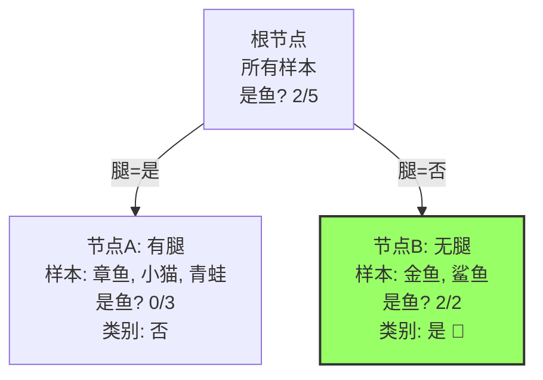
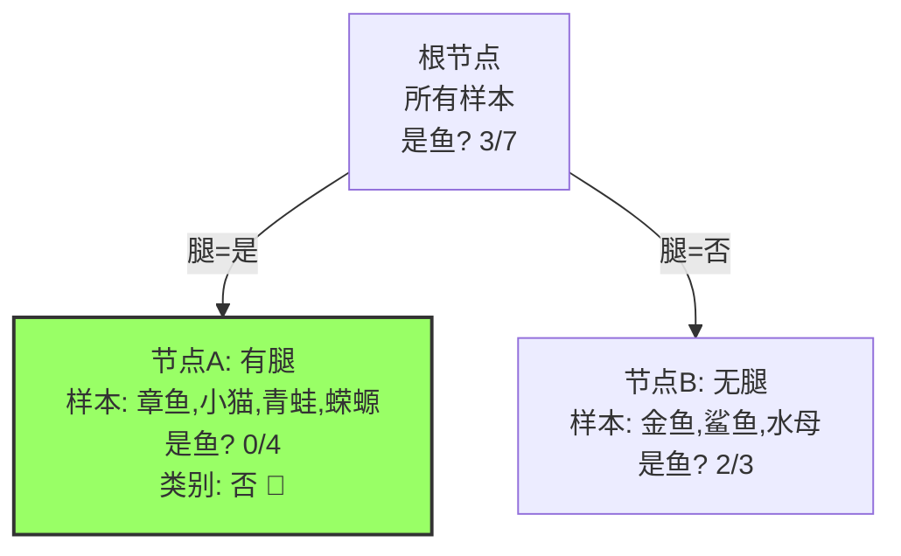
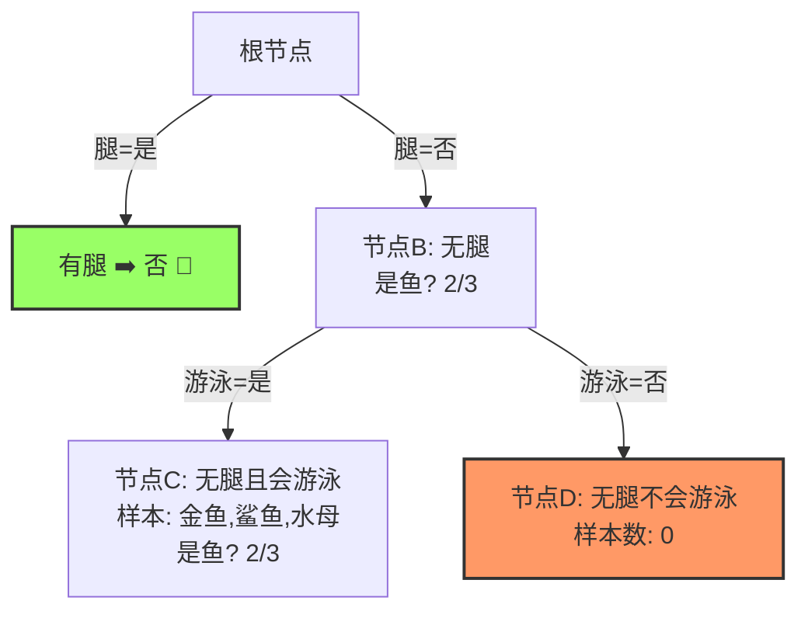
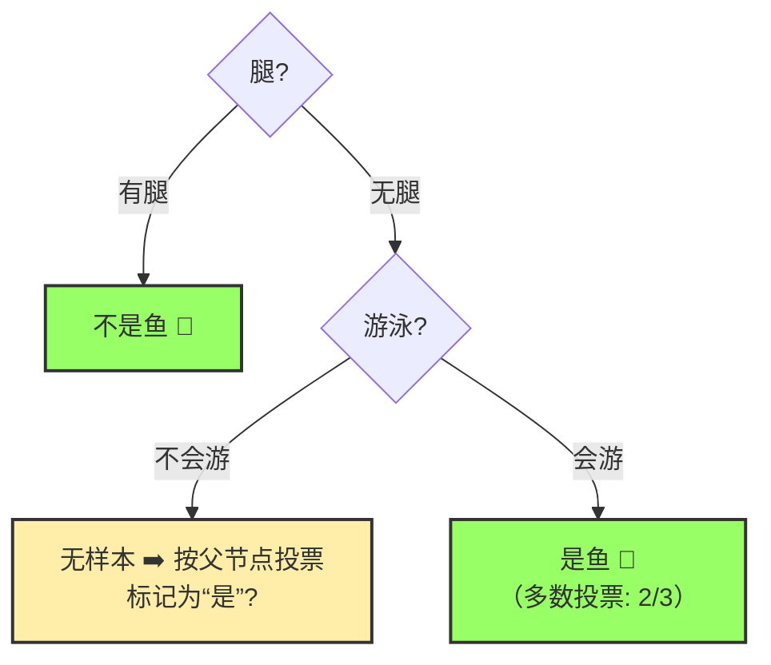
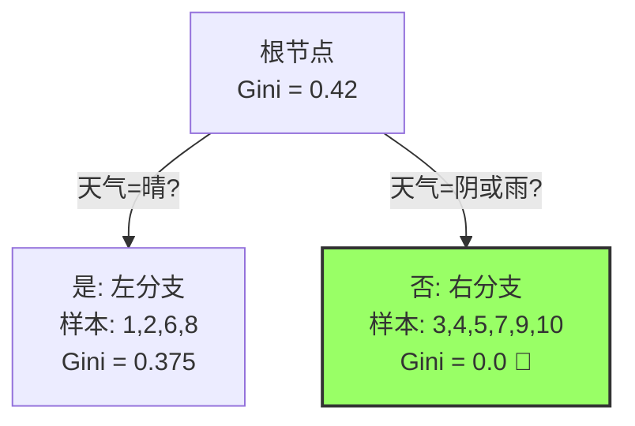

**基于index文件对其中的知识的部分详解**
## 决策树信息增益详解与实例

### 1. 核心思想：为什么要用信息增益？

决策树的构建过程就是一个不断**提问题、做划分**的过程。目标是让数据在经过每一次划分后，都变得更加“纯粹”。例如，我们想根据天气、温度等因素预测是否去打篮球。

*   一个“好问题”（如“是否是晴天？”）能够将“去打篮球”和“不去打篮球”的人清晰地分开。划分后的子集**纯度很高**（比如晴天组大部分都去了，阴雨天组大部分都没去）。
*   一个“坏问题”（如“是否穿红色衣服？”）可能对划分打球与否没什么帮助，划分后的子集依然很**混乱**，去打和不去打的人各占一半。

**信息增益就是用来衡量一个特征（一个问题）能够为整个数据集的分类带来多少“确定性”或“纯净度”提升的指标。** 我们总是选择**信息增益最大**的特征来进行划分，因为这意味着用这个特征提问，能最有效地降低我们决策的不确定性。

---

### 2. 理论基础：信息熵

要理解信息增益，必须先理解其基础：**信息熵**。

*   **定义**：信息熵由香农提出，是**衡量一个系统混乱程度**的指标。在机器学习中，它表示**一个数据集中样本类别的不确定性**。
*   **公式**：对于一个包含 $K$ 个类别的数据集 $D$，其信息熵的计算公式为：
    $Ent(D) = -\sum_{k=1}^{K} p_k \log_2 p_k$
    其中 $p_k$ 是第 $k$ 类样本在数据集 $D$ 中所占的比例。
*   **如何理解**：
    *   **熵值越高**，意味着数据集越**混乱**，不确定性越大。例如，一个袋子里的球50%是红色，50%是蓝色，你随机抽一个球猜其颜色，不确定性最高，此时的熵也最大。
    *   **熵值越低**，意味着数据集越**纯净**，确定性越高。例如，一个袋子里的球100%是红色，你抽一个球肯定能猜对是红色，没有任何不确定性，此时的熵为0。

---

### 3. 信息增益的定义与计算

现在我们可以定义信息增益了。

*   **定义**：使用某个特征 $A$ 对数据集 $D$ 进行划分后，**数据集整体熵的减少量**。减少得越多，说明这个特征带来的确定性提升越大，这个特征就越值得用来划分。
*   **公式**：
    $Gain(D, A) = Ent(D) - \sum_{v=1}^{V} \frac{|D^v|}{|D|} Ent(D^v)$
    其中：
    *   $Gain(D, A)$：特征 $A$ 对数据集 $D$ 的信息增益。
    *   $Ent(D)$：划分前数据集 $D$ 的信息熵。
    *   $V$：特征 $A$ 有多少种不同的取值（例如，“天气”特征有“晴、阴、雨”3种取值，$V=3$）。
    *   $D^v$：数据集 $D$ 中，特征 $A$ 上取值为第 $v$ 个值的样本子集（例如，所有“天气=晴”的样本）。
    *   $\frac{|D^v|}{|D|}$：第 $v$ 个子集的权重，即该取值样本数占总样本数的比例。
    *   $\sum_{v=1}^{V} \frac{|D^v|}{|D|} Ent(D^v)$：划分之后，所有子集熵的**加权平均**。这可以理解为**条件熵**，即在已知特征 $A$ 的条件下，数据集 $D$ 的不确定性。

**所以，信息增益的公式可以直观地理解为：**
**信息增益 = 父亲节点的熵 - 所有子节点熵的加权和**

---

### 4. 实例计算 step-by-step

让我们用一个经典的“是否打篮球”的例子来演示整个计算过程。

**数据集如下（共14条样本）：**

| 编号 | 天气 | 温度 | 湿度 | 风强 | 是否打球 |
| :--- | :--- | :--- | :--- | :--- | :------- |
| 1    | 晴   | 高   | 高   | 弱   | 否       |
| 2    | 晴   | 高   | 高   | 强   | 否       |
| 3    | 阴   | 高   | 高   | 弱   | 是       |
| 4    | 雨   | 中   | 高   | 弱   | 是       |
| 5    | 雨   | 低   | 中   | 弱   | 是       |
| 6    | 雨   | 低   | 中   | 强   | 否       |
| 7    | 阴   | 低   | 中   | 强   | 是       |
| 8    | 晴   | 中   | 高   | 弱   | 否       |
| 9    | 晴   | 低   | 中   | 弱   | 是       |
| 10   | 雨   | 中   | 中   | 弱   | 是       |
| 11   | 晴   | 中   | 中   | 强   | 是       |
| 12   | 阴   | 中   | 高   | 强   | 是       |
| 13   | 阴   | 高   | 中   | 弱   | 是       |
| 14   | 雨   | 中   | 高   | 强   | 否       |

我们的目标是：计算**天气、湿度、风强**这三个特征中，哪个特征的信息增益最大，就应该作为决策树的根节点。

**第一步：计算数据集D的总熵 $Ent(D)$**

*   总样本数：14
*   “是”的样本数：9 (编号：3,4,5,7,9,10,11,12,13)
*   “否”的样本数：5 (编号：1,2,6,8,14)
*   $p(是) = 9/14$
*   $p(否) = 5/14$
*   $Ent(D) = -\left[\frac{9}{14} \log_2 \frac{9}{14} + \frac{5}{14} \log_2 \frac{5}{14}\right] \approx -[0.642 * \log_2(0.642) + 0.357 * \log_2(0.357)]$
    *   $\log_2(0.642) \approx -0.639$
    *   $\log_2(0.357) \approx -1.486$
    *   $Ent(D) \approx -[0.642 * (-0.639) + 0.357 * (-1.486)] \approx -[-0.410 - 0.530] \approx 0.940$

**第二步：计算以“天气”特征划分的条件熵 $Ent(D|天气)$**

特征“天气”有3个取值：`晴`、`阴`、`雨`。
我们需要分别计算每个取值子集的熵，然后求加权平均。

1.  **天气 = 晴**
    *   样本数：5 (编号：1,2,8,9,11)
    *   “是”的样本数：2 (9,11)
    *   “否”的样本数：3 (1,2,8)
    *   $Ent(D_{晴}) = -\left[\frac{2}{5} \log_2 \frac{2}{5} + \frac{3}{5} \log_2 \frac{3}{5}\right] \approx -[0.4 * (-1.322) + 0.6 * (-0.737)] \approx -[-0.529 - 0.442] \approx 0.971$

2.  **天气 = 阴**
    *   样本数：4 (编号：3,7,12,13)
    *   “是”的样本数：4
    *   “否”的样本数：0
    *   $Ent(D_{阴}) = -\left[1 * \log_2 1 + 0 * \log_2 0\right] = 0$ (规定 $0 \log_2 0 = 0$)

3.  **天气 = 雨**
    *   样本数：5 (编号：4,5,6,10,14)
    *   “是”的样本数：3 (4,5,10)
    *   “否”的样本数：2 (6,14)
    *   $Ent(D_{雨}) = -\left[\frac{3}{5} \log_2 \frac{3}{5} + \frac{2}{5} \log_2 \frac{2}{5}\right] \approx 0.971$ (计算过程同 $D_{晴}$)

4.  **计算条件熵（加权平均）**
    *   $Ent(D|天气) = \frac{5}{14} * Ent(D_{晴}) + \frac{4}{14} * Ent(D_{阴}) + \frac{5}{14} * Ent(D_{雨})$
    *   $= \frac{5}{14} * 0.971 + \frac{4}{14} * 0 + \frac{5}{14} * 0.971$
    *   $\approx 0.347 + 0 + 0.347 = 0.694$

**第三步：计算特征“天气”的信息增益 $Gain(D, 天气)$**

$Gain(D, 天气) = Ent(D) - Ent(D|天气) = 0.940 - 0.694 = 0.246$

**第四步：同理，计算其他特征的信息增益（过程略，请尝试自己计算）**

*   **特征“湿度”**（取值：高，中）
    *   $Ent(D|湿度) = \frac{7}{14} * Ent(D_{高}) + \frac{7}{14} * Ent(D_{中})$
    *   $D_{高}$ (样本1,2,3,4,8,12,14)：3个“是”，4个“否”，熵约为0.985
    *   $D_{中}$ (样本5,6,7,9,10,11,13)：6个“是”，1个“否”，熵约为0.592
    *   $Ent(D|湿度) \approx \frac{7}{14} * 0.985 + \frac{7}{14} * 0.592 \approx 0.789$
    *   $Gain(D, 湿度) = 0.940 - 0.789 = 0.151$

*   **特征“风强”**（取值：弱，强）
    *   $Ent(D|风强) = \frac{8}{14} * Ent(D_{弱}) + \frac{6}{14} * Ent(D_{强})$
    *   $D_{弱}$ (样本1,3,4,5,7,9,10,13)：6个“是”，2个“否”，熵约为0.811
    *   $D_{强}$ (样本2,6,8,11,12,14)：3个“是”，3个“否”，熵为1
    *   $Ent(D|风强) \approx \frac{8}{14} * 0.811 + \frac{6}{14} * 1 \approx 0.892$
    *   $Gain(D, 风强) = 0.940 - 0.892 = 0.048$

**第五步：比较信息增益，选择根节点**

| 特征 | 信息增益        |
| :--- | :-------------- |
| 天气 | **0.246 (最大)** |
| 湿度 | 0.151           |
| 风强 | 0.048           |

**结论**：特征“天气”的信息增益最大。因此，在构建决策树时，我们应该**首先根据“天气”进行划分**。这符合我们的直觉，天气的好坏对是否去打篮球的影响最大。

划分后的情况如下：
*   **天气=阴**：纯度100%，直接标记为“是”，成为叶子节点。
*   **天气=雨**和**天气=晴**：纯度还不够高（熵为0.971），需要后续对这两个分支再继续用“湿度”、“风强”等特征进行进一步的划分，计算过程同上。

---

### 5. 信息增益的优缺点

*   **优点**：
    *   概念清晰，符合直觉，容易理解。
    *   计算基于概率分布，相对客观。

*   **缺点（及改进）**：
    *   **对可取值数目多的特征有偏好**。例如，如果用“编号”作为特征，它能把每一个样本都分到一个唯一的子集，条件熵为0，信息增益最大，但这毫无意义，因为产生了过拟合。
    *   **改进方案**：引入**信息增益比**。它通过除以一个叫做“固有值”的惩罚项来抵消这种偏好。固有值衡量的是特征本身取值的混乱度，取值越多，固有值通常越大。信息增益比 = 信息增益 / 固有值。
---

## ID3停止分裂的俩种情况

ID3算法的核心是使用**信息增益**作为特征选择准则，递归地构建决策树。但为了防止过拟合和构建一棵泛化能力强的树，必须设定停止分裂的条件。

主要的两种停止分裂情况是：
1.  **当前节点包含的样本已完全属于同一类别**（纯度已达100%）。
2.  **已没有剩余特征可用于进一步划分数据**。

---

### 情况一：当前节点纯度100%（所有样本属于同一类）

这是最理想也是最常见的停止条件。当一个节点中的所有样本都具有相同的类别标签时，任何进一步的划分都是多余且有害的（可能导致过拟合）。此时，该节点成为一个**叶节点**，其类别就被确定为该单一类别。

#### 可视化示例

我们使用一个简单的动物分类数据集来构建决策树，目标是判断动物是否是“鱼”。

| 动物 | 腿 | 游泳 | 是鱼吗？ |
| :--- | :--- | :--- | :------- |
| 章鱼 | 是   | 是   | 否       |
| 小猫 | 是   | 否   | 否       |
| 青蛙 | 是   | 是   | 否       |
| 金鱼 | 否   | 是   | 是       |
| 鲨鱼 | 否   | 是   | 是       |

**构建过程可视化：**

1.  **根节点**：包含所有5个样本，其中有2个“是鱼”，3个“不是鱼”。纯度不高，需要分裂。
2.  **选择根节点特征**：我们计算“腿”和“游泳”的信息增益（计算过程略，可参考上一个问题的讲解）。假设“腿”特征的信息增益更大，我们首先根据“腿”进行分裂。

*   **节点B (无腿)**：这个节点包含了所有“无腿”的样本（金鱼、鲨鱼）。它们**全部都属于“是鱼”这个类别**。纯度已经达到100%。
*   **停止分裂**：根据条件一，这个节点无需再分裂，直接成为**叶节点**，类别标记为“是”。
*   **节点A (有腿)**：这个节点纯度不高（3个都是“不是鱼”），但还需要检查其他条件。

---

### 情况二：已无特征可用于划分

当到达某个节点时，虽然样本不属于同一类（纯度不为100%），但你已经用完了所有可供使用的特征。这可能有两种子情况：
*   **所有特征在之前的划分中都已使用过**（ID3算法同一特征在同一路径上一般不重复使用）。
*   **该节点的样本在所有剩余特征上的取值完全相同**，导致无法利用这些特征将不同类别的样本分开。

在这种情况下，由于没有更多信息可以用来做决策，分裂必须停止。该节点成为**叶节点**，其类别由**多数投票**决定（即该节点中样本数最多的类别）。

#### 可视化示例（接上例）

现在我们来处理**节点A**（包含章鱼、小猫、青蛙，它们都不是鱼，但纯度是100%吗？不，它们类别虽然都是“否”，但我们假设还有一个“海豚”的数据，它“无腿”但“不是鱼”，已经被分走了。这里节点A纯度是100%，其实已经符合条件一。为了展示条件二，我们修改一下数据）。

**我们修改数据集，加入一个“蝾螈”（有腿、会游泳、不是鱼）和一个“水母”（无腿、会游泳、不是鱼）**，让问题更复杂。

| 动物 | 腿 | 游泳 | 是鱼吗？ |
| :--- | :--- | :--- | :------- |
| 章鱼 | 是   | 是   | 否       |
| 小猫 | 是   | 否   | 否       |
| 青蛙 | 是   | 是   | 否       |
| **蝾螈** | **是** | **是** | **否** |
| 金鱼 | 否   | 是   | 是       |
| 鲨鱼 | 否   | 是   | 是       |
| **水母** | **否** | **是** | **否** |

现在，根节点有7个样本（4个“否”，3个“是”）。

1.  **首先，我们依然用“腿”特征进行分裂**。

*   **节点A (有腿)**：所有4个样本都“不是鱼”，**纯度100%**。根据**条件一**，它停止分裂，成为标记为“否”的叶节点。
*   **节点B (无腿)**：有3个样本（金鱼、鲨鱼、水母），其中2个“是鱼”，1个“不是鱼”。纯度不为100%，需要继续分裂。我们还剩一个“游泳”特征没用。

2.  **对节点B，使用“游泳”特征进行分裂**。“游泳”只有两个取值：“是”或“否”。节点B中所有样本的“游泳”特征值都是“是”。这意味着，用“游泳”这个特征无法将金鱼/鲨鱼（是鱼）和水母（不是鱼）区分开。

*   **节点D (无腿且不会游泳)**：**该分支下没有任何样本**（在我们的数据里，所有无腿动物都会游泳）。这是一个空节点。
*   **节点C (无腿且会游泳)**：它包含了节点B的所有样本（金鱼、鲨鱼、水母）。**我们使用了“游泳”特征进行划分，但划分后的子集并没有变得更纯粹**，所有样本仍然混合在一起。更重要的是，**我们已经没有其他特征可用了**（“腿”和“游泳”都用过了）。

3.  **应用停止条件二**：在节点C，我们已无剩余特征可以进一步划分数据。因此，分裂必须**停止**。我们根据**多数投票**原则，将该节点标记为样本数最多的类别。这里3个样本中有2个“是鱼”，所以这个叶节点被标记为“是”。

**最终决策树的可视化结果：**

### 总结

| 停止分裂条件 | 处理方式 | 可视化图例中的体现 |
| :--- | :--- | :--- |
| **1. 节点纯度100%** | 成为叶节点，类别标记为该单一类别。 | **绿色叶节点** (如: `不是鱼 🍃`) |
| **2. 无特征可用** | 成为叶节点，类别由该节点内**多数投票**决定。 | **绿色叶节点** (如: `是鱼 🍃（多数投票）`) |
| **(衍生情况) 空节点** | 成为叶节点，类别由其**父节点**的多数投票决定。 | **橙色叶节点** (如: `无样本 ➡️ 按父节点投票`) |

---

## c4.5中的Split Information

### 1. 为什么需要分裂信息？—— ID3的缺陷

在ID3算法中，我们使用**信息增益**作为选择分裂特征的唯一标准。但信息增益有一个明显的偏好：它**非常倾向于选择那些取值类别很多的特征**。

考虑一个极端例子：使用“样本ID”作为特征。
*   这个特征的信息增益会非常大，因为它能将每个样本都分到一个唯一的子节点，使得所有子节点的熵都为0。
*   但这样生成的树毫无意义，它只是机械地记住了所有训练数据，**过拟合**非常严重，泛化能力极差。

**分裂信息（Split Information）** 就是为了惩罚这种具有大量取值的特征而被引入的。

---

### 2. 分裂信息（Split Information）的定义

分裂信息，也叫**固有值（Intrinsic Value）**，是用来衡量一个特征**分裂数据的广度和均匀性**的指标。它计算的是关于特征本身（而非目标类别）的熵。

**公式如下：**

$SplitInfo(D, A) = -\sum_{v=1}^{V} \frac{|D^v|}{|D|} \log_2 \frac{|D^v|}{|D|}$

其中：
*   $D$：当前数据集。
*   $A$：待计算的特征。
*   $V$：特征 $A$ 的取值数目。
*   $|D^v|$：在特征 $A$ 上取值为 $v$ 的样本数量。
*   $|D|$：总样本数量。

**如何理解？**
*   分裂信息实际上是计算**按照特征A划分后，各个子集大小的分布熵**。
*   如果一个特征有非常多的取值，并且每个取值下的样本数量都很少（分布均匀），那么它的分裂信息值会**很大**。
*   如果一个特征取值很少，或者绝大多数样本都集中在某一个取值上（分布不均匀），那么它的分裂信息值会**很小**。

**举个例子：**
*   特征“样本ID”：每个取值下只有一个样本，$\frac{|D^v|}{|D|} = \frac{1}{N}$，其 $SplitInfo$ 值为 $\log_2(N)$，这是一个非常大的值。
*   特征“性别”（男/女）：如果样本均匀分布，$\frac{|D^v|}{|D|} = 0.5$，其 $SplitInfo$ 值为 $-(0.5 * \log_2 0.5 + 0.5 * \log_2 0.5) = 1$。

---

### 3. 信息增益率（Gain Ratio）

为了抵消信息增益对多值特征的偏好，C4.5算法不再使用纯信息增益，而是使用**信息增益率**作为特征选择的标准。

信息增益率将信息增益**标准化**，即用信息增益除以分裂信息。

**公式如下：**

$GainRatio(D, A) = \frac{Gain(D, A)}{SplitInfo(D, A)}$

**如何理解？**
*   **分子 $Gain(D, A)$**：特征A带来的纯净度提升（我们想要的）。
*   **分母 $SplitInfo(D, A)$**：特征A自身分裂的广度（我们需要惩罚的）。
*   如果一个特征的分裂信息很大（例如“样本ID”），即使它的信息增益很大，其增益率也会被拉低，从而避免被选中。
*   理想的特征是不仅**信息增益高**（对目标类别区分度高），而且**分裂信息低**（取值数目适中，不会太多）。

---

### 4. 实例计算（接之前的“天气”例子）

我们继续使用之前判断“是否打篮球”的数据集。我们已经计算出了各个特征的信息增益 $Gain$：
*   $Gain(D, 天气) = 0.246$
*   $Gain(D, 湿度) = 0.151$
*   $Gain(D, 风强) = 0.048$

现在，我们来计算它们的分裂信息 $SplitInfo$ 和信息增益率 $GainRatio$。

**a) 计算特征“天气”的分裂信息**
特征“天气”有3个取值：`晴`(5个样本), `阴`(4个样本), `雨`(5个样本)。

$SplitInfo(D, 天气) = -\left[ \frac{5}{14} \log_2 \frac{5}{14} + \frac{4}{14} \log_2 \frac{4}{14} + \frac{5}{14} \log_2 \frac{5}{14} \right]$

计算各项：
*   $\frac{5}{14} \approx 0.357, \quad \log_2(0.357) \approx -1.486$
*   $\frac{4}{14} \approx 0.286, \quad \log_2(0.286) \approx -1.807$
*   $\frac{5}{14} \approx 0.357, \quad \log_2(0.357) \approx -1.486$

代入公式：
$SplitInfo(D, 天气) \approx -\left[ 0.357 \times (-1.486) + 0.286 \times (-1.807) + 0.357 \times (-1.486) \right]$
$\approx -\left[ -0.530 - 0.517 - 0.530 \right]$
$\approx -[-1.577] = 1.577$

**计算“天气”的信息增益率：**
$GainRatio(D, 天气) = \frac{0.246}{1.577} \approx 0.156$

**b) 计算特征“湿度”的分裂信息**
特征“湿度”有2个取值：`高`(7个样本), `中`(7个样本)。

$SplitInfo(D, 湿度) = -\left[ \frac{7}{14} \log_2 \frac{7}{14} + \frac{7}{14} \log_2 \frac{7}{14} \right] = -\left[ 0.5 \times \log_2(0.5) + 0.5 \times \log_2(0.5) \right] = -\left[ 0.5 \times (-1) + 0.5 \times (-1) \right] = -[-1] = 1$

**计算“湿度”的信息增益率：**
$GainRatio(D, 湿度) = \frac{0.151}{1} = 0.151$

**c) 计算特征“风强”的分裂信息**
特征“风强”有2个取值：`弱`(8个样本), `强`(6个样本)。

$$SplitInfo(D, 风强) = -\left[ \frac{8}{14} \log_2 \frac{8}{14} + \frac{6}{14} \log_2 \frac{6}{14} \right]$$
$\frac{8}{14} \approx 0.571, \quad \log_2(0.571) \approx -0.808$
$\frac{6}{14} \approx 0.429, \quad \log_2(0.429) \approx -1.222$

$SplitInfo(D, 风强) \approx -\left[ 0.571 \times (-0.808) + 0.429 \times (-1.222) \right] = -\left[ -0.461 - 0.524 \right] = -[-0.985] = 0.985$

**计算“风强”的信息增益率：**
$GainRatio(D, 风强) = \frac{0.048}{0.985} \approx 0.049$

---

### 5. 结果对比与可视化

让我们将ID3和C4.5的选择标准结果放在一起对比：

| 特征 | **ID3的选择标准** 信息增益 (Gain) | **C4.5的选择标准** 信息增益率 (Gain Ratio) |
| :--- | :--- | :--- |
| **天气** | **0.246 (最高)** | **0.156 (最高)** |
| **湿度** | 0.151 | 0.151 |
| **风强** | 0.048 | 0.049 |

**结论可视化：**

```mermaid
xychart-beta
    title "ID3 vs C4.5 特征选择标准对比"
    x-axis ["天气", "湿度", "风强"]
    y-axis "数值" 0 --> 0.25
    bar [0.246, 0.151, 0.048]
    bar [0.156, 0.151, 0.049]
```

在这个具体的例子中，无论是ID3还是C4.5，都会选择**“天气”**作为根节点特征。因为“天气”不仅信息增益最高，其增益率也是最高的。

然而，这个例子也揭示了一个关键点：**分裂信息惩罚了“天气”特征**。因为“天气”有3个取值，其分裂信息(1.577)高于只有2个取值的“湿度”(1)和“风强”(0.985)，导致其增益率(0.156)相对于信息增益(0.246)有所下降。

**如果存在一个特征，其信息增益略低于“天气”，但取值数目远少于“天气”（例如只有2个），那么它的分裂信息会小很多，其增益率就有可能超过“天气”，从而被C4.5算法选中。而这正是C4.5算法比ID3更优秀、健壮的地方。**

## CART算法

---
### 1. CART 算法概述

**CART** 的全称是 **Classification and Regression Trees**，即分类与回归树。顾名思义，它是一个万能的模型，可以同时解决**分类问题**和**回归问题**。

**核心特点：**
1.  **二叉树结构**：CART构建的永远是**二叉树**（binar tree）。每个节点（包括根节点和内部节点）都只有两个子节点（左孩子和右孩子），即每次分裂只产生两个分支。这与ID3/C4.5可以产生多叉树不同。
    *   对于离散特征：通过提问“是否是某个类别？”来划分。例如，特征“天气”有【晴、阴、雨】三个取值，问题可以是“天气=晴？”（是/否）、“天气=阴？”（是/否）等。
    *   对于连续特征：通过提问“是否小于等于某个阈值？”来划分。例如，“温度 <= 25℃？”（是/否）。
2.  **统一的特征选择标准**：
    *   **分类任务**：使用**基尼不纯度（Gini Impurity）** 最小化作为分裂标准。
    *   **回归任务**：使用**平方误差（Square Error）** 最小化作为分裂标准。
3.  **强大的剪枝策略**：CART使用**代价复杂度剪枝（Cost-Complexity Pruning）**，这是一种后剪枝技术，通过交叉验证来防止过拟合，生成一个最优的子树序列。

---

### 2. 核心概念：基尼不纯度 (Gini Impurity)

基尼不纯度是CART算法用于分类任务的核心指标，用于衡量一个数据集的“不纯净”或“混乱”程度。

*   **定义**：从数据集中随机抽取两个样本，其类别标签**不一致**的概率。
*   **公式**：对于一个包含 $K$ 个类别的数据集 $D$，其基尼值的计算公式为：
    $Gini(D) = 1 - \sum_{k=1}^{K} p_k^2$
    其中 $p_k$ 是第 $k$ 类样本在数据集 $D$ 中所占的比例。
*   **如何理解**：
    *   **基尼值越高**，数据集的**不确定性越大**（越混乱）。
        *   例如，一个袋子裡红球和蓝球各占50%（$p_1=0.5, p_2=0.5$），$Gini = 1 - (0.5^2 + 0.5^2) = 0.5$。随机抽两个球，它们颜色不同的概率是50%。
    *   **基尼值越低**，数据集的**纯度越高**。
        *   例如，一个袋子裡全是红球（$p_1=1, p_2=0$），$Gini = 1 - (1^2 + 0^2) = 0$。随机抽两个球，它们颜色不同的概率是0%。
    *   基尼值的最小值为0，最大值为0.5（对于二分类问题）。

**与信息熵的对比**：
*   目的相同：都是衡量数据纯度的指标。
*   计算不同：基尼系数的计算不涉及对数运算，**计算速度更快**，这在大型数据集上是一个显著优势。
*   曲线相似：两者在数学上是单调相关的，其随概率变化的曲线形状非常相似。在实践中，它们产生的树通常差别不大。

---

### 3. CART 的分类树构建过程

CART通过最小化**基尼不纯度的减少量**（类似于信息增益）来选择最佳特征和最佳切分点。这个减少量称为 **Gini Gain**。

**分裂标准：寻找使得分裂后子节点的加权基尼不纯度最小的划分方式。**

**公式：**
$Gini_{gain} = Gini(D) - (\frac{|D_{left}|}{|D|} Gini(D_{left}) + \frac{|D_{right}|}{|D|} Gini(D_{right}))$

我们的目标是最大化 $Gini_{gain}$，即找到一个划分，让分裂后的两个子集纯度尽可能高。

---

### 4. 实例演示：基于基尼系数的分裂

我们使用之前“是否打篮球”的简化数据集（为了演示方便，我们只关注“天气”和“湿度”两个特征）：

| 编号  | 天气  | 湿度  | 是否打球 |
| :-- | :-- | :-- | :--- |
| 1   | 晴   | 高   | 否    |
| 2   | 晴   | 高   | 否    |
| 3   | 阴   | 高   | 是    |
| 4   | 雨   | 高   | 是    |
| 5   | 雨   | 中   | 是    |
| 6   | 晴   | 中   | 否    |
| 7   | 阴   | 中   | 是    |
| 8   | 晴   | 中   | 是    |
| 9   | 雨   | 中   | 是    |
| 10  | 阴   | 高   | 是    |

**第一步：计算根节点的基尼值**
*   总样本数：10
*   “是”的样本数：7 -> $p(是) = 0.7$
*   “否”的样本数：3 -> $p(否) = 0.3$
*   $Gini(D) = 1 - (0.7^2 + 0.3^2) = 1 - (0.49 + 0.09) = 0.42$

**第二步：为每个特征寻找最佳划分点**

**1. 特征“天气”（离散特征）**
它有【晴、阴、雨】三个取值。因为是二叉树，我们需要尝试所有可能的二分组合。
*   **划分点1: {晴} vs {阴, 雨}**
    *  左分支（天气=晴）：样本{1,2,6,8} -> {否,否,否,是} -> $Gini_{left} = 1 - ((\frac{1}{4})^2 + (\frac{3}{4})^2) = 1 - (0.0625 + 0.5625) = 0.375$
    *  右分支（天气=阴或雨）：样本{3,4,5,7,9,10} -> {是,是,是,是,是,是} -> $Gini_{right} = 0$
    *  加权基尼值： $\frac{4}{10} \times 0.375 + \frac{6}{10} \times 0 = 0.15$
    *  Gini Gain： $0.42 - 0.15 = 0.27$

*   **划分点2: {阴} vs {晴, 雨}**
    *  左分支（天气=阴）：样本{3,7,10} -> {是,是,是} -> $Gini_{left} = 0$
    *  右分支（天气=晴或雨）：样本{1,2,4,5,6,8,9} -> {否,否,是,是,否,是,是} -> $Gini_{right} = 1 - ((\frac{4}{7})^2 + (\frac{3}{7})^2) \approx 1 - (0.326 + 0.184) \approx 0.49$
    *  加权基尼值： $\frac{3}{10} \times 0 + \frac{7}{10} \times 0.49 \approx 0.343$
    *  Gini Gain： $0.42 - 0.343 = 0.077$

*   **划分点3: {雨} vs {晴, 阴}**
    *   ...（计算过程类似，但其Gini Gain不会超过划分点1的0.27）

**特征“天气”的最佳划分点是【{晴} vs {阴,雨}】，其Gini Gain为0.27。**

**2. 特征“湿度”（离散特征）**
它有【高、中】两个取值。只有一种二分方式：{高} vs {中}。
*   左分支（湿度=高）：样本{1,2,3,4,10} -> {否,否,是,是,是} -> $Gini_{left} = 1 - ((\frac{2}{5})^2 + (\frac{3}{5})^2) = 1 - (0.16 + 0.36) = 0.48$
*   右分支（湿度=中）：样本{5,6,7,8,9} -> {是,否,是,是,是} -> $Gini_{right} = 1 - ((\frac{1}{5})^2 + (\frac{4}{5})^2) = 1 - (0.04 + 0.16) = 0.2$
*   加权基尼值： $\frac{5}{10} \times 0.48 + \frac{5}{10} \times 0.2 = 0.24 + 0.1 = 0.34$
*   Gini Gain： $0.42 - 0.34 = 0.08$

**特征“湿度”的Gini Gain为0.08。**

**第三步：选择最佳分裂特征**
*   天气（最佳划分点）的 Gini Gain = **0.27**
*   湿度的 Gini Gain = **0.08**

因此，我们选择**特征“天气”**及其划分点 **【{晴} vs {阴,雨}】** 作为根节点的分裂规则。

**可视化分裂过程：**

*   右分支（天气=阴或雨）的基尼值为0，已成为**纯的叶节点**（全部是“是”），停止分裂。
*   左分支（天气=晴）的基尼值不为0，需要继续对这个分支的数据（样本1,2,6,8）依据其他特征（如“湿度”）进行递归分裂。

---

### 5. CART 的回归树

对于回归问题（预测连续值），CART的分裂标准是**最小化平方误差（MSE）**。

*   **目标**：选择一个特征和一个切分点，将数据集分成两部分$D_{left}$和$D_{right}$，使得左右两个子集的**真实值与其均值之差的平方和**最小。
*   **分裂准则**：
    $MSE_{gain} = MSE(D) - (\frac{|D_{left}|}{|D|} MSE(D_{left}) + \frac{|D_{right}|}{|D|} MSE(D_{right}))$
    其中，$MSE(D) = \frac{1}{N} \sum_{i=1}^{N} (y_i - \bar{y})^2$，$\bar{y}$是数据集$D$中样本标签的均值。
*   **叶节点的值**：分裂停止后，一个叶节点的预测输出值就是落入该叶节点的所有样本**标签的均值**。

---

### 总结：CART 的特点

| 方面 | 描述 |
| :--- | :--- |
| **树结构** | **严格的二叉树**，每个节点只有两个分支。 |
| **特征类型** | 完美处理**连续型和离散型**特征。对离散特征通过二分处理。 |
| **分裂标准** | **分类**：**基尼不纯度**最小化。 **回归**：**均方误差（MSE）** 最小化。 |
| **输出** | **分类树**：输出的是**类别标签**（叶节点中多数票决）。 **回归树**：输出的是**连续值**（叶节点中样本的均值）。 |
| **剪枝** | 使用**代价复杂度剪枝（CCP）**，基于交叉验证选择最优子树，有效防止过拟合。 |
| **优点** | 1. 可分类，可回归。 2. 二叉树结构，模型简单，解释性好。 3. 基尼系数计算高效。 4. 强大的剪枝能力。 |
| **缺点** | 1. 二叉树可能不如多叉树直观（但可以通过集成学习弥补）。 2. 对数据的小变化可能敏感（同样可通过集成学习解决）。 |

CART算法是许多强大集成模型（如随机森林、GBDT）的基础学习器，理解其原理对于掌握现代机器学习至关重要。
