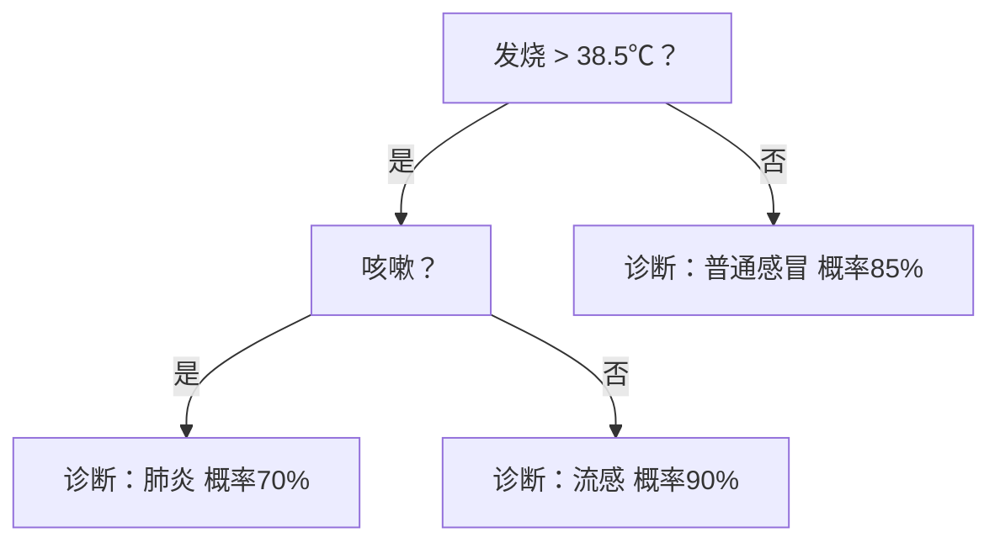

“**单棵树**”（Single Tree）在机器学习中指的就是**一个独立的决策树模型**（Decision Tree），它是构建更复杂模型（如随机森林、GBDT）的**基础单元**。以下是清晰易懂的解释：

---

### **1. 核心定义**
- **单棵树 = 一个决策树模型**  
  由**根节点、内部节点（分支）、叶子节点**组成的树形结构，像一棵倒挂的树。
- **示例**：  
  ```mermaid
  graph TD
    A[根节点：血量 > 50%？] 
    A -->|是| B[内部节点：武器等级 > 3？]
    A -->|否| C[叶子节点：胜率 10%]
    B -->|是| D[叶子节点：胜率 90%]
    B -->|否| E[叶子节点：胜率 60%]
  ```
  这就是一棵完整的“单棵树”，可直接用于预测。

---

### **2. 单棵树的特点**
| **特性**          | **说明**                                                                 |
|--------------------|--------------------------------------------------------------------------|
| **结构简单**       | 规则清晰可见（如“血量>50% 且 武器等级>3 → 胜率90%”）                     |
| **训练速度快**     | 相比深度学习模型，单棵树训练仅需秒/毫秒级                                |
| **预测成本低**     | 预测时只需从根节点走到叶子节点（时间复杂度=树深度）                      |
| **可解释性极强**   | 可直接展示决策逻辑（医疗/金融领域常用）                                  |
| **容易过拟合**     | 树深度太大时，会死记硬背训练数据中的噪声（需剪枝）                       |

---

### **3. 单棵树 vs 集成方法**
| **对比项**       | **单棵树**                          | **随机森林（多棵树）**                     |
|------------------|-------------------------------------|-------------------------------------------|
| **模型数量**     | 1棵树                               | 成百上千棵树                              |
| **预测方式**     | 直接由叶子节点输出结果              | 综合所有树的预测结果（投票或平均）         |
| **随机性**       | 无随机性（除非用随机参数训练）       | 训练时随机抽样本、抽特征                  |
| **稳定性**       | 对数据敏感，波动大                  | 多棵树抵消噪声，更稳定                    |
| **可解释性**     | ⭐⭐⭐⭐⭐ 完全透明                      | ⭐☆☆☆☆ 黑盒（无法直观展示千棵树逻辑）       |

---

### **4. 单棵树如何训练？**
以分类任务为例：
1. **从根节点开始**：  
   遍历所有特征，找到最佳分裂点（如“血量>50%”能使数据纯度提升最多）。
2. **递归分裂**：  
   对每个子节点重复上述过程，直到满足停止条件（如树深度=5、节点样本数<10）。
3. **生成叶子节点**：  
   停止分裂的节点成为叶子节点，记录该节点内样本的类别比例（如90%胜率）。

---

### **5. 单棵树如何预测？**
- **输入**：一个新样本（如玩家数据：血量=70%，武器等级=2）。
- **流程**：  
  1. 从根节点出发，按条件判断走向子节点（血量70%>50% → 是）  
  2. 到达内部节点（武器等级2<3 → 否）  
  3. 最终落入叶子节点 → 输出 **胜率60%**（确定性结果，无随机性！）

---

### **6. 什么场景适合用单棵树？**
- **需要模型透明解释**：  
  银行拒绝贷款时需展示具体规则（“收入<3万且负债>50万 → 拒绝”）。  
- **低算力设备部署**：  
  物联网设备（树预测仅需if-else判断）。  
- **快速验证特征有效性**：  
  观察树分裂时优先选哪些特征，判断特征重要性。  
- **教育演示**：  
  入门机器学习的“教科书式模型”。

---

### 举个实际例子
**医疗诊断单棵树**：

- **医生可理解**：规则符合医学逻辑。  
- **患者可信任**：知道诊断依据（“我高烧且咳嗽，所以疑似肺炎”）。

---

### 总结
**单棵树 = 一个独立工作的决策树模型**：  
- ✅ **优点**：简单、快速、透明、易部署。  
- ⚠️ **缺点**：容易过拟合，复杂问题表现不如随机森林/神经网络。  
- 💡 **关键认知**：  
  > 它输出的概率（如90%胜率）是叶子节点内**训练数据的统计值**，  
  > **无需随机数**参与预测过程！

当你说“用决策树预测”却未指定随机森林时，默认指的就是**单棵树**。它是理解所有树相关模型的地基！