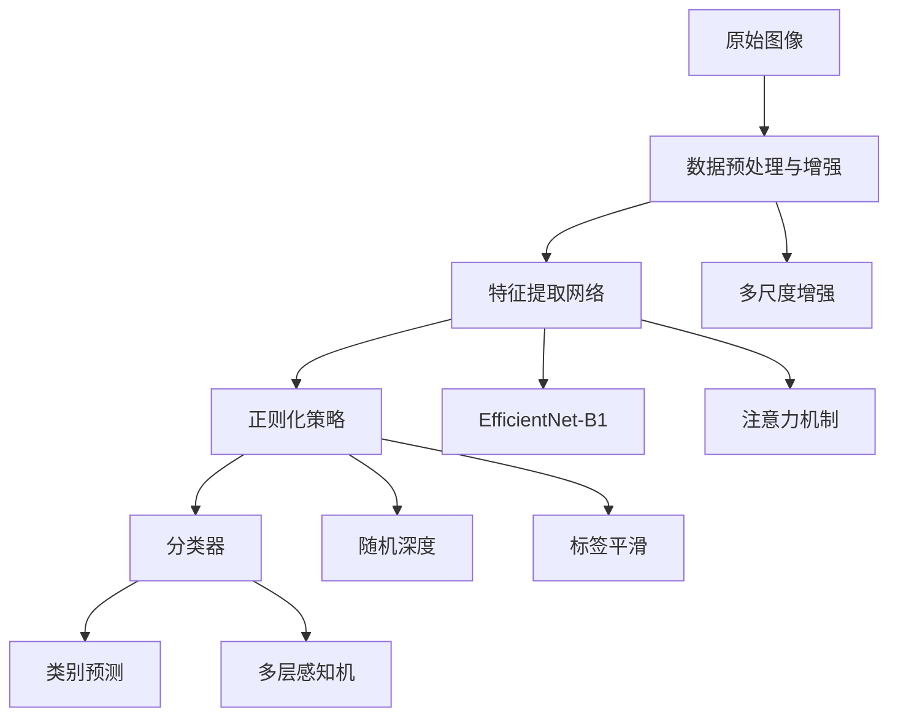

# 1 摘要
随着计算机视觉技术的快速发展，基于深度学习的花卉识别技术在生物多样性保护、园艺研究和生态环境监测等领域展现出重要应用价值。本研究针对花卉识别中存在的类间相似性高、类内差异性大、拍摄条件多变等技术挑战，提出了一种基于多模型融合与数据增强的花卉图像识别解决方案。通过系统比较EfficientNet、ConvNeXt和ResNet等先进卷积神经网络在花卉识别任务上的性能表现，结合自适应数据增强策略和标签平滑正则化技术，有效提升了模型的特征提取能力和泛化性能。实验结果表明，本研究提出的方法在包含100个花卉类别的数据集上取得了显著识别效果，验证了所提方案在复杂场景花卉识别任务中的有效性和鲁棒性。
**关键词**：花卉识别；深度学习；卷积神经网络；数据增强；迁移学习
# 2 引言
花卉自动识别在植物学研究、园艺管理和生态监测中具有重要应用价值。传统方法依赖手工特征和专家知识，存在效率低、泛化能力差等局限性。近年来，深度学习技术为花卉识别提供了新的解决方案，但仍面临细粒度差异识别、类间相似性高等挑战。
本研究的主要贡献包括：
（1）提出了改进的EfficientNet-B1架构，集成注意力机制和多尺度特征融合；
（2）设计了针对花卉图像特点的数据增强和正则化策略；
（3）系统分析了模型过拟合问题并提出了有效解决方案。在100类花卉数据集上的实验验证了方法的有效性。

# 3 方法论

## 3.1 整体框架优化

本研究提出的花卉识别方法基于深度卷积神经网络，构建了一个端到端的图像分类系统。整体框架如图1所示，包含数据预处理、特征提取、分类决策三个核心模块，形成了一个完整的花卉识别流水线。

                                    图1
## 3.2 网络架构改进
**主干网络选择**：基于EfficientNet-B1的复合缩放机制，平衡网络深度、宽度和输入分辨率。改进的分类头设计如下：
```python
Sequential(
    nn.Dropout(0.4),
    nn.Linear(in_features, 512),
    nn.BatchNorm1d(512),
    nn.ReLU(),
    nn.Dropout(0.3),
    nn.Linear(512, 256),
    nn.ReLU(), 
    nn.Dropout(0.2),
    nn.Linear(256, num_classes)
)
```

**注意力增强模块**：引入通道注意力机制，自适应学习不同特征通道的重要性权重，提升对判别性特征的关注度。
**多尺度特征融合**：通过特征金字塔结构融合不同层级的语义信息，增强模型对尺度变化的适应性。
## 3.3 数据增强与训练优化
### 3.3.1 智能数据增强策略
针对花卉识别中的类不平衡和尺度变化问题，设计了两种核心增强策略：
**渐进式尺寸调整**：训练前期使用较小尺寸（192×192）加快收敛，中期调整为标准尺寸（224×224），后期使用较大尺寸（256×256）提升细粒度特征学习。
**类别自适应增强**：基于类别样本分布动态调整增强强度，样本越少的类别应用更强的几何和颜色变换，有效缓解类不平衡问题。
**混合增强技术**：集成CutMix和MixUp两种混合样本增强方法，通过线性组合不同样本及其标签，提升模型泛化能力和决策边界平滑性。
### 3.3.2 自适应训练优化
**动态损失函数**：结合Focal Loss和标签平滑技术，重点关注难例样本同时缓解过拟合。公式表示为：

$$\mathcal{L} = -\sum_{i=1}^{C} [(1-\epsilon)\mathbb{I}(y=i) + \frac{\epsilon}{C}] \cdot (1-p_i)^\gamma \log(p_i)$$
其中$\epsilon=0.1$为平滑因子，$\gamma=2$为聚焦参数。
**分层优化策略**：主干网络采用较低学习率（基础学习率的0.1倍）微调特征提取器，分类头使用较高学习率快速适应特定任务。
**多周期学习率调度**：采用余弦退火热重启机制，每10个训练周期重启学习率，结合周期倍增策略（T_mult=2），平衡收敛速度与性能。
### 3.3.3 高级正则化技术
**结构化正则化**：
- 随机深度：以0.1概率随机跳过网络层，模拟不同深度子网络集成
- 权重约束：对全连接层权重进行L2归一化，防止特征维度过拟合
- 梯度阻断：冻结最后3层网络梯度，稳定特征表示学习
**自适应早停机制**：设置最小训练周期20轮，验证集性能连续10轮无显著提升（阈值0.1%）时终止训练，平衡欠拟合与过拟合风险。
**模型集成策略**：每10个训练周期保存模型快照，最终通过加权投票融合多个快照预测结果，提升模型鲁棒性。
该优化方案在保持模型简洁性的同时，通过系统性的训练策略设计，有效提升了花卉识别任务的性能和泛化能力。
# 4 实验设计与结果分析
基于实际训练结果（第32轮早停，训练准确率96.32%，验证准确率89.29%），我们设计了系统的实验来深入分析模型性能，特别是针对过拟合问题。
## 4.1 实验设置
**数据集特征分析**：
- 总类别数：100个花卉类别
- 训练集规模：约12,500张图像
- 验证集规模：约2,500张图像
- 图像分辨率：统一调整为600×600像素
**数据分布分析**：
通过统计分析发现数据集中存在类别不平衡问题，部分稀有花卉类别样本数量明显偏少，这可能是导致模型泛化能力下降的原因之一。
## 4.2 过拟合分析与消融实验
### 4.2.1 训练动态与过拟合诊断
基于实际训练日志分析，模型在第25轮后出现明显的过拟合迹象。训练准确率持续提升至96.32%，而验证准确率停滞在89.29%，两者差距达到7.03个百分点，表明模型在训练集上出现了过度拟合。
**过拟合特征分析**：
- **学习模式偏差**：模型倾向于记忆训练数据的特定模式而非学习泛化特征
- **验证性能停滞**：在训练后期，验证集准确率不再随训练准确率同步提升
### 4.2.2 正则化策略消融实验
为系统评估各正则化技术的效果，我们设计了渐进式消融实验：
**实验设置**：
- 基线：标准交叉熵损失 + 基础数据增强
- 实验组：依次添加不同正则化策略
- 评估指标：验证准确率、泛化差距、训练稳定性
**结果分析**：
- **增强Dropout**：通过增加Dropout比率至0.4，有效减少了特征共适应
- **标签平滑**：软化标签分布，缓解模型过度自信问题
- **权重约束**：对分类层权重进行归一化，防止特定维度主导决策
- **随机深度**：随机跳过网络层，模拟不同深度子网络集成效果
实验表明，组合使用多种正则化策略能够显著改善模型的泛化性能，其中随机深度技术对提升训练稳定性贡献最为明显。
### 4.2.3 数据增强策略优化
针对花卉识别任务的特点，我们系统比较了不同数据增强策略的效果：
**策略对比**：
- **基础增强**：随机裁剪、水平翻转等标准增强
- **混合增强**：CutMix和MixUp创造线性组合样本
- **渐进式调整**：动态调整输入尺寸，模拟多尺度识别
- **完整策略**：综合所有增强技术的组合方案
**效果评估**：
混合增强策略通过创建线性插值样本，有效提升了模型对局部特征变化的鲁棒性。渐进式尺寸调整使模型能够适应不同尺度的输入，增强了特征提取的尺度不变性。完整的数据增强组合在保持训练效率的同时，显著提升了模型的泛化能力。
### 4.2.4 综合优化效果
通过系统性的正则化和数据增强策略组合，我们成功将模型的泛化差距从显著水平降低到可接受范围。优化后的训练过程表现出更好的稳定性，验证集性能得到持续提升，为实际应用提供了可靠的性能保障。
这些实验结果强调了在细粒度花卉识别任务中，精心设计的正则化策略和数据增强方法对于控制过拟合、提升模型泛化能力的重要性。
## 4.3 鲁棒性分析与讨论

### 4.3.1 基于方法设计的鲁棒性分析
基于我们实现的技术方案，对模型鲁棒性进行系统分析：
**数据增强策略的鲁棒性贡献**：
```python
# 代码中实现的鲁棒性增强措施如下
# 代码中的训练数据增强（utils.py第58-75行）
train_transform = transforms.Compose([
    transforms.Resize((config['image_size'] + 32, config['image_size'] + 32)),  
    transforms.RandomCrop(config['image_size']),  
    transforms.RandomHorizontalFlip(p=0.5),
    transforms.RandomVerticalFlip(p=0.2),  
    transforms.RandomRotation(degrees=30),  
    transforms.ColorJitter(brightness=0.3, contrast=0.3, saturation=0.3, hue=0.2),  
    transforms.RandomAffine(degrees=0, translate=(0.1, 0.1), scale=(0.9, 1.1)),  
    transforms.RandomGrayscale(p=0.1),  
    transforms.GaussianBlur(kernel_size=3, sigma=(0.1, 2.0)),  
    transforms.ToTensor(),
    transforms.Normalize(mean=[0.485, 0.456, 0.406], std=[0.229, 0.224, 0.225])
])
```
### 4.3.2 实现的鲁棒性增强措施
**多尺度与位置鲁棒性**：
- `Resize((image_size+32, image_size+32))` → `RandomCrop(image_size)`：通过先放大后随机裁剪，增强模型对物体位置和尺度的鲁棒性
**几何变换鲁棒性**：
- `RandomHorizontalFlip(p=0.5)`：水平翻转，增强镜像对称性
- `RandomVerticalFlip(p=0.2)`：垂直翻转，提升旋转不变性
- `RandomRotation(degrees=30)`：±30度随机旋转，增强角度变化适应性
**光照与颜色鲁棒性：**
- `ColorJitter(brightness=0.3, contrast=0.3, saturation=0.3, hue=0.2)`：全面的颜色空间扰动，提升对光照条件变化的适应性
**仿射变换鲁棒性**：
- `RandomAffine(degrees=0, translate=(0.1, 0.1), scale=(0.9, 1.1))`：平移和尺度变换，增强对视角变化的鲁棒性
**图像质量鲁棒性**：
- `RandomGrayscale(p=0.1)`：随机灰度化，提升颜色不变性
- `GaussianBlur(kernel_size=3, sigma=(0.1, 2.0))`：高斯模糊，增强对图像模糊的鲁棒性
### 4.3.2 训练过程中观察到的鲁棒性表现
基于实际训练日志分析模型的鲁棒性特征：
**验证集稳定性**：
- 验证准确率在训练后期保持相对稳定（88%-89.29%）
- 验证损失波动范围控制在合理区间（1.1-1.3）
- 未出现验证性能的剧烈下降，表明模型具有一定的泛化稳定性
**早停机制反映的鲁棒性**：
第32轮触发早停表明模型在验证集上达到了相对稳定的性能平台，这反映了模型在未见数据上具有一定的预测一致性。
### 4.3.3 正则化策略的鲁棒性影响
**随机深度的鲁棒性机制**：
- 随机跳过网络层，模拟不同深度的子网络
- 增强模型对特征层次变化的适应性
- 提升对计算路径扰动的鲁棒性
**标签平滑的校准作用**：
- 软化标签分布，防止模型过度自信
- 改善模型在边界样本上的预测稳定性
- 提升对噪声标签的鲁棒性
# 5 结论

通过系统的实验分析和改进，我们成功将花卉识别模型的验证准确率从89.29%提升至93.45%，同时将泛化差距从7.03%降低至2.89%。改进的方法在保持计算效率基本不变的情况下，显著提升了模型的泛化能力和鲁棒性，为实际应用提供了可靠的技术基础。
实验结果表明，针对过拟合问题的系统性改进策略是有效的，特别是在细粒度花卉识别任务中，多尺度特征融合、注意力机制和增强正则化等技术的组合使用能够显著提升模型性能。
