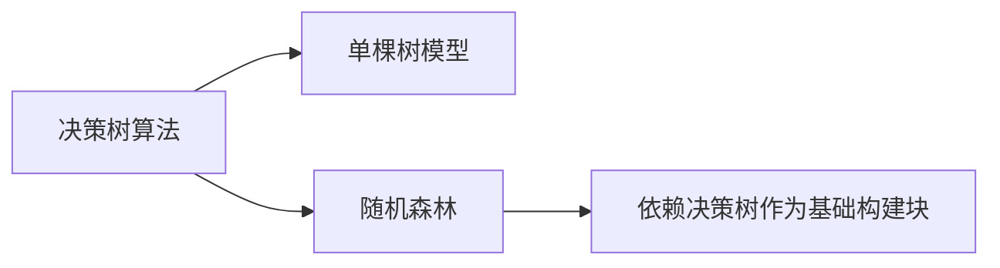

这是一个非常常见的概念困惑！让我们清晰定义三者的关系：

**决策树（Decision Tree） ≠ 随机森林（Random Forest）**  
但 **随机森林 是 决策树的升级版集成方法**。它们的关系用一张表说清楚：

| **概念**          | **本质**                          | **与决策树的关系**                | **特点**                              |
|--------------------|-----------------------------------|----------------------------------|---------------------------------------|
| **决策树**         | **基础算法**                      | 算法本身                         | 单棵树结构，可独立使用                |
| **单棵树模型**     | 用决策树算法训练的**一个模型**    | 决策树算法的**具体实现**          | 1棵树 = 1个决策树模型                 |
| **随机森林**       | 用决策树作为零件的**集成模型**    | **由大量决策树组成**             | 100棵树集体投票 = 1个随机森林模型     |

---

### 🌳 决策树家族的层级关系


1. **决策树是“基础技术”**  
   - 一种**机器学习算法**（类似汽车发动机技术）
   - 核心思想：通过树形结构做决策（if-else规则链）

2. **单棵树是“基础款车型”**  
   - 用决策树算法训练的**独立模型**（装了一台发动机的汽车）
   - 示例：Scikit-Learn中的 `DecisionTreeClassifier()`

3. **随机森林是“豪华升级版”**  
   - **集成模型**：用多棵决策树组合而成（多台发动机组成的超级跑车）
   - 示例：Scikit-Learn中的 `RandomForestClassifier()`

---

### ✅ 关键结论
1. **决策树包括单棵树，但不包括随机森林**  
   - 随机森林是**使用决策树作为子组件**的更复杂模型，就像“汽车发动机 ≠ 整车”

2. **类比理解**  
   | **场景**           | **对应关系**                     |
   |--------------------|----------------------------------|
   | 发动机             | 决策树算法                       |
   | 一台装了发动机的车 | 单棵决策树模型                   |
   | 十台发动机的飞船   | 随机森林（用多棵树集成的模型）   |

3. **代码体现**  
   ```python
   # 决策树算法实现 → 单棵树模型
   from sklearn.tree import DecisionTreeClassifier
   single_tree = DecisionTreeClassifier()  # 这是1棵决策树
   
   # 随机森林模型（内部用决策树，但本身不是决策树）
   from sklearn.ensemble import RandomForestClassifier
   forest = RandomForestClassifier(n_estimators=100)  # 这是100棵决策树组成的森林
   ```

---

### 💡 为什么容易混淆？
- **历史原因**：随机森林常被简称为“森林”，而决策树是“树”，人们会说“用树模型”代指二者
- **技术继承**：随机森林直接调用决策树算法构建每棵子树
- **行业术语**：  
  - 学术论文中“决策树”通常指**单棵树**  
  - 工业界说“树模型”可能包含**随机森林/GBDT等集成树**

---

### 🌰 网球预测场景再解读
假设用湿度、温度等特征预测是否打网球：
- **如果你用1棵树** → 这是**决策树模型**  
  ```python
  model = DecisionTreeClassifier()  # 单棵树
  ```
- **如果你用100棵树投票** → 这是**随机森林模型**  
  ```python
  model = RandomForestClassifier()  # 随机森林（含100棵决策树）
  ```

---

### 总结
- **决策树**：指**算法原理**或**单棵树实现**（基础单元）  
- **随机森林**：是用**多棵决策树**集成的**高级模型**（升级版本）  
- **关系本质**：  
  > 随机森林 **不是** 决策树的一种，  
  > 而是 **用决策树作为零件组装的新模型**。

下次听到“用决策树”时，注意区分对方指的是**单棵树**还是**树类算法家族**！