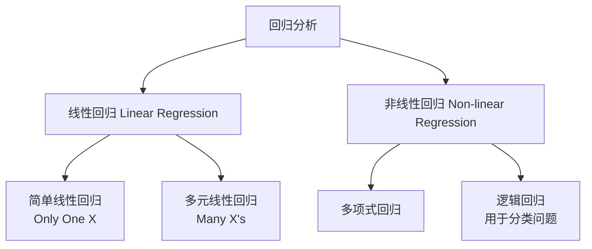
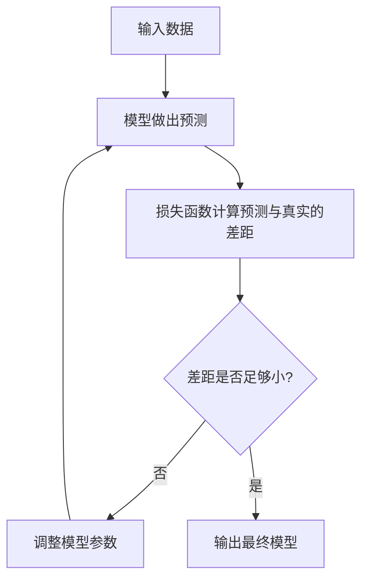
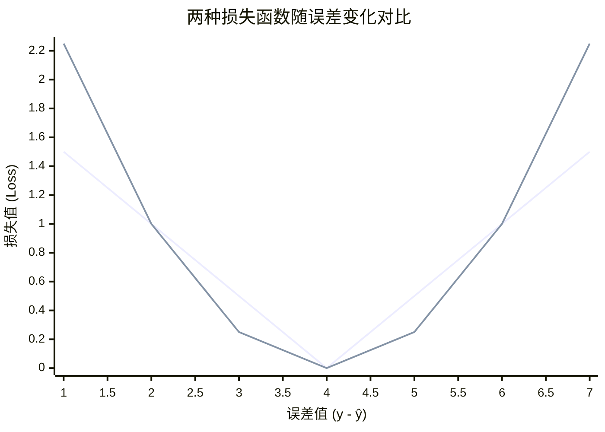
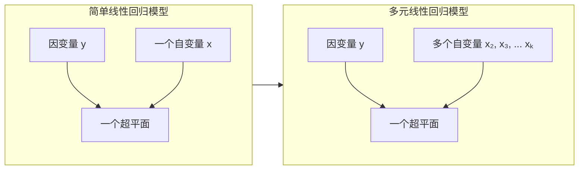
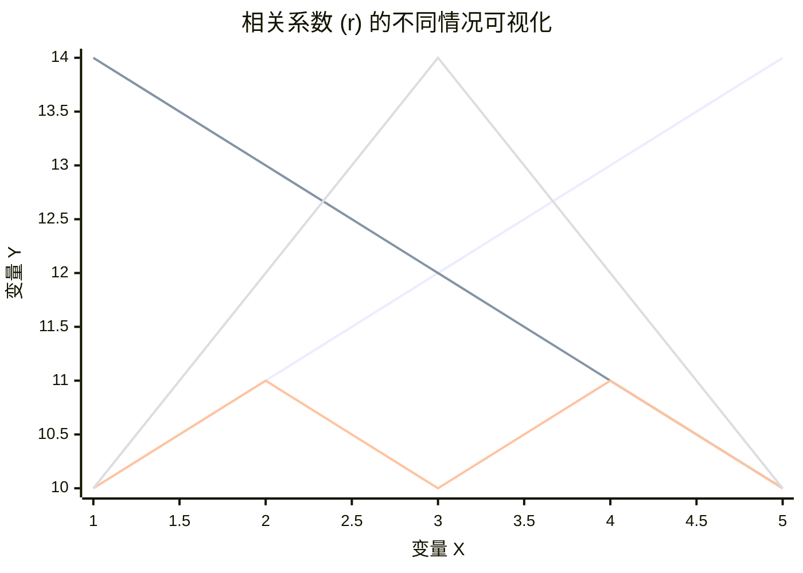
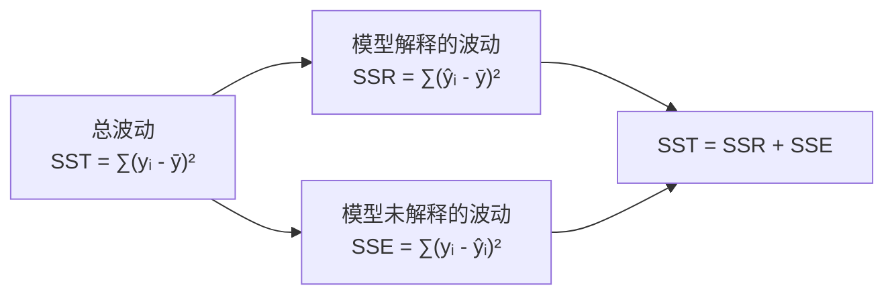

### 一、什么是回归分析？

#### 1.1 核心思想（大白话版）

想象一下，你发现每天早上被闹钟吵醒的次数(`X`)和当天的心情糟糕程度(`Y`)似乎有关系。闹钟响的次数越多，心情越差。**回归分析**就是帮你把这句“似乎有关系”变成一个准确的数学公式的工具。

> **比如**：`心情糟糕程度 = 0.5 + 2 × 闹钟响起次数`
>
> 有了这个公式，你就能**预测**：如果闹钟响了3次，心情糟糕程度大概是 `0.5 + 2×3 = 6.5` 级。

所以，回归分析的本质是：**通过数据，找出自变量(X)和因变量(Y)之间的“关系函数”**，从而用于预测和解释。

#### 1.2 正式定义与核心概念

**回归分析（Regression Analysis）** 是一种统计学上分析数据的方法，旨在研究一个或多个**自变量（Independent Variable）** 与一个**因变量（Dependent Variable）** 之间的依存关系。

- **因变量 (Dependent Variable, Y)**：我们最关心的、想要**预测或解释**的那个结果。
  - *例子：房价、考试成绩、用户满意度*
- **自变量 (Independent Variable, X)**：我们认为是**原因**或**影响因素**的变量。
  - *例子：房屋面积、学习时间、平台交互性*

它们之间的关系可以概括为：

#### 1.3 回归分析能做什么？

1.  **预测（Prediction）**：根据已知的X，预测未知的Y。
    - *例如：根据房屋面积、地段预测房价*
2.  **解释（Explanation）**：量化X对Y的影响程度。
    - *例如：学习时间每增加1小时，考试成绩平均能提高几分？*
3.  **控制（Control）**：通过调整X，来控制Y的结果。
    - *例如：调整广告投入，将销量控制在目标范围内*

#### 1.4 常见的回归类型

---

### 二、简单线性回归（Simple Linear Regression）

#### 2.1 核心思想（大白话版）

**简单线性回归**是回归分析中最简单的形式，它只研究**一个自变量(X)** 和**一个因变量(Y)** 之间的关系，而且假设它们的关系是**一条直线**。

> **终极目标**：从一堆散乱的数据点中，找到一条“最合适”的直线，用来描述X和Y的关系。

这条直线的方程就是我们初中就学过的：
$$Y = kX + b$$
在统计学里，我们把它写成：
$$\hat{y} = b_1 + b_2x$$
- $\hat{y}$ (y-hat)：是**预测值**，是模型认为当X是x时，Y应该的值。
- $b_1$：是**截距（Intercept）**，即直线与Y轴的交点。
- $b_2$：是**斜率（Slope）**，表示X每增加1个单位，Y会变化多少。

#### 2.2 如何找到这条“最佳”直线？—— 损失函数

我们的目标是让直线的预测值 $\hat{y_i}$ 和真实值 $y_i$ 尽可能接近。它们的差距称为**误差（Error）** 或**残差（Residual）**：$e_i = y_i - \hat{y_i}$。

但每个点都有一个误差，如何衡量整条直线的总误差呢？我们不能简单地把所有误差加起来（因为正负误差会抵消）。所以，我们采用**误差平方和（Sum of Squared Errors, SSE）** 作为**损失函数（Loss Function）**：

$$SSE = \sum_{i=1}^{n} e_i^2 = \sum_{i=1}^{n} (y_i - \hat{y_i})^2 = \sum_{i=1}^{n} (y_i - (b_1 + b_2x_i))^2$$

> **大白话解释**：损失函数就像一条直线的“犯错总分”。我们把每个点的预测误差进行平方（消除正负影响）然后加起来。总分越低，说明这条直线拟合得越好，犯的错误越小。

所以，“最佳”直线就是那个能让**SSE**这个总分最小的那条直线。

#### 2.3 如何求解？—— 最小二乘法（Least Squares）

怎么找到使SSE最小的 $b_1$ 和 $b_2$ 呢？最经典的方法叫**最小二乘法（Least Squares）**。这是一个严格的数学推导过程，通过对SSE分别求 $b_1$ 和 $b_2$ 的偏导数并令其为零，可以解出以下最优解：

$$b_2 = \frac{\sum_{i=1}^{n} (x_i - \bar{x})(y_i - \bar{y})}{\sum_{i=1}^{n} (x_i - \bar{x})^2}$$
$$b_1 = \bar{y} - b_2\bar{x}$$

- $\bar{x}$ 是自变量X的均值
- $\bar{y}$ 是因变量Y的均值

> **大白话解释**：最小二乘法就像一套标准的“寻宝指令”，只要你输入数据X和Y，按照这两个公式一步步计算，就一定能找到那个独一无二的“宝藏”（最佳参数 $b_1$ 和 $b_2$）。

#### 2.4 一个简单的例子

假设我们研究学习时间(X)和考试成绩(Y)的关系，有5个数据点：

| 学习时间 (x) | 1   | 2   | 3   | 4   | 5   |
| :----------- | :-- | :-- | :-- | :-- | :-- |
| 考试成绩 (y) | 50  | 60  | 70  | 80  | 90  |

我们很容易看出这存在完美的线性关系：$y = 40 + 10x$
让我们用最小二乘法公式来验证一下：
- $\bar{x} = 3$, $\bar{y} = 70$
- 计算分子：$(1-3)(50-70) + (2-3)(60-70) + ... + (5-3)(90-70) = 100$
- 计算分母：$(1-3)^2 + (2-3)^2 + ... + (5-3)^2 = 10$
- $b_2 = 100 / 10 = 10$
- $b_1 = 70 - 10×3 = 40$

果然，我们得到了模型：$\hat{y} = 40 + 10x$。这意味着：
- **截距 $b_1=40$**：即使学习时间为0，也可能有40分的基础分数（可能是蒙对的）。
- **斜率 $b_2=10$**：学习时间每增加1小时，考试成绩平均提高10分。

#### 2.5 总结与联系

**简单线性回归**是**回归分析**大厦中最基础、最重要的一块砖。它用一条直线来描述两个变量之间的关系，通过**最小化误差平方和（SSE）** 这一损失函数，使用**最小二乘法**可以精确地找到这条最佳直线。

理解了它，就为你学习更复杂的**多元线性回归**（多个X）和**非线性回归**打下了坚实的基础。

好的，我们开始对**损失函数（Loss Function）** 进行系统、深入且通俗的讲解。

---

### 三、损失函数（Loss Function）

#### 3.1 核心思想（大白话版）

想象一下你在玩一个“蒙眼飞镖”游戏。你的目标是击中靶心。你每投出一支飞镖，教练就会告诉你偏离了靶心多远（比如5厘米）。这个“偏离的距离”就是你这**一次投掷的损失（Loss）**。

**损失函数**就是这个“教练”。它的**核心职责**是：
> **衡量模型（Machine Learning Model）的预测值 $\hat{y}$ 与真实值 $y$ 之间的差距（即误差）有多大。**

在回归分析中，我们的目标就是找到一组模型参数（比如简单线性回归中的 $b_1$ 和 $b_2$），使得这个“差距的总分”最低。

#### 3.2 为什么需要损失函数？

损失函数是**所有有监督机器学习模型学习的“指南针”**或“灯塔”。
- 它提供了一个**明确、可量化的目标**：最小化损失。
- 模型通过看损失函数的值，就知道自己“错得有多离谱”，从而知道该往哪个方向调整参数才能“错得更少”。
- **没有损失函数，模型就失去了学习和优化的方向。**

#### 3.3 回归问题中常见的损失函数

对于回归问题，有多种方式可以衡量误差。下图对比了两种主流的损失函数衡量误差的方式：

##### 1. 平方损失函数 / L2损失（Squared Loss / L2 Loss）
这是回归问题中**最常用**的损失函数，也就是我们之前提到的**误差平方和（SSE）** 的原型。

- **单个样本的损失**：$L(y, \hat{y}) = (y_i - \hat{y_i})^2$
- **整个数据集的损失（总成本）**：
$$J(b_1, b_2) = \frac{1}{2n}\sum_{i=1}^{n} (y_i - \hat{y_i})^2 = \frac{1}{2n}\sum_{i=1}^{n} (y_i - (b_1 + b_2x_i))^2$$

> **公式说明**：
> - 有时会乘以 $\frac{1}{2}$ 是为了后续求导时抵消平方项产生的系数2，简化计算。
> - 除以 $n$ 表示求**平均误差**，这样不同大小的数据集之间可以公平比较。这个平均值也称为**均方误差（MSE, Mean Squared Error）**。

**特点**：
- **放大大误差**：从上面的图表可以看出，误差越大，平方后的惩罚会急剧增大（呈二次曲线增长）。这使得模型对**离群点（Outliers）** 非常敏感。
- **处处可导**：这是一个“光滑”的凸函数，利于使用梯度下降等优化算法找到最优解。

##### 2. 绝对损失函数 / L1损失（Absolute Loss / L1 Loss）
另一种直观的思路是直接计算误差的绝对值。

- **单个样本的损失**：$L(y, \hat{y}) = |y_i - \hat{y_i}|$
- **整个数据集的损失**：
$$J(b_1, b_2) = \frac{1}{n}\sum_{i=1}^{n} |y_i - \hat{y_i}|$$
这也被称为**平均绝对误差（MAE, Mean Absolute Error）**。

**特点**：
- **对离群点更鲁棒**：从图表中看，它的增长是线性的，对大误差的惩罚不像L2那样剧烈。因此，当数据中存在离群点时，L1损失表现更稳定。
- **在零点不可导**：这是一个“有棱角”的函数，在零点处无法求导，可能需要一些特殊处理。

==注意== 无论是和L1 L2正则化的区别，这是不同的 参考这个[L1L2损失函数和正则化](./L1L2损失函数和正则化.md)
#### 3.4 为什么最常用“误差平方和”？

尽管存在其他选择，但**平方损失（L2）** 因其优异的数学性质成为回归问题的默认选择：

1.  **数学特性完美**：它是一个严格的**凸函数**，这意味着它只有一个全局最低点，没有局部最低点。使用微积分（最小二乘法）可以直接找到这个唯一的最优解。
2.  **计算方便**：平方运算和求导都非常简单。求导后公式简洁明了：
    $\frac{\partial J}{\partial b_2} = -\frac{1}{n}\sum_{i=1}^{n} x_i(y_i - \hat{y_i})$
    $\frac{\partial J}{\partial b_1} = -\frac{1}{n}\sum_{i=1}^{n} (y_i - \hat{y_i})$
    这为梯度下降法提供了清晰的更新方向。
3.  **物理意义清晰**：在统计学中，最小化平方误差等价于在正态分布误差的假设下找到最可能的模型参数（极大似然估计）。

#### 3.5 总结

| 特性 | 平方损失 (L2) | 绝对损失 (L1) |
| :--- | :--- | :--- |
| **公式** | $\sum (y_i - \hat{y_i})^2$ | $\sum \|y_i - \hat{y_i}\|$ |
| **对离群点** | **非常敏感** | **相对鲁棒** |
| **导数性质** | 光滑，处处可导 | 在零点不可导 |
| **求解方式** | 可直接求导（最小二乘法）或梯度下降 | 需使用线性规划等特定方法 |
| **解的唯一性** | 凸函数，有唯一解 | 凸函数，但可能有多个解 |

**核心要点**：
- **损失函数是模型学习的“指挥棒”**，定义了“好”与“坏”的标准。
- **平方损失（L2）** 因其优秀的数学性质成为回归问题的标配，但它对数据中的异常值很敏感。
- **绝对损失（L1）** 对异常值不敏感，但计算上不如L2方便。
- 选择哪种损失函数，取决于你的**数据特性**（是否有大量异常值）和**业务目标**（是否要坚决避免大误差）。

好的，我们开始对**多元线性回归（Multiple Linear Regression）** 进行系统、深入且通俗的讲解。

---

### 四、多元线性回归（Multiple Linear Regression）

#### 4.1 核心思想（大白话版）

**简单线性回归**就像只用“学习时间”这一个因素来预测“考试成绩”。但现实中，结果往往是由**多个因素**共同决定的。

> **例如**：预测房价时，仅仅知道“房屋面积”是不够的。我们还需要考虑“地段”、“卧室数量”、“房龄”等多个因素。
> **多元线性回归**就是用来处理这种**一个因变量**和**多个自变量**之间线性关系的工具。

它的核心思想与简单线性回归一脉相承：**从数据中找到一条“最合适”的直线（或更准确地说，一个“超平面”）来描述多个X与Y之间的关系。**

#### 4.2 从简单到多元：模型的演进

**简单线性回归模型**：
$$\hat{y} = b_1 + b_2x$$
- **1个因变量 (y)**：我们想预测的东西（如：房价）
- **1个自变量 (x)**：我们认为的原因（如：房屋面积）
- **2个参数**：一个截距 $b_1$，一个斜率 $b_2$

**多元线性回归模型**：
$$\hat{y} = b_1 + b_2x_2 + b_3x_3 + ... + b_kx_k$$
- **1个因变量 (y)**：我们想预测的东西（如：房价）
- **k-1 个自变量 ($x_2, x_3, ..., x_k$)**：所有我们认为的原因（如：面积、卧室数、房龄...）
- **k 个参数 ($b_1, b_2, ..., b_k$)**：一个截距，k-1 个斜率（每个自变量对应一个）

其中：
- $b_1$ 是**截距（Intercept）**，表示当所有自变量为0时，因变量的预测基准值。
- $b_2, b_3, ..., b_k$ 称为**偏回归系数（Partial Regression Coefficients）**。
  - **$b_j$ 的含义**：在**控制其他自变量不变**的情况下，$x_j$ 每增加1个单位，因变量y平均变化 $b_j$ 个单位。

> **大白话解释**：$b_2$（例如对于“卧室数量”）衡量的是，在“房屋面积”、“房龄”等其他因素完全一样的情况下，单单多一间卧室会给房价带来多少变化。

#### 4.3 模型的矩阵表示

为了数学上更简洁地处理和计算，我们将模型表示为矩阵形式。假设我们有 n 条数据，k 个参数（包括截距）。

- **因变量向量 (Y)**：包含所有真实值。
  $$Y = \begin{bmatrix} y_1 \\ y_2 \\ \vdots \\ y_n \end{bmatrix}$$

- **设计矩阵 (X)**：第一列通常为1（用于拟合截距 $b_1$），后面是各个自变量的观测值。
  $$X = \begin{bmatrix} 1 & x_{12} & x_{13} & \cdots & x_{1k} \\ 1 & x_{22} & x_{23} & \cdots & x_{2k} \\ \vdots & \vdots & \vdots & \ddots & \vdots \\ 1 & x_{n2} & x_{n3} & \cdots & x_{nk} \end{bmatrix}$$

- **参数向量 ($\beta$)**：包含所有需要求解的参数。
  $$\beta = \begin{bmatrix} b_1 \\ b_2 \\ \vdots \\ b_k \end{bmatrix}$$

- **误差向量 ($\epsilon$)**：包含每个样本的随机误差。
  $$\epsilon = \begin{bmatrix} \epsilon_1 \\ \epsilon_2 \\ \vdots \\ \epsilon_n \end{bmatrix}$$

于是，整个多元线性回归模型可以优雅地写为：
$$Y = X\beta + \epsilon$$

#### 4.4 如何求解？—— 最小二乘法（矩阵版）

我们的目标依然是**最小化误差平方和（SSE）**。

误差平方和同样可以用矩阵表示：
$$SSE = \sum_{i=1}^n e_i^2 = e'e = (Y - X\beta)'(Y - X\beta)$$
其中 $e'$ 是误差向量 $e$ 的转置。

通过对 $\beta$ 求导并令导数为零，我们可以推导出使得SSE最小的最优参数向量的解：
$$\frac{\partial SSE}{\partial \beta} = -2X'Y + 2X'X\beta = 0$$

最终得到**正规方程（Normal Equation）**：
$$X'X\beta = X'Y$$

如果 $(X'X)$ 的逆矩阵存在，我们就可以解出最优参数：
$$\hat{\beta} = (X'X)^{-1}X'Y$$

> **大白话解释**：这个公式就是多元线性回归的“终极宝藏地图”。只要你把数据整理成矩阵X和Y，按照这个公式进行矩阵运算，就能一次性得到所有自变量的最佳系数 $b_1, b_2, ..., b_k$。

#### 4.5 一个清晰的例子：家庭花销预测

假设我们想预测一个家庭每年的快销品开支（Y），并认为它与两个因素有关：**年固定收入($X_2$)** 和 **持有的流动资产($X_3$)**。

我们收集了25个家庭的数据，并构建模型：
$$\hat{y}_i = b_1 + b_2x_{i2} + b_3x_{i3}$$

通过计算 $\hat{\beta} = (X'X)^{-1}X'Y$，我们得到：
$$\begin{bmatrix} b_1 \\ b_2 \\ b_3 \end{bmatrix} = \begin{bmatrix} 36.789 \\ 0.332 \\ 0.125 \end{bmatrix}$$

所以，回归方程为：
$$\hat{y}_i = 36.79 + 0.3318x_{i2} + 0.1258x_{i3}$$

**模型解释**：
- **截距 $b_1=36.79$**：理论上，当一个家庭年固定收入和流动资产都为0时，其年均快销品开支为36.79K$。这主要起数据拟合作用，实际意义不大。
- **系数 $b_2=0.332$**：在**保持流动资产不变**的情况下，年固定收入每增加1K$，年均快销品开支平均增加0.332K$。
- **系数 $b_3=0.126$**：在**保持年固定收入不变**的情况下，流动资产每增加1K$，年均快销品开支平均增加0.126K$。

**预测**：
如果一个家庭年收入为50K$，流动资产为100K$，其预计开支为：
$$\hat{y}_i = 36.79 + 0.3318(50) + 0.1258(100) = 65.96 \, K\$$$

#### 4.6 多元线性回归的基本假设

为了保证模型的可靠性和解释性，它建立在以下几个基本假设之上：
1.  **线性关系**：自变量与因变量之间存在线性关系。
2.  **独立性**：样本数据点之间相互独立。
3.  **无完全多重共线性**：自变量之间不能有高度严格的线性关系（例如，不能用“身高（米）”和“身高（英尺）”同时作为自变量）。
4.  **同方差性**：误差项的方差应为一个常数。
5.  **正态性**：误差项应服从均值为零的正态分布。

**核心要点**：
- **多元线性回归**是简单线性回归的自然扩展，用于处理多个影响因素的现实问题。
- **偏回归系数** $b_j$ 的核心在于“**控制其他变量不变**”的条件下，衡量某个自变量的净效应。
- 矩阵形式 $\hat{\beta} = (X'X)^{-1}X'Y$ 提供了求解所有参数的统一框架。
- 理解每个系数的**实际含义**比单纯预测更重要。
- 应用模型前，需留意其**基本假设**，否则可能导致“垃圾进，垃圾出”。
好的，我们开始对**相关系数（Correlation Coefficient）** 和**决定系数（Coefficient of Determination）** 进行系统、深入且通俗的讲解。

---

### 五、相关系数与决定系数

在建立了回归模型之后，我们迫切需要回答两个问题：
1. 模型中的自变量和因变量**到底有多大的关系**？
2. 这个模型**到底有多好**，它能解释多少问题？

**相关系数 (r)** 和 **决定系数 (R²)** 就是回答这两个问题的黄金指标。

#### 5.1 相关系数 (Correlation Coefficient)

##### 5.1.1 核心思想（大白话版）

相关系数 `r` 是一个衡量**两个变量**之间**线性关系强度**和**方向**的指标。

> **想象一下**：你观察两个人跳交谊舞。
> - **强度**：他们的步伐有多一致？是完全同步（`r=1` 或 `-1`），还是各跳各的（`r=0`）？
> - **方向**：他们是面朝同一方向移动（正相关，`r > 0`），还是一人前进另一人就后退（负相关，`r < 0`）？

**它的取值范围在 -1 到 1 之间 (`-1 ≤ r ≤ 1`)**。

##### 5.1.2 正式定义与计算

最常用的相关系数是**皮尔逊相关系数（Pearson Correlation Coefficient）**。

其计算公式为：
$$r = \frac{\sum_{i=1}^{n} (x_i - \bar{x})(y_i - \bar{y})}{\sqrt{\sum_{i=1}^{n} (x_i - \bar{x})^2} \sqrt{\sum_{i=1}^{n} (y_i - \bar{y})^2}}$$

> **大白话解释公式**：
> 1.  **分子**：`(x - x的平均值) * (y - y的平均值)` 的加和。这实际上是**协方差**，衡量X和Y如何一起变化。
>     - 如果X和Y通常同时高于或同时低于各自的平均值，乘积为正，加和变大。
>     - 如果一个高于均值时另一个低于均值，乘积为负，加和变小。
> 2.  **分母**：分别对X和Y的波动幅度（标准差）进行标准化。这样做的目的是**消除数据本身大小和单位的影响**，使得 `r` 变成一个纯粹的、无单位的数字，可以在不同数据集之间比较。

**注意**：在**简单线性回归**中，相关系数 `r` 的平方就是决定系数 `R²`。并且，斜率 $b_2$ 的符号（正/负）与 `r` 的符号相同。

#### 5.2 决定系数 (Coefficient of Determination, R²)

##### 5.2.1 核心思想（大白话版）

如果说相关系数 `r` 衡量的是两个变量的**关系强度**，那么决定系数 `R²` 衡量的就是你的**回归模型的解释能力**。

> **想象一下**：因变量 `Y` 的波动（变化）就像一场暴雨后的总水量。
> - 你的回归模型就像你挖的**引水渠**。
> - **`R²`** 就表示**你的水渠引走了总水量的百分之多少**。
> - `R² = 0.8` 意味着你的模型（水渠）解释了 `Y` 的波动（水量）的80%。剩下的20%是其他未知因素导致的，模型无法解释。

**它的取值范围在 0 到 1 之间 (`0 ≤ R² ≤ 1`)**，通常用百分比表示。

##### 5.2.2 正式定义与计算：方差分解

决定系数的思想源于对**总波动**的分解。因变量 `Y` 的总波动（总平方和, SST）可以分解为两部分：
1.  **模型解释的波动（回归平方和, SSR）**：由自变量 `X` 引起的 `Y` 的变化。
2.  **模型未能解释的波动（误差平方和, SSE）**：由其他随机因素引起的 `Y` 的变化。

它们的关系如下，可以用一个清晰的流程图表示：

基于这个分解，决定系数 `R²` 的定义就是：
$$R^2 = \frac{SSR}{SST} = \frac{\sum_{i=1}^{n} (\hat{y}_i - \bar{y})^2}{\sum_{i=1}^{n} (y_i - \bar{y})^2} = 1 - \frac{SSE}{SST}$$

> **公式解读**：
> - `R² = SSR / SST`：模型解释的波动占总波动的比例。
> - `R² = 1 - SSE / SST`：1 减去未解释的波动占总波动的比例。这个形式更常用，因为SSE是我们最小化的目标，直接可得。

##### 5.2.3 一个简单的例子

假设我们想用“学习时间”预测“考试成绩”，数据如下：

| 学习时间 (x) | 1   | 2   | 3   | 4   | 5   |
| :----------- | :-- | :-- | :-- | :-- | :-- |
| 考试成绩 (y) | 50  | 60  | 70  | 80  | 90  |

- `Y` 的平均值 $\bar{y} = 70$
- **总波动 (SST)**：$(50-70)^2 + (60-70)^2 + (70-70)^2 + (80-70)^2 + (90-70)^2 = 1000$
- 我们得到完美拟合的模型：$\hat{y} = 40 + 10x$
- **未解释的波动 (SSE)**：$(50-50)^2 + (60-60)^2 + ... + (90-90)^2 = 0$
- **决定系数 R²**：$1 - (0 / 1000) = 1$

这个结果 `R² = 1` 表明“学习时间”这个变量**100%地解释**了“考试成绩”的所有波动。这是一种理想情况。

在现实中，`R²` 永远小于1。例如，如果 `R² = 0.65`，则说明自变量解释了因变量65%的波动，剩下35%的波动源于模型之外的因素。

#### 5.3 极端重要的警告：相关 ≠ 因果

这是统计学和数据分析中**最重要、最常被忽视**的一条准则。

- **相关系数 (r)** 和 **决定系数 (R²)** 只能衡量变量间的**关联强度**，**绝不能证明因果关系**。
- `X` 和 `Y` 相关，可能有多种情况：
  1.  **`X` 导致 `Y`** (因果)
  2.  **`Y` 导致 `X`** (反向因果)
  3.  **某个第三方变量 `Z` 同时导致 `X` 和 `Y`** (混杂因素)

> **经典谬误例子**：
> - 数据发现：冰淇淋销量和溺水死亡人数高度正相关。
> - **谬误结论**：吃冰淇淋导致溺水？（或溺水的人想吃冰淇淋？）
> - **真实原因**：天气炎热（变量 `Z`）！天气越热，吃冰淇淋的人越多，同时去游泳的人也越多，从而导致溺水事件增加。

**记住**：你的模型只能告诉你变量是否一起变化，但不能告诉你为什么这样变化。建立因果关系需要更严谨的实验设计（如随机对照试验）和逻辑推理。

#### 5.4 总结与对比

| 特性 | 相关系数 (r) | 决定系数 (R²) |
| :--- | :--- | :--- |
| **衡量对象** | **两个变量**间的线性关系 | **回归模型**的解释能力 |
| **取值范围** | `[-1, 1]` | `[0, 1]` |
| **方向** | 正负号表示关系方向 | 无方向，始终为正 |
| **关系** | 在简单线性回归中，$R^2 = (r)^2$ | 在简单线性回归中，$R^2 = (r)^2$ |
| **解读** | `\|r\|` 越接近1，线性关系越强 | `R²` 越接近1，模型解释的方差比例越大 |

**核心要点**：
- **`r` 看关系**：看两个变量“共舞”的节奏和方向。
- **`R²` 看模型**：看你的回归模型“引水”的能力有多强。
- **牢记铁律**：无论 `r` 和 `R²` 有多高，都**只能说明相关，无法证明因果**。永远对变量背后的因果关系保持怀疑和探究的心态。