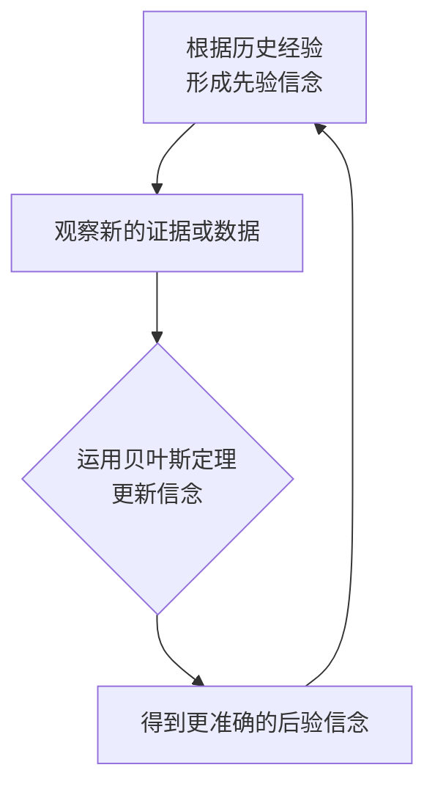
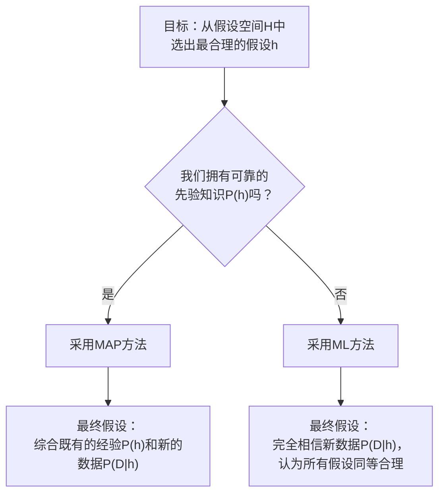
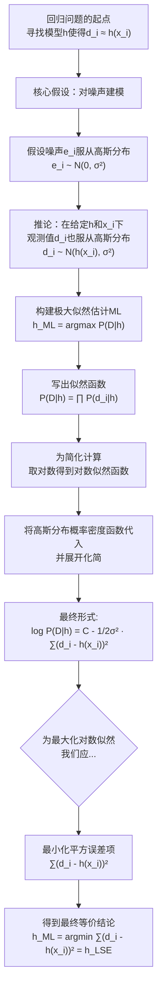
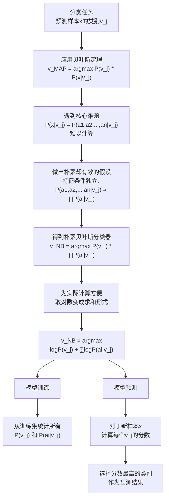
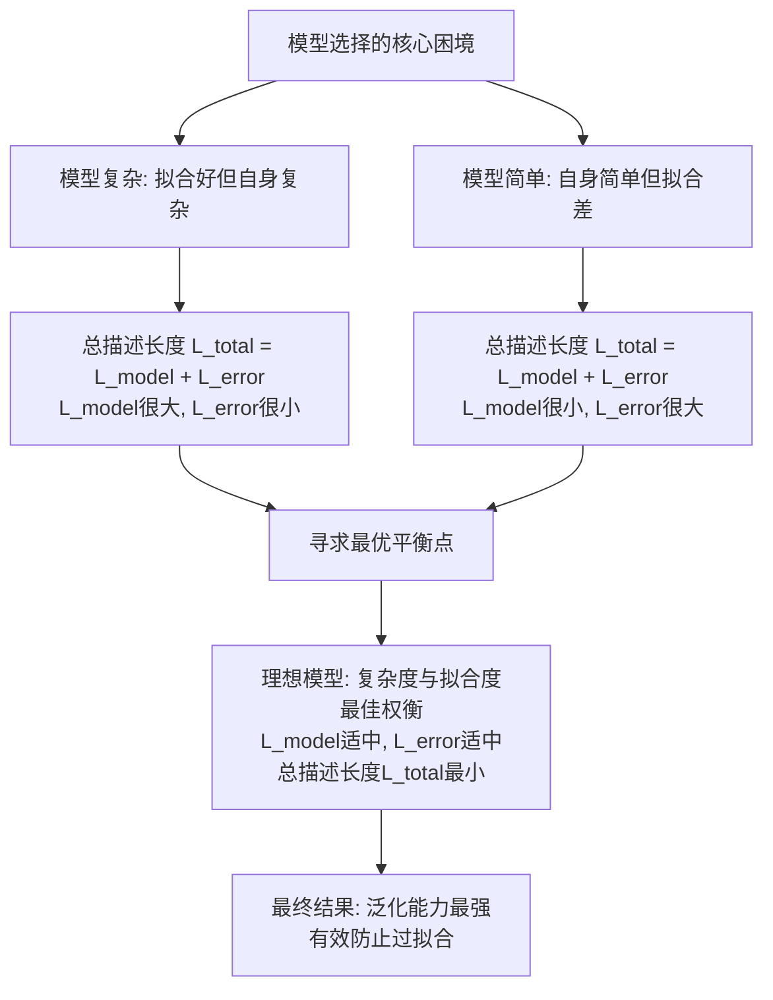

---
### 一、贝叶斯学习的背景：从“因果”到“由果推因”

#### 通俗理解
我们人类的很多决策都基于不确定性。比如，医生看到病人咳嗽（结果），需要判断他是感冒了、肺炎还是肺癌（原因）。直接断定“咳嗽→肺癌”是非常武断的。

传统的思维是**正向的因果思维**：“如果得了肺炎，那么可能会咳嗽”。但这种思维在现实中往往不够用，因为同一个结果可能由无数个原因导致。

**贝叶斯思维**提供了一种**逆向的概率思维**：“我现在看到了你咳嗽这个‘结果’，那么有多大可能性是因为肺炎？又有多大可能性是因为肺癌？” 它要求我们**结合已有的经验（先验知识）和新的证据（观察到的数据）**，来综合评估各个原因的可能性。

**核心思想：** 贝叶斯学习就是一个**不断用新证据更新旧认知**的过程。

#### 核心概念图示
为了让这个“由果推因”的过程更清晰，我们可以通过下面的流程图来理解贝叶斯推理的完整思维框架：

这个过程展示了我们如何从初始认知出发，通过不断融入新信息，循环迭代地提升我们对问题理解的准确度。

---

### 二、贝叶斯定理 (Bayes‘ Theorem)：更新的数学公式

贝叶斯定理是将上述“更新”思想数学化的核心公式。

#### 1. 公式拆解 (The Formula)

$$
P(h|D) = \frac{P(D|h) \cdot P(h)}{P(D)}
$$

这个公式中的每一个部分都有其特定的名称和含义：

*   **$P(h)$：先验概率 (Prior Probability)**
    *   **是什么？** 在看到**新数据 $D$ 之前**，我们对假设 $h$ 为真的初始信念或概率。
    *   **例子：** 在医生诊断之前，我们知道普通人群得某种癌症的概率是 0.008。这就是 $P(癌症)$。

*   **$P(D|h)$：似然度 (Likelihood)**
    *   **是什么？** 在假设 $h$ **为真**的条件下，观察到当前数据 $D$ 的可能性有多大。
    *   **关键：** 它并不是一个概率分布，它衡量的是**合理性**。
    *   **例子：** 在**已知一个人确实得了癌症**的情况下，化验结果为阳性（+）的概率是 0.98。这就是 $P(+|癌症)$。

*   **$P(D)$：证据 (Evidence) 或边际似然 (Marginal Likelihood)**
    *   **是什么？** 在所有可能的情况下，观察到数据 $D$ 的**总概率**。它是一个归一化常数，确保最终的后验概率是一个有效的概率（介于0到1之间）。
    *   **计算：** 通常通过**全概率公式**计算：$P(D) = P(D|h)P(h) + P(D|\neg h)P(\neg h)$。
    *   **例子：** 无论是否得癌，化验结果为阳性（+）的总概率是多少？计算为 $P(+) = P(+|癌症)P(癌症) + P(+|健康)P(健康)$。

*   **$P(h|D)$：后验概率 (Posterior Probability)**
    *   **是什么？** 这是我们**最终追求的目标**。它表示在**看到了数据 $D$ 之后**，我们对假设 $h$ 为真的新信念或概率。
    *   **例子：** 在已知**化验结果为阳性（+）** 的情况下，这个人真正得癌症的概率是多少？这就是 $P(癌症|+)$。

#### 2. 贝叶斯定理的通俗解读

公式可以直观地理解为：

$$
后验概率 = \frac{似然度 \times 先验概率}{证据}
$$

**“信念更新”的过程就是：**
**新信念（后验）** ∝ **新证据的支持程度（似然）** × **旧信念（先验）**

这里的 $\propto$ 表示“正比于”。因为 $P(D)$ 对所有 $h$ 都是一样的，所以在比较不同假设的后验概率时，可以忽略它。这就是为什么在计算 $h_{MAP}$ 时，我们只关心 $P(D|h) \cdot P(h)$。

---

### 三、一个完整的例子：把所有的点串起来

**问题：** 某项癌症检测的准确率为98%（即患癌者检测为阳性的概率）。已知人群中的患病率为0.8%。如果一个人的检测结果是阳性，他真正患癌的概率是多少？

**已知：**
*   $P(癌症) = 0.008$（**先验概率**）
*   $P(\neg 癌症) = 0.992$
*   $P(+|癌症) = 0.98$（**似然度**：真阳性率）
*   $P(-|癌症) = 0.02$（假阴性率）
*   $P(+|\neg 癌症) = 0.03$（假阳性率）（因为准确率97%，所以 $P(-|\neg 癌症)=0.97$）
*   $P(-|\neg 癌症) = 0.97$（真阴性率）

**计算步骤：**

1.  **计算证据 $P(+)$（所有出现阳性的情况）：**
    $$
    P(+) = P(+|癌症)P(癌症) + P(+|\neg 癌症)P(\neg 癌症) = (0.98 \times 0.008) + (0.03 \times 0.992) = 0.00784 + 0.02976 = 0.0376
    $$

2.  **应用贝叶斯定理计算后验概率 $P(癌症|+)$：**
    $$
    P(癌症|+) = \frac{P(+|癌症) \cdot P(癌症)}{P(+)} = \frac{0.98 \times 0.008}{0.0376} = \frac{0.00784}{0.0376} \approx 0.2085
    $$

**结论：**
即使检测结果是阳性，这个人真正患癌的概率也只有 **20.85%**。这个结果远低于大多数人（甚至很多医生）的直觉。原因就在于**先验概率 $P(癌症)$ 非常低**，而假阳性 $P(+|\neg 癌症)$ 的干扰效应被放大（因为健康人群基数非常大）。

**我们必须结合事件的基础概率（先验）和新证据的可靠性（似然），才能做出最合理的判断。**

---
### 一、核心目标：选择一个最合理的假设

在机器学习中，我们有一个假设空间 $H$（即一堆可能的模型或判断），我们观察到了一组数据 $D$。我们的目标是：从 $H$ 中选出**最合理**的那个假设 $h$。

贝叶斯学派提供了两种最重要的选择标准：
1.  **最大后验概率估计 (Maximum A Posteriori, MAP)**
2.  **最大似然估计 (Maximum Likelihood Estimation, ML)**

为了让这两种方法的决策流程更直观，我们可以通过下面的流程图来理解：

---

### 二、最大后验概率估计 (MAP)

#### 1. 定义与公式
MAP 的目标是找到那个在**给定数据 $D$ 的情况下，概率最大的假设 $h$**。这正是我们之前说的**后验概率** $P(h|D)$。

根据贝叶斯定理，我们选择：
$$
h_{MAP} = \arg\max_{h \in H} P(h|D) = \arg\max_{h \in H} \frac{P(D|h)P(h)}{P(D)}
$$

由于 $P(D)$ 是一个与 $h$ 无关的常数，它不会影响比较不同假设时的大小关系。因此，公式可以简化为：
$$
h_{MAP} = \arg\max_{h \in H} P(D|h)P(h)
$$

**白话解读：** MAP 选择的是那个 **“本身就很靠谱”（先验概率 $P(h)$ 高）** 且 **又能很好地解释当前数据”（似然度 $P(D|h)$ 高）** 的假设。它是一种**经验与数据相结合**的稳健选择。

#### 2. 例子：癌症诊断（续）

继续使用之前的癌症诊断例子：
*   **假设 $h_1$**：这位患者得了癌症 ($h_1$ = cancer)
*   **假设 $h_2$**：这位患者没得癌症 ($h_2$ = ¬cancer)
*   **数据 $D$**：检测结果为阳性 (+)

我们已知：
*   $P(h_1) = P(cancer) = 0.008$
*   $P(h_2) = P(\neg cancer) = 0.992$
*   $P(D|h_1) = P(+|cancer) = 0.98$
*   $P(D|h_2) = P(+|\neg cancer) = 0.03$

现在，我们计算两个假设的 $P(D|h)P(h)$：
*   对于 $h_1$ (cancer): $P(+|cancer) \cdot P(cancer) = 0.98 \times 0.008 = 0.00784$
*   对于 $h_2$ (¬cancer): $P(+|\neg cancer) \cdot P(\neg cancer) = 0.03 \times 0.992 = 0.02976$

比较一下，$0.02976 > 0.00784$。因此：
$$
h_{MAP} = \arg\max_{h \in H} [P(D|h)P(h)] = \neg cancer
$$

**结论：** 尽管检测结果是阳性，但MAP估计最终判断患者**没有得癌症**。因为这个判断更符合我们的**先验知识**（患病率极低）和**数据**（测试存在一定的假阳性）。

---

### 三、最大似然估计 (ML)

#### 1. 定义与公式
ML 的目标是找到那个**最能“拟合”当前数据**的假设，即找到最可能**产生**这组数据 $D$ 的假设 $h$。它寻找的是**似然度** $P(D|h)$ 的最大值。

$$
h_{ML} = \arg\max_{h \in H} P(D|h)
$$

**白话解读：** ML 非常**“迷信数据”**。它的原则是：“谁最能解释已经发生的事，我就认为谁是对的”。它完全**忽略了对假设本身靠谱程度的判断**（即先验概率 $P(h)$）。

#### 2. 与 MAP 的关系
ML 是 MAP 的一个**特例**。当假设空间 $H$ 中**所有假设的先验概率 $P(h)$ 都相等**时（即我们认为所有模型在事先都是同等合理的），MAP 就退化成了 ML。

因为如果 $P(h)$ 是常数，那么 $\arg\max P(D|h)P(h)$ 就等价于 $\arg\max P(D|h)$。

#### 3. 例子：抛硬币问题

问题：抛一枚硬币10次，出现7次正面（H），3次反面（T）。估计这枚硬币抛出正面的概率 $p$。

*   **数据 $D$**：7次H，3次T
*   **假设 $h$**：硬币的参数 $p$（$p$ 的取值范围在0到1之间，构成了连续的假设空间）
*   **似然度**：$P(D|p) = p^7 (1-p)^3$

我们要找到那个让 $P(D|p)$ 最大的 $p$。

为了计算方便，通常取对数（对数似然函数），因为乘积取对数后会变成加法，求导更简单：
$$
\log P(D|p) = \log(p^7 (1-p)^3) = 7 \log p + 3 \log (1-p)
$$

对 $p$ 求导并令导数为零，找极大值点：
$$
\frac{d \log P(D|p)}{dp} = \frac{7}{p} - \frac{3}{1-p} = 0
$$

解方程：
$$
\frac{7}{p} = \frac{3}{1-p} \\
7(1-p) = 3p \\
7 - 7p = 3p \\
7 = 10p \\
p = \frac{7}{10} = 0.7
$$

所以，
$$
h_{ML} = p = 0.7
$$

**结论：** 最大似然估计完全根据数据说话，既然10次里出现了7次正面，那就认为抛出正面的概率就是 **0.7**。

---

### 四、MAP vs. ML：核心区别与总结

| 特性 | 最大后验估计 (MAP) | 最大似然估计 (ML) |
| :--- | :--- | :--- |
| **核心思想** | **贝叶斯学派**：考虑先验知识 | **频率学派**：只看实验数据 |
| **公式** | $h_{MAP} = \arg\max P(D\|h)P(h)$ | $h_{ML} = \arg\max P(D\|h)$ |
| **先验概率** | **非常重要**，直接影响结果 | **完全忽略**，或者假设其均匀分布 |
| **观点** | 将参数 $h$ 视为随机变量，有其分布 | 将参数 $h$ 视为一个固定的未知常数 |
| **比喻** | **经验丰富的医生**：结合医学知识（先验）和检查报告（数据）下诊断 | **迷信数据的新手**：只看检查报告，报告显示什么就相信什么 |
| **过拟合** | **不易过拟合**，先验起正则化作用 | **容易过拟合**，尤其数据少时 |

**简单总结：**
-   **当你对问题有较强的先验知识时**（比如你知道某病发病率很低），使用 **MAP** 能做出更合理的判断。
-   **当你对问题一无所知，或者数据量非常庞大**（以至于先验的影响变得微不足道）时，使用 **ML** 是一个简单直接的选择。
-   在机器学习中，MAP 可以看作是 **ML 加上一个正则化项**，这个正则化项就来自于先验分布 $P(h)$，它防止模型过分拟合数据。

---
## **极大似然 与**最小二乘 **
### 一、核心思想：我们是如何看待“误差”的？

机器学习的目标是找到一个模型（函数 $h$），能够根据输入 $x$ 预测输出 $d$。但现实世界中，我们的观测值 $d$ 和模型真实值 $h(x)$ 之间总存在差异，这个差异就是“误差”或“噪声”。

**极大似然估计 (ML)** 和 **最小二乘法 (LSE)** 之所以能统一起来，源于一个关于噪声的**核心假设**：

> 我们假设噪声 $e_i$ 是一个服从均值为零的正态分布（高斯分布）的随机变量。

用数学公式表达这个假设就是：
$$e_i \sim \mathcal{N}(0, \sigma^2)$$

这个假设非常合理且常见：
1.  **均值为零 (Zero Mean)**：意味着噪声没有固定的偏向，不会总是让观测值变大或变小，误差是随机的、无偏的。
2.  **正态分布 (Normal Distribution)**：根据中心极限定理，许多独立随机效应的总和会趋向于正态分布。现实中的很多噪声源（如测量误差、环境干扰）正是由大量微小因素叠加而成。

这个看似简单的假设，是连接概率观点（ML）和几何观点（LSE）的桥梁。整个逻辑推导过程，我们可以通过下图来清晰地展示：

从上图可以看出，整个推导过程环环相扣。因为我们**假设噪声是高斯分布的**，所以观测值 $d_i$ 的概率才可以用高斯分布的概率密度函数来表达。进而，**最大化概率（似然）** 的操作，经过数学变换后，神奇地转化为了**最小化平方误差**的操作。

---

### 二、一个简单的例子：线性回归

假设我们有三个数据点：(1, 2), (2, 3.1), (3, 3.9)。我们想用一条直线 $h(x) = \theta_0 + \theta_1 x$ 来拟合它们。

*   **最小二乘法 (LSE) 的做法**：
    直接找到参数 $\theta_0, \theta_1$，使得损失函数 $J(\theta_0, \theta_1) = (2 - h(1))^2 + (3.1 - h(2))^2 + (3.9 - h(3))^2$ 最小。这是一个纯粹的几何优化问题。

*   **极大似然估计 (ML) 的做法**：
    1.  **假设**：真实数据由 $d_i = (\theta_0 + \theta_1 x_i) + e_i$ 生成，其中 $e_i \sim \mathcal{N}(0, \sigma^2)$。
    2.  **构建似然函数**：
        $$P(D | \theta_0, \theta_1) = \prod_{i=1}^{3} \frac{1}{\sqrt{2\pi\sigma^2}} \exp\left(-\frac{(d_i - (\theta_0 + \theta_1 x_i))^2}{2\sigma^2}\right)$$
    3.  **最大化似然函数**：通过上述推导，最大化这个概率等价于最小化平方和 $J(\theta_0, \theta_1)$。

**结论：** 虽然两者出发点不同（一个是为了最小化误差，一个是为了最大化概率），但在高斯噪声的假设下，它们最终得到了完全相同的解 $\theta_0, \theta_1$。这意味着，**当你使用最小二乘法时，你实际上是在默认噪声服从高斯分布的前提下，进行了一次极大似然估计**。

---

### 三、深入理解：为什么是“平方”？

你可能会问，为什么误差项是 $(d_i - h(x_i))^{\bf2}$，而不是绝对值 $|d_i - h(x_i)|$ 或四次方 $(d_i - h(x_i))^4$？

答案就藏在**高斯分布的概率密度函数**中。指数项 $\exp(-(x-\mu)^2 / 2\sigma^2)$ 本身就是一个关于平方误差的函数。取对数后，这个平方项就自然地浮现出来了。

*   **使用平方项**：对应于高斯噪声假设，对离群点（误差很大的点）相对敏感。
*   **如果使用绝对值**：则对应于拉普拉斯噪声假设。
*   **如果使用四次方**：则会异常放大离群点的影响。

因此，**最小二乘法的“平方”特性，并非人为任意选择，而是对噪声分布假设的一个自然数学后果**。

### 总结

| 特性 | 极大似然估计 (ML) | 最小二乘法 (LSE) | 统一性 |
| :--- | :--- | :--- | :--- |
| **出发点** | **概率角度**：寻找最可能产生观测数据的参数 | **几何角度**：寻找最小化误差平方和的模型 |  |
| **核心假设** | **噪声服从高斯分布** $e_i \sim \mathcal{N}(0, \sigma^2)$ | （通常隐含）误差需要最小化平方和 | **高斯噪声假设是两者统一的桥梁** |
| **目标函数** | $\arg\max P(D\|h) = \arg\max \prod P(d_i\|h)$ | $\arg\min \sum (d_i - h(x_i))^2$ | $\arg\max \log P(D\|h) \equiv \arg\min \sum (d_i - h(x_i))^2$ |
| **解读** | 最合理的模型，应该使已发生的事件概率最大 | 最优秀的模型，应该使总的误差最小 | 在 Gaussian Noise 的假设下，**最合理的就是最优秀的，最优秀的就是最合理的** |

换言之，**最小二乘法是极大似然估计在高斯噪声模型下的一个特例**。这一深刻理解为我们使用LSE提供了一个强大的概率论 justification：我们不仅仅是在最小化误差，我们还是在用最可信的模型去拟合数据。

---
## **朴素贝叶斯 (Naive Bayes)**
### 一、核心思想：一个“天真”却强大的假设

想象一下，你要判断一封邮件是否是垃圾邮件。你会看它里面是否有“免费”、“优惠”、“发票”等词语。朴素贝叶斯分类器做的就是这件事，但它用概率来量化你的直觉。

其核心思想可以概括为：**利用贝叶斯定理，在强（朴素）假设下，从数据中快速估计概率，并找到最可能的类别**。整个过程的精髓在于它如何巧妙地简化了复杂的概率计算问题，其核心思想与工作流程如下图所示：

如上图所示，朴素贝叶斯的“朴素”就在于那个**条件独立性假设**。这个假设在现实中很少完全成立（比如一封信里出现“免费”和出现“优惠”的概率显然不是独立的），但即便如此，它仍然能带来许多好处：
*   **计算可行**：它将难以计算的高维联合概率，分解为可以轻松统计的一维概率的乘积。
*   **数据高效**：只需要估计每个特征单独的概率，不需要估计特征组合的概率，因此对数据量的要求大大降低。
*   **效果出色**：在许多真实数据集上，尤其是文本分类领域，它的表现往往出乎意料地好，成为强大的基准模型。

---

### 二、工作流程与举例：垃圾邮件过滤

让我们用“垃圾邮件过滤”这个经典例子，把图中的流程具象化。

**任务**：判断邮件 $x$ 是否为垃圾邮件（Span）。
**类别**：$v_j \in \{ spam, ham \}$ (ham指正常邮件)
**特征**：邮件中的单词 $w_1, w_2, ..., w_n$ 就是它的特征 $a_1, a_2, ..., a_n$。

#### 第一步：训练（从训练数据中学习）

假设我们有4封邮件及其标签作为训练集：
1.  “免费获得优惠券” -> spam
2.  “明天开会讨论项目” -> ham
3.  “免费抽奖赢手机” -> spam
4.  “查看项目最新进度” -> ham

我们统计所有单词出现的次数，并计算概率：

1.  **计算先验概率 $P(v_j)$**：
    *   $P(spam) = 2/4 = 0.5$
    *   $P(ham) = 2/4 = 0.5$

2.  **计算条件概率 $P(a_i | v_j)$（使用拉普拉斯平滑）**：
    *   **Vocabulary**：{免费, 获得, 优惠券, 明天, 开会, 讨论, 项目, 抽奖, 赢, 手机, 查看, 最新, 进度}，共13个词。
    *   **$P(单词 | spam)$**：垃圾邮件总词数 = 3+3 = 6（两封邮件分别有3个词）
        *   $P(免费 | spam) = (count(免费, spam) + 1) / (total words in spam + |V|) = (2 + 1) / (6 + 13) = 3/19$
        *   $P(项目 | spam) = (count(项目, spam) + 1) / (6 + 13) = (0 + 1)/19 = 1/19$
    *   **$P(单词 | ham)$**：正常邮件总词数 = 4+4 = 8
        *   $P(免费 | ham) = (0 + 1) / (8 + 13) = 1/21$
        *   $P(项目 | ham) = (2 + 1) / (8 + 13) = 3/21$

#### 第二步：预测（对新邮件进行分类）

现在，来了一封新邮件：**“免费讨论项目”**。
我们想计算它是垃圾邮件和正常邮件的概率分数。

1.  **计算 $score(spam)$**：
    $score(spam) = \log P(spam) + \log P(免费 | spam) + \log P(讨论 | spam) + \log P(项目 | spam)$
    $= \log(0.5) + \log(3/19) + \log(1/19) + \log(1/19)$
    $(计算过程略，结果为某个负值，假设是 -10.2)$

    *因为概率小于1，取对数后为负，但比较大小关系不变。*

2.  **计算 $score(ham)$**：
    $score(ham) = \log P(ham) + \log P(免费 | ham) + \log P(讨论 | ham) + \log P(项目 | ham)$
    $= \log(0.5) + \log(1/21) + \log(1/21) + \log(3/21)$
    $(计算过程略，结果为某个负值，假设是 -8.5)$

3.  **比较并做出决策**：
    $-8.5 > -10.2$，因此 $score(ham) > score(spam)$。
    **结论**：朴素贝叶斯分类器会将这封邮件判断为**正常邮件（ham）**。

---

### 三、深入理解：为什么“朴素”还能如此有效？

你可能会疑惑，这个“天真”的假设明显不合理，为什么算法还能work？

1.  **顺序无关性**：对于分类任务，我们通常不关心特征出现的顺序，只关心特征的“集合”。朴素贝叶斯正好忽略了顺序信息，抓住了这个关键。
2.  **重估计而非精确概率**：我们并不需要得到准确的概率值，只需要能**可靠地估计出哪个类别的概率更大**即可。即使条件独立假设不成立，但它所产生的概率排序结果 often 仍然是正确的。
3.  **数据稀疏下的优势**：在高维特征空间（如文本中的单词），数据非常稀疏。朴素的独立假设大大减少了需要估计的参数数量，降低了模型复杂度，反而在数据有限时更容易得到可靠的估计，避免了过拟合。

**总而言之，朴素贝叶斯就像是一个聪明的“作弊者”**。它知道自己的假设不完全正确，但它利用这个假设**将复杂问题转化为一个可计算、可解决的简单问题**，并且在实际应用中往往能交出令人满意的答卷。它是处理文本分类、垃圾邮件过滤、情感分析等任务的一个经典且高效的基准模型。

## **最小描述长度 (Minimum Description Length, MDL)** 
---
### 一、核心思想：奥卡姆剃刀与数据压缩

MDL原则的核心哲学是**奥卡姆剃刀（Occam‘s Razor）**：**“如无必要，勿增实体”**。在机器学习中，这意味着在效果相当的所有模型中，**越简单、越简洁的模型越好**。

MDL原则从一个全新的角度——**信息论**——来形式化这一思想。它将学习看作一个**通信或数据压缩**的过程：

> 最好的模型（假设 $h$）是那个能够让我们用最短的编码长度来**完整描述**整个数据的模型。

要完整描述数据，你需要传输两样东西：
1.  **模型本身**。
2.  **使用该模型后，数据与模型预测之间的误差**。

一个非常复杂的模型可能能让误差为零（第二部分的编码长度很短），但描述它自身需要大量信息（第一部分的编码长度很长）。一个非常简单的模型正好相反。MDL原则寻找的就是这两部分编码长度之和最小的那个“甜蜜点”。

这个核心思想及其与过拟合的深刻联系，可以通过下图来清晰地展现：

---

### 二、数学形式化：MDL准则

MDL原则将上述思想转化为一个可计算的准则：

$$
h_{MDL} = \arg\min_{h \in H} \left[ L(h) + L(D | h) \right]
$$

*   **$L(h)$**：**模型的描述长度**。编码假设 $h$ 所需要的比特数。
    *   *简单的模型（如一次线性函数），参数少，容易描述，$L(h)$ 小。*
    *   *复杂的模型（如高阶多项式），参数多且复杂，难以描述，$L(h)$ 大。*

*   **$L(D | h)$**：**在给定模型下，数据的描述长度**（即**误差的编码长度**）。
    *   *如果 $h$ 完美拟合所有数据，则 $L(D|h) = 0$（无需编码误差）。*
    *   *如果 $h$ 对某些样本 $<x_i, d_i>$ 的预测 $h(x_i)$ 与真实值 $d_i$ 不符，我们就需要额外编码这些误差。误差越大，需要的比特数越多，$L(D|h)$ 就越大。*

**$h_{MDL}$ 就是那个使得总描述长度 $L(h) + L(D|h)$ 最小的假设。**

---

### 三、MDL 与 MAP 的深刻等价性

MDL原则与我们在第一讲中学的**最大后验概率（MAP）** 在数学上是**完全等价**的。这是MDL原则的理论基础。

回顾一下MAP：
$$
h_{MAP} = \arg\max_{h \in H} P(D | h) P(h)
$$

我们可以对其取负对数：
$$
h_{MAP} = \arg\min_{h \in H} \left[ -\log_2 P(D | h) - \log_2 P(h) \right]
$$

根据信息论的基本定理（Shannon，1948）：**对一个概率为 $p$ 的事件，对其进行最优编码所需的最短比特长度就是 $-\log_2 p$。**

*   **$-\log_2 P(h)$**：正是**模型 $h$ 的最优编码长度** $L(h)$。
*   **$-\log_2 P(D | h)$**：正是**在给定 $h$ 下，数据 $D$ 的最优编码长度** $L(D | h)$。

因此，我们有：
$$
h_{MAP} = \arg\min_{h \in H} \left[ L(D | h) + L(h) \right] = h_{MDL}
$$

**这意味着，选择最大后验概率假设 $h_{MAP}$，本质上就是在选择那个能对“模型+数据”进行最紧凑压缩的假设 $h_{MDL}$。** 贝叶斯概率论和信息论在此完美地统一了。

---

### 四、一个直观的例子：选择多项式阶数

假设你有一些数据点，想用一个多项式函数来拟合。

*   **假设1（简单模型）**：一个线性函数 $y = ax + b$。
    *   $L(h)$ **很小**：只需要编码两个参数 $a$ 和 $b$，描述长度短。
    *   $L(D|h)$ **较大**：因为模型简单，可能很多点都拟合得不好，误差大，编码误差需要很多比特。

*   **假设2（复杂模型）**：一个高阶多项式 $y = a_0 + a_1x + a_2x^2 + ... + a_9x^9$。
    *   $L(h)$ **很大**：需要编码10个参数，描述长度很长。
    *   $L(D|h)$ **很小甚至为0**：因为模型非常复杂，可以弯曲穿过所有数据点，误差为0或极小，编码误差需要的比特很少。

*   **假设3（MDL模型）**：一个二次或三次多项式 $y = a_0 + a_1x + a_2x^2$。
    *   $L(h)$ **适中**：需要编码3个参数。
    *   $L(D|h)$ **适中**：虽然不能完美穿过所有点，但误差较小。
    *   **总和 $L(h) + L(D|h)$ 很可能最小**。

MDL原则会自动选择**假设3**，因为它实现了复杂度和拟合度之间的最佳权衡，而这个模型通常也是**泛化能力最强、最不容易过拟合**的模型。

---

### 总结

最小描述长度（MDL）原则为我们选择模型提供了一个强大而直观的框架：

1.  **哲学基础**：它形式化了奥卡姆剃刀原理，主张“简单即美”。
2.  **理论依据**：它源于信息论，将学习问题转化为数据压缩问题。最好的模型是能最紧凑地编码整个数据的模型。
3.  **数学本质**：它与贝叶斯学习中的最大后验概率（MAP）估计等价，$h_{MAP} = h_{MDL}$。负对数概率就是最优编码长度。
4.  **实践指导**：它通过要求最小化 **$L(model) + L(error)$** 来自动防止过拟合，引导我们选择泛化能力最佳的模型，而不是单纯追求对训练数据拟合得最好的模型。

MDL不仅是一个算法，更是一种关于科学理论和模型选择的根本性哲学。