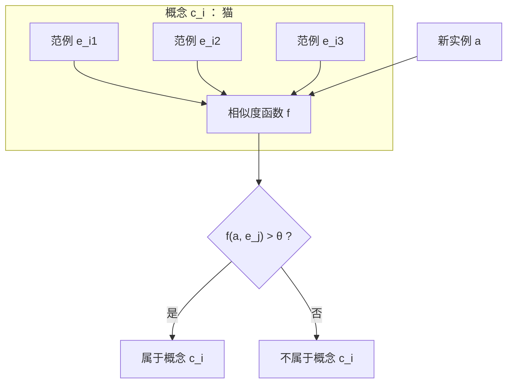
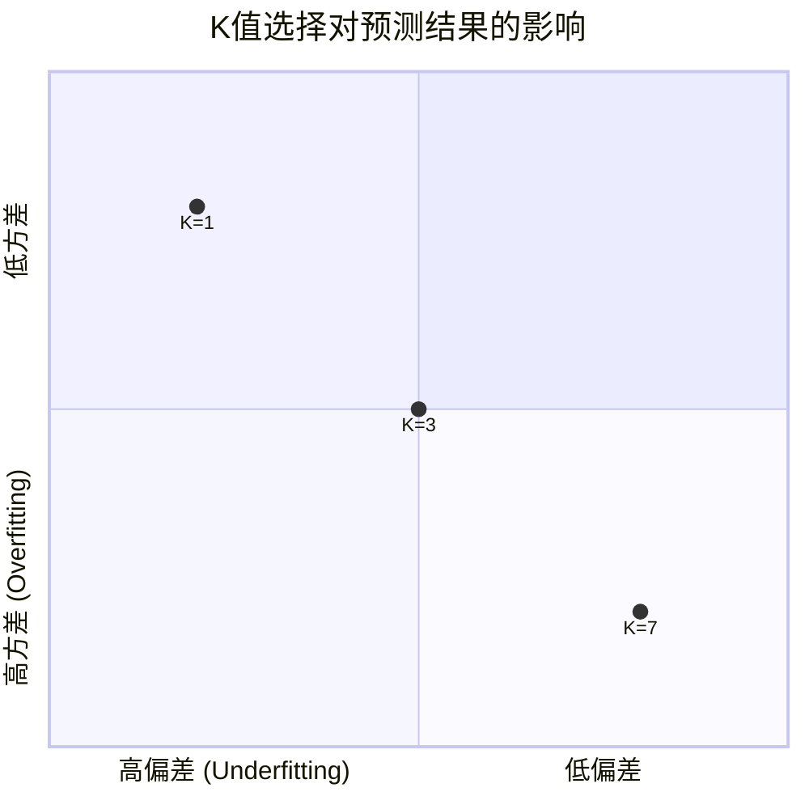
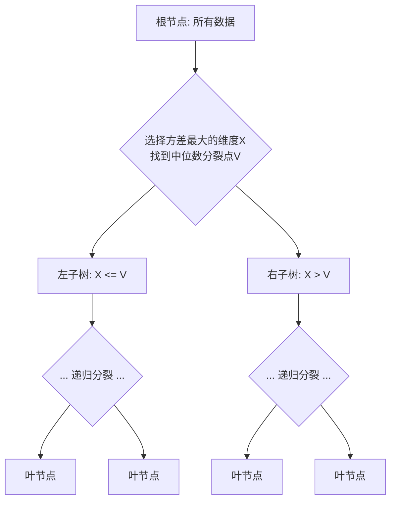
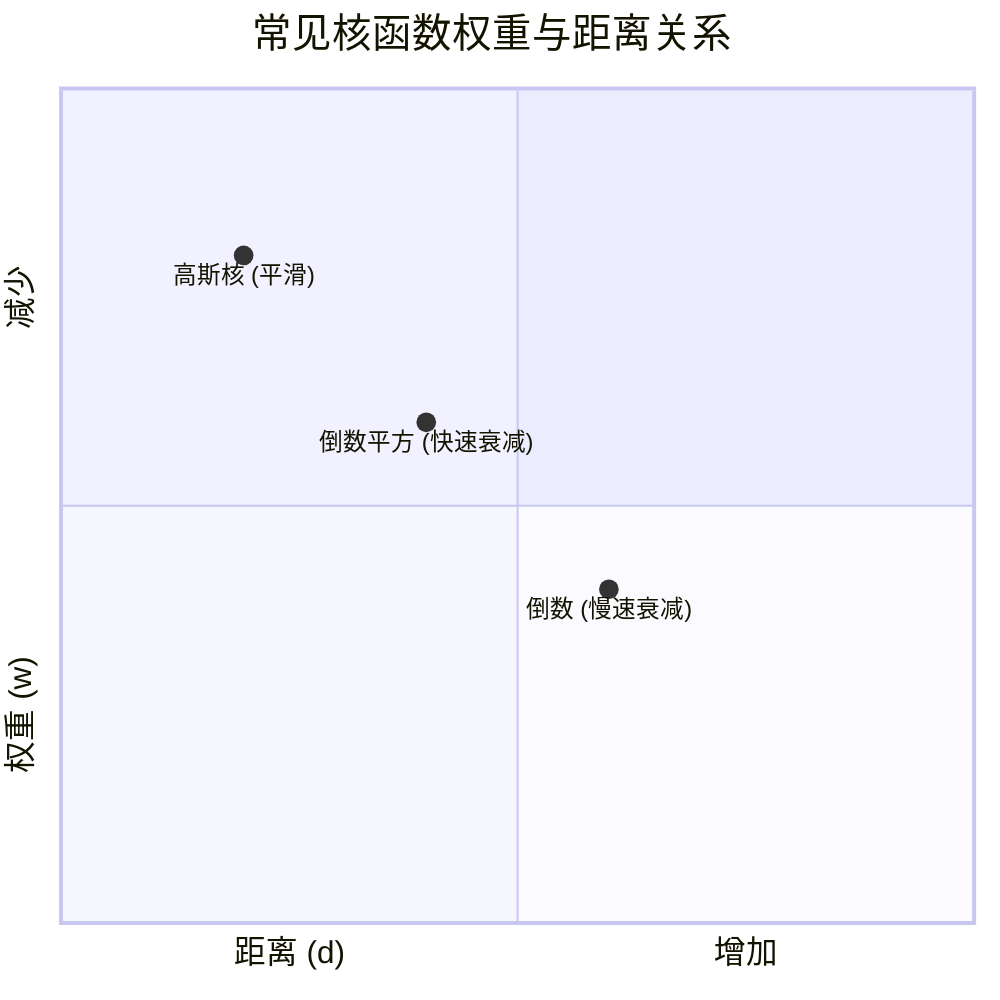
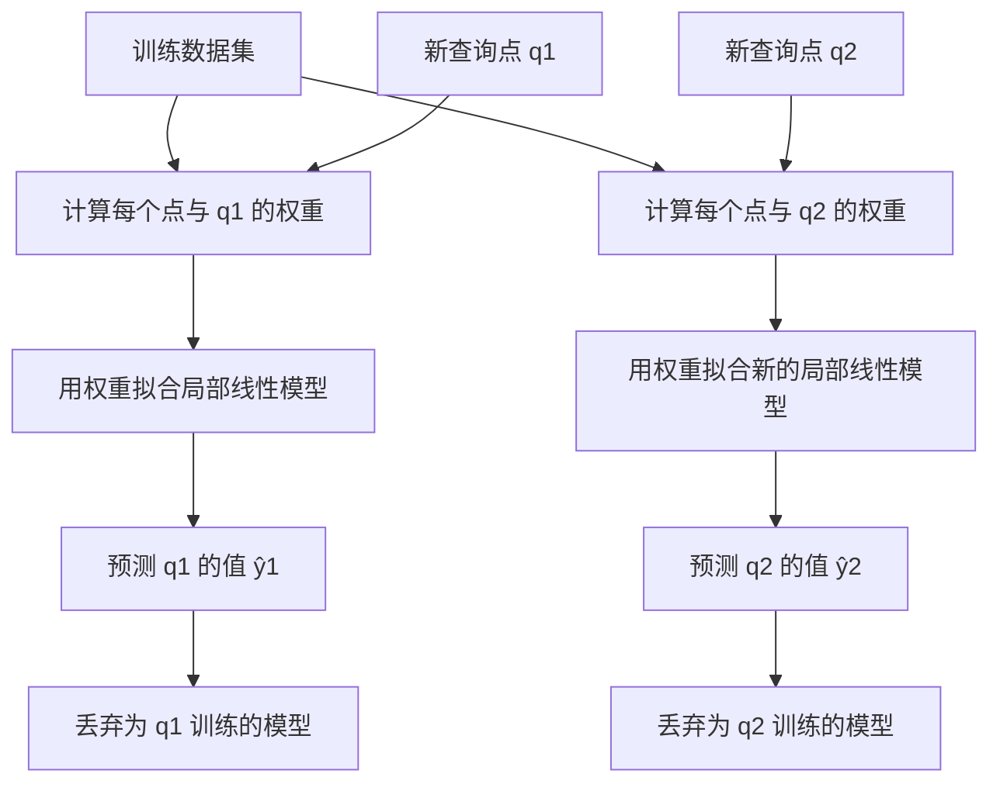

### 动机：为什么需要基于实例的学习？

在之前的学习中，我们接触了许多机器学习方法（如线性回归、决策树、朴素贝叶斯等），它们大多遵循一个“**三步走**”的范式：

1.  **估计问题特性**（例如假设数据符合某种分布）
2.  **作出模型假设**（例如假设函数形式为线性或树状结构）
3.  **找到最优的参数**（通过训练数据学习模型参数）

这是一种 **参数化（Parametric）**  的方法。但这种方法有一个潜在问题：如果我们的**模型假设错了**（例如数据根本不是线性的），那么无论怎么优化参数，模型的表现都会很差。

这就引出了一个核心问题：**有没有一种学习方法，不依赖于任何预先定义的模型形式？**

答案是肯定的，这就是 **基于实例的学习（IBL）**。它的核心思想非常直观，甚至更接近人类的学习方式：

-   **人们通过记忆和类比来学习**：当你遇到一个新问题时，你通常会回想过去遇到的类似情况（实例），然后基于那些经验来做决定。这就是“**思考即回忆（Thinking is reminding）**”。
-   **近朱者赤，近墨者黑**：一个实例的类别或属性，可以由它周围最相似的邻居来决定。

**现实世界的例子**：
-   **图片搜索**：“找到和这张图片最相似的10张图片！” - 这不需要预先定义“什么是相似”，只需比较图片本身。
-   **基因序列分析**：“找到两个基因组之间所有匹配的基因片段” - 通过直接比较序列的相似度来实现。

---

### 核心名词与概念

在深入算法之前，我们先厘清几个关键概念：

#### 1. 参数化 vs. 非参数化 (Parametric vs. Non-parametric)

| 特性 | 参数化方法 | 非参数化方法 |
| :--- | :--- | :--- |
| **核心思想** | 预先假设一个具体的函数形式（如线性函数、高斯分布），然后学习其中的参数。 | **不做或做很少的假设**。让数据自己说话，模型的结构和复杂度完全依赖于数据本身。 |
| **比喻** | 使用**固定形状的模具**（如圆形、方形）去套数据，努力找到最匹配的尺寸。 | 使用**橡皮泥**去塑造数据，橡皮泥的形状完全由数据决定。 |
| **优点** | 简单，模型容易解释和快速预测。 | 非常灵活，能拟合复杂的数据模式，潜力更大。 |
| **缺点** | **模型偏差大**。如果真实数据分布与假设不符，模型效果会很差。 | 需要大量数据，计算和存储成本高，容易过拟合。 |
| **例子** | 线性回归、逻辑回归、朴素贝叶斯 | **基于实例的学习**、决策树、支持向量机 |

基于实例的学习是**非参数化方法**的典型代表。

#### 2. 基于实例的学习的别名

IBL 有很多名字，它们都指代同一类思想，只是侧重点略有不同：
-   **Instance-Based Learning (IBL) / Methods (IBM)**：基于实例的学习/方法
-   **Memory-Based Learning**：基于记忆的学习（强调需要存储所有训练样本）
-   **Case-Based Learning / Reasoning**：基于案例的学习/推理（常见于专家系统）
-   **Similarity-Based Learning / Reasoning**：基于相似度的学习/推理（强调核心是相似度度量）

---

### 一、基本概念

#### 基于实例的学习是如何工作的？

它的工作流程非常简单直观：

1.  **训练阶段（Learning）**：
    -   **不构建任何模型！**
    -   唯一做的事情就是**把所有的训练样本（实例）存储起来**。
    -   就像一个学生不做任何笔记，只是把所有的例题都背下来。

2.  **预测阶段（Prediction）**：
    -   当需要一个**新样本**需要分类或预测时，系统才开始工作。
    -   它将这个新样本与**记忆中所有存储的训练样本**进行比较。
    -   找出其中最相似的一个或几个样本。
    -   然后根据这些“邻居”的类别或值来预测新样本的类别或值。

#### 概念的形式化表示

在IBL中，一个概念 \( c_i \)（例如“猫”这个类别）可以用以下三者来定义：

1.  **样例集合（Set of Examples）**：\( c_i = \{ e_{i1}, e_{i2}, e_{i3}, ... \} \)
    -   所有被标记为“猫”的图片集合。
2.  **相似度函数（Similarity Function）**：\( f(e_j, a) \)
    -   一个函数，用于衡量两个实例（比如两张图片）之间的相似程度。
3.  **阈值（Threshold）**：\( \theta \)
    -   一个门槛值，用来判断是否足够相似。

**一个未知实例 `a` 属于概念 \( c_i \) 的条件是**：
-   `a` 与概念 \( c_i \) 中的**某个范例 \( e_j \)** 足够相似。
-   并且它们的相似度 **\( f(e_j, a) > \theta \)**。

#### 📊 概念表示图示

---
好的，我们接着深入讲解 **二、K-近邻（K-Nearest Neighbors, KNN）**。

KNN 是基于实例的学习中最核心、最著名的算法。它完美体现了“物以类聚，人以群分”的思想。

---

### 二、K-近邻 (K-Nearest Neighbors, KNN)

#### 1. 从 1-NN 到 K-NN：解决噪声问题

**最近邻（1-NN）** 算法非常简单：一个新样本的类别，由训练集中与它**最相似**（距离最近）的那个样本的类别决定。

-   **优点**：简单直观。
-   **致命缺点**：**对噪声数据非常敏感**。
    -   如果离你最近的那个样本是个标错的异常值（比如一只被误标成“猫”的狗），你的预测就会完全错误。

**解决方案**：不要只相信一个人，听听大家的意见！这就是 **K-近邻（KNN）** 的思想。

-   **核心思想**：考察一个新样本在特征空间中的 **K个最近邻居**，然后让这K个邻居**投票**决定新样本的类别。
-   **K** 是一个用户预先设定的正整数（通常是奇数，如3, 5, 7），以避免平票。

#### 🧮 KNN 算法基本步骤：

1.  **选择超参数 K**：确定要考虑的邻居数量。
2.  **计算距离**：计算新样本（查询点）与训练集中每一个样本的距离。
3.  **排序找邻居**：对所有计算出的距离进行排序，找出**距离最小的 K 个训练样本**。
4.  **投票决策**：统计这 K 个邻居中各个类别的数量，将**数量最多的类别**作为新样本的预测类别。
    -   **对于回归问题**（预测连续值）：通常是取这 K 个邻居目标值的**平均值**。

#### 📊 图示：1-NN vs 3-NN vs 7-NN

假设我们要预测一个蓝色问号 `？` 的类别（红色三角或绿色方块）。下图展示了选择不同的 K 值如何影响预测结果。

-   **K=1（最近邻）**：
    -   模型复杂，边界非常不规则（锯齿状）。
    -   **方差高**，容易过拟合（对噪声敏感）。
-   **K=3**：
    -   边界变得平滑一些，是噪声和泛化能力之间的一个较好平衡。
-   **K=7**：
    -   模型非常简单，决策边界非常平滑。
    -   **偏差高**，可能欠拟合（忽略了一些细节）。

---

### KNN 的核心讨论与实战细节

KNN 算法看似简单，但在实际应用中需要考虑很多细节。这些细节直接决定了算法的成败。

#### 讨论 1: 距离度量 (Distance Metric)

“远近”是如何定义的？不同的定义会得到完全不同的“邻居”。

-   **欧氏距离 (Euclidean Distance, L₂)**：
    -   最常用，就是两点间的直线距离。
    -   公式：$d = \sqrt{(x_2 - x_1)^2 + (y_2 - y_1)^2 + ...}$
    -   **特点**：各向同性，对所有方向一视同仁。

-   **曼哈顿距离 (Manhattan Distance, L₁)**：
    -   在规则的城市街区中，你不能穿墙，只能沿街道走。
    -   公式：$d = |x_2 - x_1| + |y_2 - y_1| + ...$
    -   **特点**：对数据中的异常值不如欧氏距离敏感。

-   **闵可夫斯基距离 (Minkowski Distance)**：
    -   欧氏距离和曼哈顿距离的通用形式。
    -   公式：$d = (\sum_{i=1}^n |x_i - y_i|^p)^{1/p}$
    -   当 `p=1` 时，是曼哈顿距离；当 `p=2` 时，是欧氏距离。

**如何选择**：欧氏距离最常用。但如果数据在某个方向上差异特别大，或者你关心的是绝对值差异，可以考虑曼哈顿距离。

#### 讨论 2: 属性归一化 (Feature Normalization) - 至关重要！

这是KNN实践中**最容易出错且最重要的一步**。

-   **问题**：如果特征的量纲（单位）或数值范围差异巨大，距离计算会被数值范围大的特征所主导。
-   **例子**：考虑两个特征：“年龄（20-60岁）”和“收入（20000-200000元）”。计算距离时，$(60000)^2$ 的贡献远大于 $(40)^2$，导致“收入”特征完全主导了距离，而“年龄”特征几乎不起作用。

-   **解决方案**：将所有特征转换到**相同的数值尺度**上。
    -   **最值归一化 (Min-Max Scaling)**：将值缩放到 [0, 1] 区间。
        -   公式：$X_{\text{norm}} = \frac{X - X_{\min}}{X_{\max} - X_{\min}}$
    -   **Z-score 标准化 (Standardization)**：将数据转换为均值为0，标准差为1的正态分布。
        -   公式：$X_{\text{std}} = \frac{X - \mu}{\sigma}$

**务必记住**：**在使用KNN之前，一定要先进行特征归一化！**

#### 讨论 3: 属性加权 (Feature Weighting)

更进一步，我们还可以认为不同的特征重要性不同。

-   **思想**：在计算距离时，对更重要的特征赋予更高的权重，对不重要的特征赋予较低的权重。
-   **加权欧氏距离公式**：$d_{w}(i,j) = \sqrt{w_1(x_{i1} - x_{j1})^2 + w_2(x_{i2} - x_{j2})^2 + ... + w_p(x_{ip} - x_{jp})^2}$
-   **如何确定权重 w**？
    -   基于领域知识。
    -   使用特征选择方法（如基于信息增益、卡方检验等）。

#### 讨论 4: K 值的选择

K 是一个超参数，需要通过实验来选择。

-   **K 太小 (e.g., K=1)**：
    -   **模型复杂**，决策边界曲折。
    -   **容易过拟合**：对噪声敏感，模型方差高。
-   **K 太大 (e.g., K=训练样本数)**：
    -   **模型简单**，决策边界平滑。
    -   **容易欠拟合**：忽略了有用信息，模型偏差高。
    -   极端情况下，无论输入什么，都会预测为整个数据集中最多的类别。

-   **如何选择最佳 K 值？**
    -   使用**交叉验证（Cross-Validation）**，特别是**留一法（Leave-One-Out）**。
    -   尝试不同的 K 值（如1, 3, 5, 7, ...），选择在验证集上准确率最高的那个。

#### 讨论 5: 打破平局 (Breaking Ties)

当K个邻居的投票出现平局时（例如，K=4，两个类别各得2票），怎么办？

-   **策略1**：**优先选择距离更近的样本的类别**。可以计算每个类别中样本的平均距离，选择平均距离更近的类别。
-   **策略2**：**将 K 减小 1**，变成K=3，重新计算。
-   **策略3**：**随机选择**一个类别。

---

好的，我们紧接上一部分，基于 **ML11.Topic6.2-IBL(2)_最终版.pdf** 的内容，继续深入讲解 **K-近邻 (KNN)** 的高级话题和扩展内容。

#### 讨论 6: 关于效率 - KD-Tree

**核心问题**：KNN 是一种“懒惰学习”算法，所有计算都发生在预测时。当训练集非常大时，计算新样本与所有训练样本的距离会非常慢（时间复杂度为 O(n)），这使其难以应用于实时场景。

**解决方案**：使用特殊的数据结构来加速最近邻搜索，其中最著名的就是 **KD-Tree (K-Dimensional Tree)**。

**KD-Tree 的核心思想**：一种空间划分数据结构，它递归地将 K 维空间划分为多个半空间，并将数据点组织成一棵二叉树，从而在搜索时能快速排除大量不可能的区域。

##### (1) KD-Tree 的构建

构建过程就是递归地对空间进行划分：

1.  **选择划分维度和值**：
    -   **维度**：通常选择当前数据集中**分布范围最广（方差最大）** 的维度进行划分。
    -   **值**：选择该维度上的**中位数**作为切分点。**为什么是中位数？** 为了保证构建出的树是平衡的，这样搜索效率最高。
2.  **分裂**：将当前节点中的数据，根据选定维度的值分为左右两支（左子树：值 <= 中位数；右子树：值 > 中位数）。
3.  **递归**：对左右子树重复上述过程，直到满足停止条件（如：节点中包含的数据点少于某个阈值 `m`）。

**每个叶节点**不仅包含一系列数据点，还维护着这些点的**空间边界信息**，这在后续查询时用于剪枝。

##### (2) KD-Tree 的查询

查询一个目标点 `q` 的最近邻时，不再需要计算所有距离，而是通过遍历树来高效完成：

1.  **下行**：从根节点开始，根据 `q` 在当前分裂维度上的值，递归地下降到可能包含其最近邻的叶节点。
2.  **计算**：到达叶节点后，计算 `q` 与该叶节点内所有数据点的距离，并记录当前找到的**最近点**及其距离（作为当前最近距离 `best_dist`）。
3.  **回溯与剪枝**：回溯到父节点，并检查**另一侧分支**是否可能包含更近的点。
    -   关键：计算 `q` 到另一侧分支所代表的**整个空间区域的最小可能距离**（利用之前存储的边界信息）。
    -   **剪枝**：如果这个最小可能距离都大于当前的 `best_dist`，则说明该分支内绝对不可能存在更近的点，可以完全跳过（剪枝），无需遍历。
    -   如果不满足剪枝条件，则需要进入该分支进行搜索。
4.  **重复**：重复步骤2和3，直到回溯到根节点。最终记录的最近点就是答案。

**简单理解**：KD-Tree 的查询就像一个在地图上找最近咖啡馆的过程。你不会搜遍全城，而是先定位你所在的区域（下行），找找附近的咖啡馆（计算）。然后你会想：“马路对面的街区会不会有更近的？”（回溯），你估算了一下那个街区离你的最近距离（最小可能距离），如果这个距离都比你现在找到的最近咖啡馆要远，那你就不用过去看了（剪枝）。

---
### 三、距离加权 KNN

#### 1. 动机：为什么需要加权？

想象一下在一个会议上进行投票：
-   **标准KNN**：每个人的投票权重完全相同。一位初入行的新人和一位资深专家对技术方案的投票具有同等影响力。
-   **距离加权KNN**：专家的投票权重更高，新人的投票权重较低。每个人的影响力取决于其专业水平（与当前问题的“相似度”）。

将这个类比迁移到KNN中：
-   **问题**：在标准KNN中，一个距离查询点 `100米` 的邻居和一个距离 `1米` 的邻居拥有**完全相同的投票权**。这显然不合理，离得更近的邻居理应提供更可靠、更相关的信息。
-   **解决方案**：根据邻居与查询点的**距离远近**，为每个邻居分配不同的**权重**。距离越近，权重越高。

#### 2. 核心思想与公式

距离加权KNN的核心是为每个邻居分配一个权重，该权重是其距离的函数。

-   **权重函数**：
    `$$ w_i = K(d(x_i, x_q)) $$`
    -   `$ d(x_i, x_q) $` 是邻居 `$ x_i $` 与查询点 `$ x_q $` 之间的距离。
    -   `$ K(\cdot) $` 是**核函数 (Kernel Function)**，它是一个**非负且单调递减**的函数。距离 `d` 越大，权重 `$ w_i $` 越小。

-   **预测公式**：
    -   **分类问题 (加权投票)**：
        `$$ \text{predict} = \arg\max_{c} \sum_{i=1}^{K} w_i \cdot \mathbf{1}(y_i = c) $$`
        解释：对每个类别 `c`，将所有属于该类别的邻居的权重加起来。最终预测结果是**总权重最大**的那个类别。
        *   `$ \mathbf{1}(y_i = c) $` 是指示函数，如果 `$ y_i = c $` 则为1，否则为0。

    -   **回归问题 (加权平均)**：
        `$$ \text{predict} = \frac{\sum_{i=1}^{K} w_i \cdot y_i}{\sum_{i=1}^{K} w_i} $$`
        解释：预测值是所有K个邻居目标值 `$ y_i $` 的**加权平均值**。

#### 3. 常见的核函数 (Kernel Function)

核函数 `$ K(d) $` 定义了距离如何转换为权重。以下是一些常见选择，它们都遵循“距离越近，权重越高”的原则：

| 核函数名称 | 公式 | 特点 |
| :--- | :--- | :--- |
| **倒数** | `$ w_i = \frac{1}{d} $` | 最简单，但当 `d=0` 时会除零错误。 |
| **倒数的平方** | `$ w_i = \frac{1}{d^2} $` | 更强调近邻的贡献，衰减更快。 |
| **高斯核 (最常用)** | `$ w_i = \exp\left(-\frac{d^2}{\sigma^2}\right) $` | 产生非常平滑的权重变化，性能最好。 |

**高斯核详解**：
-   这是最常用、最强大的核函数。
-   `$ \sigma $` (**核宽度，有时记为 `$ K_w $`**) 是一个超参数，它控制了权重衰减的**速度**。
    -   `$ \sigma $` **越小**，曲线越陡峭。这意味着**只有非常近的邻居**才有显著权重，模型更复杂，容易过拟合。
    -   `$ \sigma $` **越大**，曲线越平缓。这意味着**更远的邻居**也能贡献不少权重，模型更简单，容易欠拟合。
-   选择合适的 `$ \sigma $` 至关重要，通常通过交叉验证来确定。

#### 4. 优势与效果

-   **优势**：
    1.  **更精确**：削弱了远处邻居（可能相关性较低）的干扰，强调了近处邻居的作用，预测结果通常比标准KNN更准确。
    2.  **更平滑**：产生的决策边界或回归曲线比标准KNN**更平滑**，减少了突兀的跳跃。
    3.  **解决平局**：自然地解决了标准KNN中可能出现的投票平局问题。因为平局的类别几乎总会有微小的权重差异。

-   **效果对比**：
    -   **标准KNN (均匀投票)**：决策边界是“阶跃式”的，预测结果在边界处会产生突变。
    -   **距离加权KNN**：决策边界是“平滑过渡”的，因为靠近边界的点，其邻居的类别权重会非常接近，使得预测概率连续变化。

#### 5. 一个简单的例子

假设我们想预测一个新客户 `David` 是否会响应营销活动（`Yes` or `No`）。我们使用 `K=3` 和加权函数 `$ w_i = \frac{1}{d^2} $`。

| 邻居 | 与David的距离 `d` | 响应 | 权重 `w_i = 1/d²` |
| :--- | :--- | :--- | :--- |
| **Mary** | `5` | `Yes` | `1/25 = 0.04` |
| **John** | `10` | `No` | `1/100 = 0.01` |
| **Nellie** | `15` | `Yes` | `1/225 ≈ 0.004` |

-   **标准KNN (投票)**：`Yes` (2票) vs `No` (1票) -> 预测 `Yes`。
-   **加权KNN (加权投票)**：
    -   `Yes` 总权重 = 0.04 + 0.004 = **0.044**
    -   `No` 总权重 = 0.01 = **0.01**
    -   **0.044 > 0.01** -> 预测 `Yes`。

在这个例子中，虽然结论相同，但加权KNN告诉我们这个结论的**置信度**主要来自于非常近的 `Mary`。如果 `Mary` 的距离变为 `10`，她的权重会急剧下降到了 `0.01`，此时 `Yes` 和 `No` 的总权重都是 `0.01`，就会形成平局，此时就需要其他策略（如进一步减小距离）来打破平局。

#### 6. 实现注意事项

1.  **处理 d=0**：当查询点与某个训练样本完全重合时，距离为0。为了避免除零错误，通常可以直接返回该训练样本的标签/值。
2.  **特征归一化**：这一点甚至比在标准KNN中更重要！如果特征未归一化，距离计算会被大尺度特征主导，从而导致权重计算失真。
3.  **超参数调优**：现在你需要同时优化 `K` 和核函数的参数（如高斯核的 `$ \sigma $`）。网格搜索 (Grid Search) 配合交叉验证是常用的方法。

### 总结

距离加权KNN通过引入**基于距离的权重**，对标准KNN进行了重要改进：
-   **核心**：使用一个单调递减的**核函数** `$ K(d) $` 将距离映射为权重。
-   **预测**：通过**加权投票**（分类）或**加权平均**（回归）做出决策。
-   **优点**：结果更**精确、更平滑**，并能自然处理平局情况。
-   **关键**：**高斯核**是最常用的选择，其核宽度 `$ \sigma $` 是控制模型复杂度的关键超参数。

它使KNN算法从简单的“少数服从多数”升级为了更精细的“依贡献度分配权力”，是实践中提升KNN性能的首选技巧。

---

### 四、扩展：局部加权回归 (LWR)

#### 1. 动机：从全局模型到局部模型

传统的回归方法（如**线性回归**）试图找到一个**单一的、全局的**模型（例如一条直线 `y = β₀ + β₁x`）来拟合所有数据。

-   **优势**：模型简单，计算高效。
-   **劣势**：**假设强**。它假设所有数据都遵循一个固定的全局模式。如果数据关系复杂、非线性，全局模型就会表现很差，产生很高的**偏差（Bias）**。

**LWR的核心思想**：放弃寻找一个全局模型。相反，当需要预测一个新查询点 `x_q` 时，我们只关注 `x_q` **附近**的数据点，并用这些点来拟合一个简单的**局部模型**。

> **比喻**：
> -   **全局回归（线性回归）**：就像用一条**固定形状的尺子**（直线）去试图拟合整个曲线，必然在很多地方都不贴合。
> -   **局部加权回归（LWR）**：就像用一根**柔软的、有粘性的橡皮泥**在曲线上滚动。每到一点，橡皮泥就只吸附并贴合当前点附近的一小段曲线，从而能完美地捕捉所有局部细节。

#### 2. 核心思想与四要素

LWR 同样可以用基于实例学习的“四要素”框架来理解：

1.  **一种距离度量**：
    -   如何定义“附近”？通常使用**缩放的欧氏距离**。特征归一化在这里至关重要！

2.  **使用多少个邻居？**：
    -   通常使用**所有**数据点！但这不是简单的“全体投票”，而是通过下一个要素——加权函数——来优雅地决定哪些点属于“附近”。

3.  **一个加权函数**：
    -   这是LWR的**灵魂**。它为一个**核函数（Kernel Function）**，根据每个训练样本 `x_i` 与查询点 `x_q` 的**距离**为其分配一个权重 `w_i`。
    -   **高斯核**是最常见的选择：`$ w_i = \exp\left(-\frac{d(x_i, x_q)^2}{K_w^2}\right) $`
    -   **核宽度 `K_w`**：这是一个超参数，控制了“局部”的范围。
        -   `K_w` **小**：权重衰减快，只有非常近的点有高权重，局部模型只拟合很小区域，可能**过拟合**（拟合噪声）。
        -   `K_w` **大**：权重衰减慢，远处点也有较高权重，局部模型更接近全局模型，可能**欠拟合**。

4.  **如何使用已知的邻居节点？**：
    -   这是LWR与KNN的**根本区别**。LWR不是简单地对邻居值取平均，而是用这些带权重的邻居点**拟合一个局部模型**。
    -   最常用的是**局部线性回归**，即拟合一个局部的线性模型 `$ y = \beta_0 + \beta_1x $`。

#### 3. 工作原理与公式

对于每一个需要预测的查询点 `x_q`，LWR 都独立地执行以下步骤：

1.  **计算权重**：为每一个训练样本 `(x_i, y_i)` 计算其与 `x_q` 的权重 `w_i`（使用高斯核等）。
2.  **拟合局部模型**：求解一个**加权最小二乘（Weighted Least Squares）** 问题，找到一组参数 `β`，使得局部加权误差最小：
    $$ \beta = \arg\min_{\beta} \sum_{i=1}^{N} w_i^2 \cdot (y_i - (\beta_0 + \beta_1 x_i))^2 $$
    这个公式的含义是：对于距离 `x_q` 远的点（`w_i`小），其拟合误差 `(y_i - prediction)` 不太重要；对于距离近的点（`w_i`大），我们希望模型的预测必须非常准确。
3.  **进行预测**：使用刚刚拟合好的**局部线性模型**对 `x_q` 进行预测：
    $$ \hat{y}_q = \beta_0 + \beta_1 x_q $$
4.  **丢弃模型**：预测完成后，**丢弃这个局部模型**。当下一个查询点 `x_q'` 到来时，**重复整个过程**：重新计算权重，重新拟合一个全新的局部模型。

#### 📊 LWR 过程可视化

下面的流程图展示了LWR为两个不同的查询点 `q1` 和 `q2` 分别构建局部模型的过程。

#### 4. 举例说明

假设我们有如下数据点，想要预测 `x_q = 5` 处的值。

| x | y | 与x_q=5的距离d | 权重 w_i（假设K_w=2）|
| :-- | :-- | :-- | :-- |
| 3 | 4 | 2 | exp(-(2²/2²)) ≈ 0.37 |
| 4 | 2 | 1 | exp(-(1²/2²)) ≈ 0.78 |
| 4.5| 3 | 0.5 | exp(-(0.5²/2²)) ≈ 0.94 |
| 5.5| 4 | 0.5 | exp(-(0.5²/2²)) ≈ 0.94 |
| 6 | 3 | 1 | exp(-(1²/2²)) ≈ 0.78 |
| 7 | 5 | 2 | exp(-(2²/2²)) ≈ 0.37 |

**LWR步骤**：
1.  计算每个点的权重（如上表）。
2.  这些点的权重分布以 `x_q=5` 为中心，形成一个“钟形”。
3.  使用这些带权重的点，拟合一条**局部加权**的直线。
4.  用这条直线预测 `x=5` 时 `y` 的值，比如得到 `ŷ_q ≈ 3.5`。

而全局线性回归会忽略数据的波动，直接拟合一条贯穿所有点的直线，在 `x=5` 处的预测值可能会是 `3.8`，无法捕捉到局部的波动细节。

#### 5. 优势与挑战

-   **优势**：
    -   **极其灵活**：无需任何全局假设，能拟合极其复杂的非线性关系。
    -   **概念直观**：符合“具体问题具体分析”的直觉。

-   **挑战**：
    1.  **计算开销极大**：每个预测点都需要拟合一个全新的模型，速度非常慢。是典型的**懒惰学习**。
    2.  **超参数选择**：核宽度 `K_w` 的选择至关重要，且通常通过计算昂贵的**交叉验证**来确定。
    3.  **可解释性差**：没有最终的全局模型，很难向别人解释“你的模型是什么”。
    4.  **外推能力差**：对于查询点落在训练数据范围之外的情况，预测可能非常不准确，因为附近没有数据点可以支撑局部建模。

#### 6. 总结

局部加权回归（LWR）是将“基于实例”和“局部加权”思想发挥到极致的算法。

-   **它是什么**：一种为**每个查询点**单独构建一个**局部模型**的非参数回归方法。
-   **核心**：通过**核函数**和**加权最小二乘法**来实现局部建模。
-   **适用场景**：当数据关系复杂、非线性，且预测速度要求不高时，LWR是一个非常强大的工具。
-   **关键点**：**核宽度 `K_w`** 是控制模型复杂度的关键，决定了“局部”的范围有多大。

它完美体现了“懒惰学习”的优势（极致灵活）与劣势（计算成本高），是机器学习中一个巧妙而重要的思想。

---

### 五、懒惰学习 vs. 贪婪学习

#### 1. 核心区别：何时进行泛化？

这两种范式的根本区别在于**学习（泛化）发生的时机**。

-   **贪婪学习 (Eager Learning)**：
    -   **在见到查询之前进行泛化**。
    -   训练阶段，算法急切地（Eagerly）分析训练数据，并构建一个**单一的、全局的**模型（如一条线性回归的直线、一棵决策树、一个神经网络的权重集合）。
    -   预测阶段，只需将这个训练好的模型应用于新的查询点，速度极快。
    -   **比喻**：**闭卷考试**。学生在考前努力复习、总结、归纳所有知识（构建模型），考试时只能凭记忆中的知识体系（模型）来答题。

-   **懒惰学习 (Lazy Learning)**：
    -   **直到查询到来时才进行泛化**。
    -   训练阶段，算法只是“懒惰地”存储训练数据，几乎不做任何计算。
    -   预测阶段，当一个新的查询点到来时，算法才开始工作：将查询点与所有存储的训练数据进行比较（计算距离、找邻居），并基于这些比较结果给出预测。
    -   **比喻**：**开卷考试**。学生考前不总结（不构建模型），只把书本和笔记（训练数据）带到考场。考试时现场翻书查找相关例题（找邻居），再模仿解题（预测）。

下面的流程图清晰地展示了两种学习范式在训练和预测阶段的根本差异：

#### 2. 特性对比表

| 特性 | **懒惰学习 (Lazy Learning)**   (e.g., KNN, 局部加权回归) | **贪婪学习 (Eager Learning)**   (e.g., 决策树, 线性回归, 神经网络, SVM) |
| :--- | :--- | :--- |
| **训练时间** | **非常短**   仅存储数据，计算开销极低。 | **长**   需要从数据中归纳、优化模型参数，计算开销大。 |
| **预测时间** | **非常长**   需与所有训练数据比较，计算开销大。 | **短**   只需应用现成的模型，计算开销极低。 |
| **模型形式** | **没有显式的全局模型**。   模型就是训练数据本身。 | 有一个**显式的、紧凑的全局模型**。   (e.g., 一条公式、一棵树) |
| **灵活性** | **高**   可以为每个查询构建不同的局部模型，能拟合非常复杂的函数。 | **低**   对所有查询使用同一个全局模型，可能无法捕捉局部特性。 |
| **对数据的假设** | **弱**   无需对数据分布做先验假设。 | **强**   通常基于特定的模型假设（如线性、树状结构）。 |
| **外推能力**   (预测未知区域) | **差**   如果查询点远离所有训练数据，无法做出可靠预测。 | **相对较好**   全局模型可以提供在数据范围之外的推测（但可能不准）。 |
| **可解释性** | **可解释性好**   预测结果可以通过列举邻居来解释。 | **取决于算法**   决策树可解释性好，神经网络可解释性差。 |
| **存储空间** | **高**   需要存储所有训练数据。 | **低**   只需存储优化后的模型参数，通常很小。 |
| **对噪声的敏感性** | **敏感**   需要机制（如K>1、距离加权）来对抗噪声。 | **取决于算法**   决策树可能过拟合噪声，线性回归对噪声鲁棒性较好。 |

#### 3. 代表算法

-   **懒惰学习**：
    -   **k-近邻 (KNN)**：最典型的代表。
    -   **距离加权KNN**：KNN的增强版。
    -   **局部加权回归 (LWR)**：回归问题上的优雅实现。
    -   **案例推理 (Case-Based Reasoning)**：更高级的、用于复杂结构化数据的懒惰学习。

-   **贪婪学习**：
    -   **决策树**：急切地构建一棵树来对空间进行划分。
    -   **线性/逻辑回归**：急切地找到一组最优的权重参数。
    -   **支持向量机 (SVM)**：急切地找到一个最优的分隔超平面。
    -   **神经网络**：急切地通过反向传播优化网络权重。

#### 4. 如何选择？—— 没有银弹

两种范式没有绝对的优势，选择取决于应用场景和需求：

-   **选择懒惰学习，当...**：
    -   数据关系复杂、非线性，难以用简单模型刻画。
    -   你有充足的计算资源和时间，但对预测速度要求不高（离线场景）。
    -   可解释性很重要，你需要通过相似案例来解释预测结果。
    -   数据分布没有明显的全局规律。

-   **选择贪婪学习，当...**：
    -   你需要进行快速的实时预测（在线场景、手机APP）。
    -   训练数据量巨大，存储所有数据成本过高。
    -   你需要将模型部署到资源有限的设备上（模型文件小）。
    -   你相信数据背后存在一个可被捕捉的全局规律。

**一个重要理论**：如果两种算法共享相同的假设空间（例如，都用线性模型），**懒惰学习（如LWR）可以表示比贪婪学习（如线性回归）更复杂的函数**。因为LWR为每个点都拟合一个局部线性模型，整体上可以组成一个复杂的非线性函数；而线性回归只能产生一个全局的线性模型。

---

### 总结

懒惰学习与贪婪学习是机器学习中两种截然不同的哲学：

-   **贪婪学习**：**“训练慢，预测快”**。考前努力复习（训练），考试时奋笔疾书（预测）。致力于找到一个通用的解决方案（全局模型）。
-   **懒惰学习**：**“训练快，预测慢”**。考前不复习，考试时现场翻书（预测）。致力于为每个新问题量身定制解决方案（局部模型）。

你的选择取决于你是愿意将计算成本**前置（训练阶段）** 还是**后置（预测阶段）**，以及对**模型灵活性**与**预测速度**的权衡。理解这一根本区别，是成为一名成熟的机器学习实践者的关键一步。