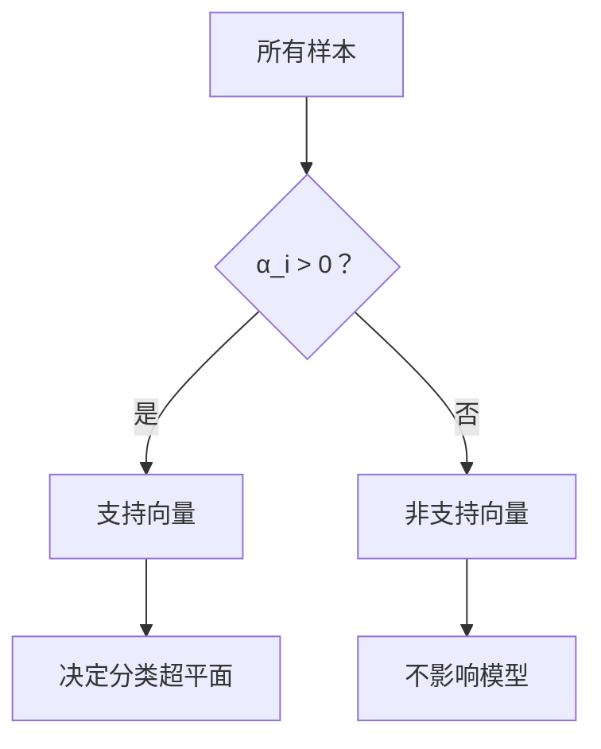
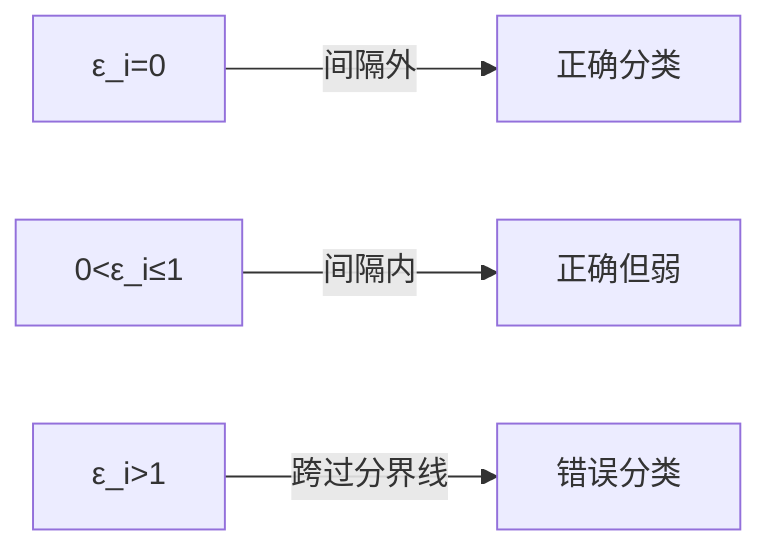

### **支持向量机（SVM）第一部分：理论基础与线性模型**

#### **1. 背景与核心概念**
**支持向量机（SVM）** 是由 Vapnik 团队在 AT&T 贝尔实验室开发的监督学习算法：
- **核心目标**：寻找最优分类超平面，最大化两类数据点的间隔（Margin）
- **关键特性**：
  - 最大间隔分类器（Max Margin Classifier）
  - 最初用于分类，后扩展至回归和时间序列预测
  - 曾作为文本处理的强基准模型（Strong Baseline）
- **核心洞察**：  
  当数据线性可分时，存在无数个可行超平面。  
  SVM选择 **间隔最大** 的超平面，提升分类鲁棒性和泛化能力。


---

#### **2. 问题定义与数学形式化**
- **输入**：训练样本 $(x_1, y_1), (x_2, y_2), \ldots, (x_N, y_N)$  
  其中 $x_i \in \mathbb{R}^n$（特征向量），$y_i \in \{-1, +1\}$（类别标签）
- **目标**：找到分类超平面 $f(x) = \langle w, x \rangle + b = 0$ 满足：
  $$
  f(x_i) 
  \begin{cases} 
    > 0 & \text{若 } y_i = +1 \\
    < 0 & \text{若 } y_i = -1
  \end{cases}
  $$
- **决策规则**：预测标签为 $\text{sign}(f(x))$
这个函数的各个部分及其意义如下：
[函数的各个部分及其意义](分类决策函数各个部分及其意义.md)

---

#### **3. 线性可分与间隔最大化**
##### **3.1 支持超平面与间隔定义**
- **支持超平面**：与分类超平面平行且距离相等的两个平面：
  $$ \langle w, x \rangle + b = +1 \quad \text{和} \quad \langle w, x \rangle + b = -1 $$
- **间隔公式**：
  $$ \text{Margin} = \frac{2}{\|w\|_2} $$

> **推导 1（几何投影法）**：  
> 边界超平面到原点的距离：
> $$ \rho_1 = \frac{|1 - b|}{\|w\|_2}, \quad \rho_2 = \frac{|-1 - b|}{\|w\|_2} $$
> 间隔 = $|\rho_1 - \rho_2| = \frac{2}{\|w\|_2}$  
>
> **推导 2（距离公式法）**：  
> 1. 点 $x$ 到超平面的距离：$\frac{|\langle w, x \rangle + b|}{\|w\|}$  
> 2. 支持超平面上的点满足 $|\langle w, x \rangle + b| = 1$  
> 3. 两支持超平面间距 = $\frac{1}{\|w\|} + \frac{1}{\|w\|} = \frac{2}{\|w\|}$

##### **3.2 优化问题原始形式**
最大化间隔等价于最小化 $\|w\|_2^2$（为方便求导，目标函数取 $\frac{1}{2}\|w\|^2$）：
$$
\begin{aligned}
\min_{w,b} &\quad \frac{1}{2} \|w\|_2^2 \\
\text{s.t.} &\quad y_i (\langle w, x_i \rangle + b) \geq 1, \quad \forall i = 1,\ldots,N
\end{aligned}
$$

> **约束条件物理意义**：  
> 确保所有样本被正确分类且位于支持超平面外侧（$y_i(\langle w, x_i \rangle + b) \geq 1$）

---

#### **4. 对偶问题与拉格朗日乘子法**
##### **4.1 拉格朗日函数构造**
引入拉格朗日乘子 $\alpha_i \geq 0$：
$$ L(w,b,\alpha) = \frac{1}{2} \|w\|_2^2 - \sum_{i=1}^N \alpha_i \left[ y_i (\langle w, x_i \rangle + b) - 1 \right] $$

##### **4.2 KKT 条件**
最优解需满足：
$$
\begin{cases}
\frac{\partial L}{\partial w} = w - \sum_i \alpha_i y_i x_i = 0 \\
\frac{\partial L}{\partial b} = -\sum_i \alpha_i y_i = 0 \\
\alpha_i \left[ y_i(\langle w, x_i \rangle + b) - 1 \right] = 0 \\
\alpha_i \geq 0
\end{cases}
$$

##### **4.3 对偶问题形式**
代入 KKT 条件化简得：
$$
\begin{aligned}
\min_{\alpha} &\quad \frac{1}{2} \sum_{i=1}^N \sum_{j=1}^N \alpha_i \alpha_j y_i y_j \langle x_i, x_j \rangle - \sum_{i=1}^N \alpha_i \\
\text{s.t.} &\quad \sum_{i=1}^N \alpha_i y_i = 0, \quad \alpha_i \geq 0 \quad \forall i
\end{aligned}
$$

> **对偶问题优势**：  
> - 复杂度取决于样本数而非特征维数  
> - 显式引入内积 $\langle x_i, x_j \rangle$ → 为核函数铺垫  
> - 物理意义：最大化样本间的"协方差作用"

---

#### **5. 支持向量（Support Vectors）**
##### **5.1 定义与性质**
- **支持向量**：满足 $\alpha_i > 0$ 的样本点
- **几何意义**：位于支持超平面上的点（$y_i(\langle w, x_i \rangle + b) = 1$）
- **关键性质**：
  1. 解 $w$ 的表达式：$w = \sum_{i} \alpha_i y_i x_i$（仅由支持向量决定）
  2. 稀疏性：多数 $\alpha_i = 0$，非支持向量不影响模型
  3. 决策函数简化为：
     $$ f(x) = \sum_{i \in SV} \alpha_i y_i \langle x_i, x \rangle + b $$
  4. 偏置 $b$ 的计算：$b = y_k - \langle w, x_k \rangle$（$x_k$ 为任意支持向量）



> **生活比喻**：  
> 支持向量就像支撑帐篷的关键柱子，其他样本是固定绳子的地钉——去掉地钉帐篷仍能站立，但去掉柱子帐篷会倒塌。

---

#### **6. 算法流程总结**
1. **输入**：训练集 $\{(x_i, y_i)\}_{i=1}^N$
2. **求解对偶问题**：
   $$
   \min_{\alpha} \frac{1}{2} \sum_{i,j} \alpha_i \alpha_j y_i y_j \langle x_i, x_j \rangle - \sum_i \alpha_i \quad \text{s.t.} \quad \sum_i \alpha_i y_i = 0, \alpha_i \geq 0
   $$
3. **计算参数**：
   - $w = \sum_i \alpha_i y_i x_i$
   - $b = y_k - \langle w, x_k \rangle$（$x_k$ 为支持向量）
4. **预测**：$\hat{y} = \text{sign} \left( \langle w, x \rangle + b \right)$

---

#### **7. SVM vs 其他分类器**
| **分类器**       | **适用场景**                     | **决策边界**      | **核心特点**          |
|------------------|--------------------------------|------------------|---------------------|
| 决策树           | 离散特征，规则清晰               | 轴平行分段       | 可解释性强           |
| 贝叶斯           | 特征独立，概率估计               | 概率等高线       | 需要先验分布         |
| K近邻            | 小样本，局部相似               | 不规则多边形     | 计算开销大           |
| **SVM**          | **高维数据，线性/非线性**        | **最大间隔超平面** | **泛化能力强**       |

**文本分类实例**：
- 正例： "I love Iron Man!" → 特征 ["love":1, "Iron":1, "Man":1]
- 负例： "It looks ugly..." → 特征 ["ugly":1]
- **支持向量**： "awesome", "brash" 等关键判别词对应的样本

---

#### **8. 核心公式总结**
1. **原始优化问题**：
   $$
   \min_{w,b} \frac{1}{2} \|w\|_2^2 \quad \text{s.t.} \quad y_i(\langle w, x_i \rangle + b) \geq 1
   $$
   
2. **对偶问题**：
   $$
   \min_{\alpha} \frac{1}{2} \sum_{i,j} \alpha_i \alpha_j y_i y_j \langle x_i, x_j \rangle - \sum_i \alpha_i \quad \text{s.t.} \quad \sum_i \alpha_i y_i = 0, \alpha_i \geq 0
   $$
   
3. **决策函数**：
   $$
   f(x) = \sum_{i \in SV} \alpha_i y_i \langle x_i, x \rangle + b
   $$

---

#### **9. 重要说明**
- **命名由来**：解仅由支持向量决定，模型复杂度与支持向量数量相关
- **后续扩展**：
  1. 线性不可分情况：引入松弛变量 $\xi_i$（后续讲解）
  2. 非线性问题：通过核函数 $K(x_i, x_j)$ 替换内积（后续讲解）
  3. 回归问题：支持向量回归（SVR）

### 支持向量机（SVM）第二部分：线性不可分与核方法详解
---

### **一、线性不可分：软间隔与松弛变量**

#### **1. 核心问题与解决方案**
- **问题背景**：当数据无法被完美线性分割时（存在噪声或重叠），硬间隔SVM失效
- **创新方案**：引入松弛变量（Slack Variables）$\varepsilon_i$ 允许部分样本违规
- **优化目标**：平衡间隔最大化和分类错误最小化
  $$
  \min_{w,b,\varepsilon} \frac{1}{2} \|w\|^2 + C \sum_{i=1}^N \varepsilon_i
  $$
  $$
  \text{s.t.} \quad y_i(\langle w, x_i \rangle + b) \geq 1 - \varepsilon_i, \quad \varepsilon_i \geq 0
  $$

> **参数 $C$ 的物理意义**：
> - $C$ → ∞ ：退化为硬间隔SVM（不容忍任何错误）
> - $C$ → 0 ：无限宽间隔（忽略所有分类错误）
> *实际应用*：通过交叉验证选择最佳 $C$

#### **2. 松弛变量的几何解释**
| $\varepsilon_i$ 值 | 样本位置                  | 分类状态         |
|-------------------|--------------------------|------------------|
| = 0               | 在间隔外侧               | 完全正确分类     |
| (0,1]             | 在间隔内部               | 正确但置信度低   |
| > 1               | 越过决策边界             | 错误分类         |



#### **3. 损失函数视角**
- **Hinge损失**：$\ell_{\text{hinge}}(z) = \max(0, 1 - z)$（$z=y_i f(x_i)$)
- **软间隔SVM等价于**：
  $$
  \min_{w,b} \frac{1}{2} \|w\|^2 + C \sum_{i=1}^N \max(0, 1 - y_i f(x_i))
  $$
- **对比其他损失**：
  - 0/1损失：$\ell_{0/1}(z) = \mathbf{1}_{z<0}$（非凸，难优化）
  - 对率损失：$\ell_{\log}(z) = \log(1+e^{-z})$（逻辑回归使用）

> **Hinge损失的优势**：  
> 仅关心分类边界附近的样本（支持向量），对远离边界的正确分类点不敏感

---

### **二、核函数技巧：升维解决非线性问题**

#### **1. 核心思想与数学原理**
- **基本问题**：原始空间线性不可分（如异或问题）
- **解决方案**：通过映射 $\Phi$ 将数据升维到特征空间
  $$
  \Phi: \mathbb{R}^n \to \mathcal{F}, \quad \text{dim}(\mathcal{F}) \gg n
  $$
- **核技巧**：避免显式计算 $\Phi(x)$，直接定义核函数 $k(x_i,x_j)=\langle \Phi(x_i),\Phi(x_j) \rangle$
- **对偶问题转化为**：
  $$
  \min_{\alpha} \frac{1}{2} \sum_{i,j} \alpha_i \alpha_j y_i y_j k(x_i, x_j) - \sum_i \alpha_i
  $$
  $$
  \text{s.t.} \quad \sum_i \alpha_i y_i = 0, \quad 0 \leq \alpha_i \leq C
  $$

#### **2. 常用核函数详解**
| **核函数**       | **表达式**                                  | **特点**                     | **适用场景**       |
|------------------|-------------------------------------------|-----------------------------|-------------------|
| 线性核           | $k(x,y) = \langle x, y \rangle$           | 退化回线性SVM               | 高维稀疏数据      |
| 多项式核         | $k(x,y) = (\langle x, y \rangle + 1)^d$   | $d$控制复杂度               | 图像分类          |
| 高斯核 (RBF)     | $k(x,y) = \exp(-\frac{\|x-y\|^2}{2\sigma^2})$ | $\sigma$控制带宽           | 万能核，通用问题  |
| Sigmoid核        | $k(x,y) = \tanh(\eta \langle x,y \rangle + v)$ | 类似神经网络               | 文本分类          |

#### **3. 核函数构造原理**
- **Mercer定理**：合法核函数必须对应半正定Gram矩阵
- **构造方法**：
  1. 显式定义 $\Phi$（如多项式特征）
  2. 组合简单核：
     - $k_{\text{new}} = k_1 + k_2$
     - $k_{\text{new}} = c \cdot k_1$
     - $k_{\text{new}} = \exp(k_1)$
  3. 高斯核的分解证明：
     $$
     k_{\text{Gauss}}(x,y) = \exp\left( -\gamma \|x-y\|^2 \right) = \exp(-\gamma\langle x,x\rangle) \cdot \exp(2\gamma\langle x,y\rangle) \cdot \exp(-\gamma\langle y,y\rangle)
     $$

#### **4. 核函数应用示例**
- **多项式核**（$d=2$）：
  $$
  k\left(\begin{pmatrix}x_1\\x_2\end{pmatrix}, \begin{pmatrix}y_1\\y_2\end{pmatrix}\right) = (x_1y_1 + x_2y_2)^2
  $$
  对应特征映射：
  $$
  \Phi(x) = (x_1^2, \sqrt{2}x_1x_2, x_2^2)
  $$
  > **几何意义**：将二维点映射到三维抛物面实现线性可分

---

### **三、SVM实战：图像分类案例**

#### **Caltech101数据集实验**
- **数据**：9144张图，102类别（101物体+背景）
- **流程**：
  ```mermaid
  graph LR
  A[原始图片] --> B[预处理]
  B --> C[特征提取-LLC]
  C --> D[SVM训练]
  D --> E[测试评估]
  ```
- **关键步骤**：
  1. 预处理：转灰度图，缩放至最长边120像素
  2. 特征提取：底层视觉特征（LLC）
  3. 分类器：高斯核SVM
- **结果**：
  | 每类训练样本数 | 测试准确率 |
  |---------------|-----------|
  | 15            | 70.16%    |
  | 30            | 73.44%    |

> **结论**：SVM在小样本场景下仍表现强劲，适合高维特征分类

---

### **四、SVM优缺点总结**

#### **优点**
1. **理论完备**：最大间隔导出凸优化问题，保证全局最优
2. **泛化能力强**：结构风险最小化原则
3. **核技巧**：优雅解决非线性问题，避免维度灾难
   > *实际效果*：高斯核SVM在MNIST数据集上可达99%+准确率
4. **稀疏解**：决策函数仅依赖支持向量，预测高效

#### **缺点**
1. **核函数选择**：依赖经验规则（如文本用线性核，图像用高斯核）
2. **超参数敏感**：$C$ 和 $\sigma$ 需精细调优
3. **计算复杂度**：训练时间复杂度 $O(N^2\sim N^3)$，大数据需优化
   - **解决方案**：使用LIBLINEAR（线性核）或随机采样

#### **工业级工具**
- **LIBSVM**：通用核SVM [[链接]](https://www.csie.ntu.edu.tw/~cjlin/libsvm)
- **LIBLINEAR**：大规模线性SVM [[链接]](https://www.csie.ntu.edu.tw/~cjlin/liblinear)

---

### **关键公式回顾**

#### **1. 软间隔原始问题**
$$
\min_{w,b,\varepsilon} \frac{1}{2} \|w\|^2 + C \sum_{i=1}^N \varepsilon_i \quad \text{s.t.} \quad y_i f(x_i) \geq 1 - \varepsilon_i, \varepsilon_i \geq 0
$$

#### **2. 核化对偶问题**
$$
\min_{\alpha} \frac{1}{2} \sum_{i,j} \alpha_i \alpha_j y_i y_j k(x_i, x_j) - \sum_i \alpha_i \quad \text{s.t.} \quad \sum_i \alpha_i y_i = 0, 0 \leq \alpha_i \leq C
$$

#### **3. 决策函数**
$$
f(x) = \sum_{i \in SV} \alpha_i y_i k(x_i, x) + b
$$

