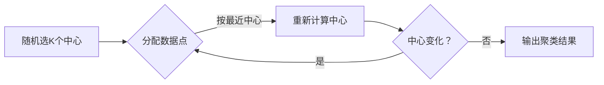
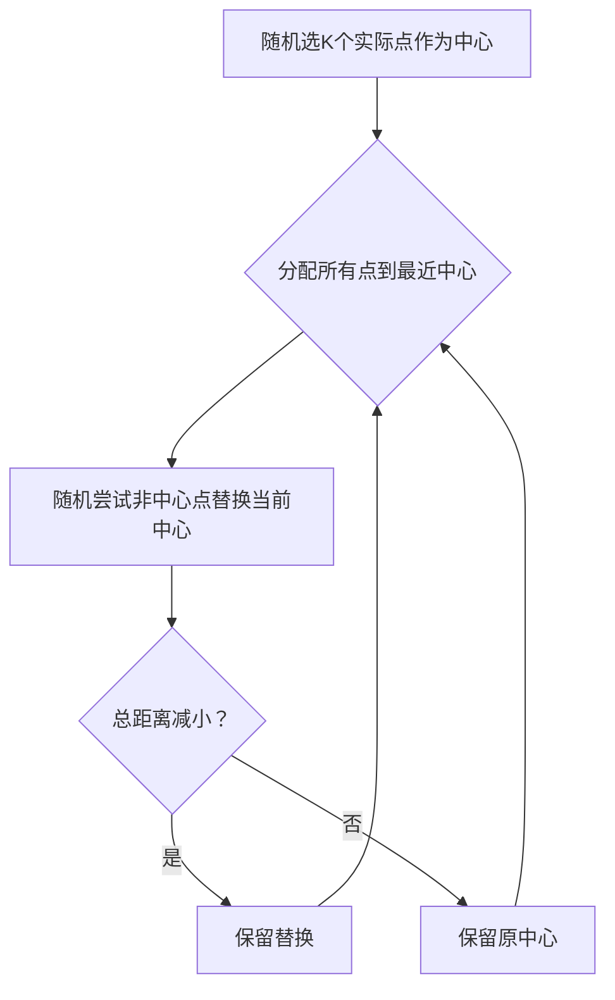

### **一、无监督学习的本质**

#### **1. 核心思想：从混沌中发现秩序**
##### **1. 无监督学习是什么？**

- **核心区别**：
    
    - **监督学习**：有标准答案（如带标签数据 `X→Y`），学习 `P(Y|X)`
        
        > _好比老师给你习题和答案，让你总结解题规律_
        
    - **无监督学习**：只有原始数据（`X`），学习 `P(X)` 的内在结构
        
        > _像给你一堆杂乱文档，让你自己整理分类_
        
    - **半监督学习**：少量带答案+大量无答案数据，综合学习规律
        
- **价值**：
    
    - 发现隐藏模式（如用户分组、图片结构）
        
    - 处理无标签数据（现实中大部分数据都无标签！）
        
    
    > _示例_：原始图片 vs 像素随机打乱的图片——无监督学习能识别结构信息的重要性
- **数学本质**：学习联合概率分布 \( P(X) \)（所有输入数据的整体规律）  
  *对比监督学习*：学习条件分布 \( P(Y|X) \)（给定输入如何预测输出）  
  > **如同**：  
  > 监督学习 → 老师给你带标签的动植物图鉴（X=图片，Y=名称）  
  > 无监督学习 → 只给你一堆未分类的动植物照片，让你自己发现物种分类规律  

##### **2. 为何需要无监督学习？**
- **现实困境**：90% 以上数据无标签（如用户浏览记录、传感器原始数据）  
- **核心价值**：  
  - **降维**：将1000维数据压缩到3维 → 保留关键特征，剔除噪声  
    *例：人脸识别中，用PCA将像素压缩为“五官位置”等核心维度*  
  - **异常检测**：从1亿次信用卡交易中找出100次盗刷  
    *关键：异常点远离数据密集区（低概率区域）*  

---
### **二、无监督学习的核心任务**

1. **聚类（Clustering）**
    
    - 目标：物以类聚，把相似对象分到同一组
        
    - 关键：定义"相似"（距离近）和"不相似"（距离远）
        
    
    > _好聚类的标准_：组内紧密如家人，组间疏远如陌生人
    
2. **降维（Dimensionality Reduction）**
    
    - 压缩数据维度，保留关键特征
        
    
    > _好比把高清照片缩略成小图，仍能认出内容_
    
3. **离群点检测（Outlier Detection）**
    
    - 识别异常数据（如信用卡欺诈交易）
        
4. **密度估计（Density Estimation）**
    
    - 分析数据分布规律（如预测降雨概率）
### **三、聚类算法详解**

#### **1. 聚类类型**

| **分类方式**       | **特点**                                 | **例子**           |
| -------------- | -------------------------------------- | ---------------- |
| **软聚类 vs 硬聚类** | 软：一个对象可属多类  <br>硬：一个对象仅属一类             | 文档可同时属于"科技"和"教育" |
| **层次 vs 非层次**  | 层次：树状结构（如物种分类）  <br>非层次：扁平分组（如K-means） | 生物分类学 vs 顾客分群    |
#### **聚类类型对比**
| **类型**         | **算法代表**       | **特点**                                                                 | **生活类比**                     |
|------------------|--------------------|-------------------------------------------------------------------------|----------------------------------|
| **层次聚类**     | AGNES（自底向上）  | 树状结构，可灵活选择聚类粒度                                            | 家族族谱（从个人→家庭→氏族）     |
| **划分聚类**     | K-means            | 扁平结构，需预设K个类                                                   | 按星座划分人群（12个固定分组）   |
| **基于密度**     | DBSCAN             | 自动发现任意形状簇，抗噪性强                                            | 人群聚集识别（广场上的人群团）   |

> **关键差异**：  
> - K-means要求**类呈圆形分布**（基于距离），DBSCAN可识别**任意形状**（如环绕型）  


#### **2. 相似度度量**
- **数值型数据**（如身高、价格）：
    
    - 用欧氏距离/余弦相似度（课件中"实数值数据"）
        
    > _两人身高差越小，相似度越高_
    
- **类别型数据**（如城市、性别）：
    
    - 简单法：相同则相似度=1，不同则=0
        
    - 进阶法：语义相似度矩阵（见下表）
        
|城市|北京|上海|纽约|
|---|---|---|---|
|**北京**|1.0|0.7|0.1|
|**上海**|0.7|1.0|0.2|
|**纽约**|0.1|0.2|1.0|

> _表格含义：北京与上海相似度0.7，与纽约仅0.1_
> 同时还要满足传递性
- **有序数据**（如"小/中/大"）：
    
    - 先数值化（小=0，中=0.5，大=1.0），再按数值型处理
#### 相似度度量的数学本质
- **数值型数据**（如身高、温度）：  
  - **欧氏距离**：$( d(\mathbf{x},\mathbf{y}) = \sqrt{\sum_{i=1}^n (x_i - y_i)^2} )$  
    *问题*：对量纲敏感（身高1.7m vs 体重70kg）  
  - **解决方案**：标准化！  
    $( x' = \frac{x - \mu}{\sigma} )$ （μ为均值，σ为标准差）  

- **类别型数据**（如城市、血型）：  
  - **Jaccard相似度**：$( \text{sim}(A,B) = \frac{|A \cap B|}{|A \cup B|} )$  
    *例*：用户A购买{牛奶,面包}，用户B购买{牛奶,鸡蛋} → 相似度=1/3  

- **有序数据**（如“小/中/大”）：  
  1. 数值化：小=1, 中=2, 大=3  
  2. **计算距离**：\( d = \|x-y\| \) （视为连续值）  
  3. **归一化**：$( d' = \frac{\|x-y\|}{\text{max\_value} - \text{min\_value}} )$  

#### **3. K-means 算法全流程（附数学推导）**
1. **随机选K个中心点**（如选3个：●, ▲, ★）  
2. **迭代以下两步直至收敛**：  
   - **分配数据**：每个点归属最近中心  
    $( C_i = \{ x : \|x - \mu_i\| \leq \|x - \mu_j\|, \forall j \} )$  
   - **更新中心**：重新计算各类均值  
     $( \mu_i = \frac{1}{|C_i|} \sum_{x \in C_i} x )$  

> **致命缺陷**：  
> - 对离群点敏感（一个极端值可拉偏整个簇中心）  
> - **解决方案** → K-medoids：选**实际数据点**作为中心（如选某个用户代表群体）  

---

### **四、高级问题深度解析**
#### **1. 如何确定最佳聚类数K？**
- **肘部法则（Elbow Method）**：  
  横轴：K值，纵轴：类内平方和（SSE）  
  选SSE下降速度突变的点（如右图K=3最佳）  
  

#### **2. 半监督学习的数学融合**
- **核心思想**：用无标签数据 \( P(X) \) 修正标签数据 \( P(Y|X) \)  
  *例*：  
  - 有标签：10张"猫"图片  
  - 无标签：1000张动物图片  
  - **算法发现**：无标签数据中有大量"尖耳短脸"特征 → 加强此特征对"猫"的权重  

#### **3. 聚类 vs 分类的本质区别**
|          | **输入数据**       | **目标**                  | **算法输出**       |
|----------|-------------------|--------------------------|-------------------|
| 分类     | (X,Y) 带标签      | 学习X→Y的映射            | 预测新数据的Y     |
| 聚类     | 只有X             | 发现X自身的分组结构      | 数据的分组标签    |
| **关键** | 分类的Y是预先定义 | 聚类的"组"是算法发现的！ |                   |

---

### **五、工业级应用案例**
#### **1. 电商用户分群（K-means）**
- **特征向量**：  
  月消费额, 活跃天数, 高价品占比, 折扣敏感度
- **聚类结果**：  
  - 簇1：高消费低频次（奢侈品目标客户）  
  - 簇2：低消费高频次（发优惠券提升客单价）  
  - 簇3：折扣敏感型（大促时重点推送）  

#### **2. 基因序列聚类（层次聚类）**
- **相似度定义**：DNA序列编辑距离  
- **结果**：构建物种进化树 → 发现新冠病毒新变种分支  

#### **3. 新闻事件检测（DBSCAN）**
- **步骤**：  
  1. 将新闻表示为词频向量  
  2. DBSCAN聚类 → 自动识别突发新闻事件簇  
  3. 输出："俄乌冲突"相关文章集合  

---

### **附：关键公式速查表**
| **任务**      | **公式**                                                                  | **说明**        |
| ----------- | ----------------------------------------------------------------------- | ------------- |
| 欧氏距离        | $( \sqrt{\sum (x_i-y_i)^2} )$                                           | 直线距离          |
| 余弦相似度       | $( \frac{\mathbf{x} \cdot \mathbf{y}}{\|\mathbf{x}\| \|\mathbf{y}\|} )$ | 方向一致性（忽略长度）   |
| K-means损失函数 | $( \sum_{k=1}^K \sum_{x \in C_k} \|x - \mu_k\|^2 )$                     | 类内样本到中心的距离平方和 |
| Jaccard相似度  | $( frac{A \cap B}{A \cup B} )$                                          | 集合交集占比        |

> **终极总结**：  
> 无监督学习是让机器在**没有标准答案**的情况下，通过数据自身的分布规律（密度/距离/拓扑结构）发现隐藏模式。其核心如同宇宙学——通过观察星体位置（数据点），推断星系结构（聚类）和宇宙演化规律（概率分布）。

---

### 一、层次聚类详解：从家族树到城市分组

#### 1. 凝聚式聚类（自底向上）
- **算法流程**：
  1. **起步**：每个数据点独自成簇（如6个城市→6个簇）
  2. **合并**：找最相似的两个簇合并（如NA和RM距离219最小）
  3. **更新**：重新计算新簇与其他簇的距离
  4. **重复**：直到达到预设簇数量（如K=2）

- **簇间距离的三种计算方式**：
  - **单链接（Single Linkage）**：取两类中最近两个点的距离  
    $$ \text{sim}(c_i, c_j) = \max_{x \in c_i, y \in c_j} \text{sim}(x,y) $$
    > *适用场景*：长条状分布（但易受噪声影响）

  - **全链接（Complete Linkage）**：取两类中最远两个点的距离  
    $$ \text{sim}(c_i, c_j) = \min_{x \in c_i, y \in c_j} \text{sim}(x,y) $$
    > *适用场景*：紧凑圆形簇（但可能拆散大簇）

  - **平均链接（Average Linkage）**：取所有点对距离的平均值  
    $$ \text{sim}(c_i, c_j) = \frac{1}{|c_i||c_j|} \sum_{x \in c_i} \sum_{y \in c_j} \text{sim}(x,y) $$
    > *最平衡方案*（工业界最常用）

- **实例演示（意大利城市聚类）**：
  - 初始距离矩阵：
    |     | BA  | FI  | MI  | NA  | RM  | TO  |
    |-----|-----|-----|-----|-----|-----|-----|
    | BA  | 0   | 622 | 877 | 255 | 412 | 996 |
    | FI  | -   | 0   | 295 | 468 | 268 | 400 |
    | ... | ... | ... | ... | ... | ... | ... |
  
  - 合并过程：
    ```mermaid
    graph TD
    A[NA-RM-219] --> B[BA加入-255]
    B --> C[FI加入-268]
    C --> D[MI-TO-138]
    D --> E[最终两大簇]
    ```

#### 2. 分裂式聚类（自顶向下）
- **算法流程**：
  1. **起步**：所有数据属于一个大簇
  2. **分裂**：找到类内最分散的点作为"分裂组"种子
  3. **分配**：将其他点按距离划入"分裂组"或"保留组"
  4. **递归**：对子簇重复分裂直到满足条件

- **对比凝聚式**：
  | **特性**       | 凝聚式                     | 分裂式                     |
  |---------------|---------------------------|---------------------------|
  | 计算效率       | O(n³) → 中小数据          | O(2ⁿ) → 仅适合小样本       |
  | 信息利用       | 局部信息                  | 全局信息                  |
  | 优势           | 保证紧密簇形成            | 可精细控制分裂粒度        |

> **真实应用**：神经科学研究（Page19）  
> 通过电极信号聚类，发现大脑对音素的响应模式分组（OSI值聚类）

---

### 二、K-means聚类：迭代优化的艺术

#### 1. 算法核心步骤


- **数学本质**：最小化类内平方和  
  $$ J = \frac{1}{N} \sum_{n=1}^{N} \sum_{v=1}^{K} r_{nv} \| u_n - g_v \|^2 $$
  其中 $r_{nv}=1$ 表示点 $u_n$ 属于簇 $v$

- **优化过程**：
  - **步骤A**：固定中心 $g_v$，优化分配 $r_{nv}$  
    $$ r_{nv} = \begin{cases} 1 & \text{if } v = \arg\min_k \|u_n - g_k\|^2 \\ 0 & \text{otherwise} \end{cases} $$
  - **步骤B**：固定分配 $r_{nv}$，优化中心 $g_v$  
    $$ g_v = \frac{\sum_n r_{nv} u_n}{\sum_n r_{nv}} $$
  > *交替执行直到 $J$ 收敛*

#### 2. 实战技巧
- **初始化改进**：
  - 随机选点 → 易陷入局部最优
  - **K-means++**：新中心点概率正比于与现有中心的距离平方

- **确定最佳K值**：
  - **肘部法则**：绘制K与SSE的关系曲线
    $$ \text{SSE} = \sum_{k=1}^K \sum_{x \in C_k} \|x - \mu_k\|^2 $$
    ```python
    # Python示例
    sse = []
    for k in range(1,10):
        km = KMeans(n_clusters=k)
        km.fit(data)
        sse.append(km.inertia_)
    plt.plot(range(1,10), sse, 'bx-')  # 选拐点处K值
    ```
  - **轮廓系数**：综合考察簇内紧密度和簇间分离度

- **创新应用**：图像压缩（Page32）
  1. 将每个像素看作RGB空间中的点（特征：[R,G,B]）
  2. 用K-means聚类得到16/256个代表色
  3. 用簇中心颜色代替原始像素 → 压缩图像
   > *压缩比*：1600万色 → 256色（存储索引即可）

---

### 三、K-medoids聚类：抗噪的鲁棒方案

#### 1. 核心改进
- **中心点（Medoid）**：必须是实际数据点（对比K-means的虚拟均值）
- **目标函数**：最小化绝对距离和（L1范数）  
  $$ J = \sum_{k=1}^K \sum_{x \in C_k} \|x - m_k\| $$
  > *对比K-means*：使用L1距离替代L2距离 → 对离群点不敏感

#### 2. PAM算法流程（Partitioning Around Medoids）


- **交换测试示例**：
  - 初始总代价：26
  - 尝试交换中心 → 新总代价：20（接受）
  - 继续优化直到无法降低代价

#### 3. 大数据优化：CLARA算法
- **核心思想**：抽样优化 + 结果复用
- **步骤**：
  1. 多次随机抽取样本子集（如5次抽1%数据）
  2. 在每个子集上运行PAM得到中心点
  3. 用全部数据评估聚类质量
  4. 选择最优中心点集合

> **适用场景对比**：
> | **算法**      | 数据规模    | 抗噪性 | 中心点性质     |
> |--------------|------------|--------|--------------|
> | K-means      | 大规模      | 弱     | 虚拟均值点   |
> | K-medoids    | 中小规模    | 强     | 实际数据点   |
> | CLARA        | 超大规模    | 中等   | 实际数据点   |

---

### 四、关键公式汇总[[hw5]]

#### 1. K-means 目标函数
$$
\min J = \frac{1}{N} \sum_{n=1}^{N} \sum_{v=1}^{K} r_{nv} \| u_n - g_v \|^2
$$

#### 2. 簇中心更新公式
$$
g_v = \frac{\sum_{n} r_{nv} u_n}{\sum_{n} r_{nv}}
$$

#### 3. 单链接簇相似度
$$
\text{sim}(c_i, c_j) = \max_{x \in c_i, y \in c_j} \text{sim}(x,y)
$$

#### 4. K-medoids 目标函数
$$
\min J = \sum_{k=1}^K \sum_{x \in C_k} \|x - m_k\|
$$

> **终极总结**：  
> - **层次聚类**：适合探索性分析 → 构建数据"家族树"  
> - **K-means**：工业级大规模聚类 → 效率与效果的平衡  
> - **K-medoids**：含噪声数据场景 → 用实际点为中心抗干扰  
> 无监督学习的本质：让数据自己讲述结构故事