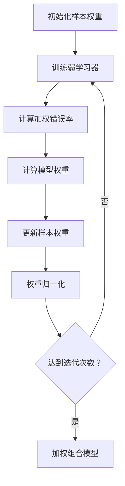
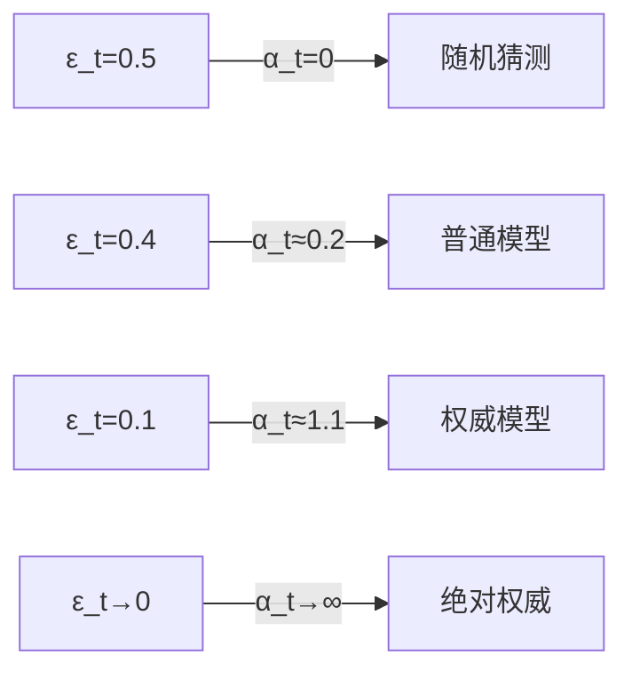

### **一、算法全貌图解**


---

### **二、分步精解（附数学推导）**
##### **1. 初始化样本权重**
- **数学公式**：  
  $w_i^{(1)} = \frac{1}{N}, \quad \forall i \in \{1,...,N\}$
- **物理意义**：  
  > 首轮所有样本平等对待  
  - 示例：100个样本 → 每个权重=0.01

##### **2. 训练弱学习器**
- **关键要求**：  
  > 分类器需支持**加权训练**（如决策树的加权基尼指数）
- **Python实现**：
  ```python
  model.fit(X, y, sample_weight=weights)
  ```

##### **3. 计算加权错误率**
- **数学公式**：  
  $\epsilon_t = \sum_{i=1}^N w_i^{(t)} \cdot \mathbb{I}(h_t(x_i) \neq y_i)$

- **计算示例**

| 样本 | 真实标签 | 预测结果 | 权重 | 贡献值 |
|------|----------|----------|------|--------| 
| 1 | +1 | +1 | 0.2 | 0 |
| 2 | -1 | +1 | 0.3 | **0.3** |
| 3 | +1 | -1 | 0.5 | **0.5** |

  **总错误率**：$\epsilon_t = 0.8$

##### **4. 计算模型权重**
- **核心公式**：  
  $\alpha_t = \frac{1}{2} \ln \left( \frac{1 - \epsilon_t}{\epsilon_t} \right)$
- **行为分析**：  
  
  - $\epsilon_t \to 0$时：$\alpha_t \to +\infty$（完美分类器）  
  - $\epsilon_t = 0.5$时：$\alpha_t = 0$（随机猜测）
#### **函数曲线与模型权重的数学内涵深度解析**

##### **1. 函数曲线分析**
**函数表达式**：
$(\alpha_t(\epsilon_t) = \frac{1}{2} \ln \left( \frac{1 - \epsilon_t}{\epsilon_t} \right))$

**曲线特性**：


**关键点解析**：

| **错误率(ε_t)** | **模型权重(α_t)** | **曲线特征**              | **物理意义**                 |
|------------------|-------------------|--------------------------|----------------------------|
| 0.5             | 0.0              | 零点（奇点）              | 无话语权（等同随机猜测）     |
| 0.4             | 0.2              | 平缓上升区                | 新手医生（权重低）          |
| 0.3             | 0.42             | 加速上升拐点              | 经验医生                    |
| 0.2             | 0.69             | 陡峭上升区                | 专家医生                    |
| 0.1             | 1.10             | 近垂直上升                | 权威专家（一票顶三票）      |
| 0.01            | 2.31             | 渐进无穷                  | 宗师级决策者                |

> **导数分析**：
> $(\frac{d\alpha_t}{d\epsilon_t} = -\frac{1}{2\epsilon_t(1-\epsilon_t)})$
> - 当ε_t接近0.5时，导数绝对值极大 → 模型权重对错误率极度敏感
> - 当ε_t接近0时，导数绝对值极大 → 微小提升带来权重巨变

##### **2. 模型权重α_t的数学内涵**
###### **(1) 信息论视角**
$(\alpha_t = \frac{1}{2} \left( \underbrace{\log_2 \frac{1}{\epsilon_t}}_{\text{正确信息量}} - \underbrace{\log_2 \frac{1}{1-\epsilon_t}}_{\text{错误信息量}} \right))$
- 本质是**正确预测的信息增益**
- 当ε_t=0.3时：
  $(\alpha_t = \frac{1}{2}(1.737 - 0.515) \approx 0.61)$

###### **(2) 贝叶斯决策视角**
设先验概率$(P(H) = 0.5)$，则：
$(\alpha_t \propto \log \frac{P(\text{正确}|H)}{P(\text{错误}|H)})$
- α_t等价于**对数似然比**
- 例如ε_t=0.2时：
  $(\alpha_t = \frac{1}{2} \ln \frac{0.8}{0.2} \approx 0.69)$（相当于3.98倍证据权重）

###### **(3) 误差边界理论**
总误差上界：
$(P_{\text{err}} \leq \prod_{t=1}^T 2\sqrt{\epsilon_t(1-\epsilon_t)})$
取对数后：
$(\log P_{\text{err}} \leq \sum_{t=1}^T \left( \frac{1}{2} \ln [4\epsilon_t(1-\epsilon_t)] \right))$
**最小化策略**：
$(\max \alpha_t \iff \min \epsilon_t(1-\epsilon_t))$（优化目标）

##### **3. 函数曲线数值表**
| ε_t   | α_t(ε_t) | 区域分类     |
|-------|----------|-------------|
| 0.50  | 0.00     | 死亡区       |
| 0.40  | 0.20     | 死亡区       |
| 0.30  | 0.42     | 黄金区       |
| 0.20  | 0.69     | 黄金区       |
| 0.10  | 1.10     | 黄金区       |
| 0.05  | 1.50     | 宗师区       |
| 0.01  | 2.31     | 宗师区       |
| 0.001 | 3.45     | 宗师区       |

**关键区域**：
1. **死亡区** $(0.4 < \epsilon_t \leq 0.5)$：
   - α_t ≈ 0 → 模型几乎无贡献
   - 需更换弱学习器

2. **黄金区** $(0.1 < \epsilon_t \leq 0.3)$：
   - α_t ∈ [0.42, 1.10]
   - 最佳性价比区域

3. **宗师区** $(\epsilon_t \leq 0.05)$：
   - α_t ≥ 1.5
   - 主导决策但易过拟合

##### **4. 工程启示**
1. **弱学习器选择标准**：
   ```python
   if 0.1 < error_rate < 0.3:  # 黄金区
       return optimal_weak_learner
   elif error_rate > 0.4:      # 死亡区
       raise ValueError("Weak learner fails condition!")
   ```

2. **早停策略设计**：
   - 当连续3轮$( \epsilon_t > 0.4 )$时终止迭代
   - 当出现$( \epsilon_t < 0.05 )$时减少后续模型权重

3. **噪声数据处理**：

   其中λ是噪声抑制因子（通常取0.5-1.0）
   
---
回归之前的
##### **4. 计算模型权重**
- **核心公式**：  
  $\alpha_t = \frac{1}{2} \ln \left( \frac{1 - \epsilon_t}{\epsilon_t} \right)$
- **行为分析**：  
  
  - $\epsilon_t \to 0$时：$\alpha_t \to +\infty$（完美分类器）  
  - $\epsilon_t = 0.5$时：$\alpha_t = 0$（随机猜测）
##### **5. 更新样本权重**
- **更新规则**：  
  $w_i^{(t+1)} = w_i^{(t)} \cdot \exp(-\alpha_t y_i h_t(x_i))$
- **几何解释**：  
  - 正确分类：$y_i h_t(x_i)=+1$ → 权重衰减  
  - 错误分类：$y_i h_t(x_i)=-1$ → 权重放大

##### **6. 权重归一化**
- **数学表达**：  
  $w_i^{(t+1)} \leftarrow \frac{w_i^{(t+1)}}{\|w^{(t+1)}\|_1}$
- **必要性**：  
  > 防止数值溢出，保持概率分布特性

##### **7. 加权组合预测**
- **集成公式**：  
  $H(x) = \text{sign}\left(\sum_{t=1}^T \alpha_t h_t(x)\right)$
- **决策示例**：  

| 模型    | $\alpha_t$ | 预测  | 加权值  |
| ----- | ---------- | --- | ---- |
| $h_1$ | 0.5        | +1  | +0.5 |
| $h_3$ | 0.8        | +1  | +0.8 |
  **总和**：+0.1 → 预测为+1

---

#### **三、实例演算：医疗诊断案例**
##### **场景设定**
- **样本**：3位患者（P1患病, P2健康, P3患病）  
- **初始权重**：[0.33, 0.33, 0.33]

##### **第一轮迭代**
1. 模型$h_1$预测：[患病, 健康, 健康]  
2. $\epsilon_1 = 0.33$（P3错判）  
3. $\alpha_1 \approx 0.35$  
4. 新权重：[0.23, 0.23, 0.47] → 归一化[0.25, 0.25, 0.50]

##### **第二轮迭代**
1. 模型$h_2$专注P3 → 预测全正确  
2. $\epsilon_2 = 0$ → $\alpha_2$极大  
3. 最终决策由$h_2$主导

---

#### **四、算法特性深度分析**
##### **1. 权重更新机制**
- **指数级变化**：  
  $\text{错误样本权重} = w_i^{(t)} \cdot e^{\alpha_t} \approx w_i^{(t)} \cdot 2.23 \ (\text{当}\alpha_t=0.8)$
- **迭代效应**：  
  > 3轮后错误样本权重可能增长11倍

##### **2. 损失函数视角**
等价于优化指数损失：
$\mathcal{L}(y, f(x)) = e^{-y f(x)}, \quad f(x)=\sum \alpha_t h_t(x)$
- **梯度下降解释**：  
  每轮迭代相当于沿损失函数的梯度方向更新样本权重

##### **3. 误差上界证明**
训练误差上界：
$\frac{1}{N} \sum_{i=1}^N \mathbb{I}(H(x_i) \neq y_i) \leq \prod_{t=1}^T Z_t$
其中$Z_t = 2\sqrt{\epsilon_t(1-\epsilon_t)}$为归一化因子

---

#### **五、工程实现优化**
##### **Python代码增强版**
```python
class AdaBoost:
    def __init__(self, n_estimators=50, early_stopping=True):
        self.n_estimators = n_estimators
        self.early_stopping = early_stopping
        
    def fit(self, X, y, X_val=None, y_val=None):
        n_samples = X.shape[0]
        weights = np.full(n_samples, 1/n_samples)
        
        for t in range(self.n_estimators):
            # 训练弱分类器（可替换为SVM等）
            model = DecisionTreeClassifier(max_depth=1)
            model.fit(X, y, sample_weight=weights)
            
            # 计算加权错误率（防止除零）
            pred = model.predict(X)
            err = np.sum(weights * (pred != y)) + 1e-10
            
            # 计算模型权重
            alpha = 0.5 * np.log((1 - err)/err)
            
            # 更新权重（向量化实现）
            weights *= np.exp(-alpha * y * pred)
            weights /= np.sum(weights)
            
            # 早停机制
            if self.early_stopping and X_val is not None:
                val_acc = self._validate(X_val, y_val)
                if val_acc < self.best_acc * 0.95:  # 性能下降5%则停止
                    break
```

##### **参数调优表**
| 参数 | 推荐值 | 说明 |
|------|--------|------|
| `n_estimators` | 50-200 | 增加可提升性能但可能过拟合 |
| `base_estimator` | 决策树(max_depth=1) | 确保弱学习器特性 |
| `learning_rate` | 隐含在$\alpha_t$中 | 自动适应 |

##### **常见问题解决方案**
1. **样本权重衰减过快**：  
   - 添加权重平滑项：$w_i = w_i + \epsilon$
2. **类别不平衡**：  
   - 初始权重按类别反向分配
3. **数值不稳定**：  
   - 使用log-sum-exp技巧计算

---

#### **六、前沿进展**
- **Gradient Boosting vs AdaBoost**：  

| 特性   | AdaBoost | Gradient Boosting |
| ---- | -------- | ----------------- |
| 损失函数 | 指数损失     | 任意可微损失            |
| 权重更新 | 样本权重     | 梯度方向              |
| 并行性  | 可并行      | 必须串行              |

- **Real AdaBoost**：  
  输出概率值而非硬分类，更适用于概率估计场景

> **工业应用案例**：  
> - 京东金融：AdaBoost+随机森林组合识别欺诈交易  
> - 特斯拉自动驾驶：聚焦困难驾驶场景样本  
> - 梅奥诊所：医疗图像分析中增强罕见病例检测