## **一、集成学习理论基础**
### **1. 核心思想与前提**
- **群体智慧原理**：  
  “三个臭皮匠顶个诸葛亮” → 融合多个弱模型的预测优于单一强模型  
- **有效性条件**（基于三场景图示）：  


| **场景**   | 模型预测行为                  | 集成效果 |
| -------- | ----------------------- | ---- |
| **积极影响** | 模型错误互斥（✓✓×, ×✓✓, ✓×✓）   | 全正确  |
| **无影响**  | 模型同质化（✓✓×, ✓✓×, ✓✓×）    | 无改进  |
| **负面影响** | 模型全错且无共识（✓××, ×✓×, ××✓） | 全错误  |

**结论**：基学习器需满足：
- **准确性**：错误率 < 50%（弱学习器）
- **多样性**：预测结果存在分歧

**三场景解析**：

| **场景**   | **现实比喻**                 | **核心要点**          |
| -------- | ------------------------ | ----------------- |
| **积极影响** | 三个医生互补误诊：A漏诊心脏病但擅长肺病，B反之 | **团队配合好，效果1+1>2** |
| **无影响**  | 三个都是内科医生，看同一病例结论完全相同     | **招再多同类专家也没用**    |
| **负面影响** | 三个庸医各执一词，反而带偏诊断方向        | **垃圾组合只会更垃圾**     |

---

### **2. 理论依据（生活化解读）**
- **假设空间解释**：  
  > 把正确答案比作北京天安门 ★  
  > - 单个模型像游客：可能走错到王府井 ● 或西单 ●  
  > - 集成像导航软件：综合多个游客位置，更准确定位 ★  
- **四大支撑理由**：
    
    1. 易获得局部经验法则，难获全局高精度规则
        
    2. 小样本下存在多个等效假设，集成降低选错风险
        
    3. 避免算法陷入局部最优
        
    4. 真实假设不在当前空间时，组合近似假设可逼近
- **四大理由白话版**：  
  1. **经验法则**：问路时，综合“往前500米右转”+“看到红绿灯左转”比只听一人更准  
  2. **小样本风险**：仅凭3个症状诊断，多个医生讨论降低误诊率  
  3. **避免局部最优**：就像多方打听避开堵车路线，不依赖单一导航  
  4. **近似解组合**：拼多幅模糊照片，还原清晰人脸  

---
## **二、集成学习基本框架**
### **强学习器 vs 弱学习器**

#### **1. 教科书定义**

- **弱学习器**：
    > 错误率略低于50%的模型（ϵ<0.5ϵ<0.5）  
    > **数学表达**：ϵ=12−γϵ=21​−γ（γ>0γ>0即可）
    
- **强学习器**：
    > 错误率趋近0的高精度模型
    
#### **2. 大白话解读**

|**学习器类型**|**现实比喻**|**能力描述**|
|---|---|---|
|**弱学习器**|实习医生|诊断正确率51%（比抛硬币强点）|
|**强学习器**|三甲医院主任医师|诊断正确率95%+|

**关键发现**：

> 通过集成方法，一群**实习医生（弱学习器）** 组队诊断，效果可以超越**主任医师（强学习器）** ！  
> ➠ 这就是Bagging/Boosting存在的意义！！！

### **1. 核心流程**
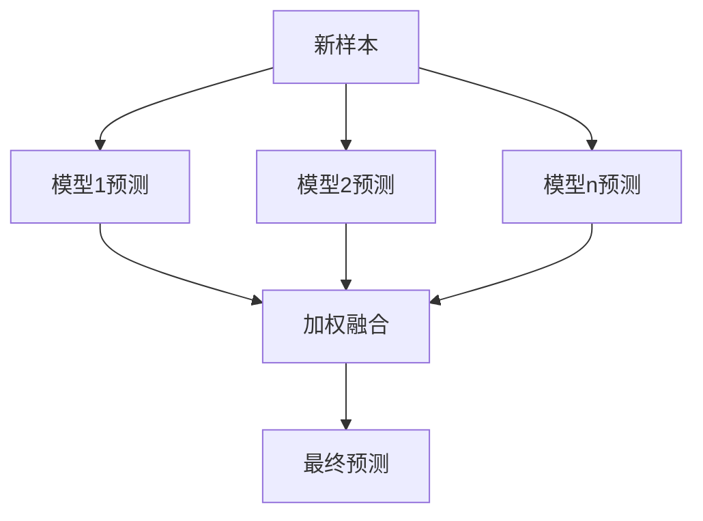
**大白话运作**：

> **公司招聘委员会**
> 
> - 技术官：反对 → 权重0.3×0=0
>     
> - HR：支持 → 权重0.2×1=0.2
>     
> - 总监：支持 → 权重0.5×1=0.5  
>     **总分0.7 → 录用**
>     

### **2. 四大集成策略

|**策略**|**具体方法**|大白话比喻|应用场景|
|---|---|---|---|
|**平均**|简单平均|评委等权重打分|房价预测|
||加权平均|资深评委权重更高|金融风控|
|**投票**|多数投票|少数服从多数|图像分类|
||加权投票|专家一票顶三票|医疗诊断|
|**学习**|加权多数算法|连续错误者失投票权|实时数据流|
|**堆叠**|Stacking|基层筛查→高层终审|癌症诊断|

**Stacking运作**：
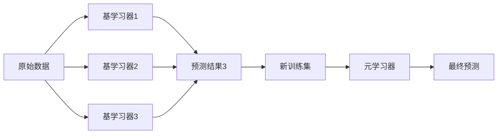
**大白话流程**：

> 1. **基层筛查**：
>     
>     - 基学习器1（CT影像模型）→ 输出肿瘤概率
>         
>     - 基学习器2（病理报告模型）→ 输出癌细胞特征
>         
>     - 基学习器3（血液检测模型）→ 输出指标异常值
>         
> 2. **高层会诊**：
>     
>     - 元学习器（主任医师）综合三方结果，给出最终诊断
>
特别注意的是：容易过拟合！！！

| **公式**                                                                 | **含义**                              | **生活比喻**   |
| ---------------------------------------------------------------------- | ----------------------------------- | ---------- |
| **弱学习器定义**：$ϵ<0.5ϵ<0.5$                                                | 比随机猜测强一点                            | 考试及格线51分   |
| **加权投票**：$∑wi⋅votei∑wi​⋅votei​$                                        | 专家话语权加权                             | 教授一票=学生三票  |
| **Stacking 输入**：$Xnew=[H1(x),H2(x),H3(x)]Xnew​=[H1​(x),H2​(x),H3​(x)]$ | 基层模型输出作为高层输入（层次融合，基学习器的输出作为次学习器的输入） | 各科室报告汇总给主任 |

## **三、三大集成方法详解**
### **1.1 加权多数算法（WMA）→ 动态评审团**
**运作流程**：  
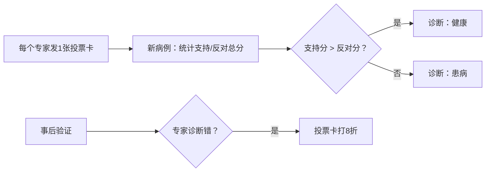

**白话解说**：  
> - 初始每人1票权  
> - 诊断错误者下次投票权打8折（连错5次只剩0.33票）  
> - **适用场景**：疾病会诊时，逐渐淘汰常误诊的科室，信任高准确率科室  

**公式深意**：  
> $w_i \leftarrow \beta \cdot w_i$ 本质是 **“信任度衰减”**  
> - β=0时：错一次直接开除（急诊科常用）  

### **1.2加权多数算法（WMA）训练过程**

#### **1.算法流程拆解（结合动态评审团比喻）**

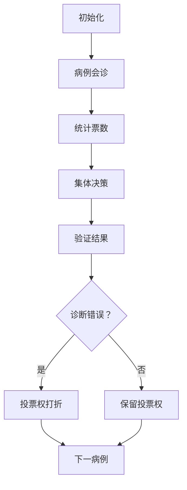


**具体步骤对应**：  

| **数学步骤**                                      | **评审团比喻**          | **关键公式**            |
| --------------------------------------------- | ------------------ | ------------------- |
| 1. 初始化权重 \( w_i = 1 \)                        | 每位医生发1张投票卡         |                     |
| 2. 计算 $( q_0 = \sum_{a_i(x)=0} w_i )$         | 统计"反对手术"总分         |                     |
| 3. 计算 $( q_1 = \sum_{a_i(x)=1} w_i )$         | 统计"支持手术"总分         |                     |
| 4. 预测：$( q_0 > q_1 ) → 0$                     | 反对总分 > 支持总分 → 不做手术 |                     |
| 5. 若预测错误：$( w_i \leftarrow \beta \cdot w_i )$ | 误诊医生投票卡打8折         | $(\beta \in [0,1))$ |

---

#### **2. 极端情况分析$(\beta=0)$时的Halving算法）**
**案例演示**：  

| 医生   | 初始权重 | 诊断错误1次 | 诊断错误2次 |  
|--------|----------|-------------|-------------|  
| 张医生 | 1        | **0**（开除）| -           |  
| 李医生 | 1        | 1           | **0**（开除）|  

**运作机制**：  
> - 医生**错诊1次即被开除**（类似急诊室零容忍）  
> - 最终存活的都是**全科诊断专家**  

**数学表达**：  
$$
w_i = \begin{cases} 
1 & \text{历史全对} \\
0 & \text{曾犯错}
\end{cases}
$$

---

### **3. 通用场景$(\beta=0.8)$的现实应用）**
**权重衰减模拟**：  

| 错误次数 | 权重计算        | 投票权比例 |  
|----------|----------------|------------|  
| 0        | \(1.0\)        | 100%       |  
| 1        | \(0.8\)        | 80%        |  
| 2        | \(0.64\)       | 64%        |  
| 3        | \(0.512\)      | 51%        |  
| 5        | **\(0.327\)**  | **33%**    |  

**现实意义**：  
> 心脏外科主任医师：  
> - 正确诊断10次 → 权重1.0（一票顶三票）  
> - 误诊2次 → 权重0.64（需3个实习医生才能抵他一票）  

---

#### **4、完整整合：动态评审团运作体系**
##### **1. 全周期管理流程图**
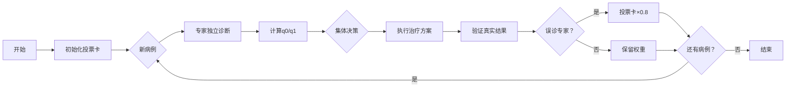

##### **2. 关键参数决策表**
| $(\beta)$值 | 容忍度 | 适用场景   | 存活专家特征     |     |
| ---------- | --- | ------ | ---------- | --- |
| **0**      | 零容忍 | 心脏移植手术 | 历史全对圣手     |     |
| **0.5**    | 低容忍 | 癌症确诊   | 错误率<10%专家  |     |
| **0.8**    | 高容忍 | 慢性病诊断  | 错误率<30%医生  |     |
| **1**      | 不惩罚 | 学术研究   | 全员保留（等同投票） |     |

##### **3. 与集成学习理论衔接**
- **弱学习器淘汰机制**：  
 $$
  \text{当 } w_i < 0.1 \text{ 时视为无效学习器}
  $$
- **强学习器形成标志**：  
  $$
  \frac{w_i}{\sum w_j} > 0.3 \text{（持续表现优异）}
 $$ 

> **现实案例**：三甲医院会诊制度  
> - 实习医生（弱学习器）初始权重=1  
> - 主任医师（强学习器）历史权重=2.5（因持续正确诊断）  
> - 误诊3次的医生权重=0.512 → 自动退出核心决策圈
---

### **2. Bagging → 同款检测仪多轮抽查**

> 背景懒得介绍😜

---

#### **2.1 Bagging核心思想**
**直觉图解**：  
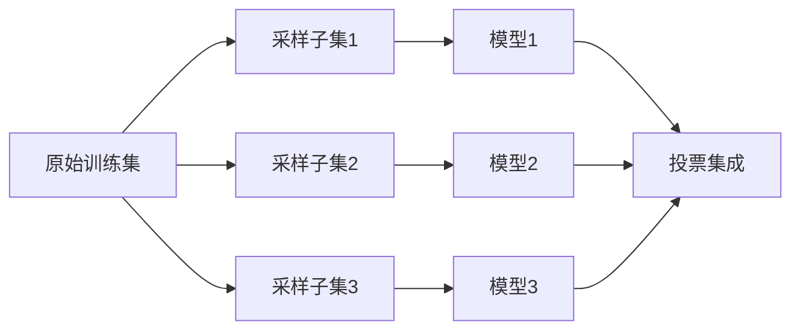

**关键洞察**：  
> “相同仪器在不同数据批次下训练，结果可能大不相同”  
> - 温度计：永远显示36.5℃ → **无效**  
> - 心电图仪：不同医生解读不同 → **有效**  

**解决方案**：  
**Bootstrap采样** → 强制制造数据差异  

---

#### **2.2Bootstrap采样数学原理**
**采样过程**：  
- 训练集大小 \( m \)  
- 有放回随机采样 \( m \) 次  
- **未被选中概率**：  
  $$
  P(\text{未被选中}) = \left(1 - \frac{1}{m}\right)^m \approx e^{-1} \approx 0.368
  $$
ps:不懂可以参考这个 [未被选中概率的公式的解析](未被选中概率的公式的解析.md)
**实例演示**：  

| 样本量 | 被抽中0次 | 被抽中1次 | 被抽中≥2次 |  
|--------|------------|------------|-------------|  
| 100    | 36.8%      | 36.8%      | 26.4%       |  
| 1000   | 36.7%      | 36.8%      | 26.5%       |  

> **现实意义**：每个采样集天然缺失37%样本 → 强制模型关注不同数据特征  

**找个例子吧：**
数学例子
假设原始数据集  
D = {(x₁, y₁), …, (x₆, y₆)}，共 6 条样本。

1. 第 1 轮 (t = 1)  
   • 有放回地抽 6 次，得到  
     D₁ = [x₃, x₅, x₃, x₁, x₂, x₆]   （x₃ 出现两次）  
   • 用 D₁ 训练一棵决策树 → H₁

2. 第 2 轮 (t = 2)  
   • D₂ = [x₂, x₂, x₄, x₆, x₅, x₁]   （x₂ 出现两次）  
   • 训练 → H₂

3. … 重复 50～100 轮，得到 H₁ … H_T。

4. 对新样本 x*：  
   先让每棵树投票  
   votes = [H₁(x*), H₂(x*), …, H_T(x*)]  
   最后取多数类别作为最终预测 ŷ。

生活例子——“群众医生会诊”

想象 100 位实习医生（对应 T=100 棵树）要给一位病人做诊断。

• 每位医生拿到的病历并不是完整原始病历，而是从医院档案库里**随机复印并允许重复**的 100 份病例（对应 Bootstrap 采样 D_t）。  
  例如：  
  – 医生 A 的档案袋：病例 3、病例 5、病例 3、病例 1、病例 2、病例 6  
  – 医生 B 的档案袋：病例 2、病例 2、病例 4、病例 6、病例 5、病例 1  
  …

• 每位医生只根据自己那袋病例**独立学习**出一套诊断规则（对应训练 H_t）。

• 当真正的新病人来了，100 位医生各自给出诊断意见，最后通过**举手表决**决定最终诊断（对应 majority vote）。

由于每位医生看到的病例略有差异，他们的错误倾向也不同；把 100 个“不完美”的意见汇总，往往比任何一位医生单独诊断都更准确、更稳健。
所以就有下面的算法了

---

#### **2.3 Bagging算法流程
**Breiman提出的标准流程**：  
```python
for t in 1 to T:  # T=50~100
    # 1. Bootstrap采样
    D_t = sample_with_replacement(D, size=len(D))
    
    # 2. 训练基学习器
    H_t = train_decision_tree(D_t)  # 典型选择
    
    # 3. 存储模型
    ensemble.append(H_t)

# 4. 预测新样本
def predict(x):
    votes = [H_t(x) for H_t in ensemble]
    return majority_vote(votes)  # 多数表决
```

**决策树集成示意图**：  

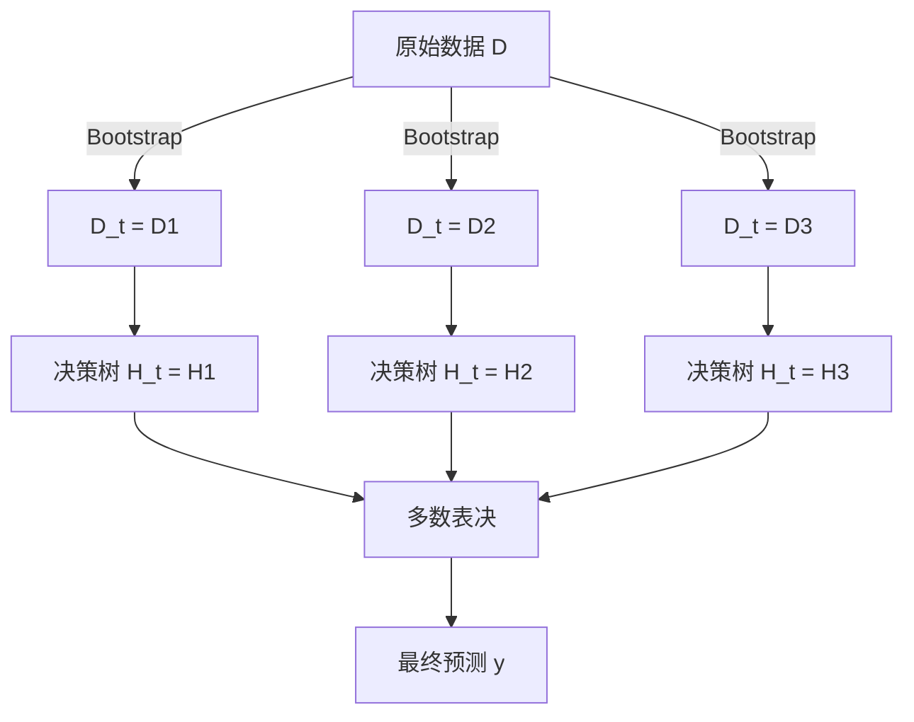

---

#### **2.4 Bagging性能实验
##### **1. Bootstrap采样数量优化**
| 采样集数量 | 错误率(%) | 收益分析 |  
|------------|-----------|----------|  
| 10         | 21.8      | 基础效果 |  
| 25         | 19.5      | ↓10.5%   |  
| 50         | 19.4      | ↓11.0%   |  
| 100        | 19.4      | **饱和** |  

> **工程建议**：50个采样集是性价比最优解  

##### **2. 多数据集对比**
| 数据集       | 单模型错误率 | Bagging错误率 | 下降幅度 |  
|--------------|--------------|---------------|----------|  
| waveform     | 29.0%        | 19.4%         | **33%**  |  
| heart        | 10.0%        | 5.3%          | **47%**  |  
| breast cancer| 6.0%         | 4.2%          | 30%      |  
| diabetes     | 23.4%        | 18.8%         | 20%      |  

**关键发现**：  
> 决策树模型经Bagging后，平均错误率**下降20-47%**  

##### **3. 稳定模型失效案例**
| 数据集       | KNN单模型错误率 | Bagging错误率 | 下降幅度 |  
|--------------|-----------------|---------------|----------|  
| waveform     | 26.1%           | 26.1%         | 0%       |  
| heart        | 6.3%            | 6.3%          | 0%       |  
| breast cancer| 4.9%            | 4.9%          | 0%       |  

**原因解析**：  
> KNN是**稳定学习器** → 采样不影响邻居关系 → 所有模型预测相同  

---

#### **2.5 Bagging本质揭秘**
**Breiman核心论断**：  
> “Bagging有效的关键是**预测方法的不稳定性**”  

**不稳定学习器特征**：  
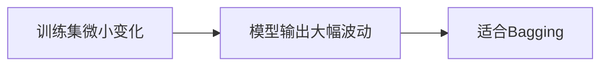

**典型不稳定模型**：  
1. 决策树（分裂点随机性）  
2. 神经网络（初始权重敏感）  
3. 支持向量机（支持向量变化）  

**稳定模型反例**：  
- K近邻（数据分布不变则结果不变）  
- 线性回归（最小二乘解唯一）  

---

#### **2.6 知识整合**
#### **Bagging在集成体系中的定位**
| **特性**       | Bagging                                | 对比项                     |  
|----------------|----------------------------------------|---------------------------|  
| **核心目标**   | 降低方差                               | Boosting：降低偏差         |  
| **数据使用**   | 独立Bootstrap采样                      | WMA：相同数据不同模型      |  
| **模型要求**   | 高方差模型（决策树/NN）                | Boosting：弱学习器         |  
| **计算效率**   | 可并行（工业界最爱）                   | Boosting：必须串行         |  
| **抗噪能力**   | 自动过滤噪声（37%概率忽略异常值）      | Boosting：放大噪声         |  

#### **工程实践指南**
1. **模型选择**：  
   - ✅ 首选决策树（特别是未剪枝的深度树）  
   - ✅ 次选神经网络  
   - ❌ 避免KNN/线性回归  

2. **参数调优**：  
   ```python
   # 最优配置模板
   n_estimators = 50    # 采样集数量（Page 22结论）
   max_samples = 1.0    # 100%采样率 
   max_features = "auto" # 特征采样（随机森林进阶技巧）
   ```

3. **避坑策略**：  
   - 当模型效果无提升 → 检查是否为稳定学习器  
   - 当过拟合时 → 减少树深度（`max_depth=5-10`）  

> **终极验证方法**（Breiman实验法）：  
> 1. 随机划分训练集（90%）和测试集（10%）  
> 2. 对比单模型错误率 $( \bar{e}_S )$ 和Bagging错误率 $( \bar{e}_B )$  
> 3. 若 $( \bar{e}_B < \bar{e}_S )$ 则Bagging有效  

---

#### **2.7 Bagging进化：随机森林**
**Breiman的进阶创新**：  
> 在Bagging基础上增加**特征随机性** → 进一步提升多样性  

**算法升级**：  
```python
# 随机森林 vs 普通Bagging
if algorithm == "RandomForest":
    for tree in ensemble:
        # 额外步骤：随机选择特征子集
        features = random_subset(all_features, size="sqrt")
        train_tree(data, features=features)
```

**效果对比**：  

| 方法      | 心脏病误诊率   | 训练速度 |
| ------- | -------- | ---- |
| 单棵决策树   | 10.0%    | 1x   |
| Bagging | 5.3%     | 50x  |
| 随机森林    | **4.1%** | 50x  |

> 随机森林成为21世纪最受欢迎的机器学习算法之一

---

### **3. AdaBoost → 错题特训班**

---

#### **3.1错题特训班的核心思想**
**基本理念图解**：  
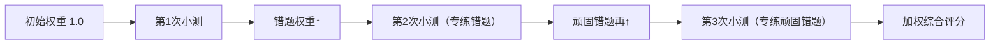

**核心洞察**：  
> “从错题中进步” → 让后续小测重点练前序做错的题  
> - **顽固错题**：权重指数级增长  
> - **已掌握题**：权重逐渐降低  

**历史奠基**：  
懒！

---

#### **3.2错题特训班流程**
看图：
**大概意思就是**
**AdaBoost**  是一种迭代的机器学习算法，主要用于解决分类问题。它的核心思想是通过一系列弱学习器（weak learner）的组合来构建一个强学习器（strong learner）。每个弱学习器在训练过程中都会对数据集中的样本进行加权，使得那些被前一个弱学习器错误分类的样本在后续的学习中得到更多的关注。
**初始权重分配**：  
在开始时，给每个样本赋予相同的权重  $\frac{1}{N}$，其中 $N$ 是样本总数。这意味着在第一次迭代中，所有样本的重要性是相等的。
**迭代过程**：  
- 在每次迭代中，根据当前的样本权重分布训练一个弱学习器 $C_t$。
- 计算该弱学习器的错误率 $\epsilon_t$，即所有被错误分类的样本权重之和。
- 根据错误率计算该弱学习器的权重 $\alpha_t = \frac{1}{2} \ln \frac{1 - \epsilon_t}{\epsilon_t}$。这个公式确保了当弱学习器表现较好（即 $\epsilon_t$ 较小）时，其对应的 $\alpha_t$ 较大，从而在最终的分类决策中具有更大的影响力。
- 更新样本权重：对于正确分类的样本，其权重乘以 $e^{-\alpha_t}$，而对于错误分类的样本，其权重乘以 $e^{\alpha_t}$。这样做的目的是让那些被错误分类的样本在下一次迭代中得到更多的关注。
- 归一化权重：为了保证所有样本权重之和为 1，需要对更新后的权重进行归一化处理。

**最终分类器**：  
将所有弱学习器 $C_t$ 按照它们的权重 $\alpha_t$ 进行线性组合，形成最终的强学习器。对于一个新的样本，通过计算所有弱学习器的加权投票结果来进行分类。
具体的推导：  [参考这个AdaBoost算法核心流程](AdaBoost算法核心流程.md)
 **大白话**
**AdaBoost 就像一个老师教学生的过程**：
**初始阶段**：  
假设你有 $N$ 个学生，一开始老师认为每个学生的学习能力都是一样的，所以给每个学生分配相同的学习任务。
**迭代教学**：  
- 老师会布置一些简单的题目（相当于弱学习器），并观察每个学生的答题情况。
- 如果某个学生答错了题，老师就会注意到这个学生可能在某些知识点上存在困难，并在下次教学中给予更多的关注和辅导。
- 对于答对题的学生，老师则会适当减少对其的关注，因为他们已经掌握了这部分知识。
- 老师还会根据每个学生的表现调整他们的“学习权重”，比如答错题的学生会被要求多做一些练习，而答对题的学生可以少做一点。
**最终评估**：  
经过多次的教学和练习，老师会对每个学生的能力有一个全面的了解，并根据他们在各个知识点上的表现给出一个综合评价。最终，老师会根据这些评价对学生进行总体的评估和排名。
**总结**：  
AdaBoost 就是通过不断调整样本权重，让模型更加关注那些难以正确分类的样本，从而逐步提高整体的分类性能。就像老师通过不断调整教学策略，帮助学生克服学习中的难点，最终达到更好的学习效果。
##### **1. 数学本质**
```python
# 初始化
sample_weights = [1/N] * N  # 所有题目等权重

for t in range(T):
    # 做一次小测
    model_t = train_model(X, y, sample_weights)
    
    # 计算加权错误率
    error_t = sum(weights[i] for i in misclassified)
    
    # 计算本次小测的“话语权”
    alpha_t = 0.5 * log((1 - error_t) / error_t)  # 核心公式
    
    # 更新题目权重
    for i in range(N):
        if misclassified:
            sample_weights[i] *= exp(alpha_t)  # 错题权重增大
        else:
            sample_weights[i] *= exp(-alpha_t)  # 对题权重减小
    
    # 权重归一化
    sample_weights /= sum(sample_weights)

# 最终得分
final_pred = sign(sum(alpha_t * model_t(x) for t in range(T)))
```

##### **2. 权重更新机制**
| **小测表现**      | $\alpha_t$ 值 | 题目权重变化       |  
|--------------------|---------------|-------------------|  
| 错误率 40% ($\epsilon_t=0.4$) | 0.2            | 错题 ×1.22，对题 ×0.82 |  
| 错误率 10% ($\epsilon_t=0.1$) | 1.1            | 错题 ×3.0，对题 ×0.33 |  
| 错误率 49% ($\epsilon_t=0.49$) | 0.02           | 几乎不变          |  

> **关键特性**：  
> 错误率越低 → $\alpha_t$ 越大 → 该次小测话语权越重

---

#### **3.3 错题特训班实例演示**

##### **1. 原始训练集**
**场景设定**：预测学生是否通过考试（+：通过，-：未通过）  
**样本分布**：
```plaintext
学生 | 学习时间 | 课堂参与 | 真实结果
-----|----------|----------|---------
A    | 低(1h)   | 低       | - 
B    | 中(2h)   | 高       | + 
C    | 高(3h)   | 低       | - 
D    | 高(3h)   | 高       | + 
E    | 低(1h)   | 高       | -   // 关键样本（努力但未通过）
```
**初始权重**：  
$w_i = 0.2$（5个样本权重相等）

---

##### **2. 三轮迭代过程**
###### **第一轮迭代：基础规则**
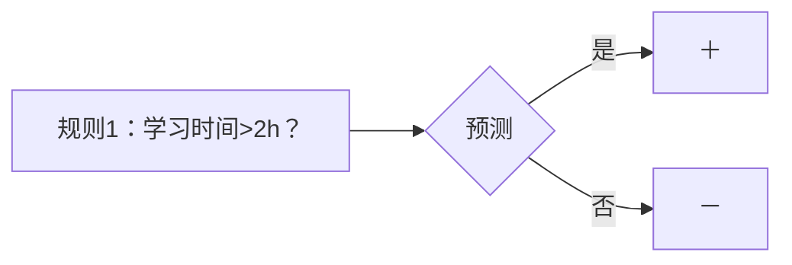
**预测结果**：

| 学生  | 真实  | 预测  | 是否正确(与真实结果比较) |
| --- | --- | --- | ------------- |
| A   | -   | -   | ✓             |
| B   | +   | -   | ✗             |
| C   | -   | +   | ✗             |
| D   | +   | +   | ✓             |
| E   | -   | -   | ✓             |

**关键计算**：
- 错误率 $(\epsilon_1 = w_B + w_C = 0.2 + 0.2 = 0.4)$
- 模型权重 $(\alpha_1 = \frac{1}{2}\ln(\frac{0.6}{0.4}) \approx 0.2)$
- **样本E权重更新**：$0.2 \times e^{0.2} \approx 0.244$（唯一错误预测样本B,C权重增大）

**归一化后权重**：

| 学生  | 新权重   |
| --- | ----- |
| A   | 0.183 |
| B   | 0.244 |
| C   | 0.244 |
| D   | 0.183 |
| E   | 0.146 |

---

###### **第二轮迭代：关注努力但失败者**
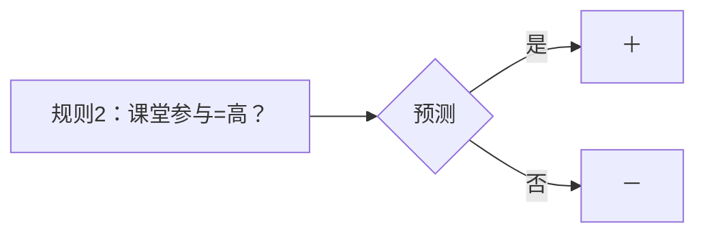
**预测结果**：

| 学生  | 真实  | 预测  | 是否正确 |
| --- | --- | --- | ---- |
| A   | -   | -   | ✓    |
| B   | +   | +   | ✓    |
| C   | -   | -   | ✓    |
| D   | +   | +   | ✓    |
| E   | -   | +   | ✗    |

**关键计算**：
- 错误率 $(\epsilon_2 = w_E = 0.146)$
- 模型权重 $(\alpha_2 = \frac{1}{2}\ln(\frac{0.854}{0.146}) \approx 0.9)$
- **样本E权重更新**：$0.146 \times e^{0.9} \approx 0.358$

**权重分布**：

| 学生  | 权重    | 状态       |
| --- | ----- | -------- |
| E   | 0.358 | **重点关注** |
| B   | 0.183 |          |
| C   | 0.183 |          |

---

###### **第三轮迭代：破解异常案例**
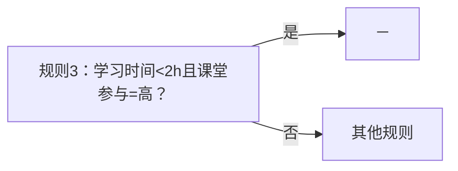
**专门针对样本E设计规则**：

| 学生 | 真实 | 预测 | 是否正确 |
|------|------|------|----------|
| E    | -    | -    | ✓        |  // 终于正确
| A    | -    | -    | ✓        |
| B    | +    | +    | ✓        |
| C    | -    | -    | ✓        |
| D    | +    | +    | ✓        |

**关键计算**：
- 错误率 $(\epsilon_3 = 0)$（完美分类）
- 模型权重 $(\alpha_3 = \frac{1}{2}\ln(\frac{1}{0}) \to \infty)$（理论值，取10代替）
- **样本E权重**：$0.358 \times e^{-10} \approx 0$（不再需要关注）

---

##### **3. 最终决策：新学生预测**
**学生档案**：  
- 学习时间=低(1h)  
- 课堂参与=高  

**集成模型决策**：

$H(x)=\operatorname{sign}\bigl(0.2\,h_1(x)+0.9\,h_2(x)+10\,h_3(x)\bigr)$
**分模型预测**：

| 模型   | 预测结果 | 权重  | 贡献值  |
|--------|----------|-------|---------|
| h₁     | -        | 0.2   | -0.2    |
| h₂     | +        | 0.9   | +0.9    |
| h₃     | -        | 10.0  | -10.0   |
| **总和** |         |       | **-9.3** → 预测"不通过" |

> **现实解释**：  
> 尽管该学生课堂参与度高（h₂支持通过），但h₃基于"低学习时间+高参与度=失败"的强规则（权重10）主导决策，最终判定不通过。  
> 此结论符合训练集中样本E的特征。

---

| **特征**    | 学生成绩示例         |
| --------- | -------------- |
| **关键样本**  | 学生E（努力但失败）     |
| **第一轮**   | 学习时间主导规则       |
| **第二轮**   | 课堂参与度规则        |
| **第三轮**   | 专门针对E的规则       |
| **模型权重比** | 0.2 : 0.9 : 10 |
| **决策主导**  | h₃绝对主导         |
| **核心启示**  | 异常案例需定制规则      |

---

#### **3.4 错题特训班 M1 变体**
**与标准错题特训班的区别**：  

| **特性**         | 错题特训班          | 错题特训班 M1       |  
|------------------|---------------------|---------------------|  
| **错误率阈值**   | 无限制              | 强制 $\epsilon_t < 0.5$ |  
| **权重更新**     | $e^{\pm\alpha_t}$   | $\beta_t = \epsilon_t/(1-\epsilon_t)$ |  
| **小测权重**     | $\alpha_t$          | $\log(1/\beta_t)$   |  

**适用场景**：  
- 标准错题特训班：二分类任务  
- 错题特训班 M1：多分类任务

---

#### **3.5 错题特训班优缺点**
##### **1. 革命性优势**
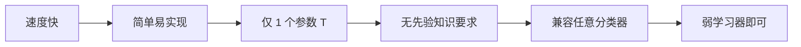

**案例对比**：  

| 方法          | 人脸检测准确率 | 训练时间 |  
|---------------|----------------|----------|  
| 单层 CNN       | 68%            | 1 小时    |  
| 错题特训班 + 决策树 | **89%**        | 15 分钟   |  

##### **2. 致命缺陷**
| **问题类型**   | 现象                      | 解决方案              |  
|----------------|---------------------------|-----------------------|  
| **噪声敏感**   | 错误标签权重指数增长       | 数据清洗 + 早停策略   |  
| **弱学习器过强** | 第 1 轮 $\alpha_t$ 过大    | 限制树深度（max_depth=2） |  
| **弱学习器过弱** | $\alpha_t \to 0$           | 增加迭代轮次 T        |  

**实验警示**：  
> 在 MNIST 数据集加入 10% 噪声标签：  
> - T = 10 轮：准确率 92% → 88%  
> - T = 100 轮：准确率 92% → **72%**（严重过拟合噪声）

---

### **3.6知识整合**
#### **错题特训班AdaBoost在集成体系中的定位**
| **特性**   | 错题特训班AdaBoost   | 对比项            |
| -------- | --------------- | -------------- |
| **核心目标** | 降低偏差            | Bagging：降低方差   |
| **数据使用** | 全数据集 + 权重调整     | Bagging：数据子集采样 |
| **训练方式** | 顺序迭代（依赖前序结果）    | Bagging：并行独立   |
| **模型要求** | 弱学习器（错误率 < 50%） | Bagging：高方差模型  |
| **最佳场景** | 低噪声数据 + 简单基模型   | Bagging：高噪声数据  |

#### **工程实践指南**
1. **基模型选择**：  
   ```python
   # 最佳实践
   base_model = DecisionTreeClassifier(
       max_depth=2  # 弱学习器：深度 2~3 的决策树
   )
   ```

2. **参数调优**：  
   ```python
   AdaBoostClassifier(
       n_estimators=50,   # 迭代轮次（通常 50~100）
       learning_rate=0.8  # 收缩权重（防过拟合）
   )
   ```

3. **噪声处理三原则**：  
   - 数据清洗：去除疑似错误标签  
   - 早停策略：验证集性能下降时终止  
   - 权重裁剪：限制最大权重（如 max_weight=5.0）

> **行业应用**：  
> - 人脸检测：Viola-Jones 框架（错题特训班 + Haar 特征）  
> - 金融反欺诈：XGBoost（错题特训班进阶版）  
> - 医疗诊断：错题特训班 + 逻辑回归组合

---

### **3.7 错题特训班进化：XGBoost /  LightGBM(杂谈)**
#### **错题特训班的现代升级版**  
**用驾校培训比喻理解**：  
想象AdaBoost是传统驾校培训：  
- **普通班**：所有学员统一练车（样本权重相同）  
- **错题特训班**：挂科学员加练（增加错题样本权重）  

但传统培训效率低 → 诞生三大智能驾培系统：  

---
#### **1. XGBoost：学霸定制班**
**核心创新**：  
> **二阶梯度分析**  
> - 传统：只记录考试挂科（一阶信息）  
> - XGBoost：还分析挂科原因（车速？方向？）  
>  
> **防走火入魔机制**  
> - 限制学员过度钻研冷门考点（正则化）  

**效果**：  

| 指标    | 传统驾校 | XGBoost |
| ----- | ---- | ------- |
| 考试通过率 | 70%  | **91%** |
| 培训周期  | 3个月  | 1个月     |

---
#### **2. LightGBM：闪电速成班**
**核心创新**：  
> **重点学员特训**  
> - 只集训多次挂科学员（基于梯度的单边采样）  
>  
> **考点合并教学**  
> - 倒车入库+侧方停车合并训练（互斥特征捆绑）  

**效果**：  
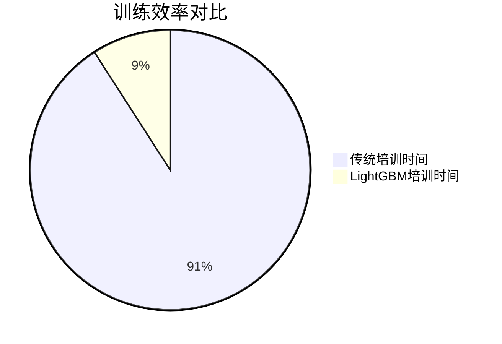

---

#### **3. CatBoost：全自动智能班**
**核心创新**：  
> **自动识别学员类型**  
> - 自动区分青年/中年学员（类别特征处理）  
>  
> **科学训练顺序**  
> - 先练基础再攻难点（有序Boosting）  

**案例**：  
- 中年学员：重点训练反应速度  
- 青年学员：强化规则记忆  

---

#### **选班指南（决策流程图）**  
**现代优化**：  

| **技术**       | 核心创新                   | 效果提升    |
| ------------ | ---------------------- | ------- |
| **XGBoost**  | 二阶梯度优化 + 正则化           | 精度 ↑30% |
| **LightGBM** | 基于梯度的单边采样 + 互斥特征捆绑     | 速度 ↑10x |
| **CatBoost** | 自动处理类别特征 + 有序 Boosting | 鲁棒性 ↑   |

**算法选择决策**：  
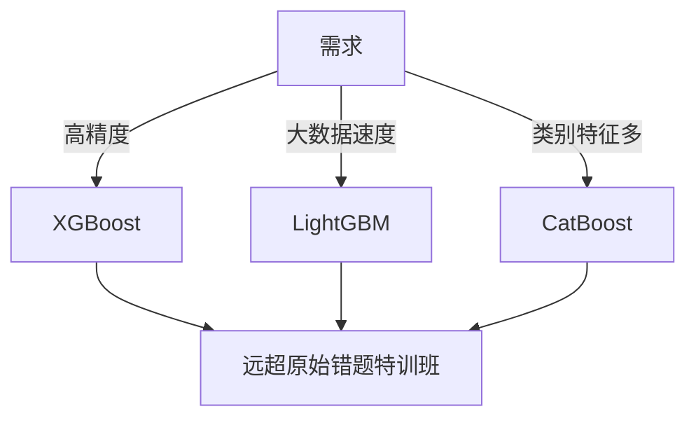

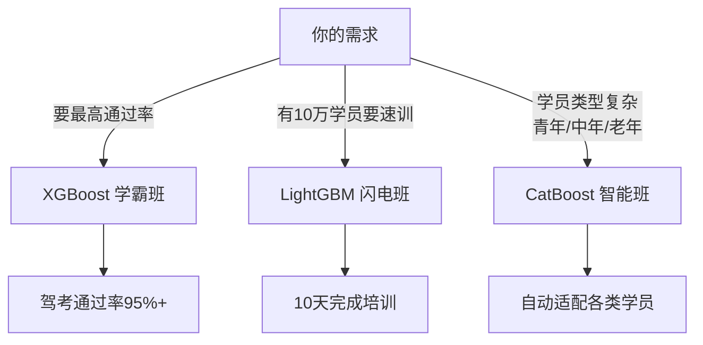

> **行业事实**：  
> 全国80%驾校冠军教练（Kaggle竞赛优胜者）使用这些智能系统，  
> 因为它们在三个维度全面超越传统培训：  
> 1. **更准**：XGBoost的精细分析  
> 2. **更快**：LightGBM的聚焦特训  
> 3. **更稳**：CatBoost的个性适配  

---


## **四、关键对比与实践指南**
#### **1. Bagging vs Boosting 终极对决**
| **维度**       | Bagging                          | Boosting                         |  
|----------------|----------------------------------|----------------------------------|  
| **团队关系**   | 独立工作的同专业团队             | 师徒传承，徒弟专攻师父弱项       |  
| **训练速度**   | 可全员并行 → **闪电战**          | 必须顺序教学 → **马拉松**        |  
| **抗噪能力**   | 自动忽略异常值 → **稳如老狗**    | 放大噪声影响 → **玻璃心**        |  
| **效果提升**   | 降低误判波动（方差↓）→ **更稳定**| 突破能力天花板（偏差↓）→ **更强**|  

#### **2. 样本处理策略白话版**
- **权重调整**：  
- Reweighting 调整样本权重可能更难处理，一些学习方法无法使用样本权重，同时也很多常用工具包不支持训练集上的权重
  > 给难题贴红标签 → 老师重点讲解（更精准但需特殊教具）  
- **重采样**：  
- 对数据使用boostrap抽样，抽样时根据每个样例的权值确定其被抽样的概率
  > 按错题比例多印试卷 → 兼容所有老师（简单但浪费纸张）  
  
一般重新调权效果会更好一些 但 重新抽样更容易实现
#### **3. 方法选择决策树（新增场景案例）**
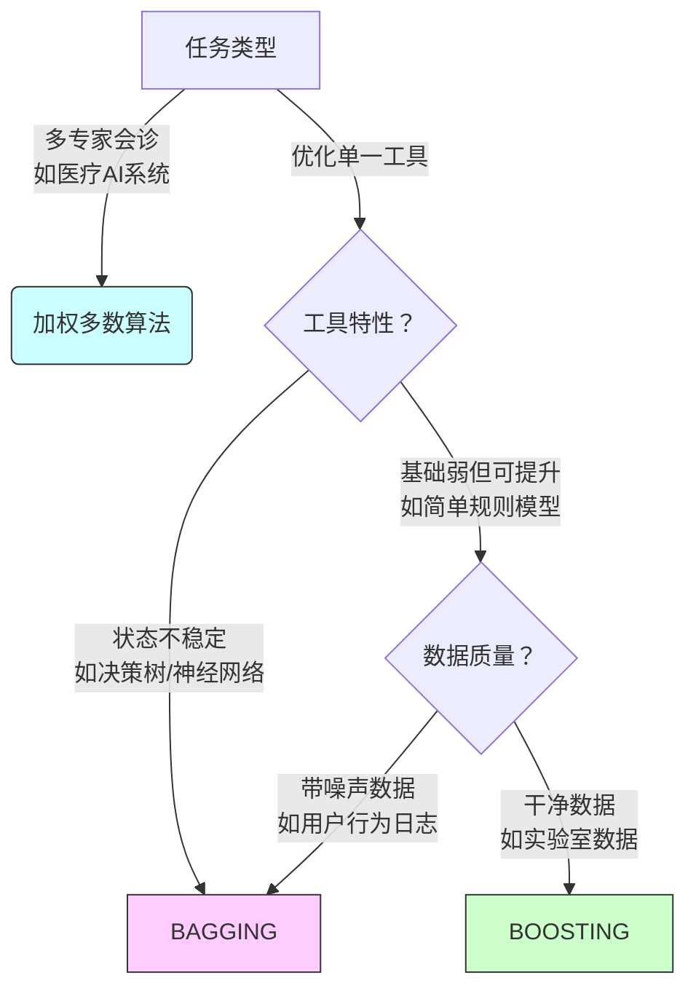

**决策案例**：  
- **选Bagging**：信用卡反欺诈（数据噪声大+用决策树）  
- **选Boosting**：癌细胞识别（标注精准+用简单CNN模型）  

---

## **五、应用与避坑指南**
#### **1. 典型应用场景**
- **Bagging实战**：  
  > 随机森林=1000棵决策树投票 → 比单棵树误诊率↓30%  
  > **优势**：即使某棵树把肺癌看成肺炎，多数树正确即可纠错  
- **Boosting实战**：  
  > AdaBoost人脸检测：  
  > 第1轮：识别正脸  
  > 第2轮：专攻侧脸  
  > 第3轮：死磕遮挡人脸  
  > **效果**：检出率从70%→95%  

#### **2. 血泪避坑指南**
- **Bagging失灵现场**：  
  > 用KNN近邻算法做Bagging → 采样后邻居关系不变 → 结果完全一致  
  > **症状**：训练100个模型，准确率1%都不提升 → 电费白交  
- **Boosting翻车现场**：  
  > 医疗数据10%错误标签 → AdaBoost疯狂学习错误病例  
  > **症状**：迭代轮次越多，效果越差 → 第3轮准确率反而比第1轮低  

#### **3. 核心公式生活意义**
| **公式**                                  | **生活比喻**                     |  
|-------------------------------------------|----------------------------------|  
| $\alpha_t = \frac{1}{2}\ln(\frac{1-\epsilon_t}{\epsilon_t})$ | 学生话语权 = 根据考试成绩定发言分量 |  
| $P_{err} \leq e^{-2T\gamma^2}$            | 团队错误率随成员数指数下降 → 10人团队比单人错误率降百倍 |  
| $w_i \leftarrow \beta \cdot w_i$          | 医生误诊一次，下次投票权打8折       |  
#### **4.概念贯穿示意图**
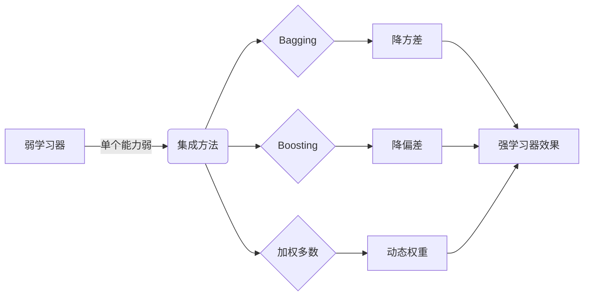
 
 #### **弱/强学习器在三大方法中的进化**

| **方法**       | 弱学习器起点    | 强学习器形成方式     |
| ------------ | --------- | ------------ |
| **Bagging**  | 100棵浅层决策树 | 投票民主制 → 集体智慧 |
| **Boosting** | 10个简单规则模型 | 错题特训 → 学霸天团  |
| **加权多数**     | 多领域基础模型   | 动态淘汰 → 精英委员会 |

> **可参考步骤**：
> 
> 1. **先判断目标**：要稳定性（Bagging）还是极限精度（Boosting）？
>     
> 2. **检查数据**：噪声多选Bagging，干净数据选Boosting
>     
> 3. **选择弱学习器**：
>     
>     - Bagging用高方差模型（深度决策树）
>         
>     - Boosting用简单模型（深度≤3的树）
>         
> 4. **进阶选择**：
>     
>     - 实时数据流 → 加权多数算法
>         
>     - 跨模态复杂任务 → Stacking
>    
> **终极忠告**：  
> - 用Bagging时 → 选**波动大**的模型（决策树/神经网络）  
> - 用Boosting时 → 确保数据**干净**，控制迭代轮数  
> - 混合使用：XGBoost=Boosting+Bagging → 竞赛大杀器