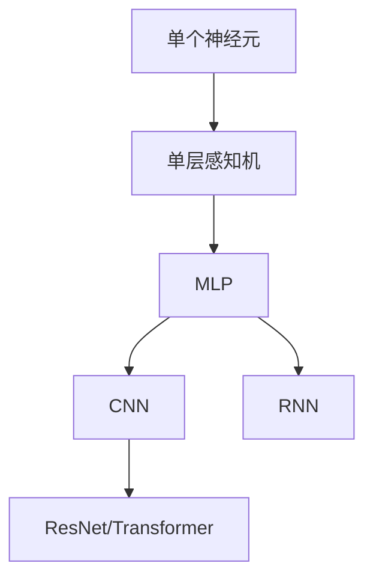

**简单介绍一下以及和CNN的对比**

---

### **一、MLP是什么？干了什么？**
#### **1. 本质定义**
- **MLP = 多个“神经元层”全连接组成的网络**  
  公式：$y_j^{(l)} = f(\sum_{i} w_{ji}^{(l)} y_i^{(l-1)} + b_j^{(l)})$  
  - $w_{ji}$：权重（连接强度）
  - $b_j$：偏置（激活阈值）
  - $f$：激活函数（如ReLU）

#### **2. 核心功能**
- **特征加工流水线**：  
  ```mermaid
  graph LR
      输入层 --> 隐藏层1 --> 隐藏层2 --> 输出层
  ```
  - **输入层**：接收原始数据（如784个像素值）
  - **隐藏层**：逐层提取特征（层数越多，特征越抽象）
  - **输出层**：生成预测结果（如分类概率）

#### **3. 大白话解释**
> **把MLP想象成快递分拣工厂**：
> 1. **输入层**：快递卸货区（接收包裹数据）
> 2. **隐藏层**：  
>    - 第1车间：拆包裹，检查物品类型（提取基础特征）  
>    - 第2车间：组合物品（如“书+文具”→学生包裹）  
> 3. **输出层**：贴最终标签（如“学生包裹→教学楼”）  
> **关键特点**：每个员工（神经元）必须和下一车间所有员工沟通（全连接）

---

### **二、MLP和CNN的关系**
#### **1. 本质联系**
- **CNN是MLP的升级版**：  
  MLP处理图像时暴露出两大缺陷 → CNN针对性优化：

| 问题         | MLP                       | CNN的解决方案           |
| ---------- | ------------------------- | ------------------ |
| **参数量爆炸**  | 全连接导致参数过多（如784x256 = 20万） | **局部连接**：每次只看图像小块  |
| **忽略空间信息** | 把图片拆成像素点，失去结构信息           | **权重共享**：用同个滤镜扫描全图 |

#### **2. 工作方式对比**
| **任务：识别猫图片** | MLP做法                          | CNN做法                          |
|----------------------|----------------------------------|----------------------------------|
| **输入处理**         | 把图片拆成像素列表：[0.2, 0.8, ...] | 保留图片结构，直接看二维像素      |
| **特征提取**         | 所有像素一视同仁，无空间概念        | 用“猫耳检测器”扫描每个区域        |
| **参数量**           | 100万+（易过拟合）                | 1万（权重共享省90%参数）          |
| **适用场景**         | 结构化数据（如表格）              | 图像/语音等空间数据              |

> **关键结论**：  
> - **MLP是通用处理器**：适合表格数据、简单分类  
> - **CNN是图像专用处理器**：通过卷积+池化保留空间信息  

---

### **三、为什么你觉得“看不懂MLP干了啥”？**
#### 常见理解卡点：
1. **全连接太抽象**：  
   - 疑惑点：“每个神经元连所有输入？那和逻辑回归有什么区别？”  
   - **关键**：MLP通过**多层隐藏层**实现特征升级，单层时≈逻辑回归

2. **激活函数的作用**：  
   - 疑惑点：“加权求和就够了，为什么还要ReLU？”  
   - **核心原因**：不加激活函数，100层MLP ≈ 1层线性回归（失去深度意义）

3. **反向传播黑盒**：  
   - 疑惑点：“误差怎么指导第一层权重的更新？”  
   - **形象解释**：  
     ```mermaid
     graph RL
         输出层误差 --> 隐藏层2 --> 隐藏层1
         style 输出层误差 fill:#f9f
     ```
     如同工厂发现次品：  
     - 先追责最后车间（输出层）  
     - 再追责中间车间（隐藏层）  
     - 最终找到原料问题（输入层）

---

### **四、MLP在深度学习中的地位**

- **MLP是基石**：后续所有网络都包含“全连接模块”（如CNN末尾的分类层）
- **历史意义**：第一个解决**非线性分类**的神经网络（如XOR问题）

---

### **五、实战建议：何时用MLP？**
| **场景**              | **推荐网络** | **原因**                     |
|------------------------|--------------|------------------------------|
| 结构化数据（房价预测） | **MLP**      | 全连接高效处理表格数据        |
| 图像识别               | CNN          | 局部特征提取优势明显          |
| 自然语言处理           | Transformer  | 注意力机制捕捉长距离依赖      |

> 一句话总结：  
> **MLP是深度学习的“万能扳手”，CNN是“精密显微镜”**  
> - 想基础入门：先掌握MLP（理解梯度下降/激活函数/反向传播）  
> - 想实战图像：立刻学CNN（掌握卷积/池化/迁移学习）