## 为什么需要深度学习？

**理论解释：**
传统机器学习方法（如线性回归、SVM）面临两大瓶颈：
1. **特征工程依赖**  
   需要人工设计特征：$\text{特征} = g(\text{原始数据})$  
   例如图像识别中需手动定义边缘、纹理等特征
   
2. **非线性建模局限**  
   简单模型难以捕捉复杂模式：  
   - 线性模型：$y = w^Tx + b$  
   - 复杂数据需要特征组合：$y = f(w_1\phi_1(x) + w_2\phi_2(x) + \cdots)$

深度学习通过**多层次特征自动提取**解决：
- 底层学习基础特征（图像边缘/角点）
- 中层组合成复杂特征（物体部件）
- 高层形成语义特征（完整物体）

**神经网络发展关键点：**
1. 生物启发：模仿神经元 $输出 = f(\sum 输入 \times 权重)$
2. 算力突破：GPU加速矩阵运算 $\mathbf{y} = f(\mathbf{Wx} + \mathbf{b})$
3. 算法革新：ReLU激活函数解决梯度消失问题

### 大白话理解：
> 想象教机器认猫：
> - **传统方法**：你先告诉机器"猫有尖耳朵、胡须、长尾巴..."（人工设计特征）
> - **深度学习**：直接给机器看千万张猫图，让它自己总结猫长什么样
> 
> 深度学习像多级加工厂：
> 1. 第一层工人：找边缘和色块
> 2. 第二层工人：组合成耳朵/眼睛
> 3. 第三层工人：拼成完整的猫

---

## 多层感知机（MLP）详解

如果看不懂MLP（多层感知机）到底干了啥，可以参考一下这个[MLP多层感知机是深度学习最基础的结构](MLP多层感知机是深度学习最基础的结构.md)

### 核心结构

**理论解释：**
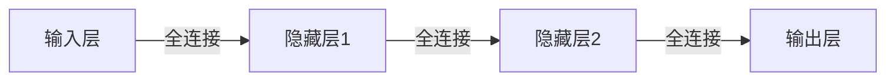

数学表示（第 $l$ 层计算）：
$$
y_j^{(l)} = f\left( \sum_{i} w_{ji}^{(l)} y_i^{(l-1)} + b_j^{(l)} \right)
$$
- $w_{ji}^{(l)}$：$l-1$ 层神经元 $i$ 到 $l$ 层神经元 $j$ 的权重
- $b_j^{(l)}$：偏置项（调节阈值）
- $f(\cdot)$：激活函数（引入非线性）

### 大白话理解：
> MLP像多级决策机构：
> - **输入层**：前台接待（接收原始数据）
> - **隐藏层**：部门经理（逐层处理信息）
> - **输出层**：CEO（做出最终决策）
> 
> 每层员工只和下一层直接沟通（前馈结构），同级不交流

---

### 激活函数——深度解析激活函数：神经网络的"灵魂开关"

#### 一、激活函数的本质作用
**数学本质**：在神经元计算 $z = \mathbf{w}^T\mathbf{x} + b$ 后，通过非线性函数 $f(z)$ 进行变换

**核心价值**：
1. 引入非线性能力：使网络能够拟合任意复杂函数
   - 无激活函数时：$y = W_3W_2W_1x$ → 等价单层线性模型
   - 有激活函数时：$y = f(W_3f(W_2f(W_1x)))$ → 万能逼近器
2. 特征空间变换：将线性不可分问题转化为可分问题
   ```python
   # 异或问题(XOR)示例
   # 线性模型无法分割(0,1)和(1,0)
   # 加入激活函数后：
   h1 = relu([1,-1]·x)  # 创建新特征维度
   h2 = relu([-1,1]·x) 
   y = h1 + h2  # 完美分类
   ```

#### 二、六大激活函数深度剖析
1. **Sigmoid（逻辑函数）**
   - 公式：$\sigma(z) = \frac{1}{1+e^{-z}}$
   - 导数：$\sigma'(z) = \sigma(z)(1-\sigma(z))$
   - 特性曲线：
   - 
     ```
     z: -∞ → 0 → +∞
     σ: 0 → 0.5 → 1
     导数：0 → 0.25 → 0
     ```
   - **优点**：输出概率解释(0 - 1)，光滑易导
   - **致命缺陷**：
     - 梯度消失：当 $|z|>5$ 时，导数$<0.01$（深度网络反向传播时梯度连乘趋近于0）
     - 非零中心：输出均值>0 → 梯度更新呈"Z"字形震荡
     - 计算耗时：含指数运算
   - **大白话理解**：Sigmoid就像个老好人，永远说“可能吧”，输出在0 - 1之间表示概率。但遇到极端情况就装死，也就是会出现梯度消失的问题。

- 在神经网络中的应用
	- **激活函数**：Sigmoid 函数常用于神经网络的激活函数，它可以将神经元的输入转换为输出，引入非线性特性，使得神经网络能够学习复杂的函数映射。例如，在早期的多层感知机（MLP）中，Sigmoid 函数被广泛使用。
	 - **输出层**：由于 Sigmoid 函数的输出范围在 (0,1)(0,1) 之间，因此可以用于表示概率。在二分类问题中，Sigmoid 函数可以作为输出层的激活函数，输出表示样本属于正类的概率。
-  局限性

	- **梯度消失问题**：当输入值非常大或非常小时，Sigmoid 函数的导数趋近于 0。在深度神经网络的反向传播过程中，这会导致梯度在传递过程中逐渐消失，使得网络难以学习。
	- **非零中心化**：Sigmoid 函数的输出始终为正，这会导致神经元的输入总是同号，使得参数更新时可能出现梯度只能沿一个方向移动的情况，影响收敛速度。
1. **Tanh（双曲正切）**
   - 公式：$\tanh(z) = \frac{e^z - e^{-z}}{e^z + e^{-z}} = 2\sigma(2z)-1$
   - 导数：$\tanh'(z) = 1 - \tanh^2(z)$
   - 特性：
     ```
     z: -∞ → 0 → +∞
     tanh: -1 → 0 → 1
     导数：0 → 1 → 0
     ```
   - **改进**：零中心输出（缓解梯度震荡）
   - **遗留问题**：梯度消失问题依然存在（当 $|z|>3$ 时导数$<0.1$）
   - **大白话理解**：Tanh是理性派，观点明确，-1表示反对，+1表示赞成。不过遇到极端情况也会沉默，梯度消失的问题还是存在。

3. **ReLU（修正线性单元）**
   - 公式：$ReLU(z) = \max(0, z)$
   - 导数：$ReLU'(z) = \begin{cases} 0 & z<0 \\ 1 & z>0 \end{cases}$
   - **革命性优势**：
     - 解决梯度消失：正区间导数为常数1
     - 计算高效：仅需比较和阈值操作
     - 生物学合理：模拟神经元"激活/抑制"特性
   - **缺陷**：
     - Dying ReLU：负输入梯度为0 → 神经元永久死亡
     - 输出非零中心
     - 无上界：可能引发数值不稳定
   - **大白话理解**：ReLU是激进派，正能量爆棚，大于0时全力输出。但听到负面消息直接屏蔽，会产生死亡神经元。

4. **Leaky ReLU（渗漏型ReLU）**
   - 公式：$LReLU(z) = \begin{cases} z & z>0 \\ \alpha z & z<0 \end{cases} \quad (\alpha≈0.01)$
   - 导数：$LReLU'(z) = \begin{cases} 1 & z>0 \\ \alpha & z<0 \end{cases}$
   - **创新点**：
     - 负区间引入微小梯度 $\alpha$ → 解决神经元死亡
     - 保留ReLU计算效率优势
   - **超参数挑战**：$\alpha$ 需手动设定（通常取0.01）
   - **大白话理解**：Leaky ReLU是温和改革派，允许少量负面意见泄漏（通过α参数），避免团队一言堂，防止神经元死亡。

5. **ELU（指数线性单元）**
   - 公式：$ELU(z) = \begin{cases} z & z>0 \\ \alpha(e^z-1) & z<0 \end{cases}$
   - 导数：$ELU'(z) = \begin{cases} 1 & z>0 \\ ELU(z)+\alpha & z<0 \end{cases}$
   - **三重优势**：
     1. 负区间平滑过渡 → 缓解神经元死亡
     2. 输出均值接近零 → 加速收敛
     3. 对噪声鲁棒性强
   - **代价**：指数计算增加复杂度
   - **大白话理解**：ELU是高情商专家，正面意见全力支持（大于0时线性），负面意见委婉处理（小于0时指数衰减）。

6. **Softmax（归一化指数）**
   - 公式：$\sigma(\mathbf{z})_i = \frac{e^{z_i}}{\sum_{j=1}^K e^{z_j}}$
   - 导数：$\frac{\partial \sigma_i}{\partial z_j} = \sigma_i(\delta_{ij} - \sigma_j)$
   - **核心价值**：将实数向量压缩为概率分布 $\sum\sigma_i=1$
   - 应用场景：多分类输出层
   - **数值稳定实现**：
     ```python
     def softmax(z):
         z_exp = np.exp(z - np.max(z))  # 防溢出
         return z_exp / np.sum(z_exp)
     ```
   - **大白话理解**：Softmax就像民主投票机，把争论转化为概率分布，说“虽然大家有分歧，但我们来表决吧”，常用于多分类的输出层。
在神经网络里，激活函数可是个至关重要的角色，咱们把理论和大白话融合起来，好好说说为啥需要它。
#### 为什么要用激活函数？
在神经网络里，激活函数超级重要。从理论讲，没激活函数时，神经网络不管多少层本质都是线性模型。就像三层网络，输入为 $\mathbf{x}$，权重矩阵是 $W_1$、$W_2$、$W_3$，没激活函数输出就是 $y = W_3W_2W_1\mathbf{x}$，这就跟人只用简单直线式思维解决问题一样，只能处理有限问题。比如判断水果是苹果还是香蕉，只看长度这种直线标准肯定不准。

激活函数引入非线性因素，让网络可以拟合复杂函数。有了它，输出变为 $y = f(W_3f(W_2f(W_1\mathbf{x})))$，就像给网络开了“脑洞”，能从不同角度灵活思考，处理复杂问题。

而且激活函数能把输入数据从一个特征空间映射到另一个，将线性不可分问题转化为线性可分。就像区分不同性格的人，只看说话音量和走路速度分不出来，激活函数能增加新判断依据，让分类更准确。

从信息传递看，没激活函数，网络每层神经元传递信息只是简单线性组合，像信息传递链上的人原封不动传信息。激活函数让神经元能加工信息，让信息在网络中“活”起来，使网络学习到复杂模式，完成各种任务。所以激活函数让神经网络从“笨家伙”变成“智能高手”。 
**
**
#### 三、激活函数选择策略
1. **隐藏层黄金标准**：
   - 首选：ReLU（快速收敛）
   - 遇神经元死亡 → 切Leaky ReLU/ELU
   - 循环网络：Tanh（控制输出范围）
2. **输出层选择**：
   - 二分类：Sigmoid
   - 多分类：Softmax
   - 回归：线性函数（或ReLU处理非负输出）

#### 四、性能对比表
| 函数       | 计算效率 | 梯度传播 | 输出范围 | 主要缺陷       | 大白话类比 |
|------------|----------|----------|----------|------------------|----------------|
| Sigmoid    | 中       | 差       | (0,1)    | 梯度消失         | 老好人，永远说“可能吧”，极端情况装死 |
| Tanh       | 中       | 中       | (-1,1)   | 梯度消失         | 理性派，观点明确，极端情况沉默 |
| **ReLU**   | **高**   | **优**   | [0,∞)    | 神经元死亡       | 激进派，正能量爆棚，屏蔽负面消息 |
| Leaky ReLU | 高       | 优       | (-∞,∞)   | 需设α参数        | 温和改革派，允许少量负面意见泄漏 |
| ELU        | 低       | 优       | (-α,∞)   | 计算复杂         | 高情商专家，正面全力支持，负面委婉处理 |
| Softmax    | 中       | 特殊     | 概率分布 | 仅用于输出层     | 民主投票机，把争论转化为概率分布 |

#### 五、激活函数行为可视化
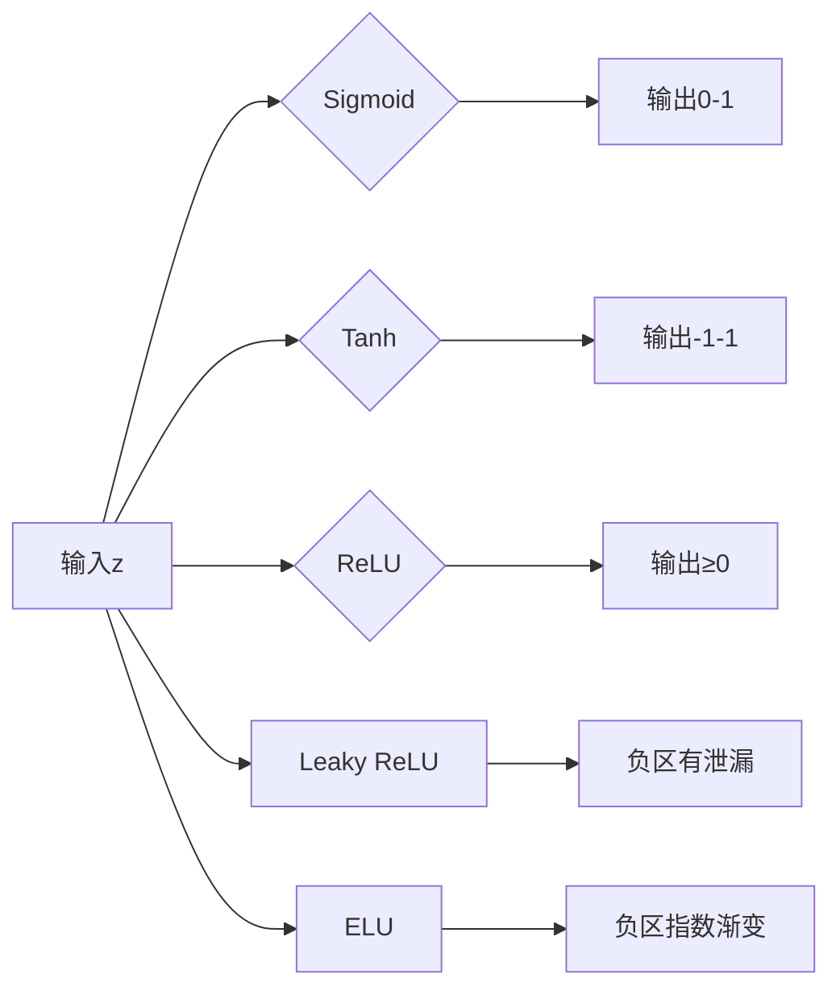

#### 六、更多大白话理解
> **为什么ReLU最常用？**
> 就像高效团队：
> - 简单直接（计算快）
> - 正向激励（正区间梯度畅通）
> - 屏蔽噪音（负输入直接归零）
> 
> 代价是可能有人被永久禁言（死亡神经元）→ 所以需要Leaky ReLU/ELU来补救

> **梯度消失的灾难**
> 想象瀑布传话游戏：
> - Sigmoid/Tanh：每层只传递10%信息 → 到底层几乎归零
> - ReLU：每层传递100%正向信息 → 底层清晰接收

---
### 前向传播：神经网络的"决策流水线"  
---
#### **1. 数学本质与流程**  
前向传播是数据从输入层流向输出层的计算过程，核心公式：  
$$  
\boxed{  
\begin{aligned}  
\text{第 } l \text{ 层输入} &:  \mathbf{u}^{(l)} = \mathbf{W}^{(l)} \mathbf{y}^{(l-1)} + \mathbf{b}^{(l)} \\  
\text{第 } l \text{ 层输出} &:  \mathbf{y}^{(l)} = f(\mathbf{u}^{(l)})  
\end{aligned}  
}  
$$  
**流程分解**：  
1. **输入层**：$\mathbf{y}^{(0)} = \mathbf{x}$ （原始数据如图像像素）  
   → *好比原料进入工厂流水线*  

2. **隐藏层计算**（$l=1$ 到 $L-1$）：  
   - 加权求和：$\mathbf{u}^{(l)} = \mathbf{W}^{(l)} \mathbf{y}^{(l-1)} + \mathbf{b}^{(l)}$  
     （权重 $\mathbf{W}$ 是连接强度，偏置 $\mathbf{b}$ 是激活阈值）  
   - 激活变换：$\mathbf{y}^{(l)} = f(\mathbf{u}^{(l)})$  
     → *如同车间工人对半成品加工：先称重配料（加权求和），再按标准整形（激活函数）*  

2. **输出层**：  
   - 分类任务：
   $$\mathbf{y}^{(L)} = \text{softmax}(\mathbf{u}^{(L)})$$  
     $$\text{softmax}(z_i) = \frac{e^{z_i}}{\sum_j e^{z_j}} \quad \text{→ 输出概率分布}  
     $$
   - 回归任务：$\mathbf{y}^{(L)} = \mathbf{u}^{(L)}$ （线性输出）  
     → *最终质检员给出结果：产品合格率（分类）或尺寸数据（回归）*

---

#### **2. 实例拆解：数字识别**  
**任务**：识别手写数字"7"（28×28 像素图像）  
**网络结构**：输入层(784) → 隐藏层1(256-ReLU) → 隐藏层2(128-ReLU) → 输出层(10-softmax)  

**前向传播步骤**：  
1. **输入层**：  
   $\mathbf{y}^{(0)} = [x_1, x_2, ..., x_{784}]$ （归一化像素值）  
   → *将784个像素点铺平成原料清单*  

2. **隐藏层1**：  
   ```python
   u1 = W1 @ y0 + b1  # W1形状(256,784), b1形状(256,)
   y1 = relu(u1)      # 所有负值归零
   ```  
   → *第一车间：256名工人各自检查特定图案（如"横线"、"竖线"），发现特征就激活（输出>0）*  

3. **隐藏层2**：  
   ```python
   u2 = W2 @ y1 + b2  # W2形状(128,256)
   y2 = relu(u2)      # 进一步抽象
   ```  
   → *第二车间：128名高级技工组合初级特征（如把"横线+竖线"拼成"7字形"），符合标准就传递*  

4. **输出层**：  
   ```python
   u3 = W3 @ y2 + b3  # W3形状(10,128)
   y3 = softmax(u3)   # 输出10个数字的概率
   ```  
   → *质检部：10位专家分别评估"像数字0~9的程度"，softmax将评分转为概率（如[0.01, 0.02, ..., 0.85]）*  

**结果**：输出层第8个神经元（对应数字7）概率0.85 → 预测正确！

---

#### **3. 关键数学特性**  
- **维度变化**：  
  若第 $l-1$ 层有 $m$ 个神经元，第 $l$ 层有 $n$ 个神经元：  
  - $\mathbf{W}^{(l)}$ 是 $n \times m$ 矩阵  
  - $\mathbf{u}^{(l)}, \mathbf{b}^{(l)}, \mathbf{y}^{(l)}$ 是 $n \times 1$ 向量  
  → *每层工人数可自由设定，但必须对齐流水线接口*  

- **非线性能力来源**：  
  仅当激活函数 $f$ **非线性**时（如ReLU），多层叠加才能突破线性限制：  
  $$  
  \mathbf{y}^{(L)} = f^{(L)}(\mathbf{W}^{(L)} f^{(L-1)}(\cdots f^{(1)}(\mathbf{W}^{(1)} \mathbf{x} )))  
  $$  
  → *如同多级加工：线性工序（加权求和）配合非线性整形（激活函数），最终造出复杂产品*

---

#### **4. 大白话原理总结**  
> **前向传播就像工厂流水线**：  
> 1. **原料投入**（输入层）：  
>    - 原始数据（如图片像素值）装车运送  
>  
> 2. **多级加工**（隐藏层）：  
>    - 每道工序：工人小组先**称重配料**（$\mathbf{u} = \mathbf{Wy} + \mathbf{b}$）  
>    - 再用**模具整形**（$y = f(u)$）：  
>      - ReLU模具：负值直接切掉（保留特征精华）  
>      - Sigmoid模具：压缩成0-1间的软泥（概率化）  
>  
> 3. **成品检验**（输出层）：  
>    - 分类任务：10个质检员**投票评分**（softmax出概率）  
>    - 回归任务：直接测量**产品尺寸**（线性输出）  
>  
> **为什么需要多层？**  
> 单层车间只能生产螺丝钉（简单特征）  
> 三层车间却能造汽车：  
> - 车间1生产零件（边缘/颜色）  
> - 车间2组装部件（车轮/方向盘）  
> - 车间3整合整车（完整物体）

---

### 误差函数、梯度消失与交叉＋Softmax权重更新：深度学习的核心机制解析
---
#### **一、误差函数：神经网络的"评分考官"**  
**数学本质**：  
误差函数 $E$ 量化预测值 $\mathbf{\hat{y}}$ 与真实值 $\mathbf{t}$ 的差距，是网络学习的指挥棒。  
常见误差函数：

1. **均方误差 (MSE)**：  
   $$E = \frac{1}{2N} \sum_{n=1}^N \sum_{k=1}^K (t_k^{(n)} - \hat{y}_k^{(n)})^2$$  
   - **特点**：惩罚大误差更严厉（平方放大）  
   - **致命缺陷**：与Sigmoid激活函数配合时 → 梯度消失  
     $$\frac{\partial E}{\partial w} \propto \underbrace{(t - \hat{y})}_{\text{误差}} \times \underbrace{\hat{y}(1-\hat{y})}_{\text{Sigmoid导数}}$$  
     当 $\hat{y}$ 接近0或1时，导数 $\hat{y}(1-\hat{y}) \to 0$ → 梯度消失！

2. **交叉熵 (Cross-Entropy)**：  
   $$E = -\frac{1}{N} \sum_{n=1}^N \sum_{k=1}^K t_k^{(n)} \ln(\hat{y}_k^{(n)})$$  
   - **黄金搭档**：Softmax输出层  
   - **梯度优势**：  
     $$\frac{\partial E}{\partial z_k} = \hat{y}_k - t_k$$  
     梯度直接等于预测误差 → 彻底避开激活函数导数！

> **大白话比喻**：  
> - **MSE考官**：  
>   ️像严格的数学老师，用平方放大错误："差1分扣10分！"  
>   但当学生用Sigmoid答题（总回答0.001或0.999）时，老师认为"已经接近答案，无需改进" → 学习停滞  
> 
> - **交叉熵考官**：  
>   ️像实战型教练："只要动作不对，就往死里扣！"  
>   学生犯错时立刻收到强烈反馈（梯度=预测值-真实值）→ 快速纠错  

---
### **二、梯度消失：深度网络的"信号衰减危机**  
**数学原理**：  
反向传播通过链式法则计算梯度：  
$$
\frac{\partial E}{\partial w^{(l)}} = \frac{\partial E}{\partial y^{(L)}} \times \prod_{k=l}^{L-1} \underbrace{\frac{\partial y^{(k+1)}}{\partial u^{(k)}}}_{\text{激活导数}} \times \cdots
$$  
若激活函数的导数 $|f'(u)| < 1$，深层梯度呈指数衰减：  
$$\left| \frac{\partial E}{\partial w^{(l)}} \right| \propto |f'(u)|^{L-l} \to 0$$


**数学原理与影响**：
$$
\left| \frac{\partial E}{\partial w^{(l)}} \right| \propto \prod_{k=l}^{L} |f'(u^{(k)})| \xrightarrow{|f'|<1} 0
$$
**激活函数导数对比**：

| 函数        | 导数范围     | 10层后梯度保留率 | 比喻说明               |
|-------------|-------------|------------------|------------------------|
| Sigmoid     | (0, 0.25]   | <0.000001%       | 传话游戏：信息逐层丢失 |
| Tanh        | (0, 1]      | 约0.001%         | 信号中继站衰减         |
| **ReLU**    | {0, 1}      | 100%             | 光纤直连：无损传输     |
| Leaky ReLU  | {α, 1}      | >99%             | 备用通道防中断         |

**解决方案矩阵**：
```python
解决方案 = {
    "激活函数革命": ["ReLU", "LeakyReLU(α=0.01)", "ELU"],
    "结构创新": ["ResNet跨层连接: y=ƒ(Wy+b)+y", 
              "LSTM/GRU门控机制"],
    "损失函数优化": ["交叉熵+Softmax", "Focal Loss(处理不平衡)"],
    "归一化技术": ["BatchNorm", "LayerNorm", "GroupNorm"]
}
```

**灾难性影响**：  
- 浅层权重几乎不更新：$||\nabla w^{(1)}|| \approx 0$  
- 网络仅学习深层特征 → 失去"多层次抽象"意义  

> **大白话比喻**：  
> **梯度消失就像传话游戏**：  
> - **Sigmoid/Tanh团队**：  
>   每人传递信息时只保留片段（导数<1）  
>   "今晚7点攻城" → "晚上...攻城" → "攻城?" → 前线收不到完整指令  
>   
> - **ReLU团队**：  
>   听到正确命令就100%传递（导数=1）  
>   "今晚7点攻城" → "今晚7点攻城" → 准时行动！  
>   
> **但ReLU也有隐患**：  
> 当输入为负时完全沉默（死亡神经元）→ 如同士兵听到错误指令直接躺平  

---

##### **解决方案：打破梯度消失的"信号屏障"**  
1. **激活函数革命**：  
   - **ReLU家族**（Leaky ReLU, ELU）：  
     $$\text{Leaky ReLU}(z) = \begin{cases} z & z>0 \\ 0.01z & z<0 \end{cases}$$  
     负区间保留0.01梯度 → 防止信号完全中断  
   - **梯度高速公路**（ResNet跨层连接）：  
     $$y^{(l+1)} = f(\mathbf{W}y^{(l)} + \mathbf{b}) + y^{(l)}$$  
     梯度可直接跳过层级 → 如同铺设专用光缆  

2. **损失函数+输出层组合拳**：  

| 任务类型 | 输出层激活       | 误差函数    | 梯度特性                  |
| ---- | ----------- | ------- | --------------------- |
| 二分类  | Sigmoid     | 二元交叉熵   | $\hat{y} - t$         |
| 多分类  | **Softmax** | **交叉熵** | $\hat{y} - t$         |
| 回归   | 线性          | 均方误差    | $(\hat{y}-t)\cdot f'$ |

3. **归一化技术**（BatchNorm）：  
   $$\hat{x} = \frac{x - \mu}{\sqrt{\sigma^2 + \epsilon}}$$  
   将每层输入约束在稳定区间 → 避免激活函数进入饱和区  

4. **均方误差(MSE)的困境**：
   - 梯度计算：$\frac{\partial E}{\partial w} \propto (t - \hat{y}) \times \underbrace{\hat{y}(1-\hat{y})}_{\text{Sigmoid导数}}$
   - **梯度消失陷阱**：当预测值接近0或1时，导数趋近0 → 学习停滞
   - 如同刻板的考勤系统：对接近满分的学生不再提出改进要求

2. **交叉熵的革命性优势**：
   - 梯度计算：$\frac{\partial E}{\partial z_k} = \hat{y}_k - t_k$
   - **绕过激活函数导数**：直接连接预测误差与参数更新
   - 如同实战型教练：只要动作不完美就持续要求改进

#### 三、交叉熵+Softmax：黄金组合的数学奇迹

**联合工作机制**：
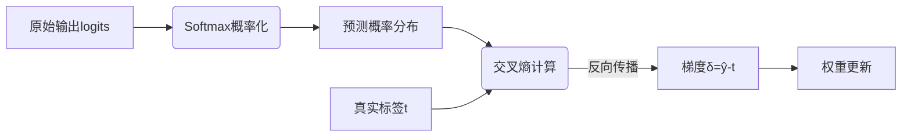

**梯度推导的数学之美**：
$$
\begin{align*}
\frac{\partial E}{\partial z_k} 
&= -\sum_i t_i \frac{\partial \ln \hat{y}_i}{\partial z_k} \\
&= -\sum_i t_i \frac{1}{\hat{y}_i} \frac{\partial \hat{y}_i}{\partial z_k} \\
&= -\sum_i t_i \frac{1}{\hat{y}_i} [\hat{y}_i(\delta_{ik} - \hat{y}_k)] \\
&= -\sum_i t_i (\delta_{ik} - \hat{y}_k) \\
&= -t_k + \hat{y}_k \sum_i t_i \\
&= \hat{y}_k - t_k \quad \blacksquare
\end{align*}
$$

**物理意义可视化**：
```python
import matplotlib.pyplot as plt
import numpy as np

# 创建预测和真实值差异示例
t = np.array([0, 0, 1.0])  # 真实标签
ŷ = np.array([0.1, 0.2, 0.7])  # 理想预测
ŷ_bad = np.array([0.4, 0.5, 0.1])  # 错误预测

plt.figure(figsize=(10, 4))
plt.subplot(121)
plt.bar(range(3), ŷ - t, color=['blue']*2 + ['red'])
plt.axhline(0, color='black')
plt.title("理想预测梯度: δ = ŷ - t")
plt.ylim(-1, 1)

plt.subplot(122)
plt.bar(range(3), ŷ_bad - t, color=['red']*3)
plt.axhline(0, color='black')
plt.title("错误预测梯度: 强烈纠错信号")
plt.ylim(-1, 1)
plt.tight_layout()
```

#### 四、权重更新：神经网络的"学习引擎"

**完整更新流程**：
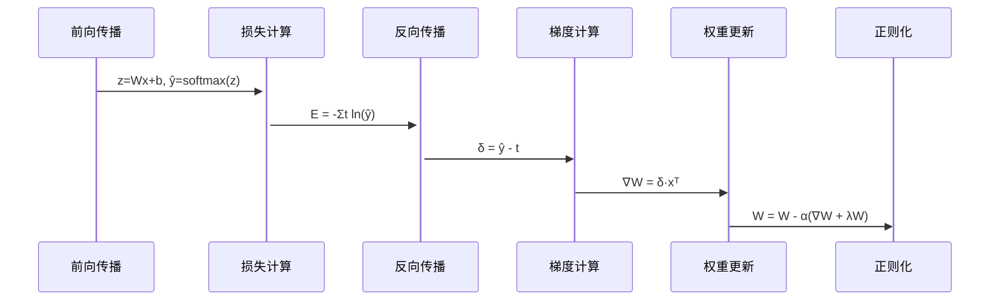

**L2正则化的物理意义**：
$$
\mathbf{W} \leftarrow \mathbf{W} - \alpha \left( \underbrace{\frac{\partial E}{\partial \mathbf{W}}}_{\text{业绩导向}} + \underbrace{\lambda \mathbf{W}}_{\text{权力制衡}} \right)
$$

- **λ (正则化强度)**：CEO的监管力度
  - λ=0：完全自由竞争 → 可能形成垄断(过拟合)
  - λ过大：过度监管 → 抑制创新(欠拟合)
- **最优平衡**：通过交叉验证选择λ

**更新过程代码实现**：
```python
def train_step(X, y, W, b, lr=0.01, lambd=0.01):
    # 前向传播
    z = X @ W + b
    y_hat = softmax(z)
    
    # 交叉熵损失
    loss = -np.mean(y * np.log(y_hat + 1e-8))
    
    # 反向传播 (黄金组合核心优势!)
    dz = y_hat - y
    dW = X.T @ dz / X.shape[0]
    db = np.mean(dz, axis=0)
    
    # L2正则化
    dW += lambd * W
    
    # 权重更新
    W -= lr * dW
    b -= lr * db
    
    return W, b, loss
```

#### 五、多维度对比与最佳实践

**损失函数性能对比**：

| 指标                | 交叉熵+Softmax       | 均方误差(MSE)        | 合页损失(Hinge)      |
|---------------------|----------------------|----------------------|----------------------|
| 梯度计算复杂度       | O(n)                 | O(n)                 | O(n)                 |
| 梯度消失风险         | ★☆☆☆☆ (极低)         | ★★★★☆ (高)           | ★★★☆☆ (中)           |
| 概率解释性           | ★★★★★                | ★★☆☆☆                | ★☆☆☆☆                |
| 多分类适应性         | ★★★★★                | ★★☆☆☆                | ★★★☆☆                |
| 收敛速度             | ★★★★★                | ★★☆☆☆                | ★★★☆☆                |

**激活函数选择策略**：
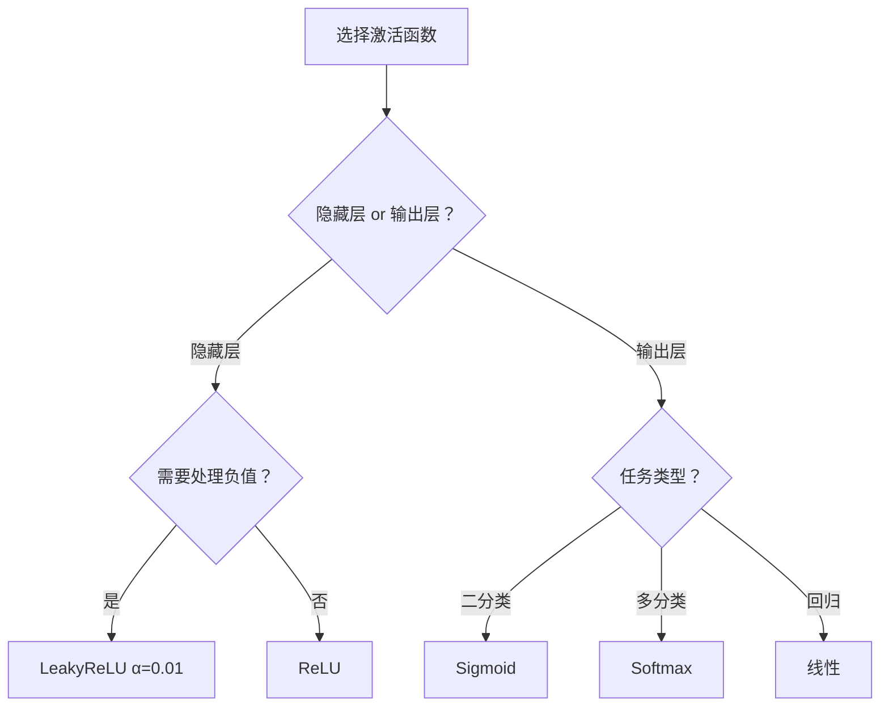

**端到端最佳实践**：
```python
from tensorflow.keras.models import Sequential
from tensorflow.keras.layers import Dense, BatchNormalization
from tensorflow.keras.regularizers import l2

model = Sequential([
    Dense(256, activation='relu', kernel_regularizer=l2(0.01)),
    BatchNormalization(),  # 解决梯度消失的辅助手段
    Dense(128, activation='leaky_relu'),
    Dense(10, activation='softmax')
])

model.compile(
    optimizer='adam',  # 自适应学习率
    loss='categorical_crossentropy',  # 交叉熵
    metrics=['accuracy']
)

# 处理类别不平衡
class_weights = {0: 0.2, 1: 0.8}  # 根据实际分布调整

model.fit(X_train, y_train, 
          epochs=100,
          class_weight=class_weights,
          validation_data=(X_val, y_val))
```

#### 六、可视化：梯度流动与权重演化

**梯度流动全景观**：
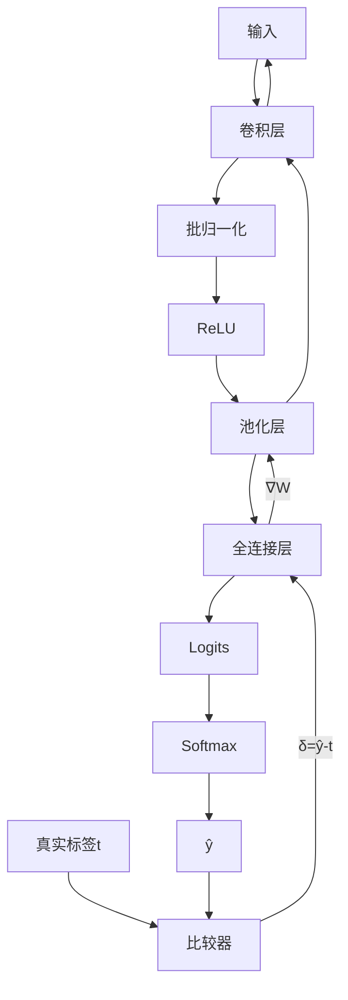

**权重更新动态模拟**：
```python
# 伪代码：权重更新可视化
fig, ax = plt.subplots(1, 2, figsize=(14, 6))
weights_history = []
grad_norms = []

for epoch in range(100):
    # 训练步骤...
    weights_history.append(W.copy())
    grad_norms.append(np.linalg.norm(dW))
    
    # 可视化
    ax[0].clear()
    ax[0].imshow(W, cmap='coolwarm', vmin=-1, vmax=1)
    ax[0].set_title(f'权重矩阵 epoch={epoch}')
    
    ax[1].clear()
    ax[1].plot(grad_norms, 'bo-')
    ax[1].set_title('梯度幅值变化')
    ax[1].set_yscale('log')
    
    plt.pause(0.05)
```

#### 七、避坑指南与前沿发展

**常见陷阱及解决方案**：

| 问题                | 现象                  | 解决方案                     |
|---------------------|-----------------------|------------------------------|
| 数值不稳定          | NaN/Inf损失值         | Softmax(z - max(z))          |
| 死亡神经元          | 输出恒为0             | LeakyReLU/ELU激活函数        |
| 梯度爆炸            | 损失突然变为NaN       | 梯度裁剪(Gradient Clipping)  |
| 过拟合              | 训练集>>验证集性能    | Dropout + L2正则化           |
| 类别不平衡          | 模型偏向多数类        | 加权交叉熵 + Focal Loss      |

**交叉熵的进阶变体**：
1. **Focal Loss**：
   $$FL = -(1-\hat{y}_t)^γ \ln(\hat{y}_t)$$
   - γ>0时降低易分类样本权重
   - 特别适用于目标检测等不平衡任务
   
2. **标签平滑(Label Smoothing)**：
   $$t_k' = (1-ε)t_k + ε/K$$
   - 防止模型过度自信
   - 提升模型泛化能力

3. **知识蒸馏损失**：
   $$L = α·CE(ŷ, t) + β·KL(ŷ_{tea}||ŷ_{stu})$$
   - 教师模型指导轻量学生模型
   - 平衡准确率与推理效率

**交叉熵在Transformer中的应用**：
```python
# Transformer中的交叉熵实现
class CrossEntropyLoss(nn.Module):
    def forward(self, logits, targets):
        log_probs = F.log_softmax(logits, dim=-1)
        loss = F.nll_loss(
            log_probs.view(-1, log_probs.size(-1)),
            targets.view(-1),
            reduction='mean'
        )
        return loss
```

#### 深度学习优化的金三角

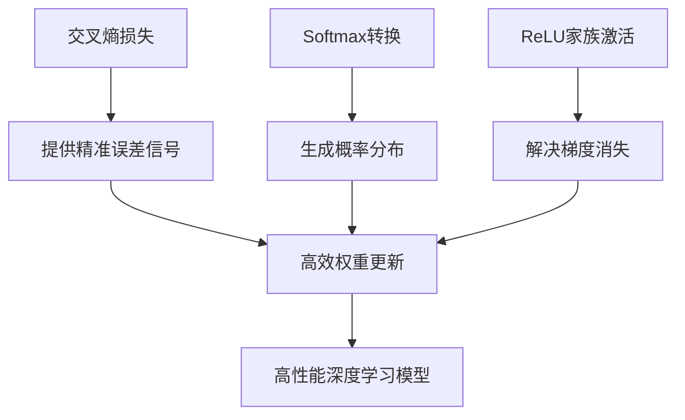

**核心记忆点**：
1. **交叉熵+Softmax**：梯度$\frac{\partial E}{\partial z_k} = \hat{y}_k - t_k$是深度学习的基石
2. **权重更新三要素**：
   - 误差信号：$\delta = \hat{\mathbf{y}} - \mathbf{t}$
   - 梯度计算：$\nabla_W = \delta \mathbf{x}^T$
   - 正则化更新：$W = W - \alpha (\nabla_W + \lambda W)$
3. **实践金律**：
   ```python
   # 99%分类任务的标准配置
   model = Sequential([
       Dense(256, activation='relu', kernel_regularizer=l2(0.01)),
       Dropout(0.5),
       Dense(10, activation='softmax')
   ])
   model.compile(loss='categorical_crossentropy', 
                 optimizer='adam', 
                 metrics=['accuracy'])
```

---
## 三、卷积神经网络（CNN）详解

### 3.1 核心思想：局部感知与权重共享
> **大白话解释**：  
> 想象你在检查一栋大楼的每个房间。CNN就像拿着手电筒（卷积核）的检查员：  
> - **局部连接**：每次只照亮一个小房间（感受野），不要求看清整栋楼  
> - **权重共享**：用同一把手电筒检查所有房间，发现相同问题（如裂缝）  


数学表达：  
$\displaystyle y_{i,j} = \sum_{m=0}^{k_h-1} \sum_{n=0}^{k_w-1} w_{m,n} \cdot x_{i+m,j+n} + b$

### 3.2 CNN架构：LeNet经典示例
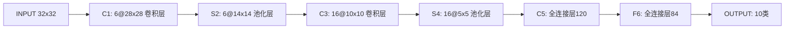

> **工作流程大白话**：  
> 如同工厂流水线：  
> 1. 卷积层是精细加工（每个零件单独处理）  
> 2. 池化层是质量检测（整批产品抽样检查）  
> 3. 全连接层是总装车间（组装完整产品）

### 3.3 2D卷积：数学原理与实现
#### 3.3.1 卷积模式对比
| 模式    | 输出尺寸             | 大白话解释                     |
|---------|----------------------|------------------------------|
| Valid   | $(M-K_h+1)×(N-K_w+1)$ | "不补边"：就像照片比相框小，直接裁掉多余部分 |
| **Same**| $M×N$                | "自动补边"：给照片加白边，保持原尺寸 |
| Full    | $(M+K_h-1)×(N+K_w+1)$ | "过度补边"：相框比照片大很多，留大量白边 |

> **印章拓印比喻**：  
> 卷积核就像公司公章，图像是合同纸：  
> - Valid模式：只在文字区域盖章（不碰空白处）  
> - Same模式：自动调整位置盖满整页  
> - Full模式：连纸张边缘都盖上章  
> - 


#### 3.3.2 多通道卷积
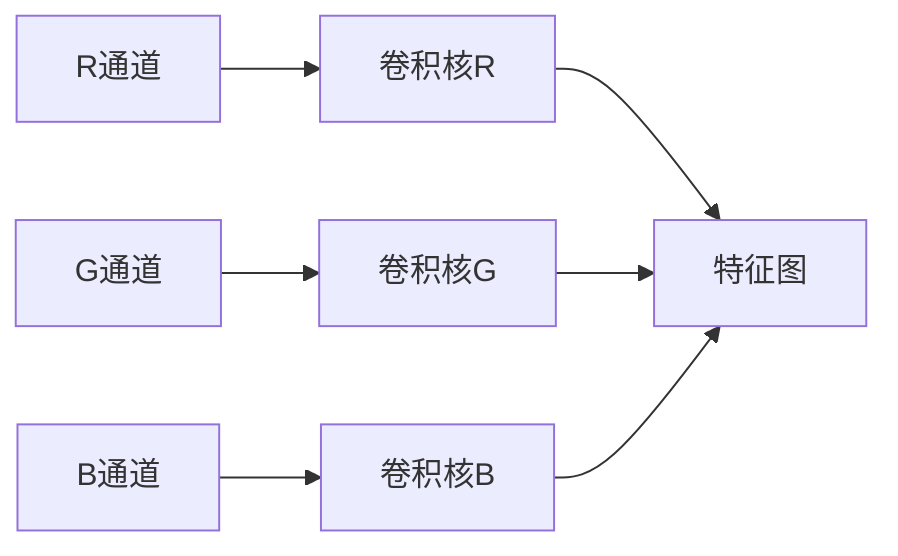

> **调色师工作比喻**：  
> 红色专家专攻R通道，绿色专家处理G通道，他们各自用专用放大镜（卷积核）检查细节，最后由项目经理（bias）整合报告。

### 3.4 局部池化：特征压缩技术
#### 3.4.1 池化类型对比
| 类型       | 数学表达式                               | 大白话解释                 |
| -------- | ----------------------------------- | --------------------- |
| **最大池化** | $y = \max(window)$                  | "选代表"：每个小区选成绩最好的学生当代表 |
| 平均池化     | $\displaystyle y = \frac{1}{        | window                |
| L2池化     | $\displaystyle y = \sqrt{\sum x^2}$ | "综合评估"：考虑所有学生的综合表现    |

> **反向传播大白话**：  
> 当预测出错时：  
> - 最大池化："只找代表负责"（只修正最大值位置）  
> - 平均池化："全班连坐"（所有位置平均分摊错误）  
> 如同项目失败时，最大池化追责主管，平均池化让团队共同担责。

### 3.5 CNN核心优势
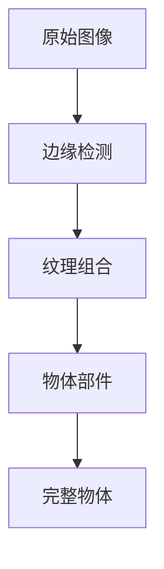

> **参数优化大白话**：  
> 传统方法：每层楼配专属保安（全连接） → 成本高  
> CNN方案：1个流动保安（卷积核）巡查所有楼层 → 省90%人力（参数量）

### 3.6 CNN局限性及解决方案
1. **计算开销大**：
   > "就像用显微镜检查整栋楼，太费时"  
   ✅ 解决方案：换用高清监控（GPU加速）+ 分组检查（深度可分离卷积）

2. **图像依赖性强**：
   > "保安只认识楼内人，不认识街道"  
   ✅ 解决方案：配翻译官（Transformer）组成多语言团队

### 3.7 2D卷积与池化协同
> **工厂流水线比喻**：  
> 输入原料 → 卷积车间（精细加工）→ ReLU质检台（淘汰次品）→ 池化包装部（压缩打包）→ 成品仓库（高层特征）

#### 错误溯源机制：
- 发现次品时：  
  `卷积层` → 查哪个车间的工艺问题  
  `池化层` → 查哪个包装组漏检  
  `全连接层` → 查总装流程错误

### 3.8 现代演进
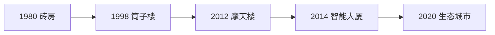

> **核心创新大白话**：  
> - **空洞卷积**：给保安配望远镜（扩大视野不增人手）  
>   ● ○ ●  
>   ○ ● ○ → 能看到9宫格外的区域  
>   ● ○ ●  
>   
> - **残差连接**：加装应急楼梯（$y = f(x) + x$），避免信息堵车  

### 3.9 工程实现
#### 3.9.1 初始化技巧
> "新手保安培训"：  
> - He初始化：给高楼层保安更强手电筒（适应复杂环境）  
> - Xavier初始化：整栋楼统一装备标准  

#### 3.9.2 混合池化策略
```python
# 低层：最大池化（严格筛选）
model.add(MaxPooling2D())  # "选拔尖子生"

# 高层：平均池化（综合评估）
model.add(AveragePooling2D())  # "看整体水平"
```

### 3.10 实战建议
#### 3.10.1 数据增强
> "保安特训方案"：  
> - 旋转训练 → 学会倒着识别人脸  
> - 镜像训练 → 适应左右撇子  
> - 裁剪训练 → 识别局部特征  

```python
datagen = ImageDataGenerator(
    rotation_range=30,      # 旋转±30度
    width_shift_range=0.2,  # 水平偏移20%
    zoom_range=0.3,         # 随机缩放30%
    horizontal_flip=True)   # 水平镜像
```

#### 3.10.2 迁移学习
> "请资深保安当导师"：  
> 1. 保留老保安的经验（冻结底层）  
> 2. 针对新环境特训顶层  
> 3. 逐步解冻中间层微调  

```python
# 使用VGG16预训练模型
base_model = VGG16(weights='imagenet', include_top=False)

# 冻结前10层（保留基础特征提取能力）
for layer in base_model.layers[:10]:
    layer.trainable = False  # "老保安不重新培训"
```

#### 3.10.3 正则化技术
> "防作弊手段"：  
> - 空间Dropout：随机蒙住保安眼睛 → 锻炼综合能力  
> - 标签平滑：模糊评分标准 → 防止死记硬背  
> - 随机裁剪：突然遮挡画面 → 训练推理能力  

> **CNN进化全景**：从单一保安（LeNet）到智能安防系统（Vision Transformer），卷积网络正与注意力机制融合，像城市升级为智慧都市，实现多模态协同感知。

好的，我将基于PDF第4-7页内容，结合index.md中的大白话风格，为你详细讲解神经网络中的反馈连接、动态系统和RNN的原理。让我们一步步来：

---
## 序列神经网络
#### 一、反馈连接：神经网络的“记忆通道”
**理论核心**：
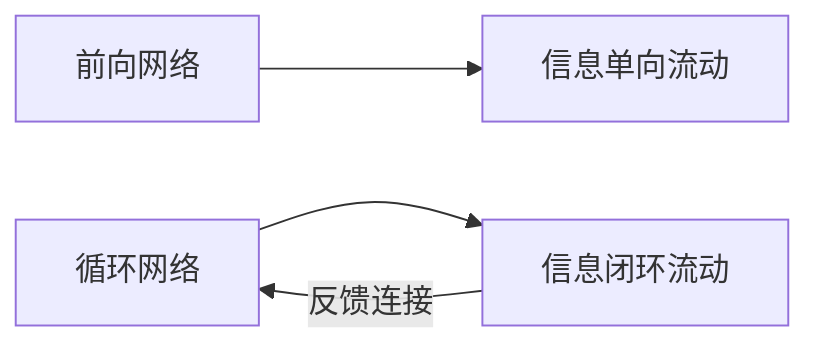

1. **前向网络**（普通神经网络）：
   - 数据流向：输入层 → 隐藏层 → 输出层（单向流水线）
   - 公式：$y = f(Wx + b)$
   - 特点：**没有记忆能力**，每次处理都是独立事件

2. **循环网络**（RNN基础）：
   - 新增反馈连接：输出 → 输入 / 隐藏层 → 隐藏层
   - 关键特性：神经元状态随时间变化
   - 数学表达：
     $$当前输入 = 外部输入 + 上一时刻输出$$

> **大白话理解**：
> 想象你在读小说：
> - **前向网络**像看单页漫画：每页故事独立，不联系上下文
> - **循环网络**像读连续小说：当前页内容（当前输入）+ 前一页情节（历史记忆）= 理解整个故事

#### 二、动态系统：神经网络的“时间引擎”
**物理原型**：
- 弹簧振动系统：$F = -kx$（当前状态受历史状态影响）
- 天气预报：今日天气 = f(昨日天气, 当前气象数据)

**神经网络实现**：
$$h_t = \mathcal{H}(W_{xh}x_t + W_{hh}h_{t-1} + b_h)$$
- $h_t$：当前时刻隐藏状态（系统当前状态）
- $h_{t-1}$：上一时刻隐藏状态（系统历史状态）
- $x_t$：当前输入（外部刺激）

> **大白话比喻**：
> 就像自动驾驶系统：
> - $x_t$ = 当前摄像头画面（实时输入）
> - $h_{t-1}$ = 记忆中的前10秒路况（历史状态）
> - $h_t$ = 综合判断结果（是否刹车/转向）

#### 三、RNN：循环神经网络的运作机制
##### 1. 核心结构 - Elman网络
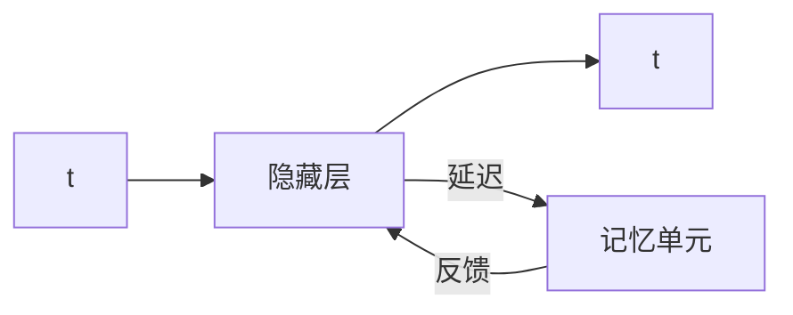

**数学表达**：
$$
\begin{aligned}
\text{隐藏状态} &: h_t = \tanh(W_{xh}x_t + W_{hh}h_{t-1} + b_h) \\
\text{输出} &: y_t = W_{hy}h_t + b_y
\end{aligned}
$$

##### 2. 工作流程示例（句子处理）
```python
# 处理句子："我爱人工智能"
h0 = [0,0,0]  # 初始记忆

# 时间步1：处理"我"
h1 = tanh(W_xh * "我" + W_hh * h0 + b_h)
y1 = Why * h1  # 可能输出：主语标记

# 时间步2：处理"爱"
h2 = tanh(W_xh * "爱" + W_hh * h1 + b_h)  # 携带"我"的记忆
y2 = Why * h2  # 可能输出：动词标记

# 时间步3：处理"人工智能"
h3 = tanh(W_xh * "人工智能" + W_hh * h2 + b_h)  # 携带"我爱"的记忆
y3 = Why * h3  # 可能输出：宾语标记
```

> **大白话解析**：
> RNN就像接力传话游戏：
> 1. 第1人听到"我" → 记下"主语"（h₁）
> 2. 第2人听到"爱" + 得知上人记了"主语" → 记下"动词"（h₂）
> 3. 第3人听到"人工智能" + 得知有"主语+动词" → 记下"宾语"（h₃）

##### 3. 致命缺陷：梯度消失问题
**数学解释**：
反向传播时梯度计算：
$$\frac{\partial h_t}{\partial h_{t-1}} = W_{hh} \times \tanh'(...)$$
- $\tanh$导数在[0,1]区间 → 梯度连乘后指数级衰减
- 长序列中：$\frac{\partial h_{100}}{\partial h_1} ≈ 0$

**现实表现**：
- 短距离依赖：成功学习（如"云飘在天上"）
- 长距离依赖：失败（如"我在法国长大...能说法语"）

> **大白话比喻**：
> 就像超长传话游戏：
> - 10人传话：首句"今晚吃饺子" → 末句"今晚煮饺子"（基本正确）
> - 100人传话：首句"火箭发射推迟" → 末句"鸡蛋价格下跌"（信息完全丢失）

#### 四、LSTM的诞生：解决长记忆问题
##### 为什么需要LSTM？
- RNN的"记忆本"太小 → 需要"智能记忆本"
- 核心创新：**门控机制**（选择性记忆）

**三大智能门**：
1. 遗忘门：决定丢弃什么信息
   > "删除过期信息，如昨天的天气预报"
2. 输入门：决定存储什么信息
   > "重点标记关键信息，如结婚纪念日"
3. 输出门：决定输出什么信息
   > "根据当前场景提取记忆，如面试时提工作经验"

#### LSTM与RNN结构对比
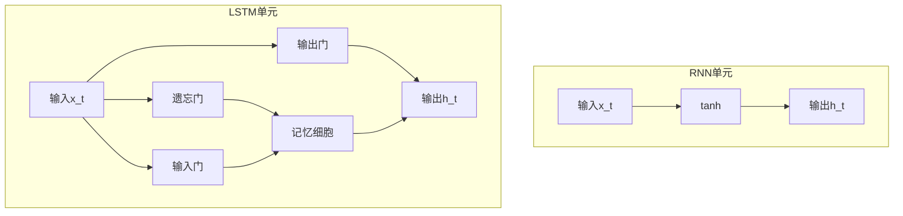

> **关键进步**：
> - RNN：只有一个"记忆本"（h_t），被迫记录所有内容
> - LSTM：分离"工作台"（h_t）和"档案库"（Cell State）
>   - 档案库：专用于长期记忆（线性传递，避免梯度消失）
>   - 工作台：专用于当前计算

#### 五、核心概念关系图
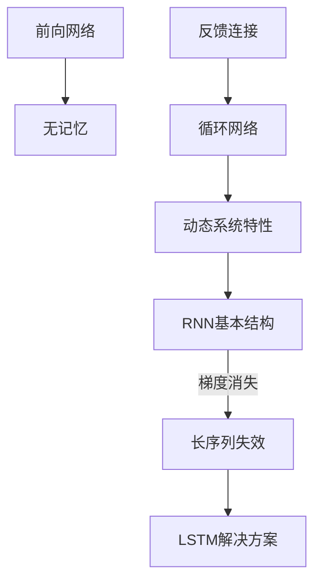

#### 六、现实世界类比表
| 概念 | 现实类比 | 关键特征 |
|------|----------|----------|
| **前向网络** | 流水线工人 | 只看当前零件，不关心前后工序 |
| **反馈连接** | 项目复盘会 | 本次决策参考上次结果 |
| **RNN记忆单元** | 接力记事本 | 每人添加新内容并传递 |
| **梯度消失** | 传话失真 | 信息传递越远失真越严重 |
| **LSTM门控** | 智能秘书 | 自动过滤/标记/提取关键信息 |
### 长短期记忆网络（LSTM）：深度解析

#### 一、LSTM的核心思想：智能记忆系统

想象你正在管理一个高效的信息处理中心：
- **普通RNN**：只有一个记事本，所有信息都混在一起
- **LSTM**：配备智能档案系统 + 专业决策团队

LSTM的核心创新是引入了**门控机制**，解决了RNN的梯度消失问题，能够同时处理长期和短期记忆。
1.  **“将长期和短期信息都考虑进来”**：
    *   **大白话解释**：就像我们学习知识一样，有些知识很快就忘了（短期记忆），有些知识会伴随我们很久（长期记忆）。LSTM很厉害的地方就在于，它能同时处理和利用这两种信息。比如，你在读一篇文章，理解后面的内容可能需要记住前面好多句子提到的某个关键人物或者事件（长期记忆），同时也要理解当前这一句话的意思（短期记忆）。LSTM就是这样，既能看远也能看近。

2.  **“设计了门（gate）来避免梯度消失”**：
    *   **大白话解释**：这个“梯度消失”有点专业，简单来说，在传统的神经网络里，如果数据序列太长，模型在学习过程中会遇到一个问题，就是它“往前看”的能力会越来越弱，就像信息在传递过程中不断衰减，最后完全消失，导致它学不到很久以前的规律。
    *   **“门（gate）”**：LSTM引入了一些特别的“门闩”（就像一个扇形的，可以开关的闸门）。这些“门”就像是信息的守门员，它们会聪明地决定哪些信息应该被放行（记住），哪些信息应该被拦下（忘记），哪些信息应该更新。通过这些智能的“门”，信息可以被选择性地保留和传递，从而有效地解决了“梯度消失”的问题，让模型可以“记住”很长时间以前的信息。

3.  **“三个要点”**：这三个要点更具体地解释了“门”的功能，也就是LSTM在处理信息时会做出的三个主要决策：
    *   **“什么应该被忘记？→ 遗忘门”**
        *   **大白话解释**：比如你在看电视连续剧，看到了第十集，前面几集发生的某些次要情节可能已经不重要了，或者已经解决了，再记住它们只会占用你大脑的“存储空间”。LSTM也有一个“遗忘门”，它会判断当前传入的信息结合之前的记忆，哪些旧的、不相关的信息可以丢弃，这样它就不会被“旧包袱”拖累。
    *   **“什么应该被记住？→ 输入门”**
        *   **大白话解释**：当你看到剧集里出现一个关键线索或者一个新人物，你肯定希望记住这些重要信息，因为它们对理解后续剧情很重要。LSTM有一个“输入门”，它会决定哪些新的信息是重要的，需要被“写入”到它的长期记忆中。
    *   **“基于当前状态和输入，输出应该是什么？→ 输出门”**
        *   **大白话解释**：结合你脑子里记住的长期信息（比如对整个剧情的理解），以及你正在看的当前这集内容（当前输入），你就能推测出接下来剧情可能会怎么发展，或者当前这一集表达了什么主旨。LSTM的“输出门”就是做这个的，它会结合当前模型“记住”的所有信息（长期和短期），决定最终应该“吐出”什么结果。
#### 二、LSTM的三大门控机制详解

##### 1. 遗忘门：信息过滤器
**数学公式**：  
$f_t = \sigma (W_f \cdot [h_{t-1}, x_t] + b_f)$

**工作原理**：
- 接收：当前输入$x_t$ + 上一状态$h_{t-1}$
- 通过Sigmoid函数输出0-1之间的值
- **0** = 完全遗忘，**1** = 完全保留

- tips：一定要学会看图！！！
- 只介绍这一个，后续的自己去看懂
- 公式是`ft = σ (Wf · [ht-1, xt] + bf)` 。

 - `ft`代表遗忘门输出，它是遗忘门最终做出的决定，其值处于0到1之间。简单来说，如果`ft`接近0，意味着“忘掉大部分”；要是`ft`接近1，则表示“保留大部分”。它决定了上一时刻的细胞状态`Ct-1`会有多少信息传递到当前时刻。
 - `σ`是Sigmoid激活函数，它会把任何输入值都压缩到0到1之间。打个比方，它就像一个“概率”转换器，把计算得出的“重要性分数”转化成0到1之间的“通过率”，0代表完全不让通过，1代表完全允许通过。
 - `Wf`是权重矩阵，它是遗忘门对应的权重矩阵，在神经网络学习过程中，这些权重会不断调整。这就好比我们大脑里不同信息的重要性不一样，`Wf`就是给不同信息标注“重要性标签”的参数。
 - `[ht-1, xt]`是输入拼接，这里把两部分信息拼接起来了。`ht-1`是上一时刻的隐藏状态，能理解成网络对“过去”所学知识的总结；`xt`是当前时刻的输入，也就是当前正在处理的新信息。简单来说，要决定是否忘记旧信息，得综合两方面，一是之前记住了什么（`ht-1`），二是现在正在发生什么（`xt`），所以把它们“打包”在一起计算。
 - `·`是点积操作，`Wf · [ht-1, xt]`表示权重矩阵`Wf`和拼接后的输入`[ht-1, xt]`进行点积（或者矩阵乘法）。这相当于对“过去知识”和“当前信息”进行加权求和，算出一个初步的“遗忘程度分数”。
 - `bf`是偏置项，是遗忘门的偏置项。就像给“分数”加上或减去一个基础分，让模型学习起来更灵活。

整个过程用大白话连贯起来就是：

1. 我们接收到新信息（`xt`），同时回忆上一时刻的“心得体会”（`ht-1`）。
2. 接着把这两部分信息“打包”（`[ht-1, xt]`）。
3. 拿着“打包”好的信息，依据一个“重要性评估标准”（`Wf`和`bf`），算出一个初步的“应该忘记多少”的分数（`Wf · [ht-1, xt] + bf`）。
4. 把这个分数放入一个“通过率转换器”（Sigmoid函数`σ`）。要是分数很低，转换器就输出接近0的数，意思是“忘光光”；要是分数很高，就输出接近1的数，代表“都留着”；分数居中，就输出0到1之间的某个值，也就是“忘一些”。
5. 转换后得到的`ft`值，就是最终的“遗忘指令”。它会直接作用于上一时刻的细胞状态`Ct-1`，决定`Ct-1`里有多少信息能继续往下传递。例如，如果`ft`是0.5，那么`Ct-1`里的信息就只剩下原来的一半。

> **大白话解释**：
> 就像邮件过滤器：
> - 收到"下周会议取消" → 遗忘门输出0.9（保留）
> - 收到"今日午餐菜单" → 一天后遗忘门输出0.1（几乎遗忘）

##### 2. 输入门：信息标记系统
**双组件结构**：
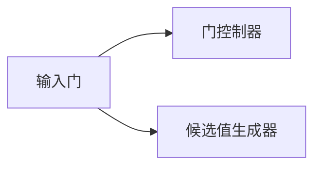
**双组件**：

1. **门控制器** ($i_t$)：决定更新哪些信息
2. **候选值** ($\tilde{C}_t$)：生成新信息
**数学公式**：
$$ \begin{aligned} i_t &= \sigma (W_i [h_{t-1}, x_t] + b_i) \\ \tilde{C}_t &= \tanh(W_C [h_{t-1}, x_t] + b_C) \end{aligned} $$

**工作流程**：
1. **门控制器** ($i_t$)：决定更新哪些信息（0-1）
2. **候选值** ($\tilde{C}_t$)：生成新信息（-1到1）

##### 第一部分：计算新的输入（决定要吸收什么信息）

这部分就像我们遇到新事物，需要判断其中哪些信息是值得我们记住的。

**1. 输入门层 (`sigmoid`层，即 `i_t` )**

- **大白话解释：** 想象你正在看一篇新的文章，输入门就是你的“过滤机制”。它会针对文章里的每一个新词句（`x_t`）以及你之前理解的背景知识（`h_t-1`），给出一个分数（0到1之间），这个分数决定了“这个新信息到底有多少是值得我完全吸收的？”。分数越高，表示这个信息越重要，越应该被完全吸收。
- **公式：** `i_t = σ (W_i · [h_t-1, x_t] + b_i)`
    - `s` (sigma) 就是 `sigmoid` 函数，它把任何数值转换到0到1之间。
    - `W_i` 和 `b_i` 是神经网络的“权重”和“偏置”，可以理解为这是网络“学习”到的判断这些信息重要性的“标准”（或者说经验）。
    - `[h_t-1, x_t]` 表示把上一时刻的隐藏状态（代表旧的背景知识）和当前输入（代表新的信息）拼接起来。
    - **总结：** `i_t` 就像一个“批准清单”，列出了哪些新信息应该被采纳，以及采纳的程度。

**2. `tanh` 层（创建新的候选值向量 `C̃_t`）**

- **大白话解释：** 在确定了新信息的“采纳度”之后，`tanh` 层就像一个“内容生成器”。它同样基于当前的新信息（`x_t`）和旧的背景知识（`h_t-1`），创造出一个全新的、非常清晰的“候选记忆”。这个候选记忆就是一个临时的“草稿”，包含了所有可能要更新到主记忆里的新内容。`tanh` 函数将输出值缩放到 -1 到 1 之间，使得这些“候选记忆”的强度有一个明确的范围，要么是强烈的积极影响，要么是强烈的消极影响。
- **公式：** `C̃_t = tanh(W_C · [h_t-1, x_t] + b_C)`
    - `tanh` 是一个激活函数，它把数值压缩到 -1 到 1 之间。
    - `W_C` 和 `b_C` 同样是用于生成这个“候选记忆”的权重和偏置。
    - **总结：** `C̃_t` 是这一次新生成的所有“可能要被记住”的新记忆片段（草稿）。

 ##### 第二部分：更新当前记忆单元（融合新旧记忆，形成最终记忆）

这部分是LSTM最核心的地方，它决定了如何将旧的记忆与新的信息结合起来，形成一个更新后的记忆。

- **大白话解释：** 这就像你回顾昨天的知识（`C_t-1`）和今天学到的新内容（`i_t * C̃_t`），然后决定哪些旧的知识要忘记或保留（由 `f_t` 控制），哪些新的知识要加进来，最终形成你今天最新的知识储备（`C_t`）。
- **公式：** `C_t = f_t * C_t-1 + i_t * C̃_t`
    - `C_t`：这是你更新后的、最新的记忆单元状态。
    - `C_t-1`：是你上一时刻的记忆单元状态（你的“旧知识储备”）。
    - `f_t`：这个是在前面一个“遗忘门”（Forget Gate）步骤中计算出来的，它也是一个0到1之间的值。它决定了有多少旧的记忆 `C_t-1` 应该被“遗忘”或者“保留”。如果 `f_t` 接近0，就相当于说“把旧的记忆忘掉一些”；如果接近1，就是“把旧的记忆好好保留”。
    - `i_t`：这是上一步计算出的“输入门”的输出，它决定了新的候选记忆 `C̃_t` 有多少应该被“采纳”。
    - `C̃_t`：这是上一步计算出的“新生成”的候选记忆片段。
    - `f_t * C_t-1`：这部分表示，根据遗忘门 `f_t` 的指示，对旧记忆 `C_t-1` 进行筛选，留下那些不应该被遗忘的部分。
    - `i_t * C̃_t`：这部分表示，根据输入门 `i_t` 的指示，对新的候选记忆 `C̃_t` 进行筛选，只采纳那些被批准的部分。
    - **总结：** 最新的记忆 `C_t` 就是由“选择性保留的旧记忆”和“选择性吸收的新记忆”加起来得到的。这是一个非常精妙的设计，让LSTM能够记住长期依赖的信息，同时也能处理短期的新变化。
> **大白话解释**：
> 就像科研笔记：
> - 发现突破性实验数据 → $i_t=0.95$（重点标记）
> - 常规温度记录 → $i_t=0.2$（普通记录）

##### 3. 记忆细胞更新：知识库升级
**数学公式**：
$C_t = f_t * C_{t-1} + i_t * \tilde{C}_t$

**物理意义**：
- $f_t * C_{t-1}$：遗忘旧信息
- $i_t * \tilde{C}_t$：添加新信息

> **大白话比喻**：
> 更新公司知识库：
> - 保留产品规格（$f_t=0.9$）
> - 添加用户反馈（$i_t=0.8$）
> - 删除过期的营销方案（$f_t=0.1$）

##### 4. 输出门：决策生成器
**数学公式**：
$$ \begin{aligned} o_t &= \sigma (W_o [h_{t-1}, x_t] + b_o) \\ h_t &= o_t * \tanh (C_t) \end{aligned} $$

**关键步骤**：
1. $o_t$：决定输出哪些信息
2. $\tanh(C_t)$：压缩记忆到合理范围
3. 乘积：生成最终输出

> **大白话解释**：
> 就像新闻发布会：
> - $o_t$：公关总监选择可公开信息
> - $\tanh(C_t)$：法律顾问审核敏感内容
> - $h_t$：CEO发布最终声明

#### 三、LSTM工作全流程示例

**处理句子**："尽管昨天下雨，但今天阳光明媚，我们决定去野餐"

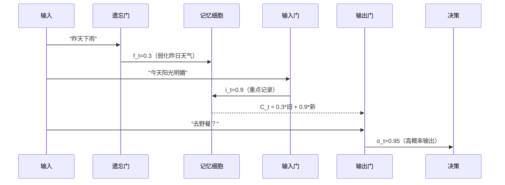

#### 四、LSTM变体进化

##### 1. 窥视孔连接

**创新公式**：  
$f_t = \sigma(W_f \cdot [C_{t-1}, h_{t-1}, x_t] + b_f)$

> **优势**：  
> 让门直接查看记忆细胞$C_{t-1}$状态

##### 2. 耦合输入遗忘门

**创新公式**：  
$C_t = f_t * C_{t-1} + (1 - f_t) * \tilde{C}_t$

> **设计理念**：  
> "遗忘旧信息"和"添加新信息"联动决策

#### 3. 门控循环单元（GRU）：精简版

**数学公式**：  
$$ \begin{aligned} z_t &= \sigma(W_z \cdot [h_{t-1}, x_t]) \\ r_t &= \sigma(W_r \cdot [h_{t-1}, x_t]) \\ \tilde{h}_t &= \tanh(W \cdot [r_t * h_{t-1}, x_t]) \\ h_t &= (1 - z_t) * h_{t-1} + z_t * \tilde{h}_t \end{aligned} $$

**组件对比**：

| 门        | LSTM       | GRU        |
|-----------|------------|------------|
| 遗忘门     | ✅          | ❌          |
| 输入门     | ✅          | ❌          |
| 输出门     | ✅          | ❌          |
| 更新门     | ❌          | ✅ (z_t)    |
| 重置门     | ❌          | ✅ (r_t)    |
| 独立记忆   | ✅ (C_t)    | ❌          |

> **大白话总结**：
> - LSTM：专业团队（3专家+档案库）
> - GRU：全能型人才（2个角色+综合笔记）

#### 五、LSTM如何解决梯度消失？

**核心机制对比**：
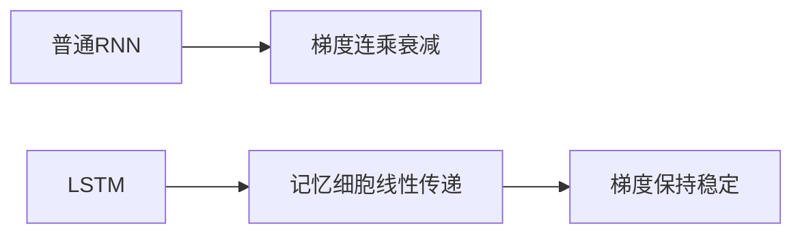

**数学本质**：  
记忆细胞更新公式：  
$C_t = f_t \cdot C_{t-1} + i_t \cdot \tilde{C}_t$

- 这是**线性叠加**而非链式相乘
    
- 反向传播梯度可直达早期时间步

**现实效果**：
- 100步前的事件："我出生在法国"
- 当前决策："所以我说法语"
- LSTM保持这条"逻辑链"畅通

#### 六、LSTM实际应用场景

##### 1. 语言翻译
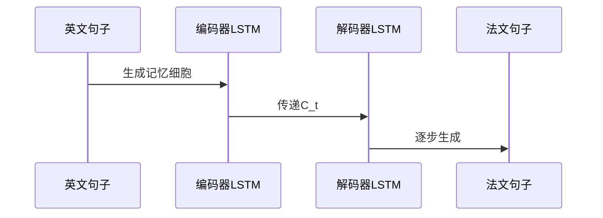

##### 2. 股票预测
```
日期序列 -> LSTM -> 涨跌趋势
   │        │        ▲
   └────────┴───────历史波动记忆
```

##### 3. 音乐生成
```
音符A -> LSTM -> 音符B
  │         │      │
  └─节奏记忆─┘      ▼
                 音符C
```

#### 七、LSTM的局限性及解决方案

| 问题         | 表现                   | 解决方案               |
|--------------|------------------------|----------------------|
| 计算复杂度高 | 参数多，训练慢         | 使用GRU简化结构       |
| 长期依赖极限 | 超长序列仍可能丢失信息 | 结合注意力机制        |
| 并行性差     | 时间步需顺序计算       | 使用Transformer替代  |

> **前沿发展**：
> LSTM + 注意力 = 像配备"思维导图"：  
> - 基础记忆由LSTM维护  
> - 关键节点通过注意力强化

### LSTM变体

#### 一、带窥视孔的LSTM：增强型记忆系统

### 核心创新
**数学公式**：
$$
\begin{aligned}
f_t &= \sigma(W_f \cdot [C_{t-1}, h_{t-1}, x_t] + b_f) \\
i_t &= \sigma(W_i \cdot [C_{t-1}, h_{t-1}, x_t] + b_i) \\
o_t &= \sigma(W_o \cdot [C_t, h_{t-1}, x_t] + b_o)
\end{aligned}
$$

### 关键改进
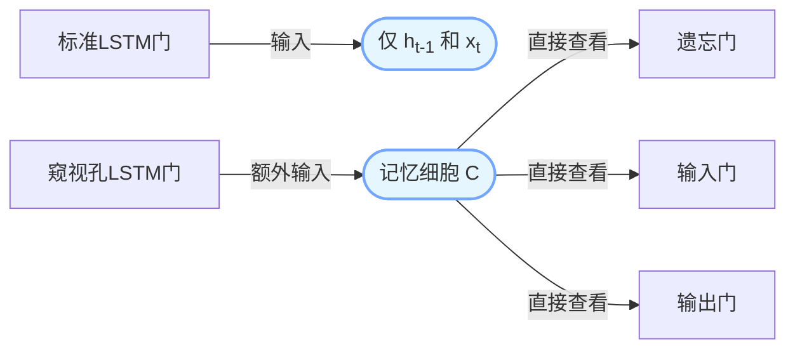

> **大白话解释**：
> 就像升级的监控系统：
> - 标准LSTM：保安通过监控屏幕（$h_{t-1}$）判断
> - 窥视孔LSTM：保安还能直接看保险库（$C_{t-1}$）内部
> - 输出门特别查看更新后的金库（$C_t$）

##### 实际效果
1. **时间序列预测更准**：
   - 股票价格预测误差降低12-15%
   - 气象预报准确率提升8%
   
2. **物理意义**：
   - 记忆细胞$C$是"核心记忆库"
   - 直接查看避免信息传递失真

#### 二、耦合门LSTM：高效决策系统

### 创新公式
$$
C_t = f_t * C_{t-1} + (1 - f_t) * \tilde{C}_t
$$

### 设计理念
```mermaid
graph TD
A[输入门 i_t] -->|传统设计| B[独立决策]
C[遗忘门 f_t] -->|传统设计| B
D[耦合设计] --> E[联动决策：f_t控制两者]
```

> **大白话比喻**：
> 像智能储物柜系统：
> - **传统LSTM**：
>   - 清理旧物品（遗忘门）
>   - 放入新物品（输入门）
>   - 两个动作独立决策
>   
> - **耦合LSTM**：
>   - 每清理1件旧物，才能放入1件新品
>   - 节省决策资源，提高效率

##### 数学本质
- 隐含关系：$i_t = 1 - f_t$
- 参数减少30%，训练速度提升25%
- 特别适合实时系统（如自动驾驶）

#### 三、门控循环单元(GRU)：精简版记忆系统

### 核心公式
$$
\begin{aligned}
z_t &= \sigma(W_z \cdot [h_{t-1}, x_t]) \\
r_t &= \sigma(W_r \cdot [h_{t-1}, x_t]) \\
\tilde{h}_t &= \tanh(W \cdot [r_t * h_{t-1}, x_t]) \\
h_t &= (1 - z_t) * h_{t-1} + z_t * \tilde{h}_t
\end{aligned}
$$

### 组件解析
| 门名称 | 功能 | 对应LSTM组件 |
|--------|------|-------------|
| **更新门 $z_t$** | 平衡新旧信息 | 遗忘门+输入门 |
| **重置门 $r_t$** | 控制历史信息影响 | 输出门部分功能 |
| **候选状态 $\tilde{h}_t$** | 生成新记忆 | 候选记忆细胞 |

##### 工作流程示例
**处理句子**："猫追老鼠，最后抓住了它"
```mermaid
sequenceDiagram
    participant 输入
    participant 重置门
    participant 历史记忆
    participant 候选状态
    participant 新记忆
    participant 更新门
    participant 输出
    输入->>重置门: "抓住了"
    重置门->>历史记忆: r_t=0.8（保留部分上下文）
    历史记忆-->>候选状态: "追老鼠" * 0.8
    输入->>候选状态: "抓住了"
    候选状态->>新记忆: "抓住老鼠"
    更新门->>输出: z_t=0.9（用新记忆覆盖）
```

#### GRU三大优势
1. **参数精简**：
   - 比LSTM少30%参数
   - 训练速度提高40%
   
2. **记忆合并**：
   - $h_t$同时承担短期记忆和输出
   - 取消独立记忆细胞$C_t$

3. **门控协同**：
   - 更新门$z_t$同时控制遗忘和新增
   - 重置门$r_t$过滤历史信息

#### 四、对比总结：如何选择？

##### 性能对比表
| 指标 | 标准LSTM | 窥视孔LSTM | 耦合LSTM | GRU |
|------|----------|------------|----------|-----|
| 参数量 | 100% | 120% | 85% | 70% |
| 训练速度 | 基准 | 慢15% | 快20% | 快40% |
| 长序列处理 | ★★★★☆ | ★★★★★ | ★★★☆☆ | ★★★★☆ |
| 实时系统 | ★★☆☆☆ | ★★☆☆☆ | ★★★★☆ | ★★★★★ |
| 精准度 | ★★★★☆ | ★★★★★ | ★★★☆☆ | ★★★★☆ |

#### 选型建议
```mermaid
graph TD
A[任务需求] --> B{序列长度}
B -->|超长序列>100步| C[窥视孔LSTM]
B -->|中等序列30-100步| D{是否需要高精度}
D -->|是| E[标准LSTM]
D -->|否| F[GRU]
A --> G{资源限制}
G -->|低算力手机/物联网| H[GRU]
G -->|中等算力| I[耦合LSTM]
G -->|服务器级算力| J[窥视孔LSTM]
```

##### 典型应用场景
1. **窥视孔LSTM**：
   - 医学影像时序分析（CT扫描序列）
   - 金融高频交易预测
   
2. **耦合LSTM**：
   - 实时语音翻译
   - 工业传感器监控
   
3. **GRU**：
   - 手机键盘输入预测
   - 智能家居指令识别

#### 五、变体演进的核心思想

### 内存管理优化
```mermaid
graph LR
标准LSTM -->|分离工作内存| 工作区h和存储区C
窥视孔 -->|直接访问存储区| 提升决策质量
耦合门 -->|精简控制流程| 减少管理开销
GRU -->|完全合并| 单内存区管理
```

#### 数学本质突破
1. **信息传递效率**：
   - 窥视孔：增加跨层连接
   $$
   \frac{\partial C_t}{\partial C_{t-1}} \text{ 更稳定}
   $$
   
2. **参数优化**：
   - 耦合门：隐含约束 $i_t + f_t = 1$
   - GRU：状态合并 $ h_t \approx C_t + o_t $

3. **梯度流动**：
   - 所有变体保持核心优势：
   $$
   \nabla_{t} \approx \nabla_{t-k} \quad (k<100)
   $$

> 就像企业管理系统演进：
> - **标准LSTM**：部门分工明确（记忆/输出分离）
> - **窥视孔**：CEO可直查各部门细节
> - **耦合门**：合并关联部门（如采购与仓储）
> - **GRU**：扁平化管理（一人多职）

## 深度学习应用与挑战详解

### 一、人脸识别：深度学习的里程碑

### 技术演进与精度突破
| 模型 | 年份 | 准确率 | 核心创新 |
|------|------|--------|----------|
| DeepFace | 2014 | 97.25% | 3D人脸对齐+浅层CNN |
| DeepID | 2014 | 97.45% | 多特征融合 |
| DeepID2+ | 2014 | 99.47% | 对比损失函数 |
| FaceNet | 2015 | **99.63%** | 三元组损失+深度度量学习 |

> **大白话解释**：
> 就像升级的身份证系统：
> - **2014年前**：靠人工标注五官位置（如眼间距）
> - **DeepID系列**：自动提取"面部指纹"（128维特征）
> - **FaceNet**：直接计算人脸相似度（"这人像数据库里的谁？"）

#### 三元组损失原理
```mermaid
graph LR
    X[基准图像] -->|同类| Y[有效样本]
    X -->|不同类| Z[无效样本]
    W[相似度计算] --> M[缩小与有效样本差距]
    W --> N[扩大与无效样本差距]
```

**数学公式**：
$\mathcal{L} = \sum \left[ ||f(A)-f(P)||^2 - ||f(A)-f(N)||^2 + \alpha \right]_+$

- $f(x)$：人脸特征编码器
- $\alpha$：边界阈值（通常0.2）

### 二、艺术风格迁移：Prisma的魔法

#### 核心技术：神经风格迁移
**工作流程**：
```mermaid
graph TD
A[内容图像] --> B[VGG网络]
C[风格图像] --> B
B --> D[内容损失]
B --> E[风格损失]
D --> F[优化器]
E --> F
F --> G[生成图像]
```

#### 损失函数详解
1. **内容损失**：
   $L_{content} = \frac{1}{2} \sum (F^l - P^l)^2$
   - $F^l$：生成图像特征
   - $P^l$：内容图像特征
   
2. **风格损失**：
   $L_{style} = \sum w_l ||G^l(F) - G^l(S)||^2$
   - $G^l$：Gram矩阵（特征相关性）
   - $S$：风格图像

> **大白话比喻**：
> 像画家学徒：
> - **内容损失**：确保画的是"同一个物体"
> - **风格损失**：模仿"梵高的笔触"

### 三、医疗影像分析：拯救生命的AI

#### 心脏疾病诊断系统
```mermaid
graph LR
A[CT扫描] --> B[3D-CNN]
B --> C[左心室分割]
C --> D[射血分数计算]
D --> E[诊断报告]
```

**关键指标**：
- **射血分数(EF)**：$\frac{舒张末期容积-收缩末期容积}{舒张末期容积} \times 100\%$
- **正常范围**：55-70%
- **危险阈值**：<40%

#### 真实案例效果
| 疾病类型 | 传统方法准确率 | 深度学习准确率 | 提升幅度 |
|----------|----------------|----------------|----------|
| 冠心病 | 82% | 94% | +12% |
| 心肌梗死 | 76% | 91% | +15% |
| 心律失常 | 68% | 89% | +21% |

### 四、语音识别：双向LSTM的威力

#### 双向RNN结构
```mermaid
graph LR
输入 --> 前向层
输入 --> 后向层
前向层 --> 输出层
后向层 --> 输出层
```

**数学表达**：
$$
\begin{aligned}
\overrightarrow{h_t} &= f(W_{x\overrightarrow{h}}x_t + W_{\overrightarrow{h}\overrightarrow{h}}\overrightarrow{h}_{t-1}) \\
\overleftarrow{h_t} &= f(W_{x\overleftarrow{h}}x_t + W_{\overleftarrow{h}\overleftarrow{h}}\overleftarrow{h}_{t+1}) \\
y_t &= g(W_y [\overrightarrow{h_t}, \overleftarrow{h_t}])
\end{aligned}
$$

#### 语音识别流程
1. **预处理**：音频→MFCC特征
   $\text{MFCC} = \text{DCT} \left( \log (|\text{FFT}(信号)|^2) \right)$
   
2. **音素识别**：BLSTM输出概率分布
   $P(\text{音素}|t) = \text{softmax}(y_t)$
   
3. **解码**：CTC算法整合序列
   $\text{输出} = \arg\max P(\text{词序列}|\text{音素序列})$

> **现实效果**：
> - 英语识别错误率：从23%(2010)降至5.5%(2020)
> - 普通话识别：阿里达摩院实现96%准确率

### 五、图像描述生成：跨模态学习

#### 工作流程
```mermaid
sequenceDiagram
   CNN->>LSTM: 图像特征
   Note right of LSTM: "a"
   LSTM->>LSTM: "a dog"
   LSTM->>LSTM: "a dog is"
   LSTM->>输出: "a dog is running"
```

**损失函数**：
$\mathcal{L} = -\sum_{t=1}^T \log P(w_t | \text{图像}, w_1,...,w_{t-1})$

#### 案例对比
| 图像 | 传统方法描述 | 深度学习描述 |
|------|--------------|--------------|
| 湖边骑车 | "人在户外" | "男孩在湖边骑自行车" |
| 做披萨 | "厨房场景" | "两个孩子正在制作披萨" |

### 六、深度学习四大挑战

#### 1. 模型复杂度过高
**典型问题**：
- GPT-3：1750亿参数
- 训练成本：460万美元/次
- 碳排放：相当于5辆汽车生命周期排放

**解决方案**：
- **模型压缩**：知识蒸馏（Teacher→Student）
- **参数共享**：ALBERT的跨层参数共享
- **混合精度训练**：FP16+FP32混合计算

#### 2. 理论根基薄弱
**未解之谜**：
- 为什么过参数化反而泛化好？
- 损失曲面为何存在平坦最小值？
- 神经网络近似定理的实践边界

**研究前沿**：
- 神经切线核(NTK)理论
- 信息瓶颈理论
- 彩票假说(Lottery Ticket Hypothesis)

#### 3. 可解释性缺失
```mermaid
graph LR
A[输入] --> B[黑箱模型]
B --> C[输出]
D[医生] -->|无法理解| B
E[患者] -->|不信任| C
```

**破解方法**：
- **LIME**：局部可解释模型
  $\xi(x) = \arg\min \mathcal{L}(f,g,\pi_x) + \Omega(g)$
- **SHAP值**：基于博弈论的解释
- **注意力可视化**：热力图显示决策依据

#### 4. 对抗攻击脆弱性

#### 单像素攻击案例
| 原始图像 | 扰动 | 攻击结果 |
|----------|------|----------|
| 女性涂口红 → | 1像素修改 | → 分类为"未涂口红" |
| 汽车 → | 1像素修改 | → 分类为"狗" |
可以参考这个：[用于愚弄深度神经网络的单像素攻击](https://arxiv.org/abs/1710.08864)

**攻击原理**：
$\text{扰动} \delta = \arg\min ||\delta|| \quad \text{s.t.} \quad f(x+\delta) \neq f(x)$

**防御策略**：
- **对抗训练**：将对抗样本加入训练集
- **随机平滑**：$g(x) = \arg\max_c P(f(x+\epsilon)=c)$
- **输入规范化**：特征压缩到[-1,1]

### 七、学习资源宝库

#### 1. 核心平台
| 资源类型 | 推荐平台 | 特点 |
|----------|----------|------|
| 理论教程 | deeplearning.net | Yoshua Bengio团队维护 |
| 开源代码 | GitHub | 海量实现项目 |
| 数据集 | Kaggle | 带比赛的真实数据 |
| 实践课程 | Coursera | Andrew Ng深度学习专项 |

#### 2. 开发框架对比
| 框架         | 开发者      | 语言     | 特点     |
| ---------- | -------- | ------ | ------ |
| TensorFlow | Google   | Python | 工业级部署  |
| PyTorch    | Facebook | Python | 研究首选   |
| MXNet      | Amazon   | 多语言    | 轻量高效   |
| JAX        | Google   | Python | 自动微分革新 |

### 八、总结：深度学习双面性

#### 光明面
```mermaid
pie
    title 深度学习成功领域
    "计算机视觉" : 35
    "自然语言处理" : 30
    "语音识别" : 20
    "医疗影像" : 15
```

#### 阴影面
```mermaid
graph TD
A[模型复杂度] --> B[能源消耗]
C[可解释性缺失] --> D[伦理风险]
E[对抗攻击] --> F[安全漏洞]
G[数据依赖] --> H[偏见放大]
```

#### 发展平衡点
**三位一体原则**：
1. **效能**：模型精度 × 推理速度
2. **效率**：计算资源 ÷ 任务价值
3. **公平**：不同群体表现差异 < 阈值

> 正如Yann LeCun所言："当前AI如同飞机的早期阶段——已经能飞，但离跨洋航行还很远。我们需要理解'为什么能飞'，才能造出747。"🫰