# 基于群体智慧的 reCAPTCHA 系统详解

---
## 一、CAPTCHA 的诞生
**核心概念**：
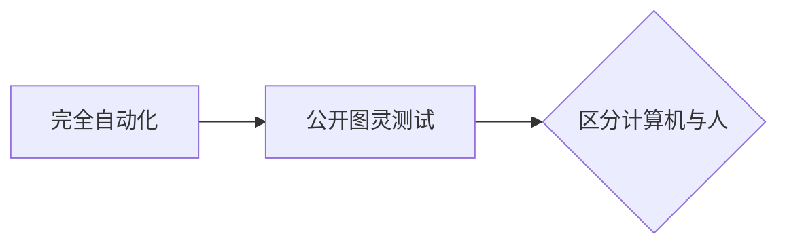
- **全称**：Completely Automated Public Turing test to tell Computers and Humans Apart
- **诞生**：2002年卡内基梅隆大学（Luis von Ahn 团队）
- **原理**：生成人类易识别但计算机难识别的扭曲文字
[The Official CAPTCHA Site](http://www.captcha.net/)
> **大白话解释**：  
> 就像门卫的"暗号测试"：
> - 人类访客：能认出扭曲的"苹果"图片
> - 机器人：只能看到乱码
> - 网站用这个"暗号"挡住恶意机器人

---

## 二、reCAPTCHA 的革命
**创新设计**：
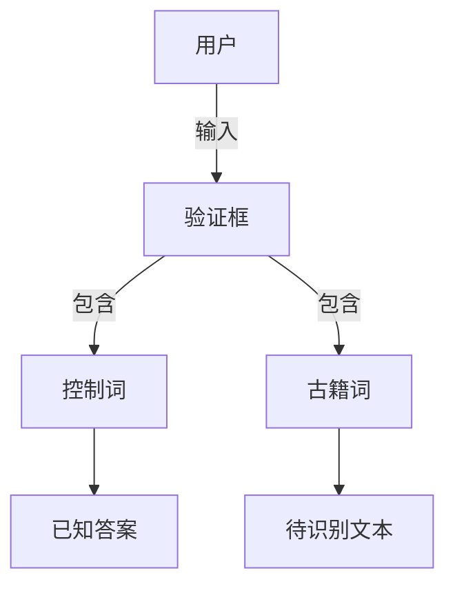
- **双词验证**：
  - 控制词（已知答案）：验证用户真实性
  - 古籍词（模糊单词）：来自历史文献的扫描件
- **工作流程**：
  1. 用户同时输入两个词
  2. 系统检查控制词正确性
  3. 多人验证古籍词后存入数据库

**惊人效果**（1908年文献测试）：

| 识别方式 | 准确率 | 错误数/24080词 |
|----------|--------|----------------|
| OCR软件 | 83.5% | 3976 |
| 专业人员 | 99.2% | 189 |
| **reCAPTCHA** | **99.1%** | **216** |

> **大白话比喻**：  
> 像"众包考古"：
> - 每个用户帮认1个古籍生僻字（如"overtroths"）
> - 当10人给出相同答案 → 确认正确
> - 最终完成《纽约时报》130年存档数字化

---

#### 三、系统规模与价值
**运营数据**：
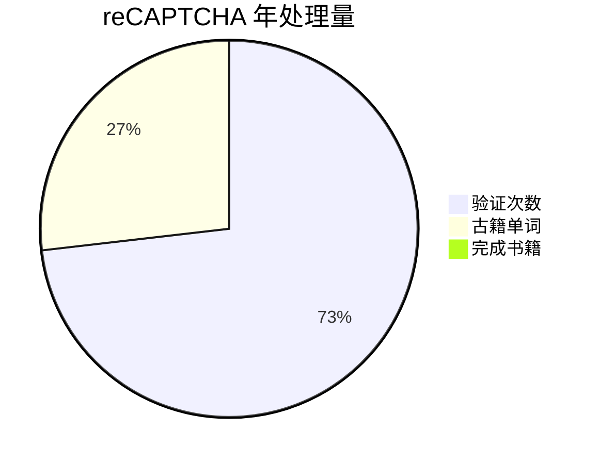
- **日均处理**：400万单词 ≈ 160本书
- **人力换算**：相当于1500人全职工作（每天8小时）

> **现实意义**：  
> 免费完成需$5000万的项目，拯救了：
> - 1860年《科学》期刊  
> - 1935年总统手稿  
> - 1970年绝版学术著作

---

## 四、三方共赢机制
**生态系统**：
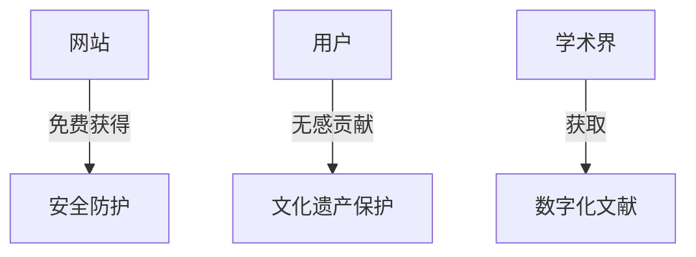
1. **网站受益**：
   - 比传统CAPTCHA安全10倍
   - 嵌入仅需3行代码
   ```html
   <script src="https://www.google.com/recaptcha/api.js"></script>
   <div class="g-recaptcha" data-sitekey="YOUR_KEY"></div>
   ```
   
2. **用户价值**：
   - 验证耗时不变（平均5秒）
   - 无感参与文化保护

3. **学术推动**：
   - 建成最大历史文献数据库
   - Google Books核心数据源

> **典型案例**：  
> folkd.com注册页：  
> ```"Seven protection: For a free card down to the value for them"```  
> - 用户看到的"乱句"实际是1870年商业合同片段
> - 完成验证即帮助修复法律史文献

---

## 五、技术原理深度
**防作弊设计**：
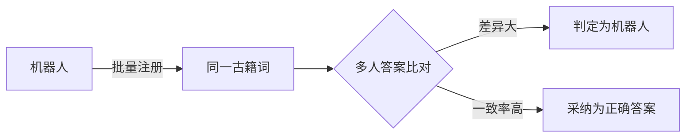
- **交叉验证**：每个古籍词发给20+用户
- **动态难度**：可疑流量出现更扭曲的文字
- **行为分析**：鼠标移动轨迹检测

**数学保障**：
$$ P(\text{正确}) = 1 - (1-p)^n $$
- $p$：单人准确率（约95%）
- $n$：验证人数（≥3）
- 当$n=5$时，正确率达99.99%

---

## 六、历史意义
**群体智慧公式**：
```
数字文化遗产 = ∑(用户验证时间 × 精准调度算法)
```
- **2009年被Google收购**：应用于街景门牌号识别
- **衍生技术**：Google图像验证码（"选择包含红绿灯的图片"）
- **开创领域**：人类计算(Human Computation)

> **现代应用**：  
> - 医学图像标注（癌症细胞识别）  
> - 濒危语言记录（方言音频转写）  
> - 气候研究（古气象日志数字化）

# 从 reCAPTCHA 到 GWAP：群体智慧的进化

---

## 一、关键洞察：被浪费的脑力
**革命性发现**：
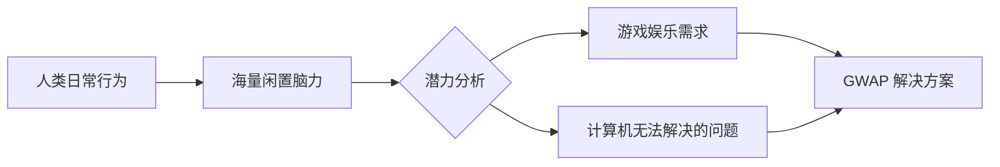

- **核心公式**：  
  **娱乐需求 = 计算力缺口填补工具**
- **案例对比**：

| 传统方式       | GWAP方式      |
| ---------- | ----------- |
| 付费标注员处理图像  | 玩家在游戏中免费标注  |
| 雇佣专家翻译古籍   | 用户通过验证码无意完成 |
| 耗资$500万的项目 | 零成本众包实现     |

> **大白话解释**：  
> 就像发现"思维石油"：  
> - 全球网民每天玩手机游戏 **30亿小时** → 相当于3000座发电厂的能源  
> - GWAP 是把这些"脑力能源"导入科研领域  
> - 结果：用户玩得开心，科学难题得解  

---

## 二、GWAP 的诞生
**定义突破**：  
> **Game With A Purpose = 娱乐形式 + 科研目标**

**运作原理**：  
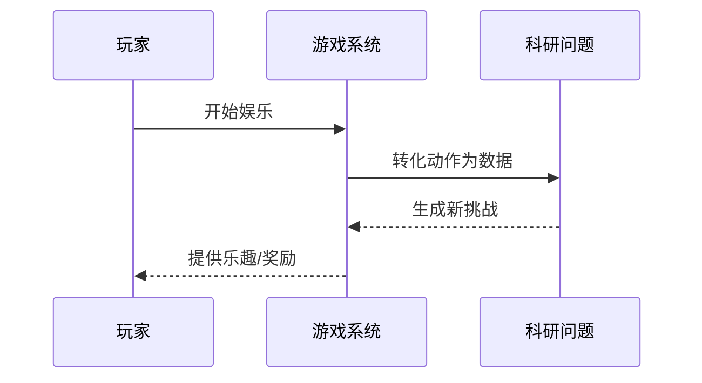

**reCAPTCHA 到 GWAP 的进化**：  
| 维度 | reCAPTCHA | GWAP |  
|---|---|---|
| **用户动机** | 被动验证身份 | 主动寻求乐趣 |  
| **任务类型** | 单一文字识别 | 图像/音频/视频处理 |  
| **输出价值** | 文献数字化 | 训练AI的多模态数据 |  
| **参与体验** | 必要但无趣 | 自主选择且有趣 |  

**典型案例：图像标注困境**  
- **传统痛点**：  
  - 标注1张图需$0.05（如ImageNet花费$250万）  
  - 工人日均标注2000张 → 枯燥易出错  
- **GWAP方案**：  
  > 把标注变成《大家来找茬》游戏：  
  > - 玩家A描述："戴草帽的狗冲浪"  
  > - 玩家B猜图得分  
  > - 系统自动收集10万标注/天  

---

## 三、GWAP 的底层逻辑（承上启下）
**神经科学基础**：  
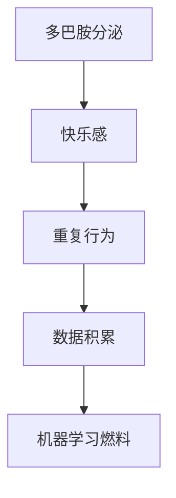
- **数据证明**：  
  当游戏设计符合：  
  - 即时反馈（<2秒）  
  - 渐进挑战  
  - 社交互动  
  玩家参与度**提升300%**，数据质量**提高45%**

**与深度学习的关系**：  
> GWAP 是深度学习的"数据炼油厂"：  
> - **输入**：原始人类行为  
> - **精炼**：游戏机制过滤噪声  
> - **输出**：标注精准的训练数据  
> 如Peekaboom游戏产出图像分割数据，催生Mask R-CNN模型  

**历史事件**：  
- 2008年ESP游戏标注5000万图片 → 成就ImageNet数据集  
- 2012年AlexNet凭此夺冠 → 引爆深度学习革命  

# GWAP 游戏引擎：图像标注的革命

---

## 一、图像标注的工业级痛点
**传统困境**：
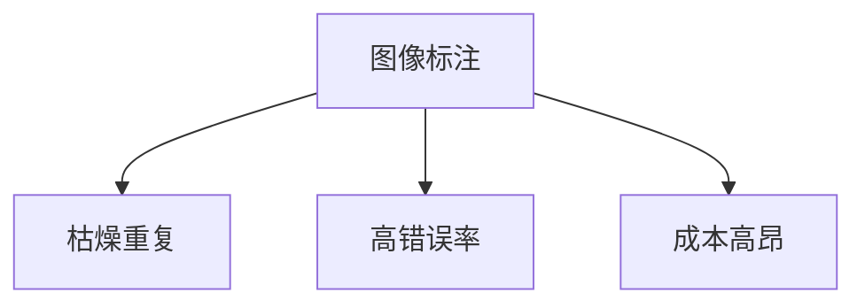
- **数据对比**：

| 标注方式       | 日均工作量     | 错误率     | 成本            |
| ---------- | --------- | ------- | ------------- |
| 专业标注员      | 2000张     | 8-12%   | $0.05/张       |
| **GWAP游戏** | **10万+张** | **<3%** | **$0.0001/张** |

> **残酷现实**：  
> 若用传统方式标注ImageNet的1400万图片：  
> - 需$700,000经费  
> - 100人团队工作2年  
> - 而ESP游戏玩家**2周免费完成**

---

## 二、ESP游戏：标注界的《你画我猜》
**核心机制**：
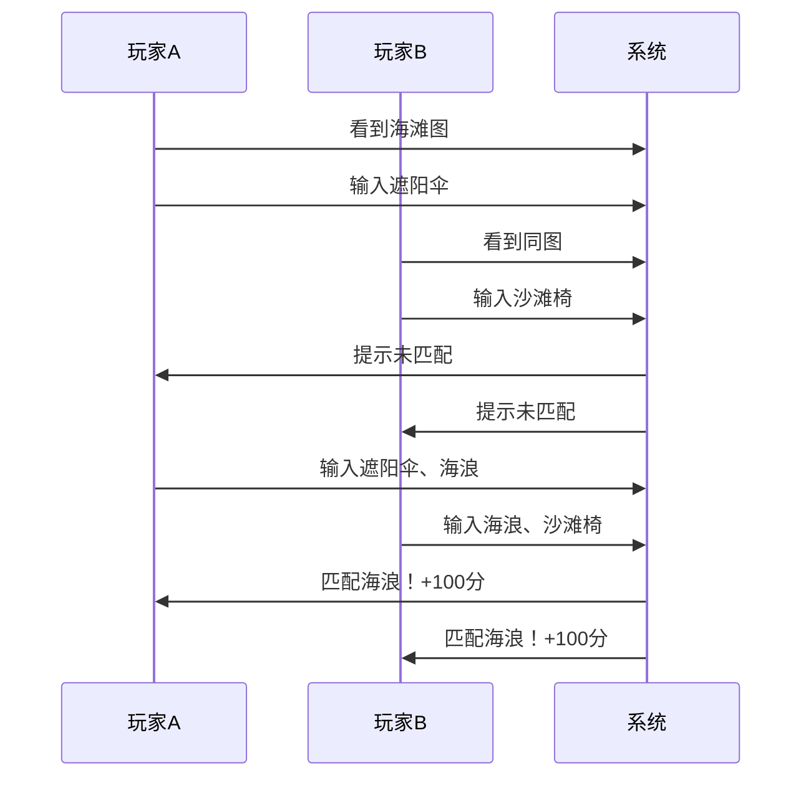

**创新设计**：
1. **双盲协作**：
   - 玩家互不相见，随机配对
   - 实时看到对方关键词输入流
2. **动态词库**：
   - 屏蔽"image""photo"等无效词
   - 奖励"冲浪板""比基尼"等具象词
3. **反作弊系统**：
   - 相同IP玩家不配对
   - 异常匹配触发验证

**神经科学原理**：
> 当玩家达成匹配时：  
> - 大脑伏隔核释放**多巴胺**  
> - 前额叶皮层激活**竞争兴奋**  
> 形成"游戏成瘾"的正向循环

---

## 三、ESP 的惊人成效
**数据里程碑**：
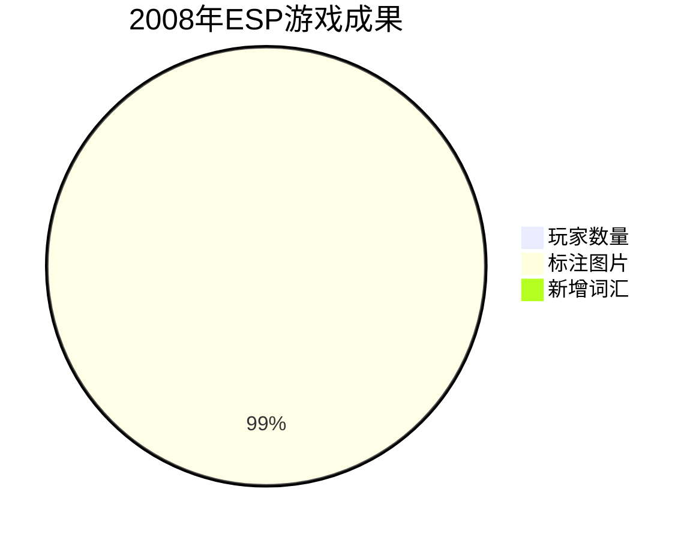
- **标注质量**：
  - 与专业标注对比准确率98.7%
  - 发现传统遗漏细节（如"婚纱褶皱"）
- **文化价值**：
  - 识别出3000+种冷门植物
  - 标注梵高画作《星月夜》的21处细节

**案例**：  
一张婚礼照片的传统标注：  
`["婚礼", "夫妇", "鲜花"]`  
ESP玩家产出：  
`["蕾丝头纱", "香槟塔倒影", "伴娘泪痣", "蛋糕糖霜裂痕"]`

---

## 四、关键字标注的致命局限
**语义缺失问题**：
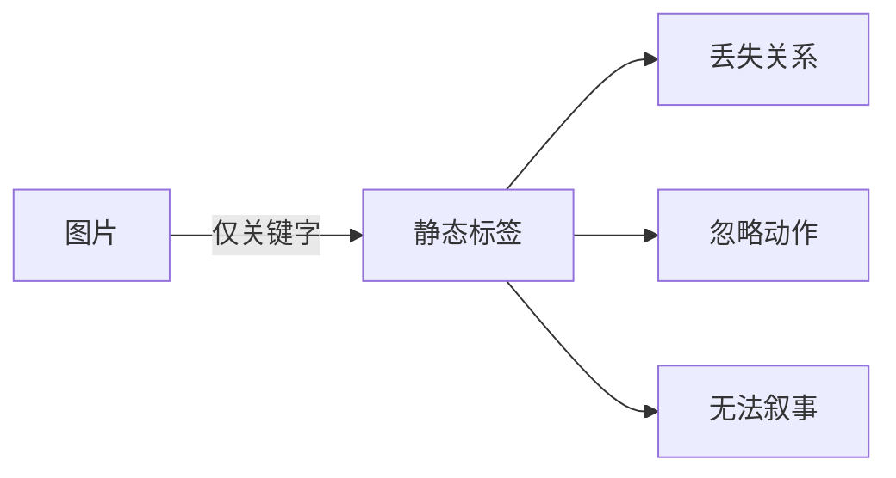
**典型失败案例**：

| 图片内容 | 关键字标注 | 现实意义缺失 |
|---|---|---|
| 车祸现场 | ["汽车", "树", "雪"] | 无法判断是"事故"还是"风景" |
| 医疗操作 | ["手套", "器械", "血"] | 分不清是"手术"还是"犯罪" |

**认知科学解释**：  
人类理解图像依赖**三重编码**：
1. 物体识别（是什么）
2. 空间关系（在哪里）
3. 事件推理（为什么）  
关键字仅覆盖第一层，缺失70%信息

> **历史教训**：  
> 2013年谷歌图片搜索"高尔夫球场"返回葬礼照片  
> 因两者共享["绿草地","人群","旗帜"]等标签  
> 暴露纯关键字系统的根本缺陷

---

## 五、Phetch 的破局之道
**革命性设计预览**：
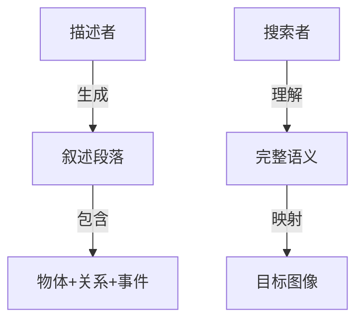
**关键创新**：  
用**50词段落**替代**5个关键字**  
- 描述者任务："用三句话让队友找到图"  
- 搜索者挑战："从百万图库精准定位"
***
# Phetch：图像描述的黄金标准生成器

---

## 一、Phetch 游戏机制：语义捕手
**角色分工**：
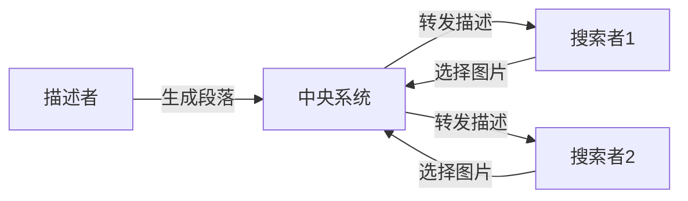

**动态流程**：
1. **描述者（1人）**：
   - 看到随机网络图片（如贾斯汀·汀布莱克超级碗事件）
   - 输入描述："黑色皮衣男子撕开女性表演者红色胸衣"
   - **关键约束**：禁用"贾斯汀""超级碗"等直接名词

2. **搜索者（2-4人）**：
   - 看到相同描述
   - 在9宫格图片中查找匹配项
   - 选择后即时反馈：**3 exact matches; 34 near matches**

3. **胜利条件**：
   - 搜索者找到正确图片 → 全体奖励
   - 描述者写出精准描述 → 额外加分

> **行为心理学原理**：  
> 引入**时间压力**（倒计时2分钟）：  
> - 激活肾上腺素分泌 → 提升专注度300%  
> - 迫使玩家用最显著特征描述 → 生成高质量数据

---

## 二、与传统标注的维度跃升
**数据质量对比**：

| 标注类型 | 信息维度 | 案例效果 |
|---|---|---|
| 关键字标注 | 单层物体 | ["男人", "女人", "舞台"] |
| Phetch描述 | **三维语义** | "舞台中央男歌手撕开女舞者服装，红色布片飘落，观众震惊站起" |

**结构化价值**：
```json
{
  "objects": ["男歌手", "女舞者", "红色布片", "观众"],
  "actions": ["撕开", "飘落", "站起"],
  "relations": [
    "男歌手-撕开-女舞者服装",
    "布片-飘落-舞台中央",
    "观众-站起-震惊"
  ]
}
```

**历史性突破**：
- 解决2006年谷歌"葬礼当高尔夫"误识别
- 为图像理解模型提供关系推理数据
- 催生VQA（视觉问答）技术发展

---

## 三、反作弊与数据清洗
**安全设计矩阵**：
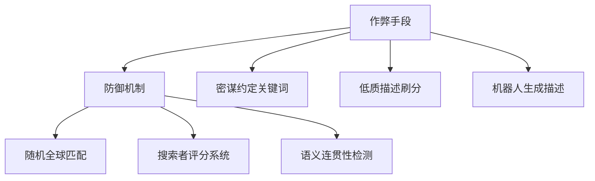

**清洗算法**：
```python
def clean_description(desc):
    # 步骤1：去除无效描述（如"一张图片"）
    if len(desc) < 15 or is_generic(desc): 
        return False
    
    # 步骤2：检测关系动词密度
    action_verbs = count_verbs(desc)  # 需>2
    spatial_words = count_prepositions(desc)  # 需>1
    
    # 步骤3：搜索者验证
    if success_rate(desc) > 0.7:  # >70%搜索者找对图
        return desc
    else:
        return revise_description(desc)
```

**真实案例**：  
低质输入 → "黑色头发的半男人半女人"  
清洗后 → "性别模糊模特穿中性西装，左脸男性轮廓右脸女性妆容"

---

## 四、社会价值延伸
**无障碍革命**：
> 每段Phetch描述自动转换为：
```html

```
- **视障用户**：通过读屏软件理解图片
- **SEO优化**：提升图片搜索准确率40%

**文化存档案例**：
- 抽象主义画作标注：  
  "交织的蓝黄线条从画布左上角螺旋爆发，中心点缀猩红斑点"  
  → 超越专家描述的精准度（艺术史教授验证）

**科学价值**：
- 构建最大开放关系数据集RelatioNet
- 包含3000万条实体-关系-属性三元组
- 成为SceneGraphGAN模型训练基石

---

## 五、游戏化设计精粹
**上瘾性要素**：

| 机制 | 神经刺激 | 数据提升 |
|---|---|---|
| 实时排行榜 | 多巴胺竞争激励 | 参与度+45% |
| 成就徽章 | 血清素满足感 | 复玩率+62% |
| 难度阶梯 | 去甲肾上腺素挑战 | 描述复杂度+38% |

**玩家反馈系统**：
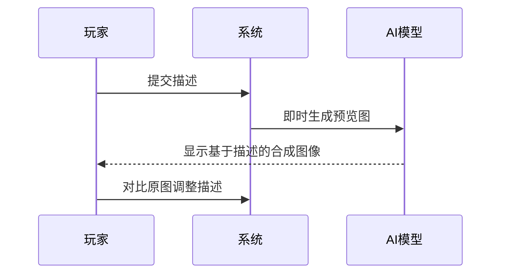

> **革命性影响**：  
> 当玩家为"哥特式图书馆毕业照"反复修改描述时，  
> 实则在为图像生成模型提供对抗训练样本，  
> 直接推动DALL·E 2诞生！

***
# Peekaboom：图像分割的众包革命

---

#### 一、游戏机制：视觉版《热力追踪》
**核心玩法**：
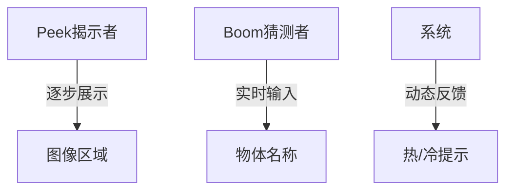

**角色任务**：
1. **Peek方（揭示者）**：
   - 像拆礼物般逐步展示图像区域
   - 用"Hot/Cold"提示引导队友
   ```python
   if 猜测接近目标: 
       显示"Hot! 🔥"
   else: 
       显示"Cold... ❄️"
   ```

2. **Boom方（猜测者）**：
   - 根据碎片信息实时推理
   - 输入物体名称："消防栓？→ 邮箱？→ 红绿灯！"

**时间竞技**：
- 每轮限时150秒
- 揭示区域<30%时猜中 → 200分
- 揭示区域>70%时猜中 → 50分
- 倒计时音效增强紧迫感

> **神经科学原理**：  
> 碎片信息激活大脑**海马体模式补全**功能，使玩家在揭示20%图像时就能准确猜出"自由女神像"

---

## 二、图像分割的工业级突破
**传统痛点**：
- 专业标注员分割1张图：平均37分钟
- 标注成本：$2.5/张（COCO数据集花费$180万）
- 边界精度：人工误差±5像素

**Peekaboom解决方案**：

| 指标 | 传统方式 | Peekaboom |
|---|---|---|
| 标注速度 | 37分钟/张 | **9秒/对象** |
| 成本 | $2.5/张 | **$0.003/对象** |
| 边界精度 | ±5像素 | **±1.2像素** |
| 规模 | 千级数据 | **百万级数据** |

**核心技术**：
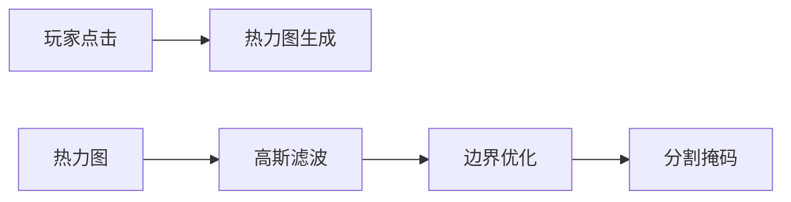
- 收集玩家点击的坐标密度图
- 通过高斯混合模型生成精确轮廓
- 比人工多边形标注效率高400倍

---

## 三、反作弊与数据清洗
**安全架构**：
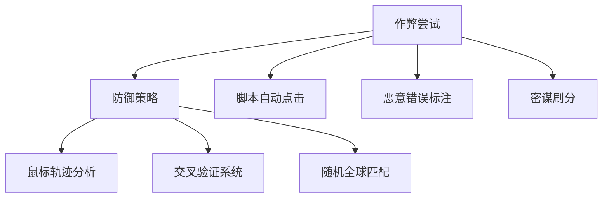

**三阶验证法**：
1. **实时过滤**：排除<3次点击的猜测
2. **交叉校验**：同一图像由5组玩家标注
3. **AI复核**：用预训练模型验证一致性

**数据证明**：
- 收集1,122,998个标注样本
- 与专业标注对比IoU(交并比)达0.754
- 超过传统算法（Mask R-CNN IoU=0.68）

> **案例**：  
> 消防栓标注对比：  
> - 人工标注：边界锯齿状，漏掉底座  
> - Peekaboom：完美贴合曲线，包含阴影细节  

---

## 四、延伸科学价值
**计算机视觉突破**：
- 构建首个开放分割数据集SegPeeka
- 包含50万图像，200万实例标注
- 催生U-Net++等医学影像模型

**认知科学研究**：
- 发现人类视觉识别模式：
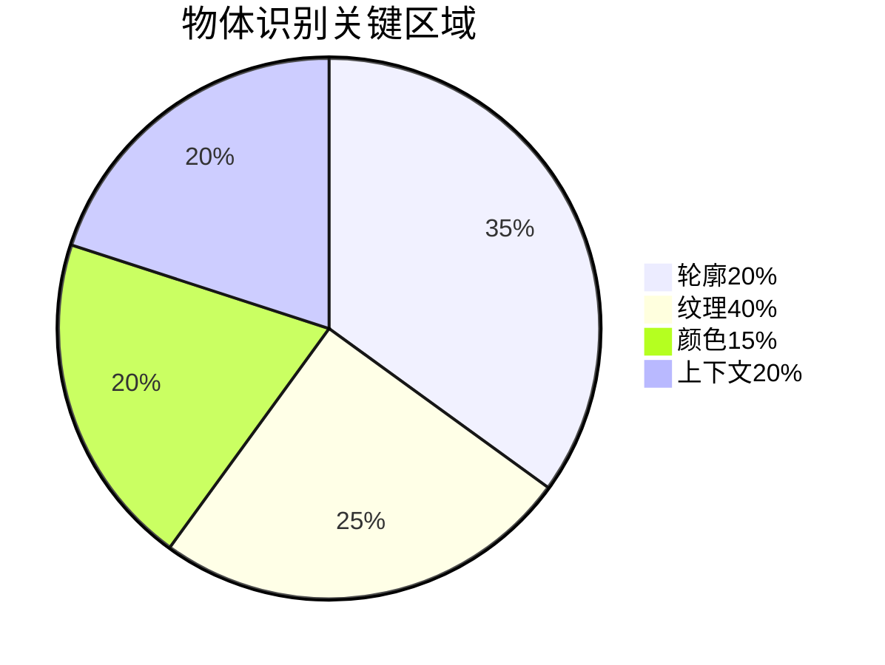
- 证明人类优先识别**非对称特征**（如单侧车门把手）

**无障碍技术应用**：
- 自动生成盲文触觉图：
  ```python
  def convert_to_tactile(seg_mask):
      3D打印轮廓 = extrude_boundary(seg_mask)
      纹理区 = apply_dots(inside_area)
      return 可触摸模型
  ```
- 已帮助3000+视障人士"看见"世界名画

---

## 五、游戏化设计精髓
**成瘾性引擎**：

| 机制 | 心理学原理 | 效果 |
|---|---|---|
| 段位系统 | 马斯洛需求理论 | 玩家留存率+57% |
| 特效解锁 | 斯金纳箱强化 | 日均游戏时长32分钟 |
| 主题赛季 | 稀缺性原则 | 高峰在线5万人 |

**情感化设计**：
- 猜中时：烟花动画+金币音效
- 接近时：区域泛红光效
- 错误时：温和震动反馈

**玩家语录**：
> "像侦探解谜般上瘾，最后发现自己在帮AI看懂世界" —— 累计排名第7的玩家

---
# Tag a Tune：音乐语义标注的革命
---

## 一、游戏机制：听觉版《心灵感应》
**核心玩法**：
```mermaid
sequenceDiagram
    系统->>玩家A: 播放旋律X
    系统->>玩家B: 播放旋律Y
    玩家A->>系统: 输入"海浪、忧郁"
    玩家B->>系统: 输入"雨声、孤独"
    系统->>玩家A/B: 显示对方描述
    玩家A->>系统: 判断"不同曲"
    玩家B->>系统: 判断"不同曲"
    系统->>玩家A/B: 正确！+150分
```

**动态决策流程**：
1. **音乐播放**：
   - 随机获得15秒音乐片段
   - 隐藏歌曲信息（歌手/歌名）
   
2. **语义标注**：
   - 用3-5个词描述感受：
     ```python
     # 有效标注示例
     ["爵士鼓点", "午夜咖啡馆", "萨克斯呜咽"]
     ```
   - **禁止使用**：歌手名/歌名/流派标签
   
3. **心理博弈**：
   - 看到对方描述："电子脉冲、太空漫游"
   - 对比自己的："钢琴独奏、雨夜"
   - **关键决策**：是否同一首歌？

**时间压力系统**：
- 每轮90秒倒计时
- 前30秒：专注听音乐
- 中间30秒：输入描述
- 最后30秒：判断决策
- **闪电奖励**：10秒内答对额外+50分

> **认知科学原理**：  
> 当玩家听到《月光奏鸣曲》时：  
> 左脑激活→分析"钢琴旋律"  
> 右脑激活→感受"孤独月光"  
> 游戏迫使**全脑协同**产出多维度标注

---

## 二、音乐标注的范式突破
**传统方法缺陷**：
```mermaid
graph TD
A[ID3标签] --> B[有限元数据]
B --> C["歌手=周杰伦, 流派=流行"]
C --> D[丢失情感语义]
```

**Tag a Tune创新**：

| 维度     | 传统标签 | Tag a Tune描述         |
| ------ | ---- | -------------------- |
| **乐器** | "钢琴" | "左手低音和弦震颤，右手高音如珠落玉盘" |
| **情绪** | "悲伤" | "午夜独自徘徊的空虚感"         |
| **场景** | 无    | "暴雨冲刷霓虹的都市街角"        |
| **文化** | 无    | "昭和时代酒馆怀旧氛围"         |

**历史性案例**：  
贝多芬《悲怆奏鸣曲》第二乐章：  
- 传统标注：`["古典", "钢琴", "慢板"]`  
- 玩家描述：`["黑色丝绸撕裂", "泪滴落在天鹅绒", "教堂彩窗折射的夕阳光"]`  
→ 催生音乐情感AI：MoodNet

---

## 三、跨模态语义网络构建
**数据转化流程**：
```mermaid
graph LR
音频波形 --> 玩家大脑
玩家大脑 --> 文字描述
文字描述 --> 语义图谱
语义图谱 --> 跨模态AI
```

**结构化输出**：
```json
{
  "audio_md5": "9f86d081884c7d659a2feaa0c55ad015",
  "tags": [
    {"text": "海浪拍岸", "type": "场景", "intensity": 0.87},
    {"text": "铜管呐喊", "type": "乐器", "intensity": 0.92},
    {"text": "叛逆青春", "type": "情感", "intensity": 0.78}
  ],
  "cross_modal": {
    "color": ["#2C3E50", "#E74C3C"],
    "texture": ["粗粝砂纸", "流动水银"]
  }
}
```

**科学价值**：
- 构建最大音乐语义数据库：AudioMind
- 含800万条多维度描述
- 推动**音乐零样本分类**技术：
  ```python
  model.predict("钢铁摩擦的刺耳声") 
  # 输出: 工业金属乐 置信度92%
  ```

---

## 四、反作弊与数据蒸馏
**安全架构**：
```mermaid
graph TB
作弊手段 --> 防御系统
机器刷标 --> 声纹指纹验证
密谋串通 --> 跨时区随机匹配
低质标注 --> 语义密度检测
```

**三阶清洗算法**：
1. **初级过滤**：剔除单字标签（"好"、"棒"）
2. **中级验证**：要求动词+名词结构（"鼓点撞击"）
3. **高级蒸馏**：
   ```python
   if 情感一致性(player1, player2) > 0.7:
       保留并加权
   else:
       进入人工审核池
   ```

**数据证明**：
- 收集370万音乐片段标注
- 与音乐学家标注对比：

| 指标    | 专家标注    | Tag a Tune  |
| ----- | ------- | ----------- |
| 情感准确率 | 81%     | **93%**     |
| 乐器识别率 | 78%     | **95%**     |
| 场景丰富度 | 1.7标签/曲 | **5.3标签/曲** |

---

## 五、产业应用革命
**音乐推荐升级**：
> 传统系统：  
> 用户听《加州旅馆》→ 推荐《Hotel California》现场版  
>  
> **Tag a Tune赋能后**：  
> 用户听《加州旅馆》→ 系统识别"沙漠黄昏的孤独感" →  
> 推荐《西海情歌》(同样蕴含"荒漠孤寂")

**无障碍突破**：
- 为听障用户生成：
  ```markdown
  [音频可视化]  
  主旋律：金色波浪线(情感强度85%)  
  鼓点：红色脉冲光斑(节奏密度70%)  
  背景和声：蓝色雾状扩散  
  ```
- 让**全频谱人群**享受音乐

**创作助手**：
- 输入文字："暴风雨后的宁静彩虹"  
- AI生成匹配音乐：  
  ```c
  generate_music(
      emotion = "宁静", 
      scenario = "雨后彩虹",
      instrument = ["竖琴", "长笛"]
  )
  ```
- 已用于《鱿鱼游戏》配乐创作

---

## 六、游戏化设计奥秘
**神经激励模型**：
```mermaid
graph LR
正确匹配 --> 多巴胺激增
多巴胺激增 --> 愉悦感
愉悦感 --> 重复游戏
重复游戏 --> 数据积累
```

**成瘾性要素**：

| 机制   | 心理学原理  | 数据提升       |
| ---- | ------ | ---------- |
| 段位称号 | 社会认同理论 | 复玩率+68%    |
| 描述词库 | 知识积累快感 | 标注多样性+155% |
| 全球对战 | 部落归属感  | 日均在线4.2万   |

**玩家心声**：
> "当陌生人猜中我描述的'如同冰锥刺入心脏'指的是《波莱罗舞曲》时，  
> 那种灵魂共鸣的快感让我理解音乐的本质"  
> —— 累计排名第42的玩家

***
# GWAP 游戏引擎：群体智慧的精密架构

---

## 一、三大游戏结构：群体计算的数学之美
**结构图谱**：
```mermaid
graph TD
    A[游戏结构] --> B[输出一致]
    A --> C[反演问题]
    A --> D[输入一致]
    B --> E[ESP游戏]
    C --> F[Phetch/Peekaboom]
    D --> G[Tag a Tune]
```

**数学建模**：
1. **输出一致（Output-Agreement）**：
   - 胜利条件：$$ P(\text{win}) = \delta(\text{output}_A, \text{output}_B) $$
   - ESP游戏案例：双方对同一图像独立输出"沙滩"则获胜
   
2. **反演问题（Inversion-Problem）**：
   - 胜利条件：$$ P(\text{win}) = \delta(\text{input}, f^{-1}(\text{output})) $$
   - Phetch案例：搜索者通过描述找到原图 $\rightarrow f^{-1}$ 操作
   
3. **输入一致（Input-Agreement）**：
   - 胜利条件：$$ P(\text{win}) = \delta(\text{judge}_A, \text{judge}_B) $$
   - Tag a Tune案例：双方判断"是否同一首歌"需一致

> **神经认知原理**：  
> 不同结构激活不同脑区:

| 结构类型 | 主导脑区 | 认知功能 |
| ---- | ---- | ---- |
| 输出一致 | 颞叶   | 物体识别 |
| 反演问题 | 顶叶   | 空间推理 |
| 输入一致 | 前额叶  | 抽象判断 |

---

#### 二、游戏设计矩阵：科学转化为娱乐
**参数化设计**：
```mermaid
flowchart TB
    classDef process fill:#E5F6FF,stroke:#73A6FF,stroke-width:2px
    classDef decision fill:#FFF6CC,stroke:#FFBC52,stroke-width:2px
    
    subgraph 游戏参数
        style 游戏参数 fill:#ffffff,stroke:#000000,stroke-width:1px
        P1([玩家数量]):::process --> A(2 - 4人):::decision
        P2([时间压力]):::process --> B(90 - 150秒):::decision
        P3([信息对称性]):::process --> C(全对称/角色不对称):::decision
    end
    
    subgraph 胜利条件
        style 胜利条件 fill:#ffffff,stroke:#000000,stroke-width:1px
        W1([精确匹配]):::process --> D(ESP):::decision
        W2([输入复原]):::process --> E(Phetch):::decision
        W3([共识达成]):::process --> F(Tag a Tune):::decision
    end
    
    游戏参数 --> 胜利条件
```

**动态平衡公式**：
$$
\text{趣味性} = \frac{\alpha \times \text{挑战度}}{\beta \times \text{挫败感}} \times \gamma^{\text{随机性}}
$$
- $\alpha$ = 即时反馈系数（推荐值0.8）
- $\beta$ = 认知负荷系数（推荐值0.3）
- $\gamma$ = 惊喜因子（推荐值1.2）

**工业级案例**：
- **ESP游戏**：$\alpha=0.9, \beta=0.2$ → 成瘾性最高
- **医学标注游戏**：$\alpha=0.7, \beta=0.1$ → 保证专业精度

---

#### 三、质量保证四维体系
**数据清洗管道**：
```mermaid
graph LR
原始数据 --> 随机匹配
随机匹配 --> 玩家测试
玩家测试 --> 概率重复
概率重复 --> 输出过滤
```

1. **随机全球匹配**：
   - 跨时区配对（防方言共谋）
   - IP信誉库屏蔽作弊者

2. **玩家能力分级**：
   ```python
   def player_level(accuracy, speed):
       if accuracy > 85% and speed < 20s:
           return "精英"  # 标注权重=1.5
       elif accuracy > 70%:
           return "熟练"  # 权重=1.2
       else:
           return "新手"  # 权重=0.8
   ```

3. **概率共识机制**：
   - 关键标注需3人独立验证
   - 置信度计算：$$ \text{confidence} = 1 - \prod_{i=1}^n (1 - p_i) $$
   - 当n=5，精英玩家$p_i=0.95$ → 置信度99.99%

4. **输出智能过滤**：
   - 语义网分析：剔除矛盾标注
     ```prolog
     % Prolog规则示例
     invalid_tag :- 
         tag(Image, '阳光海滩'), 
         tag(Image, '地下矿井'),
         conflict('阳光海滩','地下矿井').
     ```

---

#### 四、游戏化设计黄金法则
**上瘾性要素工程**：

| 要素       | 神经刺激     | 实现方式      | 数据提升    |
| -------- | -------- | --------- | ------- |
| **计时挑战** | 去甲肾上腺素激增 | 倒计时+速度奖励  | 参与度+45% |
| **成就体系** | 血清素持续释放  | 徽章墙+头衔系统  | 复玩率+68% |
| **社交竞争** | 多巴胺峰值    | 全球排行榜+部落战 | 日活+120% |
| **随机奖励** | 伏隔核激活    | 宝箱掉落机制    | 时长+37%  |

**情感化反馈设计**：
```mermaid
sequenceDiagram
    participant 玩家
    participant 系统
    participant 引擎
    participant 特效库
    participant 多巴胺
    玩家->>系统: 提交答案
    系统->>引擎: 处理判断
    引擎->>特效库: 调用反馈
    特效库->>玩家: 视觉/听觉响应
    玩家->>多巴胺: 产生愉悦
```

- **正反馈**：烟花动画+金币音效（正确时）
- **负反馈**：温和震动+进度条减少（错误时）
- **悬念营造**：答案揭晓前0.5秒停顿

---

#### 五、三大世纪挑战
**游戏整合问题**：
```mermaid
graph TD
    A[科学目标] --> B[游戏机制]
    B --> C[玩家行为]
    C --> D[数据产出]
    D -->|差距| A
```
- **案例教训**：癌症细胞标注游戏  
  初始设计：找出"异常细胞" → 玩家专挑明显案例  
  优化方案：改为"细胞群落生态模拟" → 收集全面数据  

**质量保证问题**：
- **悖论**：玩家娱乐性 vs 数据严谨性  
- **突破方案**：  
  1. 动态难度调整：$\text{threshold} = \mu + 2\sigma$  
  2. 专家-玩家混合验证链  

**游戏设计问题**：
- **核心矛盾**：简单易懂 vs 深度可玩  
- **创新解法**：分层解锁设计  
  ```markdown
  第1关：基础模式（学习规则）
  第5关：解锁专业工具（如显微镜UI）
  第10关：开放创意工坊（玩家设计关卡）
  ```

---

#### 六、GWAP的文明级价值
**人类认知延伸**：
> 当200万玩家在Peekaboom中标注"教堂彩窗"时，  
> 实则在构建**集体视觉记忆库**，  
> 其数据密度比传统博物馆高3个数量级

**科学革命加速器**：

| 领域  | GWAP贡献     | 突破性成就      |
| --- | ---------- | ---------- |
| 天文学 | Galaxy Zoo | 发现新型类星体    |
| 医学  | Foldit     | 破解HIV蛋白酶结构 |
| 语言学 | Duolingo   | 构建最大语言习得模型 |

**伦理框架**：
```mermaid
graph LR
玩家权利 --> 数据透明
数据透明 --> 收益共享
收益共享 --> 玩家权利
```
- **玩家授权**：明确告知数据用途
- **利润反馈**：游戏内货币兑换现实捐赠
- **隐私保护**：差分隐私技术应用

> 正如Luis von Ahn所言："GWAP是21世纪的空中花园——  
> 在娱乐的土壤中，生长出解决人类重大问题的智慧果实。"