# 数学基础
---

## 🧮 线性代数：深度学习的语法

想象一下，你要建一栋大楼（深度学习模型），线性代数就是你的**砖块、水泥和钢筋**。它不是大楼本身，但整个大楼都由它们构成。数据、模型参数、计算过程，几乎一切都是用线性代数的语言描述的。

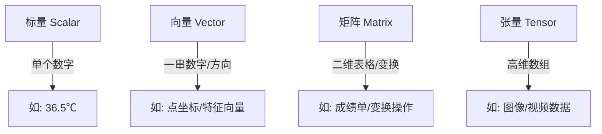
```mermaid
flowchart TD
    S[标量 Scalar] -->|单个数字| Ex[如: 36.5℃]
    V[向量 Vector] -->|一串数字/方向| Ex2[如: 点坐标/特征向量]
    M[矩阵 Matrix] -->|二维表格/变换| Ex3[如: 成绩单/变换操作]
    T[张量 Tensor] -->|高维数组| Ex4[如: 图像/视频数据]
```

---

### 一、数学对象：从点到体
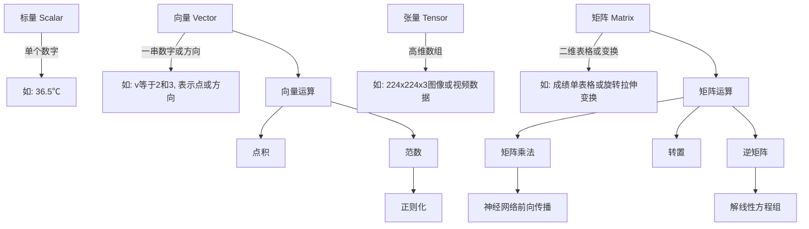
```mermaid
graph TD
    S[标量 Scalar] -->|单个数字| Ex[如: 36.5℃]
    V[向量 Vector] -->|一串数字或方向| Ex2[如: v等于2和3, 表示点或方向]
    M[矩阵 Matrix] -->|二维表格或变换| Ex3[如: 成绩单表格或旋转拉伸变换]
    T[张量 Tensor] -->|高维数组| Ex4[如: 224x224x3图像或视频数据]
    
    V --> VM[向量运算]
    M --> MM[矩阵运算]
    
    VM --> DOT[点积]
    VM --> NP[范数]
    MM --> MUL[矩阵乘法]
    MM --> TRA[转置]
    MM --> INV[逆矩阵]
    
    MUL --> NN[神经网络前向传播]
    INV --> SOL[解线性方程组]
    NP --> REG[正则化]
```

#### 1. 标量 (Scalar) - "一个数"
*   **是什么**：就是一个简单的数字，比如 `3`, `-5.2`, `π`。
*   **大白话**：就像你体温计上的读数 **36.5℃**，它是一个单一、独立的值。
*   **表示**：通常用普通小写字母表示，如 $a$, $b$, $c$。
*   **例子**: $a = 5$, $temperature = 36.5$

#### 2. 向量 (Vector) - "一串数/一个方向"
*   **是什么**：是一列有序排列的数字。它可以表示一个点的坐标，也可以表示一个有方向和大小的箭头（向量）。
    $$
    \mathbf{x} = \begin{pmatrix} x_1 \\ x_2 \\ \vdots \\ x_n \end{pmatrix}
    $$
*   **大白话**：
    *   **数据角度**：一个人的体检报告 `[身高(m), 体重(kg), 年龄] = [1.75, 70, 25]`，这就是一个3维向量，描述了这个人一个样本的特征。
    *   **几何角度**：从原点 `(0,0)` 指向点 `(3,4)` 的箭头，它的向量表示就是 $\begin{pmatrix} 3 \\ 4 \end{pmatrix}$。

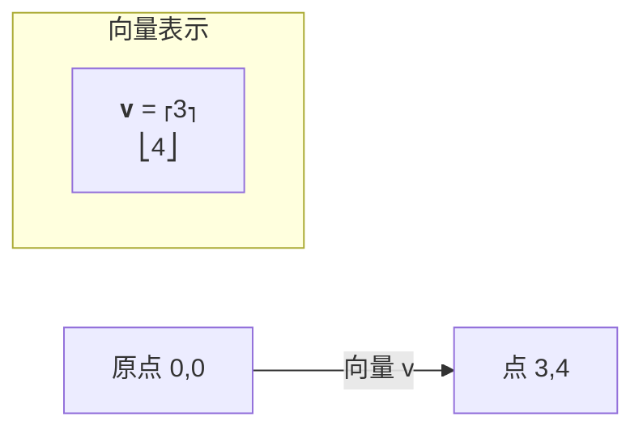
```mermaid
graph LR
    O[原点 0,0] -- 向量 v --> P[点 3,4]
    
    subgraph 向量表示
    direction LR
    V[𝐯 = ⎡3⎤<br/>⎣4⎦]
    end
```

*   **表示**：用粗体小写字母表示，如 $\mathbf{x}$, $\mathbf{y}$。它的**维度**(dimension)就是它包含的数字个数。
*   **例子**: 一个点的坐标或一个人的特征
    $\mathbf{v} = \begin{pmatrix} 2 \\ 3 \end{pmatrix}$, $\mathbf{person} = \begin{pmatrix} 1.75 \\ 70 \\ 25 \end{pmatrix}$ (身高m, 体重kg, 年龄)

#### 3. 矩阵 (Matrix) - "一个表格"
*   **是什么**：一个二维的数字表格，有行有列。它是向量的拓展。
    $$
    A = \begin{pmatrix}
    A_{1,1} & A_{1,2} & \cdots & A_{1,n} \\
    A_{2,1} & A_{2,2} & \cdots & A_{2,n} \\
    \vdots & \vdots & \ddots & \vdots \\
    A_{m,1} & A_{m,2} & \cdots & A_{m,n}
    \end{pmatrix}
    $$
*   **大白话**：
    *   **数据角度**：一个班级所有学生的成绩单。**每一行**是一个学生（一个样本），**每一列**是一门科目（一个特征）。这是一个 `(学生数量 × 科目数量)` 的矩阵。
    *   **变换角度**：矩阵可以看作一个**函数**或一个**动作**。一个矩阵可以作用在一个向量上，对其进行**旋转、拉伸、缩放**等操作。

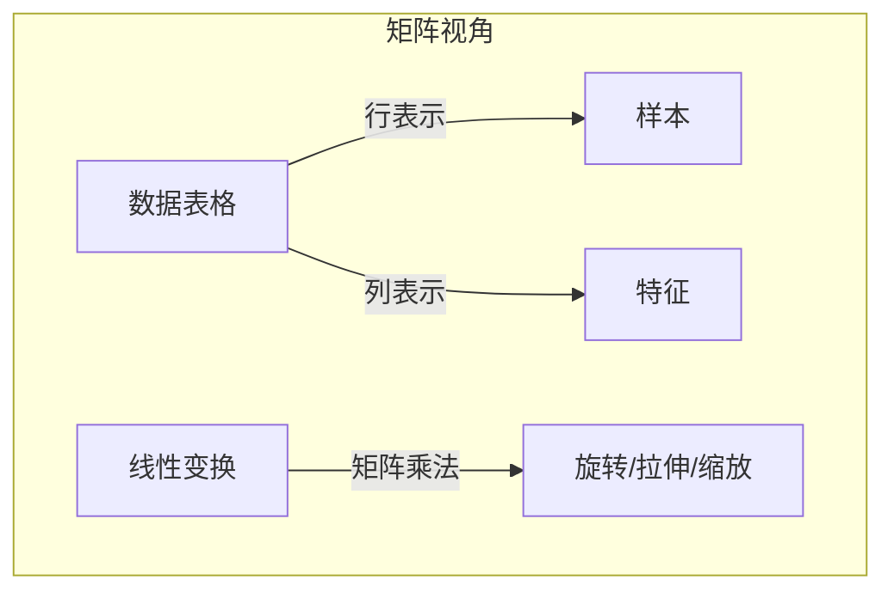
```mermaid
flowchart TD
    subgraph 矩阵视角
        direction LR
        D[数据表格] -->|行表示| S[样本]
        D -->|列表示| F[特征]
        T[线性变换] -->|矩阵乘法| R[旋转/拉伸/缩放]
    end
```

*   **表示**：用粗体大写字母表示，如 $\mathbf{A}$, $\mathbf{W}$。它的形状是 `(行数 × 列数)`。
*   **例子**: 两个学生的成绩单（语文、数学、英语）
    $\mathbf{Grades} = \begin{pmatrix} 85 & 90 & 92 \\ 70 & 80 & 75 \end{pmatrix}$
    - 第一行学生: `[85, 90, 92]`
    - 第二行学生: `[70, 80, 75]`

#### 4. 张量 (Tensor) - "一组表格/一个数据立方体"
*   **是什么**：超过两维的数组。你可以理解为"矩阵的堆叠"。
*   **大白话**：
    *   **一张彩色图片**就是一个3维张量。它的形状是 `(高度, 宽度, 通道数)`。比如 `(224, 224, 3)` 表示一张224像素高、224像素宽、有3个颜色通道（红、绿、蓝）的图片。
    *   **一个视频**就是一个4维张量 `(帧数, 高度, 宽度, 通道数)`。
    *   **一个批量(Batch)的图片**也是一个4维张量 `(批量大小, 高度, 宽度, 通道数)`。
*   **表示**：通常用普通大写字母表示，如 $A$, $X$。**在深度学习中，数据基本都是张量形式。**
*   **例子**: 一个包含2张3x3大小RGB图片的批量数据
    `shape = (2, 3, 3, 3)` (批量大小, 高, 宽, 通道数)

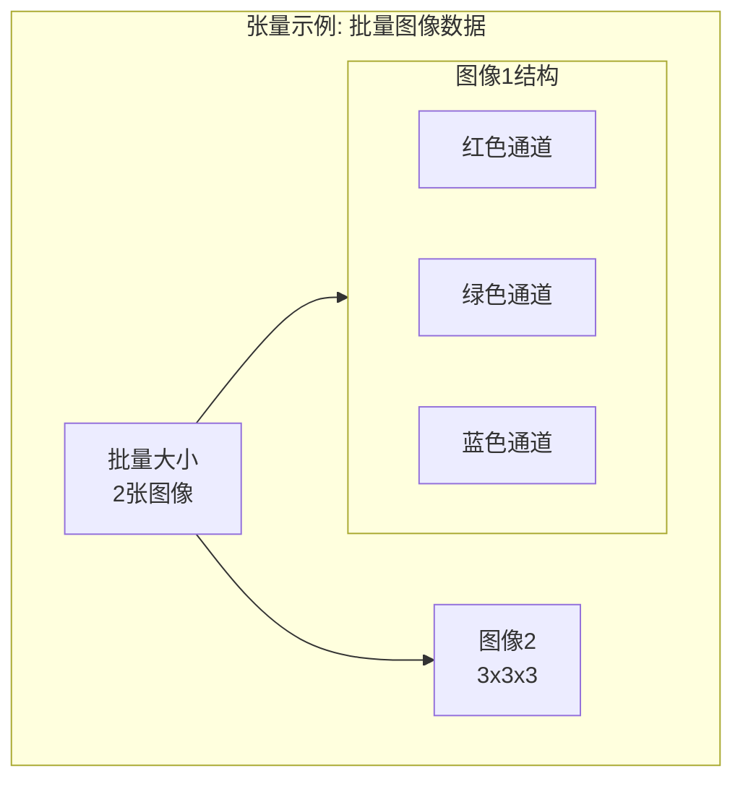
```mermaid
flowchart TD
    subgraph 张量示例: 批量图像数据
        B[批量大小<br/>2张图像] --> I1[图像1<br/>3x3x3]
        B --> I2[图像2<br/>3x3x3]
        
        subgraph I1[图像1结构]
            direction LR
            C1[红色通道]
            C2[绿色通道]
            C3[蓝色通道]
        end
    end
```

---

### 二、简单运算：如何操作这些对象

#### 1. 矩阵转置 (Transpose) - "行列互换"
*   **操作**：将矩阵的行变成列，列变成行。
    $$
    A = \begin{pmatrix} a & b \\ c & d \end{pmatrix}, \quad A^T = \begin{pmatrix} a & c \\ b & d \end{pmatrix}
    $$
*   **为什么重要**：为了满足矩阵乘法的维度要求。比如，一个列向量 $\mathbf{x}$ 的转置 $\mathbf{x}^T$ 就是一个行向量，这样才能和另一个列向量进行乘法 $\mathbf{x}^T \mathbf{y}$（得到一个标量，即内积）。

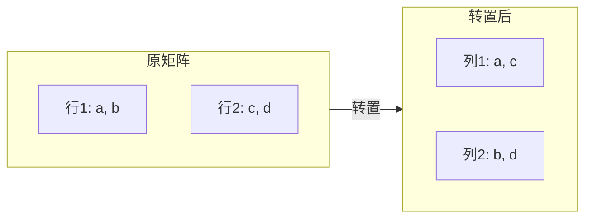
```mermaid
flowchart LR
    A[矩阵 A] -->|转置| AT[矩阵 Aᵀ]
    
    subgraph A[原矩阵]
        direction TB
        R1[行1: a, b]
        R2[行2: c, d]
    end
    
    subgraph AT[转置后]
        direction LR
        C1[列1: a, c]
        C2[列2: b, d]
    end
```

*   **例子**: 
    $A = \begin{pmatrix} 1 & 2 \\ 3 & 4 \\ 5 & 6 \end{pmatrix}$, 则 $A^T = \begin{pmatrix} 1 & 3 & 5 \\ 2 & 4 & 6 \end{pmatrix}$
    - **计算**: 第一行 `[1,2]` 变为第一列 $\begin{pmatrix} 1 \\ 2 \end{pmatrix}$，第二行 `[3,4]` 变为第二列 $\begin{pmatrix} 3 \\ 4 \end{pmatrix}$，以此类推。

#### 2. 矩阵乘法 (Matrix Multiplication) - "核心中的核心"
*   **规则**：不是对应位置相乘！如果 $A$ 是 $m \times n$ 的矩阵，$B$ 是 $n \times p$ 的矩阵，那么它们的乘积 $C = AB$ 是一个 $m \times p$ 的矩阵。
    $C$ 中第 $i$ 行第 $j$ 列的元素，等于 $A$ 的第 $i$ 行 和 $B$ 的第 $j$ 列 **对应元素相乘再求和**。
    $$
    C_{i,j} = A_{i,1}B_{1,j} + A_{i,2}B_{2,j} + ... + A_{i,n}B_{n,j} = \sum_{k=1}^{n} A_{i,k}B_{k,j}
    $$
*   **大白话**：像用 $A$ 的每一行去"扫描" $B$ 的每一列，做点乘。
*   **几何意义**：**连续的空间变换**。如果 $A$ 和 $B$ 都是变换矩阵，那么 $C=AB$ 表示先做 $B$ 变换，再做 $A$ 变换的复合变换。

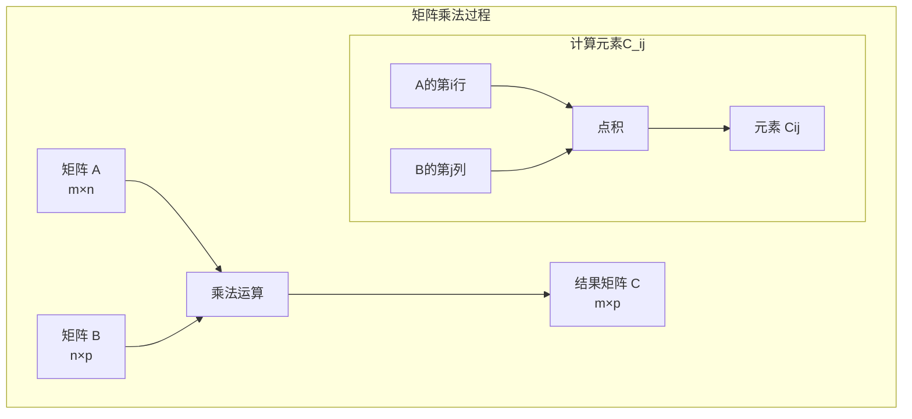
```mermaid
flowchart LR

    subgraph 矩阵乘法过程

        direction LR

        A[矩阵 A<br/>m×n] --> MUL[乘法运算]

        B[矩阵 B<br/>n×p] --> MUL

        MUL --> C[结果矩阵 C<br/>m×p]

        subgraph 计算元素C_ij

            direction LR

            Ai[A的第i行] --> Dot[点积]

            Bj[B的第j列] --> Dot

            Dot --> Cij[元素 Cij]

        end

    end
```

*   **在深度学习中的应用**：**神经网络的前向传播就是一场巨大的矩阵乘法盛宴**。一层的输出（一个向量/矩阵）乘以下一层的权重矩阵，得到下一层的输入。
*   **例子**: 
    $A = \begin{pmatrix} 1 & 2 \\ 3 & 4 \end{pmatrix}$, $B = \begin{pmatrix} 5 & 6 \\ 7 & 8 \end{pmatrix}$
    - 求 $C = AB$。
    - **计算**:
        *   $C_{1,1} = A_{1,1}B_{1,1} + A_{1,2}B_{2,1} = (1\times5) + (2\times7) = 5 + 14 = 19$
        *   $C_{1,2} = A_{1,1}B_{1,2} + A_{1,2}B_{2,2} = (1\times6) + (2\times8) = 6 + 16 = 22$
        *   $C_{2,1} = A_{2,1}B_{1,1} + A_{2,2}B_{2,1} = (3\times5) + (4\times7) = 15 + 28 = 43$
        *   $C_{2,2} = A_{2,1}B_{1,2} + A_{2,2}B_{2,2} = (3\times6) + (4\times8) = 18 + 32 = 50$
        $$C = \begin{pmatrix} 19 & 22 \\ 43 & 50 \end{pmatrix}$$
    - **重要提示**: $AB \neq BA$ (矩阵乘法**不满足交换律**)
        $BA = \begin{pmatrix} 5 & 6 \\ 7 & 8 \end{pmatrix}\begin{pmatrix} 1 & 2 \\ 3 & 4 \end{pmatrix} = \begin{pmatrix} 23 & 34 \\ 31 & 46 \end{pmatrix} \neq C$

#### 3. 元素积 (Hadamard Product) - "温和的对应位置操作"
*   **操作**：两个形状**完全相同**的矩阵（或张量），对应位置的元素相乘。
    $$
    C = A \odot B, \quad C_{i,j} = A_{i,j} \times B_{i,j}
    $$
*   **大白话**：不像矩阵乘法那样产生全局影响，它只是局部调整。比如在注意力机制中，会用 mask（掩码）矩阵通过元素积来屏蔽掉无效位置的信息。
*   **例子**: 
    $A = \begin{pmatrix} 1 & 2 \\ 3 & 4 \end{pmatrix}$, $B = \begin{pmatrix} 5 & 6 \\ 7 & 8 \end{pmatrix}$
    - $A \odot B = \begin{pmatrix} (1\times5) & (2\times6) \\ (3\times7) & (4\times8) \end{pmatrix} = \begin{pmatrix} 5 & 12 \\ 21 & 32 \end{pmatrix}$

#### 4. 逆矩阵 (Inverse Matrix) - "时光倒流"
*   **定义**：如果存在一个矩阵 $A^{-1}$，使得 $A^{-1}A = AA^{-1} = I$（单位矩阵），那么 $A^{-1}$ 就是 $A$ 的逆矩阵。
*   **大白话**：如果矩阵 $A$ 代表一种变换（比如旋转90度），那么逆矩阵 $A^{-1}$ 就代表这个变换的逆操作（再旋转回来，即-90度）。**不是所有矩阵都可逆**，只有方阵（行数=列数）且是满秩的才可能可逆。

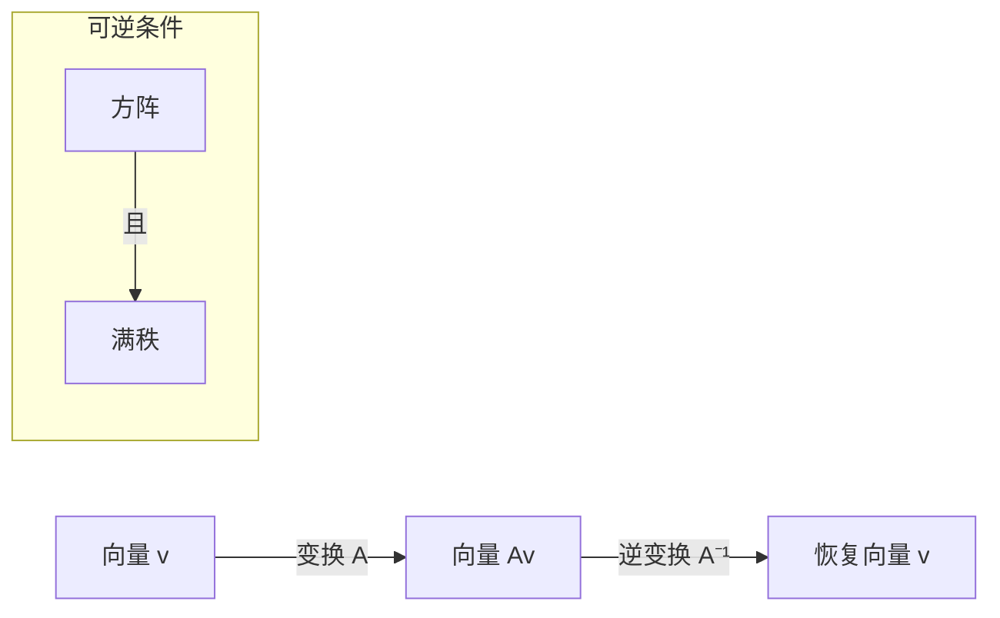
```mermaid
flowchart LR
    V[向量 v] -->|变换 A| AV[向量 Av]
    AV -->|逆变换 A⁻¹| V2[恢复向量 v]
    
    subgraph 可逆条件
        direction TB
        S[方阵]
        F[满秩]
        S -->|且| F
    end
```

*   **例子**: 
    $A = \begin{pmatrix} 4 & 7 \\ 2 & 6 \end{pmatrix}$, 其逆矩阵 $A^{-1} = \frac{1}{(4\times6)-(7\times2)}\begin{pmatrix} 6 & -7 \\ -2 & 4 \end{pmatrix} = \frac{1}{10}\begin{pmatrix} 6 & -7 \\ -2 & 4 \end{pmatrix} = \begin{pmatrix} 0.6 & -0.7 \\ -0.2 & 0.4 \end{pmatrix}$
    - **验证**: $A^{-1}A = \begin{pmatrix} 0.6 & -0.7 \\ -0.2 & 0.4 \end{pmatrix}\begin{pmatrix} 4 & 7 \\ 2 & 6 \end{pmatrix} = \begin{pmatrix} (0.6*4 + -0.7*2) & (0.6*7 + -0.7*6) \\ (-0.2*4 + 0.4*2) & (-0.2*7 + 0.4*6) \end{pmatrix} = \begin{pmatrix} 1 & 0 \\ 0 & 1 \end{pmatrix} = I$

---

### 三、线性方程组：一切的起源

*   **形式**：
    $$
    A\mathbf{x} = \mathbf{b}
    $$
    其中 $A$ 是系数矩阵，$\mathbf{x}$ 是未知数向量，$\mathbf{b}$ 是常数向量。
*   **几何解释**：寻找一个向量 $\mathbf{x}$，使得经过矩阵 $A$ 代表的线性变换后，恰好落在目标向量 $\mathbf{b}$ 上。

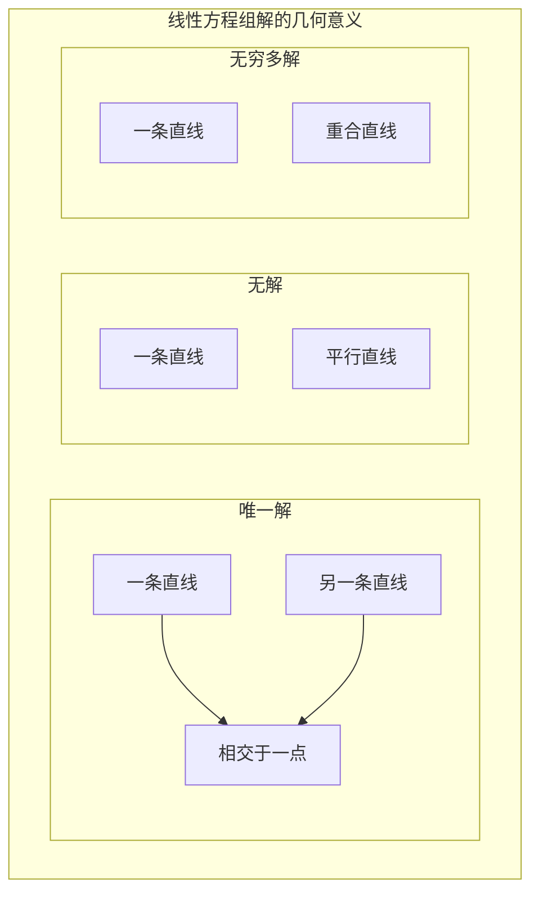
```mermaid
flowchart TD
    subgraph 线性方程组解的几何意义
        direction LR
        
        subgraph 唯一解
            L1[一条直线] --> X[相交于一点]
            L2[另一条直线] --> X
        end
        
        subgraph 无解
            P1[一条直线]
            P2[平行直线]
        end
        
        subgraph 无穷多解
            ID1[一条直线]
            ID2[重合直线]
        end
    end
```

*   **解的情况（非常重要）**：
    *   **有唯一解**：$A$ 是方阵且可逆（满秩）。这意味着变换后没有丢失信息，可以完美地逆变换回去找到 $\mathbf{x} = A^{-1}\mathbf{b}$。就像在一个平面上，两条不平行且不重合的直线相交于一点。
    *   **无解**：方程数多于未知数 ($m > n$)，且方程之间存在矛盾。这通常意味着我们的模型**太简单**（容量低），无法完美拟合所有数据点（**欠拟合**）。就像想用一条直线去拟合三个不在一条直线上的点。
    *   **有无穷多解**：方程数少于未知数 ($m < n$)，或者方程之间存在依赖关系。这意味着变换过程中丢失了信息，有无数种方式可以映射到 $\mathbf{b}$。这通常意味着我们的模型**太复杂**，有很多组参数都能完美拟合训练数据（**过拟合**）。就像想用一个平面去拟合一条直线，整个平面上的点都满足条件。

---

### 四、范数 (Norm)：衡量"大小"的尺子

范数是用来衡量向量（或矩阵）**大小** 的函数。不同的范数有不同的衡量方式。

#### 1. $L^p$ 范数家族
对于一个 $n$ 维向量 $\mathbf{x}$，其 $L^p$ 范数定义为：
$$
||\mathbf{x}||_p = \left( \sum_{i=1}^{n} |x_i|^p \right)^{1/p}
$$

*   **$L^2$ 范数 (欧几里得范数)**：
    $$
    ||\mathbf{x}||_2 = \sqrt{\sum_{i=1}^{n} x_i^2}
    $$
    *   **大白话**：就是向量的**几何长度**。从原点出发到向量所指点的直线距离。在深度学习中最常用，比如用作损失函数（MSE）。

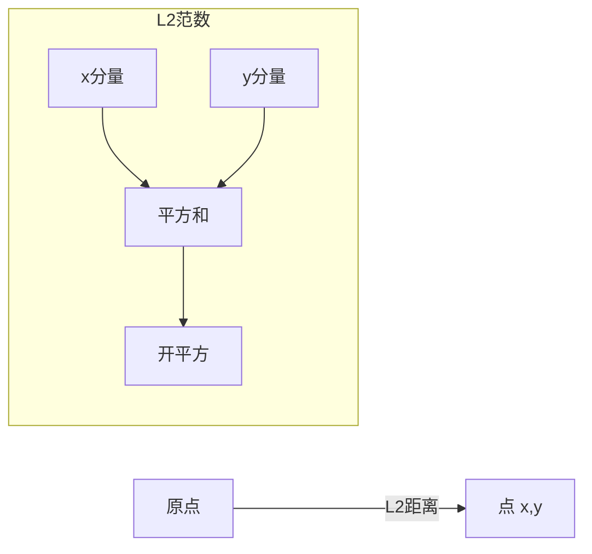
```mermaid
flowchart LR

    O[原点] -- L2距离 --> P[点 x,y]

    subgraph L2范数

        direction TB

        X[x分量]

        Y[y分量]

        X --> S[平方和]

        Y --> S

        S --> SQ[开平方]

    end
```

*   **例子**: $\mathbf{x} = \begin{pmatrix} 3 \\ 4 \end{pmatrix}$
        - $||\mathbf{x}||_2 = \sqrt{3^2 + 4^2} = \sqrt{9 + 16} = \sqrt{25} = 5$
        - 几何意义: 这个向量的长度就是5。

*   **$L^1$ 范数**：
    $$
    ||\mathbf{x}||_1 = \sum_{i=1}^{n} |x_i|
    $$
    *   **大白话**：各个维度坐标值的**绝对值之和**。它的几何形状是菱形，在优化中会产生**稀疏解**（即让很多参数变成0），用于特征选择。
    *   **例子**: $\mathbf{x} = \begin{pmatrix} 3 \\ -4 \end{pmatrix}$
        - $||\mathbf{x}||_1 = |3| + |-4| = 3 + 4 = 7$

*   **$L^\infty$ 范数 (最大范数)**：
    $$
    ||\mathbf{x}||_\infty = \max_i |x_i|
    $$
    *   **大白话**：只关心向量中**绝对值最大的那个分量**。表示向量分量中的最大幅度。
    *   **例子**: $\mathbf{x} = \begin{pmatrix} 3 \\ -7 \\ 5 \end{pmatrix}$
        - $||\mathbf{x}||_\infty = \max(|3|, |-7|, |5|) = 7$

#### 2. Frobenius 范数 (矩阵的范数)
*   **定义**：把所有元素平方求和再开根号，其实就是把矩阵**拉直成一个向量**后求其 $L^2$ 范数。
    $$
    ||A||_F = \sqrt{\sum_{i=1}^{m} \sum_{j=1}^{n} A_{ij}^2}
    $$
*   **大白话**：衡量整个矩阵的"能量"或"大小"。在深度学习中，我们经常在**正则化**（如权重衰减）中使用它，通过限制权重矩阵的 Frobenius 范数来防止模型**过拟合**。公式 $\text{MSE} + \lambda ||\mathbf{w}||_2^2$ 里的 $||\mathbf{w}||_2^2$ 其实就是权重向量的 $L^2$ 范数的平方，对于矩阵就是 Frobenius 范数的平方。

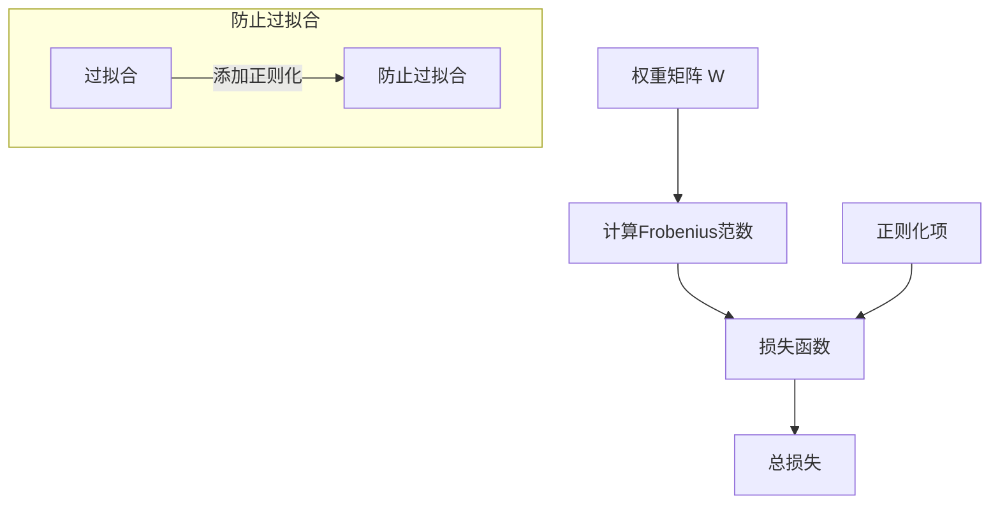
```mermaid
flowchart TD

    W[权重矩阵 W] --> F[计算Frobenius范数]

    F --> L[损失函数]

    R[正则化项] --> L

    L --> T[总损失]

    subgraph 防止过拟合

        direction LR

        OF[过拟合] -->|添加正则化| PF[防止过拟合]

    end
```

*   **例子**: $A = \begin{pmatrix} 1 & 2 \\ 3 & 4 \end{pmatrix}$
    - $||A||_F = \sqrt{1^2 + 2^2 + 3^2 + 4^2} = \sqrt{1 + 4 + 9 + 16} = \sqrt{30} \approx 5.477$
    - 这个值衡量了矩阵中所有元素的"总强度"。在正则化中，我们通过惩罚这个值来限制模型复杂度。
    -  建筑材料采购与成本控制
		- 你是建筑设计师，采购不同规格木材构建房屋框架。用矩阵 $(A = \begin{pmatrix}2 & 10 \\ 3 & 15 \\ 4 & 20\end{pmatrix})$ 表示木材采购信息，行代表木材类型，列分别是长度（米）和每米价格（元）。计算其 Frobenius 范数 $(||A||_F = \sqrt{2^2 + 10^2 + 3^2 + 15^2 + 4^2 + 20^2} = \sqrt{754} \approx 27.46)$，此值为采购方案“综合成本强度”。若超预算，可构建“预算矩阵” $(B)$ 并计算其 $(||B||_F)$，对比 $(||A||_F)$ 与 $(||B||_F)$ 后调整采购方案。

	- 图像处理示例：图像噪声控制
		- 把灰度图像看作矩阵，如 $(A = \begin{pmatrix}10 & 20 \\ 30 & 40\end{pmatrix})$，其元素是像素灰度值。计算$(||A||_F = \sqrt{10^2 + 20^2 + 30^2 + 40^2} = \sqrt{3000} \approx 54.77)$。再收集正常无噪图像计算其 Frobenius 范数范围。若当前图像该值超出此范围，可能受噪声干扰，超出幅度越大噪声影响越重。 

### ✅ 总结

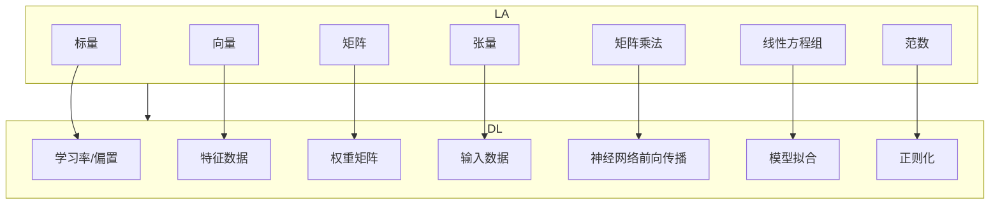
```mermaid
graph TD
    LA[线性代数概念] --> DL[在深度学习中的应用]
    
    subgraph LA
        S[标量]
        V[向量]
        M[矩阵]
        T[张量]
        MM[矩阵乘法]
        LS[线性方程组]
        N[范数]
    end
    
    subgraph DL
        LR[学习率/偏置]
        FD[特征数据]
        WM[权重矩阵]
        ID[输入数据]
        NN[神经网络前向传播]
        MF[模型拟合]
        REG[正则化]
    end
    
    S --> LR
    V --> FD
    M --> WM
    T --> ID
    MM --> NN
    LS --> MF
    N --> REG
```

| 概念 | 数学本质 | 核心比喻 | 在深度学习中的作用 |
| :--- | :--- | :--- | :--- |
| **标量** | 单个数字 | 一个温度值 | 学习率、偏置等单个参数 |
| **向量** | 一串数字/一个方向 | 一个人的特征向量 | 单样本数据、一层神经元的输出 |
| **矩阵** | 二维表格/一种变换 | 全班成绩单/一个变换动作 | 权重矩阵、整个批次的数据 |
| **张量** | 高维数组 | 一个数据立方体 | 输入数据（如图片）、中间特征 |
| **矩阵乘法** | 行点乘列 | 用A的行扫描B的列 | **神经网络前向传播的核心计算** |
| **线性方程组** | $A\mathbf{x} = \mathbf{b}$ | 寻找一个变换后的目标 | **模型拟合的本质**，解的情况对应欠/过拟合 |
| **$L^2$范数** | 平方和开根 | 几何长度 | **损失函数(MSE)、权重正则化** |
| **Frobenius范数** | 所有元素平方和开根 | 矩阵的"能量" | **权重矩阵的正则化，防止过拟合** |

---

## 🎲 概率论：描述不确定性的语言

如果说线性代数是深度学习的**骨架**，那么概率论就是它的**灵魂**。它让机器学会在不确定的环境中做出最优决策。

---

### 一、随机变量 (Random Variable) - “不确定的量”

*   **理论**：一个其值取决于随机现象结果的变量。它不是传统的“变量”，而是一个**函数**，将随机实验的每一个可能结果映射到一个数值。
*   **大白话**：就像一个即将掷出的骰子**朝上的点数**，在掷出之前，它的值是不确定的（可能是1到6中的任何一个）。我们用一个大写字母（如 $X$）来表示这个“未来的数字”。
*   **例子**：
    *   $X$: 掷一枚公平骰子一次的结果。$X$ 的可能取值是 {1, 2, 3, 4, 5, 6}。
    *   $Y$: 明天中午的气温。
    *   $Z$: 某条新闻是假新闻的概率。
*   **类型**：
    *   **离散随机变量**：取值是可数的（如骰子点数、次数）。
    *   **连续随机变量**：取值在连续区间内（如温度、身高、概率）。
*   **核心思想**：随机变量 $X$ 是一个函数，它将随机实验的**样本空间**（所有可能结果的集合）映射到**实数集**。我们关心的是这些数字的概率。
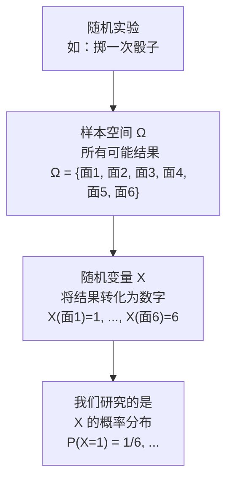
```mermaid
	flowchart TD
    A["""
    随机实验
    如：掷一次骰子
    """] --> B["""
    样本空间 Ω
    所有可能结果
    Ω = {面1, 面2, 面3, 面4, 面5, 面6}
    """]
    B --> C["""
    随机变量 X
    将结果转化为数字
    X(面1)=1, ..., X(面6)=6
    """]
    C --> D["""
    我们研究的是
    X 的概率分布
    P(X=1) = 1/6, ...
    """]
```

---

### 二、概率分布 (Probability Distribution) - “可能性地图”

*   **理论**：描述一个随机变量所有可能取值及其对应可能性的**规则**。
*   **大白话**：一张告诉你哪个结果更可能出现、哪个结果不太可能出现的**地图**或**说明书**。
*   **例子**：对于公平骰子 $X$，它的概率分布告诉我们每个点数出现的可能性都是 $1/6$。
*   **关系**：PMF 和 PDF 是描述概率分布的两种主要数学工具。
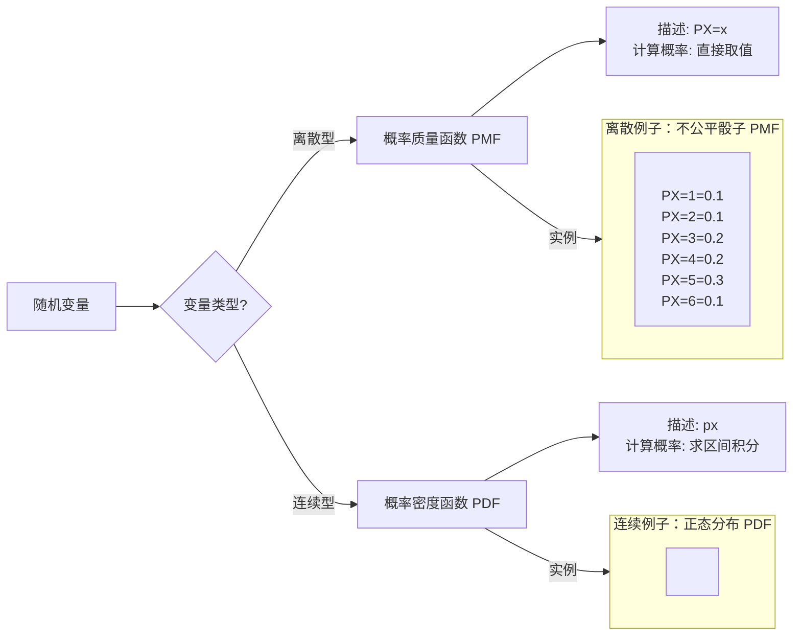
```mermaid
    flowchart LR
    A[随机变量] --> B{变量类型?}
    B -->|离散型| C[概率质量函数 PMF]
    B -->|连续型| D[概率密度函数 PDF]

    C --> E[描述: PX=x<br>计算概率: 直接取值]
    D --> F[描述: px<br>计算概率: 求区间积分]

    subgraph G[离散例子：不公平骰子 PMF]
        H[<br>PX=1=0.1<br>PX=2=0.1<br>PX=3=0.2<br>PX=4=0.2<br>PX=5=0.3<br>PX=6=0.1<br>]
    end

    subgraph I[连续例子：正态分布 PDF]
        J[<br>]
    end

    C -- 实例 --> G
    D -- 实例 --> I
```

---

### 三、概率质量函数 (PMF) - “离散变量的分布说明书”

*   **理论**：**专门用于离散随机变量**的函数 $P(X=x)$，它给出了随机变量 $X$ **恰好等于**某个特定值 $x$ 的概率。
*   **必须满足**：
    1.  $0 \leq P(X=x) \leq 1$ (概率值在0到1之间)
    2.  $\sum_{\text{所有 } x} P(X=x) = 1$ (所有可能情况的概率之和为1)
*   **例子**：不公平骰子，其PMF如下：
    *   $P(X=1) = 0.1$
    *   $P(X=2) = 0.1$
    *   $P(X=3) = 0.2$
    *   $P(X=4) = 0.2$
    *   $P(X=5) = 0.3$
    *   $P(X=6) = 0.1$
    *   检查：$0.1+0.1+0.2+0.2+0.3+0.1 = 1.0$，满足条件。

---

### 四、概率密度函数 (PDF) - “连续变量的相对可能性手册”

*   **理论**：**专门用于连续随机变量**的函数 $p(x)$。**注意**：对于连续变量，取某个**精确值**的概率为0（因为点无穷多）。PDF $p(x)$ 的**值本身不是概率**，但其在某个区间上的**积分**代表概率。
*   **必须满足**：
    1.  $\forall x, p(x) \geq 0$ (密度非负)
    2.  $\int_{-\infty}^{\infty} p(x) dx = 1$ (总面积为1)
*   **大白话**：PDF值高的地方，表示随机变量落在该值**附近**的可能性更大。概率是PDF曲线下**一块面积**。
*   **例子**：成年男性身高 $H$ 近似服从正态分布，PDF为 $p(h)$。
    *   身高在170cm到175cm之间的概率是多少？$P(170 < H < 175) = \int_{170}^{175} p(h) dh$ (求曲线下从170到175的面积)。
    *   $P(H = 172.5000...)$ (精确到无穷位)的概率是多少？几乎是0。

---

### 五、边缘概率 (Marginal Probability) - “从表格中求总和”

*   **理论**：在**联合概率分布**（多个变量的分布）中，忽略其他变量，只关心某一个变量的概率。
*   **大白话**：有一个学生成绩和性别的联合分布表。如果你只想知道学生的成绩分布（不管性别），就把表中同一成绩下不同性别的概率都加起来。这个“加起来”的过程就是**边缘化**。
*   **例子**：随机调查一个人的眼睛颜色 ($E$) 和头发颜色 ($H$)，得到联合概率表（简化）：

|               | 金发 (H1) | 棕发 (H2) | **边缘概率 P(E)** |
| :------------ | :-----: | :-----: | :-----------: |
| 蓝眼 (E1)       |   0.2   |   0.1   |    **0.3**    |
| 棕眼 (E2)       |   0.1   |   0.6   |    **0.7**    |
| **边缘概率 P(H)** | **0.3** | **0.7** |    **1.0**    |

  - $P(蓝眼) = P(E1)$ 的边缘概率 = $P(E1, H1) + P(E1, H2) = 0.2 + 0.1 = 0.3$
  - $P(棕发) = P(H2)$ 的边缘概率 = $P(E1, H2) + P(E2, H2) = 0.1 + 0.6 = 0.7$
  - 对于连续变量：$p(x) = \int p(x, y) dy$
*   **核心思想**：边缘概率是通过对联合概率分布进行**边缘化**（求和或积分）得到的。
    ```mermaid
    flowchart TD
    A[联合概率分布 PX,Y] --> B[边缘化 Sum over Y]
    A --> C[边缘化 Sum over X]

    B --> D[得到 X 的边缘分布 PX]
    C --> E[得到 Y 的边缘分布 PY]

    F[XY联合分布表] --> G[求 PX<br>将同一 X 值下<br>所有 Y 的概率相加]
    F --> H[求 PY<br>将同一 Y 值下<br>所有 X 的概率相加]
    ```

---

### 六、条件概率 (Conditional Probability) - “已知前提下的可能性”

*   **理论**：在事件 $B$ 已经发生的条件下，事件 $A$ 发生的概率。记作 $P(A|B)$。
*   **公式**：$P(A|B) = \frac{P(A, B)}{P(B)}$ （要求 $P(B) > 0$）
*   **大白话**：**缩小样本空间**。我们把关注点从整个世界，缩小到所有满足 $B$ 的情况，然后再看在这些情况中 $A$ 也发生的比例。
*   **例子**：沿用上表的例子。
    *   **问题**：已知一个人是金发 ($H1$)，求他是蓝眼 ($E1$) 的概率？即求 $P(E1|H1)$。
    
|               | 金发 (H1) | 棕发 (H2) | **边缘概率 P(E)** |
| :------------ | :-----: | :-----: | :-----------: |
| 蓝眼 (E1)       |   0.2   |   0.1   |    **0.3**    |
| 棕眼 (E2)       |   0.1   |   0.6   |    **0.7**    |
| **边缘概率 P(H)** | **0.3** | **0.7** |    **1.0**    |
    *   **计算**：
        *   分子 $P(E1, H1) = 0.2$ (既是蓝眼又是金发的概率)
        *   分母 $P(H1) = 0.3$ (是金发的总概率)
        *   $P(E1|H1) = \frac{0.2}{0.3} \approx 0.667$
    *   **解释**：在所有金发的人中，有大约66.7%的人是蓝眼。
*   **核心思想**：条件概率 $P(A|B)$ 是在已知信息 $B$ 的情况下，对 $A$ 发生可能性的**重新评估**。如果信息 $B$ 不能改变我们对 $A$ 的看法，则称 $A$ 与 $B$ 独立。
    ```mermaid
	flowchart LR
    A["事件A的先验概率 P(A)"] --> B{"获得新信息：事件B发生"}
    B --> C["应用贝叶斯规则P(A|B) = P(A∩B) / P(B)"]
    C --> D["事件A的后验概率 P(A|B)"]

    E["判断独立性"] --> F{"P(A∩B) 是否等于 P(A)·P(B)?"}
    F -->|"是"| G["A与B独立知道B对预测A无帮助"]
    F -->|"否"| H["A与B不独立知道B对预测A有帮助"]
    ```

---

### 七、独立 vs. 条件独立

1.  **独立 (Independent)**
    *   **理论**：两个事件 $A$ 和 $B$ 相互独立，意味着知道 $B$ 是否发生**无助于**你预测 $A$ 是否会发生。公式：$P(A, B) = P(A)P(B)$。
    *   **大白话**：两件完全不相关的事。比如“你扔硬币得到正面”和“我扔骰子得到6点”。
    *   **例子**：$P(硬币正面) = 0.5$, $P(骰子6点) = 1/6$。$P(硬币正面, 骰子6点) = 0.5 \times 1/6 = 1/12$。

2.  **条件独立 (Conditionally Independent)**
    *   **理论**：在给定另一个事件 $C$ 发生后，$A$ 和 $B$ 变得独立了。公式：$P(A, B | C) = P(A|C)P(B|C)$。
    *   **大白话**：本来两件事可能有关联，但一旦知道了某个“真相” $C$，它们就没关系了。
    *   **经典例子**：
        *   $A$: 你的草坪是湿的。
        *   $B$: 你邻居的草坪是湿的。
        *   $C$: 昨晚下雨了。
        *   **分析**：在不知道 $C$（是否下雨）时，$A$ 和 $B$ 是相关的（你家草坪湿了，会让你觉得邻居家草坪也可能湿了）。但一旦**知道昨晚下雨了 ($C$)**，你家草坪湿 ($A$) 和邻居家草坪湿 ($B$) 就都得到了解释，它们之间就不再提供关于对方的额外信息，即**在给定 $C$ 的条件下，$A$ 和 $B$ 是独立的**。
    *   **独立性例子**：掷一次公平骰子，$A=\{点数为偶数\}$, $B=\{点数>3\}$。
        - $P(A)=1/2$, $P(B)=1/2$, $P(A,B)=P(\{4,6\})=1/3$.
        - $P(A,B) = 1/3 \neq P(A)P(B) = 1/4$，故 $A$ 和 $B$ **不独立**。

---

### 八、期望 (Expectation) - “长期平均价值”

*   **理论**：随机变量 $X$ 的期望 $\mathbb{E}[X]$ 是其所有可能值的**加权平均**，权重就是对应的概率。它表示如果你无数次重复实验，得到的平均值。
*   **公式**：
    *   离散：$\mathbb{E}[X] = \sum_{x} x P(X=x)$
    *   连续：$\mathbb{E}[X] = \int x p(x) dx$
*   **大白话**：一个投资的“预期回报”，或者一个游戏的“理论上的平均收益”。
*   **例子**：掷不公平骰子（PMF如前所述），求期望值。
    $\mathbb{E}[X] = (1 \times 0.1) + (2 \times 0.1) + (3 \times 0.2) + (4 \times 0.2) + (5 \times 0.3) + (6 \times 0.1) = 3.7$
    这意味着长期来看，掷这个骰子的平均点数是3.7。
*   **核心思想**：期望 $\mathbb{E}[X]$ 描述分布的中心（均值），方差 $\text{Var}(X)$ 描述分布的分散程度（离散度）。
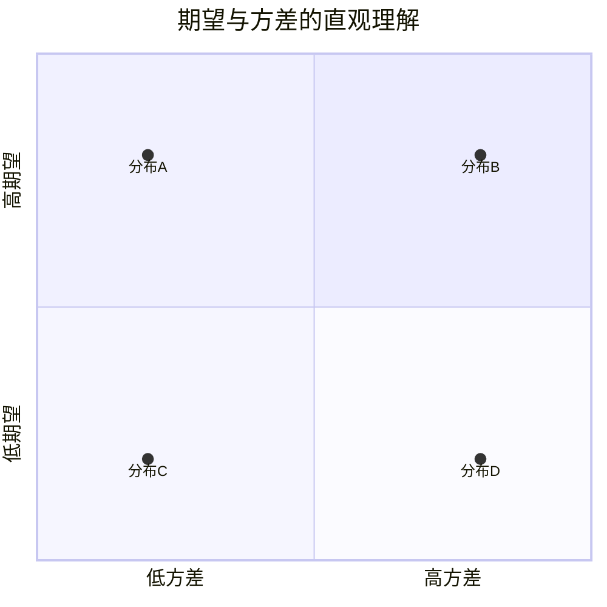
```mermaid
    quadrantChart
        title 期望与方差的直观理解
        x-axis "低方差" --> "高方差"
        y-axis "低期望" --> "高期望"
        "分布A": [0.2, 0.8]
        "分布B": [0.8, 0.8]
        "分布C": [0.2, 0.2]
        "分布D": [0.8, 0.2]
```

*   **线性性质**：$\mathbb{E}[aX + bY + c] = a\mathbb{E}[X] + b\mathbb{E}[Y] + c$ （极其重要！）

---
### 九、方差 & 协方差 (Variance & Covariance)

1.  **方差 (Variance)**
    *   **理论**：衡量随机变量**偏离其期望值**的程度。方差越大，数据越分散。
    *   **公式**：$\text{Var}(X) = \mathbb{E}[(X - \mathbb{E}[X])^2] = \mathbb{E}[X^2] - (\mathbb{E}[X])^2$
    *   **大白话**：衡量“波动性”或“稳定性”。比如一只股票方差大，说明它价格波动剧烈。
    *   **例子**：掷公平骰子，$\mathbb{E}[X] = 3.5$。
        $\mathbb{E}[X^2] = (1^2+2^2+3^2+4^2+5^2+6^2)/6 = 91/6 \approx 15.167$
        $\text{Var}(X) = 15.167 - (3.5)^2 = 15.167 - 12.25 = 2.917$
    *   **性质**：$\text{Var}(aX + b) = a^2\text{Var}(X)$

2.  **协方差 (Covariance)**
    *   **理论**：衡量**两个**随机变量**一起变化**的趋势。
        *   正值：一个变大，另一个也倾向于变大。
        *   负值：一个变大，另一个倾向于变小。
        *   接近零：线性关系弱。
    *   **公式**：$\text{Cov}(X, Y) = \mathbb{E}[(X - \mathbb{E}[X])(Y - \mathbb{E}[Y])] = \mathbb{E}[XY] - \mathbb{E}[X]\mathbb{E}[Y]$
    *   **大白话**：衡量“协同性”。
    *   **例子**：身高和体重通常有正协方差。
    *   **核心思想**：协方差 $\text{Cov}(X,Y)$ 衡量两个随机变量**共同变化**的趋势。

3.  **协方差矩阵 (Covariance Matrix)**
    *   **理论**：将多个随机变量（如一个向量的各个分量）之间的协方差组织成一个矩阵。
        $$\Sigma = \begin{pmatrix}
        \text{Var}(X_1) & \text{Cov}(X_1, X_2) \\
        \text{Cov}(X_2, X_1) & \text{Var}(X_2)
        \end{pmatrix}$$
    *   **大白话**：描述一个多维数据中，各个维度自身如何变化，以及彼此之间如何关联的**总结报告**。在深度学习中非常重要，例如用于PCA等算法。
    *   **例子**：考虑两个变量 $X_1$ 和 $X_2$ 的协方差矩阵
        $$
        \Sigma = \begin{pmatrix}
        \text{Var}(X_1) & \text{Cov}(X_1, X_2) \\
        \text{Cov}(X_2, X_1) & \text{Var}(X_2)
        \end{pmatrix}
        $$
        假设 $\text{Var}(X_1) = 4$, $\text{Var}(X_2) = 9$, $\text{Cov}(X_1, X_2) = 3$
        $$
        \Sigma = \begin{pmatrix}
        4 & 3 \\
        3 & 9
        \end{pmatrix}
        $$

---

### 十、常见的概率分布

1.  **伯努利分布 (Bernoulli)**
    *   **描述**：**一次**试验，**两个**结果（成功/失败，1/0）。
    *   **参数**：$\phi$ (成功的概率)
    *   **PMF**：$P(X=x) = \phi^x (1-\phi)^{1-x}$, $x \in \{0, 1\}$
    *   **例子**：掷一次硬币（正面为1）。

2.  **范畴分布 (Categorical) / 多项分布 (Multinoulli)**
    *   **描述**：**一次**试验，**$k$个**结果。
    *   **参数**：向量 $\mathbf{p} = (p_1, p_2, ..., p_k)$, $\sum p_i = 1$
    *   **PMF**：$P(X=i) = p_i$
    *   **例子**：掷一次骰子（$k=6$）。

3.  **高斯（正态）分布 (Gaussian/Normal)**
    *   **描述**：著名的“钟形曲线”。描述大量独立随机变量之和的分布（中心极限定理）。
    *   **参数**：均值 $\mu$ (中心位置), 方差 $\sigma^2$ (分散程度)
    *   **PDF**：$p(x) = \frac{1}{\sqrt{2\pi\sigma^2}} \exp\left(-\frac{(x-\mu)^2}{2\sigma^2}\right)$
    *   **例子**：身高、测量误差、考试成绩等都近似服从正态分布。

4.  **多元高斯分布 (Multivariate Gaussian)**
    *   **描述**：高斯分布向高维空间的推广。
    *   **参数**：均值向量 $\boldsymbol{\mu}$, 协方差矩阵 $\boldsymbol{\Sigma}$
    *   **PDF**：$p(\mathbf{x}) = \frac{1}{(2\pi)^{n/2} |\boldsymbol{\Sigma}|^{1/2}} \exp\left( -\frac{1}{2} (\mathbf{x} - \boldsymbol{\mu})^T \boldsymbol{\Sigma}^{-1} (\mathbf{x} - \boldsymbol{\mu}) \right)$
    *   **大白话**：不仅描述了每个维度的分布，还通过 $\boldsymbol{\Sigma}$ 描述了维度之间的相关性。

---

### 十一、贝叶斯定理 (Bayes' Theorem) - “用新证据更新信念”

*   **理论**：描述了在已知相关证据后，如何更新我们对某个假设的信念。
*   **公式**：
    $$P(A|B) = \frac{P(B|A) P(A)}{P(B)}$$
    *   $P(A)$: **先验概率 (Prior)**。在看到证据 $B$ 之前，我们对假设 $A$ 的初始信念。
    *   $P(B|A)$: **似然 (Likelihood)**。如果假设 $A$ 成立，我们看到证据 $B$ 的可能性有多大。
    *   $P(B)$: **证据 (Evidence)** 或**边缘似然**。看到证据 $B$ 的总概率（考虑所有可能假设）。
    *   $P(A|B)$: **后验概率 (Posterior)**。在看到证据 $B$ 之后，我们对假设 $A$ 的**更新后的信念**。
*   **大白话**：“原因”导致“结果”。现在我们观察到了“结果”，反过来推断是哪个“原因”造成的可能性更大。
*   **经典例子**：疾病检测
    *   $A$: 一个人患病。
    *   $B$: 检测结果为阳性。
    *   **已知**：
        *   患病率 $P(A) = 0.01$ (先验)
        *   检测准确率：如果真有病，检测为阳性的概率 $P(B|A) = 0.99$ (似然，真阳性率)
        *   如果没病，检测为阳性的概率 $P(B|\neg A) = 0.05$ (假阳性率)
    *   **问题**：如果一个人检测结果是阳性，他真正患病的概率是多少？即求 $P(A|B)$ (后验)。
    *   **计算**：
        1.  计算总阳性率 $P(B)$ (证据)：
            $P(B) = P(B,A) + P(B, \neg A) = P(B|A)P(A) + P(B|\neg A)P(\neg A) = (0.99)(0.01) + (0.05)(0.99) = 0.0099 + 0.0495 = 0.0594$
        2.  应用贝叶斯定理：
            $P(A|B) = \frac{P(B|A)P(A)}{P(B)} = \frac{0.99 \times 0.01}{0.0594} \approx \frac{0.0099}{0.0594} \approx 0.1667$
    *   **结论**：即使检测非常准确（99%），一个检测呈阳性的人真正患病的概率也只有**16.67%**。这是因为患病率（先验）太低了。这个例子凸显了理解先验概率的重要性。
*   **核心思想**：贝叶斯定理提供了一个系统化的框架，用于在获得新证据后，从**先验信念**更新为**后验信念**。
    ```mermaid
    flowchart LR
    A["""
    先验概率
    P(Hypothesis)
    """] --> B{"""
    新证据 E 出现
    """}

    B --> C["""
    计算似然
    P(Evidence|Hypothesis)
    """]

    D["""
    计算证据的
    总概率 P(Evidence)
    """] --> E["""
    应用贝叶斯定理
    P(Hypothesis|Evidence) =
    P(Evidence|Hypothesis) * P(Hypothesis) / P(Evidence)
    """]

    C --> E
    E --> F["""
    后验概率
    P(Hypothesis|Evidence)
    """]
    ```

贝叶斯定理是贝叶斯统计、垃圾邮件过滤、医学诊断和许多机器学习算法（如朴素贝叶斯分类器）的核心。

---

## 🧠 优化：为机器学习寻找最佳配方

想象一下，你正在调一杯鸡尾酒。每种成分的量就是**参数**，酒的味道是**模型表现**，你的目标是找到最好的配方，让味道最棒。**优化**，就是帮你找到这个最佳配方的系统化方法。

---

### 一、基于梯度的优化 (Gradient-Based Optimization) - 指南针与地图

*   **核心思想**：我们有一个需要最小化（或最大化）的函数 $J(\theta)$，称为**目标函数**（或损失函数、成本函数）。$\theta$ 代表所有参数（如权重 $w$ 和偏置 $b$）。基于梯度的优化利用函数的**梯度**（Gradient）来指导我们如何调整 $\theta$，以最快地到达函数的最低点。

*   **关键概念**：
    *   **导数 $f'(x)$ / 梯度 $\nabla_\theta J(\theta)$**：
        *   **理论**：函数在某一点的斜率。对于多元函数，梯度是一个向量，每个分量是该点沿某个坐标轴方向的斜率。
        *   **大白话**：**指南针**。它告诉你哪个方向是**下山最快**的方向。梯度方向是函数值上升最快的方向，所以**负梯度方向**就是下降最快的方向。
        *   **例子**：$f(x) = x^2$，在 $x=3$ 处的导数 $f'(3) = 6 > 0$，表示此处正在上升，要下山需向左（负方向）移动。
    *   **学习率 (Learning Rate) $\eta$**：
        *   **理论**：一个超参数，控制每次参数更新步长的大小。
        *   **大白话**：**步幅**。步子太大（$\eta$ 太大）可能会跨过谷底甚至导致发散；步子太小（$\eta$ 太小）下山速度太慢，永远到不了底。

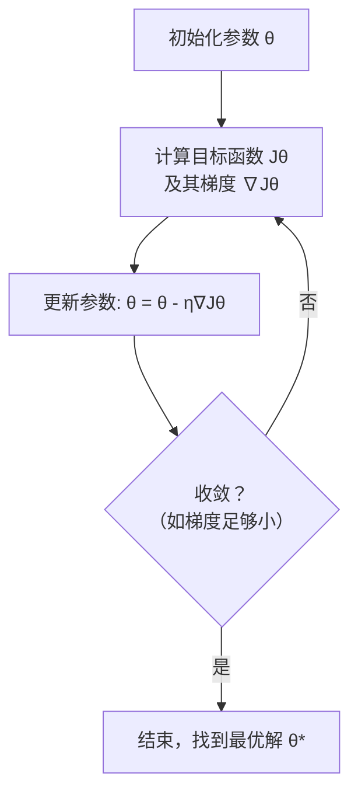
```mermaid
flowchart TD
A[初始化参数 θ] --> B[计算目标函数 Jθ<br>及其梯度 ∇Jθ]
B --> C[更新参数: θ = θ - η∇Jθ]
C --> D{收敛？<br>（如梯度足够小）}
D -->|是| E[结束，找到最优解 θ*]
D -->|否| B
```

---

### 二、梯度下降 (Gradient Descent) - 一步步下山

*   **算法**：$\theta_{\text{new}} = \theta_{\text{old}} - \eta \nabla_\theta J(\theta_{\text{old}})$
*   **几何解释**：想象你蒙着眼在一个凹凸不平的山坡上，只能靠脚感受坡度。你每走一步，都朝着当下最陡的下山方向迈出一小步。梯度下降就是这个过程的形式化。

*   **例子**：最小化 $f(x) = x^2$。
    *   导数 $f'(x) = 2x$。
    *   设初始点 $x_0 = 3$，学习率 $\eta = 0.1$。
    *   **迭代过程**：
        1.  $x_1 = 3 - 0.1 * (2*3) = 3 - 0.6 = 2.4$
        2.  $x_2 = 2.4 - 0.1 * (2*2.4) = 2.4 - 0.48 = 1.92$
        3.  $x_3 = 1.92 - 0.1 * (2*1.92) = 1.92 - 0.384 = 1.536$
        4.  ... 不断迭代，$x$ 会逐渐接近全局最小值点 $0$。

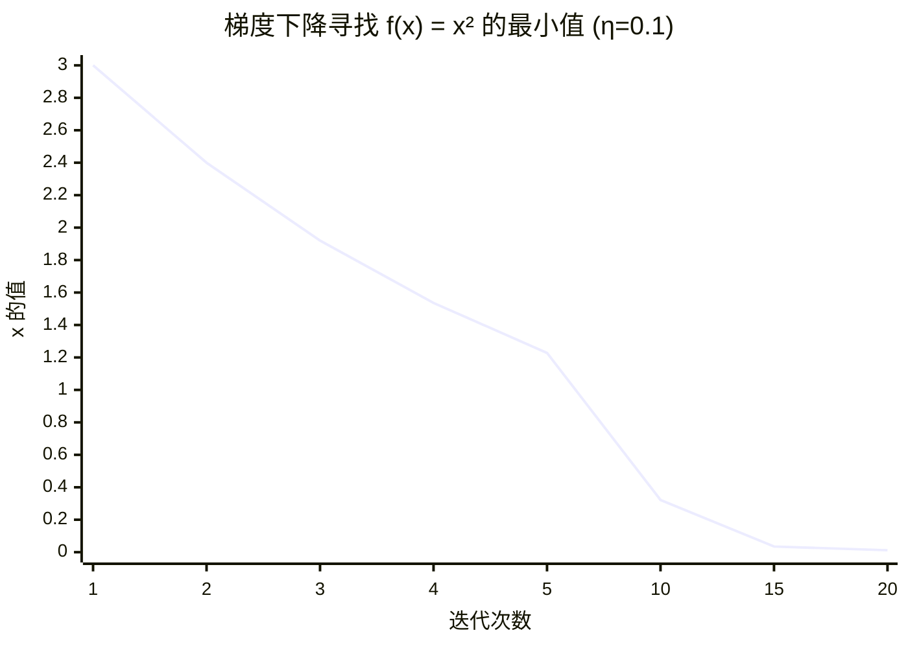
```mermaid
xychart-beta
    title "梯度下降寻找 f(x) = x² 的最小值 (η=0.1)"
    x-axis "迭代次数" [1, 2, 3, 4, 5, 10, 15, 20]
    y-axis "x 的值" 0 --> 3
    line [3, 2.4, 1.92, 1.536, 1.228, 0.322, 0.035, 0.012]
```

可以看到，$x$ 的值随着迭代次数的增加，逐渐逼近理论最小值 $0$。

---

### 三、临界点 (Critical Points) - 山谷、山顶和马鞍点

*   **定义**：梯度为零的点，即 $\nabla_\theta J(\theta) = 0$。在这里，“指南针”失灵了，没有明确的下降方向。

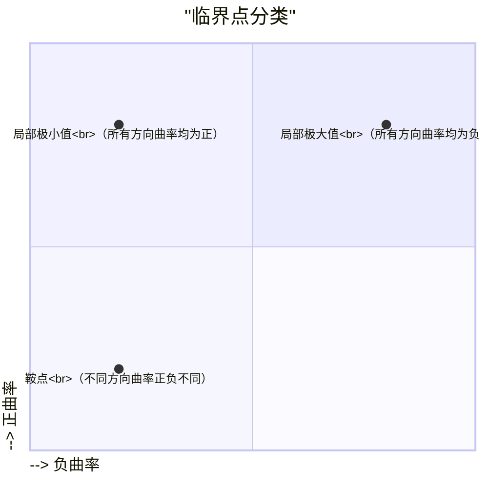
```mermaid
quadrantChart
    title "临界点分类"
    x-axis " --> 负曲率"
    y-axis " --> 正曲率"
    "局部极小值<br>（所有方向曲率均为正）": [0.2, 0.8]
    "局部极大值<br>（所有方向曲率均为负）": [0.8, 0.8]
    "鞍点<br>（不同方向曲率正负不同）": [0.2, 0.2]
```

*   **种类**：
    1.  **局部最小值 (Local Minimum)**：
        *   **特点**：该点比所有邻近点都低。
        *   **比喻**：一个**小山谷**的底部。虽然可能不是整片山区的最低点（全局最小），但你已经很难直接出去了。
        *   **在深度学习中的意义**：很多时候，找到一个表现良好的局部最小值就已经足够，我们不一定非要找到全局最小。
    2.  **局部最大值 (Local Maximum)**：
        *   **特点**：该点比所有邻近点都高。
        *   **比喻**：一个**小山顶**。
        *   **在深度学习中的意义**：在最小化损失函数时，这是我们想避免的。
    3.  **鞍点 (Saddle Point)**：
        *   **特点**：在某些方向上是极小值，在另一些方向上是极大值。
        *   **比喻**：**马鞍**的中心。沿着马头到马尾的方向，你是坐在最低点；沿着身体两侧的方向，你是坐在最高点。
        *   **在深度学习中的意义**：在高维空间中非常常见。梯度为零，但并不是极值点。传统的梯度下降会在鞍点附近停滞很久，需要更高级的优化器（如带动量的）才能逃离。

*   **例子**：函数 $f(x, y) = x^2 - y^2$。在点 $(0, 0)$ 处：
    *   沿 $x$ 轴方向（$y=0$），$f(x,0)=x^2$，是碗形，$(0,0)$ 是极小值。
    *   沿 $y$ 轴方向（$x=0$），$f(0,y)=-y^2$，是倒碗形，$(0,0)$ 是极大值。
    *   因此，$(0,0)$ 是**鞍点**。

---

### 四、多元函数的梯度下降 - 在复杂地形下山

*   **核心**：对于多元函数 $J(\theta_1, \theta_2, ..., \theta_n)$，梯度 $\nabla_\theta J$ 是一个向量：
    $$\nabla_\theta J = \begin{pmatrix} \frac{\partial J}{\partial \theta_1} \\ \frac{\partial J}{\partial \theta_2} \\ \vdots \\ \frac{\partial J}{\partial \theta_n} \end{pmatrix}$$
    更新规则完全相同：$\theta_{\text{new}} = \theta_{\text{old}} - \eta \nabla_\theta J(\theta_{\text{old}})$

*   **例子**：最小化函数 $J(w, b) = (w - 3)^2 + (b - 2)^2$。显然最小值在 $(w, b) = (3, 2)$ 处。
    *   计算梯度：
        $\frac{\partial J}{\partial w} = 2(w - 3)$
        $\frac{\partial J}{\partial b} = 2(b - 2)$
        所以 $\nabla J = \begin{pmatrix} 2(w-3) \\ 2(b-2) \end{pmatrix}$
    *   设初始点 $(w_0, b_0) = (1, 1)$，学习率 $\eta = 0.1$。
    *   **第一次迭代**：
        $\nabla J_{(1,1)} = \begin{pmatrix} 2(1-3) \\ 2(1-2) \end{pmatrix} = \begin{pmatrix} -4 \\ -2 \end{pmatrix}$
        $\begin{pmatrix} w_1 \\ b_1 \end{pmatrix} = \begin{pmatrix} 1 \\ 1 \end{pmatrix} - 0.1 \begin{pmatrix} -4 \\ -2 \end{pmatrix} = \begin{pmatrix} 1 + 0.4 \\ 1 + 0.2 \end{pmatrix} = \begin{pmatrix} 1.4 \\ 1.2 \end{pmatrix}$
    *   这个点 $(1.4, 1.2)$ 比 $(1,1)$ 更接近 $(3,2)$ 了。

---

### 五、微积分运算法则 - 计算梯度的工具包

要计算复杂函数的梯度，我们需要一些工具。最重要的是**链式法则**，它是**反向传播算法**的基石。

1.  **链式法则 (Chain Rule)**：
    *   **理论**：如果 $y = f(u)$ 和 $u = g(x)$，那么 $y$ 对 $x$ 的导数为 $\frac{dy}{dx} = \frac{dy}{du} \cdot \frac{du}{dx}$。
    *   **大白话**：如果一条路是分段走的，那么总的坡度变化等于每一段路坡度变化的**乘积**。
    *   **例子**：$y = \sin(2x)$。令 $u = 2x$, $y = \sin(u)$。
        则 $\frac{dy}{dx} = \frac{dy}{du} \cdot \frac{du}{dx} = \cos(u) \cdot 2 = 2\cos(2x)$。

2.  **乘法法则 (Product Rule)**：
    *   **理论**：$(f \cdot g)' = f' \cdot g + f \cdot g'$。
    *   **例子**：$y = x^2 \sin(x)$。
        $y' = (2x) \cdot \sin(x) + x^2 \cdot \cos(x)$。

3.  **除法法则 (Quotient Rule)**：
    *   **理论**：$\left( \frac{f}{g} \right)' = \frac{f'g - fg'}{g^2}$。
    *   **例子**：$y = \frac{x}{x^2+1}$。
        $y' = \frac{(1)(x^2+1) - (x)(2x)}{(x^2+1)^2} = \frac{1 - x^2}{(x^2+1)^2}$。

---

### 六、两步求导（以神经网络为例）

神经网络的损失函数 $L$ 极其复杂，是嵌套了无数层的复合函数。求梯度 $\frac{\partial L}{\partial w}$ 的过程，就是反复应用**链式法则**，从输出层反向一步步推算到输入层，故名**反向传播**。

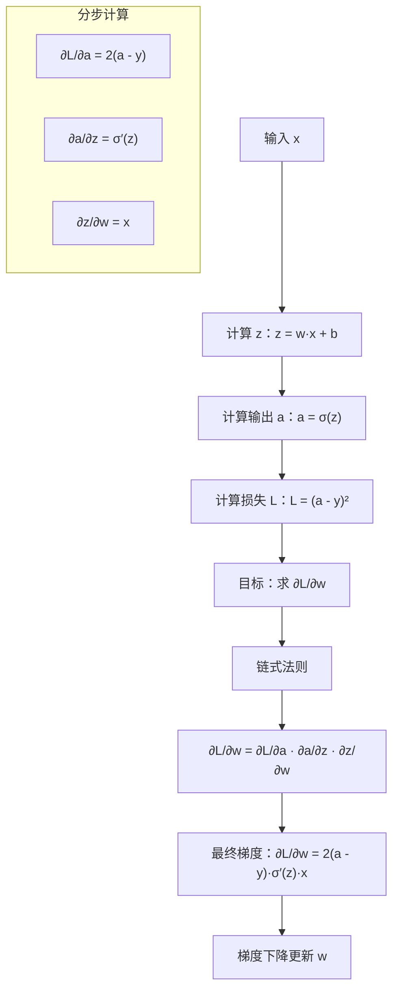
```mermaid
flowchart TD
    A["输入 x"] --> B["计算 z：z = w·x + b"]
    B --> C["计算输出 a：a = σ(z)"]
    C --> D["计算损失 L：L = (a - y)²"]
    D --> E["目标：求 ∂L/∂w"]

    E --> F["链式法则"]
    F --> G["∂L/∂w = ∂L/∂a · ∂a/∂z · ∂z/∂w"]

    subgraph 分步计算
        I["∂L/∂a = 2(a - y)"]
        J["∂a/∂z = σ′(z)"]
        K["∂z/∂w = x"]
    end

    G --> L["最终梯度：∂L/∂w = 2(a - y)·σ′(z)·x"]
    L --> M["梯度下降更新 w"]
```

*   **过程解读**：
    1.  **前向传播**：沿着 `x -> z -> a -> L` 计算预测值和损失。
    2.  **反向传播**：
        *   先计算损失 $L$ 对最终输出 $a$ 的梯度 $\frac{\partial L}{\partial a}$。
        *   然后这个梯度被**反向传递**，乘以 $a$ 对它的输入 $z$ 的梯度 $\frac{\partial a}{\partial z}$，得到 $\frac{\partial L}{\partial z}$。
        *   这个梯度继续反向传递，乘以 $z$ 对参数 $w$ 的梯度 $\frac{\partial z}{\partial w}$，最终得到我们需要的 $\frac{\partial L}{\partial w}$。
    3.  **参数更新**：利用计算出的梯度 $g = \frac{\partial L}{\partial w}$ 来更新参数：$w = w - \eta g$。

这个过程对于网络中的每一个参数（每一层的 $w$ 和 $b$）都会进行一遍，高效地计算出所有梯度。

### ✅ 总结

| 概念        | 数学本质                                         | 核心比喻       | 在深度学习中的作用                |
| :-------- | :------------------------------------------- | :--------- | :----------------------- |
| **梯度**    | $\nabla_\theta J$                            | **指南针**    | 指示参数更新的最快下降方向            |
| **学习率**   | $\eta$                                       | **步幅**     | 控制每次参数更新的步长大小            |
| **梯度下降**  | $\theta = \theta - \eta \nabla J$            | **蒙眼下山**   | 核心优化算法，迭代寻找最小值           |
| **局部最小值** | $\nabla J=0$,  Hessian正定                     | **小山谷**    | 优化的目标，模型的一个可能解           |
| **鞍点**    | $\nabla J=0$, Hessian不定                      | **马鞍**     | 高维空间中的常见陷阱，会使优化变慢        |
| **链式法则**  | $\frac{dy}{dx} = \frac{dy}{du}\frac{du}{dx}$ | **分段路的坡度** | **反向传播算法的理论基础**，用于高效计算梯度 |

---

# 🤖 机器学习基础：构建智能系统的蓝图

Tom Mitchell 的这段定义是理解机器学习的基石：

> “对于一个计算机程序，给它一些**任务T** 和**性能度量P**，如果通过**经验E**，它在T上的性能（由P评定）得到了提高，那么我们就说这个程序从E中学习了。”

这就像一个学做饭的徒弟：
*   **任务T**：炒出鱼香肉丝。
*   **性能度量P**：师傅打分的平均分（1-10分）。
*   **经验E**：徒弟一遍遍地练习炒菜（处理食材、调味、掌控火候）。
*   **学习**：如果徒弟的得分随着练习次数的增加而提高，那么他就在“学习”。

---

### 一、任务 (The Task, T) - “机器要做什么？”

任务T 是机器学习系统需要解决的具体问题。它通常被定义为机器学习系统如何处理**样本 (example)**。一个样本是对象或事件的**特征 (feature)** 的集合。

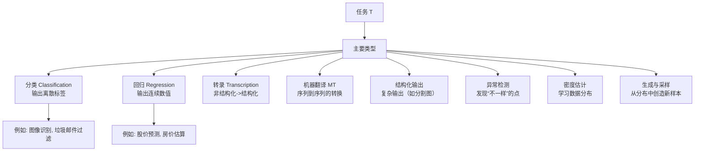
```mermaid
flowchart TD
A[任务 T] --> B[主要类型]
B --> C[分类 Classification<br>输出离散标签]
B --> D[回归 Regression<br>输出连续数值]
B --> E[转录 Transcription<br>非结构化->结构化]
B --> F[机器翻译 MT<br>序列到序列的转换]
B --> G[结构化输出<br>复杂输出（如分割图）]
B --> H[异常检测<br>发现“不一样”的点]
B --> I[密度估计<br>学习数据分布]
B --> J[生成与采样<br>从分布中创造新样本]

C --> K[例如: 图像识别, 垃圾邮件过滤]
D --> L[例如: 股价预测, 房价估算]
```

*   **分类例子**：识别手写数字（MNIST数据集）。任务T：$f: \text{（28x28像素图像）} \to \{0, 1, 2, ..., 9\}$。
*   **回归例子**：预测房价。任务T：$f: \text{（面积, 位置, 卧室数量...）} \to \mathbb{R}^+$（房价）。

---

### 二、性能度量 (The Performance Metric, P) - “怎么算做得好？”

P 是定量评估算法性能的方法。**P 总是针对特定的 T 而定义的。**

| 任务类型 (T) | 性能度量 (P)                       | 例子与说明                                                                          |
| :------- | :----------------------------- | :----------------------------------------------------------------------------- |
| **分类**   | **准确率 (Accuracy)**             | $(正确预测数) / (总样本数)$。最直观的指标。                                                     |
|          | **错误率 (Error Rate)**           | $1 - Accuracy$。与准确率互补。                                                         |
|          | **精确率/召回率 (Precision/Recall)** | 用于**类别不平衡**问题（如癌症筛查）。精确率：预测为正例中真正正例的比例。召回率：真正正例中被预测出来的比例。                      |
| **回归**   | **均方误差 (MSE)**                 | $\frac{1}{m} \sum_{i=1}^m (\hat{y}^{(i)} - y^{(i)})^2$。衡量预测值与真实值之间的**平均平方差距**。 |
|          | **平均绝对误差 (MAE)**               | $\frac{1}{m} \sum_{i=1}^m \|\hat{y}^{(i)} - y^{(i)}\|$。对异常值不如MSE敏感。            |
| **生成任务** | **BLEU Score**                 | 机器翻译的常用指标，通过比较机器输出和人工翻译的**重合度**来打分。                                            |
|          | **人工评估**                       | 对于图像生成、诗歌创作等，有时需要人类来评判质量。                                                      |

**黄金法则**：性能度量 P 必须在**测试集 (test set)** 上进行评估。测试集是模型在训练过程中**绝对没有见过**的数据，用于模拟模型在真实世界中的表现。

---

### 三、经验 (The Experience, E) - “从哪里学习？”

根据经验 E 的类型，机器学习算法分为两大类：

```mermaid
flowchart TD
A[经验 E] --> B[数据类型]
B --> C[无监督学习<br>数据无标签]
B --> D[监督学习<br>数据有标签]

C --> E[目标: 发现数据内在<br>结构、模式或分布]
D --> F[目标: 学习从输入<br>到标签的映射]

E --> G[例如: 聚类, 降维, 密度估计]
F --> H[例如: 分类, 回归]
```

*   **无监督学习例子**：给定一堆新闻文章，算法自动将它们分成“体育”、“财经”、“科技”等簇（**聚类**）。给它的数据只有文章内容（特征），没有预先打好的标签。
*   **监督学习例子**：给定一堆图片和每张图片对应的标签（“猫”、“狗”），算法学习如何从像素点预测出标签。

---

### 四、示例：线性回归 (Linear Regression) - 一个完整的机器学习过程

让我们用一个最简单的模型——线性回归，来串起 T, P, E。

*   **任务T**：给定房屋特征（如面积 $x$），预测其价格 $y$。
*   **模型**：$\hat{y} = w x + b$。其中 $w$ (权重) 和 $b$ (偏置) 是我们要学习的**参数**。
*   **性能度量P (测试集上)**：均方误差 $MSE_{test} = \frac{1}{m} \sum_{i} (\hat{y}^{(i)} - y^{(i)})^2$
*   **经验E (训练集上)**：我们通过**最小化训练集上的MSE** 来学习参数。
    $MSE_{train} = \frac{1}{N} \sum_{i=1}^N (w x^{(i)} + b - y^{(i)})^2$
*   **求解**：对 $MSE_{train}$ 关于 $w$ 和 $b$ 求导并令导数为零，可以找到**解析解**（ closed-form solution）：
    $w = \frac{\sum (x^{(i)} - \bar{x})(y^{(i)} - \bar{y})}{\sum (x^{(i)} - \bar{x})^2}$, $b = \bar{y} - w\bar{x}$
    其中 $\bar{x}$ 和 $\bar{y}$ 是训练样本的均值。

```mermaid
flowchart LR
    A[输入: 房屋面积 x] --> B[模型: ŷ = wx + b]
    B --> C[输出: 预测价格 ŷ]
    D[真实价格 y] --> E[计算损失: L = ŷ - y²]
    C --> E
    E --> F[目标: 最小化所有训练样本的平均损失 MSE_train]
    F --> G[通过求导更新参数 w, b]
    G --> B
```

---

### 五、容量、过拟合和欠拟合 (Capacity, Overfitting, Underfitting)

这是机器学习的核心矛盾。

*   **容量 (Capacity)**：模型拟合各种函数的能力。容量低的模型可能无法学习到数据中的有效模式。
*   **欠拟合 (Underfitting)**：模型在**训练集**上的误差就很大。表现为“学得不好”，模型太简单，无法捕捉数据中的基本特征。
*   **过拟合 (Overfitting)**：模型在**训练集**上误差很小，但在**测试集**上误差很大。表现为“学得太好”，把训练数据中的噪声和特例都当成了普适规律，泛化能力差。

```mermaid
xychart-beta
    title "模型复杂度与误差的关系"
    x-axis "模型复杂度 (容量)" ["很低", "中等", "很高"]
    y-axis "误差" 0 --> 100
    line "训练误差" [90, 15, 5]
    line "测试误差 (泛化误差)" [85, 20, 50]
```
**最佳容量点**是测试误差最低的地方。我们的目标就是找到这个点。

---

### 六、示例：多项式回归 - 理解过拟合与欠拟合

假设真实数据由二次函数 $y = x^2$ 加上一些噪声生成。
我们尝试用不同次数的多项式来拟合：
1.  **0次 (常数)**：$\hat{y} = b$ -> **欠拟合**，模型太简单。
2.  **1次 (线性)**：$\hat{y} = w_1x + b$ -> 仍然**欠拟合**，无法拟合曲线。
3.  **2次**：$\hat{y} = w_1x + w_2x^2 + b$ -> **容量恰当**，能很好地拟合真实规律。
4.  **9次**：$\hat{y} = b + \sum_{i=1}^9 w_i x^i$ -> **严重过拟合**，模型变得非常复杂，穿过了所有训练数据点，但在数据点之间的波动极大，预测新数据会非常差。

---

### 七、正则化 (Regularization) - 控制模型的“野心”

正则化是我们对学习算法所做的任何修改，旨在**减少泛化误差**而非训练误差。其核心思想是：**在降低训练误差和保持模型简单性之间做一个权衡**，从而避免过拟合。

最常用的方法是 **L2 参数范数惩罚**（又称**权重衰减 - Weight Decay**）。它通过向损失函数中添加一个正则项 $\Omega(\theta)$ 来惩罚大的权重：
$J_{new}(\theta) = J_{original}(\theta) + \lambda \Omega(\theta) = MSE_{train} + \lambda (w_1^2 + w_2^2 + ...)$
其中
- $J$ 代表的是损失函数（Loss Function）
- $\lambda$ 是一个超参数，控制正则化的强度。
*   $\lambda = 0$：恢复原始损失函数，容易过拟合。
*   $\lambda$ 太大：模型会变得过于简单，导致欠拟合（所有权重都被压向0）。
*   $\lambda$ 适中：找到最佳平衡点，获得良好的泛化性能。

---

### 八、超参数 vs. 参数 (Hyperparameters vs. Parameters)

| 特征 | **参数 (Parameters)** | **超参数 (Hyperparameters)** |
| :--- | :--- | :--- |
| **定义** | 模型**从数据中学习**到的内部配置。 | 模型**外部**的配置，其值**无法从数据中学习**。 |
| **例子** | 权重 ($w$)、偏置 ($b$) | 学习率 ($\eta$)、正则化强度 ($\lambda$)、网络层数、隐藏单元数 |
| **如何设定** | 通过优化算法（如梯度下降）自动调整。 | 由研究者/工程师基于经验、实验（在验证集上）来手动设定。 |
| **比喻** | **厨师做菜时放的盐和油**，根据菜品情况随时调整。 | **菜谱上写的“小火慢炖10分钟”**，在做菜前就定好了。 |

---

### 九、验证集 (Validation Set) - 超参数的“模拟考场”

我们不能用测试集来调整超参数（否则就会“泄漏”测试集信息，导致性能评估不真实）。因此，我们需要从**训练集**中再分出一部分作为**验证集**。

```mermaid
flowchart LR
    A[全部数据集] --> B[训练集<br>用于学习参数]
    A --> C[验证集<br>用于选择和调整超参数]
    A --> D[测试集<br>仅用于最终评估<br>绝对不用于任何调整]

    B --> E[在不同的超参数组合下<br>在训练集上训练模型]
    E --> F[在验证集上评估性能]
    F --> G{性能是否最优?}
    G -->|否| E
    G -->|是| H[确定最终超参数]
    H --> I[使用最终的超参数和模型,<br>在完整的训练集上重新训练]
    I --> J[在测试集上做唯一一次的最终评估]
```

---

### 十、最大似然估计 (Maximum Likelihood Estimation - MLE) - 概率视角的优化

MLE 是机器学习中最常用的参数估计框架之一。它的核心思想是：**找到最能“解释”已观测到数据的模型参数**。

*   **定义**：对于一组独立同分布的数据 $X = \{x^{(1)}, x^{(2)}, ..., x^{(N)}\}$，最大似然估计是选择使**似然函数** $p_{model}(X; \theta)$ 最大的参数值 $\theta_{ML}$。
    $\theta_{ML} = \arg\max_{\theta} p_{model}(X; \theta) = \arg\max_{\theta} \prod_{i=1}^N p_{model}(x^{(i)}; \theta)$

*   **实际操作**：通常最大化其**对数似然**（因为乘积取对数后变求和，更易优化）：
    $\theta_{ML} = \arg\max_{\theta} \sum_{i=1}^N \log p_{model}(x^{(i)}; \theta)$

*   **与MSE的联系**：**最大化高斯分布假设下的对数似然，等价于最小化均方误差 (MSE)**。这为 MSE 提供了一个强大的概率论解释。

---

### 十一、条件对数似然 (Conditional Log-Likelihood) - 监督学习的MLE

对于监督学习（输入 $x$，输出 $y$），我们通常要估计条件分布 $P(y | x; \theta)$。对应的最大似然估计变为**最大化条件对数似然**：
$\theta_{ML} = \arg\max_{\theta} \sum_{i=1}^N \log P(y^{(i)} | x^{(i)}; \theta)$

*   **例子**：在分类任务中，$P(y | x; \theta)$ 通常是 Softmax 函数输出的类别概率。最大化条件对数似然就是**最小化交叉熵损失函数**。

---

### 十二、随机梯度下降 (Stochastic Gradient Descent - SGD) - 大规模学习的引擎

对于大规模数据集，计算整个训练集上的损失和梯度（这称为**批量梯度下降**）的计算代价极高且缓慢。**SGD** 是解决这一问题的关键。

*   **核心思想**：在每一次参数更新时，**只随机抽取一个小的 minibatch（小批量）样本来计算梯度的估计**，然后用这个估计来更新参数。
    $\theta_{\text{new}} = \theta_{\text{old}} - \eta \nabla_\theta J^{(batch)}(\theta_{\text{old}})$

*   **优势**：
    1.  **极大的速度提升**：一次更新只需要处理几十到几百个样本，而不是几百万个。
    2.  **引入噪声有助于逃离尖锐的极小值**，可能找到泛化能力更好的平坦极小值。

```mermaid
flowchart TD
A[初始化参数 θ] --> B[随机打乱训练数据]
B --> C[将数据划分为多个minibatches]
C --> D[遍历每一个minibatch]
D --> E[计算该minibatch上的<br>损失和梯度估计]
E --> F[更新参数: θ = θ - η∇J_batchθ]
F --> G{遍历完所有minibatches?}
G -->|否| D
G -->|是| H{达到停止条件?}
H -->|否| B
H -->|是| I[输出最终参数 θ]
```

一个**周期 (epoch)** 指的是算法遍历了整个训练集（所有minibatches）一次。

---

### ✅ 总结：机器学习的完整蓝图

```mermaid
flowchart TD
    A[定义任务 T] --> B[选择模型家族<br>决定模型容量]
    B --> C[定义损失函数 Jθ<br>和性能度量 P]
    C --> D[准备数据: 划分为<br>训练集/验证集/测试集]
    D --> E[在验证集上选择超参数 λ, η 等]
    E --> F[在训练集上使用优化算法<br>如SGD 最小化 Jθ, 学习参数 θ]
    F --> G[在测试集上评估最终模型性能]
    
    subgraph H [核心循环]
        E -- 超参数候选 --> F
        F -- 模型参数 --> G[在验证集上评估性能]
        G -- 性能反馈 --> E
    end

    G --> I[部署模型]
```
