## 开场总览：机器学习的两大基柱

回归与分类是机器学习的两大核心任务，前者预测连续值（如线性/多项式回归），后者预测离散类别。虽然线性回归可勉强用于二分类，但这并非最佳实践。高维输入既带来"维数灾难"也带来"维数祝福"，需要谨慎处理。

### 整体演进结构
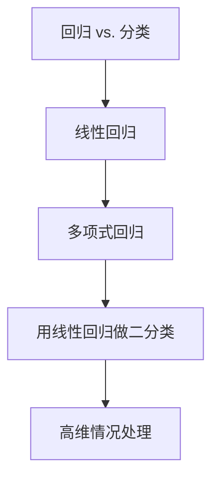

> **核心洞见**：从线性基础到非线性扩展，再桥接分类与高维挑战，构成了机器学习的基础框架。

---

## 一、回归 vs. 分类：本质差异

### 理论定义与解释
- **回归（Regression）**：预测连续数值输出，估计条件期望 $E[y|x]$（给定输入 $x$ 下输出 $y$ 的平均值）。例如预测房价、温度等具体数值。
- **分类（Classification）**：预测离散类别标签，估计条件概率 $p(y|x)$（给定 $x$ 下 $y$ 属于某类的概率）。例如判断垃圾邮件、图像识别等。

**本质差异**：回归关注"量"（连续值），分类关注"质"（类别）。在深度学习中，回归常用于预测任务（如股票价格），分类用于识别任务（如图像分类）。

### 公式视角
- **回归**：最小化均方误差（MSE）损失，公式为 $\frac{1}{N} \sum_{i=1}^N (y_i - \hat{y}_i)^2$，假设噪声服从高斯分布，等价于极大似然估计（MLE）。
- **分类（二分类）**：使用交叉熵损失 $-\sum [y \log p + (1-y) \log (1-p)]$，其中 $p = p(y=1|x)$，基于伯努利分布假设。多分类使用 softmax + 交叉熵。

### 实际例子
- **回归**：预测身高（输入年龄、体重，输出身高值如 175.5 cm）
- **分类**：判断肿瘤良恶性（输入肿瘤大小、形状，输出概率如 $p(y=1|x) = 0.8$，通过阈值 0.5 决定类别）

### 历史背景
- 回归源于 Gauss 的最小二乘（1801 年用于天体轨道）
- 分类的逻辑回归由 Cox 在 1958 年推广
- Fisher 在 1936 年用线性判别分析奠定分类基础

### 总结对比
| 内容 | 回归 | 分类（二分类） |
|------|------|----------------|
| 输出 | 连续值 | 0 或 1 |
| 分布假设 | 正态分布 | 伯努利分布 |
| 损失函数 | MSE | 交叉熵 |
| 模型输出 | $f(x) = w^T x + b$ | $P(t=1\|x) = \sigma(w^T x + b)$ |
| 深度学习输出层 | 线性激活 | Sigmoid/Softmax |

### 处理流程图
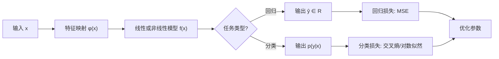

> **核心洞见**：回归关注连续期望，分类关注离散概率，这种根本差异决定了损失函数与模型选择的不同。

---

## 二、线性回归（Linear Regression）

### 核心原理
- **模型公式**： $y = w^T x + b + \epsilon$，其中 $w$ 是权重， $b$ 是偏置， $\epsilon$ 是噪声（假设 $\epsilon \sim \mathcal{N}(0,\sigma^2)$）。预测值为 $\hat{y} = w^T x + b$
- **假设**：线性关系、样本独立性、同方差性、无多重共线性

### 训练过程
- **损失函数**：最小化 MSE $\min_w \frac{1}{N} \sum_{i=1}^N (y_i - w^T x_i - b)^2$
- **求解方法**：
  - 闭式解（若 $X^\top X$ 可逆）： $w = (X^T X)^{-1} X^T y$
  - 梯度下降：迭代更新 $w \leftarrow w - \eta \frac{\partial \mathcal{L}}{\partial w}$（深度学习优化基础）

### 正则化变体
- 岭回归（L2）：加 $\lambda \|w\|_2^2$，防过拟合
- Lasso（L1）：加 $\lambda \|w\|_1$，促稀疏

### 实际例子
预测房价（输入面积、房间数，输出房价）

### 历史背景
- Legendre 在 1805 年首次发表最小二乘
- Gauss 声称 1795 年已发明，用于拟合小行星轨道

### 结构图

> **核心洞见**：线性回归是回归分析的起点，简单高效但假设严格，对非线性数据容易欠拟合。

---

## 三、多项式回归（Polynomial Regression）

### 核心思路
- **特征扩展**：将原始输入 $x$ 扩展为多项式基底 $\phi(x) = [1, x, x^2, \dots, x^M]$，然后应用线性回归 $\hat{y} = w^T \phi(x)$
- **特点**：对参数线性，对原输入非线性，可拟合曲线关系

### 详细过程
- **例子**：温度与冰淇淋销量（销量随温度先增后降，二次多项式可捕捉峰值）
- **风险**：阶数 $M$ 过大会过拟合
- **缓解策略**：交叉验证选 $M$、加 L2 正则（岭回归）

### 历史背景
- 多项式拟合源于 Lagrange 插值（18 世纪）
- 作为回归由 Gergonne 在 1815 年引入

### 特征扩展图

> **核心洞见**：多项式回归通过特征工程引入非线性，是通向更复杂模型的桥梁，但需要谨慎控制模型复杂度。

---

## 四、用"线性回归"做二分类：能用，但不优雅

### 方法
- 使用线性回归输出 $\hat{y} = w^T x$，通过阈值（如 0.5）判断类别
- 或加 Sigmoid 函数 $p = \sigma(w^T x)$ 输出概率，但仍使用 MSE 损失

### 问题分析
1. 输出不受限（可能小于 0 或大于 1），缺乏概率解释
2. MSE 损失非凸（加 Sigmoid 后），优化困难，易陷局部最优
3. 对离群点敏感，分类边界学习低效

### 何时可用？
数据线性可分且噪声较小时，可作为简单基线

### 更好替代：Logistic 回归
- 模型： $p(y=1|x) = \sigma(w^T x + b)$
- 损失：交叉熵（凸优化，易全局最优）
- 深度学习连接：相当于神经网络输出层使用 Sigmoid 激活

### 历史背景
- 早期分类用线性回归阈值
- 1958 年 Cox 引入 Logistic 回归取代
- Perceptron（1957 年 Rosenblatt）是线性分类的先驱

### 技术演进流程图
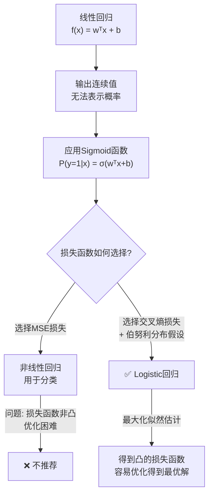

> ✅ **最佳实践**：对于二分类问题，应使用 **Logistic回归（Sigmoid + 交叉熵损失）**，而不是线性回归加阈值或非线性回归（Sigmoid + MSE损失）。

---

## 五、高维输入情况（Curse vs. Bless）

### 维度灾难（Curse of Dimensionality）
- **定义**：特征维数 $d$ 增大时，数据变稀疏，距离度量失效，需指数级样本
- **影响**：过拟合风险高、计算代价大（如图像像素维度高）
- **例子**：文本分类中词袋特征数万维

### 维度祝福（Blessing of Dimensionality）
- **定义**：高维空间线性可分性增加（如 SVM 核技巧）
- **例子**：深度学习通过嵌入将低维投射到高维，捕捉复杂模式

### 应对策略
- 降维：PCA、t-SNE、特征选择
- 正则化：L1（稀疏性）、L2（权重衰减）、Elastic Net
- 增加样本量、数据增强
- 深度学习：卷积/注意力机制自动提取特征

### 历史背景
- "维数灾难"由 Bellman 1961 年命名
- "祝福"源于 Donoho 2000 年高维统计
- Vapnik 的 SVM（1995）巧用高维线性可分

### 高维处理管线

### 一般准则
样本数 $n$ 与特征维数 $d$ 比例越小时，越需要强正则或先验结构。

> **核心洞见**：高维是一把双刃剑，既是挑战也是机遇，需要合适的工具和策略来平衡。

---
## 广义线性模型（GLM）统一框架详解

## GLM 作为统一母体

**核心本质**：广义线性模型（GLM）提供了一个统一框架，通过**线性预测**、**链接函数**和**概率分布**三大组件，将回归、分类、计数等任务纳入同一体系。其基本流程是：输入通过特征映射后线性打分，再经链接函数转换为有意义的输出（概率或期望），最后配合适当的概率分布定义损失函数（通常为负对数似然）。

**通用流程图**：

**日常比喻**（"打分器 + 安全旋钮 + 发电厂"）：
- **打分器**：线性预测子 η 生成任意实数分数
- **安全旋钮**：链接函数逆变换 g⁻¹ 将分数压缩至合法区间（如概率 [0,1]）
- **发电厂**：不同的概率分布（高斯/伯努利/泊松）产生不同的输出类型

---

## 六、输入—输出映射与链接函数（GLM 视角）

### 核心框架
GLM 通过三个核心组件建立输入到输出的映射：
1. **特征映射**：使用 $\phi(x)$ 将原始输入转换为特征表示（可线性或非线性）
2. **线性预测子**：$\eta = w^\top \phi(x)$，作为"打分器"
3. **链接函数**：$g(\mu)=\eta$，其中 $\mu=\mathbb{E}[y|x]$，等价地 $\mu=g^{-1}(\eta)$

### 常见任务的实现方式
| 任务类型    | 分布假设  | 链接函数 g(μ)                         | 逆变换 μ = g⁻¹(η)                             | 输出解释  |
| ------- | ----- | --------------------------------- | ------------------------------------------ | ----- |
| **回归**  | 高斯分布  | 恒等链接：g(μ) = μ                     | $\hat{y} = \eta$                           | 连续值预测 |
| **二分类** | 伯努利分布 | Logit 链接：$g(p)=\log\frac{p}{1-p}$ | $p=\sigma(\eta)=\frac{1}{1+e^{-\eta}}$     | 类别概率  |
| **多分类** | 范畴分布  | Softmax 链接                        | $p_k=\frac{e^{\eta_k}}{\sum_j e^{\eta_j}}$ | 各类别概率 |
| **计数**  | 泊松分布  | Log 链接：g(λ) = log(λ)              | $\lambda=\exp(\eta)$                       | 事件发生率 |

### 理论基础与历史背景
- **指数族与规范链接**：GLM 假设响应变量来自指数族分布，使用规范链接函数可使自然参数等于线性预测子 η，使梯度计算简洁优雅
- **历史发展**：
  - GLM 由 John Nelder 与 Robert Wedderburn 于 1972 年系统化提出
  - Logistic 曲线可追溯到 Pierre François Verhulst 的人口增长模型（1838）
  - 泊松分布由 Siméon Denis Poisson 在 19 世纪提出并应用于概率论

**核心洞见**：GLM = 特征映射 + 线性打分 + 链接函数 + 概率分布；改变链接函数和分布假设即可适应不同任务类型。

---

## 七、用"非线性回归"做二分类（两条路径）

### 路径 A：概率路线（推荐）
- **目标**：直接建模条件概率 $p(y=1|x)$
- **模型**：$p(x)=\sigma(w^\top \phi(x)) = \frac{1}{1+e^{-\eta}}$
- **损失函数**：伯努利负对数似然（等价于二元交叉熵）
  $$\mathcal{L}_{\text{BCE}}=-\frac{1}{N}\sum_i\big[y_i\log p_i+(1-y_i)\log(1-p_i)\big]$$
- **梯度特性**：$\frac{\partial \mathcal{L}}{\partial \eta_i}=p_i-y_i$（简洁高效）
- **决策机制**：$p \geq \tau$ 判为 1（阈值 τ 可调，优化 F1/召回率/AUC）
- **优点**：概率校准良好；理论基础牢固；处理类别不平衡能力强

### 路径 B：回归路线（次选）
- **目标**：将分类视为回归问题，$\hat{y}=f(x) \approx y\in\{0,1\}$
- **损失函数**：MSE 或 Huber 损失
- **局限性**：
  - MSE 隐含高斯噪声假设，与伯努利分布本质不匹配
  - 概率输出通常未校准，对阈值敏感
  - 对类别不平衡问题处理不佳

### 非线性来源的两种方式
1. **特征空间非线性**：通过特征映射 $\phi(x)$ 引入非线性（多项式特征、RBF核等）
2. **模型本体非线性**：使用神经网络、决策树等非线性模型直接学习决策边界

**实践建议**：优先选择概率路线（Sigmoid + 交叉熵），因其提供校准概率和更稳定的训练特性。

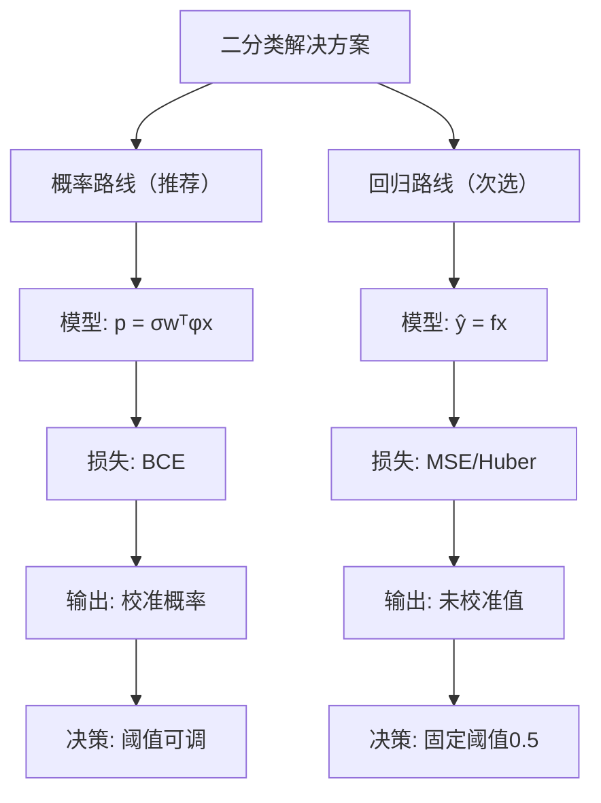

---

## 八、训练非线性回归/分类模型

### 损失函数与分布假设的匹配
| 任务类型     | 分布假设      | 损失函数  | 公式                                                                                 |
| -------- | --------- | ----- | ---------------------------------------------------------------------------------- |
| **回归**   | 高斯分布      | MSE   | $\mathcal{L}=\frac{1}{N}\sum_i(\hat{y}_i-y_i)^2$                                   |
| **二分类**  | 伯努利分布     | 二元交叉熵 | $\mathcal{L}=-\frac{1}{N}\sum_i\big[y_i\log p_i+(1-y_i)\log(1-p_i)\big]$           |
| **多分类**  | 范畴分布      | 交叉熵   | $\mathcal{L}=-\frac{1}{N}\sum_i\log\frac{e^{\eta_{i,y_i}}}{\sum_k e^{\eta_{i,k}}}$ |
| **鲁棒回归** | Laplace分布 | MAE   | $\mathcal{L}=\frac{1}{N}\sum_i\hat{y}_i-y_i$                                       |

### 正则化技术与先验对应
- **L2 正则化**（权重衰减）：$\lambda\|w\|_2^2$ ↔ 高斯先验 $w\sim\mathcal{N}(0,\tau^2 I)$
- **L1 正则化**：$\lambda\|w\|_1$ ↔ Laplace 先验
- **早停**（Early Stopping）：通过验证集监控防止过拟合
- **Dropout**：神经网络特有的正则化技术
- **数据增强**：通过扩展训练数据提高泛化能力

### 优化策略与实践
- **优化器选择**：SGD（带动量）、Adam、AdamW 等自适应学习率算法
- **学习率调度**：热身（Warmup）、余弦退火、阶梯下降等策略
- **数值稳定技巧**：使用 `with logits` 版本的损失函数，避免数值溢出

### 数据工程与模型评估
- **数据预处理**：输入标准化、缺失值处理、特征编码
- **数据集划分**：训练集/验证集/测试集分离，监控过拟合
- **类别不平衡处理**：
  - 重采样（过采样少数类、欠采样多数类）
  - 损失函数加权（类别权重）
  - Focal loss（降低易分类样本的贡献）
  - 决策阈值调整
- **概率校准**：Platt scaling、等距回归（isotonic regression）
- **评估指标**：
  - 回归：RMSE、MAE、R²
  - 二分类：ROC-AUC、PR-AUC、F1-score、KS统计量
  - 多分类：宏/微平均 F1、准确率

**训练流程示意图**：

> **核心洞见**：成功的模型训练需要四个要素的协调配合：**模型结构**、**损失函数**（匹配分布假设）、**正则化策略**和**优化算法**。

---

## 九、正态分布假设（回归的概率基础）

### 数学模型与推导
回归任务中，GLM 假设响应变量服从正态分布：
$$y_i = \mu_i + \epsilon_i,\quad \epsilon_i \sim \mathcal{N}(0, \sigma^2)$$
其中 $\mu_i = w^\top \phi(x_i)$ 为线性预测，$\epsilon_i$ 为独立同分布的高斯噪声。

**似然函数与最大似然估计**：
- 单样本似然：$p(y_i|x_i) = \frac{1}{\sqrt{2\pi}\sigma}\exp\Big(-\frac{(y_i-\mu_i)^2}{2\sigma^2}\Big)$
- 数据集负对数似然：
  $$-\log p(\mathcal{D}|w) = \text{常数} + \frac{1}{2\sigma^2}\sum_i (y_i-\mu_i)^2$$
  最大化似然等价于最小化 MSE 损失

### 扩展与变体
- **异方差回归**：$\epsilon_i \sim \mathcal{N}(0, \sigma_i^2)$，采用加权最小二乘
- **鲁棒回归**：
  - Laplace 假设 → MAE 损失（对异常值更鲁棒）
  - Huber 损失：小误差时类似 MSE，大误差时类似 MAE
- **贝叶斯视角**：权重高斯先验 $w \sim \mathcal{N}(0, \tau^2 I)$ 等价于 L2 正则化

### 模型诊断与实践建议
- **残差分析**：绘制残差图、QQ图检查正态性和同方差性
- **变换处理**：对于非对称或厚尾数据，考虑响应变量变换（如对数变换）
- **正则化选择**：L2 正则化（岭回归）与高斯先验对应

**历史背景**：最小二乘法由 Legendre（1805）和 Gauss（1809）分别独立提出，Gauss 将其用于行星轨道计算，并推导出正态分布（又称高斯分布）。

> **核心洞见**：回归中使用 MSE 损失不是任意选择，而是基于正态分布假设的最大似然估计的自然结果。

---

## 十、伯努利分布假设（二分类的概率基础）

### 概率建模
对于二分类问题 $y \in \{0,1\}$，GLM 使用伯努利分布建立概率模型：
$$P(Y=y) = p^y (1-p)^{1-y}$$
其中条件概率 $p(x) = P(Y=1|x)$ 通过 logit 链接函数与线性预测子关联：
$$\eta = w^\top \phi(x),\quad p(x) = \sigma(\eta) = \frac{1}{1+e^{-\eta}}$$

### 最大似然估计
- **负对数似然**（二元交叉熵）：
  $$\mathcal{L} = -\sum_i \big[y_i \log p_i + (1-y_i) \log(1-p_i)\big]$$
- **梯度计算**：
  $$\frac{\partial \mathcal{L}}{\partial \eta_i} = p_i - y_i$$
  形式简洁，利于高效优化
- **决策边界**：$p = 0.5 \Leftrightarrow \eta = 0 \Leftrightarrow w^\top \phi(x) = 0$

### 解释与扩展
- **几率解释**：$\log\frac{p}{1-p} = w^\top \phi(x)$（对数几率线性）
- **贝叶斯视角**：Beta-Bernoulli 共轭先验便于贝叶斯推断
- **类别不平衡处理**：损失函数加权、Focal loss、阈值调整

**历史背景**：伯努利分布以 Jacob Bernoulli 命名；logit 函数由 Joseph Berkson 于 1944 年提出；logistic 曲线由 Verhulst 用于人口增长建模。

> **核心洞见**：二分类中的 Sigmoid 函数和交叉熵损失源于伯努利分布假设下的最大似然估计，而非经验选择。

---

## 加餐：多分类的 Softmax + 交叉熵

### 统一框架
多分类是二分类的自然扩展，使用范畴分布（Categorical distribution）建模：
$$P(Y=k) = p_k = \frac{e^{\eta_k}}{\sum_{j=1}^K e^{\eta_j}}$$
其中 $\eta_k = w_k^\top \phi(x)$ 为第 k 类的线性预测子。

### 损失函数与优化
- **负对数似然**（交叉熵损失）：
  $$\mathcal{L} = -\sum_i \log p_{i,y_i} = -\sum_i \left[\eta_{i,y_i} - \log\sum_j e^{\eta_{i,j}}\right]$$
- **梯度特性**：$\frac{\partial \mathcal{L}}{\partial \eta_{i,k}} = p_{i,k} - \mathbb{I}(y_i = k)$

### 直观解释
Softmax 函数将各类别的"得分"转换为概率分布，交叉熵损失鼓励模型为真实类别分配高概率，同时抑制其他类别的概率。

> **核心洞见**：Softmax + 交叉熵不是独立的组件，而是范畴分布假设下最大似然估计的统一框架。

---

## Logistic 回归
### 一、Logistic 回归：核心思想

### 要解决什么问题？
在二分类问题中，我们想要模型输出一个**概率值**，而不仅仅是一个0或1的硬判断。比如“这张图是猫的概率为90%”，这比单纯说“是猫”包含更多信息。

### 如何解决？
**Logistic 回归**不再使用线性函数直接预测结果，而是预测一个事件发生的**概率**。

### 核心组件：Sigmoid 函数
它将任何实数“压缩”到 (0, 1) 之间，完美契合概率的定义。
$$
\sigma(z) = \frac{1}{1 + e^{-z}}
$$

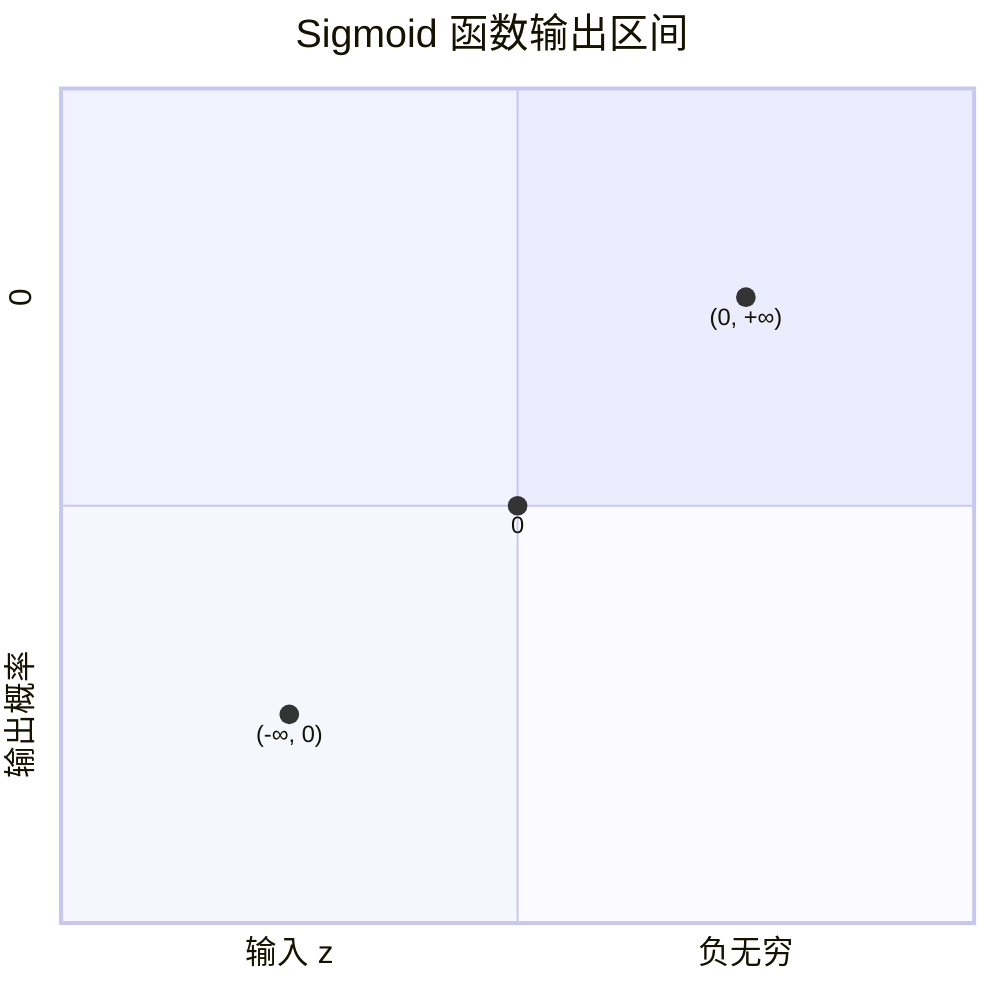

> 📌 **例子**：
> - $z = 0$：$\sigma(0) = 0.5$
> - $z = 5$：$\sigma(5) \approx 0.993$（概率很高）
> - $z = -5$：$\sigma(-5) \approx 0.007$（概率很低）

在Logistic回归中，$z = w^T x + b$，所以：
$$
P(t=1 | x) = \sigma(w^T x + b) = \frac{1}{1 + e^{-(w^T x + b)}}
$$

---

### 二、最大化条件数据似然（Maximum Conditional Likelihood）

### 大白话理解
我们手头有一堆数据（比如一堆猫和狗的图片和标签）。我们想要找到一组参数 ($w$, $b$)，使得我们模型**“猜中”这些已有标签的可能性最大**。

> 🎯 **好比是**：你有一个总爱猜硬币的朋友。你扔了10次硬币，结果是【正,正,反,...,反】。他现在要调整自己的“猜测策略”（模型参数），使得他猜对这个序列的可能性最高。调整策略的过程就是“最大化似然”。

### 数学建模
1.  **写出“猜中”所有标签的概率（似然函数）**：
    假设数据点之间独立，那么模型猜中所有标签的概率是每个点概率的乘积：
    $$
    L(w, b) = \prod_{n=1}^{N} P(t^{(n)} | x^{(n)})
    $$
    对于每个样本，其概率为：
    $$
    P(t^{(n)} | x^{(n)}) = 
    \begin{cases} 
    \sigma(w^T x^{(n)} + b), & \text{if } t^{(n)} = 1 \\ 
    1 - \sigma(w^T x^{(n)} + b), & \text{if } t^{(n)} = 0 
    \end{cases}
    $$

2.  **一个巧妙的写法**：
    可以将上述两种情况合并成一个简洁的公式：
    $$
    P(t^{(n)} | x^{(n)}) = [\sigma(w^T x^{(n)} + b)]^{t^{(n)}} \cdot [1 - \sigma(w^T x^{(n)} + b)]^{1 - t^{(n)}}
    $$
    - 当 $t^{(n)}=1$ 时，后半部分指数为0，结果为1，公式变为 $\sigma(...)$。
    - 当 $t^{(n)}=0$ 时，前半部分指数为0，结果为1，公式变为 $1 - \sigma(...)$。

    因此，总的似然函数为：
    $$
    L(w, b) = \prod_{n=1}^{N} [\sigma^{(n)}]^{t^{(n)}} [1 - \sigma^{(n)}]^{1 - t^{(n)}}
    $$
    （其中 $\sigma^{(n)} = \sigma(w^T x^{(n)} + b)$）

3.  **最大似然估计**：
    我们的目标就是找到使得 $L(w, b)$ 最大的参数 $w$ 和 $b$。

---

### 三、交叉熵误差函数（Cross-Entropy Error）

### 从似然到损失函数
乘积形式的似然函数 $L(w, b)$ 计算起来比较麻烦（容易下溢），而且我们通常的优化算法是**最小化损失**，而非最大化似然。

1.  **取对数（Log-Likelihood）**：
    乘积取对数会变成求和，简化计算，且对数函数是单调的，最大化对数似然等价于最大化似然。
    $$
    \ln L(w, b) = \sum_{n=1}^{N} \left[ t^{(n)} \ln \sigma^{(n)} + (1 - t^{(n)}) \ln (1 - \sigma^{(n)}) \right]
    $$

2.  **取负，变为可最小化的损失函数**：
    为了让“最大化似然”变为标准的“最小化损失”，我们对数似然取负。
    $$
    E(w, b) = -\ln L(w, b) = -\sum_{n=1}^{N} \left[ t^{(n)} \ln \sigma^{(n)} + (1 - t^{(n)}) \ln (1 - \sigma^{(n)}) \right]
    $$
    这个函数就是**交叉熵误差函数**。它是衡量两个概率分布（真实分布 `t` 和预测分布 `σ`）差异的经典指标。

### 直观理解交叉熵
- **预测完全正确**：如果真实标签 $t=1$，模型预测 $\sigma=1.0$，那么损失为 $-1 \cdot \ln(1) = 0$。
- **预测完全错误**：如果真实标签 $t=1$，模型预测 $\sigma=0.0$，那么损失为 $-1 \cdot \ln(0)$，趋向于无穷大！这意味着错误预测受到了“严厉的惩罚”。

> 📌 **例子**：
> 假设一个样本真实标签为 1 ($t=1$)。
> - 模型A预测 $P(t=1|x) = 0.9$：
>   $loss = -\ln(0.9) \approx 0.105$（损失很小）
> - 模型B预测 $P(t=1|x) = 0.1$：
>   $loss = -\ln(0.1) \approx 2.302$（损失很大）

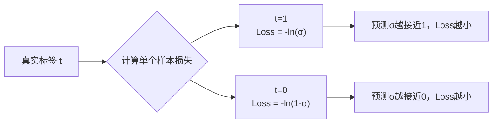

---

### 四、训练和测试

### 训练（Training）
1.  **定义总损失**：通常使用平均交叉熵损失。
    $$
    J(w, b) = \frac{1}{N} \sum_{n=1}^{N} \left[ -t^{(n)} \ln \sigma^{(n)} - (1 - t^{(n)}) \ln (1 - \sigma^{(n)}) \right]
    $$
    为了防止过拟合，可以加入L2正则化项：
    $$
    J_{\text{regularized}}(w, b) = J(w, b) + \frac{\lambda}{2} ||w||^2
    $$
    （注意：通常不对偏置 $b$ 做正则化）

2.  **计算梯度**：
    通过反向传播（Backpropagation）计算损失函数关于参数 $w$ 和 $b$ 的梯度。
    $$
    \frac{\partial J}{\partial w} = \frac{1}{N} \sum_{n=1}^{N} (\sigma^{(n)} - t^{(n)}) x^{(n)}
    $$
    $$
    \frac{\partial J}{\partial b} = \frac{1}{N} \sum_{n=1}^{N} (\sigma^{(n)} - t^{(n)})
    $$
    **这个结果非常简洁和优美！** 梯度正好是 **(预测值 - 真实值) × 输入**。

3.  **更新参数**（梯度下降）：
    $$
    w \leftarrow w - \alpha \frac{\partial J}{\partial w}
    $$
    $$
    b \leftarrow b - \alpha \frac{\partial J}{\partial b}
    $$
    其中 $\alpha$ 是学习率（Learning Rate）。

### 测试（Testing/Inference）
训练完成后，对于一个新的输入 $x_{\text{new}}$：
1.  计算其输出概率：
    $$
    P(t=1 | x_{\text{new}}) = \sigma(w^T x_{\text{new}} + b)
    $$
2.  根据概率进行分类决策：
    $$
    y_{\text{pred}} = 
    \begin{cases} 
    1, & \text{if } P(t=1 | x_{\text{new}}) \geq 0.5 \\ 
    0, & \text{otherwise} 
    \end{cases}
    $$

---

### 五、利用回归方法进行二分类：总结

我们可以把线性回归“改造”成二分类器，下图清晰地展示了这个技术演进路线：

> ✅ **最佳实践**：对于二分类问题，应使用 **Logistic回归（Sigmoid + 交叉熵损失）**，而不是使用线性回归或非线性回归（Sigmoid + MSE损失）。因为交叉熵损失对于Sigmoid函数能产生凸的优化问题，保证找到全局最优解，而MSE损失则不会。

---

## 一、向量的线性回归（Multi-output Linear Regression）

### 要解决什么问题？
之前的回归问题，输出都是一个**标量**（Scalar），比如房价。但现在输出可能是一个**向量**（Vector）。
例如：
- 预测一个人的身体健康指标（身高、体重、血压）
- 预测一辆车的多项性能数据（加速度、油耗、最高时速）

### 模型如何设计？
为输出的每一个维度都训练一个独立的线性回归模型。

### 数学表示
假设输出是 $K$ 维向量 $t = [t_1, t_2, ..., t_K]^T$，输入是 $m$ 维向量 $x$。
我们对每一个输出维度 $k$ 都定义一个线性模型：
$$
f_k(x) = w_k^T x + b_k \quad \text{for } k = 1, 2, ..., K
$$
其中，
- $w_k$ 是对应于第 $k$ 个输出的权重向量
- $b_k$ 是对应于第 $k$ 个输出的偏置项

### 损失函数：MSE
损失函数是每个输出维度上MSE的总和：
$$
E = \frac{1}{2N} \sum_{n=1}^N \sum_{k=1}^K \left( f_k(x^{(n)}) - t_k^{(n)} \right)^2
$$

> 📌 **例子**：
> 要预测一辆车的“加速度”和“油耗”（$K=2$）。
> - $f_1(x) = w_1^T x + b_1$ → 专门预测加速度
> - $f_2(x) = w_2^T x + b_2$ → 专门预测油耗

---

## 二、向量-矩阵形式（Vector-Matrix Form）

### 为什么要用矩阵形式？
为了更简洁的表示和更高效的计算。我们可以把 $K$ 组参数 $w_k$ 合并成一个矩阵 $W$。

### 定义参数矩阵
$$
W = \begin{bmatrix} - & w_1^T & - \\ - & w_2^T & - \\ & \vdots & \\ - & w_K^T & - \end{bmatrix} = \begin{bmatrix} w_{11} & \cdots & w_{1m} \\ \vdots & \ddots & \vdots \\ w_{K1} & \cdots & w_{Km} \end{bmatrix}, \quad b = \begin{bmatrix} b_1 \\ b_2 \\ \vdots \\ b_K \end{bmatrix}
$$

### 整合模型
整个模型的预测输出可以写成一个非常简洁的向量形式：
$$
f(x) = Wx + b
$$
这里，$f(x)$ 是一个 $K$ 维向量，其第 $k$ 个分量就是 $f_k(x) = w_k^T x + b_k$。

### 损失函数
$$
E = \frac{1}{2N} \sum_{n=1}^N || f(x^{(n)}) - t^{(n)} ||_2^2
$$
（向量二范数的平方，即所有维度误差平方的和）

---

## 三、类别标签的表示（Label Representation）

### 从回归到分类
现在我们进入核心：**如何用回归方法解决多分类问题？**
首先需要解决如何用数学表示一个类别标签。

### 两种表示方法
假设有一个5分类问题（类别：猫、狗、鸟、车、船）。

| 表示方法 | 例子（标签“猫”） | 优点 | 缺点 |
| :--- | :--- | :--- | :--- |
| **标量表示** | `t = 1` | 简单，存储空间小 | 隐含了类别间的**顺序关系**（1<2<3?），但分类问题中类别是无序的 |
| **One-Hot 编码** | `t = [1, 0, 0, 0, 0]^T` | 明确表示类别，无顺序关系 | 存储空间大，是稀疏向量 |

> ✅ **机器学习中几乎总是使用 One-Hot 编码**。
> - **性质1**：向量中每个元素 $t_k \in \{0, 1\}$
> - **性质2**：所有元素之和为 1 ($\sum_{k=1}^K t_k = 1$)

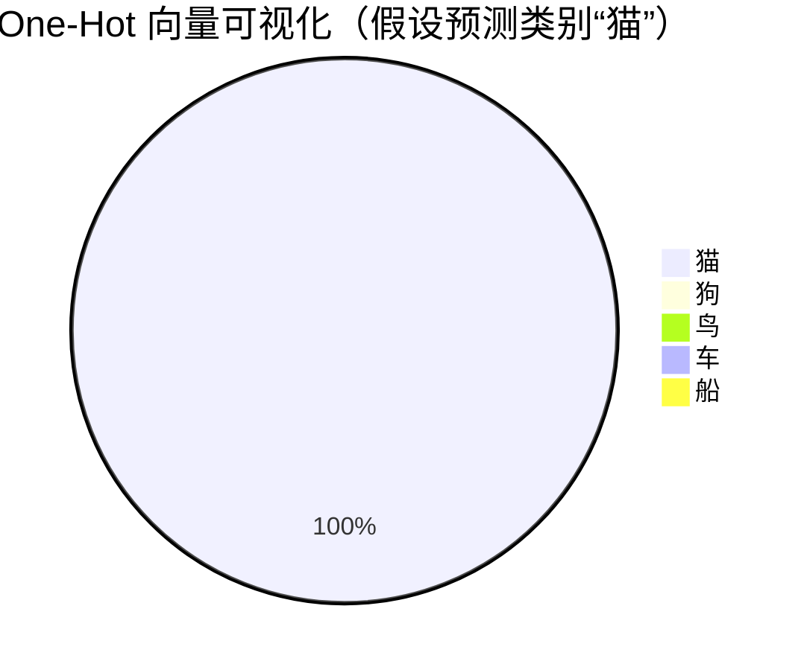

---

## 四、利用回归进行多标签分类

### 核心思想
既然标签 $t$ 可以被表示成一个向量（如 One-Hot），那么我们就可以用**向量的线性回归**模型 $f(x) = Wx + b$ 来直接预测这个标签向量！

### 流程
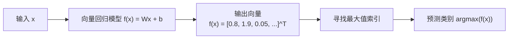

### 存在的问题
模型 $f(x) = Wx + b$ 的输出是一个**任意实数值**的向量。
- 无法保证所有输出值的和為1。
- 输出值可能是负数，无法直接解释为概率。

> ❗ **结论**：直接使用线性回归进行多分类，输出值**没有概率意义**，只是为我们提供了一个决策依据（取最大值索引 argmax）。我们需要对其进行改造，使其输出具有概率分布的特性。

---

## 五、正态分布假设（用于分类？）

### 回顾回归中的假设
在回归问题中，我们假设目标值 $t$ 给定 $x$ 后，服从一个**正态分布**，其均值就是模型的预测值 $f(x)$：
$$
p(t | x) = \mathcal{N}(t; f(x), \sigma^2I)
$$
最大化这个条件似然等价于最小化 MSE 损失。

### 将其用于分类问题
如果我们强行把分类问题的 One-Hot 标签 $t$ 当作一个连续向量，同样假设：
$$
p(t | x) = \mathcal{N}(t; f(x), I)
$$
那么最大化似然仍然等价于最小化 MSE：$\min \sum ||f(x) - t||^2$。

### 为什么不合适？
1.  **分布不匹配**：One-Hot 向量是**离散的、稀疏的**，而正态分布描述的是**连续的、密集的**数据。这个假设非常别扭。
2.  **概率解释缺失**：模型的输出 $f(x)$ 没有任何约束，不能解释为概率。

> ✅ **我们需要一个更合适的概率分布假设来描述分类标签**。

---

## 六、分类的Multinoulli分布假设

### 正确的分布选择
对于多分类问题，标签 $t$ 服从**范畴分布（Categorical Distribution）**，也称为 **Multinoulli 分布**。它是伯努利分布在多个类别上的推广。

- **伯努利分布**：描述**二分类**问题（如抛一次硬币）。
- **Multinoulli 分布**：描述**多分类**问题（如掷一次骰子）。

### 概率表示
用一个概率向量 $p = [p_1, p_2, ..., p_K]^T$ 来表示每个类别发生的概率，其中：
- $p_k \in [0, 1]$
- $\sum_{k=1}^K p_k = 1$

对于 One-Hot 编码的标签 $t = [t_1, t_2, ..., t_K]^T$，其概率质量函数为：
$$
P(t | p) = \prod_{k=1}^K p_k^{t_k}
$$

> 📌 **例子**：一个3分类问题，真实类别是第2类。
> - One-Hot 标签：$t = [0, 1, 0]^T$
> - 模型预测的概率分布：$p = [0.1, 0.7, 0.2]^T$
> - 该样本的似然为：$P(t|p) = (0.1)^0 * (0.7)^1 * (0.2)^0 = 0.7$

---

### 一、Softmax 函数：从任意值到概率分布

#### 1. 它要解决什么问题？
在多分类问题中，模型的原始输出（通常称为 **logits**）是一组任意的实数值。这些值：
- 可能很大，也可能很小，甚至有正有负。
- 它们的和不为1，因此无法直接解释为概率。

**我们需要一个“转换器”，把这些任意值变成一个合法的概率分布。** 这个转换器就是 Softmax 函数。

#### 2. 数学定义
对于一个包含 $K$ 个类的分类问题，给定模型的原始输出向量 $z = [z_1, z_2, ..., z_K]^T$，Softmax 函数的计算公式为：

$$
\sigma(z_i) = \frac{e^{z_i}}{\sum_{j=1}^{K} e^{z_j}} \quad \text{for } i = 1, 2, ..., K
$$

#### 3. 核心特性与直观理解
Softmax 函数有两大核心特性，使其成为完美的概率转换器：

1.  **输出范围在 (0, 1) 之间**：因为指数函数 $e^{z_i} > 0$，分母是所有分子的和，所以每个输出 $\sigma(z_i)$ 都是一个正数，且小于1。
2.  **所有输出之和为 1**：$\sum_{i=1}^{K} \sigma(z_i) = 1$。这完美满足了概率公理。

**它的工作原理是“赢者通吃”**：它会**放大**最大值与其余值的差距。假设 $z_i$ 是 $z$ 中最大的值，那么 $e^{z_i}$ 会远大于其他的 $e^{z_j}$，从而使得 $\sigma(z_i)$ 的值非常接近 1，而其他的 $\sigma(z_j)$ 则接近 0。

> 📌 **例子**：
> 假设一个三分类模型的原始输出为 $z = [2.0, 1.0, 0.1]^T$。
> - 计算：$e^2 \approx 7.4, \quad e^1 \approx 2.7, \quad e^{0.1} \approx 1.1$
> - 分母：$7.4 + 2.7 + 1.1 = 11.2$
> - Softmax 输出：$\sigma(z) = [7.4/11.2, 2.7/11.2, 1.1/11.2] \approx [0.66, 0.24, 0.10]$
>
> 可以看到，最大的值 2.0 被赋予了最高的概率（0.66），并且所有输出之和为 1，成为一个完美的概率分布。

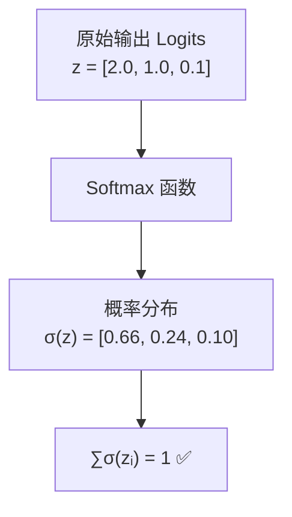

---

### 二、最大条件似然：衡量模型“猜得有多准”

#### 1. 大白话理解
**似然（Likelihood）** 就是“可能性”。**最大条件似然估计** 的核心思想是：
> 我们已经看到了一堆事实（训练数据），我们要找到一组模型参数，使得模型**“最有可能”产生出我们现在看到的这堆数据**。

换句话说，就是找到最能让模型对训练数据“自圆其说”的参数。

#### 2. 数学建模
- **假设**：对于样本 $x$，其标签 $t$ 服从以 $h(x)$ 为参数的 Multinoulli 分布。$h(x)$ 就是 Softmax 函数的输出，即模型预测的概率分布。
- **单个样本的似然**：模型“猜中”一个真实标签 $t$ 的概率是：
  $P(t | x) = \prod_{k=1}^{K} (h_k(x))^{t_k}$
  （因为标签 $t$ 是 one-hot 向量，只有真实类别 $k$ 的位置 $t_k=1$，其他为0，所以这个连乘的结果其实就是 $h_k(x)$，即模型预测的真实类别的概率）。

- **整个数据集的似然**：假设样本间独立，模型猜中所有标签的概率是每个样本概率的乘积：
  $$
  L(W, b) = \prod_{n=1}^{N} P(t^{(n)} | x^{(n)}) = \prod_{n=1}^{N} \prod_{k=1}^{K} (h_k(x^{(n)}))^{t_k^{(n)}}
  $$

我们的目标就是**最大化这个似然函数 $L(W, b)$**。

> 📌 **例子**：
> 一个样本的真实标签是第2类，$t = [0, 1, 0]^T$。
> - 如果模型A预测 $h(x) = [0.1, 0.8, 0.1]$，则 $P(t|x) = 0.8$
> - 如果模型B预测 $h(x) = [0.6, 0.3, 0.1]$，则 $P(t|x) = 0.3$
> - **模型A的似然更高**，因为它预测得更准。

---

### 三、交叉熵误差函数：最大似然的实践者

#### 1. 为什么需要它？
直接最大化似然函数 $L(W, b)$ 在数学上很麻烦：
1.  它是连乘形式，容易造成数值下溢（很多小概率相乘会得到一个极小的数）。
2.  优化算法通常设计为**最小化**一个损失函数，而不是最大化。

#### 2. 从似然到交叉熵
我们通过两步转换来解决上述问题：

1.  **取对数（Log-Likelihood）**：
    - 乘积变求和，解决了数值下溢问题。
    - 对数函数是单调的，最大化似然 $L$ 等价于最大化对数似然 $\ln L$。
    $$
    \ln L(W, b) = \sum_{n=1}^{N} \sum_{k=1}^{K} t_k^{(n)} \ln(h_k(x^{(n)}))
    $$

2.  **取负号**：
    - 将最大化问题转化为最小化问题。
    - 最终得到的就是**交叉熵误差（Cross-Entropy Error, CEE）**：
    $$
    E(W, b) = -\ln L(W, b) = -\sum_{n=1}^{N} \sum_{k=1}^{K} t_k^{(n)} \ln(h_k(x^{(n)}))
    $$

#### 3. 直观理解：交叉熵如何惩罚错误
交叉熵衡量的是**模型预测的概率分布 $h(x)$** 与**真实的概率分布 $t$** 之间的“距离”或“差异”。

- **预测完全正确**：如果真实类别是 $k$ ($t_k=1$)，且模型预测 $h_k(x) = 1.0$，则损失为 $-\ln(1) = 0$。
- **预测完全错误**：如果真实类别是 $k$，但模型预测 $h_k(x) = 0.0$，则损失为 $-\ln(0)$，趋近于无穷大。这是一种非常严厉的惩罚。

> 📌 **例子**（接上一个例子）：
> 真实标签 $t = [0, 1, 0]^T$。
> - 模型A预测 $h^A(x) = [0.1, 0.8, 0.1]$：
>   $E^A = -[0\cdot\ln(0.1) + 1\cdot\ln(0.8) + 0\cdot\ln(0.1)] = -\ln(0.8) \approx 0.223$
> - 模型B预测 $h^B(x) = [0.6, 0.3, 0.1]$：
>   $E^B = -[0\cdot\ln(0.6) + 1\cdot\ln(0.3) + 0\cdot\ln(0.1)] = -\ln(0.3) \approx 1.204$
>
> 模型A的损失更小，因为它预测得更准。

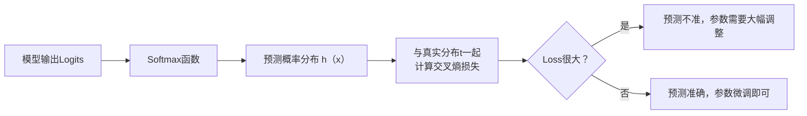

### 总结：三者的关系

这三个概念构成了一个完美的闭环，是多分类问题的理论基石：

1.  **Softmax 函数**：将模型的**原始输出**映射为一个**概率分布**，为计算似然提供基础。
2.  **最大条件似然**：提供了**衡量模型好坏的理论标准**——“猜中的可能性”要最大。
3.  **交叉熵误差函数**：是最大条件似然原理的**具体实现形式**，它是一个可最小化的、具有良好数学性质的损失函数。

**它们的共同目标**是：**驱使模型预测的概率分布 $h(x)$ 无限接近真实的标签分布 $t$**。当预测分布和真实分布完全一致时，交叉熵损失达到最小值（0），模型也就达到了最优状态。

---

### 七、系统阐述：Softmax 回归

现在，我们将前面所有内容结合起来，正式阐述 **Softmax 回归**（也称为多项逻辑回归）的完整框架。

#### 1. 模型定义（System Formulation）
我们的目标是让模型直接预测 Multinoulli 分布的参数，即概率向量 $p$。
我们让线性回归的输出 $z = Wx + b$（称为 logits）作为 Softmax 函数的输入。

Softmax 函数：

$$
h_k(x) = P(t_k = 1 | x) = \frac{\exp(z_k)}{\sum_{j=1}^{K} \exp(z_j)} = \frac{\exp(w_k^T x + b_k)}{\sum_{j=1}^{K} \exp(w_j^T x + b_j)}
$$

其中 $z_k = w_k^T x + b_k$。

Softmax 函数的作用：
- 将任意实数的输出向量 $z$ 归一化为一个概率分布。
- 放大大的 $z_k$ 的概率，抑制小的 $z_k$ 的概率（因为指数函数增长迅速）。

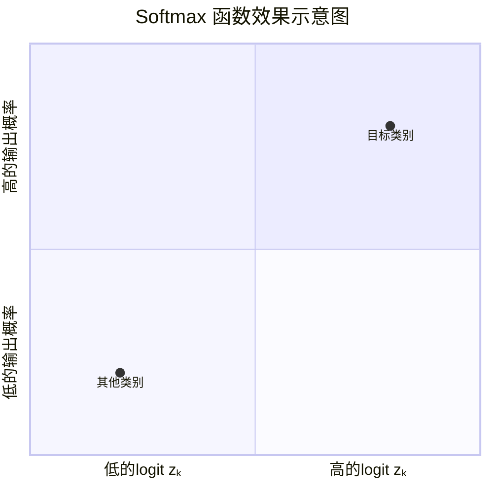

#### 2. 最大条件似然与交叉熵损失
给定数据集，其条件似然为：

$$
L(W, b) = \prod_{n=1}^{N} \prod_{k=1}^{K} [h_k(x^{(n)})]^{t_k^{(n)}}
$$

取负对数，得到交叉熵损失函数：

$$
E(W, b) = -\frac{1}{N} \sum_{n=1}^{N} \sum_{k=1}^{K} t_k^{(n)} \ln(h_k(x^{(n)}))
$$

> 📌 **例子**：真实标签 $t = [0, 1, 0]^T$，模型预测 $h(x) = [0.1, 0.7, 0.2]^T$。
> 该样本的损失为：$E^{(n)} = -[0\cdot \ln(0.1) + 1\cdot \ln(0.7) + 0\cdot \ln(0.2)] = -\ln(0.7) \approx 0.357$
> 如果预测得更准 $h(x) = [0.0, 0.99, 0.01]^T$，损失更小：$E^{(n)} = -\ln(0.99) \approx 0.01$

#### 3. 训练与测试
- **训练**：通过梯度下降法最小化交叉熵损失 $E(W, b)$，求解最优参数 $W^*$ 和 $b^*$。
- **测试**：对于新样本 $x_{\text{new}}$，计算其概率分布 $h(x_{\text{new}})$，选择概率最大的类别作为预测结果：
  $$
  y_{\text{pred}} = \arg\max_k h_k(x_{\text{new}})
  $$

#### 总结：Softmax 回归 vs. Logistic 回归
| 特征                      | Logistic 回归 (二分类)         | Softmax 回归 (多分类)           |
| ------------------------- | ------------------------------ | ------------------------------- |
| **输出分布**              | 伯努利分布 (Bernoulli)         | 范畴分布 (Categorical)          |
| **激活函数**              | Sigmoid                        | **Softmax**                     |
| **损失函数**              | 二元交叉熵                     | **交叉熵**                      |
| **标签表示**              | {0, 1}                         | One-Hot 向量                    |

Softmax 回归是 Logistic 回归的自然推广，是处理多分类问题最基础、最核心的模型之一，也是深度学习中分类网络最后一层的标准配置。

---
## 一、回顾：两步求导（链式法则）

在神经网络和复杂模型中，梯度计算依赖于**链式法则（Chain Rule）**。它的核心思想是：如果一個变量 $z$ 依赖于 $y$，而 $y$ 又依赖于 $x$，那么 $z$ 相对于 $x$ 的导数可以通过 $z$ 对 $y$ 的导数乘以 $y$ 对 $x$ 的导数得到。

### 通用公式
对于一个标量输出 $L$ 和输入向量 $x$，如果有中间变量 $u = f(x)$，则：
$$
\frac{\partial L}{\partial x_j} = \sum_{k} \frac{\partial L}{\partial u_k} \frac{\partial u_k}{\partial x_j}
$$

### 在 Softmax 回归中的意义
在 Softmax 回归中，损失 $E$ 的计算路径很长：
`输入 x -> 线性变换 u = θx -> Softmax 函数 h = softmax(u) -> 交叉熵损失 E`

为了计算损失 $E$ 对最底层参数 $θ$ 的梯度 $\frac{\partial E}{\partial θ}$，我们需要沿着这条路径，一步一步地反向传播梯度：
$$
\frac{\partial E}{\partial θ} = \frac{\partial E}{\partial h} \cdot \frac{\partial h}{\partial u} \cdot \frac{\partial u}{\partial θ}
$$

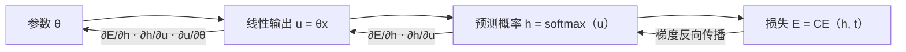

---

## 二、计算梯度（The Gradient）

我们来具体执行上述的链式求导过程，这是理解模型如何学习的关键。

### 定义与设定
- **损失函数（单个样本）**:
  $E^{(n)} = -\sum_{i=1}^{K} t_i^{(n)} \ln h_i^{(n)}$
- **Softmax 输出**:
  $h_i^{(n)} = \frac{\exp(u_i^{(n)})}{\sum_{j} \exp(u_j^{(n)})}$
- **线性层输出**:
  $u_k^{(n)} = \theta^{(k)^T} x^{(n)}$ ($\theta^{(k)}$ 是第 $k$ 类的参数向量)

### 分步计算

1.  **计算 $\frac{\partial E^{(n)}}{\partial h_i^{(n)}}$**:
    $\frac{\partial E^{(n)}}{\partial h_i^{(n)}} = -\frac{t_i^{(n)}}{h_i^{(n)}}$

2.  **计算 $\frac{\partial h_i^{(n)}}{\partial u_k^{(n)}}$ (Softmax 的导数)**:
    这是最精妙的一步。Softmax 的导数需要分情况讨论：
    - **如果 $i = k$** (求导变量是分子本身):
      $\frac{\partial h_i^{(n)}}{\partial u_i^{(n)}} = h_i^{(n)}(1 - h_i^{(n)})$
    - **如果 $i \neq k$** (求导变量是分母中的一项):
      $\frac{\partial h_i^{(n)}}{\partial u_k^{(n)}} = -h_i^{(n)}h_k^{(n)}$
    - **可以统一用一个优雅的公式表示**:
      $\frac{\partial h_i^{(n)}}{\partial u_k^{(n)}} = h_i^{(n)} (\delta_{ik} - h_k^{(n)})$
      $(\delta_{ik}$ 是 **Kronecker delta** 函数，当 $i=k$ 时为1，否则为0)

3. **计算 $\frac{\partial E^{(n)}}{\partial u_k^{(n)}}$**:
应用链式法则，并对所有输出 $i$ 求和：

$$
\begin{align*}
\frac{\partial E^{(n)}}{\partial u_k^{(n)}} &= \sum_{i=1}^{K} \frac{\partial E^{(n)}}{\partial h_i^{(n)}} \cdot \frac{\partial h_i^{(n)}}{\partial u_k^{(n)}} \\
&= \sum_{i=1}^{K} \left( -\frac{t_i^{(n)}}{h_i^{(n)}} \right) \cdot \left( h_i^{(n)} (\delta_{ik} - h_k^{(n)}) \right) \\
&= -\sum_{i=1}^{K} t_i^{(n)} (\delta_{ik} - h_k^{(n)}) \\
&= - \left( \sum_{i=1}^{K} t_i^{(n)}\delta_{ik} - \sum_{i=1}^{K} t_i^{(n)}h_k^{(n)} \right) \\
&= - (t_k^{(n)} - h_k^{(n)} \underbrace{\sum_{i=1}^{K} t_i^{(n)}}_{=1}) \\
&= h_k^{(n)} - t_k^{(n)}
\end{align*}
$$

**结论**：这个结果非常简洁而强大！对于第 $k$ 个类别的线性输出 $u_k$，其梯度就是**预测值 $h_k$ 减去真实值 $t_k$**。

**计算 $\frac{\partial E^{(n)}}{\partial \theta^{(k)}}$**:

$$
\frac{\partial E^{(n)}}{\partial \theta^{(k)}} = \frac{\partial E^{(n)}}{\partial u_k^{(n)}} \cdot \frac{\partial u_k^{(n)}}{\partial \theta^{(k)}} = (h_k^{(n)} - t_k^{(n)}) \cdot x^{(n)}
$$

> ✅ **最终梯度**：整个数据集上的平均梯度为：
> $$
\frac{\partial E}{\partial \theta^{(k)}} = \frac{1}{N} \sum_{n=1}^{N} (h_k^{(n)} - t_k^{(n)}) x^{(n)}
 $$

---

## 三、向量-矩阵形式（Vector-Matrix Form）

在实际的代码实现中，我们总是使用**矩阵和向量**操作来代替繁琐的循环，因为这可以利用线性代数库进行高速的并行计算。

### 定义
- **参数矩阵 $\Theta$**:
  将所有的参数向量 $\theta^{(k)}$ 堆叠成一个矩阵：
  $\Theta = \begin{bmatrix} - & \theta^{(1)^T} & - \\ - & \theta^{(2)^T} & - \\ & \vdots & \\ - & \theta^{(K)^T} & - \end{bmatrix} \in \mathbb{R}^{K \times m}$

- **梯度矩阵 $\nabla_\Theta E$**:
  同样，梯度也可以写成一个矩阵：
  $\nabla_\Theta E = \frac{1}{N} \sum_{n=1}^{N} (h^{(n)} - t^{(n)}) \cdot (x^{(n)})^T$
  - $h^{(n)} - t^{(n)}$ 是一个 $K \times 1$ 的向量。
  - $(x^{(n)})^T$ 是一个 $1 \times m$ 的行向量。
  - 它们的**外积**结果是一个 $K \times m$ 的矩阵，与参数矩阵 $\Theta$ 的维度完全一致。

这种形式极其简洁，是深度学习框架实现梯度计算的基础。

---

## 四、训练和测试（Training & Testing）

### 训练（Training）
1.  **前向传播（Forward Pass）**：对于一批数据 $X_{\text{batch}}$，计算预测值 $H = \text{softmax}(X_{\text{batch}} \Theta^T)$。
2.  **计算损失（Loss Calculation）**：计算交叉熵损失 $E$。
3.  **反向传播（Backward Pass）**：使用链式法则计算梯度 $\nabla_\Theta E$。
4.  **参数更新（Parameter Update）**：使用梯度下降算法更新参数：
    $\Theta \leftarrow \Theta - \alpha \nabla_\Theta E$
    （$\alpha$ 为学习率）

### 测试（Testing / Inference）
训练完成后，对于一个新样本 $x_{\text{new}}$：
1.  **计算得分**：$z = \Theta \cdot x_{\text{new}}$ （或 $z = \Theta \cdot x_{\text{new}} + b$，如果包含偏置）
2.  **计算概率**：$h = \text{softmax}(z)$
3.  **做出决策**：$\text{predicted class} = \arg\max_k(h_k)$
    即选择概率最大的那个类别作为预测结果。

---

## 五、回顾：随机梯度下降（SGD）

批量梯度下降（使用全部数据计算梯度）在大数据集上非常缓慢。**随机梯度下降（Stochastic Gradient Descent, SGD）** 是其高效变体。

- **核心思想**：每次迭代只随机抽取一个**小批量（Minibatch）** 数据来计算梯度和更新参数。
- **优势**：
  - **更快**：一次迭代的计算量大大减少。
  - **可以逃离局部最优点**：梯度的随机性有助于跳出尖锐的局部极小点，有可能找到更平坦的极小点，从而提升模型泛化能力。
- **迭代过程**：
  $\Theta \leftarrow \Theta - \alpha \cdot \frac{1}{|\text{Batch}|} \sum_{n \in \text{Batch}} (h^{(n)} - t^{(n)}) (x^{(n)})^T$

---

## 六、引入偏置（Bias）

在前面的推导中，我们将线性部分简写为 $u_k = \theta^{(k)^T} x$。更完整的写法应包含**偏置项（Bias）** $b_k$：
$u_k = \theta^{(k)^T} x + b_k$

偏置项代表了当输入全部为0时，该类别的原始输出得分。它的梯度推导非常简单：
$$
\frac{\partial E}{\partial b_k} = \frac{\partial E}{\partial u_k} \cdot \frac{\partial u_k}{\partial b_k} = (h_k - t_k) \cdot 1
$$
所以，$\frac{\partial E}{\partial b_k} = \frac{1}{N} \sum_{n=1}^{N} (h_k^{(n)} - t_k^{(n)})$

在参数更新时，$b_k$ 和 $\theta^{(k)}$ 一起更新：
$b_k \leftarrow b_k - \alpha \frac{\partial E}{\partial b_k}$

---

## 七、Softmax 过度参数化（Overparameterization）

这是一个有趣的性质。观察 Softmax 函数：
$h_k(x) = \frac{\exp(\theta^{(k)^T} x)}{\sum_j \exp(\theta^{(j)^T} x)} = \frac{\exp((\theta^{(k)} - c)^T x)}{\sum_j \exp((\theta^{(j)} - c)^T x)}$

其中 $c$ 是任意向量。你会发现，**从所有参数 $\theta^{(k)}$ 中同时减去一个向量 $c$，Softmax 的输出结果完全不变！**

这意味着，**模型的解不是唯一的**。有无穷多组参数 ($\{\theta^{(1)}, \theta^{(2)}, ..., \theta^{(K)}\}$ 和 $\{\theta^{(1)}-c, \theta^{(2)}-c, ..., \theta^{(K)}-c\}$) 会产生完全相同的预测结果。

- **在实践中**：这通常不是一个问题，因为优化算法会收敛到众多等价解中的某一个。
- **应对策略**：我们通常会进行**正则化（Regularization）**，例如 L2 正则化 ($\lambda ||\Theta||^2$)。正则化项会倾向于选择参数范数较小的那个解，从而消除这种不确定性。

---

## 八、Softmax 回归和 Logistic 回归的关系

**Logistic 回归是 Softmax 回归在二分类情况下的特例**。

假设我们有一个二分类问题 ($K=2$)。根据 Softmax 公式：
$$
\begin{align*}
P(t=1 | x) &= h_1(x) = \frac{\exp(\theta^{(1)^T} x)}{\exp(\theta^{(1)^T} x) + \exp(\theta^{(2)^T} x)} \\
&= \frac{1}{1 + \exp((\theta^{(2)} - \theta^{(1)})^T x)} = \sigma((\theta^{(1)} - \theta^{(2)})^T x)
\end{align*}
$$

我们定义一个新的参数 $\hat{\theta} = \theta^{(1)} - \theta^{(2)}$，上式就变成了标准的 Logistic 回归形式：
$P(t=1 | x) = \sigma(\hat{\theta}^T x)$

同理，$P(t=2 | x) = 1 - P(t=1 | x)$。

- **结论**：在二分类时，Softmax 回归的参数虽然有两个向量 ($\theta^{(1)}, \theta^{(2)}$)，但实际起作用的只是它们的差值 $\hat{\theta}$。这再次印证了其过度参数化的性质。Logistic 回归是更简洁的实现。