## 一、深度学习发展简史（脉络图与关键节点）
为什么先看历史：能帮助我们理解“为什么感知机/ADALINE不够用”，以及后来为什么要用多层网络、反向传播、卷积网络等。

```mermaid
graph LR
A["1943 McCulloch-Pitts(M-P)<br/>逻辑神经元"] --> B["1957 Rosenblatt<br/>感知机"]
B --> C["1960 Widrow & Hoff<br/>ADALINE/LMS"]
C --> D["1969 Minsky & Papert<br/>揭示线性不可分局限"]
D --> E["1970s<br/>第一次AI寒冬"]
E --> F["1986 反向传播<br/>(Rumelhart/Hinton/Williams)"]
F --> G["1990s<br/>支持向量机(SVM)"]
G --> H["1998 LeCun<br/>LeNet-5(CNN)"]
H --> I["2006 Hinton<br/>深度信念网络/预训练"]
I --> J["2012 AlexNet<br/>深度学习复兴"]
```

要点（通俗版）：
- 早期：神经元像一个“会做加权求和再阈值判断”的小逻辑单元。
- 感知机/ADALINE：都只能画一条“直线/超平面”做分类，碰到像 XOR 这种“弯弯绕”的边界就不行了，导致研究一度遇冷。
- 突破：多层网络 + 反向传播让“多条弯线叠加”成为可能；CNN 更适合图像；SVM 在90年代也很强。
- 深度学习复兴：数据、算力、算法迭代（如ReLU、BatchNorm、残差网络等）共同促成。

## 二、感知机（Perceptron）回顾——“只会拉一条直线的裁判”
核心思想（理论版）：
- 线性得分：$z = \mathbf{w}^\top \mathbf{x} + b$
- 阶跃输出：$y = H(z) = \begin{cases}1 & z \ge 0\\ 0 & z<0\end{cases}$
- 训练规则（感知机学习法则）：仅对误分样本更新
  $$\mathbf{w} \leftarrow \mathbf{w} + \eta (t - y)\mathbf{x}, \quad b \leftarrow b + \eta (t - y)$$
  其中 $t\in\{0,1\}$ 是标签、$\eta>0$ 是学习率。

大白话：
- 它像一个只会看“总分是否过线”的裁判，给每个特征一个分值（权重），加总后过不及格线（阈值）来判类。
- 只能画一条“直线”（二维）或“平面”（高维）把两类分开，适合“线性可分”的任务。

结构图：
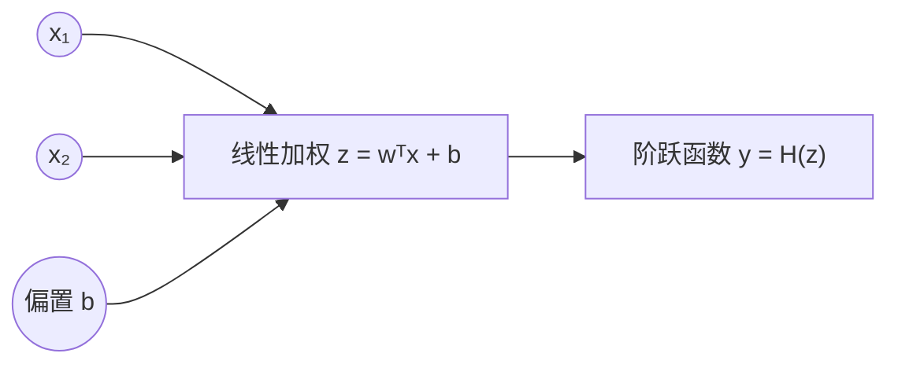

例子：AND 逻辑（线性可分）
- 数据：$(0,0)\to0,\ (0,1)\to0,\ (1,0)\to0,\ (1,1)\to1$
- 一组可行参数：$w_1=1,\ w_2=1,\ b=-1.5$
  - $(1,1)$ 时 $z=1+1-1.5=0.5\ge0 \Rightarrow y=1$
  - 其他组合 $z<0 \Rightarrow y=0$
- 能力边界：XOR 不是线性可分，感知机做不到。

## 三、ADALINE 回顾——“用连续误差来矫正的线性神经元”
核心思想（理论版）：
- 线性输出：$z = \mathbf{w}^\top \mathbf{x} + b$（不做阶跃）
- 均方误差（MSE）损失：
  $$E = \frac{1}{2N}\sum_{j=1}^{N}(t^{(j)} - z^{(j)})^2$$
- Widrow-Hoff（LMS）更新（梯度下降）：
  $$\frac{\partial E}{\partial \mathbf{w}} = -\frac{1}{N}\sum_j (t^{(j)}-z^{(j)})\mathbf{x}^{(j)},\quad
    \frac{\partial E}{\partial b} = -\frac{1}{N}\sum_j (t^{(j)}-z^{(j)})$$
  单样本在线更新（更直观）：
  $$\mathbf{w} \leftarrow \mathbf{w} + \eta (t - z)\mathbf{x},\quad b \leftarrow b + \eta (t - z)$$

大白话：
- ADALINE把“判错才改参数”升级为“误差有多大就改多少”，纠错更细腻更稳定。
- 训练时把它当线性回归拟合 $t$，推理时再对 $z$ 做阈值判断（比如 $z\ge0.5$ 判 1）。

训练流程图：
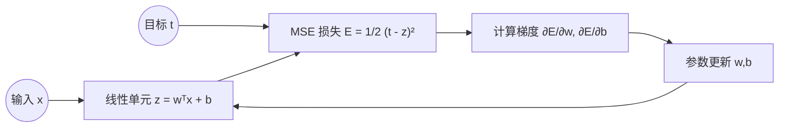

小例子（数值一步）：
- 样本 $(x_1,x_2,t)=(1,1,1)$，初始 $\mathbf{w}=(0,0),\ b=0,\ \eta=0.1$
- 前向：$z=0$
- 误差：$t-z=1$
- 更新：$w_1\leftarrow0+0.1\cdot1\cdot1=0.1,\ w_2\leftarrow0.1,\ b\leftarrow0+0.1=0.1$
- 下一次再用新参数继续迭代

注意：
- ADALINE 与感知机结构相同，但训练依据 $z$ 的连续误差而非 0/1 误分。
- 决策边界仍是超平面：$\mathbf{w}^\top\mathbf{x}+b=\text{常数}$

## 四、用 ADALINE 解决异或（XOR）问题——两条路：手工特征 或 多层网络
为什么单层线性模型不行：
- XOR 真值表：
  - $(0,0)\to0,\ (0,1)\to1,\ (1,0)\to1,\ (1,1)\to0$
- 在二维平面上，正类点 $(0,1),(1,0)$ 互相对角，无法用一条直线把正负类完全分开（线性不可分）。

思路A：手工特征映射，让它“看见”交互项
- 选用特征映射：$\phi(\mathbf{x})=[x_1,\ x_2,\ x_1x_2]$
- 用 ADALINE 在新特征空间执行线性判别：$z = \mathbf{w}^\top \phi(\mathbf{x}) + b$
- 直观解释：$x_1x_2$ 是“二者同时为1”的交互信号，相当于给模型加了一点“非线性记忆”。

管线图：
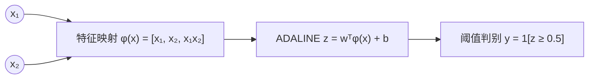

一组能正确分类 XOR 的参数（构造解）：
- 令阈值为 $0.5$，取 $w_1=1,\ w_2=1,\ w_3=-2,\ b=0$
  - $(0,0)$：$z=0<0.5\Rightarrow 0$
  - $(0,1)$：$z=1\ge0.5\Rightarrow 1$
  - $(1,0)$：$z=1\ge0.5\Rightarrow 1$
  - $(1,1)$：$z=1+1-2=0<0.5\Rightarrow 0$
- 这说明：在扩展特征空间里，XOR 变得线性可分，ADALINE 可以用 LMS 学到类似的参数。

思路B：多层网络（两层就够），但已超出“单个 ADALINE”的范畴
- 经典做法：两个隐藏神经元学到“局部直线”，输出层再把这两条“直线”拼成“折线”，即可表达 XOR 的“弯曲边界”。
- 这正是“多层感知机（MLP）”能超越线性模型的关键原因。

为何 A 与 B 都有效：
- A 等同于“先做非线性特征工程，再线性分类”；
- B 则是“让网络自己学出非线性特征”（端到端），这就是深度学习的本质优势。

## 五、局限与启示——为什么后来要“深度”
来自 PDF 的要点与扩展说明：
- 局限（感知机/ADALINE 共有）
  - 本质是线性模型：决策边界是超平面，只能解“线性可分”的分类。
  - 面对 XOR 等非线性模式，除非手工做非线性特征映射，否则无能为力。
  - ADALINE 使用 MSE 作为分类损失在概率解释上不如逻辑回归对数损失自然（不过 LMS 训练简单高效）。
  - 特征尺度影响大，需规范化/标准化以稳定收敛。
- 历史影响
  - 线性不可分问题被明确后，早期神经网络研究一度遇冷（第一次寒冬）。
  - 突破来自“多层网络 + 可导非线性 + 反向传播”，它能自动学到复杂非线性特征，不再依赖大量手工特征。
  - 与 SVM 等方法在90年代相映成辉；2010年代在大数据+算力+算法（如CNN/残差/正则化）加持下，深度学习成为主流。

补充公式与实践要点（便于动手）：
- ADALINE 标准化输入有助于稳定学习：
  $$x_i \leftarrow \frac{x_i - \mu_i}{\sigma_i+\epsilon}$$
- 在线（随机）LMS 更新更适合流数据，批量更新更平滑：
  - 在线：每个样本到来立刻更新
  - 批量：聚合梯度再更新
- 推理阈值可调：分类时常用 $z \ge \theta$ 判正类，$\theta$ 可根据验证集调优（如 $0$ 或 $0.5$）。

小结
- 感知机与 ADALINE 是“线性决策”的两种训练范式：前者基于误分更新，后者基于连续误差（LMS）。
- 它们都无法直接解决 XOR 等非线性问题；但借助特征映射（如加入 $x_1x_2$）ADALINE 可在扩展空间“线性”解决 XOR。
- 真正通用的非线性建模来自多层网络与反向传播，这奠定了深度学习的基石。

如果你希望，我可以给出一个可运行的最小 Python/Numpy 版 ADALINE 训练脚本，演示用特征映射 φ(x) = [x1, x2, x1*x2] 学会 XOR，并画出训练误差随迭代下降的曲线。


## 一、什么是 MLP（多层感知机）
- 核心构成：输入层 → 若干隐含层（每层是“线性变换 + 非线性激活”）→ 输出层。
- 参数：每一层 l 都有权重矩阵 $W^{(l)}$ 和偏置向量 $b^{(l)}$，以及激活函数 $f^{(l)}$。
- 能力：通过多层非线性叠加，MLP 能表达复杂的非线性决策边界（比如 XOR）。

结构示意：
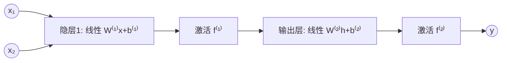

## 二、前向传播（逐神经元公式）
- 逐层、逐神经元的计算（与 PDF 记号一致）：
  - 第 l 层第 j 个神经元的“净输入”：
    $$u_j^{(l)} = \sum_i w_{ji}^{(l)}\, y_i^{(l-1)} + b_j^{(l)}$$
  - 其输出（激活后）：
    $$y_j^{(l)} = f\!\left(u_j^{(l)}\right)$$
  - 其中 $y^{(0)} = x$ 是输入特征向量；$l = L$ 是输出层。
- 大白话：
  - “线性部分”把前一层的输出做加权求和加偏置；“非线性部分”用激活函数挤压/截断/放大，从而让模型“能拐弯”。

前向流程（层内先线性再激活）：
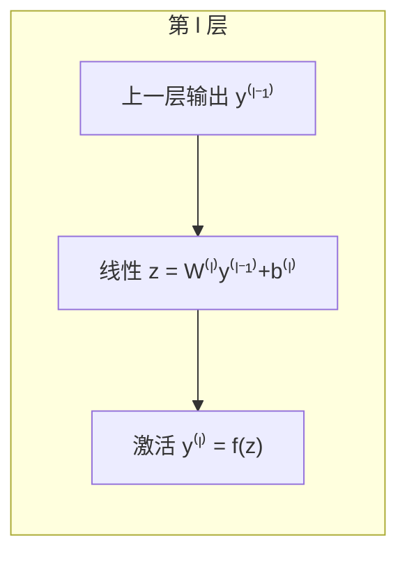

## 三、激活函数（为何要“非线性”+怎么选）
- 为什么必须要激活：
  - 如果每层都仅做线性变换，多个线性叠加仍是线性，整网等价于一层线性模型，无法表达 XOR 等非线性模式。
- 常用激活与要点：
  - 阶跃（Heaviside）：$f(z) = \mathbb{1}[z\ge 0]$。可用于思想理解，训练不可导，现代训练很少用。
  - Sigmoid：$f(z)=\frac{1}{1+e^{-z}}$。输出在 $(0,1)$，有概率解释；易“饱和”导致梯度消失，隐层较少用。
  - Tanh：$f(z)=\tanh(z)$。零中心、仍有饱和问题；在 RNN 老方法中常见。
  - ReLU：$f(z)=\max(0,z)$。稀疏、收敛快，是现代默认隐层激活；注意“死亡 ReLU”问题。
  - Leaky ReLU：$f(z)=\max(\alpha z, z)$（如 $\alpha=0.01$）。缓解 ReLU 死亡。
  - GELU：$f(z)=z\,\Phi(z)$（高斯误差线性单元），在 Transformer 等模型中常见，表现稳定。
  - Softmax（输出层多分类）：$f_k(z)=\frac{e^{z_k}}{\sum_j e^{z_j}}$，配合交叉熵损失。
- 经验选择：
  - 隐层：ReLU/LeakyReLU/GELU
  - 二分类输出：Sigmoid（配 BCE/对数损失）或 ReLU+阈值（较少）
  - 多分类输出：Softmax（配交叉熵）

## 四、向量形式的前向计算（单样本与小批量）
- 单样本（列向量记号）：
  - $$z^{(l)} = W^{(l)}\, a^{(l-1)} + b^{(l)}, \quad a^{(l)} = f^{(l)}\!\left(z^{(l)}\right)$$
  - 约定：$a^{(0)}=x$，$a^{(l)}$ 是第 l 层的激活输出；$b^{(l)}$ 会按行广播到每个神经元。
  - 维度：若第 l−1 层有 $d_{l-1}$ 个单元，第 l 层有 $d_l$ 个单元，则 $W^{(l)}\in\mathbb{R}^{d_l\times d_{l-1}}$，$b^{(l)}\in\mathbb{R}^{d_l}$，$a^{(l)}\in\mathbb{R}^{d_l}$。
- 小批量（m 个样本同时前向，矩阵并行更高效）：
  - 将 $m$ 个输入按列拼成 $A^{(0)}\in\mathbb{R}^{d_0\times m}$。
  - $$Z^{(l)} = W^{(l)} A^{(l-1)} + b^{(l)} \mathbf{1}^\top,\quad A^{(l)} = f^{(l)}\!\left(Z^{(l)}\right)$$
  - 其中 $\mathbf{1}\in\mathbb{R}^{m}$，$b^{(l)}\mathbf{1}^\top$把偏置复制到每列；激活逐元素作用。
- 大白话：
  - 向量化就是让一次前向同时“喂一批样本”，充分利用矩阵乘法的并行优势（更快更稳）。

## 五、再看异或（XOR）问题：两层 ReLU MLP 的显式解
- 目标：输入 $x=[x_1,x_2]^\top\in\{0,1\}^2$，输出 $y\in\{0,1\}$ 满足 XOR 真值表：
  - $(0,0)\to 0$，$(0,1)\to 1$，$(1,0)\to 1$，$(1,1)\to 0$。
- 网络结构（2 个隐含神经元 + ReLU），来自 PDF 的构造：
  - 隐层：$h = \text{ReLU}(Vx + c)$
  - 输出：$y = \text{ReLU}(w^\top h + b)$
  - 取参数：
    $$
    V=\begin{bmatrix}1 & 1\\ 1 & 1\end{bmatrix},\ 
    c=\begin{bmatrix}0\\ -1\end{bmatrix},\ 
    w=\begin{bmatrix}1\\ -2\end{bmatrix},\ 
    b=0
    $$
- 逐样本前向（ReLU$(z)=\max(0,z)$）：
  - $x=(0,0)$：
    - $Vx+c=[0,0]^\top+[0,-1]^\top=[0,-1]^\top$
    - $h=\text{ReLU}([0,-1])=[0,0]$
    - $y=\text{ReLU}(w^\top h+b)=\text{ReLU}(0)=0$ ✓
  - $x=(0,1)$：
    - $Vx+c=[1,1]^\top+[0,-1]^\top=[1,0]^\top$
    - $h=[1,0]$，$y=\text{ReLU}(1)=1$ ✓
  - $x=(1,0)$：
    - 同上得 $h=[1,0]$，$y=1$ ✓
  - $x=(1,1)$：
    - $Vx+c=[2,2]^\top+[0,-1]^\top=[2,1]^\top$
    - $h=[2,1]$，$y=\text{ReLU}(1\cdot 2 + (-2)\cdot 1)=\text{ReLU}(0)=0$ ✓
- 直观解释（为什么有效）：
  - 隐层两个 ReLU 相当于切出两个“半空间特征”（两条“直线门”）：
    - $h_1=\max(0, x_1+x_2)$ 提供“至少一个为 1”的激活强度；
    - $h_2=\max(0, x_1+x_2-1)$ 在两者都为 1 时才会激活（被 $-2$ 强烈抑制）。
  - 输出层用 $w=[1,-2]$ 把两条“直线门”拼成一条“折线边界”，恰好实现 XOR 的“中间高、角上低”的模式。
- 小记号澄清（呼应 PDF 提问“什么是 h^(n)、y^(n)？”）：
  - $h^{(n)}$：第 n 个样本经隐层得到的隐表示向量（这里是 2 维）；
  - $y^{(n)}$：第 n 个样本的最终网络输出（这里是标量）。

XOR 两层网络（结构示意）：
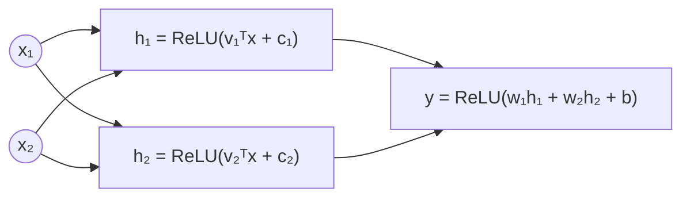

## 六、实践要点与小结
- 实践要点
  - 层计算：先线性再激活，逐层推进；向量化前向在实现上更高效。
  - 激活选择：隐层用 ReLU/LeakyReLU/GELU 更稳；输出层按任务（Sigmoid/Softmax/线性）选择。
  - 数值稳定：批归一化/层归一化常配合深层网络缓解训练不稳。
- 小结
  - 单层线性模型做不了 XOR；两层 MLP 借助非线性激活即可。
  - MLP 前向的本质：$z^{(l)} = W^{(l)}a^{(l-1)} + b^{(l)}$，$a^{(l)} = f^{(l)}(z^{(l)})$；向量化后可高效并行。
  - 隐层学“特征”，输出层做“整合”，这是深度模型超越线性方法的根本原因。

如果需要，我可以把上述 XOR 的两层 ReLU 网络写成一段可运行的 Numpy 前向脚本，或给出用 PyTorch 定义并验证前向输出的最小代码示例。


## 一、反向计算的核心思想（链式法则 + 局部敏感度）
- 大白话：
  - 前向传播是“从输入推到输出”，反向传播是“从损失把责任一层层地往回推”，算出“每层每个参数应该如何微调”。
  - “局部敏感度（local sensitivity）”就是“误差对该层输入的敏感程度”：$\delta^{(l)} = \frac{\partial E}{\partial z^{(l)}}$，其中 $z^{(l)}$ 是第 l 层的“线性输入”（pre-activation）。
  - 有了每层的 $\delta^{(l)}$，就能立刻写出该层权重 $W^{(l)}$ 和偏置 $b^{(l)}$ 的梯度。

- 基本链式法则：
  - 若第 l 层：$z^{(l)} = W^{(l)} a^{(l-1)} + b^{(l)}$，$a^{(l)} = f^{(l)}(z^{(l)})$，则
    - 定义局部敏感度：$\delta^{(l)} = \frac{\partial E}{\partial z^{(l)}}$
    - 反向传回上一层激活：$\frac{\partial E}{\partial a^{(l-1)}} = (W^{(l)})^\top \delta^{(l)}$
    - 参数梯度：
      - $\frac{\partial E}{\partial W^{(l)}} = \delta^{(l)} (a^{(l-1)})^\top$
      - $\frac{\partial E}{\partial b^{(l)}} = \delta^{(l)}$（批量时对样本求和/平均）

反向计算的计算图（从右往左“推梯度”）
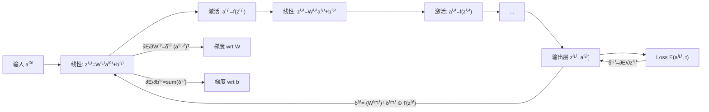

## 二、反向传播中的损失函数与参数更新
1) 常见损失函数（输出层的“起点”）
- 均方误差（MSE）：
  - $$E = \frac{1}{2}\|a^{(L)} - t\|_2^2 = \frac{1}{2}\sum_k (a_k^{(L)} - t_k)^2$$
  - 若输出层激活为 $f^{(L)}$，则
    $$\delta^{(L)} = \frac{\partial E}{\partial z^{(L)}} = (a^{(L)} - t) \odot f^{(L)\prime}(z^{(L)})$$
- Softmax + 交叉熵（多分类首选）：
  - Softmax: $y_k = \frac{e^{z_k}}{\sum_j e^{z_j}}$，交叉熵：$E = -\sum_k t_k \log y_k$
  - 重要简化（结论）：$$\delta^{(L)} = \frac{\partial E}{\partial z^{(L)}} = y - t$$
    这避免显式写 Softmax 雅可比，数值稳定而高效。
- Sigmoid + 二元交叉熵（单输出二分类）：
  - $a^{(L)}=\sigma(z^{(L)})$，$E= -[t\log a^{(L)}+(1-t)\log(1-a^{(L)})]$
  - 结论同样优雅：$$\delta^{(L)} = a^{(L)} - t$$

2) 参数更新（以 SGD/Adam 为例）
- 基本 SGD：
  - $$W^{(l)} \leftarrow W^{(l)} - \eta \,\frac{\partial E}{\partial W^{(l)}},\quad b^{(l)} \leftarrow b^{(l)} - \eta \,\frac{\partial E}{\partial b^{(l)}}$$
  - 其中 $\eta$ 是学习率。批量训练时用小批量平均梯度。
- 带动量 Momentum：
  - $v \leftarrow \mu v + \nabla E$；$W \leftarrow W - \eta v$（$\mu\in[0,1)$）
- Adam（实践常用，收敛稳）：
  - 一阶二阶矩估计并做偏差修正，更新更自适应。默认超参常用：lr=1e-3, betas=(0.9,0.999), eps=1e-8。

## 三、梯度（Gradient）与“局部敏感度（local sensitivity）”
- 定义：
  - 局部敏感度：$\delta^{(l)} := \frac{\partial E}{\partial z^{(l)}}$
  - 参数梯度：$\nabla_{W^{(l)}} E = \frac{\partial E}{\partial W^{(l)}}$，$\nabla_{b^{(l)}} E = \frac{\partial E}{\partial b^{(l)}}$
- 关系（全连接层）：
  - 反传：$\delta^{(l)} = \left(W^{(l+1)}\right)^\top \delta^{(l+1)} \odot f^{(l)\prime}(z^{(l)})$
  - 梯度：$\frac{\partial E}{\partial W^{(l)}} = \delta^{(l)} (a^{(l-1)})^\top,\ \ \frac{\partial E}{\partial b^{(l)}} = \delta^{(l)}$

四、均方误差（MSE）层的局部敏感度
- 若输出层激活是 $f^{(L)}$，则
  $$\delta^{(L)} = (a^{(L)} - t) \odot f^{(L)\prime}(z^{(L)})$$
- 特例：
  - 线性输出（回归）：$f^{(L)}(z)=z$，$f'=1$，故 $\delta^{(L)}=a^{(L)}-t$
  - Sigmoid 输出做分类且用 MSE：$\delta^{(L)}=(a^{(L)}-t)\,a^{(L)}(1-a^{(L)})$（收敛较慢，不如 CE）

五、回顾：Softmax 层的局部敏感度（配交叉熵）
- Softmax 雅可比：$\frac{\partial y_i}{\partial z_j}= y_i(\delta_{ij}-y_j)$
- 与交叉熵组合后极大简化：
  $$\delta^{(L)} = y - t$$
- 实践建议：多分类几乎都用 Softmax+CE，既稳定又高效。

## 六、其它层的局部敏感度（常用激活/全连接）
- 全连接层（FC）：$z^{(l)} = W^{(l)} a^{(l-1)} + b^{(l)}$
  - 反传到上一层激活：$g^{(l-1)}:=\frac{\partial E}{\partial a^{(l-1)}} = (W^{(l)})^\top \delta^{(l)}$
  - 再乘上上一层激活的导数，得 $\delta^{(l-1)} = g^{(l-1)} \odot f^{(l-1)\prime}(z^{(l-1)})$
  - 参数梯度如前：$\partial E/\partial W^{(l)}=\delta^{(l)} (a^{(l-1)})^\top$，$\partial E/\partial b^{(l)}=\delta^{(l)}$
- ReLU：$f(z)=\max(0,z)$，$f'(z)=\mathbb{1}[z>0]$
- Leaky ReLU：$f'(z)=\begin{cases}1 & z>0\\ \alpha & z\le 0\end{cases}$
- Sigmoid：$f'(z)=\sigma(z)(1-\sigma(z))=a(1-a)$
- Tanh：$f'(z)=1-\tanh^2(z)=1-a^2$

层内反向（图示）
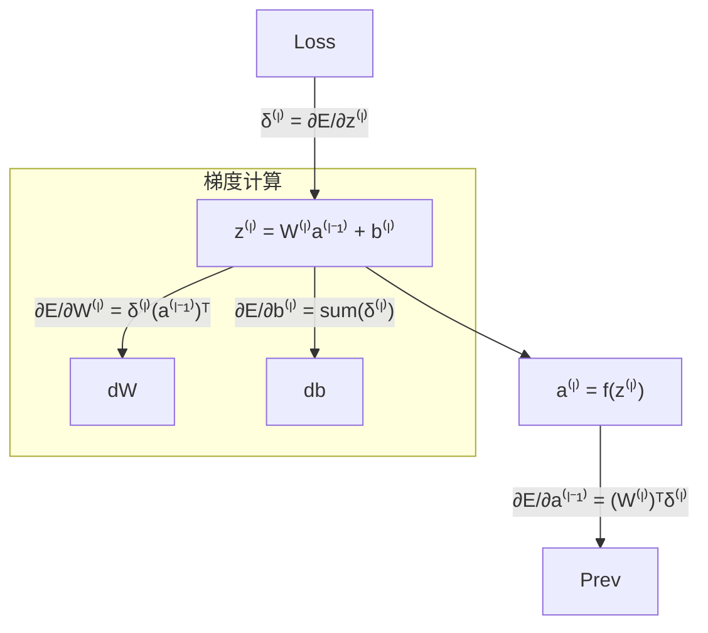

## 七、向量形式的反向传播（批量）
- 设小批量大小为 $m$，把每层激活堆为矩阵 $A^{(l)}\in\mathbb{R}^{d_l\times m}$，偏置广播到每列：
  - 前向：$Z^{(l)}=W^{(l)}A^{(l-1)}+b^{(l)}\mathbf{1}^\top,\ A^{(l)}=f^{(l)}(Z^{(l)})$
  - 输出层局部敏感度（以 Softmax+CE 为例）：$\Delta^{(L)} = Y - T$（同形状 $d_L\times m$）
  - 逐层反传：$\Delta^{(l)} = \left(W^{(l+1)}\right)^\top \Delta^{(l+1)} \odot f^{(l)\prime}(Z^{(l)})$
  - 参数梯度（对批平均）：
    $$\frac{\partial E}{\partial W^{(l)}} = \frac{1}{m}\,\Delta^{(l)} \left(A^{(l-1)}\right)^\top,\quad \frac{\partial E}{\partial b^{(l)}}=\frac{1}{m}\,\Delta^{(l)}\mathbf{1}$$


## 八、梯度消失（Gradient Vanishing）：为何发生与如何缓解
- 原因（大白话）：
  - 反向时梯度是很多“小于 1 的数”的连乘（例如 Sigmoid 的导数最大 0.25），层数一多就接近 0；
  - 激活饱和（Sigmoid/Tanh 在大正/大负区导数≈0）；
  - 权重初始化不当让信号逐层缩放衰减。
- 主要对策：
  - 使用 ReLU/LeakyReLU/GELU 等非饱和激活；
  - 合理初始化：Xavier（均衡前后方差，适合 Tanh），He 初始化（适合 ReLU）；
  - 归一化：BatchNorm/LayerNorm 稳定分布；
  - 残差连接（ResNet）：提供“梯度直通”的路径；
  - 合理的学习率与优化器（Adam）、学习率预热与衰减。

## 九、实现（从零到实验）
A) 实验1：二维平面点分类（Numpy，从零写前向+反向，Softmax+CE）
- 数据：两同心圆（Circle vs. Ring），线性不可分，MLP 应该能学到非线性边界。
网站：[A Neural Network Playground](https://playground.tensorflow.org/#activation=relu&batchSize=10&dataset=xor&regDataset=reg-plane&learningRate=0.00001&regularizationRate=0&noise=0&networkShape=4,2&seed=0.32858&showTestData=false&discretize=false&percTrainData=50&x=true&y=true&xTimesY=false&xSquared=false&ySquared=false&cosX=false&sinX=false&cosY=false&sinY=false&collectStats=false&problem=classification&initZero=false&hideText=false)
代码（可直接运行）
```python
# numpy MLP: 2D -> [Hidden 32] -> [Hidden 16] -> 2-class Softmax
import numpy as np

np.random.seed(42)

def make_rings(n=1000, r_in=1.0, r_out=2.0, noise=0.08):
    m = n // 2
    ang1 = 2*np.pi*np.random.rand(m)
    ang2 = 2*np.pi*np.random.rand(n-m)
    r1 = r_in + noise*np.random.randn(m)
    r2 = r_out + noise*np.random.randn(n-m)
    X1 = np.c_[r1*np.cos(ang1), r1*np.sin(ang1)]
    X2 = np.c_[r2*np.cos(ang2), r2*np.sin(ang2)]
    X = np.vstack([X1, X2])
    y = np.r_[np.zeros(m, dtype=int), np.ones(n-m, dtype=int)]
    # shuffle
    idx = np.random.permutation(n)
    return X[idx], y[idx]

def one_hot(y, K):
    Y = np.zeros((y.size, K))
    Y[np.arange(y.size), y] = 1
    return Y

def he_init(fan_in, fan_out):
    return np.random.randn(fan_out, fan_in) * np.sqrt(2.0/fan_in)

def relu(Z):
    return np.maximum(0, Z)

def drelu(Z):
    return (Z > 0).astype(Z.dtype)

def softmax(Z):
    Z = Z - Z.max(axis=0, keepdims=True)
    expZ = np.exp(Z)
    return expZ / expZ.sum(axis=0, keepdims=True)

def cross_entropy(P, T):  # P: K x m, T: K x m
    eps = 1e-12
    return -np.mean(np.sum(T * np.log(P + eps), axis=0))

# Build data
X, y = make_rings(n=2000, r_in=1.0, r_out=2.0, noise=0.1)
X = X.T  # 2 x N
N = X.shape[1]
K = 2
T = one_hot(y, K).T  # K x N

# Normalize inputs (zero-mean, unit-var)
X = (X - X.mean(axis=1, keepdims=True)) / (X.std(axis=1, keepdims=True) + 1e-8)

# Network sizes
d0, d1, d2, d3 = 2, 32, 16, K

# Initialize
W1, b1 = he_init(d0, d1), np.zeros((d1, 1))
W2, b2 = he_init(d1, d2), np.zeros((d2, 1))
W3, b3 = he_init(d2, d3), np.zeros((d3, 1))

lr = 1e-2
batch = 128
epochs = 50

for ep in range(1, epochs+1):
    # mini-batch SGD
    perm = np.random.permutation(N)
    Xs, Ts = X[:, perm], T[:, perm]
    for i in range(0, N, batch):
        xb = Xs[:, i:i+batch]    # 2 x m
        tb = Ts[:, i:i+batch]    # K x m
        m = xb.shape[1]

        # forward
        Z1 = W1 @ xb + b1        # d1 x m
        A1 = relu(Z1)
        Z2 = W2 @ A1 + b2        # d2 x m
        A2 = relu(Z2)
        Z3 = W3 @ A2 + b3        # K x m
        P  = softmax(Z3)

        # loss
        loss = cross_entropy(P, tb)

        # backward (Softmax+CE): Δ3 = P - tb
        dZ3 = (P - tb)                         # K x m
        dW3 = (dZ3 @ A2.T) / m                 # K x d2
        db3 = np.sum(dZ3, axis=1, keepdims=True) / m

        dA2 = W3.T @ dZ3                       # d2 x m
        dZ2 = dA2 * drelu(Z2)                  # d2 x m
        dW2 = (dZ2 @ A1.T) / m                 # d2 x d1
        db2 = np.sum(dZ2, axis=1, keepdims=True) / m

        dA1 = W2.T @ dZ2                       # d1 x m
        dZ1 = dA1 * drelu(Z1)                  # d1 x m
        dW1 = (dZ1 @ xb.T) / m                 # d1 x d0
        db1 = np.sum(dZ1, axis=1, keepdims=True) / m

        # sgd update
        W3 -= lr * dW3; b3 -= lr * db3
        W2 -= lr * dW2; b2 -= lr * db2
        W1 -= lr * dW1; b1 -= lr * db1

    if ep % 5 == 0 or ep == 1:
        # evaluate
        Z1 = W1 @ X + b1; A1 = relu(Z1)
        Z2 = W2 @ A1 + b2; A2 = relu(Z2)
        Z3 = W3 @ A2 + b3; P = softmax(Z3)
        pred = np.argmax(P, axis=0)
        acc = (pred == y).mean()
        print(f"Epoch {ep:02d}: loss={loss:.4f}, acc={acc*100:.2f}%")
```
- 你应看到训练过程中 loss 下降、acc 上升到 >95%。这证明多层 MLP 能学到“圆形”分割边界，解决非线性分类。

B) 手写体数字识别（MNIST，PyTorch，MLP）
- 思路：把 28×28 图像拉平成 784 维向量，接 2~3 个 ReLU 隐层，输出 10 类 Softmax（用 CrossEntropyLoss）。
- 网站：[A Neural Network Playground](https://playground.tensorflow.org/#activation=relu&batchSize=10&dataset=xor&regDataset=reg-plane&learningRate=0.00001&regularizationRate=0&noise=0&networkShape=4,2&seed=0.32858&showTestData=false&discretize=false&percTrainData=50&x=true&y=true&xTimesY=false&xSquared=false&ySquared=false&cosX=false&sinX=false&cosY=false&sinY=false&collectStats=false&problem=classification&initZero=false&hideText=false)
- 代码（CPU/GPU 皆可运行）：
```python
# pip install torch torchvision tqdm
import torch, torch.nn as nn, torch.nn.functional as F
from torch.utils.data import DataLoader
from torchvision import datasets, transforms
from tqdm import tqdm

device = torch.device('cuda' if torch.cuda.is_available() else 'cpu')
torch.manual_seed(42)

# Data
transform = transforms.Compose([
    transforms.ToTensor(),                    # [0,1]
    transforms.Normalize((0.1307,), (0.3081,))# 标准化
])
train_ds = datasets.MNIST(root='./data', train=True,  download=True, transform=transform)
test_ds  = datasets.MNIST(root='./data', train=False, download=True, transform=transform)
train_loader = DataLoader(train_ds, batch_size=128, shuffle=True, num_workers=2, pin_memory=True)
test_loader  = DataLoader(test_ds,  batch_size=256, shuffle=False, num_workers=2, pin_memory=True)

# Model: 784 -> 256 -> 128 -> 10
class MLP(nn.Module):
    def __init__(self):
        super().__init__()
        self.fc1 = nn.Linear(28*28, 256)
        self.fc2 = nn.Linear(256, 128)
        self.fc3 = nn.Linear(128, 10)
        # He 初始化适配 ReLU
        nn.init.kaiming_normal_(self.fc1.weight, nonlinearity='relu')
        nn.init.kaiming_normal_(self.fc2.weight, nonlinearity='relu')
        nn.init.xavier_normal_(self.fc3.weight)

    def forward(self, x):
        x = x.view(x.size(0), -1)
        x = F.relu(self.fc1(x))
        x = F.relu(self.fc2(x))
        x = self.fc3(x)   # logits
        return x

model = MLP().to(device)
opt = torch.optim.Adam(model.parameters(), lr=1e-3)
crit = nn.CrossEntropyLoss()

def evaluate(model):
    model.eval()
    correct, total, loss_sum = 0, 0, 0.0
    with torch.no_grad():
        for x, y in test_loader:
            x, y = x.to(device), y.to(device)
            logits = model(x)
            loss = crit(logits, y)
            loss_sum += loss.item() * x.size(0)
            pred = logits.argmax(dim=1)
            correct += (pred == y).sum().item()
            total += x.size(0)
    return loss_sum/total, correct/total

# Train
epochs = 8
for ep in range(1, epochs+1):
    model.train()
    pbar = tqdm(train_loader, desc=f"Epoch {ep}")
    for x, y in pbar:
        x, y = x.to(device), y.to(device)
        logits = model(x)
        loss = crit(logits, y)
        opt.zero_grad()
        loss.backward()
        opt.step()
        pbar.set_postfix(loss=f"{loss.item():.4f}")

    test_loss, test_acc = evaluate(model)
    print(f"Epoch {ep}: test_loss={test_loss:.4f}, test_acc={test_acc*100:.2f}%")
```
- 期望结果：8 个 epoch 左右，测试准确率常见 97%~98%+。
- 解释：
  - 输出层使用 CrossEntropyLoss，即内部做 LogSoftmax + NLLLoss，对应我们上文“Softmax+CE”的梯度简化。
  - He/Xavier 初始化配合 ReLU/线性层，有助于缓解梯度消失或爆炸。

## 十、综合小抄（便于实战对照）
- 定义局部敏感度：$\delta^{(l)} = \frac{\partial E}{\partial z^{(l)}}$
- 输出层：
  - Softmax+CE：$\delta^{(L)} = y - t$
  - Sigmoid+BCE（单输出）：$\delta^{(L)} = a^{(L)} - t$
  - MSE+f：$\delta^{(L)} = (a^{(L)}-t) \odot f'(z^{(L)})$
- 中间层（全连接+激活）：$\delta^{(l)} = (W^{(l+1)})^\top \delta^{(l+1)} \odot f'(z^{(l)})$
- 梯度：
  - $\partial E/\partial W^{(l)} = \delta^{(l)} (a^{(l-1)})^\top$
  - $\partial E/\partial b^{(l)} = \delta^{(l)}$（批量时对样本求平均或求和）
- 向量化（批量 m）：
  - $\Delta^{(l)} = (W^{(l+1)})^\top \Delta^{(l+1)} \odot f'(Z^{(l)})$
  - $\partial E/\partial W^{(l)} = \frac{1}{m}\Delta^{(l)} (A^{(l-1)})^\top$
  - $\partial E/\partial b^{(l)} = \frac{1}{m}\Delta^{(l)} \mathbf{1}$

## 十一、补充：为何“选择合适损失+激活”很重要
- 用 Softmax+CE 做多分类、Sigmoid+BCE 做二分类，能得到更“直观”的梯度（$y-t$），避免 MSE+Sigmoid 在饱和段梯度过小。
- 对深层网络，ReLU 家族 + He 初始化 + BN/残差是默认可靠组合。

如果你愿意，我可以把二维分类的决策边界可视化代码也补上，或把 MNIST 实验改成“同时对比 Sigmoid/Tanh vs ReLU 的收敛与梯度消失差异”的对照实验，进一步直观看到激活与初始化对训练的影响。

# 层分解（Layer Decomposition）
要点：把每层“线性变换 + 非线性激活”明确拆分为两个子层，便于统一、可替换与推导梯度。

- 隐含层或输入到隐含层的标准计算
  - 标量/向量记法：
    - 线性（全连接层，含参数）：$u^{(l)} = W^{(l)}\, y^{(l-1)} + b^{(l)}$
    - 激活（无参数）：$y^{(l)} = f^{(l)}(u^{(l)})$
- 输出层也同理：先线性，再接相应的输出激活（线性/Sigmoid/Softmax 等）。

层分解示意（FC + 激活）：
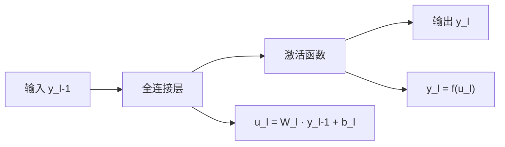

- 平方损失也可分解为“输出层激活 + 损失层”
  - 输出激活层：$y^{(L)} = f^{(L)}(u^{(L)})$（f 可以是恒等、Sigmoid、Tanh 等）
  - 损失层（MSE）：$E_n = \frac{1}{2}\,\|y^{(L)} - t\|_2^2$

输出层分解示意（激活 + 损失）：
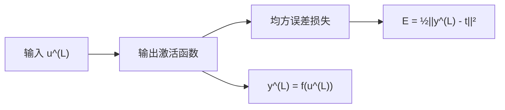

## 二、更灵活的方式（为什么要分解）
- 可替换：你可以自由替换激活函数（ReLU/LeakyReLU/Tanh/Sigmoid/GELU）而不动 FC 层参数结构。
- 可组合：输出层可按任务选择激活+损失（回归用线性+MSE，二分类用 Sigmoid+BCE，多分类用 Softmax+CE）。
- 易推导：反向传播时，每个子层都有“局部敏感度（local sensitivity）/雅可比”，链式相乘即可。
- 易调试：参数层（FC）与无参层（激活/损失）职责清晰，梯度维度/广播更容易检查。

## 三、问题（常见坑与注意点）
- 记号混淆：$u^{(l)}$（线性输入）与 $y^{(l)}$（激活输出）不要混用；前向存好两者，反向都用得到。
- 形状不匹配：$W^{(l)}\in\mathbb{R}^{d_l\times d_{l-1}},\ b^{(l)}\in\mathbb{R}^{d_l}$；批量时 $A^{(l)}\in\mathbb{R}^{d_l\times m}$，偏置需广播到每列。
- 输出层“搭配错误”：多分类尽量用 Softmax+交叉熵；Sigmoid+MSE 在饱和区梯度太小，收敛慢。
- 数值稳定：Softmax 要做减最大值的稳定化；交叉熵里注意加 $ \epsilon $ 防止 $\log 0$。
- 激活饱和与梯度消失：深层网络尽量用 ReLU/LeakyReLU/GELU，配 He/Xavier 初始化与归一化。
- 批量汇总：偏置梯度是样本维度的求和（或平均），不要忘了除以 batch size。

## 四、例子1：带隐含层的 MLP + 平方误差（MSE）
网络结构（两层 MLP 示例）：
- 前向（单样本）：
  - $u^{(1)} = W^{(1)} x + b^{(1)}$
  - $y^{(1)} = f(u^{(1)})$
  - $u^{(2)} = W^{(2)} y^{(1)} + b^{(2)}$
  - $y^{(2)} = f(u^{(2)})$ （可选：输出层也用 f；若回归，常用恒等）
  - 损失：$E = \frac{1}{2}\|y^{(2)} - t\|_2^2$

- 反向（局部敏感度定义为 $\delta^{(l)}=\partial E/\partial u^{(l)}$）
  - 输出层：
    - 若 $f$ 为一般可导激活：$\delta^{(2)} = (y^{(2)} - t) \odot f'(u^{(2)})$
    - 若回归用恒等：$f'(u^{(2)})=1 \Rightarrow \delta^{(2)} = y^{(2)} - t$
  - 隐层：
    - 先传回上一层激活梯度：$\frac{\partial E}{\partial y^{(1)}} = (W^{(2)})^\top \delta^{(2)}$
    - 再乘激活导数：$\delta^{(1)} = \left((W^{(2)})^\top \delta^{(2)}\right) \odot f'(u^{(1)})$
  - 参数梯度：
    - $\frac{\partial E}{\partial W^{(2)}} = \delta^{(2)} (y^{(1)})^\top,\quad \frac{\partial E}{\partial b^{(2)}}=\delta^{(2)}$
    - $\frac{\partial E}{\partial W^{(1)}} = \delta^{(1)} x^\top,\quad \frac{\partial E}{\partial b^{(1)}}=\delta^{(1)}$

## 五、例子2：带隐含层的 MLP + Softmax 交叉熵（多分类）
网络结构（两层 + Softmax）：
- 前向（单样本，多类 K）：
  - $u^{(1)} = W^{(1)} x + b^{(1)},\quad y^{(1)}=f(u^{(1)})$
  - $u^{(2)} = W^{(2)} y^{(1)} + b^{(2)}$
  - Softmax：$y^{(2)}_k = \frac{e^{u^{(2)}_k}}{\sum_j e^{u^{(2)}_j}}$
  - 交叉熵损失：$E = -\sum_{k=1}^{K} t_k \log y^{(2)}_k$

- 反向（关键简化）：
  - 输出层局部敏感度：$\delta^{(2)} = \frac{\partial E}{\partial u^{(2)}} = y^{(2)} - t$
  - 隐层：$\delta^{(1)} = (W^{(2)})^\top \delta^{(2)} \odot f'(u^{(1)})$
  - 参数梯度：
    - $\partial E/\partial W^{(2)} = \delta^{(2)} (y^{(1)})^\top,\ \partial E/\partial b^{(2)}=\delta^{(2)}$
    - $\partial E/\partial W^{(1)} = \delta^{(1)} x^\top,\ \partial E/\partial b^{(1)}=\delta^{(1)}$

## 六、练习（由浅入深）
1) 练习1（MSE + 恒等输出）：
- 设 $y^{(L)}=u^{(L)}$，$E=\frac{1}{2}\|y^{(L)}-t\|^2$。推导 $\delta^{(L)}$、$\partial E/\partial W^{(L)}$、$\partial E/\partial b^{(L)}$。

2) 练习2（Sigmoid + MSE 对比 BCE）：
- 二分类单输出，比较 MSE 和 BCE 两种损失的 $\delta^{(L)}$ 公式，并说明为什么 BCE 更利于收敛。

3) 练习3（两层网络的完整反向）：
- 给定 $f=\text{ReLU}$，网络 $u^{(1)}=W^{(1)}x+b^{(1)}$，$u^{(2)}=W^{(2)}y^{(1)}+b^{(2)}$，输出用 Softmax+CE。写出所有梯度。

4) 练习4（数值稳定的 Softmax）：
- 写出稳定版 Softmax $y=\text{softmax}(u-c)$ 的 $c=\max(u)$，并解释为什么不改变输出。

5) 练习5（批量向量化）：
- 对于小批量 $A^{(l)}\in \mathbb{R}^{d_l\times m}$，写出 $\Delta^{(l)},\ \partial E/\partial W^{(l)},\ \partial E/\partial b^{(l)}$ 的矩阵表达式（均值化）。

## 七、提示（做题思路）
- 局部敏感度的定义是关键：$\delta^{(l)}=\partial E/\partial u^{(l)}$。
- Softmax+CE 的结论要记牢：最末层 $\delta=y-t$，不必显式写雅可比。
- FC 层的参数梯度总是“当前层的局部敏感度 × 前一层的激活转置”。
- 批量时：把样本堆成列向量矩阵；偏置对列求和再平均。

## 八、参考答案（要点公式）
- 练习1：
  - 恒等输出：$y^{(L)}=u^{(L)} \Rightarrow \delta^{(L)}=y^{(L)}-t$
  - $\partial E/\partial W^{(L)}=\delta^{(L)} (y^{(L-1)})^\top,\ \partial E/\partial b^{(L)}=\delta^{(L)}$
- 练习2：
  - Sigmoid + MSE：$\delta^{(L)}=(a-t)\,a(1-a)$，在饱和区 $a(1-a)\approx 0$，梯度小；
  - Sigmoid + BCE：$\delta^{(L)}=a-t$，避免额外的 $a(1-a)$ 因子，梯度更大、更稳。
- 练习3：
  - $\delta^{(2)}=y^{(2)}-t$
  - $\delta^{(1)}=(W^{(2)})^\top\delta^{(2)} \odot \mathbb{1}[u^{(1)}>0]$
  - 梯度：
    - $\partial E/\partial W^{(2)}=\delta^{(2)} (y^{(1)})^\top,\ \partial E/\partial b^{(2)}=\delta^{(2)}$
    - $\partial E/\partial W^{(1)}=\delta^{(1)} x^\top,\ \partial E/\partial b^{(1)}=\delta^{(1)}$
- 练习4：
  - 稳定化：$y_k=\frac{e^{u_k-c}}{\sum_j e^{u_j-c}}$，取 $c=\max_j u_j$；因分子分母同乘 $e^{-c}$，比值不变。
- 练习5（批量，大小 m）：
  - 前向：$Z^{(l)}=W^{(l)}A^{(l-1)} + b^{(l)}\mathbf{1}^\top,\ A^{(l)}=f^{(l)}(Z^{(l)})$
  - 输出层（Softmax+CE）：$\Delta^{(L)}=Y-T$
  - 反向：$\Delta^{(l)}=(W^{(l+1)})^\top \Delta^{(l+1)} \odot f'(Z^{(l)})$
  - 参数梯度：$\partial E/\partial W^{(l)}=\frac{1}{m}\,\Delta^{(l)} (A^{(l-1)})^\top,\ \partial E/\partial b^{(l)}=\frac{1}{m}\,\Delta^{(l)}\mathbf{1}$

## 九、向量形式的反向传播（总览小抄）
- 前向（批量 m）：
  - $Z^{(l)}=W^{(l)} A^{(l-1)} + b^{(l)} \mathbf{1}^\top$
  - $A^{(l)}=f^{(l)}(Z^{(l)})$，$A^{(0)}=X$
- 输出层局部敏感度：
  - Softmax+CE：$\Delta^{(L)}=Y-T$
  - 恒等+MSE：$\Delta^{(L)}=A^{(L)}-T$
  - Sigmoid+BCE（单输出）：$\Delta^{(L)}=A^{(L)}-T$
- 中间层反向与参数梯度：
  - 反向：$\Delta^{(l)}=(W^{(l+1)})^\top \Delta^{(l+1)} \odot f^{(l)\prime}(Z^{(l)})$
  - 梯度：$\frac{\partial E}{\partial W^{(l)}}=\frac{1}{m}\,\Delta^{(l)} (A^{(l-1)})^\top,\quad \frac{\partial E}{\partial b^{(l)}}=\frac{1}{m}\,\Delta^{(l)}\mathbf{1}$

补充：动量（Momentum）与优化
- 动量更新（与 PDF 一致的表述）：
  - $v \leftarrow \gamma v - \alpha \nabla_\theta J(\theta; x_i, t_i)$
  - $\theta \leftarrow \theta + v$
  - 其中 $\gamma\in(0,1]$ 控制历史梯度影响，经验做法是先用 0.5 直到收敛稳定，再增大到 0.9 或更高。

小结
- 层分解让“结构统一、推导清晰、替换灵活”；通过局部敏感度把反向传播拆成可复用的模块。
- 两个例子（MSE 与 Softmax+CE）覆盖回归与分类的最常见情形，记住“FC 层梯度 = 当前层敏感度 × 前一层激活转置”。
- 向量化反向传播是工程高效实现的关键；与稳定的激活/损失/初始化组合使用，可有效缓解梯度消失。

# 深度学习模型训练技巧1
## 一、参数初始化（为什么与怎么做）
目标（大白话）：
- 让信号在前向与反向时的方差“既不爆炸也不衰减”，避免一开局就陷入梯度消失/爆炸或训练不稳。

常用初始化（按激活选择）
- Xavier/Glorot（适合 Tanh/Sigmoid）
  - 使前后层方差平衡：$\mathrm{Var}(W)=\frac{2}{\mathrm{fan\_in}+\mathrm{fan\_out}}$
  - Uniform：$W\sim \mathcal{U}\!\big(-\sqrt{\tfrac{6}{\text{fan\_in}+\text{fan\_out}}},\ \sqrt{\tfrac{6}{\text{fan\_in}+\text{fan\_out}}}\big)$
- He/Kaiming（适合 ReLU/LeakyReLU）
  - 保持 ReLU 后的方差稳定：$\mathrm{Var}(W)=\frac{2}{\mathrm{fan\_in}}$
  - Normal：$W\sim \mathcal{N}\!\big(0,\ \tfrac{2}{\text{fan\_in}}\big)$；LeakyReLU 可按负斜率微调前因子
- 正交初始化（Orthogonal）
  - 保持各方向独立性，深层或 RNN 常用：$W=QR$（Q 为正交矩阵）
- 偏置
  - 一般置 0；若输出层配 Softmax，建议小尺度初始化以免早期饱和
- 卷积层
  - 仍用 fan_in/out（核大小×通道数）计算 Xavier/He
- 与归一化协同
  - 若使用 BatchNorm/LayerNorm，对初始化的敏感度下降，但仍推荐 He/Xavier 起步

## 二、学习率（如何选与如何调）
来自 PDF 的要点与扩展：
- SGD 的学习率 $\alpha$ 一般小于“批量梯度下降”的学习率，因为随机性带来更大方差（PDF）
- 常用策略（PDF+扩展）
  - 小且能稳定收敛起步，平台期“减半”（step decay）
  - 采用留出集（held-out）监控：若相邻两轮改变量小于阈值则降低学习率（ReduceLROnPlateau）
  - 按迭代衰减：在第 $t$ 次迭代用 $\alpha_t=\frac{a}{b+t}$（PDF），$a$ 初始 LR，$b$ 控制衰减起点
  - 现代调度：余弦退火（Cosine Annealing）、线性/余弦 warmup、周期性学习率（Cyclical LR）
  - 批量线性缩放法则：batch×k 时 LR×k（配 warmup 更稳）

简图：学习率调度概念
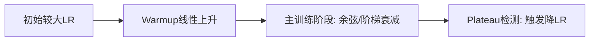

## 三、训练样本的顺序（为什么每轮都要打乱）
PDF 要点：
- 若样本顺序固定，梯度估计会产生偏差，可能导致收敛变差；通常每轮训练（每个 epoch）前随机打乱数据集（random shuffle）

扩展与实践建议：
- 分类任务：每个 epoch 打乱；类别极不平衡时考虑“分层采样（stratified）”
- 序列/时序：保持时间顺序或使用带状态的采样；NLP 变长序列可“同长分桶 + 桶内打乱”
- 分布漂移：注意训练/验证分布一致性；若有 curriculum learning（课程学习），按难度分阶段放样本是“有意的非随机”

## 四、病态的曲率（Pathological Curvature）
PDF 要点：
- 目标函数常呈现“狭长且浅的沟壑”（如 Rosenbrock 函数）；深网里局部最优常见此形态，标准 SGD 容易在沟壑两侧来回震荡，进展缓慢

直观解释（大白话）：
- 一个方向很陡（梯度巨大），另一个方向很平（梯度很小），SGD 会“左一下右一下”地晃，难以沿着“谷底方向”快速前进

应对策略（按优先级）
- 动量（Momentum）/Nesterov 动量：在“谷底方向”积累速度，减少横向抖动（PDF 接下来部分）
- 自适应优化：RMSProp/Adam 对坐标做自适应缩放，像“对角预条件”缓解曲率不均
- 学习率调度：先小 LR 稳住，再按策略衰减；或用 warmup 防止初期震荡
- 归一化/架构：BatchNorm/LayerNorm、残差连接，让优化地形更“平坦”
- 初始化：He/Xavier 保持方差稳定，减轻早期梯度失真
- 梯度裁剪：限制极端方向的梯度，防止爆炸

“沟壑 + 对策”示意
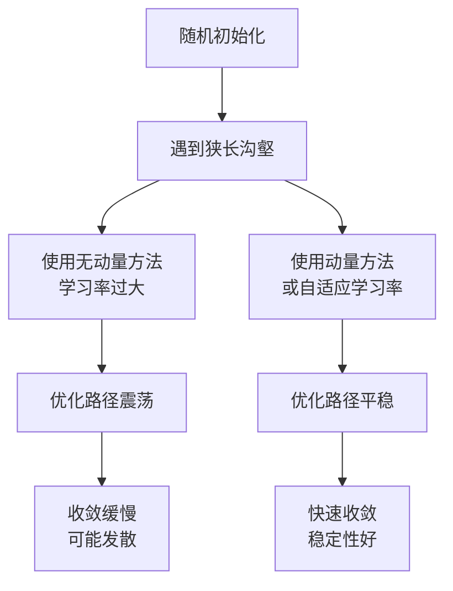

## 五、动量（Momentum）
PDF 核心公式与策略：
- 更新规则（重力球/重球法）：
  $$
  \mathbf{v} \leftarrow \gamma \mathbf{v} - \alpha \nabla_\theta J(\theta; x_i, t^{(i)}),\quad
  \theta \leftarrow \theta + \mathbf{v}
  $$
  其中 $\gamma\in(0,1]$ 决定历史梯度参与度；一种策略：先用 $\gamma=0.5$ 直到收敛开始稳定，再增大到 $0.9$ 或更大（PDF）
- 大白话：给优化器“惯性”。在谷底方向不断加速，在陡峭方向通过反向速度抵消来回震荡

Nesterov 动量（常见改进）
- 先按动量“预走一步”，再在“预估点”处计算梯度，更新更前瞻：
  $$
  \begin{aligned}
  \mathbf{v} &\leftarrow \gamma \mathbf{v} - \alpha \nabla_\theta J(\theta + \gamma \mathbf{v})\\
  \theta &\leftarrow \theta + \mathbf{v}
  \end{aligned}
  $$

动量数据流（简图）
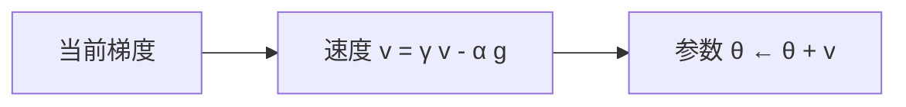

## 六、例子（可复现实验）
例子1：二维非线性分类（环形数据）对比动量/学习率
- 目标：验证“样本打乱的重要性、动量能减少震荡、合适 LR 提升收敛”
- 步骤：
  1) 生成两同心环数据，标准化输入
  2) MLP: 2-32-16-2，ReLU，Softmax+CE
  3) 对比三种配置（其余相同）
     - A. 无动量，LR=1e-2
     - B. 动量 γ=0.9，LR=5e-3
     - C. 动量 γ=0.9，LR=1e-2 + 每 10 epoch 减半；每个 epoch 打乱数据
  4) 观察收敛曲线与决策边界平滑度（C 通常最稳最优）

最小 PyTorch 训练片段（体现动量、样本打乱与调度）
```python
# pip install torch torchvision
import torch, torch.nn as nn, torch.nn.functional as F
from torch.utils.data import DataLoader, TensorDataset
import numpy as np

def make_rings(n=2000, r_in=1.0, r_out=2.0, noise=0.1):
    m = n//2
    ang1, ang2 = 2*np.pi*np.random.rand(m), 2*np.pi*np.random.rand(n-m)
    r1 = r_in + noise*np.random.randn(m); r2 = r_out + noise*np.random.randn(n-m)
    X1 = np.c_[r1*np.cos(ang1), r1*np.sin(ang1)]
    X2 = np.c_[r2*np.cos(ang2), r2*np.sin(ang2)]
    X = np.vstack([X1, X2]).astype(np.float32)
    y = np.r_[np.zeros(m, int), np.ones(n-m, int)]
    # 标准化
    X = (X - X.mean(0)) / (X.std(0) + 1e-8)
    return X, y

X, y = make_rings()
ds = TensorDataset(torch.from_numpy(X), torch.from_numpy(y))
loader = DataLoader(ds, batch_size=128, shuffle=True)  # 每轮打乱

class MLP(nn.Module):
    def __init__(self):
        super().__init__()
        self.fc1, self.fc2, self.fc3 = nn.Linear(2,32), nn.Linear(32,16), nn.Linear(16,2)
        nn.init.kaiming_normal_(self.fc1.weight, nonlinearity='relu')
        nn.init.kaiming_normal_(self.fc2.weight, nonlinearity='relu')
        nn.init.xavier_normal_(self.fc3.weight)
    def forward(self, x):
        x = F.relu(self.fc1(x)); x = F.relu(self.fc2(x)); return self.fc3(x)

device = 'cuda' if torch.cuda.is_available() else 'cpu'
model = MLP().to(device)
opt = torch.optim.SGD(model.parameters(), lr=1e-2, momentum=0.9)  # 动量
sched = torch.optim.lr_scheduler.StepLR(opt, step_size=10, gamma=0.5)  # 每10轮减半
crit = nn.CrossEntropyLoss()

for ep in range(1, 31):
    model.train()
    for xb, yb in loader:
        xb, yb = xb.to(device), yb.to(device)
        logits = model(xb)
        loss = crit(logits, yb)
        opt.zero_grad(); loss.backward(); opt.step()
    sched.step()
    if ep % 5 == 0:
        print(f"Epoch {ep:02d} lr={opt.param_groups[0]['lr']:.4g} loss={loss.item():.4f}")
```
- 观察：有动量 + LR 调度的组合，loss 降得更稳、更快；若去掉 shuffle，loss 常会抖动且收敛变慢（与 PDF 观点一致）

例子2：MNIST 初始化与学习率对比
- 对比1（初始化）：Tanh 网络用 Xavier vs He；观察 Xavier 更稳，He 对 Tanh 会略放大方差、初期不稳
- 对比2（LR 策略）：固定大 LR=1e-2 vs 自适应调度（ReduceLROnPlateau）；后者 plateau 时自动降 LR，一般更高效

伪代码要点：
- Tanh 模型：784-256-128-10，Xavier 初始化，优化器 Adam(lr=1e-3)
- 对照：同结构改用 ReLU + He 初始化；两者都跑 5~10 轮，比较收敛与测试精度

## 七、关键公式与小抄
- 初始化（推荐）
  - ReLU/LeakyReLU：$W\sim \mathcal{N}\!\big(0,\tfrac{2}{\text{fan\_in}}\big)$（He）
  - Tanh/Sigmoid：$W\sim \mathcal{U}\!\big(-\sqrt{\tfrac{6}{\text{fan\_in}+\text{fan\_out}}},\sqrt{\tfrac{6}{\text{fan\_in}+\text{fan\_out}}}\big)$（Xavier）
  - $b=0$
- 学习率（PDF 策略）
  - 起步小、平台期减半；或 $\alpha_t=\frac{a}{b+t}$；或基于留出集“改变量小于阈值则减 LR”
- 样本顺序（PDF）
  - 每个 epoch 随机打乱（random shuffle），降低梯度偏差
- 病态曲率（PDF）
  - 狭长沟壑导致震荡；动量/自适应优化/归一化/残差有助于“对齐谷底方向”
- 动量（PDF）
  - $\mathbf{v} \leftarrow \gamma \mathbf{v} - \alpha \nabla J,\ \theta \leftarrow \theta + \mathbf{v}$；先 $\gamma=0.5$，稳定后到 $0.9+$

## 八、额外提示（排障与调参顺序）
- 先把初始化、激活函数、损失函数搭配“标准化”：ReLU+He、Tanh+Xavier、Softmax+CE
- 保证 DataLoader 每轮打乱、标签与样本对齐
- 从略小的 LR 开始，确认 loss 单调下降后再加大；加入动量（0.9 是常用起点）
- 若训练初期不稳：加 warmup（前 500~1000 step 线性升 LR），或先用较小 LR
- loss 震荡大：减小 LR 或增大动量；检查是否忘记打乱
- 收敛慢：使用调度（Step/Cosine/Plateau），或换 Adam(lr=1e-3)

如果你希望，我可以基于你当前的 Python 环境，直接给出一版“对照实验脚本”，在同一数据上自动扫参数（初始化/学习率/动量），并汇总收敛曲线对比图，帮助快速确定你任务的最佳组合。