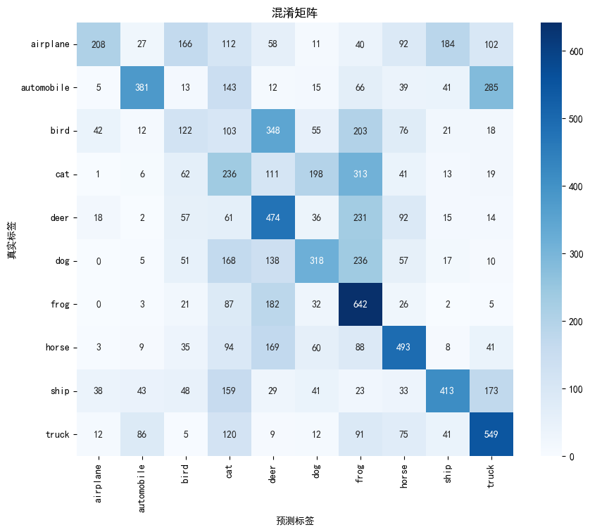
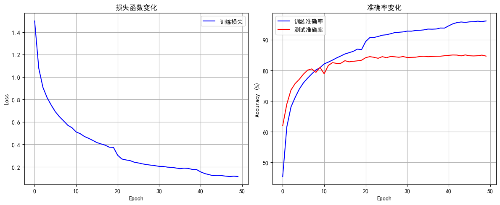
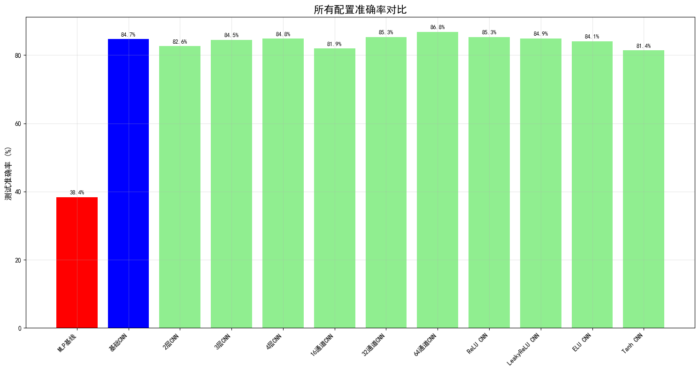
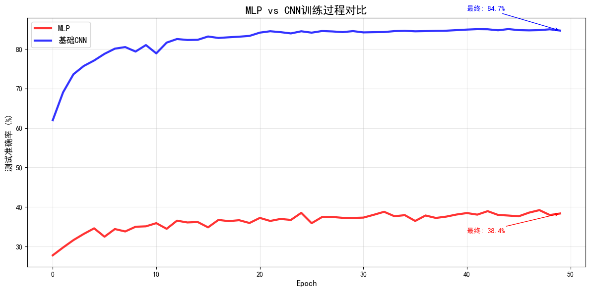
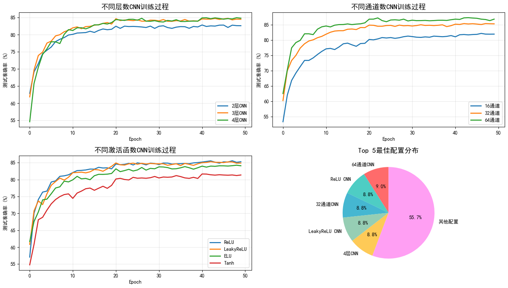

## 导入和设备配置


```python
import pickle
import numpy as np
import matplotlib.pyplot as plt
import torch
import torch.nn as nn
import torch.optim as optim
from torch.utils.data import DataLoader, TensorDataset
import torch.nn.functional as F
from sklearn.metrics import accuracy_score, classification_report, confusion_matrix
import seaborn as sns
import time
import os

# 检查CUDA可用性
device = torch.device('cuda' if torch.cuda.is_available() else 'cpu')
print(f"使用设备: {device}")
if torch.cuda.is_available():
    print(f"CUDA版本: {torch.version.cuda}")
    print(f"GPU设备: {torch.cuda.get_device_name()}")
```

    使用设备: cuda
    CUDA版本: 12.9
    GPU设备: NVIDIA GeForce RTX 4060 Laptop GPU
    

## 数据加载函数


```python
def load_cifar10_batch(file_path):
    """加载单个批次的CIFAR-10数据"""
    with open(file_path, 'rb') as fo:
        batch = pickle.load(fo, encoding='bytes')
    
    data = batch[b'data']
    labels = batch[b'labels']
    
    # 重塑数据: (10000, 3072) -> (10000, 3, 32, 32)
    data = data.reshape(10000, 3, 32, 32)
    
    return data, labels

def load_cifar10_data(data_dir):
    """加载完整的CIFAR-10数据集"""
    # 加载训练数据
    train_data = []
    train_labels = []
    
    for i in range(1, 6):
        batch_file = os.path.join(data_dir, f'data_batch_{i}')
        data, labels = load_cifar10_batch(batch_file)
        train_data.append(data)
        train_labels.extend(labels)
    
    train_data = np.vstack(train_data)
    train_labels = np.array(train_labels)
    
    # 加载测试数据
    test_file = os.path.join(data_dir, 'test_batch')
    test_data, test_labels = load_cifar10_batch(test_file)
    test_labels = np.array(test_labels)
    
    # 加载类别名称
    meta_file = os.path.join(data_dir, 'batches.meta')
    with open(meta_file, 'rb') as fo:
        meta = pickle.load(fo, encoding='bytes')
    class_names = [name.decode('utf-8') for name in meta[b'label_names']]
    
    return (train_data, train_labels), (test_data, test_labels), class_names

def preprocess_data(train_data, test_data, train_labels, test_labels):
    """数据预处理"""
    # 归一化到 [0, 1]
    train_data = train_data.astype(np.float32) / 255.0
    test_data = test_data.astype(np.float32) / 255.0
    
    # 转换为PyTorch张量
    train_data_cnn = torch.FloatTensor(train_data)
    test_data_cnn = torch.FloatTensor(test_data)
    
    # 标签转换
    train_labels = torch.LongTensor(train_labels)
    test_labels = torch.LongTensor(test_labels)
    
    return (train_data_cnn, train_labels), (test_data_cnn, test_labels)
```

## 数据加载和预处理


```python
# 加载和预处理数据
data_dir = './data/cifar-10-batches-py'
(train_data, train_labels), (test_data, test_labels), class_names = load_cifar10_data(data_dir)
(train_cnn, train_labels), (test_cnn, test_labels) = preprocess_data(train_data, test_data, train_labels, test_labels)

# 移动数据到GPU
train_cnn = train_cnn.to(device)
train_labels = train_labels.to(device)
test_cnn = test_cnn.to(device)
test_labels = test_labels.to(device)

# 为MLP准备扁平化数据
train_flat = train_cnn.view(train_cnn.size(0), -1)  # (50000, 3072)
test_flat = test_cnn.view(test_cnn.size(0), -1)     # (10000, 3072)

print("数据预处理完成，已移动到GPU")
print(f"CNN数据形状: 训练集{train_cnn.shape}, 测试集{test_cnn.shape}")
print(f"MLP数据形状: 训练集{train_flat.shape}, 测试集{test_flat.shape}")
```

    数据预处理完成，已移动到GPU
    CNN数据形状: 训练集torch.Size([50000, 3, 32, 32]), 测试集torch.Size([10000, 3, 32, 32])
    MLP数据形状: 训练集torch.Size([50000, 3072]), 测试集torch.Size([10000, 3072])
    

## MLP模型定义


```python
class MLP(nn.Module):
    """多层感知机模型"""
    def __init__(self, input_size=3072, hidden_sizes=[512, 256, 128], num_classes=10, dropout_rate=0.5):
        super(MLP, self).__init__()
        
        layers = []
        prev_size = input_size
        
        for hidden_size in hidden_sizes:
            layers.append(nn.Linear(prev_size, hidden_size))
            layers.append(nn.ReLU())
            layers.append(nn.Dropout(dropout_rate))
            prev_size = hidden_size
        
        layers.append(nn.Linear(prev_size, num_classes))
        
        self.network = nn.Sequential(*layers)
    
    def forward(self, x):
        return self.network(x)

# 创建MLP模型
mlp_model = MLP().to(device)
print("\nMLP模型结构:")
print(mlp_model)
```

    
    MLP模型结构:
    MLP(
      (network): Sequential(
        (0): Linear(in_features=3072, out_features=512, bias=True)
        (1): ReLU()
        (2): Dropout(p=0.5, inplace=False)
        (3): Linear(in_features=512, out_features=256, bias=True)
        (4): ReLU()
        (5): Dropout(p=0.5, inplace=False)
        (6): Linear(in_features=256, out_features=128, bias=True)
        (7): ReLU()
        (8): Dropout(p=0.5, inplace=False)
        (9): Linear(in_features=128, out_features=10, bias=True)
      )
    )
    

## CNN模型定义


```python
class ConvNet(nn.Module):
    """基础卷积神经网络模型"""
    def __init__(self, num_classes=10):
        super(ConvNet, self).__init__()
        
        # 第一个卷积块
        self.conv1 = nn.Conv2d(3, 32, kernel_size=3, padding=1)
        self.bn1 = nn.BatchNorm2d(32)
        self.conv2 = nn.Conv2d(32, 32, kernel_size=3, padding=1)
        self.bn2 = nn.BatchNorm2d(32)
        self.pool1 = nn.MaxPool2d(2, 2)
        self.dropout1 = nn.Dropout2d(0.25)
        
        # 第二个卷积块
        self.conv3 = nn.Conv2d(32, 64, kernel_size=3, padding=1)
        self.bn3 = nn.BatchNorm2d(64)
        self.conv4 = nn.Conv2d(64, 64, kernel_size=3, padding=1)
        self.bn4 = nn.BatchNorm2d(64)
        self.pool2 = nn.MaxPool2d(2, 2)
        self.dropout2 = nn.Dropout2d(0.25)
        
        # 第三个卷积块
        self.conv5 = nn.Conv2d(64, 128, kernel_size=3, padding=1)
        self.bn5 = nn.BatchNorm2d(128)
        self.conv6 = nn.Conv2d(128, 128, kernel_size=3, padding=1)
        self.bn6 = nn.BatchNorm2d(128)
        self.pool3 = nn.MaxPool2d(2, 2)
        self.dropout3 = nn.Dropout2d(0.25)
        
        # 全连接层
        self.fc1 = nn.Linear(128 * 4 * 4, 512)
        self.bn7 = nn.BatchNorm1d(512)
        self.dropout4 = nn.Dropout(0.5)
        self.fc2 = nn.Linear(512, num_classes)
    
    def forward(self, x):
        # 第一个卷积块
        x = F.relu(self.bn1(self.conv1(x)))
        x = F.relu(self.bn2(self.conv2(x)))
        x = self.pool1(x)
        x = self.dropout1(x)
        
        # 第二个卷积块
        x = F.relu(self.bn3(self.conv3(x)))
        x = F.relu(self.bn4(self.conv4(x)))
        x = self.pool2(x)
        x = self.dropout2(x)
        
        # 第三个卷积块
        x = F.relu(self.bn5(self.conv5(x)))
        x = F.relu(self.bn6(self.conv6(x)))
        x = self.pool3(x)
        x = self.dropout3(x)
        
        # 展平
        x = x.view(x.size(0), -1)
        
        # 全连接层
        x = F.relu(self.bn7(self.fc1(x)))
        x = self.dropout4(x)
        x = self.fc2(x)
        
        return x

# 创建CNN模型
cnn_model = ConvNet().to(device)
print("\nCNN模型结构:")
print(cnn_model)
```

    
    CNN模型结构:
    ConvNet(
      (conv1): Conv2d(3, 32, kernel_size=(3, 3), stride=(1, 1), padding=(1, 1))
      (bn1): BatchNorm2d(32, eps=1e-05, momentum=0.1, affine=True, track_running_stats=True)
      (conv2): Conv2d(32, 32, kernel_size=(3, 3), stride=(1, 1), padding=(1, 1))
      (bn2): BatchNorm2d(32, eps=1e-05, momentum=0.1, affine=True, track_running_stats=True)
      (pool1): MaxPool2d(kernel_size=2, stride=2, padding=0, dilation=1, ceil_mode=False)
      (dropout1): Dropout2d(p=0.25, inplace=False)
      (conv3): Conv2d(32, 64, kernel_size=(3, 3), stride=(1, 1), padding=(1, 1))
      (bn3): BatchNorm2d(64, eps=1e-05, momentum=0.1, affine=True, track_running_stats=True)
      (conv4): Conv2d(64, 64, kernel_size=(3, 3), stride=(1, 1), padding=(1, 1))
      (bn4): BatchNorm2d(64, eps=1e-05, momentum=0.1, affine=True, track_running_stats=True)
      (pool2): MaxPool2d(kernel_size=2, stride=2, padding=0, dilation=1, ceil_mode=False)
      (dropout2): Dropout2d(p=0.25, inplace=False)
      (conv5): Conv2d(64, 128, kernel_size=(3, 3), stride=(1, 1), padding=(1, 1))
      (bn5): BatchNorm2d(128, eps=1e-05, momentum=0.1, affine=True, track_running_stats=True)
      (conv6): Conv2d(128, 128, kernel_size=(3, 3), stride=(1, 1), padding=(1, 1))
      (bn6): BatchNorm2d(128, eps=1e-05, momentum=0.1, affine=True, track_running_stats=True)
      (pool3): MaxPool2d(kernel_size=2, stride=2, padding=0, dilation=1, ceil_mode=False)
      (dropout3): Dropout2d(p=0.25, inplace=False)
      (fc1): Linear(in_features=2048, out_features=512, bias=True)
      (bn7): BatchNorm1d(512, eps=1e-05, momentum=0.1, affine=True, track_running_stats=True)
      (dropout4): Dropout(p=0.5, inplace=False)
      (fc2): Linear(in_features=512, out_features=10, bias=True)
    )
    

## 可配置CNN模型定义


```python
class ConfigurableCNN(nn.Module):
    """可配置的CNN模型"""
    def __init__(self, num_layers=3, base_channels=32, activation='relu', num_classes=10):
        super(ConfigurableCNN, self).__init__()
        
        self.num_layers = num_layers
        self.base_channels = base_channels
        
        # 激活函数选择
        if activation == 'relu':
            self.activation = F.relu
        elif activation == 'leaky_relu':
            self.activation = lambda x: F.leaky_relu(x, 0.1)
        elif activation == 'elu':
            self.activation = F.elu
        elif activation == 'tanh':
            self.activation = torch.tanh
        
        # 构建网络层
        if num_layers == 2:
            # 2层CNN
            self.conv1 = nn.Conv2d(3, base_channels, kernel_size=3, padding=1)
            self.bn1 = nn.BatchNorm2d(base_channels)
            self.conv2 = nn.Conv2d(base_channels, base_channels, kernel_size=3, padding=1)
            self.bn2 = nn.BatchNorm2d(base_channels)
            self.pool1 = nn.MaxPool2d(2, 2)
            self.dropout1 = nn.Dropout2d(0.25)
            
            self.conv3 = nn.Conv2d(base_channels, base_channels*2, kernel_size=3, padding=1)
            self.bn3 = nn.BatchNorm2d(base_channels*2)
            self.conv4 = nn.Conv2d(base_channels*2, base_channels*2, kernel_size=3, padding=1)
            self.bn4 = nn.BatchNorm2d(base_channels*2)
            self.pool2 = nn.MaxPool2d(2, 2)
            self.dropout2 = nn.Dropout2d(0.25)
            
            self.fc1 = nn.Linear(base_channels*2 * 8 * 8, 512)
            
        elif num_layers == 4:
            # 4层CNN
            self.conv1 = nn.Conv2d(3, base_channels, kernel_size=3, padding=1)
            self.bn1 = nn.BatchNorm2d(base_channels)
            self.conv2 = nn.Conv2d(base_channels, base_channels, kernel_size=3, padding=1)
            self.bn2 = nn.BatchNorm2d(base_channels)
            self.pool1 = nn.MaxPool2d(2, 2)
            self.dropout1 = nn.Dropout2d(0.25)
            
            self.conv3 = nn.Conv2d(base_channels, base_channels*2, kernel_size=3, padding=1)
            self.bn3 = nn.BatchNorm2d(base_channels*2)
            self.conv4 = nn.Conv2d(base_channels*2, base_channels*2, kernel_size=3, padding=1)
            self.bn4 = nn.BatchNorm2d(base_channels*2)
            self.pool2 = nn.MaxPool2d(2, 2)
            self.dropout2 = nn.Dropout2d(0.25)
            
            self.conv5 = nn.Conv2d(base_channels*2, base_channels*4, kernel_size=3, padding=1)
            self.bn5 = nn.BatchNorm2d(base_channels*4)
            self.conv6 = nn.Conv2d(base_channels*4, base_channels*4, kernel_size=3, padding=1)
            self.bn6 = nn.BatchNorm2d(base_channels*4)
            self.pool3 = nn.MaxPool2d(2, 2)
            self.dropout3 = nn.Dropout2d(0.25)
            
            self.conv7 = nn.Conv2d(base_channels*4, base_channels*8, kernel_size=3, padding=1)
            self.bn7 = nn.BatchNorm2d(base_channels*8)
            self.conv8 = nn.Conv2d(base_channels*8, base_channels*8, kernel_size=3, padding=1)
            self.bn8 = nn.BatchNorm2d(base_channels*8)
            self.pool4 = nn.MaxPool2d(2, 2)
            self.dropout4 = nn.Dropout2d(0.25)
            
            self.fc1 = nn.Linear(base_channels*8 * 2 * 2, 512)
            
        else:  # 3层CNN（默认）
            self.conv1 = nn.Conv2d(3, base_channels, kernel_size=3, padding=1)
            self.bn1 = nn.BatchNorm2d(base_channels)
            self.conv2 = nn.Conv2d(base_channels, base_channels, kernel_size=3, padding=1)
            self.bn2 = nn.BatchNorm2d(base_channels)
            self.pool1 = nn.MaxPool2d(2, 2)
            self.dropout1 = nn.Dropout2d(0.25)
            
            self.conv3 = nn.Conv2d(base_channels, base_channels*2, kernel_size=3, padding=1)
            self.bn3 = nn.BatchNorm2d(base_channels*2)
            self.conv4 = nn.Conv2d(base_channels*2, base_channels*2, kernel_size=3, padding=1)
            self.bn4 = nn.BatchNorm2d(base_channels*2)
            self.pool2 = nn.MaxPool2d(2, 2)
            self.dropout2 = nn.Dropout2d(0.25)
            
            self.conv5 = nn.Conv2d(base_channels*2, base_channels*4, kernel_size=3, padding=1)
            self.bn5 = nn.BatchNorm2d(base_channels*4)
            self.conv6 = nn.Conv2d(base_channels*4, base_channels*4, kernel_size=3, padding=1)
            self.bn6 = nn.BatchNorm2d(base_channels*4)
            self.pool3 = nn.MaxPool2d(2, 2)
            self.dropout3 = nn.Dropout2d(0.25)
            
            self.fc1 = nn.Linear(base_channels*4 * 4 * 4, 512)
        
        # 公共全连接层
        self.bn_fc = nn.BatchNorm1d(512)
        self.dropout_fc = nn.Dropout(0.5)
        self.fc2 = nn.Linear(512, num_classes)
    
    def forward(self, x):
        # 第一个卷积块
        x = self.activation(self.bn1(self.conv1(x)))
        x = self.activation(self.bn2(self.conv2(x)))
        x = self.pool1(x)
        x = self.dropout1(x)
        
        # 第二个卷积块
        x = self.activation(self.bn3(self.conv3(x)))
        x = self.activation(self.bn4(self.conv4(x)))
        x = self.pool2(x)
        x = self.dropout2(x)
        
        if self.num_layers >= 3:
            # 第三个卷积块
            x = self.activation(self.bn5(self.conv5(x)))
            x = self.activation(self.bn6(self.conv6(x)))
            x = self.pool3(x)
            x = self.dropout3(x)
            
        if self.num_layers >= 4:
            # 第四个卷积块
            x = self.activation(self.bn7(self.conv7(x)))
            x = self.activation(self.bn8(self.conv8(x)))
            x = self.pool4(x)
            x = self.dropout4(x)
        
        # 展平
        x = x.view(x.size(0), -1)
        
        # 全连接层
        x = self.activation(self.bn_fc(self.fc1(x)))
        x = self.dropout_fc(x)
        x = self.fc2(x)
        
        return x

```

## 训练和评估函数


```python
def train_model(model, train_data, train_labels, test_data, test_labels, 
                num_epochs=50, batch_size=128, learning_rate=0.001):
    """训练模型"""
    # 创建数据加载器
    train_dataset = TensorDataset(train_data, train_labels)
    train_loader = DataLoader(train_dataset, batch_size=batch_size, shuffle=True)
    
    test_dataset = TensorDataset(test_data, test_labels)
    test_loader = DataLoader(test_dataset, batch_size=batch_size, shuffle=False)
    
    # 定义损失函数和优化器
    criterion = nn.CrossEntropyLoss()
    optimizer = optim.Adam(model.parameters(), lr=learning_rate, weight_decay=1e-4)
    scheduler = optim.lr_scheduler.StepLR(optimizer, step_size=20, gamma=0.5)
    
    # 训练历史
    train_losses = []
    train_accuracies = []
    test_accuracies = []
    
    print(f"开始训练，使用设备: {device}")
    start_time = time.time()
    
    for epoch in range(num_epochs):
        # 训练阶段
        model.train()
        train_loss = 0.0
        train_correct = 0
        train_total = 0
        
        for batch_data, batch_labels in train_loader:
            optimizer.zero_grad()
            outputs = model(batch_data)
            loss = criterion(outputs, batch_labels)
            loss.backward()
            optimizer.step()
            
            train_loss += loss.item()
            _, predicted = torch.max(outputs.data, 1)
            train_total += batch_labels.size(0)
            train_correct += (predicted == batch_labels).sum().item()
        
        # 测试阶段
        model.eval()
        test_correct = 0
        test_total = 0
        
        with torch.no_grad():
            for batch_data, batch_labels in test_loader:
                outputs = model(batch_data)
                _, predicted = torch.max(outputs.data, 1)
                test_total += batch_labels.size(0)
                test_correct += (predicted == batch_labels).sum().item()
        
        # 计算准确率
        train_accuracy = 100 * train_correct / train_total
        test_accuracy = 100 * test_correct / test_total
        avg_loss = train_loss / len(train_loader)
        
        # 保存历史
        train_losses.append(avg_loss)
        train_accuracies.append(train_accuracy)
        test_accuracies.append(test_accuracy)
        
        # 更新学习率
        scheduler.step()
        
        # 打印进度
        if (epoch + 1) % 5 == 0:
            print(f'Epoch [{epoch+1}/{num_epochs}], '
                  f'Loss: {avg_loss:.4f}, '
                  f'Train Acc: {train_accuracy:.2f}%, '
                  f'Test Acc: {test_accuracy:.2f}%')
    
    end_time = time.time()
    print(f"训练完成！总耗时: {end_time - start_time:.2f}秒")
    
    return train_losses, train_accuracies, test_accuracies

def evaluate_model(model, test_data, test_labels, class_names):
    """评估模型"""
    model.eval()
    
    test_dataset = TensorDataset(test_data, test_labels)
    test_loader = DataLoader(test_dataset, batch_size=128, shuffle=False)
    
    all_predictions = []
    all_labels = []
    
    with torch.no_grad():
        for batch_data, batch_labels in test_loader:
            outputs = model(batch_data)
            _, predicted = torch.max(outputs, 1)
            all_predictions.extend(predicted.cpu().numpy())
            all_labels.extend(batch_labels.cpu().numpy())
    
    # 计算准确率
    accuracy = accuracy_score(all_labels, all_predictions)
    print(f"测试准确率: {accuracy:.4f}")
    
    # 打印分类报告
    print("\n分类报告:")
    print(classification_report(all_labels, all_predictions, target_names=class_names))
    
    # 绘制混淆矩阵
    cm = confusion_matrix(all_labels, all_predictions)
    plt.figure(figsize=(10, 8))
    sns.heatmap(cm, annot=True, fmt='d', cmap='Blues', 
                xticklabels=class_names, yticklabels=class_names)
    plt.title('混淆矩阵')
    plt.ylabel('真实标签')
    plt.xlabel('预测标签')
    plt.show()
    
    return accuracy

def plot_training_history(train_losses, train_accuracies, test_accuracies):
    """绘制训练历史"""
    fig, (ax1, ax2) = plt.subplots(1, 2, figsize=(12, 5))
    
    # 损失函数变化
    ax1.plot(train_losses, 'b-', label='训练损失')
    ax1.set_title('损失函数变化')
    ax1.set_xlabel('Epoch')
    ax1.set_ylabel('Loss')
    ax1.legend()
    ax1.grid(True)
    
    # 准确率变化
    ax2.plot(train_accuracies, 'b-', label='训练准确率')
    ax2.plot(test_accuracies, 'r-', label='测试准确率')
    ax2.set_title('准确率变化')
    ax2.set_xlabel('Epoch')
    ax2.set_ylabel('Accuracy (%)')
    ax2.legend()
    ax2.grid(True)
    
    plt.tight_layout()
    plt.show()
```

## 训练MLP模型


```python
print("=" * 50)
print("训练MLP模型")
print("=" * 50)

mlp_train_losses, mlp_train_acc, mlp_test_acc = train_model(
    mlp_model, train_flat, train_labels, test_flat, test_labels,
    num_epochs=50, batch_size=128, learning_rate=0.001
)

# 绘制训练历史
plot_training_history(mlp_train_losses, mlp_train_acc, mlp_test_acc)

# 评估MLP模型
print("\nMLP模型评估结果:")
mlp_accuracy = evaluate_model(mlp_model, test_flat, test_labels, class_names)
```

    ==================================================
    训练MLP模型
    ==================================================
    开始训练，使用设备: cuda
    Epoch [5/50], Loss: 1.9291, Train Acc: 27.72%, Test Acc: 34.60%
    Epoch [10/50], Loss: 1.8791, Train Acc: 30.33%, Test Acc: 35.11%
    Epoch [15/50], Loss: 1.8573, Train Acc: 31.13%, Test Acc: 36.20%
    Epoch [20/50], Loss: 1.8460, Train Acc: 31.61%, Test Acc: 35.95%
    Epoch [25/50], Loss: 1.8046, Train Acc: 33.25%, Test Acc: 38.52%
    Epoch [30/50], Loss: 1.7926, Train Acc: 34.02%, Test Acc: 37.23%
    Epoch [35/50], Loss: 1.7865, Train Acc: 34.38%, Test Acc: 37.94%
    Epoch [40/50], Loss: 1.7774, Train Acc: 35.06%, Test Acc: 38.10%
    Epoch [45/50], Loss: 1.7581, Train Acc: 35.59%, Test Acc: 37.84%
    Epoch [50/50], Loss: 1.7504, Train Acc: 35.83%, Test Acc: 38.36%
    训练完成！总耗时: 48.56秒
    


    

    


    
    MLP模型评估结果:
    测试准确率: 0.3836
    
    分类报告:
                  precision    recall  f1-score   support
    
        airplane       0.64      0.21      0.31      1000
      automobile       0.66      0.38      0.48      1000
            bird       0.21      0.12      0.15      1000
             cat       0.18      0.24      0.21      1000
            deer       0.31      0.47      0.37      1000
             dog       0.41      0.32      0.36      1000
            frog       0.33      0.64      0.44      1000
           horse       0.48      0.49      0.49      1000
            ship       0.55      0.41      0.47      1000
           truck       0.45      0.55      0.50      1000
    
        accuracy                           0.38     10000
       macro avg       0.42      0.38      0.38     10000
    weighted avg       0.42      0.38      0.38     10000
    
    


    

    


## 训练基础CNN模型


```python
print("=" * 50)
print("训练基础CNN模型")
print("=" * 50)

cnn_train_losses, cnn_train_acc, cnn_test_acc = train_model(
    cnn_model, train_cnn, train_labels, test_cnn, test_labels,
    num_epochs=50, batch_size=128, learning_rate=0.001
)

# 绘制训练历史
plot_training_history(cnn_train_losses, cnn_train_acc, cnn_test_acc)

# 评估CNN模型
print("\n基础CNN模型评估结果:")
cnn_accuracy = evaluate_model(cnn_model, test_cnn, test_labels, class_names)
```

    ==================================================
    训练基础CNN模型
    ==================================================
    开始训练，使用设备: cuda
    Epoch [5/50], Loss: 0.7497, Train Acc: 73.89%, Test Acc: 77.10%
    Epoch [10/50], Loss: 0.5482, Train Acc: 80.92%, Test Acc: 81.00%
    Epoch [15/50], Loss: 0.4356, Train Acc: 84.70%, Test Acc: 82.33%
    Epoch [20/50], Loss: 0.3728, Train Acc: 86.77%, Test Acc: 83.32%
    Epoch [25/50], Loss: 0.2412, Train Acc: 91.49%, Test Acc: 84.49%
    Epoch [30/50], Loss: 0.2104, Train Acc: 92.55%, Test Acc: 84.53%
    Epoch [35/50], Loss: 0.1898, Train Acc: 93.21%, Test Acc: 84.61%
    Epoch [40/50], Loss: 0.1759, Train Acc: 93.81%, Test Acc: 84.78%
    Epoch [45/50], Loss: 0.1238, Train Acc: 95.66%, Test Acc: 85.05%
    Epoch [50/50], Loss: 0.1134, Train Acc: 96.12%, Test Acc: 84.67%
    训练完成！总耗时: 190.24秒
    


    

    


    
    基础CNN模型评估结果:
    测试准确率: 0.8467
    
    分类报告:
                  precision    recall  f1-score   support
    
        airplane       0.86      0.86      0.86      1000
      automobile       0.93      0.92      0.93      1000
            bird       0.81      0.75      0.78      1000
             cat       0.74      0.69      0.72      1000
            deer       0.82      0.85      0.83      1000
             dog       0.76      0.79      0.78      1000
            frog       0.86      0.89      0.88      1000
           horse       0.90      0.87      0.88      1000
            ship       0.89      0.92      0.90      1000
           truck       0.90      0.92      0.91      1000
    
        accuracy                           0.85     10000
       macro avg       0.85      0.85      0.85     10000
    weighted avg       0.85      0.85      0.85     10000
    
    


    

    


## 比较1 - 层数对比


```python
print("=" * 50)
print("比较1: CNN层数配置对比")
print("=" * 50)

# 训练2层CNN
print("\n训练2层CNN模型:")
model_2layers = ConfigurableCNN(num_layers=2, base_channels=32, activation='relu').to(device)
train_losses_2layers, train_acc_2layers, test_acc_2layers = train_model(
    model_2layers, train_cnn, train_labels, test_cnn, test_labels,
    num_epochs=50, batch_size=128, learning_rate=0.001
)

plot_training_history(train_losses_2layers, train_acc_2layers, test_acc_2layers)
print("\n2层CNN模型评估结果:")
accuracy_2layers = evaluate_model(model_2layers, test_cnn, test_labels, class_names)

# 训练3层CNN
print("=" * 50)
print("训练3层CNN模型:")
print("=" * 50)

model_3layers = ConfigurableCNN(num_layers=3, base_channels=32, activation='relu').to(device)
train_losses_3layers, train_acc_3layers, test_acc_3layers = train_model(
    model_3layers, train_cnn, train_labels, test_cnn, test_labels,
    num_epochs=50, batch_size=128, learning_rate=0.001
)

plot_training_history(train_losses_3layers, train_acc_3layers, test_acc_3layers)
print("\n3层CNN模型评估结果:")
accuracy_3layers = evaluate_model(model_3layers, test_cnn, test_labels, class_names)

# 训练4层CNN
print("=" * 50)
print("训练4层CNN模型:")
print("=" * 50)

model_4layers = ConfigurableCNN(num_layers=4, base_channels=32, activation='relu').to(device)
train_losses_4layers, train_acc_4layers, test_acc_4layers = train_model(
    model_4layers, train_cnn, train_labels, test_cnn, test_labels,
    num_epochs=50, batch_size=128, learning_rate=0.001
)

plot_training_history(train_losses_4layers, train_acc_4layers, test_acc_4layers)
print("\n4层CNN模型评估结果:")
accuracy_4layers = evaluate_model(model_4layers, test_cnn, test_labels, class_names)
```

    ==================================================
    比较1: CNN层数配置对比
    ==================================================
    
    训练2层CNN模型:
    开始训练，使用设备: cuda
    Epoch [5/50], Loss: 0.7766, Train Acc: 72.73%, Test Acc: 75.48%
    Epoch [10/50], Loss: 0.5797, Train Acc: 79.62%, Test Acc: 79.92%
    Epoch [15/50], Loss: 0.4601, Train Acc: 83.85%, Test Acc: 81.01%
    Epoch [20/50], Loss: 0.3854, Train Acc: 86.41%, Test Acc: 81.59%
    Epoch [25/50], Loss: 0.2564, Train Acc: 91.15%, Test Acc: 82.42%
    Epoch [30/50], Loss: 0.2222, Train Acc: 92.31%, Test Acc: 81.85%
    Epoch [35/50], Loss: 0.2036, Train Acc: 92.81%, Test Acc: 82.21%
    Epoch [40/50], Loss: 0.1897, Train Acc: 93.42%, Test Acc: 82.27%
    Epoch [45/50], Loss: 0.1365, Train Acc: 95.44%, Test Acc: 82.79%
    Epoch [50/50], Loss: 0.1239, Train Acc: 95.80%, Test Acc: 82.63%
    训练完成！总耗时: 161.48秒
    


    

    


    
    2层CNN模型评估结果:
    测试准确率: 0.8263
    
    分类报告:
                  precision    recall  f1-score   support
    
        airplane       0.84      0.85      0.85      1000
      automobile       0.90      0.92      0.91      1000
            bird       0.80      0.70      0.75      1000
             cat       0.70      0.65      0.68      1000
            deer       0.79      0.82      0.80      1000
             dog       0.76      0.76      0.76      1000
            frog       0.82      0.90      0.85      1000
           horse       0.85      0.89      0.87      1000
            ship       0.90      0.88      0.89      1000
           truck       0.88      0.90      0.89      1000
    
        accuracy                           0.83     10000
       macro avg       0.83      0.83      0.82     10000
    weighted avg       0.83      0.83      0.82     10000
    
    


    

    


    ==================================================
    训练3层CNN模型:
    ==================================================
    开始训练，使用设备: cuda
    Epoch [5/50], Loss: 0.7395, Train Acc: 74.18%, Test Acc: 77.57%
    Epoch [10/50], Loss: 0.5431, Train Acc: 81.07%, Test Acc: 81.31%
    Epoch [15/50], Loss: 0.4340, Train Acc: 84.94%, Test Acc: 82.45%
    Epoch [20/50], Loss: 0.3696, Train Acc: 87.00%, Test Acc: 83.11%
    Epoch [25/50], Loss: 0.2429, Train Acc: 91.41%, Test Acc: 84.11%
    Epoch [30/50], Loss: 0.2077, Train Acc: 92.68%, Test Acc: 84.22%
    Epoch [35/50], Loss: 0.1911, Train Acc: 93.21%, Test Acc: 84.10%
    Epoch [40/50], Loss: 0.1724, Train Acc: 93.95%, Test Acc: 83.96%
    Epoch [45/50], Loss: 0.1207, Train Acc: 95.77%, Test Acc: 84.46%
    Epoch [50/50], Loss: 0.1130, Train Acc: 96.04%, Test Acc: 84.49%
    训练完成！总耗时: 193.35秒
    


    

    


    
    3层CNN模型评估结果:
    测试准确率: 0.8449
    
    分类报告:
                  precision    recall  f1-score   support
    
        airplane       0.86      0.87      0.87      1000
      automobile       0.94      0.92      0.93      1000
            bird       0.83      0.76      0.80      1000
             cat       0.72      0.67      0.70      1000
            deer       0.83      0.83      0.83      1000
             dog       0.74      0.78      0.76      1000
            frog       0.83      0.91      0.87      1000
           horse       0.89      0.87      0.88      1000
            ship       0.89      0.92      0.91      1000
           truck       0.90      0.91      0.91      1000
    
        accuracy                           0.84     10000
       macro avg       0.84      0.84      0.84     10000
    weighted avg       0.84      0.84      0.84     10000
    
    


    

    


    ==================================================
    训练4层CNN模型:
    ==================================================
    开始训练，使用设备: cuda
    Epoch [5/50], Loss: 0.7714, Train Acc: 73.09%, Test Acc: 75.89%
    Epoch [10/50], Loss: 0.5345, Train Acc: 81.43%, Test Acc: 81.49%
    Epoch [15/50], Loss: 0.4115, Train Acc: 85.76%, Test Acc: 82.17%
    Epoch [20/50], Loss: 0.3169, Train Acc: 88.96%, Test Acc: 83.55%
    Epoch [25/50], Loss: 0.1727, Train Acc: 93.93%, Test Acc: 84.50%
    Epoch [30/50], Loss: 0.1475, Train Acc: 94.85%, Test Acc: 84.09%
    Epoch [35/50], Loss: 0.1277, Train Acc: 95.56%, Test Acc: 84.37%
    Epoch [40/50], Loss: 0.1174, Train Acc: 95.87%, Test Acc: 83.95%
    Epoch [45/50], Loss: 0.0667, Train Acc: 97.75%, Test Acc: 84.74%
    Epoch [50/50], Loss: 0.0564, Train Acc: 98.09%, Test Acc: 84.82%
    训练完成！总耗时: 228.69秒
    


    

    


    
    4层CNN模型评估结果:
    测试准确率: 0.8482
    
    分类报告:
                  precision    recall  f1-score   support
    
        airplane       0.87      0.87      0.87      1000
      automobile       0.92      0.93      0.92      1000
            bird       0.81      0.76      0.78      1000
             cat       0.73      0.69      0.71      1000
            deer       0.80      0.87      0.83      1000
             dog       0.79      0.78      0.78      1000
            frog       0.86      0.90      0.88      1000
           horse       0.89      0.88      0.89      1000
            ship       0.91      0.90      0.90      1000
           truck       0.91      0.90      0.90      1000
    
        accuracy                           0.85     10000
       macro avg       0.85      0.85      0.85     10000
    weighted avg       0.85      0.85      0.85     10000
    
    


    

    


## 比较2 - 卷积核数对比


```python
print("=" * 50)
print("比较2: 卷积核数配置对比")
print("=" * 50)

# 训练16通道CNN
print("\n训练16通道CNN模型:")
model_16ch = ConfigurableCNN(num_layers=3, base_channels=16, activation='relu').to(device)
train_losses_16ch, train_acc_16ch, test_acc_16ch = train_model(
    model_16ch, train_cnn, train_labels, test_cnn, test_labels,
    num_epochs=50, batch_size=128, learning_rate=0.001
)

plot_training_history(train_losses_16ch, train_acc_16ch, test_acc_16ch)
print("\n16通道CNN模型评估结果:")
accuracy_16ch = evaluate_model(model_16ch, test_cnn, test_labels, class_names)

# 训练32通道CNN
print("=" * 50)
print("训练32通道CNN模型:")
print("=" * 50)

model_32ch = ConfigurableCNN(num_layers=3, base_channels=32, activation='relu').to(device)
train_losses_32ch, train_acc_32ch, test_acc_32ch = train_model(
    model_32ch, train_cnn, train_labels, test_cnn, test_labels,
    num_epochs=50, batch_size=128, learning_rate=0.001
)

plot_training_history(train_losses_32ch, train_acc_32ch, test_acc_32ch)
print("\n32通道CNN模型评估结果:")
accuracy_32ch = evaluate_model(model_32ch, test_cnn, test_labels, class_names)

# 训练64通道CNN
print("=" * 50)
print("训练64通道CNN模型:")
print("=" * 50)

model_64ch = ConfigurableCNN(num_layers=3, base_channels=64, activation='relu').to(device)
train_losses_64ch, train_acc_64ch, test_acc_64ch = train_model(
    model_64ch, train_cnn, train_labels, test_cnn, test_labels,
    num_epochs=50, batch_size=128, learning_rate=0.001
)

plot_training_history(train_losses_64ch, train_acc_64ch, test_acc_64ch)
print("\n64通道CNN模型评估结果:")
accuracy_64ch = evaluate_model(model_64ch, test_cnn, test_labels, class_names)
```

    ==================================================
    比较2: 卷积核数配置对比
    ==================================================
    
    训练16通道CNN模型:
    开始训练，使用设备: cuda
    Epoch [5/50], Loss: 0.9736, Train Acc: 65.49%, Test Acc: 71.31%
    Epoch [10/50], Loss: 0.7886, Train Acc: 72.43%, Test Acc: 76.28%
    Epoch [15/50], Loss: 0.6919, Train Acc: 75.77%, Test Acc: 78.77%
    Epoch [20/50], Loss: 0.6386, Train Acc: 77.90%, Test Acc: 78.92%
    Epoch [25/50], Loss: 0.5412, Train Acc: 80.98%, Test Acc: 80.66%
    Epoch [30/50], Loss: 0.5093, Train Acc: 82.14%, Test Acc: 81.28%
    Epoch [35/50], Loss: 0.4822, Train Acc: 83.17%, Test Acc: 80.91%
    Epoch [40/50], Loss: 0.4705, Train Acc: 83.47%, Test Acc: 81.45%
    Epoch [45/50], Loss: 0.4206, Train Acc: 85.19%, Test Acc: 81.79%
    Epoch [50/50], Loss: 0.3972, Train Acc: 85.97%, Test Acc: 81.93%
    训练完成！总耗时: 125.31秒
    


    

    


    
    16通道CNN模型评估结果:
    测试准确率: 0.8193
    
    分类报告:
                  precision    recall  f1-score   support
    
        airplane       0.85      0.84      0.84      1000
      automobile       0.94      0.90      0.92      1000
            bird       0.79      0.70      0.74      1000
             cat       0.69      0.64      0.66      1000
            deer       0.74      0.84      0.79      1000
             dog       0.75      0.72      0.73      1000
            frog       0.81      0.90      0.85      1000
           horse       0.88      0.84      0.86      1000
            ship       0.88      0.90      0.89      1000
           truck       0.87      0.90      0.88      1000
    
        accuracy                           0.82     10000
       macro avg       0.82      0.82      0.82     10000
    weighted avg       0.82      0.82      0.82     10000
    
    


    

    


    ==================================================
    训练32通道CNN模型:
    ==================================================
    开始训练，使用设备: cuda
    Epoch [5/50], Loss: 0.7438, Train Acc: 73.99%, Test Acc: 77.37%
    Epoch [10/50], Loss: 0.5452, Train Acc: 81.02%, Test Acc: 81.19%
    Epoch [15/50], Loss: 0.4388, Train Acc: 84.49%, Test Acc: 83.05%
    Epoch [20/50], Loss: 0.3703, Train Acc: 86.96%, Test Acc: 84.05%
    Epoch [25/50], Loss: 0.2407, Train Acc: 91.50%, Test Acc: 84.73%
    Epoch [30/50], Loss: 0.2123, Train Acc: 92.38%, Test Acc: 84.72%
    Epoch [35/50], Loss: 0.1909, Train Acc: 93.07%, Test Acc: 84.82%
    Epoch [40/50], Loss: 0.1743, Train Acc: 93.82%, Test Acc: 84.69%
    Epoch [45/50], Loss: 0.1252, Train Acc: 95.68%, Test Acc: 85.33%
    Epoch [50/50], Loss: 0.1112, Train Acc: 96.04%, Test Acc: 85.29%
    训练完成！总耗时: 194.27秒
    


    

    


    
    32通道CNN模型评估结果:
    测试准确率: 0.8529
    
    分类报告:
                  precision    recall  f1-score   support
    
        airplane       0.86      0.87      0.86      1000
      automobile       0.94      0.93      0.93      1000
            bird       0.80      0.77      0.79      1000
             cat       0.74      0.68      0.71      1000
            deer       0.84      0.83      0.84      1000
             dog       0.79      0.81      0.80      1000
            frog       0.86      0.91      0.88      1000
           horse       0.88      0.89      0.88      1000
            ship       0.91      0.92      0.91      1000
           truck       0.89      0.93      0.91      1000
    
        accuracy                           0.85     10000
       macro avg       0.85      0.85      0.85     10000
    weighted avg       0.85      0.85      0.85     10000
    
    


    

    


    ==================================================
    训练64通道CNN模型:
    ==================================================
    开始训练，使用设备: cuda
    Epoch [5/50], Loss: 0.6191, Train Acc: 78.43%, Test Acc: 79.89%
    Epoch [10/50], Loss: 0.4003, Train Acc: 86.07%, Test Acc: 84.31%
    Epoch [15/50], Loss: 0.2785, Train Acc: 90.31%, Test Acc: 85.07%
    Epoch [20/50], Loss: 0.2077, Train Acc: 92.68%, Test Acc: 85.61%
    Epoch [25/50], Loss: 0.0891, Train Acc: 96.99%, Test Acc: 85.98%
    Epoch [30/50], Loss: 0.0865, Train Acc: 97.15%, Test Acc: 86.23%
    Epoch [35/50], Loss: 0.0818, Train Acc: 97.17%, Test Acc: 86.29%
    Epoch [40/50], Loss: 0.0731, Train Acc: 97.47%, Test Acc: 86.63%
    Epoch [45/50], Loss: 0.0334, Train Acc: 98.96%, Test Acc: 87.19%
    Epoch [50/50], Loss: 0.0316, Train Acc: 98.94%, Test Acc: 86.83%
    训练完成！总耗时: 496.07秒
    


    

    


    
    64通道CNN模型评估结果:
    测试准确率: 0.8683
    
    分类报告:
                  precision    recall  f1-score   support
    
        airplane       0.88      0.88      0.88      1000
      automobile       0.93      0.94      0.94      1000
            bird       0.86      0.78      0.82      1000
             cat       0.77      0.73      0.75      1000
            deer       0.83      0.88      0.85      1000
             dog       0.80      0.82      0.81      1000
            frog       0.87      0.92      0.89      1000
           horse       0.91      0.89      0.90      1000
            ship       0.92      0.93      0.92      1000
           truck       0.91      0.92      0.92      1000
    
        accuracy                           0.87     10000
       macro avg       0.87      0.87      0.87     10000
    weighted avg       0.87      0.87      0.87     10000
    
    


    

    


## 比较3 - 激活函数对比


```python
print("=" * 50)
print("比较: 激活函数配置对比")
print("=" * 50)

# 训练ReLU激活函数CNN
print("\n训练ReLU激活函数CNN模型:")
model_relu = ConfigurableCNN(num_layers=3, base_channels=32, activation='relu').to(device)
train_losses_relu, train_acc_relu, test_acc_relu = train_model(
    model_relu, train_cnn, train_labels, test_cnn, test_labels,
    num_epochs=50, batch_size=128, learning_rate=0.001
)

plot_training_history(train_losses_relu, train_acc_relu, test_acc_relu)
print("\nReLU激活函数CNN模型评估结果:")
accuracy_relu = evaluate_model(model_relu, test_cnn, test_labels, class_names)

# 训练LeakyReLU激活函数CNN
print("=" * 50)
print("训练LeakyReLU激活函数CNN模型:")
print("=" * 50)

model_leaky_relu = ConfigurableCNN(num_layers=3, base_channels=32, activation='leaky_relu').to(device)
train_losses_leaky_relu, train_acc_leaky_relu, test_acc_leaky_relu = train_model(
    model_leaky_relu, train_cnn, train_labels, test_cnn, test_labels,
    num_epochs=50, batch_size=128, learning_rate=0.001
)

plot_training_history(train_losses_leaky_relu, train_acc_leaky_relu, test_acc_leaky_relu)
print("\nLeakyReLU激活函数CNN模型评估结果:")
accuracy_leaky_relu = evaluate_model(model_leaky_relu, test_cnn, test_labels, class_names)

# 训练ELU激活函数CNN
print("=" * 50)
print("训练ELU激活函数CNN模型:")
print("=" * 50)

model_elu = ConfigurableCNN(num_layers=3, base_channels=32, activation='elu').to(device)
train_losses_elu, train_acc_elu, test_acc_elu = train_model(
    model_elu, train_cnn, train_labels, test_cnn, test_labels,
    num_epochs=50, batch_size=128, learning_rate=0.001
)

plot_training_history(train_losses_elu, train_acc_elu, test_acc_elu)
print("\nELU激活函数CNN模型评估结果:")
accuracy_elu = evaluate_model(model_elu, test_cnn, test_labels, class_names)

# 训练Tanh激活函数CNN
print("=" * 50)
print("训练Tanh激活函数CNN模型:")
print("=" * 50)

model_tanh = ConfigurableCNN(num_layers=3, base_channels=32, activation='tanh').to(device)
train_losses_tanh, train_acc_tanh, test_acc_tanh = train_model(
    model_tanh, train_cnn, train_labels, test_cnn, test_labels,
    num_epochs=50, batch_size=128, learning_rate=0.001
)

plot_training_history(train_losses_tanh, train_acc_tanh, test_acc_tanh)
print("\nTanh激活函数CNN模型评估结果:")
accuracy_tanh = evaluate_model(model_tanh, test_cnn, test_labels, class_names)
```

    ==================================================
    比较: 激活函数配置对比
    ==================================================
    
    训练ReLU激活函数CNN模型:
    开始训练，使用设备: cuda
    Epoch [5/50], Loss: 0.7469, Train Acc: 73.93%, Test Acc: 76.62%
    Epoch [10/50], Loss: 0.5476, Train Acc: 80.85%, Test Acc: 81.43%
    Epoch [15/50], Loss: 0.4394, Train Acc: 84.58%, Test Acc: 83.13%
    Epoch [20/50], Loss: 0.3634, Train Acc: 87.36%, Test Acc: 83.20%
    Epoch [25/50], Loss: 0.2392, Train Acc: 91.59%, Test Acc: 84.34%
    Epoch [30/50], Loss: 0.2089, Train Acc: 92.65%, Test Acc: 84.76%
    Epoch [35/50], Loss: 0.1943, Train Acc: 93.14%, Test Acc: 84.70%
    Epoch [40/50], Loss: 0.1782, Train Acc: 93.72%, Test Acc: 85.06%
    Epoch [45/50], Loss: 0.1265, Train Acc: 95.54%, Test Acc: 84.89%
    Epoch [50/50], Loss: 0.1135, Train Acc: 96.10%, Test Acc: 85.31%
    训练完成！总耗时: 194.55秒
    


    

    


    
    ReLU激活函数CNN模型评估结果:
    测试准确率: 0.8531
    
    分类报告:
                  precision    recall  f1-score   support
    
        airplane       0.85      0.89      0.87      1000
      automobile       0.93      0.92      0.92      1000
            bird       0.82      0.76      0.79      1000
             cat       0.77      0.69      0.73      1000
            deer       0.83      0.85      0.84      1000
             dog       0.76      0.81      0.78      1000
            frog       0.86      0.91      0.88      1000
           horse       0.88      0.89      0.89      1000
            ship       0.92      0.91      0.91      1000
           truck       0.90      0.91      0.91      1000
    
        accuracy                           0.85     10000
       macro avg       0.85      0.85      0.85     10000
    weighted avg       0.85      0.85      0.85     10000
    
    


    

    


    ==================================================
    训练LeakyReLU激活函数CNN模型:
    ==================================================
    开始训练，使用设备: cuda
    Epoch [5/50], Loss: 0.7648, Train Acc: 73.26%, Test Acc: 75.82%
    Epoch [10/50], Loss: 0.5601, Train Acc: 80.45%, Test Acc: 80.71%
    Epoch [15/50], Loss: 0.4501, Train Acc: 84.11%, Test Acc: 82.32%
    Epoch [20/50], Loss: 0.3854, Train Acc: 86.23%, Test Acc: 83.95%
    Epoch [25/50], Loss: 0.2587, Train Acc: 90.91%, Test Acc: 84.89%
    Epoch [30/50], Loss: 0.2193, Train Acc: 92.33%, Test Acc: 84.71%
    Epoch [35/50], Loss: 0.2034, Train Acc: 92.74%, Test Acc: 84.70%
    Epoch [40/50], Loss: 0.1851, Train Acc: 93.33%, Test Acc: 84.69%
    Epoch [45/50], Loss: 0.1297, Train Acc: 95.46%, Test Acc: 85.13%
    Epoch [50/50], Loss: 0.1205, Train Acc: 95.74%, Test Acc: 84.92%
    训练完成！总耗时: 196.10秒
    


    

    


    
    LeakyReLU激活函数CNN模型评估结果:
    测试准确率: 0.8492
    
    分类报告:
                  precision    recall  f1-score   support
    
        airplane       0.87      0.89      0.88      1000
      automobile       0.93      0.93      0.93      1000
            bird       0.85      0.74      0.79      1000
             cat       0.74      0.66      0.70      1000
            deer       0.79      0.86      0.83      1000
             dog       0.75      0.80      0.77      1000
            frog       0.86      0.91      0.88      1000
           horse       0.89      0.87      0.88      1000
            ship       0.92      0.92      0.92      1000
           truck       0.89      0.93      0.91      1000
    
        accuracy                           0.85     10000
       macro avg       0.85      0.85      0.85     10000
    weighted avg       0.85      0.85      0.85     10000
    
    


    

    


    ==================================================
    训练ELU激活函数CNN模型:
    ==================================================
    开始训练，使用设备: cuda
    Epoch [5/50], Loss: 0.8040, Train Acc: 71.75%, Test Acc: 74.23%
    Epoch [10/50], Loss: 0.6306, Train Acc: 77.82%, Test Acc: 79.33%
    Epoch [15/50], Loss: 0.5320, Train Acc: 81.34%, Test Acc: 79.98%
    Epoch [20/50], Loss: 0.4753, Train Acc: 83.54%, Test Acc: 81.83%
    Epoch [25/50], Loss: 0.3396, Train Acc: 88.04%, Test Acc: 82.56%
    Epoch [30/50], Loss: 0.3034, Train Acc: 89.10%, Test Acc: 83.22%
    Epoch [35/50], Loss: 0.2717, Train Acc: 90.30%, Test Acc: 83.23%
    Epoch [40/50], Loss: 0.2545, Train Acc: 91.01%, Test Acc: 83.52%
    Epoch [45/50], Loss: 0.1881, Train Acc: 93.17%, Test Acc: 84.10%
    Epoch [50/50], Loss: 0.1759, Train Acc: 93.67%, Test Acc: 84.11%
    训练完成！总耗时: 197.70秒
    


    

    


    
    ELU激活函数CNN模型评估结果:
    测试准确率: 0.8411
    
    分类报告:
                  precision    recall  f1-score   support
    
        airplane       0.87      0.84      0.86      1000
      automobile       0.93      0.93      0.93      1000
            bird       0.80      0.75      0.77      1000
             cat       0.72      0.70      0.71      1000
            deer       0.82      0.82      0.82      1000
             dog       0.79      0.75      0.77      1000
            frog       0.83      0.92      0.87      1000
           horse       0.89      0.86      0.87      1000
            ship       0.88      0.93      0.90      1000
           truck       0.89      0.92      0.90      1000
    
        accuracy                           0.84     10000
       macro avg       0.84      0.84      0.84     10000
    weighted avg       0.84      0.84      0.84     10000
    
    


    

    


    ==================================================
    训练Tanh激活函数CNN模型:
    ==================================================
    开始训练，使用设备: cuda
    Epoch [5/50], Loss: 0.9221, Train Acc: 67.39%, Test Acc: 70.99%
    Epoch [10/50], Loss: 0.7470, Train Acc: 73.68%, Test Acc: 75.79%
    Epoch [15/50], Loss: 0.6448, Train Acc: 77.44%, Test Acc: 77.51%
    Epoch [20/50], Loss: 0.5730, Train Acc: 79.98%, Test Acc: 78.31%
    Epoch [25/50], Loss: 0.4311, Train Acc: 84.95%, Test Acc: 80.68%
    Epoch [30/50], Loss: 0.3943, Train Acc: 85.96%, Test Acc: 80.94%
    Epoch [35/50], Loss: 0.3625, Train Acc: 87.09%, Test Acc: 81.20%
    Epoch [40/50], Loss: 0.3385, Train Acc: 87.99%, Test Acc: 80.36%
    Epoch [45/50], Loss: 0.2545, Train Acc: 90.89%, Test Acc: 81.45%
    Epoch [50/50], Loss: 0.2363, Train Acc: 91.53%, Test Acc: 81.38%
    训练完成！总耗时: 198.86秒
    


    

    


    
    Tanh激活函数CNN模型评估结果:
    测试准确率: 0.8138
    
    分类报告:
                  precision    recall  f1-score   support
    
        airplane       0.82      0.82      0.82      1000
      automobile       0.90      0.91      0.91      1000
            bird       0.75      0.73      0.74      1000
             cat       0.68      0.64      0.66      1000
            deer       0.78      0.79      0.79      1000
             dog       0.74      0.73      0.74      1000
            frog       0.84      0.88      0.86      1000
           horse       0.87      0.85      0.86      1000
            ship       0.86      0.91      0.88      1000
           truck       0.88      0.87      0.88      1000
    
        accuracy                           0.81     10000
       macro avg       0.81      0.81      0.81     10000
    weighted avg       0.81      0.81      0.81     10000
    
    


    

    


## 综合对比分析


```python
def comprehensive_comparison_separate_plots():
    """完整的模型配置比较 - 分开的图表"""
    print("=" * 60)
    print("完整配置性能比较")
    print("=" * 60)
    
    # 收集所有结果
    all_results = {
        'MLP基线': mlp_test_acc[-1],
        '基础CNN': cnn_test_acc[-1],
        '2层CNN': test_acc_2layers[-1],
        '3层CNN': test_acc_3layers[-1], 
        '4层CNN': test_acc_4layers[-1],
        '16通道CNN': test_acc_16ch[-1],
        '32通道CNN': test_acc_32ch[-1],
        '64通道CNN': test_acc_64ch[-1],
        'ReLU CNN': test_acc_relu[-1],
        'LeakyReLU CNN': test_acc_leaky_relu[-1],
        'ELU CNN': test_acc_elu[-1],
        'Tanh CNN': test_acc_tanh[-1]
    }
    
    # 打印结果排序
    sorted_results = sorted(all_results.items(), key=lambda x: x[1], reverse=True)
    
    print("\n性能排行榜:")
    print("-" * 40)
    for i, (model_name, accuracy) in enumerate(sorted_results):
        print(f"{i+1:2d}. {model_name:15s}: {accuracy:6.2f}%")
    
    print("\n分类别对比:")
    print("-" * 40)
    print("层数配置比较:")
    print(f"  2层CNN: {test_acc_2layers[-1]:.2f}%")
    print(f"  3层CNN: {test_acc_3layers[-1]:.2f}%")
    print(f"  4层CNN: {test_acc_4layers[-1]:.2f}%")
    
    print("\n卷积核数配置比较:")
    print(f"  16通道CNN: {test_acc_16ch[-1]:.2f}%")
    print(f"  32通道CNN: {test_acc_32ch[-1]:.2f}%")
    print(f"  64通道CNN: {test_acc_64ch[-1]:.2f}%")
    
    print("\n激活函数配置比较:")
    print(f"  ReLU CNN: {test_acc_relu[-1]:.2f}%")
    print(f"  LeakyReLU CNN: {test_acc_leaky_relu[-1]:.2f}%")
    print(f"  ELU CNN: {test_acc_elu[-1]:.2f}%")
    print(f"  Tanh CNN: {test_acc_tanh[-1]:.2f}%")
    
    print(f"\nMLP vs CNN基线对比:")
    print(f"  MLP基线: {mlp_test_acc[-1]:.2f}%")
    print(f"  CNN基线: {cnn_test_acc[-1]:.2f}%")
    print(f"  CNN相对MLP提升: {cnn_test_acc[-1] - mlp_test_acc[-1]:.2f}%")
    
    # 图1: 所有模型准确率对比
    plt.figure(figsize=(15, 8))
    models = list(all_results.keys())
    accuracies = list(all_results.values())
    colors = ['red', 'blue'] + ['lightgreen'] * (len(models) - 2)  # MLP红色，基础CNN蓝色
    
    bars = plt.bar(models, accuracies, color=colors)
    plt.title('所有配置准确率对比', fontsize=16, fontweight='bold')
    plt.ylabel('测试准确率 (%)', fontsize=12)
    plt.xticks(rotation=45, ha='right', fontsize=10)
    plt.yticks(fontsize=10)
    plt.grid(True, alpha=0.3)
    
    for bar, acc in zip(bars, accuracies):
        plt.text(bar.get_x() + bar.get_width()/2, bar.get_height() + 0.5, 
                f'{acc:.1f}%', ha='center', va='bottom', fontsize=9)
    
    plt.tight_layout()
    plt.show()
    
    # 图2: 层数对比
    plt.figure(figsize=(10, 6))
    layers = ['2层', '3层', '4层']
    layer_accs = [test_acc_2layers[-1], test_acc_3layers[-1], test_acc_4layers[-1]]
    colors = ['#FF9999', '#66B2FF', '#99FF99']
    
    bars = plt.bar(layers, layer_accs, color=colors, width=0.6)
    plt.title('CNN层数配置对比', fontsize=16, fontweight='bold')
    plt.ylabel('测试准确率 (%)', fontsize=12)
    plt.xlabel('层数配置', fontsize=12)
    
    for i, v in enumerate(layer_accs):
        plt.text(i, v + 0.5, f'{v:.1f}%', ha='center', va='bottom', fontsize=12, fontweight='bold')
    
    plt.grid(True, alpha=0.3)
    plt.tight_layout()
    plt.show()
    
    # 图3: 通道数对比
    plt.figure(figsize=(10, 6))
    channels = ['16通道', '32通道', '64通道']
    channel_accs = [test_acc_16ch[-1], test_acc_32ch[-1], test_acc_64ch[-1]]
    colors = ['#FFCC99', '#FF9999', '#66B2FF']
    
    bars = plt.bar(channels, channel_accs, color=colors, width=0.6)
    plt.title('CNN通道数配置对比', fontsize=16, fontweight='bold')
    plt.ylabel('测试准确率 (%)', fontsize=12)
    plt.xlabel('通道数配置', fontsize=12)
    
    for i, v in enumerate(channel_accs):
        plt.text(i, v + 0.5, f'{v:.1f}%', ha='center', va='bottom', fontsize=12, fontweight='bold')
    
    plt.grid(True, alpha=0.3)
    plt.tight_layout()
    plt.show()
    
    # 图4: 激活函数对比
    plt.figure(figsize=(10, 6))
    activations = ['ReLU', 'LeakyReLU', 'ELU', 'Tanh']
    activation_accs = [test_acc_relu[-1], test_acc_leaky_relu[-1], test_acc_elu[-1], test_acc_tanh[-1]]
    colors = ['#66B2FF', '#99FF99', '#FFCC99', '#FF9999']
    
    bars = plt.bar(activations, activation_accs, color=colors, width=0.6)
    plt.title('CNN激活函数配置对比', fontsize=16, fontweight='bold')
    plt.ylabel('测试准确率 (%)', fontsize=12)
    plt.xlabel('激活函数类型', fontsize=12)
    
    for i, v in enumerate(activation_accs):
        plt.text(i, v + 0.5, f'{v:.1f}%', ha='center', va='bottom', fontsize=12, fontweight='bold')
    
    plt.grid(True, alpha=0.3)
    plt.tight_layout()
    plt.show()
    
    # 图5: MLP vs CNN训练过程对比
    plt.figure(figsize=(12, 6))
    plt.plot(mlp_test_acc, label='MLP', linewidth=3, color='red', alpha=0.8)
    plt.plot(cnn_test_acc, label='基础CNN', linewidth=3, color='blue', alpha=0.8)
    plt.title('MLP vs CNN训练过程对比', fontsize=16, fontweight='bold')
    plt.xlabel('Epoch', fontsize=12)
    plt.ylabel('测试准确率 (%)', fontsize=12)
    plt.legend(fontsize=12)
    plt.grid(True, alpha=0.3)
    
    # 添加最终准确率标注
    plt.annotate(f'最终: {mlp_test_acc[-1]:.1f}%', 
                xy=(len(mlp_test_acc)-1, mlp_test_acc[-1]), 
                xytext=(len(mlp_test_acc)-10, mlp_test_acc[-1]-5),
                arrowprops=dict(arrowstyle='->', color='red'),
                fontsize=10, color='red')
    
    plt.annotate(f'最终: {cnn_test_acc[-1]:.1f}%', 
                xy=(len(cnn_test_acc)-1, cnn_test_acc[-1]), 
                xytext=(len(cnn_test_acc)-10, cnn_test_acc[-1]+5),
                arrowprops=dict(arrowstyle='->', color='blue'),
                fontsize=10, color='blue')
    
    plt.tight_layout()
    plt.show()
    
    # 图6: 相对MLP的提升
    plt.figure(figsize=(15, 8))
    mlp_baseline = mlp_test_acc[-1]
    cnn_models = models[1:]  # 排除MLP
    improvements = [acc - mlp_baseline for acc in accuracies[1:]]
    
    colors_imp = ['green' if imp > 0 else 'red' for imp in improvements]
    
    bars = plt.bar(cnn_models, improvements, color=colors_imp, width=0.7)
    plt.title('各CNN配置相对MLP基线的提升', fontsize=16, fontweight='bold')
    plt.ylabel('准确率提升 (%)', fontsize=12)
    plt.xticks(rotation=45, ha='right', fontsize=10)
    plt.axhline(y=0, color='black', linestyle='-', alpha=0.5, linewidth=2)
    
    # 添加数值标注
    for bar, imp in zip(bars, improvements):
        if imp > 0:
            plt.text(bar.get_x() + bar.get_width()/2, bar.get_height() + 0.3, 
                    f'+{imp:.1f}%', ha='center', va='bottom', fontsize=9, fontweight='bold')
        else:
            plt.text(bar.get_x() + bar.get_width()/2, bar.get_height() - 1, 
                    f'{imp:.1f}%', ha='center', va='top', fontsize=9, fontweight='bold')
    
    plt.grid(True, alpha=0.3)
    plt.tight_layout()
    plt.show()
    
    # 图7: 额外添加 - 各类别详细对比图
    plt.figure(figsize=(14, 8))
    
    # 层数对比（线图）
    plt.subplot(2, 2, 1)
    epochs = range(len(test_acc_2layers))
    plt.plot(epochs, test_acc_2layers, label='2层CNN', linewidth=2)
    plt.plot(epochs, test_acc_3layers, label='3层CNN', linewidth=2)
    plt.plot(epochs, test_acc_4layers, label='4层CNN', linewidth=2)
    plt.title('不同层数CNN训练过程', fontsize=14)
    plt.xlabel('Epoch')
    plt.ylabel('测试准确率 (%)')
    plt.legend()
    plt.grid(True, alpha=0.3)
    
    # 通道数对比（线图）
    plt.subplot(2, 2, 2)
    plt.plot(epochs, test_acc_16ch, label='16通道', linewidth=2)
    plt.plot(epochs, test_acc_32ch, label='32通道', linewidth=2)
    plt.plot(epochs, test_acc_64ch, label='64通道', linewidth=2)
    plt.title('不同通道数CNN训练过程', fontsize=14)
    plt.xlabel('Epoch')
    plt.ylabel('测试准确率 (%)')
    plt.legend()
    plt.grid(True, alpha=0.3)
    
    # 激活函数对比（线图）
    plt.subplot(2, 2, 3)
    plt.plot(epochs, test_acc_relu, label='ReLU', linewidth=2)
    plt.plot(epochs, test_acc_leaky_relu, label='LeakyReLU', linewidth=2)
    plt.plot(epochs, test_acc_elu, label='ELU', linewidth=2)
    plt.plot(epochs, test_acc_tanh, label='Tanh', linewidth=2)
    plt.title('不同激活函数CNN训练过程', fontsize=14)
    plt.xlabel('Epoch')
    plt.ylabel('测试准确率 (%)')
    plt.legend()
    plt.grid(True, alpha=0.3)
    
    # 性能总结饼图
    plt.subplot(2, 2, 4)
    best_5 = sorted_results[:5]
    model_names = [name for name, acc in best_5]
    model_accs = [acc for name, acc in best_5]
    other_acc = sum([acc for name, acc in sorted_results[5:]])
    
    if other_acc > 0:
        model_names.append('其他配置')
        model_accs.append(other_acc)
    
    colors_pie = ['#FF6B6B', '#4ECDC4', '#45B7D1', '#96CEB4', '#FECA57', '#FF9FF3']
    plt.pie(model_accs, labels=model_names, autopct='%1.1f%%', startangle=90, colors=colors_pie)
    plt.title('Top 5最佳配置分布', fontsize=14)
    
    plt.tight_layout()
    plt.show()
    
    return sorted_results

# 执行完整比较（分开的图表）
final_rankings = comprehensive_comparison_separate_plots()
```

    ============================================================
    完整配置性能比较
    ============================================================
    
    性能排行榜:
    ----------------------------------------
     1. 64通道CNN        :  86.83%
     2. ReLU CNN       :  85.31%
     3. 32通道CNN        :  85.29%
     4. LeakyReLU CNN  :  84.92%
     5. 4层CNN          :  84.82%
     6. 基础CNN          :  84.67%
     7. 3层CNN          :  84.49%
     8. ELU CNN        :  84.11%
     9. 2层CNN          :  82.63%
    10. 16通道CNN        :  81.93%
    11. Tanh CNN       :  81.38%
    12. MLP基线          :  38.36%
    
    分类别对比:
    ----------------------------------------
    层数配置比较:
      2层CNN: 82.63%
      3层CNN: 84.49%
      4层CNN: 84.82%
    
    卷积核数配置比较:
      16通道CNN: 81.93%
      32通道CNN: 85.29%
      64通道CNN: 86.83%
    
    激活函数配置比较:
      ReLU CNN: 85.31%
      LeakyReLU CNN: 84.92%
      ELU CNN: 84.11%
      Tanh CNN: 81.38%
    
    MLP vs CNN基线对比:
      MLP基线: 38.36%
      CNN基线: 84.67%
      CNN相对MLP提升: 46.31%
    


    

    


    

    


    

    


    

    


    

    


    

    


    

    


## 保存所有模型


```python
# 保存所有模型（ONNX兼容格式）
print("\n保存所有模型...")

# 保存基础模型
torch.save(mlp_model.state_dict(), 'mlp_cifar10.pt', _use_new_zipfile_serialization=False)
torch.save(cnn_model.state_dict(), 'basic_cnn_cifar10.pt', _use_new_zipfile_serialization=False)

# 保存配置实验模型
torch.save(model_2layers.state_dict(), '2layers_cnn_cifar10.pt', _use_new_zipfile_serialization=False)
torch.save(model_3layers.state_dict(), '3layers_cnn_cifar10.pt', _use_new_zipfile_serialization=False)
torch.save(model_4layers.state_dict(), '4layers_cnn_cifar10.pt', _use_new_zipfile_serialization=False)
torch.save(model_16ch.state_dict(), '16ch_cnn_cifar10.pt', _use_new_zipfile_serialization=False)
torch.save(model_32ch.state_dict(), '32ch_cnn_cifar10.pt', _use_new_zipfile_serialization=False)
torch.save(model_64ch.state_dict(), '64ch_cnn_cifar10.pt', _use_new_zipfile_serialization=False)
torch.save(model_relu.state_dict(), 'relu_cnn_cifar10.pt', _use_new_zipfile_serialization=False)
torch.save(model_leaky_relu.state_dict(), 'leaky_relu_cnn_cifar10.pt', _use_new_zipfile_serialization=False)
torch.save(model_elu.state_dict(), 'elu_cnn_cifar10.pt', _use_new_zipfile_serialization=False)
torch.save(model_tanh.state_dict(), 'tanh_cnn_cifar10.pt', _use_new_zipfile_serialization=False)

print("所有模型已保存为ONNX兼容的.pt格式!")
print("\n实验完成！")
print("=" * 60)
```

    
    保存所有模型...
    所有模型已保存为ONNX兼容的.pt格式!

    实验完成！
    ============================================================
    
