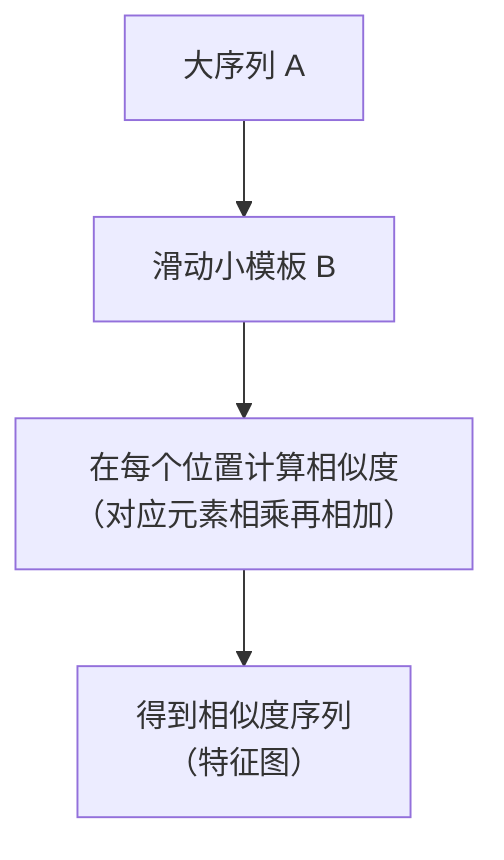
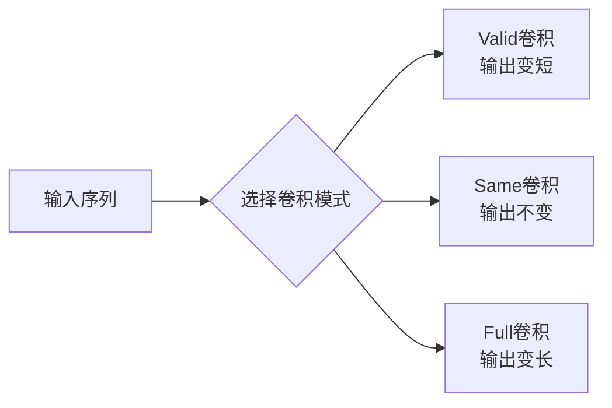
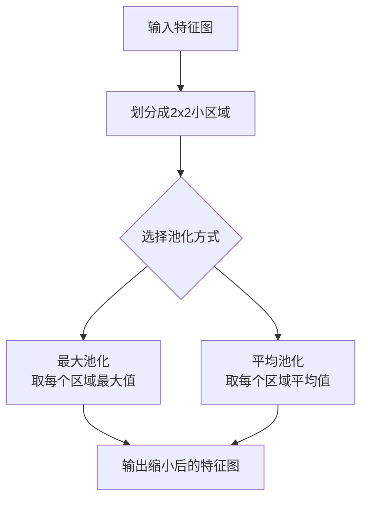
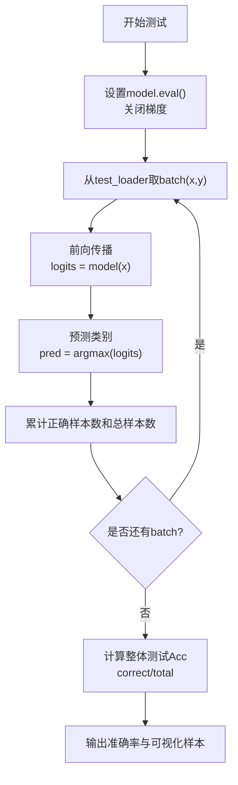
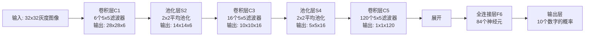
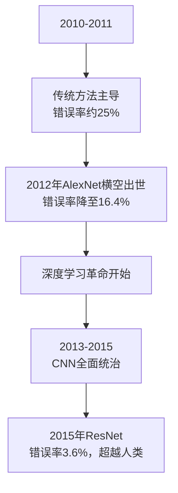
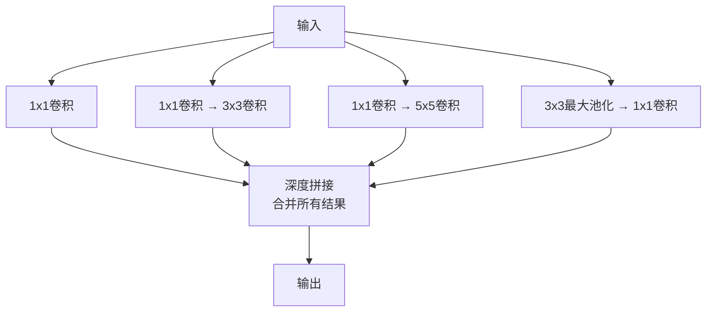
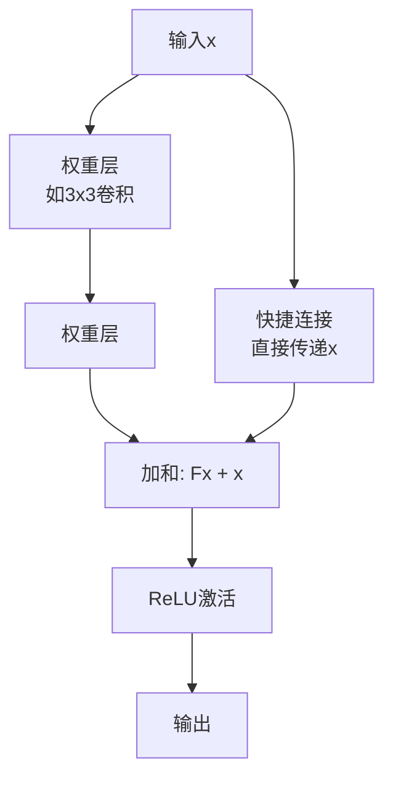
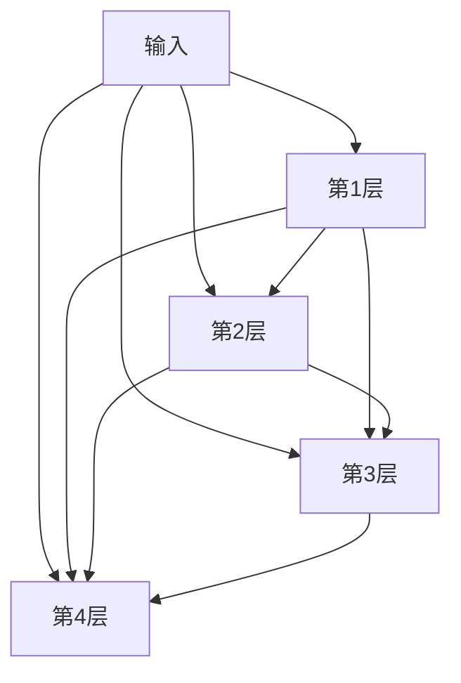
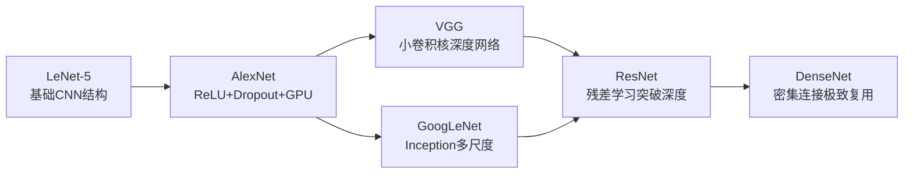

## 🧩 第一部分：动机 —— 我们为什么需要卷积？

### 1.1 最直观的比喻：找茬游戏

想象一下，你在玩“大家来找茬”游戏。你有两张看似相同的图片（A和B），但B图片其实是A图片中某个小物体的放大版。

**你的任务**：在A图片中找到B图片对应的小物体在哪里。

**你的做法**：
1.  拿着B小图，在A大图上**从左到右、从上到下慢慢滑动**。
2.  每移动到一个新位置，就仔细对比：“**这个地方和B小图像不像？**”
3.  越像的地方，你就在心里给它打一个**高分**。

这个“**拿着小模板在大图上滑动对比**”的过程，就是卷积最核心、最原始的动机。

### 1.2 电脑怎么做这件事？

电脑不会“看”，但它会**计算**。它如何判断“像不像”呢？它用的是最笨但最有效的方法——**数学计算**。

**核心思想**：计算两个图案对应位置像素值的匹配程度。

**简单例子（一维，就像比较两条线）**：
-   大序列 A：`[1, 3, 2, 4, 5]`
-   小模板 B：`[3, 2]` （我们想在大序列里找到 `[3, 2]` 这个模式）

电脑会这样做：
1.  把B放在A的开头：对比 `[1, 3]` 和 `[3, 2]`。计算相似度：`1*3 + 3*2 = 3 + 6 = 9`
2.  向右滑动一步：对比 `[3, 2]` 和 `[3, 2]`。计算相似度：`3*3 + 2*2 = 9 + 4 = 13` ✅（得分最高！找到啦！）
3.  继续滑动：对比 `[2, 4]` 和 `[3, 2]`。计算相似度：`2*3 + 4*2 = 6 + 8 = 14`
4.  最后：对比 `[4, 5]` 和 `[3, 2]`。计算相似度：`4*3 + 5*2 = 12 + 10 = 22`

**结果**：我们得到一个相似度序列 `[9, 13, 14, 22]`。其中，**第二个位置得分是13**，这告诉我们，在A的第二个位置开始，和B最像。

这个“滑动计算相似度”的过程，在数学上就叫做**互相关**。而深度学习里的“卷积”其实就是互相关。



---

## 🔢 第二部分：从一维卷积理解核心概念

### 2.1 什么是一维卷积？

就是把上面的例子用数学公式表达出来。对于离散序列（比如一段音频、一段文本编码），卷积定义为：

$$ (f * g)[m] = \sum_{n} f[m - n] g[n] $$

**先别怕！我们拆解一下：**
-   `f`： 那个**大序列**（比如长的音频信号）。
-   `g`： 那个**小模板**（比如一个特定的声音模式，我们称之为**卷积核**）。
-   `m`： 当前滑动到的**位置**。
-   `n`： 在模板内部的位置。
-   `∑`： 求和符号。意思是把模板里每个位置 `n` 的计算结果都**加起来**。
-   `f[m-n]`： 这是数学上标准的卷积定义，它会对卷积核进行**翻转**。但在深度学习中，我们通常不翻转，所以更实用的公式是：

**深度学习实际用的公式（互相关）：**
$$ (f * g)[m] = \sum_{n} f[m + n] g[n] $$

这就完全对应了我们上面“找茬”的过程：**对应位置相乘，然后求和**。

### 2.2 三种卷积模式：怎么处理边界？

在滑动的时候，会遇到一个问题：当模板滑到序列的两头时，模板会“悬空”，有一部分没有东西可以对应。怎么办？有三种处理方式：

#### a) Valid卷积（有效卷积）—— “不处理边界”
*   **做法**：只在模板能完全覆盖序列内部的位置进行计算。滑到边上悬空了？那这个位置就不算了。
*   **结果**：输出序列会**变短**。
*   **输出长度公式**：`Len_output = Len_f - Len_g + 1`
*   **比喻**：拖地时，拖把完全在房间内部拖动，不碰到墙壁。

#### b) Full卷积（全卷积）—— “扩展边界”
*   **做法**：在原始序列的两端**补上0**（称为**填充/Padding**），补的数量是 `模板长度 - 1`。这样模板在任何位置都能有对应的值。
*   **结果**：输出序列会**变长**。
*   **输出长度公式**：`Len_output = Len_f + Len_g - 1`
*   **比喻**：拖地时，先把房间的墙壁向外推一点，创造出新的空间（填上0），这样拖把就能一直拖到原来墙壁的位置。

#### c) Same卷积（同尺寸卷积）—— “保持边界”
*   **目标**：让输出序列和输入序列**一样长**。
*   **做法**：在两端填充适量的0。对于步长为1的情况，填充数通常是 `(Len_g - 1) / 2`（所以卷积核大小通常是奇数，如3, 5, 7）。
*   **结果**：输出序列**长度不变**。
*   **比喻**：拖地时，只扩展墙壁一点点，刚好让拖把拖完整个房间后，拖把的中心还在房间内，保证拖过的区域和房间一样大。



### 2.3 一维卷积的例子（带计算）

让我们用真实的数字算一遍，彻底搞懂。

**设：**
-   `f = [0, 1, 2, -1, 3]` （大序列）
-   `g = [1, 1, 0]` （卷积核）

**a) Valid卷积计算：**
1.  位置1: `[0,1,2]` 与 `[1,1,0]` => `0*1 + 1*1 + 2*0 = 1`
2.  位置2: `[1,2,-1]` 与 `[1,1,0]` => `1*1 + 2*1 + (-1)*0 = 3`
3.  位置3: `[2,-1,3]` 与 `[1,1,0]` => `2*1 + (-1)*1 + 3*0 = 1`
**结果**：`[1, 3, 1]`

**b) Full卷积计算（需要填充）**：
先在f两边各填充 `3-1=2` 个0：`f_padded = [0, 0, 0, 1, 2, -1, 3, 0, 0]`
然后进行Valid卷积（过程略长），结果是 `[0, 1, 3, 1, 2, 3, 0]`

**c) Same卷积计算（目标输出长度=5）**：
在f两边各填充 `(3-1)/2 = 1` 个0：`f_padded = [0, 0, 1, 2, -1, 3, 0]`
然后进行Valid卷积，结果是 `[1, 3, 1, 2, 3]`

---

## 🖼️ 第三部分：升级到二维卷积 —— 处理图像

### 3.1 从线到面

一维是条线，二维是个面。图像就是最典型的二维数据。二维卷积就是把一维的“滑动”扩展到两个方向：**既要左右滑动，也要上下滑动**。

**公式（深度学习版，即互相关）：**
$$ h[i, j] = (f * g)[i, j] = \sum_{m} \sum_{n} f[i+m, j+n] g[m, n] $$

-   `f`： 输入图像（一个大矩阵）。
-   `g`： 卷积核（一个小矩阵，比如3x3）。
-   `i, j`： 当前卷积核左上角在图像上的位置。
-   `m, n`： 在卷积核内部的位置。
-   `∑∑`： 双重求和，把卷积核覆盖的那个小区域里所有位置的乘积累加起来。

### 3.2 二维卷积的例子

假设我们有一个4x4的图像A和一个3x3的卷积核B：
```
A = [ [0, 0, 1, 2],
      [2, 2, 0, 0],
      [2, 1, 2, 2],
      [3, 0, 1, 1] ]

B = [ [0,  0, -1],
      [1, -1,  1],
      [-1, 1,  1] ]
```
计算Valid卷积（输出大小为2x2）：
-   **位置(0,0)**：计算A中红色区域和B的相似度。
    ```
    [0,0,1]    [0, 0,-1]
    [2,2,0] 和 [1,-1, 1] 对应位置相乘再相加：
    [2,1,2]    [-1,1, 1]
    (0*0 + 0*0 + 1*(-1)) + (2*1 + 2*(-1) + 0*1) + (2*(-1) + 1*1 + 2*1) 
    = (0+0-1) + (2-2+0) + (-2+1+2) = (-1) + (0) + (1) = 0
    ```
-   **位置(0,1)**：向右滑动一列，计算下一个区域... 以此类推。

最终我们会得到一个2x2的**特征图**，其中的每个值都代表了图像对应区域与卷积核的相似程度。

### 3.3 相似度与卷积的关系（重要！）

细心的你可能发现了：我们一直在说“相似度”，但数学上的标准卷积定义需要**先把卷积核翻转180度**再计算。

-   **标准卷积**：`∑ f[i-m, j-n] * g[m, n]` （先翻转g）
-   **互相关**：`∑ f[i+m, j+n] * g[m, n]` （不翻转g）

**为什么深度学习用互相关？**
因为卷积核的权重是**随机初始化并通过学习得到的**。对于电脑来说，一个卷积核是 `[1, 0, -1]` 还是翻转后的 `[-1, 0, 1]` 根本没有区别，它最终都能学到正确的特征。所以，为了简化实现，我们直接使用互相关，并把它叫做“卷积”。

**关系**：**计算相似度（互相关） = 计算翻转后的卷积核的卷积**。

---

## 💾 第四部分：卷积为什么能节省参数量？

这是CNN打败传统神经网络的关键！

### 对比实验：

**任务**：处理一张很小的32x32像素的灰度图片。

**方案一：全连接层**
-   输入有 `32 * 32 = 1024` 个像素。
-   假设第一个隐藏层有100个神经元。
-   那么，参数量（权重）就是 `1024 * 100 = 102,400`个！这还只是一层！

**方案二：卷积层**
-   我们使用一个5x5的卷积核。
-   一个卷积核只有 `5 * 5 = 25` 个参数（权重）。
-   即使用100个这样的卷积核，总参数量也只有 `25 * 100 = 2500` 个！

### 为什么差这么多？

因为卷积层有两大法宝：
1.  **局部连接**：每个神经元（卷积核）只连接输入的一小块区域（5x5），而不是全部1024个像素。
2.  **权值共享**：同一个卷积核（带着它的25个参数）会滑动扫描整个图像。这25个参数在图像的所有位置是**共享**的。

**比喻**：
-   **全连接层**：雇100个专家，每个专家都要把1024个零件全部检查一遍，每个专家都有自己的1024本检查手册（参数极多）。
-   **卷积层**：雇100个专家，每个专家只精通检查5x5的小零件。他们带着自己唯一的一本小手册（25条规则），走到哪里都用这本手册（参数极少，且可复用）。

---

## ⚙️ 第五部分：扩展 —— 更灵活的卷积操作

### 5.1 保留空间尺寸（Padding）

我们看到，Valid卷积会让图片越变越小。但有时候我们希望输出的特征图大小和输入一样，这样更容易设计网络结构。怎么办？**用Same卷积（填充）**。

**方法**：在输入图像的四周**补上一圈0**。

**例子**：
-   输入图片：7x7
-   卷积核：3x3
-   步长：1
-   想要输出大小还是7x7。
-   **计算填充量**：`P = (K - 1) / 2 = (3-1)/2 = 1`。在四周各补1圈0。
-   新的输入大小：`7+1+1 = 9x9`。
-   再用3x3核做Valid卷积：输出大小 = `9 - 3 + 1 = 7x7`。目标达成！

### 5.2 步长不为1的卷积（Stride）

之前我们滑动卷积核，每次只移动1个像素。有时候我们想滑得快一点，让输出特征图变小，这可以降低计算量。这个每次滑动的距离就是**步长**。

**输出尺寸通用公式**：
$$ O = \frac{W - K + 2P}{S} + 1 $$
-   `W`： 输入尺寸
-   `K`： 卷积核尺寸
-   `P`： 填充量
-   `S`： 步长

**例子**：
-   输入图片：7x7
-   卷积核：3x3
-   步长`S=2`
-   填充`P=0`
-   输出大小 = `(7 - 3 + 0) / 2 + 1 = 4/2 + 1 = 2 + 1 = 3`。输出是3x3的特征图。

步长>1相当于一种**降采样**，跳着看图像，感受野会变大。

### 5.3 三维卷积（处理彩色图像和多个特征）

真实的图像是彩色的，有RGB三个通道。所以输入不再是二维矩阵，而是**三维立方体**（高度、宽度、通道数）。

这时，我们的卷积核也必须升级成**三维的**，其**深度**必须和输入的通道数相同。

**计算过程**：
1.  卷积核的每个“切片”分别与输入对应的通道进行二维卷积。
2.  将三个通道的卷积结果**相加**，再加上一个偏置项。
3.  得到输出特征图上的**一个点**。

**多个卷积核**：一个三维卷积核只能提取**一种**特征。如果我们使用N个不同的卷积核，就会得到N张输出特征图。这N张图堆叠起来，就形成了输出的新“立方体”，其通道数就是N。

**参数量计算**：一个3x3x3的卷积核有 `3*3*3=27`个权重+1个偏置 = 28个参数。如果有64个这样的核，总参数量就是 `28 * 64 = 1792`个，依然比全连接少得多。

---

## ✅ 总结：卷积层的核心思想

| 概念 | 通俗理解 | 目的 |
| :--- | :--- | :--- |
| **卷积核/过滤器** | 一个**特征模板**（如“猫耳朵检测器”） | 提取特定特征 |
| **卷积操作** | **滑动模板**并计算**相似度** | 在输入中定位该特征 |
| **局部连接** | 一次只关注**一小块区域** | 大幅减少参数量 |
| **权值共享** | **同一个模板**扫遍整个输入 | 进一步减少参数，获得平移不变性 |
| **填充** | 在输入边缘**补一圈0** | 控制输出特征图的大小（如保持尺寸不变） |
| **步长** | 模板**每次滑动的距离** | 控制输出特征图的大小（如下采样） |
| **特征图** | **相似度得分**构成的新图 | 显示特征在输入中的分布情况 |

卷积层是CNN的**眼睛**，它通过这种巧妙的设计，高效地、逐层地从图像中提取出从边缘、到纹理、再到物体部件的层次化特征，为后续的分类等任务奠定了坚实的基础。

---

## 🧽 第一部分：池化层 —— 网络的"摘要大师"

### 1.1 对局部区域池化：它到底在做什么？

想象一下，你读了一篇非常详细的长篇文章，然后朋友问你："这篇文章讲了什么？" 你不会一字不差地复述，而是会**总结核心要点**。

池化层就是神经网络的"总结专家"。

**具体操作**：
1.  把特征图划分成一个个小区域（比如2x2的方块）
2.  对每个小区域进行"摘要"操作
3.  最常见的两种摘要方式：

#### a) 最大池化（Max Pooling）—— "选代表"
在每个小区域里，只保留**数值最大的那个**。

**例子**：
```
区域1：    区域2：
[1, 3]    [2, 4]
[2, 8]    [6, 1]

最大池化结果：
区域1 → 8（因为8最大）
区域2 → 6（因为6最大）
```

#### b) 平均池化（Average Pooling）—— "算平均"
计算每个小区域内所有数值的平均值。

**同样的例子**：
```
区域1：平均值 = (1+3+2+8)/4 = 3.5
区域2：平均值 = (2+4+6+1)/4 = 3.25
```



### 1.2 池化层的技术细节

**步长（Stride）**：通常池化窗口的大小就是步长。比如2x2池化，步长就是2，这样不会有重叠。

**效果**：经过2x2池化后，特征图的宽度和高度都**缩小为原来的一半**，总面积变为原来的**1/4**！

**例子**：4x4的特征图 → 2x2池化 → 2x2的输出
```
输入4x4：
[1,  2,  3,  4]
[5,  6,  7,  8]
[9, 10, 11, 12]
[13,14, 15, 16]

2x2最大池化，步长2：
第一个区域[1,2,5,6]最大值=6
第二个区域[3,4,7,8]最大值=8
第三个区域[9,10,13,14]最大值=14
第四个区域[11,12,15,16]最大值=16

输出2x2：
[6,  8]
[14, 16]
```

---

## 🤔 第二部分：为什么需要池化层？—— 三大核心原因

### 原因1：大幅减少计算量（最主要的原因）

卷积层生成的特征图可能非常大。比如：
- 输入图片：96x96像素
- 卷积层输出：可能有400个特征图，每个88x88大小
- 总数据量：`400 × 88 × 88 = 3,097,600`个数值！

如果直接把这些数据传给下一层，计算量会爆炸。池化层通过**降低维度**来解决这个问题。

**比喻**：就像把高清视频转换成标清视频——文件变小了，但主要内容还在。

### 原因2：扩大感受野（让网络"看得更远"）

感受野是指网络中某个点能"看到"原始输入图像的范围。

**理解过程**：
- 第一层卷积：每个神经元只能看到3x3的小区域（比如看到一根猫毛）
- 经过池化后：第二层的神经元虽然还是看3x3区域，但这个区域对应的是**池化后的特征图**
- 换算回原始图像：第二层神经元实际上能看到6x6的区域（可能看到一撮猫毛）

这样层层递进，高层的神经元就能看到整个图像，理解全局信息。

### 原因3：增加平移不变性（让网络更"智能"）

**最大池化的神奇效果**：只要某个特征（比如猫耳朵）出现在池化窗口内的**任何位置**，最大池化都能捕获到它。

**例子**：
```
情况1：猫耳朵在区域左上角
[耳朵, 背景]
[背景, 背景] → 最大池化输出 = "耳朵"

情况2：猫耳朵在区域右下角  
[背景, 背景]
[背景, 耳朵] → 最大池化输出 = "耳朵"
```

结果一样！这意味着网络不再过分纠结于特征的**精确位置**，而是更关注特征**是否存在**。这使网络对物体的微小移动、旋转更加鲁棒。

---

## 🏗️ 第三部分：卷积神经网络的完整组成

一个完整的CNN就像一座工厂的流水线：



### 各组成部分的详细作用：

1.  **卷积层**：特征提取器，像各种"检测仪"
2.  **激活函数（如ReLU）**：引入非线性，让网络可以学习复杂模式
3.  **池化层**：降维和摘要，减少计算量，增加不变性
4.  **全连接层**：把提取到的所有特征组合起来，进行最终决策
5.  **输出层**：给出分类概率（比如：猫90%，狗10%）

### 其他重要组件：
- **Dropout层**：随机"关闭"一些神经元，防止过拟合（像学生考试时不能总靠死记硬背）
- **批量归一化层**：让数据分布更稳定，加速训练
- **损失函数**：衡量预测结果与真实答案的差距

---

## 💻 第四部分：卷积神经网络的实现

### 4.1 如何用代码实现？

现代深度学习框架让CNN的实现变得非常简单。以PyTorch为例：

```python
import torch
import torch.nn as nn

# 定义一个简单的CNN
class SimpleCNN(nn.Module):
    def __init__(self):
        super(SimpleCNN, self).__init__()
        # 卷积层1：输入1通道，输出32通道，卷积核3x3
        self.conv1 = nn.Conv2d(1, 32, 3, padding=1)
        # 池化层：2x2最大池化
        self.pool = nn.MaxPool2d(2, 2)
        # 卷积层2：输入32通道，输出64通道
        self.conv2 = nn.Conv2d(32, 64, 3, padding=1)
        # 全连接层
        self.fc1 = nn.Linear(64 * 7 * 7, 128)  # 假设经过两次池化后是7x7
        self.fc2 = nn.Linear(128, 10)  # 10个分类
        
    def forward(self, x):
        x = self.pool(torch.relu(self.conv1(x)))  # 卷积 → ReLU → 池化
        x = self.pool(torch.relu(self.conv2(x)))
        x = x.view(-1, 64 * 7 * 7)  # 展开
        x = torch.relu(self.fc1(x))
        x = self.fc2(x)
        return x

# 创建网络实例
model = SimpleCNN()
```

### 4.2 训练过程（前向传播 + 反向传播）

1.  **前向传播**：输入图片，一层层计算，得到预测结果
2.  **计算损失**：比较预测结果与真实标签的差距
3.  **反向传播**：从输出层往回走，计算每层参数应该如何调整
4.  **参数更新**：用优化器（如SGD、Adam）更新网络权重

**比喻**：
- **前向传播**：像考试做题，从第一题做到最后一题
- **计算损失**：批改试卷，看得了多少分
- **反向传播**：分析错题，找出薄弱环节
- **参数更新**：针对薄弱环节加强学习

---

## 🛠️ 第五部分：深度学习框架 —— 造房子的工具包

深度学习框架就像一套强大的建筑工具，让你能快速搭建各种神经网络：

| 框架 | 特点 | 适合人群 |
|------|------|----------|
| **TensorFlow** | Google开发，工业界广泛应用，生态系统完善 | 生产环境、大型项目 |
| **PyTorch** | Facebook开发，研究领域主流，代码直观灵活 | 学术研究、实验原型 |
| **Keras** | 高级API，极其易用，运行在TensorFlow之上 | 初学者、快速开发 |
| **PaddlePaddle** | 百度开发，中文文档丰富 | 国内开发者 |

**比喻**：
- **TensorFlow**：像专业的建筑CAD软件，功能强大但学习曲线陡峭
- **PyTorch**：像乐高积木，灵活直观，适合创意搭建
- **Keras**：像预制房屋组件，简单拼接就能建成房子

---

## 📚 第六部分：实战示例

### 6.1 MNIST手写数字识别（深度学习界的"Hello World"）

**任务**：识别0-9的手写数字

**数据集**：
- 60,000张训练图片，10,000张测试图片
- 每张图片28x28像素，黑白

**网络结构示例**：
```
输入(28x28) 
→ 卷积层(32个5x5滤波器) → ReLU → 最大池化(2x2) 
→ 卷积层(64个5x5滤波器) → ReLU → 最大池化(2x2) 
→ 展开 
→ 全连接层(128神经元) → ReLU 
→ 输出层(10神经元，对应0-9) → Softmax
```

**为什么用这个结构？**
- 第一层卷积：检测简单特征（边缘、角落）
- 第二层卷积：组合成更复杂特征（数字的曲线、直线）
- 全连接层：综合所有特征判断是哪个数字

### 6.2 CIFAR-10数据集分类（进阶任务）

**任务**：识别10类物体（飞机、汽车、鸟、猫、鹿、狗、青蛙、马、船、卡车）

**数据集**：
- 50,000张训练图片，10,000张测试图片
- 每张图片32x32像素，彩色（RGB三通道）

**网络结构示例**：
```
输入(32x32x3) 
→ 卷积层(32个5x5滤波器) → ReLU → 最大池化(2x2) 
→ 卷积层(64个5x5滤波器) → ReLU → 最大池化(2x2) 
→ 卷积层(64个5x5滤波器) → ReLU → 最大池化(2x2) 
→ 展开 
→ 全连接层(512神经元) → ReLU → Dropout(防止过拟合)
→ 输出层(10神经元) → Softmax
```

**与MNIST的区别**：
- 输入是**彩色图像**（3通道），所以第一层卷积核也是3维的
- 网络**更深**（3个卷积层），因为任务更复杂
- 加入了**Dropout**，因为小数据集容易过拟合

---

## 🎯 总结：池化层与CNN全貌

### 池化层的核心价值：
1.  **降维减负**：大幅减少数据量和计算成本
2.  **特征强化**：突出重要特征，过滤噪声
3.  **增加鲁棒性**：对位置变化不敏感

### CNN的工作流程比喻：

把CNN想象成一个**智能快递分拣系统**：

1.  **卷积层**：像各种"扫描仪"
   - 条形码扫描仪（检测边缘）
   - 重量检测仪（检测纹理）
   - 体积测量仪（检测形状）

2.  **池化层**：像"区域管理员"
   - 把同一区域的包裹信息汇总
   - "这个区域主要是小件包裹"（最大池化）
   - "这个区域平均重量是2kg"（平均池化）

3.  **全连接层**：像"总调度员"
   - 综合所有区域信息
   - 决定包裹该去哪个目的地（分类）

通过这样的层次化处理，CNN能够从像素级信息逐步抽象出高级语义特征，最终完成复杂的视觉识别任务。

# 经典的卷积神经网络：从简单到复杂的演进之路

## 🏁 第一部分：LeNet-5 —— 深度学习的"始祖鸟"

### 1.1 背景故事：手写数字识别的挑战
在1998年，Yann LeCun团队面临一个实际问题：如何让电脑自动识别邮政编码和银行支票上的手写数字。传统的算法效果不佳，于是他们提出了LeNet-5。

### 1.2 网络结构详解（像一条精密的流水线）



### 1.3 创新点和意义
- **首次成功实践**：证明了"卷积+池化"模式的有效性
- **参数共享**：大大减少参数量（从全连接的数十万降到几千）
- **层次化特征提取**：从边缘→部件→完整数字
- **局限**：只能处理简单任务，网络较浅

**比喻**：LeNet-5就像第一台蒸汽机，虽然简单粗糙，但证明了新原理的可行性。

---

## 🏆 第二部分：ImageNet挑战赛 (ILSVRC) —— 深度学习的"奥运会"

### 2.1 什么是ImageNet？
- **数据规模**：120万张图片，1000个类别
- **任务难度**：从"猫狗"到"蘑菇品种"、"犬种细分"
- **评估标准**：Top-1准确率（最可能的答案是否正确）、Top-5准确率（正确答案是否在前5名）

### 2.2 竞赛的意义


**人类表现**：Top-5错误率约5-10%，意味着CNN已经比大多数人更准！

---

## 🔥 第三部分：AlexNet —— 点燃深度学习革命的火种

### 3.1 2012年的"惊天大逆转"
AlexNet在ILSVRC2012中以压倒性优势获胜，比第二名传统方法的错误率低了10.9%！

### 3.2 核心创新（为什么它这么厉害？）

#### 创新1：使用ReLU激活函数
- **之前**：用sigmoid或tanh，训练慢，容易梯度消失
- **AlexNet**：用ReLU(`max(0, x)`)，训练速度快数倍

#### 创新2：Dropout防止过拟合
- **问题**：网络复杂容易记住训练数据，但泛化能力差
- **解决方案**：随机"关闭"一部分神经元，强迫网络学习更鲁棒的特征

#### 创新3：数据增强
- **技巧**：对训练图片进行翻转、裁剪、颜色调整
- **效果**：用有限的训练数据创造出"无限"的变化

#### 创新4：GPU加速
- **硬件**：使用2块NVIDIA GTX 580 GPU（当时很超前）
- **意义**：开启了GPU训练深度学习的新时代

### 3.3 网络结构
```
输入(224x224x3)
→ 卷积(96个11x11滤波器, 步长4) → ReLU → 最大池化
→ 卷积(256个5x5滤波器) → ReLU → 最大池化  
→ 卷积(384个3x3滤波器) → ReLU
→ 卷积(384个3x3滤波器) → ReLU
→ 卷积(256个3x3滤波器) → ReLU → 最大池化
→ 全连接(4096) → ReLU → Dropout
→ 全连接(4096) → ReLU → Dropout
→ 输出(1000类)
```

---

## 🧱 第四部分：VGG Net —— 简洁优雅的"深度之美"

### 4.1 核心思想：为什么都用3x3小卷积核？
VGG团队发现了一个巧妙的设计：

**两个3x3卷积堆叠 vs 一个5x5卷积**
- **感受野相同**：都能看到5x5的区域
- **参数更少**：`3×3 + 3×3 = 18`个参数 vs `5×5 = 25`个参数
- **更多非线性**：多了一次ReLU激活，表达能力更强

### 4.2 VGG-16网络结构（像搭积木一样规整）
```
输入(224x224x3)
→ 2×[卷积(3x3, 64)] → 最大池化
→ 2×[卷积(3x3, 128)] → 最大池化
→ 3×[卷积(3x3, 256)] → 最大池化
→ 3×[卷积(3x3, 512)] → 最大池化
→ 3×[卷积(3x3, 512)] → 最大池化
→ 全连接(4096) → ReLU → Dropout
→ 全连接(4096) → ReLU → Dropout
→ 输出(1000类)
```

### 4.3 VGG的意义
- **结构规整**：只有3x3卷积和2x2池化，非常优雅
- **迁移学习神器**：预训练的VGG权重被广泛用于其他任务
- **证明深度的重要性**：16-19层网络明显优于之前的模型

---

## 🧠 第五部分：GoogLeNet (Inception v1) —— 网络中的"精算师"

### 5.1 核心问题：如何平衡深度、宽度和计算成本？
更宽更深的网络性能更好，但计算量爆炸式增长。GoogLeNet提出了革命性的**Inception模块**。

### 5.2 Inception模块的巧妙设计
**传统思维**：每层只能用一种尺寸的卷积核（如3x3）

**Inception思维**：为什么不让网络自己选择？在同一层中**并行**使用多种尺寸！



### 5.3 关键技巧：1x1卷积的妙用
- **降维作用**：在3x3、5x5卷积之前先用1x1卷积减少通道数
- **计算示例**：
  - 直接做5x5卷积：如果输入256通道，输出256通道，参数量 = `5×5×256×256 = 1,638,400`
  - 先1x1降维到64通道：参数量 = `1×1×256×64 + 5×5×64×256 = 16,384 + 409,600 = 425,984`
  - **节省了75%的参数！**

### 5.4 GoogLeNet的成绩
- 22层网络，参数却只有AlexNet的1/12
- 在ILSVRC2014获得冠军，Top-5错误率6.7%

---

## ⚡ 第六部分：Inception v2/v3 —— 持续优化

### 6.1 Inception v2的主要改进：卷积分解

#### 改进1：用两个3x3代替5x5卷积
- 感受野相同：两个3x3堆叠 = 5x5的感受野
- 参数更少：`3×3 + 3×3 = 18` vs `5×5 = 25`
- 更多非线性：多一次ReLU激活

#### 改进2：用1xn和nx1代替nxn卷积
- 将3x3卷积分解为1x3和3x1的串联
- 参数节省：`3×3=9` vs `1×3+3×1=6`，节省33%

### 6.2 Inception v3的额外技术
- **批量归一化**：让训练更稳定，收敛更快
- **标签平滑**：防止模型对预测结果过于自信，提高泛化能力
- **RMSProp优化器**：更有效的优化算法

---

## ⛓️ 第七部分：ResNet —— 突破深度极限的"高速公路"

### 7.1 深度网络的致命问题：退化问题
理论上：网络越深，性能应该越好
实际上：56层网络的错误率反而比20层更高！

**这不是过拟合**（训练误差也变高），而是**网络难以训练**。

### 7.2 残差学习的核心思想
**传统网络**：直接学习目标映射 `H(x) = 期望输出`

**ResNet的洞察**：学习残差 `F(x) = H(x) - x`，然后输出 `H(x) = F(x) + x`

### 7.3 残差块的结构：跳跃连接



### 7.4 为什么有效？
- **梯度高速公路**：梯度可以直接通过跳跃连接反向传播，缓解梯度消失
- **恒等映射保底**：如果某一层没用，`F(x) = 0`，输出就是`x`，至少不会变差
- **更容易优化**：学习残差比学习完整映射更容易

### 7.5 ResNet的惊人成就
- **152层网络**成功训练，Top-5错误率**3.57%**
- **1000层网络**在CIFAR-10上也能训练
- 获得ILSVRC2015冠军，错误率首次低于4%

---

## 🌳 第八部分：DenseNet —— 极致特征复用的"雨林生态"

### 8.1 核心思想：如果跳跃连接很好，为什么不连接所有层？
DenseNet将ResNet的思想推向极致：**每一层都直接连接前面所有层**。

### 8.2 密集连接模式
在DenseNet中，第`l`层的输入是前面`l-1`层输出的**拼接**（concatenation），而不是ResNet中的加和。

```
第1层输出: x1
第2层输入: [x0, x1]  // 拼接第0层(输入)和第1层
第3层输入: [x0, x1, x2]  // 拼接所有前面层
...
```

### 8.3 密集块结构



### 8.4 DenseNet的优势
- **特征复用**：每一层都能直接使用所有前面层的特征
- **梯度流动**：梯度有更多路径反向传播，训练更稳定
- **参数效率**：用更少的参数达到更好的性能
- **特征多样性**：鼓励网络学习多样化的特征

---

## 📊 第九部分：ImageNet数据集上的结果演进

### 9.1 错误率下降历程（Top-5错误率）

| 年份 | 模型 | 错误率 | 意义 |
|------|------|--------|------|
| 2010 | 传统方法 | ~25% | 计算机视觉的"黑暗时代" |
| 2012 | **AlexNet** | **16.4%** | **深度学习革命开始** |
| 2014 | GoogLeNet | 6.7% | Inception模块的胜利 |
| 2014 | VGG | 7.3% | 深度和规整结构的重要性 |
| 2015 | **ResNet** | **3.57%** | **首次超越人类水平** |
| 2017 | DenseNet | ~5% | 特征复用的极致 |

### 9.2 人类表现对比
- **人类专家**：Top-5错误率约5-10%
- **ResNet(2015)**：3.57% → **机器首次超越人类**
- **后来的模型**：错误率进一步降至2-3%

### 9.3 技术演进总结



---

## 🎯 总结：CNN发展的核心脉络

### 设计哲学的演进：
1. **从浅到深**：LeNet(5层) → ResNet(152层+)
2. **从单一到多样**：单一卷积核 → Inception多尺度
3. **从串联到并联**：顺序连接 → 残差连接 → 密集连接
4. **从复杂到简洁**：大卷积核 → 小卷积核堆叠

### 关键突破点：
- **AlexNet**：证明了深度学习的潜力
- **VGG**：证明了深度的重要性
- **GoogLeNet**：证明了网络结构设计的重要性
- **ResNet**：解决了深度网络的训练难题
- **DenseNet**：探索了特征复用的极限

### 给我们的启示：
这些经典网络就像一代代传奇运动员，每个都在前人的基础上突破极限。理解它们的发展历程，就能理解深度学习进步的内在逻辑。现在的SOTA模型（如Vision Transformer）也都是在这些基础上继续创新。

现在你已经成为CNN历史的"见证者"了！从1998年的简单数字识别到2015年超越人类水平，这段激动人心的历程展示了人工智能的巨大潜力。