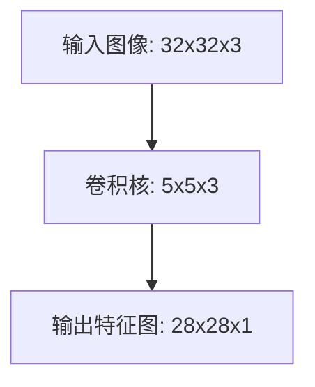
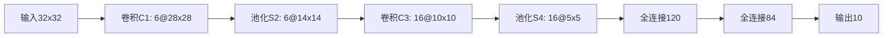
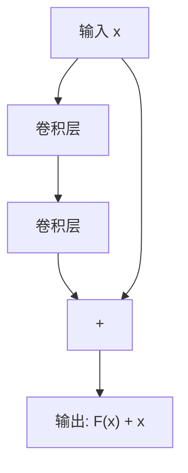
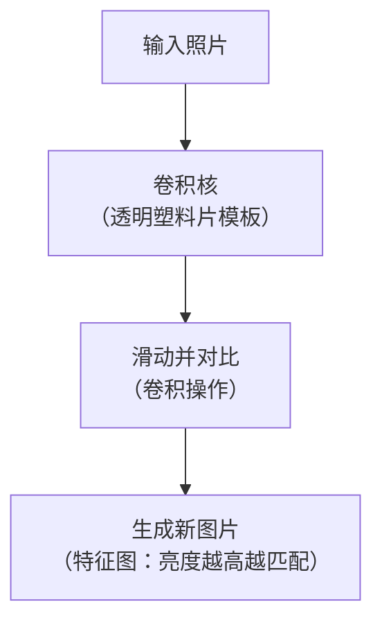
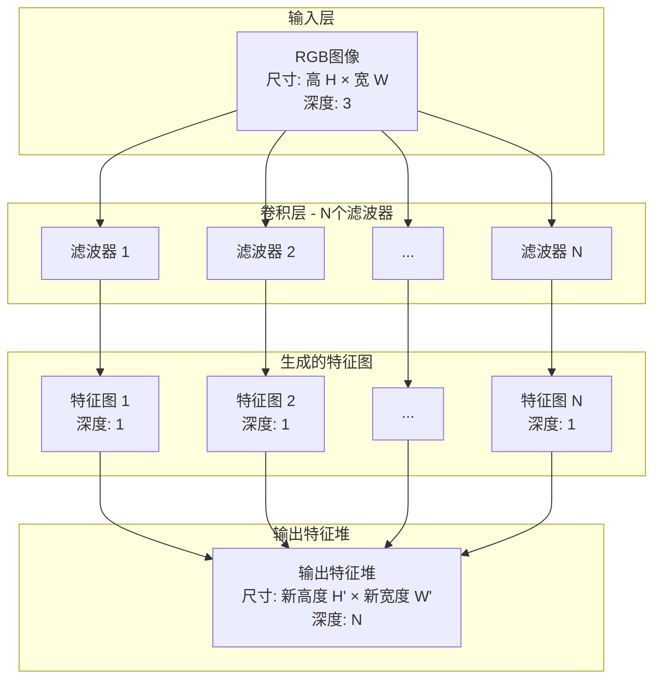
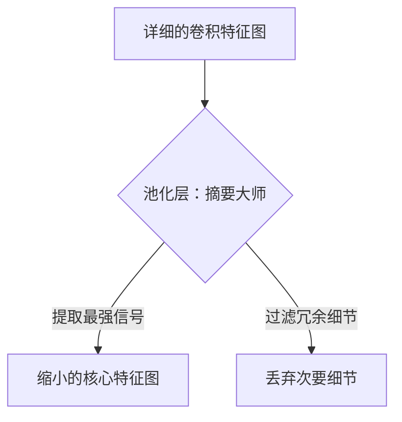
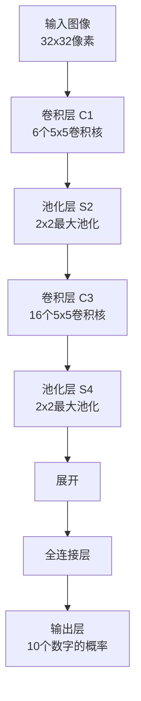
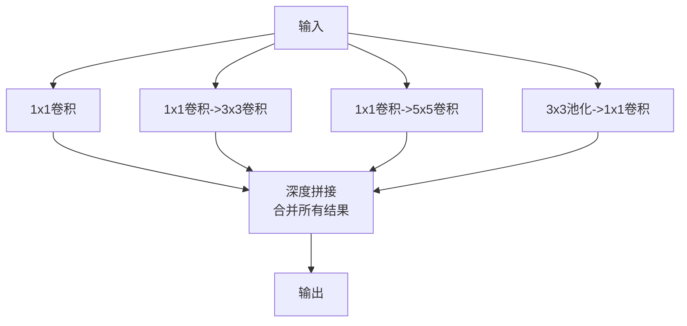

## 🧠 一、CNN简介：它是什么？为什么需要它？

### 1.1 核心思想：模仿视觉皮层

CNN的灵感来源于人类大脑的视觉处理机制。早在1962年，神经科学家Hubel和Wiesel发现：

- **简单细胞（Simple cells）**：负责检测图像中的**局部特征**（如边缘、角度）。
- **复杂细胞（Complex cells）**：将相邻简单细胞的输出进行**池化（pooling）**，使得特征具有**平移不变性**（即不管特征出现在图像的哪个位置，都能被识别）。

CNN正是模拟了这个层次化的处理过程：

```
输入图像 → 卷积（提取局部特征）→ 池化（压缩、抽象）→ 更多卷积/池化 → 全连接层（分类）
```

### 1.2 为什么要用CNN？—— 解决全连接网络的痛点

假设你有一张 100x100 的图片，输入到全连接网络：

- 第一个隐藏层如果有1000个神经元，参数量就是：  
  `100*100 * 1000 = 10,000,000`  
  这还只是一层！训练这么庞大的网络几乎不可行。

CNN通过两种策略极大减少参数量：

1. **局部连接（Local Connectivity）**：每个神经元只连接输入的一小块区域（如3x3）。
2. **权值共享（Weight Sharing）**：同一个卷积核在不同位置使用相同的权重。

---

## 🔍 二、卷积层（Convolutional Layer）

### 2.1 什么是卷积？

卷积的本质是**滑动窗口 + 相似度计算**。

#### 通俗理解：
你拿一个小模板（卷积核）在图像上滑动，每次计算模板与图像当前区域的“匹配程度”，匹配度越高，输出值越大。

#### 数学表达（离散二维卷积）：
$$
(f * g)[m, n] = \sum_{i} \sum_{j} f[m-i, n-j] \cdot g[i, j]
$$

但注意：**深度学习中的“卷积”实际是“互相关（cross-correlation）”**，即不翻转卷积核：

$$
(f * g)[m, n] = \sum_{i} \sum_{j} f[m+i, n+j] \cdot g[i, j]
$$

#### 三种卷积模式：

| 类型 | 输出大小 | 说明 |
|------|----------|------|
| Valid | \((M - K + 1) \times (N - K + 1)\) | 不补零，输出变小 |
| Same | \(M \times N\) | 补零，输出大小不变 |
| Full | \((M + K - 1) \times (N + K - 1)\) | 补零更多，输出变大 |

#### 示例（一维）：
```
f = [0, 1, 2, -1, 3]
g = [1, 1, 0]

Valid卷积：f * g = [3, 1, 2]
Same卷积：f * g = [1, 3, 1, 2, 3]（通过补零实现）
```

### 2.2 卷积的深层意义：特征提取器

不同的卷积核可以提取不同的特征：

- 边缘检测
- 纹理提取
- 颜色响应
- ……

#### 示例：边缘检测卷积核
```
[ -1, 0, 1 ]
[ -1, 0, 1 ]
[ -1, 0, 1 ]
```
这个核会对垂直边缘有高响应。

### 2.3 多通道卷积

实际图像是3通道（RGB），卷积核也是3通道的：



多个卷积核可以提取多种特征，形成多个输出通道。

---

## 🧩 三、池化层（Pooling Layer）

### 3.1 什么是池化？

池化就是对局部区域进行**摘要操作**，常见的有：

- **最大池化（Max Pooling）**：取区域内的最大值
- **平均池化（Average Pooling）**：取区域内的平均值

#### 示例（2x2最大池化）：
```
输入：
[ 1, 2 ]
[ 3, 4 ]   → 输出：4

[ 5, 6 ]
[ 7, 8 ]   → 输出：8
```

### 3.2 为什么需要池化？

1. **降低维度**：减少计算量和参数量
2. **扩大感受野**：使得后续层能看到更广的区域
3. **引入平移不变性**：微小位移不影响输出

---

## 🧱 四、典型CNN结构示例

### 4.1 LeNet-5（1998）

第一个成功的CNN应用，用于手写数字识别。



### 4.2 AlexNet（2012）

深度CNN的开山之作，ImageNet冠军。

- 使用ReLU激活函数
- 使用Dropout防止过拟合
- 使用GPU训练

### 4.3 VGGNet（2014）

- 全部使用3x3卷积核
- 结构简单规整，易于拓展

### 4.4 ResNet（2015）

解决“梯度消失”问题，允许训练极深网络（如1000层）。

#### 残差块结构：



---

# 卷积层

---

## 🧠 第一部分：最直观的比喻——给照片“描边”

想象一下，你手里拿着一张猫的照片和一张透明的塑料片，塑料片上用红色马克笔画了一个“猫耳朵”的形状。

1.  **你的任务**：找到照片里猫的耳朵在哪里。
2.  **你的做法**：你把那张画着耳朵的透明塑料片，盖在照片上，**一点点地滑动**。每放在一个位置，你就看一下塑料片上的图案和下面的照片像不像。
3.  **你的发现**：
    *   当塑料片正好盖住一个真实的猫耳朵时，它们**非常像**！你会说：“哇，这里很像！”（这产生一个**高数值**）
    *   当塑料片盖在背景墙上时，它们**一点也不像**。你会说：“这里不像。”（这产生一个**低数值**）

这个过程，就是**卷积**最核心的思想。

*   **照片**就是**输入**。
*   **画着耳朵的透明塑料片**就是**卷积核**（也叫过滤器）。
*   **滑动塑料片**的过程就是**卷积操作**。
*   你最后得到的“哪里像，哪里不像”的评估结果，就是一张新的、标记了“猫耳朵可能位置”的**特征图**。



---

## 🔍 第二部分：分解“滑动对比”的细节

现在我们来细化这个“滑动对比”的过程。

### 1. 局部连接：一次只看一小块

你不会把透明片一下盖住整张照片来判断，那样效率太低而且不准确。你一定是**一次只看一个小区域**，比如 3x3 或 5x5 像素的范围。

这就是**局部连接**：每个卷积核每次只关注输入图像的一小块区域。这大大减少了需要处理的信息量。

### 2. 权值共享：用同一个模板扫遍全图

无论你的塑料片移到照片的左上角还是右下角，**你用的都是同一个“猫耳朵”模板**。你不会在左上角用一个模板，到右下角又换另一个。

这就是**权值共享**：同一个卷积核（带着同一组权重）会滑动扫描整个输入图像。这意味着：
*   **效率极高**：只需学会识别一种模式（如猫耳朵），就能在整张图上应用。
*   **平移不变性**：无论猫耳朵出现在图片的哪个地方，都能被同一个检测器发现。

### 3. 计算“像不像”——乘法和加法

电脑是如何计算“像不像”的呢？它不是用眼睛看，而是做**数学运算**。

我们用一个超级简单的例子来说明。假设我们有一小块黑白图像（数字越大代表越白），和一个用来检测垂直边缘的卷积核。

**输入图像小块 (3x3)**:
```
[ 10, 20, 10 ]
[ 10, 20, 10 ]   # 中间一列是20，两边是10，这代表一条垂直的亮条（边缘）
[ 10, 20, 10 ]
```

**卷积核 (3x3)**:
```
[ -1,  0,  1 ]
[ -1,  0,  1 ]   # 这个核的设计就是：右边减左边，能检测垂直边缘
[ -1,  0,  1 ]
```

**计算“相似度”**：
1.  把输入和卷积核对应位置的数字**相乘**。
    *   `(10 * -1) + (20 * 0) + (10 * 1) = (-10) + 0 + 10 = 0`
    *   `(10 * -1) + (20 * 0) + (10 * 1) = (-10) + 0 + 10 = 0`
    *   `(10 * -1) + (20 * 0) + (10 * 1) = (-10) + 0 + 10 = 0`
2.  把所有乘法的结果**加起来**。
    *   `0 + 0 + 0 = 0`

**结论**：在这个点，计算结果为0，表示“不太像”。（因为我们的亮条太粗了，而这个核检测的是从暗到亮的突变边缘）。

如果我们的输入是一条**细的**垂直边缘，比如 `[10, 50, 10]` 在每一行，那么计算结果是 `(10*-1 + 50*0 + 10*1) * 3 = (0) * 3 = 0`？等等，这样算不对。实际上，卷积核是逐行计算然后求和的。

更准确的计算方式是：
*   第一行：`10*-1 + 20*0 + 10*1 = 0`
*   第二行：`10*-1 + 20*0 + 10*1 = 0`
*   第三行：`10*-1 + 20*0 + 10*1 = 0`
*   然后将三行结果相加：`0 + 0 + 0 = 0`

所以输出特征图在这个位置的值是 **0**。

**这个“对应位置相乘再相加”的过程，就是卷积最核心的数学计算**。

---

## 🎨 第三部分：处理彩色照片和多特征

### 1. 彩色照片（多通道输入）

真实的照片是彩色的，由红（R）、绿（G）、蓝（B）三个颜色通道叠在一起组成。这时，我们的“透明塑料片”也必须升级成**三层的**！

*   你的卷积核现在也是一个**小立方体**，比如 3x3x3（长、宽、颜色通道）。
*   计算时，分别在 R、G、B 三个通道上做“相乘再相加”的操作。
*   最后把三个通道的结果**再加起来**，得到一个最终的数字，作为特征图在这个位置的值。

### 2. 多个卷积核（多特征输出）

一个卷积核（比如“猫耳朵检测器”）只能找出一种特征。但一张照片里不只有耳朵，还有眼睛、鼻子、胡须等等。

所以，我们需要**很多个不同的卷积核**：
*   **卷积核1**：专门负责检测“猫耳朵”
*   **卷积核2**：专门负责检测“猫眼睛”
*   **卷积核3**：专门负责检测“毛茸茸的纹理”
*   ……

每个卷积核都会把原始图像扫描一遍，生成**一张**属于自己的**特征图**。如果我们有 32 个不同的卷积核，我们就会得到 **32 张**不同的特征图。这些特征图叠在一起，就形成了一个新的、更深（通道数更多）的图像块，传递给下一层。



---

## ⚙️ 第四部分：控制输出的两个小开关

在滑动塑料片时，你可以决定怎么滑。

### 1. 步长 (Stride)：一次滑多远

*   **步长=1**：每次只移动1个像素。扫得非常仔细，得到的特征图尺寸很大。
*   **步长=2（或更大）**：每次跳着移动2个像素。扫得很快，会忽略一些细节，得到的特征图尺寸会变小。这相当于一种“降采样”。

### 2. 填充 (Padding)：要不要给照片加个边

当你用塑料片滑到照片的边缘时，塑料片可能会有一小部分悬空，盖不到照片。怎么办？
*   **不处理 (Valid Padding)**：那就只处理能完全盖住的地方。这样输出的新图会比原图小一圈。
*   **补一圈白边 (Same Padding)**：在原始照片外面人工加一圈白色的像素（值为0）。这样你的塑料片在任何位置都能盖住东西了，输出的新图就能和原图保持一样大。

---

## 🎯 总结：卷积层到底是什么？

你可以把它理解为：

**一个拿着多种“特征模板”（卷积核）的 inspector（检验员），以一种“能摸鱼就摸鱼”的方式（局部连接+权值共享），在整张图片上快速扫描，然后把“哪里有什么特征”的结果（特征图）汇报给下一层。**

它的伟大之处在于：
1.  **参数少**：一个模板到处用，不用死记硬背每一个位置。
2.  **效率高**：扫描速度非常快。
3.  **功能强**：能完美捕捉图像的局部特征，比如边缘、角落、纹理。

这就是为什么CNN是处理图像任务的绝对主力，因为它做的事情，和我们人类肉眼识别图像的过程，在思想上是非常相似的。


# **池化层（Pooling Layer）**。

---

## 🧽 第一部分：池化层是干什么的？—— “摘要大师”

想象一下，你看完一篇很长很详细的新闻报道，然后你的朋友问你：“这篇新闻讲了啥？” 你不会一字不差地背给他听，而是会**总结一下核心内容**：

“**主要就是说某公司发布了一个新产品，市场反应很热烈，股价涨了。**”

这个过程就是**池化（Pooling）**。它**不会**创造新信息，而是对已有信息进行**压缩和摘要**，抓住最重要的点，去掉细枝末节。

在CNN中，卷积层生成了很多特征图（比如找到了很多“边缘”、“纹理”），但这些特征图太大了，包含太多细节。池化层的作用就是**把这些特征图“缩小”，只保留最核心、最显著的信息**，交给下一层处理。



---

## 🔍 第二部分：池化是怎么操作的？—— “分组打分”

池化层的操作非常简单，和卷积层一样，它也是用一个“小窗口”在特征图上滑动。但不同的是，这个小窗口**内部没有权重，不需要学习**，它只执行一个固定的规则。

最常见的两种规则是：

### 1. 最大池化 (Max Pooling) —— “选班长”

*   **规则**：在一个小区域里（比如2x2的方格），只保留**数值最大的那个数**。
*   **比喻**：就像一个小组里选代表，只让**最活跃、嗓门最大**的那个同学站出来。
*   **它关心的是**：“这个特征**有没有**出现？”只要这个特征在这个区域里出现了（值很大），就把它记录下来，不管它出现了几次。

**举个例子**：
假设池化窗口看到一个2x2的区域：
```
[ 20,  5 ]
[  3, 15 ]
```
最大池化会毫不犹豫地选择 **20**。

### 2. 平均池化 (Average Pooling) —— “算平均分”

*   **规则**：在一个小区域里，把所有数字**求平均值**。
*   **比喻**：计算一个小组的**平均分数**。
*   **它关心的是**：“这个区域的**整体氛围**怎么样？”它会柔和地保留所有信息的整体趋势。

**同样的例子**：
```
[ 20,  5 ]
[  3, 15 ]
```
平均池化会计算：`(20 + 5 + 3 + 15) / 4 = 10.75`

---

## 🧩 第三部分：池化层的关键细节

### 1. 窗口和步长

和卷积层一样，池化也需要决定**窗口多大**和**一次滑多远（步长）**。

*   **最常用的设置**：窗口大小 = 2x2，步长 = 2。
*   **效果**：这样操作一次，特征图的**宽度和高度都会缩小为原来的一半**。比如一个4x4的特征图，经过2x2池化后，会变成一个2x2的特征图。面积直接变为原来的1/4！

**看图理解**：
一个4x4的网格，用2x2的窗口去扫描，每次移动2格。正好可以扫描4个区域。

| 1 | 2 | 3 | 4 |
| :---: | :---: | :---: | :---: |
| 5 | 6 | 7 | 8 |
| 9 | 10 | 11 | 12 |
| 13 | 14 | 15 | 16 |

扫描完四个区域（[1,2,5,6]、[3,4,7,8]、[9,10,13,14]、[11,12,15,16]）后，输出就是一个2x2的摘要结果。

### 2. 为什么通常用“最大池化”？

在图像中，特征图的数值越大，通常意味着那个地方的特征（比如边缘、角落）**越明显**。最大池化能确保我们不会错过任何强烈的特征信号。

“只要这个区域里有一只猫耳朵，我们就知道这里有一只猫耳朵”，而不关心猫耳朵的精确位置和方向。这让网络对物体的**微小位置变化**（比如猫歪了一下头）变得不敏感，这个特性叫做**平移不变性（Translation Invariance）**，这是非常有益的。

平均池化则会柔和一些，有时会模糊掉重要的特征，所以在实践中**最大池化**应用得更广泛。

---

## ✅ 第四部分：池化层带来的三大好处

### 1. 减少计算量，防止“死机”（最主要目的）
这是池化层最实在的作用。经过池化，数据量（特征图的尺寸）**急剧减小**。
*   **例子**：一个256x256的特征图，经过2x2池化，大小变成128x128。需要处理的数据量直接减少了75%！
这意味着后面层的计算负担大大减轻，训练速度更快，也更省内存。

### 2. 扩大感受野，看得更“广”
想象一下，第一层卷积核只能看到3x3像素的小范围（比如看到一根毛）。经过一次池化后，第二层的卷积核虽然还是看3x3的区域，但这个区域对应回原始图像，其实是一个更大的范围（比如6x6的像素，可能能看到一撮毛了）。
这样，层数越深，后面的层“看到”的原始图像范围就越大，从而能理解更复杂、更全局的特征。

### 3. 增加一些平移和旋转的不变性
因为池化是选取一个区域里的最大值，所以如果特征在图像中**稍微移动了一点**（比如猫耳朵从区域左上角移到了右下角），但只要它还在这个池化窗口内，最大池化依然能抓到这个特征。
这使得网络不会过分纠结于特征的**精确位置**，而更关注特征**有没有**出现，从而提高了模型的泛化能力。

---

## 🎯 总结：池化层到底是什么？

你可以把它理解为：

**一个“偷懒的摘要大师”。它的工作就是在卷积层生成的详细报告上，用红笔圈出每一小节里最重要的那个数字（最大池化），或者算一个平均分（平均池化），然后把这份写得密密麻麻的报告，变成一张简洁明了的PPT幻灯片，递给下一层。**

**它不创造新知识，但它让信息传递的效率变得极高。**

所以，一个典型的CNN结构总是 **“卷积层 + 池化层”** 交替出现的：
**输入图片 -> [卷积层：提取特征] -> [池化层：压缩特征] -> [卷积层：提取更复杂的特征] -> [池化层：进一步压缩] -> ... -> 最终分类**


# **经典卷积神经网络（CNN）**
---

## 🚗 第一部分：开山鼻祖 —— LeNet-5 (1998)

**目标：** 识别手写数字（比如邮政编码）。
**比喻：** 深度学习领域的**“T型车”**，证明了CNN这个新概念的可行性。

### 网络结构（就像一条流水线）：

**核心贡献与特点：**
1.  **定下了CNN的基本套路**：**“卷积 → 池化 → 卷积 → 池化 → 全连接”** 这个经典模式一直沿用至今。
2.  **局部连接 & 权值共享**：首次成功应用这些概念，大幅减少参数。
3.  **“深度”学习的萌芽**：虽然只有7层（按现在标准很“浅”），但已经是当时的“深度”网络了。

**意义：** 它成功了，证明了CNN在图像识别上的巨大潜力。但此后多年，由于数据量和算力不足，CNN的发展进入了一个漫长的冬天。

---

## 🔥 第二部分：唤醒世界 —— AlexNet (2012)

**目标：** 在ImageNet大赛（1000类、120万张图片）中识别物体。
**比喻：** 深度学习领域的**“阿波罗登月”**，一战成名，让全世界看到了AI的潜力。

### 为什么它这么厉害？
1.  **“大”**：
    *   **大数据**：用了前所未有的120万张图片训练。
    *   **大模型**：相比LeNet，更深更宽（8层，数千万参数）。
    *   **大算力**：首次使用**2块GPU**并行训练，开启了用GPU加速AI的时代。

2.  **三大“技术法宝”**：
    *   **ReLU激活函数**：取代传统的Sigmoid函数，解决了深层网络梯度消失的大难题，让训练快了好几倍。
    *   **Dropout**：随机让一部分神经元“休眠”，强迫网络学习更鲁棒的特征，有效防止了过拟合。
    *   **数据增强(Data Augmentation)**：通过翻转、裁剪图片来“人造”更多训练数据，简单又有效。

**意义：** AlexNet以压倒性优势赢得2012年ImageNet冠军，准确率远超第二名传统方法。从此，整个计算机视觉领域的研究重心**全面从传统方法转向了深度学习**。

---

## 🧱 第三部分：深度之美 —— VGGNet (2014)

**目标：** 探索**网络的深度**到底有多重要。
**比喻：** **“乐高积木”**，用最简单、最规整的模块搭建出强大的深度网络。

### 核心思想：
**堆叠小卷积核**：全部使用**3x3**的小型卷积核。
*   **好处1：参数更少**。两个3x3卷积堆叠（参数：3x3 + 3x3 = 18）的感受野相当于一个5x5卷积（参数：25），但参数更少。
*   **好处2：非线性更多**。每层之后都有ReLU激活，两层3x3卷积比一层5x5卷积多了一次非线性变换，让模型判别能力更强。

### 网络结构（非常规整）：
VGG-16（16层）的结构就像搭积木：
```
输入 -> [2 x 卷积(3x3)] -> 池化 -> [3 x 卷积(3x3)] -> 池化 -> [3 x 卷积(3x3)] -> 池化 -> [3 x 卷积(3x3)] -> 池化 -> 全连接 -> 输出
```
**特点：**
*   **结构简洁**：只有3x3卷积和2x2池化两种配置，非常优雅。
*   **性能强大**：取得了当时最好的分类效果。
*   **迁移学习神器**：由于其规整和强大的特征提取能力，VGG网络的预训练权重被广泛用于其他视觉任务（如目标检测、风格迁移）的起点，至今仍在常用。

---

## 🧠 第四部分：智能设计 —— GoogLeNet / Inception (2014)

**目标：** 在增加深度和宽度的同时，**严格控制计算量和参数量**。
**比喻：** **“网络里的精算师”**，不做“蛮力”的堆叠，而是精心设计更高效的网络结构。

### 核心创新：Inception 模块
**idea：** 为什么一层网络只能用一种尺寸（如3x3）的卷积核？能不能让网络自己“选择”最合适的卷积核尺寸？

Inception模块就像**一个微型网络**，在同一层中**并行**地使用1x1、3x3、5x5卷积和池化操作，最后把所有人的结果“拼接”起来，让下一层自己去学习如何组合这些不同尺度的特征。



**关键技巧：** 使用**1x1卷积**（也叫“网络中的网络”）在3x3、5x5卷积之前进行**降维**，大大减少了计算成本。

**意义：** GoogLeNet（22层）用更少的参数（仅AlexNet的1/12）取得了更好的性能。它的思想影响了后续几乎所有网络的设计——**如何更高效地计算**。

---

## ⛓ 第五部分：突破极限 —— ResNet (2015)

**目标：** 解决**深度网络的退化问题**：网络越深，准确率反而下降。
**比喻：** **“抄近路”** 或者 **“跳级”**，让信息可以跨层直接传播。

### 核心创新：残差块（Residual Block）与跳跃连接（Skip Connection）

**发现问题：** 网络太深时（比如50层），梯度反向传播时越来越弱，导致靠近输入的层几乎学不到东西（梯度消失），训练效果反而变差。

**解决方案：**
*   **传统网络**：指望一层层地拟合一个复杂的函数 `H(x)` = 我们想要的映射。
*   **ResNet**：不直接拟合 `H(x)`，而是拟合**残差（Residual）** `F(x) = H(x) - x`。
*   **最终输出**：`H(x) = F(x) + x`。

这个 **`+ x`** 就是**跳跃连接**，它让输入 `x` 可以直接“抄近路”跳到后面，和这堆层的输出 `F(x)` 相加。

**好处：**
1.  **解决梯度消失**：梯度可以直接通过跳跃连接无损地反向传播到更早的层，让超深网络的训练成为可能。
2.  **恒等映射更容易学习**：如果某一层啥也没学会（`F(x) = 0`），那输出就是 `x`，至少不会比原来的 `x` 更差。网络不会“学坏”。

**意义：** ResNet成功地训练了**152层**甚至**1000层**的网络，并横扫各项竞赛。它彻底解决了深度网络的训练难题，让“网络深度”不再是瓶颈。几乎所有现代深度学习模型都受其影响，加入了跳跃连接的思想。

---

## 🎯 经典CNN演进总结

| 网络 | 核心思想 | 比喻 | 解决的关键问题 |
| :--- | :--- | :--- | :--- |
| **LeNet-5** | 卷积+池化组合 | T型车 | **证明了CNN可行性** |
| **AlexNet** | 深度+ReLU+Dropout+GPU | 阿波罗登月 | **点燃了深度学习革命** |
| **VGGNet** | 堆叠3x3小卷积核 | 乐高积木 | **探索了网络深度与规整结构** |
| **GoogLeNet**| Inception模块（并行结构） | 精算师 | **提升了网络宽度和计算效率** |
| **ResNet** | 残差学习与跳跃连接 | 抄近路 | **解决了超深网络的训练难题** |

