## 背景

CIFAR-10包含10个类别（飞机、汽车、鸟、猫、鹿、狗、青蛙、马、船、卡车）的32×32彩色图像，共60,000张（训练集50,000张，测试集10,000张）。本实验旨在比较多层感知机和卷积神经网络在图像分类任务上的性能差异，并从多个维度探索CNN配置对模型性能的影响。

## 实验目标

1. 比较MLP和CNN在CIFAR-10上的分类性能
2.  然后具体分析CNN配置参数对性能的影响
	具体如下：
		网络层数（2、3、4层）
		卷积核数（16、32、64通道）
		激活函数类型（ReLU、LeakyReLU、ELU、Tanh）
		
---
## 模型设计

#####  MLP模型
对于多层感知机采用全连接层堆叠的结构：
	**输入层**: 3072 (32×32×3展平)
	**隐藏层1**: 512 + ReLU + Dropout(0.5)
	**隐藏层2**: 256 + ReLU + Dropout(0.5)
	**隐藏层3**: 128 + ReLU + Dropout(0.5)
	**输出层**: 10 (分类数)
	
##### 基础CNN模型
卷积神经网络采用经典的卷积-池化-全连接结构：
	**卷积块1**: Conv2d(3→32) + BatchNorm + ReLU + Conv2d(32→32) + BatchNorm + ReLU + MaxPool2d + Dropout2d(0.25)
	**卷积块2**: Conv2d(32→64) + BatchNorm + ReLU + Conv2d(64→64) + BatchNorm + ReLU + MaxPool2d + Dropout2d(0.25)
	**卷积块3**: Conv2d(64→128) + BatchNorm + ReLU + Conv2d(128→128) + BatchNorm + ReLU + MaxPool2d + Dropout2d(0.25)
	**全连接层:** Linear(128×4×4→512) + BatchNorm1d + ReLU + Dropout(0.5) + Linear(512→10)
##### 可配置CNN模型
为了系统性地研究配置参数的影响，设计了可配置的CNN模型，支持：
	**层数调节**：2层、3层、4层卷积块
	**通道数调节**：基础通道数16、32、64，后续层按2倍递增
	**激活函数调节**：ReLU、LeakyReLU、ELU、Tanh
	
---
## 实验设置

### 数据预处理
- 数据归一化：像素值除以255，范围[0,1]
- 数据类型转换：numpy → PyTorch张量
- GPU加速：所有数据和模型移至CUDA设备
### 训练超参数

|参数|值|说明|
|---|---|---|
|Epoch数|50|训练轮次|
|Batch Size|128|批次大小|
|学习率|0.001|Adam优化器初始学习率|
|权重衰减|1e-4|L2正则化参数|
|学习率调度|StepLR(step_size=20, gamma=0.5)|每20轮学习率减半|

### 实验配置矩阵

|实验维度|配置选项|固定参数|
|---|---|---|
|**网络层数**|2层、3层、4层|32通道、ReLU激活|
|**卷积核数**|16通道、32通道、64通道|3层、ReLU激活|
|**激活函数**|ReLU、LeakyReLU、ELU、Tanh|3层、32通道|

## 实验结果
### 训练MLP模型结果
MLP模型评估结果:
    **测试准确率: 0.3836**
    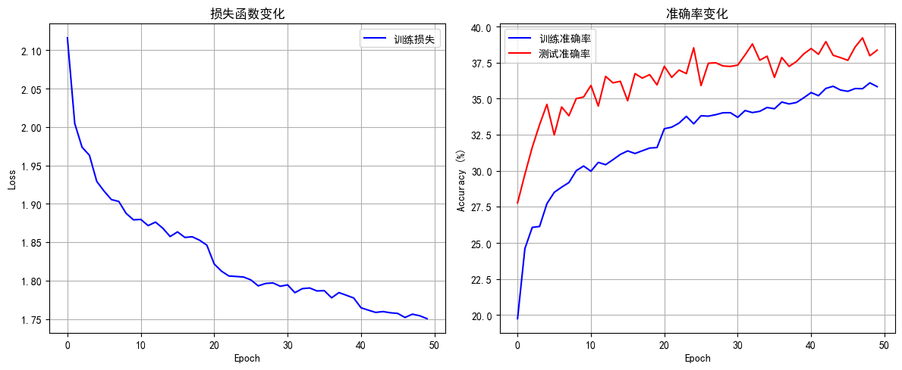
该图展示了模型训练过程中损失函数和准确率随训练轮次的变化情况
**损失函数变化图**
- 损失函数的持续下降表明模型在不断优化，**对训练数据的拟合能力逐步增强**
**准确率变化图**
- 前期快速上升，之后在32%–39%之间波动，整体呈缓慢上升趋势。初始值约为27.5%，最终达到约37.5%。在整个训练过程中，测试准确率普遍高于训练准确率。
**整体而言**
- **有待提高**

#### **分类报告**

| 类别 (Class)              | 精确率 (Precision) | 召回率 (Recall) | F1分数 (F1-Score) | 支持数 (Support) |
| ----------------------- | --------------- | ------------ | --------------- | ------------- |
| airplane                | 0.64            | 0.21         | 0.31            | 1000          |
| automobile              | 0.66            | 0.38         | 0.48            | 1000          |
| bird                    | 0.21            | 0.12         | 0.15            | 1000          |
| cat                     | 0.18            | 0.24         | 0.21            | 1000          |
| deer                    | 0.31            | 0.47         | 0.37            | 1000          |
| dog                     | 0.41            | 0.32         | 0.36            | 1000          |
| frog                    | 0.33            | 0.64         | 0.44            | 1000          |
| horse                   | 0.48            | 0.49         | 0.49            | 1000          |
| ship                    | 0.55            | 0.41         | 0.47            | 1000          |
| truck                   | 0.45            | 0.55         | 0.50            | 1000          |
|                         |                 |              |                 |               |
| 准确率 (Accuracy)      |                 |              | 0.38        | 10000     |
| 宏平均 (Macro Avg)     | 0.42        | 0.38     | 0.38        | 10000     |
| 加权平均 (Weighted Avg) | 0.42        | 0.38     | 0.38        | 10000     |

	（注：accuracy 是整体准确率，故留空；macro avg 和 weighted avg 的 precision、recall、f1-score 均按对应方式计算。）
这是其中的混淆矩阵图
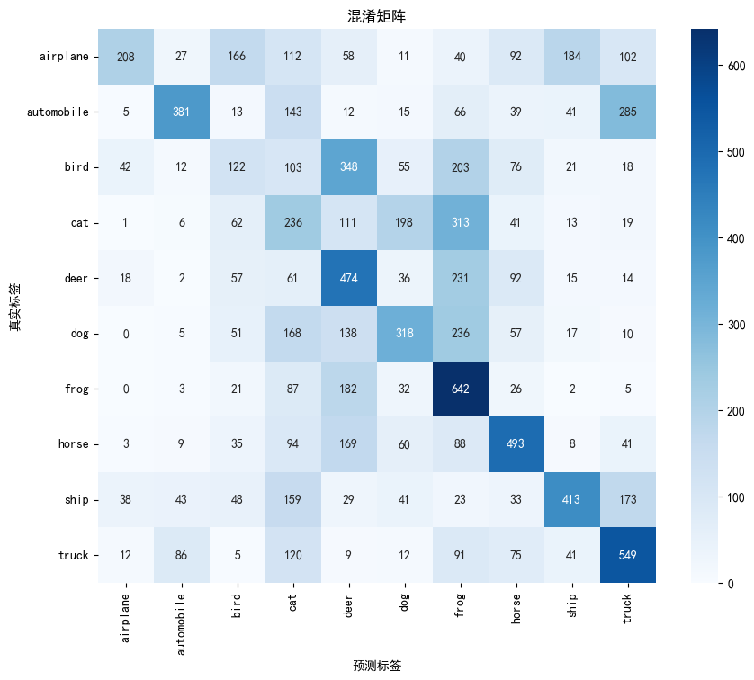
据图简单分析：
	对部分类别（如frog、truck等）具有较强识别能力，对角线数值在相应类别中显著但- 模型在 airplane、cat、dog、ship 等类别上识别性能较弱，错分严重。

### 训练基础CNN模型
基础CNN模型评估结果:
    **测试准确率: 0.8467
    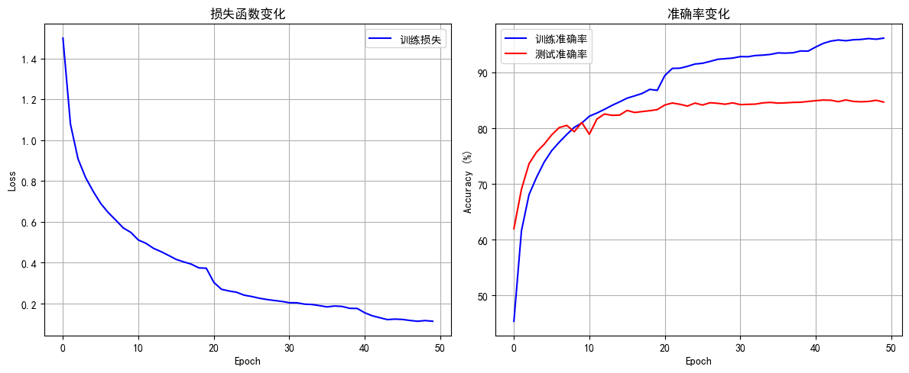
**损失函数变化图**
- 损失显著降低表明模型参数优化有效，对训练数据的拟合能力逐步提升。
**准确率变化图**
- 测试准确率提前收敛且明显低于训练准确率，根据Epoch [50/50], Loss: 0.1134, Train Acc: 96.12%, Test Acc: 84.67%，出现了过拟合现象了。
- 有待优化，后续尝试采用早停策略，以及调整模型复杂度或网络深度，避免过度参数化。

#### **分类报告**
| 类别 (Class)              | 精确率 (Precision) | 召回率 (Recall) | F1分数 (F1-Score) | 支持数 (Support) |
| ----------------------- | --------------- | ------------ | --------------- | ------------- |
| airplane                | 0.86            | 0.86         | 0.86            | 1000          |
| automobile              | 0.93            | 0.92         | 0.93            | 1000          |
| bird                    | 0.81            | 0.75         | 0.78            | 1000          |
| cat                     | 0.74            | 0.69         | 0.72            | 1000          |
| deer                    | 0.82            | 0.85         | 0.83            | 1000          |
| dog                     | 0.76            | 0.79         | 0.78            | 1000          |
| frog                    | 0.86            | 0.89         | 0.88            | 1000          |
| horse                   | 0.90            | 0.87         | 0.88            | 1000          |
| ship                    | 0.89            | 0.92         | 0.90            | 1000          |
| truck                   | 0.90            | 0.92         | 0.91            | 1000          |
|                         |                 |              |                 |               |
| 准确率 (Accuracy)      |                 |              | 0.85            | 10000         |
| 宏平均 (Macro Avg)     | 0.85        | 0.85         | 0.85            | 10000         |
| 加权平均 (Weighted Avg) | 0.85        | 0.85         | 0.85            | 10000         |
混肴矩阵如下
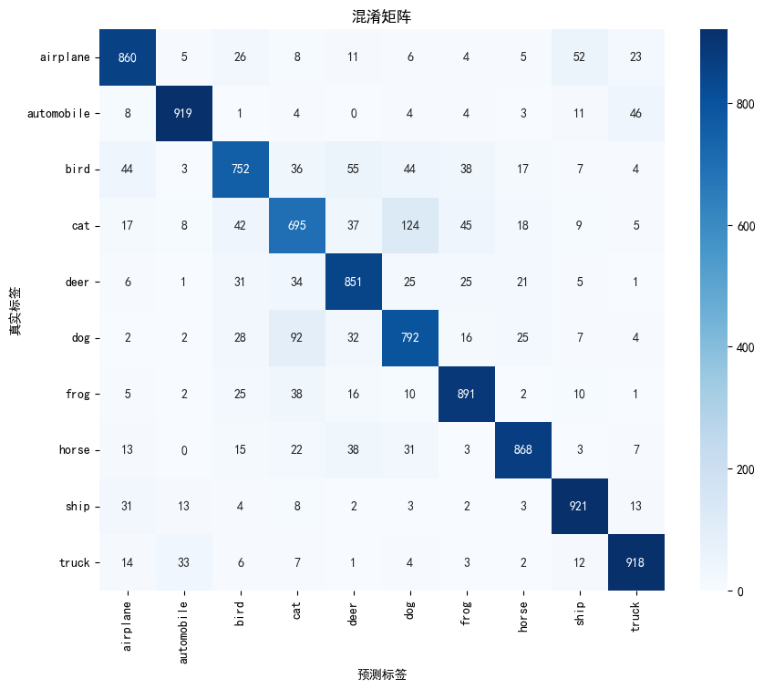
整体来看
- 在多数类别上表现良好
- 得抑制过拟合，引入更强的正则化、使用数据增强（随机裁剪、翻转、色彩抖动等）扩充训练数据多样性，或采用早停策略等待尝试。
---
## 实验分析
### 整体性能排行榜
| 排名  | 模型配置          | 准确率    |
| --- | ------------- | ------ |
| 1   | 64通道CNN       | 86.83% |
| 2   | ReLU CNN      | 85.31% |
| 3   | 32通道CNN       | 85.29% |
| 4   | LeakyReLU CNN | 84.92% |
| 5   | 4层CNN         | 84.82% |
| 6   | 基础CNN         | 84.67% |
| 7   | 3层CNN         | 84.49% |
| 8   | ELU CNN       | 84.11% |
| 9   | 2层CNN         | 82.63% |
| 10  | 16通道CNN       | 81.93% |
| 11  | Tanh CNN      | 81.38% |
| 12  | MLP基线         | 38.36% |
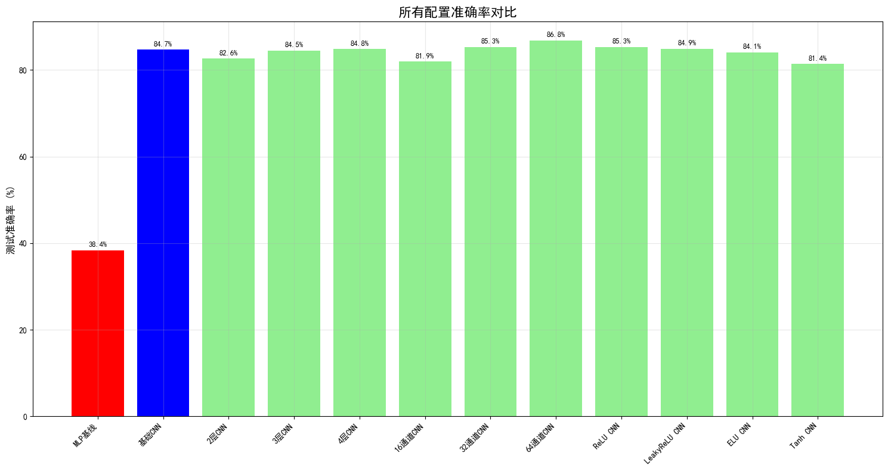
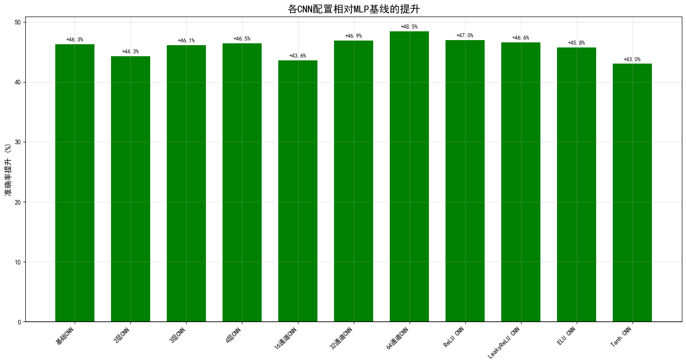
- **整体优势明显**：所有CNN模型的准确率均显著超越MLP基线，提升区间为**43.0%–48.5%**，证明卷积结构在特征提取上具有根本性优势。
### 整体分析
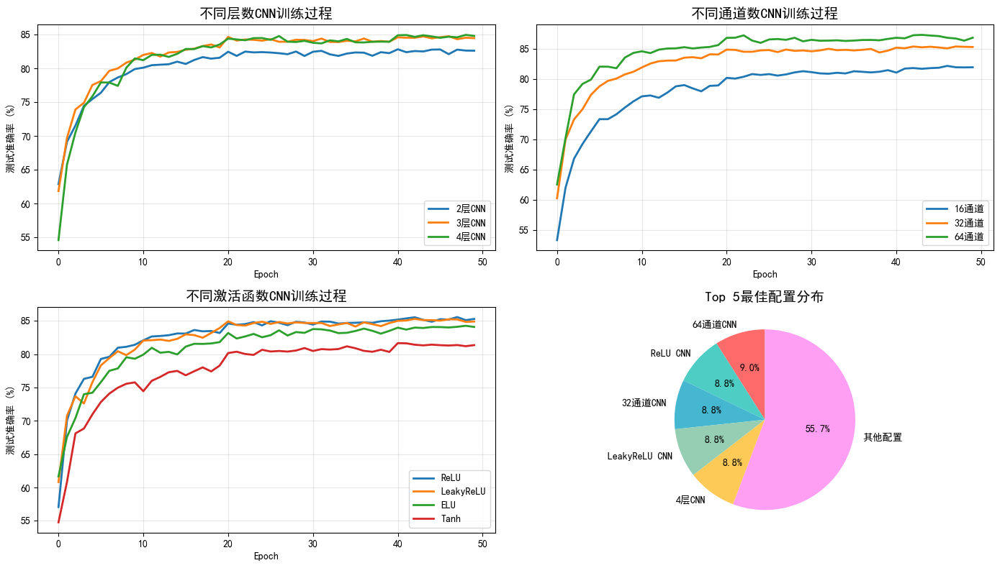
- 通道数增加带来显著性能提升：模型准确率随通道数增加持续提高，16通道（提升43.6%）、32通道（提升46.9%）、64通道（提升48.5%），表明增加特征映射数量能有效增强模型表征能力。

- 网络深度与性能并非简单正相关：层数增加未带来一致性能提升，2层结构甚至出现性能回落（提升44.3%），3层与4层CNN（分别提升46.1%和46.5%）虽优于2层但仍未显著超越基础CNN（提升46.3%），表明盲目增加网络深度可能引发梯度问题或过拟合，深度优化需要结合其他调整。

- 激活函数选择影响明显：ReLU（提升47.0%）及LeakyReLU（提升46.6%）表现最佳，ELU（提升45.8%）次之，Tanh（提升43.0%）效果相对较差，说明非饱和激活函数更有利于梯度传播与模型收敛。

- **但根据各CNN模型的运行结果来看，需要解决过拟合问题**
### MLP vs CNN基线对比
- **MLP基线**：38.36%
- **CNN基线**：84.67%
- **性能提升**：46.31%
- 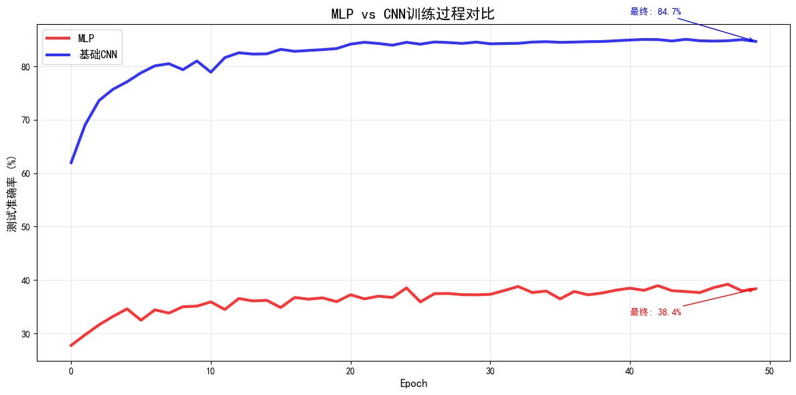
总结CNN相对于MLP的巨大提升验证了卷积操作在图像特征提取中的优势，其中MLP直接处理扁平化像素，忽略了空间结构信息。
---

## 配置参数影响分析
### 网络层数配置比较
|网络层数|测试准确率|性能变化|
|---|---|---|
|2层CNN|82.63%|基线|
|3层CNN|84.49%|+1.86%|
|4层CNN|84.82%|+2.19%|

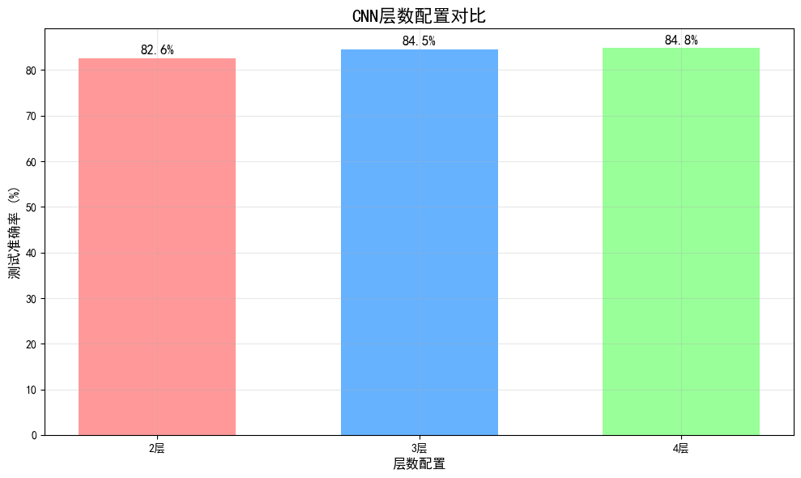
- 最优层数为4层CNN，此时达到最佳性能84.82%。
- 性能变化趋势显示：从2层增加到3层时准确率提升1.86%，从3层增加到4层时提升幅度收窄至0.33%。
- 原因在于：2层网络的特征提取能力有限；3层网络在特征复杂度和计算效率之间达到较好平衡；4层网络虽然继续提升性能，但边际效益出现递减，表明进一步增加层数带来的提升将越来越有限。
### 卷积核数配置比较
|卷积核数|测试准确率|性能变化|
|---|---|---|
|16通道CNN|81.93%|基线|
|32通道CNN|85.29%|+3.36%|
|64通道CNN|86.83%|+4.90%|

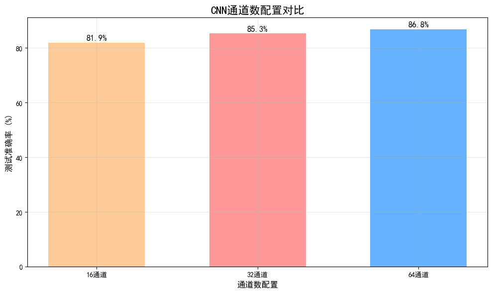
随着通道数增加，模型性能也跟着持续变好。可能因为：

- **16通道**：太少了，模型能学习到的特征有限，能力跟不上。
- **32通道**：数量比较合适，能让模型学到丰富多样的特征。
- **64通道**：充足的通道支持更复杂、更精细的特征融合，进一步提升识别性能，达到最优表现。

### 激活函数配置比较

| 激活函数          | 测试准确率  | 性能变化   |
| ------------- | ------ | ------ |
| Tanh CNN      | 81.38% | 基线     |
| ELU CNN       | 84.11% | +2.73% |
| LeakyReLU CNN | 84.92% | +3.54% |
| ReLU CNN      | 85.31% | +3.93% |
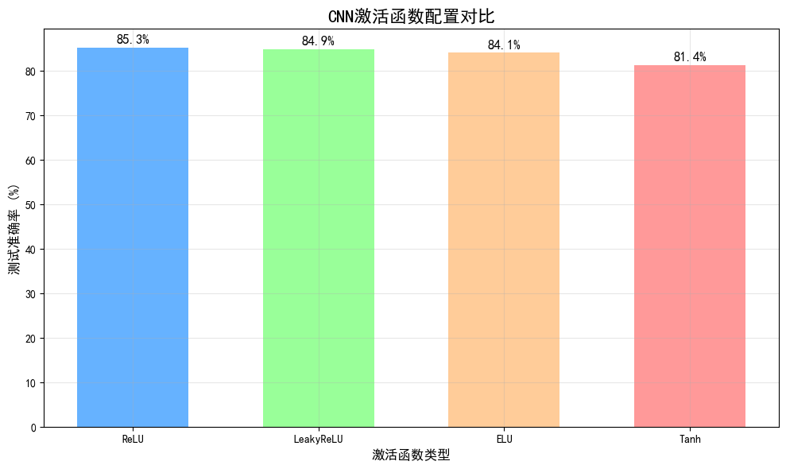
- 最优激活函数是ReLU，达到85.31%的准确率。从性能上看，ReLU和LeakyReLU差不多，LeakyReLU 性能略低于ReLU，准确率为84.92%（提升3.54%）但都比ELU和Tanh要好。
- ReLU计算简单，训练起来快，在这个任务上效果很稳定。LeakyReLU解决了ReLU的一些毛病，效果和ReLU基本一样。ELU处理负数的方式更平滑，但在这里没什么优势。Tanh有梯度消失的问题，在深一点的网络里效果就不行了。
## 总结

1. 但从网络层数、卷积核数和激活函数配置来看  应该选择配置为：增加通道数 > 选择合适激活函数 > 增加网络深度
2. 对于激活函数的选择首选ReLU
3. 仍需要解决过拟合问题，根据基础CNN以及每一个的配置绘制的准确率图来看，需要解决过拟合问题，后续会尝试使用引入更强的正则化、使用数据增强（随机裁剪、翻转、色彩抖动等）扩充训练数据多样性，或采用早停策略等待尝试。
4. 最后一步的保存所有模型是尝试使用ONNX与C++结合