### 引言：我们为什么要“优化”？

想象一下，你在一个黑暗的山谷里，目标是要走到最低的点（山谷最低处）。你看不见全貌，只能靠脚感受地面的坡度。**优化器**就是帮你决定**每一步该往哪个方向走、走多大步长**的智能导航策略。

在深度学习中，**山谷**就是**损失函数**（表示模型预测得多差），**你的位置**就是模型的**参数（权重W和偏置b）**。优化的目标就是找到让损失函数最小的那组参数。

---

### 第一章：基础导航法 —— 随机梯度下降（SGD）

**1. 核心思想：**
跟着感觉走！你感觉到哪个方向是下坡，就朝那个方向走一步。

**2. 数学公式：**
$$
\theta = \theta - \eta \cdot g
$$
- $\theta$：你当前的位置（模型参数）。
- $g$：你脚下的坡度（梯度，即损失函数对参数的导数）。
- $\eta$：你的步长（学习率）。

**3. 通俗解释：**
每次只看一小批数据（一个迷你批次），计算这批数据带来的“坡度”，然后根据这个坡度调整参数。步子大小（学习率）是固定的。

**4. 例子：**
假设你在调整一个参数$w$，当前损失函数的梯度$g=2$，学习率$\eta=0.1$。
那么更新就是：$w_{\text{新}} = w_{\text{旧}} - 0.1 \times 2$。

**5. 缺点：**
- 如果山谷很陡但很窄，你可能会在谷底两边来回震荡，走得很慢。
- 如果地面平坦，坡度很小，你会走得非常慢。


---

### 第二章：带上“惯性” —— SGD with Momentum

**1. 核心思想：**
不只是看当前的坡度，还要考虑你之前移动的**惯性**。就像下坡时推一个球，它会越滚越快。

**2. 数学公式：**
$$
v = \gamma v - \eta \cdot g
$$
$$
\theta = \theta + v
$$
- $v$：速度（动量），累积了之前的梯度方向。
- $\gamma$：动量系数（比如0.9），表示惯性有多大。

**3. 通俗解释：**
- 如果连续几次都朝同一个方向走，你的速度会加快，从而冲过一些小的上坡（局部最小点）。
- 如果方向频繁改变，动量会相互抵消，使路径更稳定。

**4. 例子：**
假设前几步的梯度都是正方向，你的速度$v$已经积累得很大。即使某一步遇到一个反向的小坡，惯性也会让你继续朝原方向冲一段，有可能冲过一个小山丘，找到更低的山谷。

**5. 优点：**
- 减少震荡，加快收敛。
- 有助于逃离局部最小值。

---

### 第三章：智能步长 —— Adagrad

**1. 核心思想：**
为每个参数定制不同的步长。对于经常更新（坡度大）的参数，给它小步走；对于不常更新（坡度小）的参数，给它大步走。

**2. 数学公式：**
$$
c = c + g^2
$$
$$
\theta = \theta - \eta \cdot \frac{g}{\sqrt{c + \epsilon}}
$$
- $c$：累积了每个参数**历史梯度平方和**。
- $\epsilon$：一个很小的数（如1e-8），防止除以零。

**3. 通俗解释：**
- 如果一个参数的梯度一直很大，它的$c$就会很大，分母$\sqrt{c}$变大，有效学习率$\frac{\eta}{\sqrt{c}}$就变小了，于是它后续的步长会变小。
- 反之，梯度小的参数，有效学习率会保持较大。

**4. 例子：**
参数$\theta_1$的历史梯度平方和$c_1=100$，而$\theta_2$的$c_2=1$。
那么：
- $\Delta \theta_1 = - \frac{\eta}{\sqrt{100}} g_1 = - \frac{\eta}{10} g_1$
- $\Delta \theta_2 = - \frac{\eta}{\sqrt{1}} g_2 = - \eta g_2$
$\theta_2$的更新步长比$\theta_1$大10倍！

**5. 缺点：**
- 因为$c$只增不减，学习率会越来越小，最后可能**过早停止**，还没走到最低点就走不动了。

---

### 第四章：解决早停 —— RMSProp

**1. 核心思想：**
Adagrad的升级版。不再无限累积所有历史梯度，而是**更看重最近的梯度**，忘记久远的历史。这样学习率就不会一直下降了。

**2. 数学公式：**
$$
c = \gamma c + (1-\gamma) g^2
$$
$$
\theta = \theta - \eta \cdot \frac{g}{\sqrt{c + \epsilon}}
$$
- $\gamma$：衰减率（如0.9），控制遗忘速度。

**3. 通俗解释：**
- 引入了一个“遗忘因子”$\gamma$。每次更新时，旧的累积值$c$会打一个折扣，再加上一点新的梯度信息。
- 这相当于一个**滑动平均**，让$c$能够反映最近的梯度幅度，而不是所有历史。

**4. 例子：**
假设在平坦区域走了很久，梯度$g$一直很小，$c$也就很小，学习率保持较大，让你能快速前进。突然进入陡峭区域，梯度$g$变大，$c$会迅速增加，从而减小学习率，让你稳步下山。不会像Adagrad那样被远古的平坦历史所拖累。

**5. Adagrad vs RMSProp 直观对比：**

| 特性 | Adagrad | RMSProp |
| :--- | :--- | :--- |
| **历史记忆** | 记住**所有**历史梯度 | **遗忘**久远梯度，关注近期 |
| **学习率趋势** | 单调下降，可能**早停** | 非单调，能自适应地形变化 |
| **适用场景** | 简单的凸问题 | 复杂的非凸问题（如神经网络） |

---

### 第五章：集大成者 —— Adam

**1. 核心思想：**
**动量 + 自适应学习率**！它结合了Momentum的“惯性”和RMSProp的“智能步长”，是当前最流行、默认的优化器。

**2. 数学公式（简化版）：**
$$
m = \beta_1 m + (1-\beta_1) g \quad \text{（一阶矩，带动量的梯度）}
$$
$$
c = \beta_2 c + (1-\beta_2) g^2 \quad \text{（二阶矩，梯度平方的滑动平均）}
$$
$$
\theta = \theta - \eta \cdot \frac{m}{\sqrt{c + \epsilon}}
$$

**3. 数学公式（完整版，带偏置校正）：**
由于$m$和$c$在初始时为0，在训练初期会被低估，因此进行偏置校正：
$$
m_{\text{corrected}} = \frac{m}{1 - \beta_1^t}
$$
$$
c_{\text{corrected}} = \frac{c}{1 - \beta_2^t}
$$
$$
\theta = \theta - \eta \cdot \frac{m_{\text{corrected}}}{\sqrt{c_{\text{corrected}} + \epsilon}}
$$
- $t$是当前迭代次数。
- $\beta_1$（通常0.9）控制动量衰减。
- $\beta_2$（通常0.999）控制二阶矩衰减。

**4. 通俗解释：**
- $m$就像Momentum中的速度$v$，让你保持方向。
- $c$就像RMSProp中的累积量，为你调整步长。
- 两者结合，使得Adam在复杂地形（如神经网络的损失曲面）中表现得非常稳健和高效。

**5. 优点：**
- 通常收敛速度快。
- 对超参数（如学习率）的选择相对不敏感，比较鲁棒。

---

### 优化器家族小结

| 优化器 | 核心思想 | 优点 | 缺点 |
| :--- | :--- | :--- | :--- |
| **SGD** | 基础梯度下降 | 简单 | 易震荡，收敛慢 |
| **SGD+Momentum** | 加入惯性 | 减少震荡，加快收敛 | 仍需要手动调整学习率 |
| **Adagrad** | 自适应学习率 | 为每个参数定制步长 | 学习率单调下降，可能早停 |
| **RMSProp** | 改进的自适应学习率 | 解决Adagrad早停问题 | - |
| **Adam** | **动量 + 自适应** | **快、稳、省心**（默认推荐） | 个别任务上可能不如SGD泛化好 |

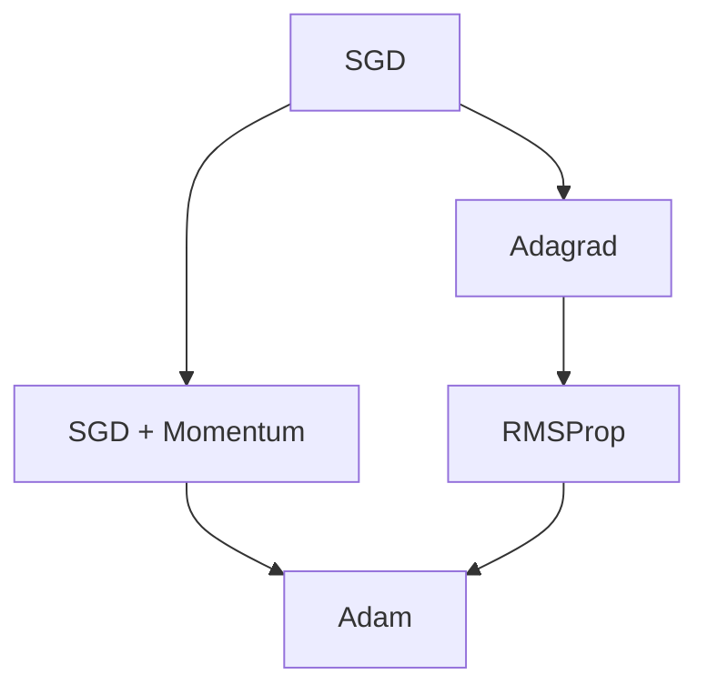

### 如何选择优化器？

- **新手入门/默认选择**：直接用 **Adam**。它在绝大多数情况下都能给你一个不错的结果。
- **追求极致性能**：如果经过精细调参（特别是学习率调度），**SGD with Momentum** 有时能在最终性能上略胜一筹，但需要更多经验。
- **理论研究或简单模型**：使用 **SGD** 以便于分析。

### 延伸学习

如果你想深入了解这些优化器的细节、优缺点对比和更生动的可视化，强烈推荐阅读斯坦福CS231n课程的这份笔记：
**http://cs231n.github.io/neural-networks-3**

它里面有大量的动画和图解，能帮助你形成更直观的理解。

## 第二章：处理过拟合——让模型真正学会"举一反三"

### 引言：什么是过拟合？为什么是头号大敌？

**想象这个场景：**
- 你为了考试，把整本教科书一字不差地背下来了 → **训练集表现完美**
- 但考试时题目稍微变个花样，你就不会做了 → **测试集表现糟糕**

这就是**过拟合**：模型对训练数据学得"太好"了，甚至记住了噪声和无关细节，但失去了泛化到新数据的能力。

在深度学习中，神经网络有数百万甚至数十亿参数，就像一个有超强记忆力的学生，特别容易过拟合。

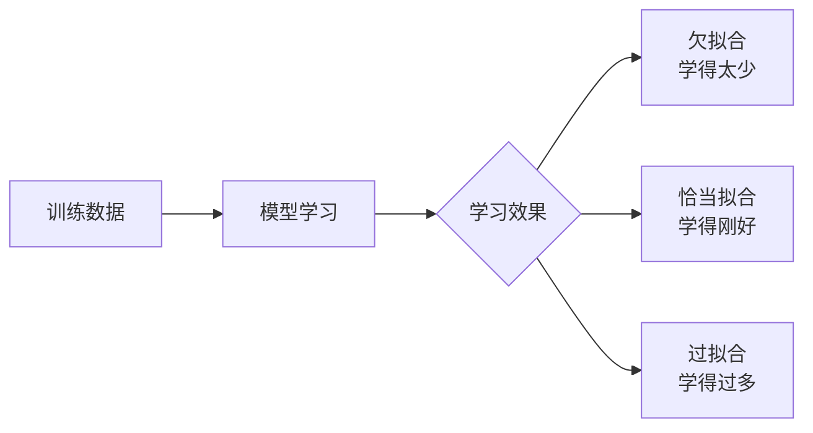

---

### 2.1 回顾：多项式回归的启示

**问题设定：** 用多项式函数 $f(x)$ 来拟合数据点。

- **一次函数（简单模型）：** $f(x) = b + w_1x$ → 可能**欠拟合**，太简单无法捕捉规律
- **二次函数（适中模型）：** $f(x) = b + w_1x + w_2x^2$ → **恰当拟合**，捕捉主要趋势
- **九次函数（复杂模型）：** $f(x) = b + \sum_{i=1}^9 w_i x^i$ → **过拟合**，曲线扭曲穿过每个数据点

**核心启示：** 模型复杂度需要与数据量、任务难度相匹配。神经网络通常很复杂，所以我们需要主动"约束"它，防止过拟合。

---

### 2.2 早停：在恰当的时候喊"停！"

**核心思想：** 实时监控模型在**验证集**上的表现，一旦发现性能开始下降，就立即停止训练。

**为什么要早停？**
- 训练初期：模型同时学习训练集和验证集的**通用规律**
- 训练后期：模型开始记忆训练集的**特有噪声和细节**，导致验证集性能下降

**具体操作：**
1. 将数据分为**训练集**、**验证集**、**测试集**
2. 训练时定期在验证集上评估性能（如准确率、损失值）
3. 当验证集性能连续多次不再提升时，停止训练

**可视化理解：**
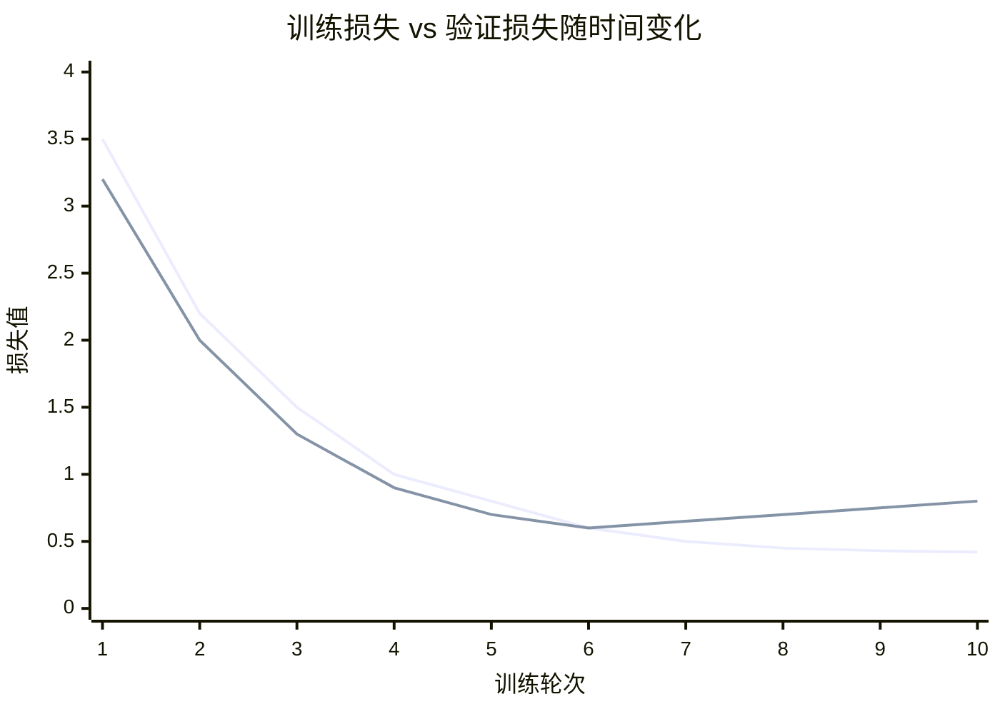
- **蓝色线（训练损失）：** 持续下降
- **红色线（验证损失）：** 先下降后上升 → **红色箭头处是最佳停止点**

**优点：** 简单有效，无需改变模型结构或数据
**注意：** 这与Adagrad导致的学习率下降早停是两回事！

---

### 2.3 随机失活：让神经元学会"独立生存"

#### 2.3.1 核心思想与训练过程

**灵感来源：** 如果团队中每个人都能独立完成任务，那么团队就更稳健。随机失活就是在训练时随机"关闭"一部分神经元，迫使每个神经元都能独立有用。

**训练过程：**
- 每次前向传播时，以概率 $p$（如0.5）随机将每个隐藏层神经元的输出**置为零**
- 被关闭的神经元在本次迭代中不参与计算，也不更新权重

**数学表达（训练时）：**
```python
# 对于每个神经元，以概率p随机关闭
mask = random_binomial(shape=layer_output.shape, p=keep_prob)  # keep_prob=1-p
layer_output *= mask  # 部分神经元输出变为0
```

#### 2.3.2 测试过程：使用"平均网络"

**问题：** 训练时只有部分神经元工作，测试时如果全部使用，输出幅度会不一致。

**解决方案：** 使用**平均网络**，即所有神经元都参与，但调整它们的输出权重。

**两种等价方法：**
1. **测试时缩放激活值：** $a_{\text{test}} = (1-p) \times f(Wx+b)$
2. **训练时放大激活值：** $a_{\text{train}} = \frac{1}{(1-p)} f(Wx+b)$，测试时不做调整

**通俗理解：**
- 训练时只有50%的神经元工作，所以每个神经元需要更"卖力"（输出放大2倍）
- 测试时100%神经元工作，大家平分任务（输出恢复原状）

#### 2.3.3 Dropout为什么有效？

1. **防止协同适应：** 神经元不能依赖"邻居"存在，必须自己有用
2. **模型平均：** 相当于训练了多个不同的子网络，测试时组合它们的结果
3. **增强鲁棒性：** 模型对输入噪声和神经元缺失更不敏感

#### 2.3.4 MNIST上的实际效果

在经典的手写数字识别任务MNIST上：
- **不用Dropout：** 最好结果约160个错误样本
- **使用Dropout（隐藏层p=0.5）：** 错误样本降至约80个

**效果显著！** 错误率降低了50%。

#### 2.3.5 补充说明与实践技巧

- **分层设置p值：** 低层（接近输入）p设较大（如0.8），高层（接近输出）p设较小（如0.5）
- **输入层通常不用Dropout**，或使用很高的保留概率（如0.9）
- **不同框架定义可能不同：** 有些框架的dropout_rate指丢弃概率，有些指保留概率

---

### 2.4 数据增强："创造"更多的训练数据

#### 2.4.1 核心思想

如果真实数据有限，我们就**人工创造**更多的训练样本！通过对原始图像进行各种变换，生成新的训练样本。

**数学表达：**
原始训练集：$\{(x^{(n)}, t^{(n)})\}$
增强后训练集：$\{(x^{(n)}, t^{(n)})\} \cup \{(\hat{x}^{(n)}, t^{(n)})\}$
其中 $\hat{x}^{(n)}$ 是 $x^{(n)}$ 经过变换得到的

#### 2.4.2 常用的图像变换方法

##### 1. 随机翻转
- **水平翻转：** 像镜子一样左右翻转图像
- **垂直翻转：** 上下翻转（对于某些任务不适用，如人脸识别）

**适用场景：** 几乎所有图像分类任务都适用水平翻转

##### 2. 随机缩放和剪裁
- **训练时：** 随机缩放图像，然后随机裁剪指定大小的区域
- **测试时：**
  - 方法1：直接缩放至模型输入大小
  - 方法2：裁剪多个区域（如四个角+中心），对预测结果取平均

**例子：** 模型需要224×224输入，训练时先缩放到256×256，再随机裁剪224×224区域

##### 3. 随机擦除
- 随机选择图像中的一块矩形区域，用随机值或均值填充
- 迫使模型不只关注最明显的特征，而是学习全局信息

**测试技巧：** 通常直接输入完整图像，不做擦除

##### 4. 其他常用变换
- **颜色抖动：** 调整亮度、对比度、饱和度、色调
- **旋转：** 小角度随机旋转（如±15°）
- **仿射变换：** 平移、剪切、拉伸等
- **混合：** 将两张图像按比例混合，标签也相应混合

#### 2.4.3 数据增强的哲学

**核心目标：** 创造的新数据应该**在现实世界中可能出现**。
- ✅ 猫的图片水平翻转后还是猫
- ❌ 把猫变成绿色就不是合理的增强

---

### 处理过拟合方法小结

| 方法 | 核心思想 | 优点 | 适用场景 |
|------|----------|------|----------|
| **早停** | 监控验证集性能，适时停止训练 | 简单有效，无需改变模型 | 所有深度学习任务 |
| **随机失活** | 训练时随机关闭神经元，测试时组合 | 显著提升泛化能力 | 全连接层效果最好 |
| **数据增强** | 对训练数据施加变换，增加多样性 | 免费获得更多训练数据 | 图像、语音、文本等 |

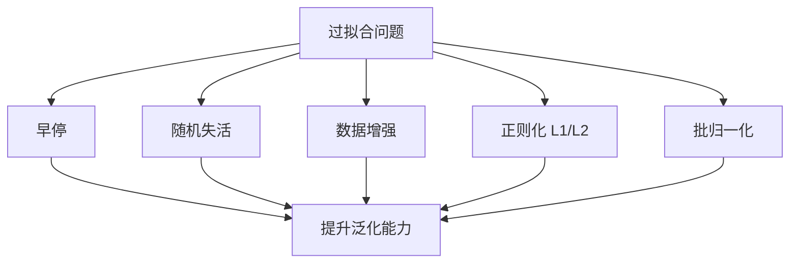

### 实际应用建议

1. **基础组合：** 早停 + 数据增强（几乎总是有益）
2. **进阶组合：** 加入Dropout（特别是全连接层多的模型）
3. **现代趋势：** 使用批归一化(Batch Norm)后，Dropout的作用可能减弱，可以适当减少使用

### 思考题

如果一个模型在训练集上准确率95%，在验证集上只有70%，这是什么现象？你会优先尝试哪种方法来解决？

答案：这是典型的**过拟合**。我会优先尝试：
1. 增加数据增强的强度和多样性
2. 在隐藏层添加或调整Dropout
3. 检查是否应该更早停止训练


## 第三章：批归一化——让深度网络训练更稳定、更快速

### 引言：为什么需要批归一化？

**想象这个场景：**
你在教一个团队完成流水线作业，但每次交接工作时，前一个工序的输出质量都不稳定（有时太快，有时太慢）。这会导致整个生产线效率低下。

在深度学习中，这就是**内部协变量偏移**问题。批归一化就是给每个工序加上"质检站"，确保交给下一道工序的"半成品"质量稳定。

---

### 3.1 "Internal Covariate Shift"（内部协变量偏移）

#### 核心问题定义

**Internal Covariate Shift（ICS）：** 在深度神经网络训练过程中，由于前面层参数的不断更新，导致后面层的**输入分布**发生变化的现象。

#### 通俗解释

假设网络有10层，第5层的输入来自于第4层的输出：
- **迭代#i时：** 第4层的参数是W₁，第5层看到的输入分布是P₁
- **迭代#i+1时：** 第4层参数更新为W₂，第5层看到的输入分布变成了P₂
- **问题：** 第5层要不断适应变化的输入分布，就像 constantly moving target（不断移动的目标）

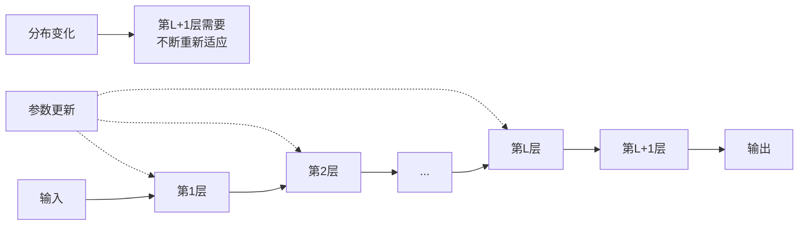

#### 可视化理解

```
迭代#i:  输入 → 层1 → 层2 → ... → 层L → [分布P₁] → 层L+1
迭代#i+1: 输入 → 层1 → 层2 → ... → 层L → [分布P₂] → 层L+1
迭代#i+2: 输入 → 层1 → 层2 → ... → 层L → [分布P₃] → 层L+1
```

**后果：**
- 训练不稳定，需要更小的学习率
- 收敛速度慢
- 对参数初始化敏感

---

### 3.2 通过归一化来减少ICS

#### 解决方案思路

**核心思想：** 在每一层的输入处插入一个"归一化层"，强制让输入分布保持稳定。

#### 数学公式

对于d维的激活值 $x = (x_1, x_2, ..., x_d)$，进行如下变换：

1. **计算均值和方差：**
   $$E[x_i] = \frac{1}{m}\sum_{j=1}^m x_i^{(j)}$$
   $$\text{Var}[x_i] = \frac{1}{m}\sum_{j=1}^m (x_i^{(j)} - E[x_i])^2$$

2. **归一化：**
   $$\hat{x}_i = \frac{x_i - E[x_i]}{\sqrt{\text{Var}[x_i] + \epsilon}}$$

3. **缩放和平移（恢复表达能力）：**
   $$y_i = \gamma_i \hat{x}_i + \beta_i$$

#### 为什么要缩放和平移？

如果只是归一化，会限制层的表达能力。比如：
- 某些情况下，原来的非零均值是有意义的
- 通过可学习的参数 $\gamma_i$ 和 $\beta_i$，网络可以**自己决定**是否需要恢复原来的分布

**特殊情况下：** 如果 $\gamma_i = \sqrt{\text{Var}[x_i]}$ 且 $\beta_i = E[x_i]$，那么就完全恢复了原始激活值。

---

### 3.3 批归一化（Batch Normalization, BN）层

#### 前向传播过程

批归一化层定义：$y^{(n)} = BN_{\gamma,\beta}(x^{(n)})$

**具体步骤：**

1. **计算小批量统计量：**
   $$\mu_B = \frac{1}{m} \sum_{n=1}^m x^{(n)}$$
   $$\sigma_B^2 = \frac{1}{m} \sum_{n=1}^m (x^{(n)} - \mu_B)^2$$

2. **归一化：**
   $$\hat{x}^{(n)} = \frac{x^{(n)} - \mu_B}{\sqrt{\sigma_B^2 + \epsilon}}$$

3. **缩放平移：**
   $$y^{(n)} = \gamma \hat{x}^{(n)} + \beta$$

#### 逐元素操作

**重要细节：** BN是对**每个特征维度**独立进行的。
- 如果输入是d维向量，那么有d个 $\gamma_i$ 和 d个 $\beta_i$ 参数
- 每个维度有自己的均值和方差

#### 反向传播需要计算什么？

在反向传播中，需要计算：
1. 对输入 $x$ 的梯度：$\frac{\partial L}{\partial x}$
2. 对参数 $\gamma$ 的梯度：$\frac{\partial L}{\partial \gamma}$
3. 对参数 $\beta$ 的梯度：$\frac{\partial L}{\partial \beta}$

这些都可以通过链式法则推导出来，现代深度学习框架会自动计算。

---

### 3.4 推理过程（测试阶段）

#### 关键问题

训练时我们使用**小批量**的统计量（$\mu_B$, $\sigma_B^2$），但测试时可能只有一个样本，如何计算？

#### 解决方案：使用移动平均

在训练过程中，我们维护**全局统计量**：
- 运行均值：$E[x] = E_B[\mu_B]$
- 运行方差：$\text{Var}[x] = \frac{m}{m-1} E_B[\sigma_B^2]$（无偏估计）

**测试时的归一化：**
$$\hat{x} = \frac{x - E[x]}{\sqrt{\text{Var}[x] + \epsilon}}$$
$$y = \gamma \hat{x} + \beta$$

#### 实际操作

通常使用**指数移动平均**来更新全局统计量：
$$\mu_{global} = \alpha \cdot \mu_{global} + (1-\alpha) \cdot \mu_B$$
$$\sigma^2_{global} = \alpha \cdot \sigma^2_{global} + (1-\alpha) \cdot \sigma^2_B$$

其中 $\alpha$ 通常取0.9或0.99。

---

### 3.5 在网络中的位置

#### 标准位置：线性层之后，激活函数之前

**典型结构：**
$$z = Wx + b$$
$$z_{norm} = BN(z)$$
$$a = f(z_{norm})$$

其中 $f$ 是激活函数（如ReLU）。

#### 为什么在这个位置？

1. **归一化线性输出：** 线性层的输出可能具有任意均值和方差
2. **稳定激活函数输入：** 确保激活函数接收到相对稳定的输入分布
3. **实践经验表明效果最好**

#### 偏置项 $b$ 可以省略

因为BN中的 $\beta$ 参数已经起到了偏置的作用：
$$y = BN(Wx) = \gamma \cdot \frac{Wx - \mu}{\sigma} + \beta$$

所以原来的 $b$ 是冗余的，可以设为零。

---

### 3.6 卷积神经网络中的批归一化

#### 特殊考虑

CNN中的特征图是4维张量：[批量大小, 通道数, 高度, 宽度]

**BN在CNN中的做法：**
- 对**每个通道**独立进行归一化
- 统计量基于：$M \times P \times Q$ 个元素（批量大小 × 高度 × 宽度）
- 每个通道学习一对参数 $(\gamma_c, \beta_c)$

#### 例子说明

假设：
- 批量大小 $M = 32$
- 特征图大小 $56 \times 56$
- 通道数 $C = 64$

那么：
- 对每个通道，基于 $32 \times 56 \times 56 = 100,352$ 个元素计算均值和方差
- 总共有64个 $\gamma_c$ 和 64个 $\beta_c$ 参数

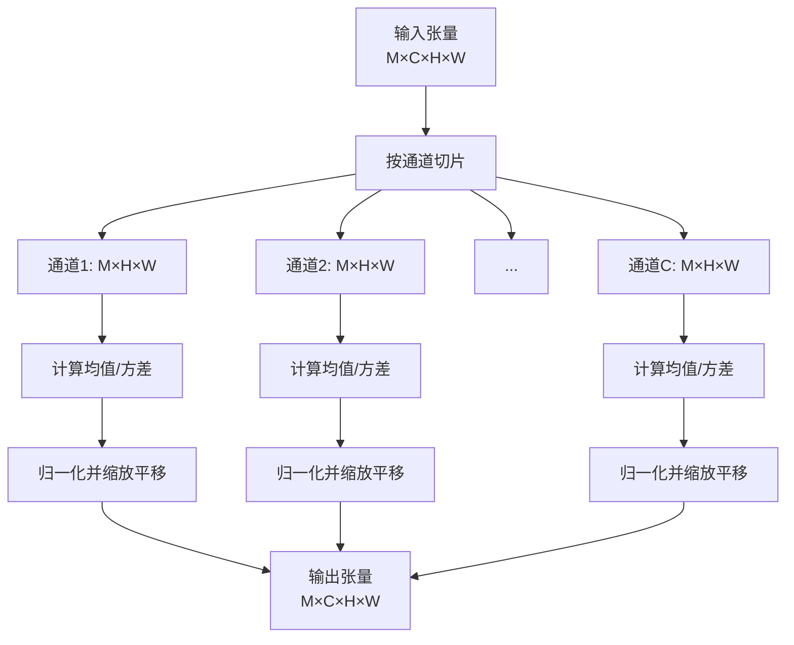

---

### 3.7 批归一化的优点

#### 1. 允许使用更大的学习率
- 归一化后，梯度更加稳定
- 可以使用更大的学习率加速收敛

#### 2. 减少对初始化的依赖
- 网络对权重初始化的敏感度降低
- 更容易训练非常深的网络

#### 3. 有一定的正则化效果
- 每个小批量的统计量带有噪声
- 类似于Dropout的效果，可能不再需要Dropout

#### 4. 实验效果显著

**MNIST上的结果：**
- 使用BN后，收敛速度显著加快
- 最终准确率更高

**Inception网络在ImageNet上的结果：**
- BN版本更快达到更高的验证准确率
- 训练更加稳定

---

### 3.8 批归一化小结

#### 动机：解决内部协变量偏移（ICS）
- 深层网络中，前面层参数更新导致后面层输入分布变化
- 增加优化难度，需要更小的学习率

#### 方法：插入归一化层
$$\hat{x}_i = \frac{x_i - E[x_i]}{\sqrt{\text{Var}[x_i] + \epsilon}}$$
$$y_i = \gamma_i \hat{x}_i + \beta_i$$

#### 真正有效原因的争议
虽然BN最初是为了解决ICS提出的，但后续研究（如Santurkar等，NeurIPS 2018）发现：
- BN的主要作用可能是**平滑优化地形**，使损失函数更容易优化
- 而不仅仅是减少内部协变量偏移

#### 实践建议
1. **默认使用：** 在现代深度网络中，BN几乎是标配
2. **位置：** 线性层/卷积层之后，激活函数之前
3. **与Dropout的关系：** 使用BN后，可以减少或移除Dropout
4. **学习率：** 可以尝试使用更大的学习率

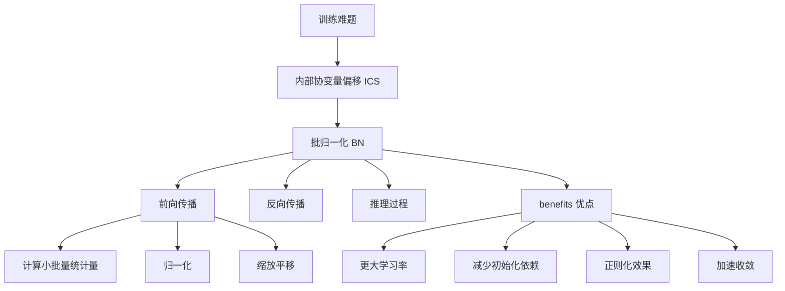

### 思考题

1. 为什么BN在训练和测试时的行为不同？
2. 如果批量大小设为1，BN还能正常工作吗？会遇到什么问题？
3. BN中的 $\gamma$ 和 $\beta$ 参数有什么作用？如果去掉会怎样？

---

## 第四章：超参数选取——调参的艺术与科学

引言：为什么超参数如此重要？

想象这个场景：
你有一辆顶级跑车（模型架构），但如果不会调节变速箱、悬挂、油门灵敏度（超参数），可能连普通家用车都跑不过。

在深度学习中：

· 模型参数： 通过训练自动学习（权重W、偏置b）
· 超参数： 训练前人为设定，控制算法行为

超参数决定了： 模型能学多好、学多快、是否稳定。

---

### 4.1 超参数：控制算法的"驾驶面板"

什么是超参数？

定义： 控制算法行为，且不会被算法本身更新的参数。它们决定了模型的能力容量。

常见的超参数家族

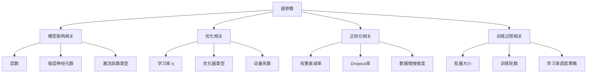

为什么超参数选择困难？

1. 组合爆炸： 如果有10个超参数，每个取5个值，就有5¹⁰ ≈ 1千万种组合
2. 相互影响： 学习率的最佳值依赖于批量大小等其它超参数
3. 计算昂贵： 每个组合都需要完整的训练过程来评估
4. 问题依赖： 对某个数据集好的配置，对另一个可能完全无效

---

### 4.2 如何选择深度学习模型的架构？

原则：站在巨人的肩膀上

不要从零开始发明轮子！ 利用已有的经验和知识。

三步选择法

第1步：熟悉你的数据集

· 看： 可视化样本，理解数据特点
· 统计： 样本数量、类别分布、图像尺寸、输入复杂度
· 分析： 任务难度、数据质量、噪声情况

例子：

· 数据集只有1万张图片 → 不适合用ResNet-152这种超大模型
· 图像尺寸很小（32×32）→ 不需要很深的卷积网络

第2步：与相似任务比较

· 找基准： 在类似数据集上什么模型表现好？
· 考虑约束： 计算资源、推理速度要求
· 借鉴经验： 学术论文、开源项目、技术博客

第3步：从已验证的模型开始

· 图像分类： ResNet, EfficientNet, Vision Transformer
· 目标检测： YOLO, Faster R-CNN
· 自然语言处理： BERT, GPT, T5

实际建议

新手入门路径：

1. 从简单模型开始（如3-5层的CNN）
2. 如果欠拟合，逐步增加复杂度
3. 参考PyTorch Hub、Hugging Face上的预训练模型

---

### 4.3 如何选择其它超参数？——六步实践指南

这是由Fei-Fei Li & Justin Johnson & Serena Yeung (CS231n 2019) 总结的经典方法。

#### 第1步：观察初始损失

目的： 验证整个训练流程的基础设置是否正确。

具体操作：

· 将权重衰减（正则化）设为零
· 进行前向传播，计算初始损失
· 验证损失值是否符合理论预期

例子：

· 10分类问题，模型随机初始化
· 理论初始损失 = $-ln(1/10) ≈ 2.302$
· 如果实际值相差很大，说明有问题

常见问题排查：

· ✅ 损失值符合预期 → 继续下一步
· ❌ 损失值异常 → 检查数据预处理、模型初始化、损失函数

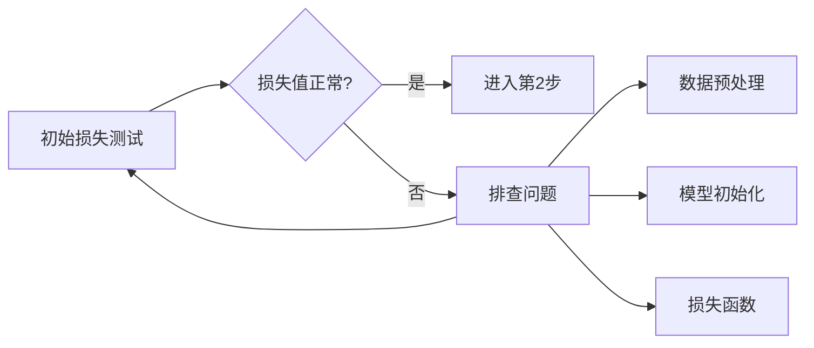

#### 第2步：在一组小样本上过拟合

目的： 验证模型有能力学习，确保从数据到输出的整个流程正确。

具体操作：

· 选择很小的训练集（如每个类别5-10个样本）
· 训练直到达到100%的训练准确率
· 观察训练过程

结果分析：

现象 可能原因 解决方案
损失根本不下降 学习率太小、模型太小、初始化问题 增大学习率、增加模型容量
损失变成Inf/NaN 学习率太大、数值不稳定 减小学习率、检查数据范围
正常下降至过拟合 ✅ 流程正确，进入下一步 -

经验值： 在小样本上应该在几十个epoch内达到100%训练准确率。

#### 第3步：找到使损失下降的学习率

目的： 找到能让损失快速下降的学习率范围。

具体操作：

· 在全部数据上训练
· 尝试不同的学习率（如1e-5, 1e-4, 1e-3, 1e-2, 1e-1）
· 观察最初几个epoch的损失下降情况
· 选择损失下降最快的学习率

学习率范围经验：

· 太大：损失爆炸（NaN）
· 合适：损失平稳快速下降
· 太小：损失基本不变

实际技巧：

· 使用较小的权重衰减（如1e-4）
· 观察最初1-2个epoch的效果即可

#### 第4步：粗粒度改变学习率，训练1-5轮

目的： 在第三步的基础上，进行粗调，找到有希望的几个超参数组合。

具体操作：

· 围绕第三步找到的学习率，尝试相邻值（如0.5×, 1×, 2×）
· 同时尝试不同的权重衰减率（0, 1e-5, 1e-4）
· 每个组合只训练1-5个epoch
· 根据验证集表现选择最佳组合

常用权重衰减值： 0, 1e-5, 1e-4, 1e-3

#### 第5步：细粒度改变学习率，训练更长时间

目的： 对最有希望的组合进行微调和验证。

具体操作：

· 使用第4步找到的最佳超参数
· 训练更长时间（10-20个epoch）
· 期间不改变学习率（不用学习率衰减）
· 观察模型的稳定性和收敛情况

为什么不用学习率衰减？ 在这个阶段，我们想观察固定学习率下的真实表现。

#### 第6步：观察损失曲线

目的： 通过损失和准确率曲线诊断模型状态，决定下一步策略。

关键：使用滑动平均绘制训练损失，否则曲线会太震荡难以观察。

常见曲线模式及对策

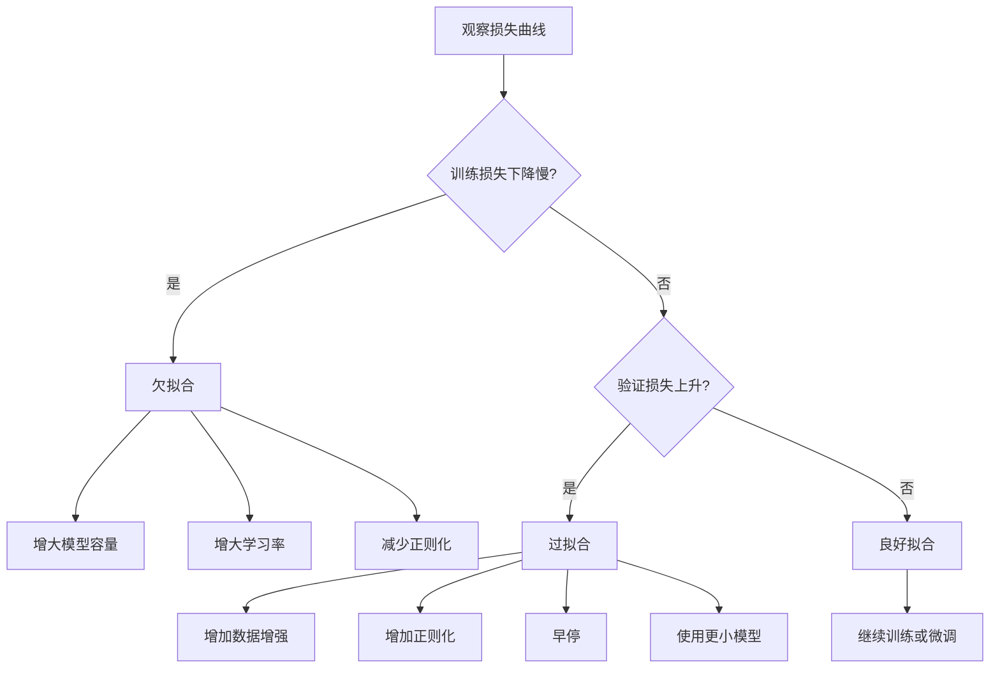

具体诊断：

1. 训练损失下降很慢
   · 现象：训练和验证损失都下降缓慢
   · 诊断：欠拟合
   · 对策：增大模型、增大学习率、减少正则化
2. 训练损失下降快，验证损失上升
   · 现象：训练损失快速下降，验证损失先降后升
   · 诊断：过拟合
   · 对策：增加数据增强、增加正则化、早停
3. 训练和验证损失同步下降
   · 现象：两条曲线都平稳下降
   · 诊断：良好拟合
   · 对策：继续训练，或进行微调

---

### 4.4 超参数选取小结

核心原则

1. 经验很重要：调参是实践出真知
2. 借鉴前人经验：不要从零开始
3. 系统化方法：遵循科学的步骤流程
4. 优先调试最重要的超参数：学习率 > 模型架构 > 正则化参数

六步实践指南总结

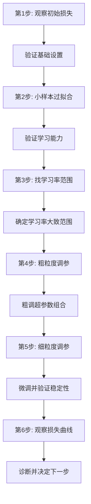

各超参数的重要性排序

1. 学习率 - 最重要的超参数，优先调节
2. 模型架构 - 决定模型能力上限
3. 批量大小 - 影响训练稳定性和速度
4. 优化器选择 - Adam通常是安全的默认选择
5. 正则化参数 - 防止过拟合，提升泛化

---

#### 完整总结：深度学习训练技巧全景图

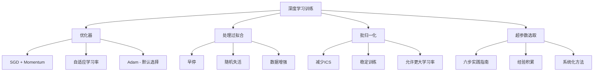

#### 优化器总结

· SGD + Momentum：经典选择，需要精细调参
· Adam：现代默认，快速收敛，相对鲁棒
· 学习率衰减：总是好的策略

#### 防止过拟合总结

· 早停：简单有效，实时监控
· Dropout：强制神经元独立，提升鲁棒性
· 数据增强：免费获得更多数据，提升泛化

#### 批归一化总结

· 解决内部协变量偏移
· 稳定训练，允许更大学习率
· $hat{x}_i = \frac{x_i - E[x_i]}{\sqrt{\text{Var}[x_i]}} \quad y_i = \gamma_i \hat{x}_i + \beta_i$

#### 超参数选取总结

· 从类似任务的模型开始
· 遵循六步实践指南
· 经验积累是关键

---

#### 延伸阅读

在线资源

1. 各种深度学习模型的优化方法
   http://cs231n.github.io/neural-networks-3/
2. 关于不同正则化方法的讨论
   https://www.cnblogs.com/LXP-Never/p/11566064.html

学术论文

· Li, Chen, Hu, Yang, 2019
  "Understanding the Disharmony Between Dropout and Batch Normalization by Variance Shift"
  CVPR - 深入分析Dropout和BN的相互作用

实践建议

1. 保持学习： 深度学习领域发展很快，持续关注新技术
2. 动手实践： 理论知识需要通过项目来巩固
3. 参与社区： GitHub、Kaggle、学术会议都是很好的学习场所

最后的话

深度学习训练既是科学也是艺术。掌握这些基础技巧后，最重要的是：

· 多实践 - 在实际项目中应用这些知识
· 多思考 - 理解每个技术背后的原理
· 多交流 - 与同行讨论，互相学习
