# 一、图像分类：计算机视觉的“基础课”

### 1. 什么是图像分类？
**目标**：让计算机认出图片里是什么东西。

**例子**：  
你给计算机看一张图，它告诉你：“这是一只猫。”  
或者：“这是一辆汽车。”

---

### 2. 通用图像分类
就像我们学识字一样，计算机也要通过“看图识字”来学习。

#### 常用数据集：
- **CIFAR-10**：10个类别，5万张训练图，1万张测试图
- **ImageNet**：1000个类别，100万张训练图，5万张测试图

**好比**：  
CIFAR-10 像是儿童识字卡片，ImageNet 像是百科全书。

---

### 3. 特定图像分类：人脸验证
**目标**：判断两张人脸是不是同一个人。

**和普通分类的区别**：
- 普通分类：判断是“猫”还是“狗”
- 人脸验证：判断“这是不是张三？”

---

##  二、人脸验证：怎么让计算机“认人”？

### 1. 核心思想：学习“人脸特征”
我们不直接判断是谁，而是把每张人脸变成一串“数字特征”，然后比较这些特征是否相似。

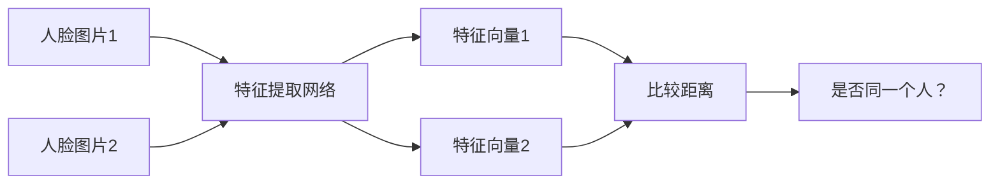

---

### 2. DeepID2（2014）：对比损失

#### 目标：
- 如果是同一个人 → 让两个特征向量**靠近**
- 如果不是同一个人 → 让两个特征向量**远离**

#### 对比损失函数：
```
如果 y=1（是同一个人）：
    Loss = 1/2 * ‖f(x₁) - f(x₂)‖²

如果 y=0（不是同一个人）：
    Loss = 1/2 * max(0, α - ‖f(x₁) - f(x₂)‖²)
```

**α** 是一个边界值，比如 1.0，表示“不同人之间的距离至少要大于1.0”。

**例子**：  
- 张三的两张照片：距离从 1.2 → 0.3 ✅  
- 张三 vs 李四：距离从 0.8 → 1.2 ✅

---

### 3. FaceNet（2015）：三元组损失

#### 更聪明的学习方式：一次看三张图
- **Anchor（锚点）**：基准图片（比如张三的证件照）
- **Positive（正样本）**：同一个人的另一张照片
- **Negative（负样本）**：另一个人的照片

#### 目标：
```
‖Anchor - Positive‖² + α < ‖Anchor - Negative‖²
```

#### 三元组损失函数：
```
Loss = ∑[ ‖f(A) - f(P)‖² - ‖f(A) - f(N)‖² + α ]₊
```

**例子**：  
- Anchor 和 Positive 的距离：0.5  
- Anchor 和 Negative 的距离：0.7  
- 设定 α = 0.2  
- 损失 = max(0, 0.5 - 0.7 + 0.2) = max(0, 0) = 0 ✅（已经满足条件）

---

### 4. 其他人脸验证损失函数（进阶版）

#### SphereFace（2017）
- 在角度空间上加边界，让同一类的人脸在“球面”上更紧凑

#### NormFace（2017）
- 对特征做 L2 归一化，让训练更稳定

#### ArcFace（2019）
- 在角度空间上加一个“弧边界”，让不同人脸的分类界限更清晰

**好比**：  
- 普通分类：把人脸放在桌子上分开  
- ArcFace：把人脸放在球面上，用“经线”划界，分得更开

---

## 三、总结：人脸验证的“技术演进”

| 方法 | 核心思想 | 优点 |
|------|----------|------|
| DeepID2 | 对比学习：同类靠近，异类远离 | 简单有效 |
| FaceNet | 三元组学习：拉近正样本，推远负样本 | 更精准，适合大规模数据 |
| SphereFace/ArcFace | 角度边界：在角度空间上加大间隔 | 分类界限更清晰，精度更高 |

---

## 关键要点回顾

1. **图像分类**是基础，**人脸验证**是特殊任务
2. 人脸验证不直接分类，而是**学习特征再比较**
3. **损失函数**是关键：
   - 对比损失（DeepID2）
   - 三元组损失（FaceNet）
   - 角度边界损失（ArcFace等）
4. 所有方法的目标都是一样的：**让同一个人的脸“相似”，不同人的脸“不相似”**

---
# **物体检测**

---

## 一、物体检测：让计算机"找东西"

### 1. 任务是什么？
**目标**：不仅要识别图片里有什么，还要找到它们在哪里！

**例子**：
- 输入：一张街景图片
- 输出：
  - 这里有一个人，位置在(x₁, y₁, w₁, h₁)
  - 这里有一辆车，位置在(x₂, y₂, w₂, h₂)
  - 这里有一只狗，位置在(x₃, y₃, w₃, h₃)

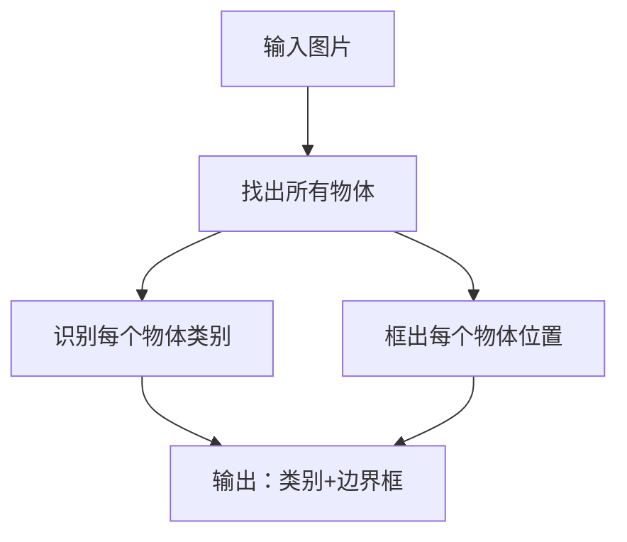

---

### 2. 核心挑战：怎么知道哪里可能有物体？

想象你在一个拥挤的房间里找人：
- 笨办法：挨个角落仔细看 ❌（太慢！）
- 聪明办法：先扫视一遍，找到"可能有人"的区域 ✅

这就是**候选区域(Region Proposals)**的思想！

---

## 二、候选区域(Region Proposals)：先找到"可疑区域"

### 1. 什么是候选区域？
**定义**：图片中**可能包含物体**的区域，我们不需要精确知道是什么物体，只需要知道"这里可能有东西"。

**好比**：保安在监控画面中圈出"可疑区域"，让专家进一步分析。

### 2. 为什么需要候选区域？
- 全图搜索计算量太大
- 先缩小范围，再精细识别

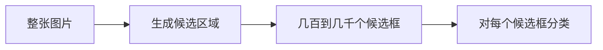

---

### 3. 候选区域的多种选择方法

研究人员发明了各种"找可疑区域"的方法：

| 方法 | 思路 | 速度 | 效果 |
|------|------|------|------|
| **Selective Search** | 基于颜色、纹理等合并相似区域 | 中等 | 👍👍👍 |
| **EdgeBoxes** | 基于边缘密度找物体 | 快 | 👍👍 |
| **BING** | 用简单的图像特征快速筛选 | 很快 | 👍 |
| **MCG** | 综合多种特征，更精细 | 慢 | 👍👍👍 |

**好比**：
- EdgeBoxes：通过轮廓明显程度找物体
- Selective Search：通过颜色纹理的连贯性找物体
- BING：用"快速扫描"的方式找物体

---

##  三、(C+1)-类的分类：物体检测的"终极判断"

### 1. 什么是(C+1)-类分类？
- **C**：你关心的物体类别数（比如：人、车、狗、猫...）
- **+1**：额外加一个"背景"类别（表示"这里没有物体"）

**总共要判断**：这个区域是C类物体中的某一个，还是背景？

### 2. 两种实现思路：

#### 思路一：一个多分类器直接判断
```python
# 输入：候选区域特征
# 输出：(C+1)个类别的概率
probabilities = [0.01, 0.85, 0.10, 0.04]  # 比如：[背景, 人, 车, 狗]
```

#### 思路二：用(C+1)个二分类器分别判断
```python
# 对每个类别单独判断"是这个类别吗？"
is_person = 0.95    # 有95%信心认为是人
is_car = 0.08       # 只有8%信心认为是车  
is_dog = 0.12       # 只有12%信心认为是狗
is_background = 0.05 # 只有5%信心认为是背景
```

**实际中**：深度学习通常用第一种方法（更高效）。

---

## 四、把一切都串起来：物体检测的完整流程

让我用一个**游乐园找朋友**的比喻来理解整个流程：

### 场景：在拥挤的游乐园找到你的朋友们

1. **生成候选区域（找可疑人群）**
   - 保安用望远镜快速扫描："那片区域人很多，可能有你的朋友"
   - → 生成10个"可疑区域"

2. **(C+1)-类分类（逐个确认身份）**
   - 走到第一个区域："这是小明吗？不是...这是背景人群"
   - 走到第二个区域："这是小红吗？是的！"
   - 走到第三个区域："这是小刚吗？是的！"

3. **输出结果**
   - 小红：在摩天轮附近（位置坐标）
   - 小刚：在过山车排队处（位置坐标）
   - 其他区域：都是背景（不认识的人）

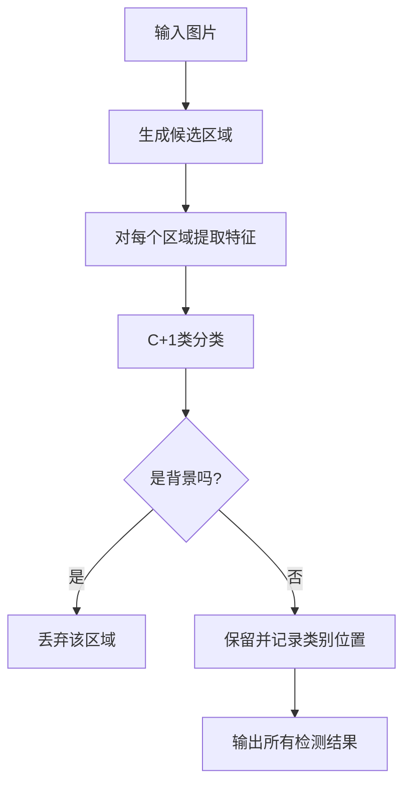

---

##  五、技术演进的关键思路

### 从"笨办法"到"聪明办法"的进化：

1. **最初想法**：对图片中每个可能位置、每种可能大小都检查一遍
   - ❌ 问题：计算量爆炸！一张图要检查数百万次

2. **候选区域思路**：先快速找到"可能有东西"的几百个区域
   - ✅ 优点：大幅减少计算量

3. **深度学习加持**：用神经网络自动学习如何找区域、如何分类
   - ✅ 更准、更快、更智能

---

## 六、关键要点总结

1. **物体检测 = 定位 + 识别**
   - 不仅要知道"是什么"，还要知道"在哪里"

2. **候选区域是效率关键**
   - 先粗筛，再精判
   - 各种方法在速度和质量间权衡

3. **(C+1)-类分类是核心判断**
   - C个物体类别 + 1个背景类别
   - 判断每个区域"属于哪类，或者是背景"

4. **整个过程像"保安找嫌疑人"**
   - 巡逻发现可疑区域 → 近距离确认身份 → 记录结果

---
好的，我们继续深入讲解物体检测中的R-CNN系列算法。

---

## R-CNN：物体检测的"开山之作"

### 核心思想：分步处理的流水线

R-CNN（Region-based CNN）的思路很直观：
1. 先找出一堆"可能包含物体"的区域
2. 对每个区域单独判断"这是什么"

### R-CNN的具体步骤：

#### 步骤1：生成候选区域
- 使用Selective Search等方法从图片中提取约2000个候选区域
- **好比**：在人群中先圈出所有"可能是人"的区域

#### 步骤2：区域变形
- 把每个不同形状的候选区域缩放成固定大小（如227×227）
- **问题**：变形会导致物体扭曲，影响识别

#### 步骤3：特征提取
- 每个变形后的区域通过CNN（如AlexNet）提取特征
- **计算代价**：2000个区域就要跑2000次CNN前向传播！

#### 步骤4：分类判断
- 用SVM对每个区域特征进行分类："这是人/车/狗/背景？"
- 每个类别一个二分类SVM

#### 步骤5：边界框精修
- 用回归器微调边界框位置，让框更准确

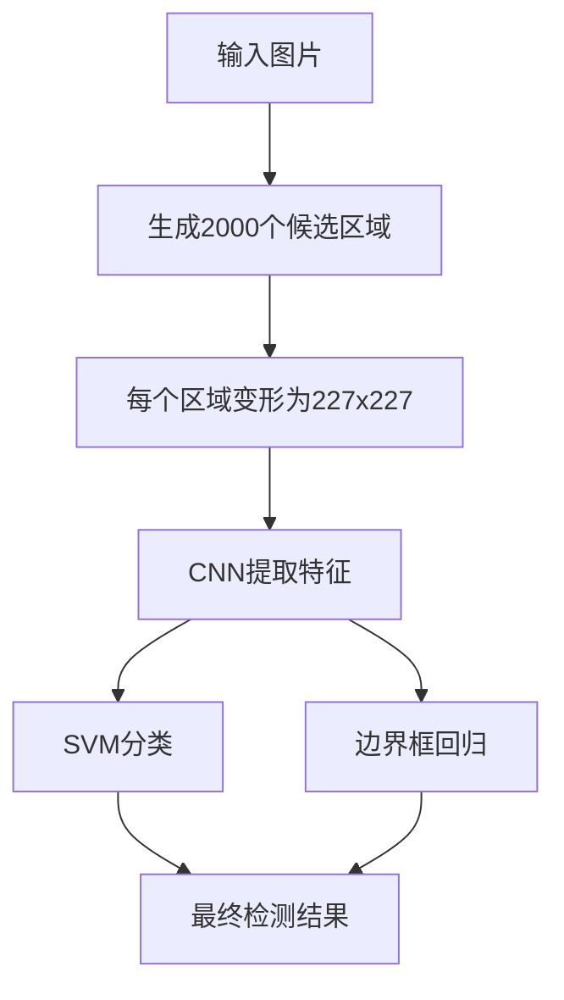

---

## R-CNN有什么问题吗？

### 主要问题：

1. **速度极慢**
   - 每张图片要处理约2000个区域
   - 每个区域都要经过完整的CNN前向计算
   - 测试一张图片需要47秒！

2. **训练复杂**
   - 需要分多个阶段训练：CNN微调、SVM训练、回归器训练
   - 不是端到端的系统

3. **内存消耗大**
   - 所有区域的特征都需要存储，占用大量磁盘空间

4. **区域变形失真**
   - 强制缩放区域导致物体形状扭曲

---

## Fast R-CNN：大幅提速的改进

### 核心创新：共享卷积计算

**关键思路**：为什么不先对整个图片做一次卷积，再在特征图上找区域？

### 工作流程：

1. **整图卷积**
   - 输入图片经过CNN，得到整张图的特征图

2. **投影候选区域**
   - 将原始图片的候选区域映射到特征图上的对应位置

3. **RoI Pooling**
   - 解决不同大小区域的特征提取问题

4. **统一分类回归**
   - 用单个网络同时输出类别概率和边界框偏移

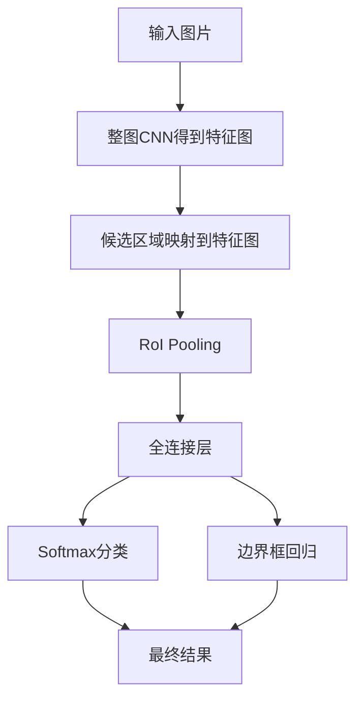

---

##  感兴趣区域池化(RoI Pooling)

### 要解决的问题：
- 候选区域在特征图上的大小各不相同
- 但全连接层需要固定大小的输入

### RoI Pooling的解决方案：

1. **将区域划分成固定网格**（如7×7）
2. **在每个网格内做最大池化**
3. **输出固定大小的特征**（如7×7×通道数）

**例子**：
- 输入区域在特征图上大小：10×15
- 想要输出大小：5×5
- 做法：将10×15分成5×5个网格，每个网格大小2×3，在每个2×3区域内取最大值

### 优势：
- 不同大小的输入区域 → 统一大小的输出特征
- 保持空间位置信息

---

## Fast R-CNN 结果

### 性能对比（VGG-16在PASCAL VOC 2007上）：

| 指标 | R-CNN | Fast R-CNN | 提升倍数 |
|------|-------|------------|----------|
| 训练时间 | 84小时 | 9.5小时 | 8.8倍 |
| 测试时间/图 | 47秒 | 0.32秒 | 146倍 |
| mAP | 66.0% | 66.9% | +0.9% |

### 重大进步：
- **速度飞跃**：从接近1分钟到实时检测
- **精度提升**：不仅更快，还更准
- **端到端训练**：简化了训练流程

---

## 问题：Fast R-CNN是否还存在问题？

### 主要瓶颈：候选区域生成

虽然Fast R-CNN优化了特征提取部分，但：
- **候选区域生成仍是外部模块**（如Selective Search）
- **候选区域生成很慢**（占大部分检测时间）
- **不是真正的端到端**

**好比**：工厂生产线很快，但原材料供应还是靠外部慢速供应商。

---

## Faster R-CNN：真正的端到端检测

### 核心创新：候选区域网络(RPN)

**关键思路**：让神经网络自己学习生成候选区域！

### 整体架构：

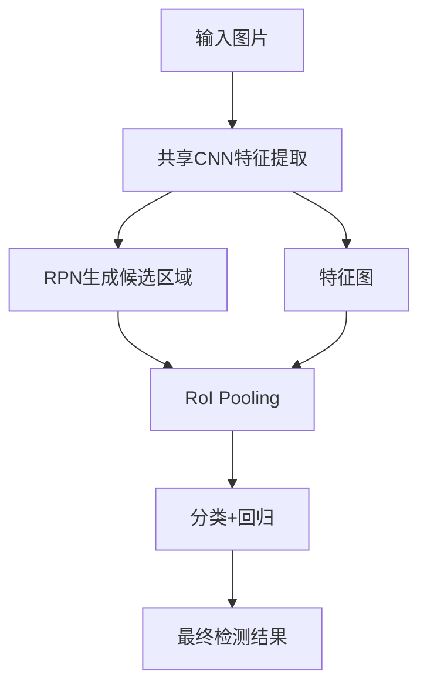

---

## 候选区域网络(RPN)

### 工作原理：

1. **在特征图上滑动窗口**
   - 在卷积特征图的每个位置上考虑多个"锚点框"(anchors)

2. **每个位置预测k个候选区域**
   - 通常k=9（3种尺度 × 3种长宽比）
   - 每个锚点输出：是否是物体（2个分数） + 位置精修（4个坐标）

3. **端到端训练**
   - RPN和检测网络共享卷积特征
   - 联合训练，互相促进

### 锚点框(Anchors)概念：
- **预设的参考框**，覆盖不同大小和形状
- **例子**：在特征图的每个点上，考虑：
  - 小框、中框、大框
  - 瘦高、方形、宽扁
- 网络学习"调整"这些预设框来匹配真实物体

---

## Faster R-CNN 结果

### 性能对比（PASCAL VOC 2007）：

| 方法 | 候选区域 | 数据 | mAP | 时间 |
|------|----------|------|-----|------|
| Fast R-CNN + SS | Selective Search | 07 | 66.9% | 1830ms |
| Faster R-CNN | RPN | 07 | 69.9% | 198ms |
| Faster R-CNN | RPN | 07+12 | 73.2% | 198ms |

### 重大突破：

1. **速度再提升9倍**
   - 从320ms到198ms，接近实时(5fps)

2. **精度显著提高**
   - mAP从66.9%提升到73.2%

3. **真正端到端**
   - 候选区域生成 + 检测统一在一个网络中

---

## 技术演进总结

### R-CNN → Fast R-CNN → Faster R-CNN 的进化：

| 阶段 | 核心创新 | 解决的主要问题 | 速度 | 精度 |
|------|----------|----------------|------|------|
| R-CNN | 用CNN做区域分类 | 传统方法精度低 | 极慢 | 基础 |
| Fast R-CNN | 共享卷积+RoI Pooling | 重复计算问题 | 146倍提升 | 小幅提升 |
| Faster R-CNN | RPN端到端 | 候选区域生成瓶颈 | 再提升9倍 | 显著提升 |

### 关键技术进步：

1. **计算共享**：从每个区域单独计算 → 整图共享计算
2. **特征对齐**：RoI Pooling解决不同大小区域的特征提取
3. **端到端学习**：从多阶段训练 → 统一网络端到端训练
4. **候选区域内化**：从外部方法 → 网络自己生成

好的，我们继续讲解物体检测的后续内容。

---

好的，我们继续深入讲解物体检测的两阶段与单阶段方法，以及YOLO算法。

---

## 两阶段与单阶段检测器：两种不同的"寻宝策略"

### 两阶段检测器（如Faster R-CNN）

**工作方式**：先粗选，再精选
1. **第一阶段**：找出可能包含物体的区域（候选区域）
2. **第二阶段**：对每个候选区域详细分类和定位

**好比寻宝**：
- 先用金属探测器扫描整个区域，找到"可能有宝藏"的地方
- 再对每个可疑点进行精细挖掘，确认是什么宝藏

**优点**：精度高
**缺点**：速度相对慢

### 单阶段检测器（如YOLO）

**工作方式**：一眼看完，直接输出
1. 只看图片一次，直接预测所有物体的位置和类别
2. 不需要中间的候选区域步骤

**好比寻宝**：
- 经验丰富的寻宝专家一眼扫过，直接指出所有宝藏的位置

**优点**：速度快
**缺点**：早期版本精度稍低

---

## YOLO: You Only Look Once - 单阶段检测的革命

### 核心思想：把检测变成回归问题

YOLO的思路很直接：为什么要把检测分成多个步骤？能不能一次就搞定？

### YOLO的工作流程：

#### 步骤1：网格划分
- 将输入图像划分为S×S个网格（如7×7）
- 每个网格负责检测中心点落在该网格内的物体

#### 步骤2：每个网格的预测任务
每个网格需要预测：
- **B个边界框**：每个框有5个值 (x, y, w, h, confidence)
  - (x, y)：框的中心位置（相对于该网格）
  - (w, h)：框的宽度和高度（相对于整个图片）
  - confidence：置信度，表示框内包含物体且位置准确的程度
- **C个类别概率**：表示如果框内有物体，属于各个类别的概率

#### 步骤3：整合结果
- 将每个网格的预测组合起来，得到最终的检测结果

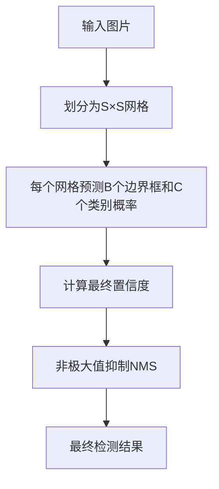

### 数学表达：

每个网格的输出维度：$B × 5 + C$

例如：
- S=7（7×7网格）
- B=2（每个网格预测2个框）
- C=20（20个物体类别）
- 总输出维度：7×7×(2×5 + 20) = 7×7×30

### 置信度计算：

最终每个检测框的置信度得分：
$$
\text{置信度得分} = P(\text{物体}) \times \text{IOU} \times P(\text{类别}|\text{物体})
$$

其中：
- $P(\text{物体})$：框内包含物体的概率
- $\text{IOU}$：预测框与真实框的交并比
- $P(\text{类别}|\text{物体})$：如果包含物体，属于各个类别的条件概率

### 例子说明：

假设我们在做行人检测：
- 图片被分成7×7网格
- 某个网格中心正好有一个行人
- 该网格会：
  1. 预测1-2个边界框来框住这个行人
  2. 给出"行人"类别的高概率
  3. 其他类别（车、狗等）的低概率

---

## 效果对比：两阶段 vs 单阶段
[对象检测和跟踪/主站的两级与一级 Detectors.md ·叶恒辰/物体检测与跟踪](https://github.com/yehengchen/Object-Detection-and-Tracking/blob/master/Two-stage%20vs%20One-stage%20Detectors.md)
### 精度与速度的权衡：

**两阶段检测器（Faster R-CNN等）**：
- 精度：高（mAP 70-80%）
- 速度：慢（5-10 FPS）
- 适用场景：对精度要求极高的应用

**单阶段检测器（YOLO、SSD等）**：
- 精度：中等（早期YOLO mAP 60-70%，后续版本大幅提升）
- 速度：快（45-150 FPS）
- 适用场景：实时检测，如视频监控、自动驾驶

### 为什么会有这种差异？

**两阶段检测器的优势**：
- 候选区域步骤过滤掉了大量负样本
- 对每个候选区域进行精细分类
- 更擅长检测小物体和密集物体

**单阶段检测器的优势**：
- 没有重复计算
- 端到端训练，整体优化
- 更适合实时应用

### 发展趋势：

近年来，单阶段检测器的精度大幅提升，如YOLOv4、v5等已经接近甚至超过两阶段检测器的精度，同时保持高速优势。

---

## 特定物体检测：专注解决特定问题

### 什么是特定物体检测？

不检测所有类别的物体，只专注于检测特定的某一类或几类物体。

### 常见应用场景：

1. **人脸检测**
   - 只检测图片中的人脸
   - 应用：手机解锁、美颜相机、安防监控

2. **行人检测**
   - 只检测行人
   - 应用：自动驾驶、智能交通

3. **车辆检测**
   - 只检测各种车辆
   - 应用：交通监控、自动驾驶

4. **文本检测**
   - 只检测图片中的文字区域
   - 应用：文档数字化、车牌识别

### 与通用物体检测的区别：

| 方面 | 通用物体检测 | 特定物体检测 |
|------|-------------|-------------|
| 类别数 | 几十到上百类 | 通常1-几类 |
| 数据需求 | 需要大量各类别数据 | 只需特定类别数据 |
| 模型复杂度 | 高 | 相对较低 |
|  specialization | 泛化能力强 | 针对性强 |

### 技术特点：

1. **数据标注更专注**
   - 只需要标注特定类别的物体
   - 可以积累更多该类别的样本

2. **模型可以更精简**
   - 输出维度大幅减少
   - 可以针对特定场景优化

3. **性能通常更好**
   - 专注解决一个问题
   - 在该类别上能达到很高精度

### 例子：人脸检测系统

**训练数据**：
- 数十万张标注的人脸图片
- 各种角度、光照、遮挡情况

**模型输出**：
- 只需要判断"是否为人脸"和"人脸位置"
- 不需要区别人脸是谁（那是人脸识别的任务）

**优化方向**：
- 对小脸的检测精度
- 对侧脸、遮挡脸的鲁棒性
- 在移动设备上的运行效率

---

## 关键技术创新总结

### 从两阶段到单阶段的演进：

1. **思路转变**
   - 从"先找地方再细看"到"一眼看完直接输出"

2. **效率突破**
   - YOLO将检测速度提升到实时水平
   - 为自动驾驶、实时视频分析奠定基础

3. **精度追赶**
   - 通过改进网络结构、损失函数、训练策略
   - 单阶段检测器精度逐步逼近两阶段方法

### 特定检测的价值：
- 在实际应用中，我们往往只需要检测特定物体
- 专用模型在特定任务上表现更好
- 计算资源需求更低，更适合部署

这一演进体现了深度学习在实际应用中的不断优化：从通用的复杂模型，到高效的专用解决方案。

---
# 图像分割

## 图像分割：从"看是什么"到"看清每一个像素"

### 任务定义：像素级分类

**图像分类**：回答"图片里有什么？"
- 输入：图片
- 输出：类别标签（如"猫"）

**物体检测**：回答"东西在哪里？"
- 输入：图片
- 输出：边界框+类别（如"猫在(x,y,w,h)"）

**图像分割**：回答"每个像素属于什么？"
- 输入：图片
- 输出：与输入同尺寸的掩码图，每个像素都有类别标签

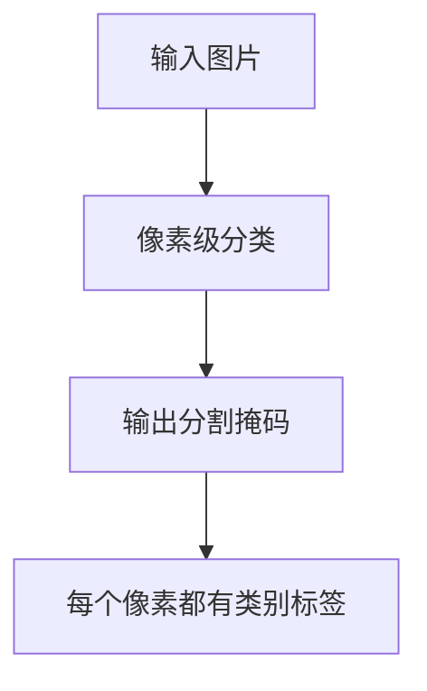

### 直观例子：

想象一张街景图片：
- **图像分类**：这是一张"城市街景"
- **物体检测**：这里有"人"、"车"、"树"
- **图像分割**：精确勾勒出每个人、每辆车、每棵树的轮廓，连路面、天空都区分开

**好比绘画**：
- 图像分类：说出画的主题
- 物体检测：框出画中的重要元素
- 图像分割：用不同颜色精确涂满每个元素

---

## 核心挑战：如何增大特征图？

### 问题来源：

在传统的卷积神经网络中，随着网络加深，特征图会越来越小：

```
输入图片：3×512×512
→ 卷积层1：64×256×256
→ 卷积层2：128×128×128
→ 卷积层3：256×64×64
→ 卷积层4：512×32×32
```

但分割需要输出与输入相同尺寸的结果！

### 解决方案：上采样技术

#### 方法1：双线性插值

**工作原理**：根据周围已知像素值，估算放大后新像素的值

**例子**：
假设有2×2的小图：
```
[10, 20]
[30, 40]
```
要放大到4×4，双线性插值会根据距离权重计算每个新位置的值。

**优点**：简单快速
**缺点**：没有学习能力，效果有限

#### 方法2：转置卷积（Transposed Convolution）

**不是真正的反卷积**，而是"学习的上采样"

**工作原理**：
- 通过可学习的卷积核来放大特征图
- 在像素间插入可学习的值

**过程**：
1. 在输入特征图元素间插入零值（扩大尺寸）
2. 用卷积核进行卷积操作
3. 输出更大尺寸的特征图

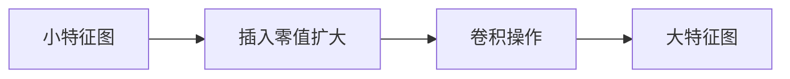

**数学表达**：
对于输入特征图$X$，转置卷积可以表示为：
$$
Y = W * X_{\text{zero-padded}}
$$
其中$W$是可学习的卷积核。

**优势**：
- 网络可以学习最适合任务的上采样方式
- 比简单插值效果更好

---

## 全卷积网络(FCN)：分割领域的里程碑

### 核心思想：让网络全部由卷积层构成

传统CNN的问题：
- 全连接层需要固定尺寸输入
- 全连接层会丢失空间信息

FCN的解决方案：
- **移除全连接层**，全部使用卷积层
- 最后使用转置卷积进行上采样

### FCN架构演变：

#### FCN-32s：简单但粗糙
```
输入图片 → CNN特征提取 → 32倍上采样 → 输出
```
问题：直接32倍上采样，细节丢失严重

#### FCN-16s：引入跨层连接
```
输入图片 → CNN特征提取 → 2倍上采样 → 与pool4特征融合 → 16倍上采样 → 输出
```
改进：结合了浅层特征的细节信息

#### FCN-8s：更多细节保留
```
输入图片 → CNN特征提取 → 2倍上采样 → 与pool4特征融合 → 2倍上采样 → 与pool3特征融合 → 8倍上采样 → 输出
```
最佳：充分利用了不同层级的特征信息

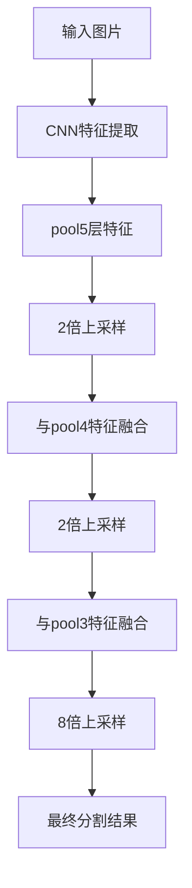

### 跨层连接的重要性：

**浅层特征**：包含更多空间细节、边缘信息
- 分辨率高，但语义信息弱

**深层特征**：包含更强语义信息
- 分辨率低，但能更好识别物体类别

**融合策略**：将深浅特征结合，既知道"是什么"，又知道"精确位置"

### 例子说明：

在街景分割中：
- **pool3特征**：能看清人行道的纹理、树叶的轮廓
- **pool5特征**：能识别出"这是道路"、"这是建筑"
- **融合后**：既能准确分类，又能精细勾勒边界

---

## 损失函数：逐像素比较

### 交叉熵损失：

对于每个像素，计算预测类别与真实类别的差异：

$$
L = -\frac{1}{N}\sum_{i=1}^{N}\sum_{c=1}^{C}y_{i,c}\log(p_{i,c})
$$

其中：
- $N$：像素总数
- $C$：类别数
- $y_{i,c}$：像素$i$真实属于类别$c$的指示（0或1）
- $p_{i,c}$：网络预测像素$i$属于类别$c$的概率

### 训练过程：

1. **前向传播**：输入图片，得到分割结果
2. **计算损失**：比较预测分割图与真实标注图的每个像素
3. **反向传播**：更新网络参数，让预测更接近真实

---

## 实际应用与数据集

### 常用数据集：

1. **PASCAL VOC**：20个物体类别，包含物体分割
2. **Cityscapes**：街景分割，19个类别，精细标注
3. **ADE20K**：150个类别，涵盖室内外场景

### 应用场景：

1. **自动驾驶**：精确分割道路、车辆、行人
2. **医疗影像**：分割肿瘤、器官、血管
3. **遥感图像**：分割土地利用类型
4. **视频编辑**：人物分割、背景替换

---

## 技术要点总结

### 图像分割的核心挑战：
1. **尺寸匹配**：输入输出需要相同尺寸
2. **细节保持**：既要分类准确，又要边界清晰
3. **多尺度理解**：同时识别大物体和小细节

### FCN的贡献：
1. **全卷积设计**：摆脱固定输入尺寸限制
2. **端到端训练**：直接优化分割目标
3. **跨层融合**：结合深浅层特征优势
4. **可扩展性**：可在各种CNN骨架（VGG、ResNet等）上构建

### 关键技术进步：
- **上采样技术**：从简单插值到可学习的转置卷积
- **特征融合**：充分利用网络各层信息
- **编码器-解码器结构**：成为分割网络的标准范式

图像分割技术的发展，让计算机从"认出物体"进步到"理解场景的每一个细节"，为自动驾驶、医疗诊断等高级应用奠定了基础。

---
# 图像风格转换

---

## 图像风格转换：让计算机学会"绘画"

### 任务定义：内容与风格的分离与重组

**核心思想**：将一张图片的"内容"与另一张图片的"风格"结合起来，生成新的图片。

**输入**：
- 内容图片（如：一张风景照）
- 风格图片（如：梵高的《星空》）

**输出**：
- 新图片：保持内容图片的物体和布局，但具有风格图片的艺术风格

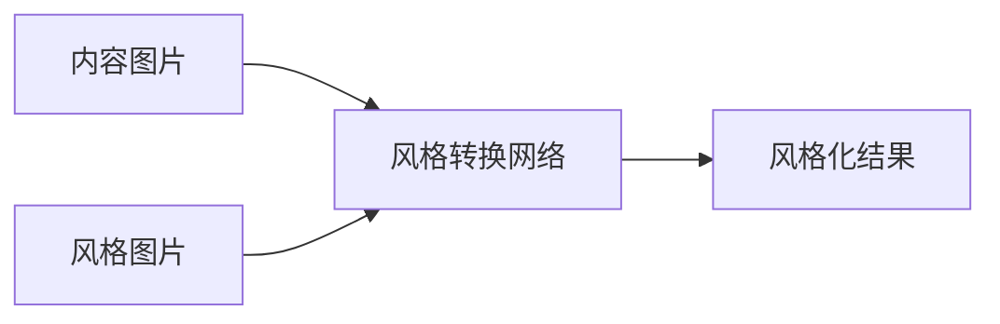

---

## 一种图像风格化算法：Gatys等人的神经风格迁移

### 核心洞察：CNN特征包含内容与风格信息

研究发现，在预训练的CNN（如VGG-16）中：
- **深层特征**：捕捉图片的**内容信息**（物体、布局）
- **多层特征相关性**：捕捉图片的**风格信息**（笔触、色彩、纹理）

### 关键概念：

#### 1. 内容表示（Content Representation）
- 使用CNN某一层的特征激活值来表示内容
- 数学表达：$\phi^l(p)$ 表示内容图片$p$在第$l$层的特征
- 目标：让生成图片的特征 $\phi^l(x)$ 接近 $\phi^l(p)$

#### 2. 风格表示（Style Representation）
- 使用Gram矩阵来捕捉风格
- Gram矩阵计算特征图之间的相关性，反映纹理 patterns
- 数学表达：$G^l_{ij} = (F^l_i)^T F^l_j$
  - $F^l_i$：第$l$层第$i$个特征图的向量形式
  - $G^l$：捕捉了该层特征的统计特性（风格）

### 损失函数：内容和风格的平衡

总损失函数：
$$
L_{total} = \alpha L_{content} + \beta L_{style}
$$

其中：

**内容损失**：
$$
L_{content} = \sum_l \|\phi^l(p) - \phi^l(x)\|_2^2
$$

**风格损失**：
$$
L_{style} = \sum_l \|G^l(s) - G^l(x)\|_2^2
$$

**权重系数**：
- $\alpha$：内容损失的权重
- $\beta$：风格损失的权重
- 调整这两个参数可以控制"更像内容"还是"更像风格"

### 优化过程：

1. 初始化生成图片（可以是噪声或内容图片的副本）
2. 在VGG网络中前向传播三张图片：内容图、风格图、生成图
3. 计算内容损失和风格损失
4. 反向传播更新生成图片的像素值（不是更新网络权重！）
5. 重复直到收敛

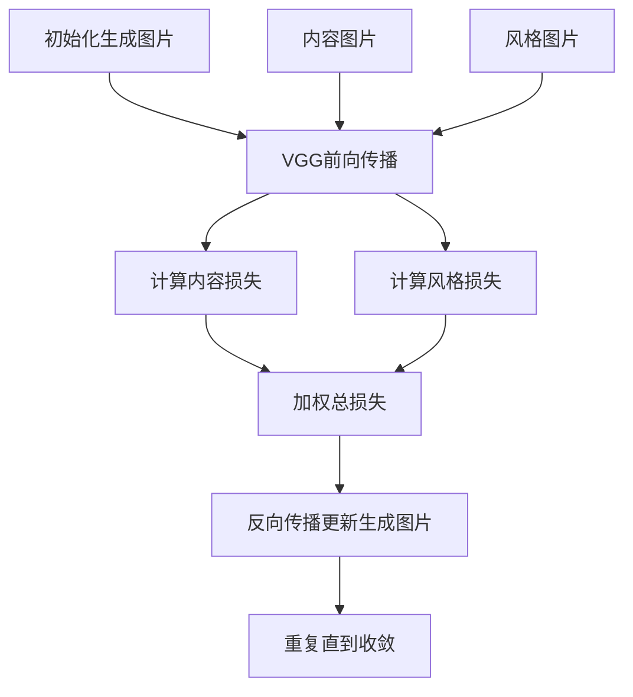

---

## 问题与挑战

### 1. 层选择问题

**内容层选择**：
- 太浅层：包含过多细节，风格化困难
- 太深层：内容信息丢失，物体轮廓模糊
- 通常选择中间层（如VGG的conv4_2）

**风格层选择**：
- 不同层捕捉不同尺度的风格特征
- 浅层：笔触、细节纹理
- 深层：色彩分布、整体构图
- 通常使用多层组合（如VGG的conv1_1, conv2_1, conv3_1, conv4_1, conv5_1）

### 2. 权重平衡问题

$\alpha / \beta$ 比率的影响：
- $\alpha$ 太大：结果太像内容图片，风格化不足
- $\beta$ 太大：风格过于强烈，内容信息丢失
- 需要根据具体图片调整

---

## 算法结果与特点

### 生成效果：
- **高质量**：能够产生艺术性很强的结果
- **自然融合**：风格与内容融合较为自然
- **保持结构**：内容图片的物体结构和空间布局得到保持

### 局限性：
- **速度极慢**：生成一张图片需要数分钟到数十分钟
- **参数敏感**：需要仔细调整层选择和权重参数
- **每次只能处理一种风格**：需要重新优化

---

## 扩展与改进

### 1. 快速风格转换：Johnson等人的方法

**核心创新**：训练一个前馈网络来替代迭代优化

**网络结构**：
- 输入：内容图片
- 输出：风格化图片
- 训练时使用与Gatys相同的感知损失

**优势**：
- **一次前向得到结果**：从几分钟到几毫秒的速度提升
- **保持质量**：结果质量接近原始方法

**架构**：
```
内容图片 → 图像变换网络 → 风格化结果
                            ↓
                    Loss网络(VGG)计算感知损失
```

### 2. 任意风格转换：Dumoulin和Huang的方法

**核心问题**：一个网络只能处理一种风格

**解决方案**：
- **条件实例归一化**（Dumoulin）：通过网络参数切换不同风格
- **自适应实例归一化AdaIN**（Huang）：实时将内容特征统计匹配到风格特征

**AdaIN操作**：
$$
AdaIN(x, y) = \sigma(y) \left( \frac{x - \mu(x)}{\sigma(x)} \right) + \mu(y)
$$
其中$x$是内容特征，$y$是风格特征

**优势**：
- **一个模型，多种风格**：无需为每种风格训练单独网络
- **实时任意风格化**：可以实时组合任意内容和风格图片

---

## 实际示例与演示

网站 https://reimakano.github.io/arbitrary-image-stylization-tfjs/ 
	展示了任意风格转换的能力：

### 使用方式：
1. **上传内容图片**：选择你想要风格化的图片
2. **上传风格图片**：选择艺术风格来源
3. **实时生成**：立即看到风格化结果

### 技术特点：
- 基于Huang等人的AdaIN方法
- 在浏览器中实时运行
- 支持任意图片组合

### 体验建议：
- 尝试不同的内容-风格组合
- 观察哪些风格在哪些内容上效果更好
- 注意风格强度对内容可识别性的影响

---

## 技术演进总结

### 从优化到前馈网络的进化：

| 方法 | 核心机制 | 速度 | 灵活性 |
|------|----------|------|---------|
| Gatys原始方法 | 迭代优化生成图片 | 极慢 | 固定风格 |
| Johnson快速方法 | 前馈网络+感知损失 | 快速 | 固定风格 |
| AdaIN任意风格 | 特征统计对齐 | 实时 | 任意风格 |

### 关键技术进步：

1. **损失函数设计**：内容损失 + 风格损失的感知损失框架
2. **特征表示理解**：CNN不同层承载不同语义信息
3. **归一化技术**：实例归一化系列方法实现风格控制
4. **效率优化**：从迭代优化到单次前向的跨越

### 实际应用：

- **摄影后期**：为照片添加艺术效果
- **社交应用**：图片风格化滤镜
- **游戏开发**：实时渲染风格化效果
- **艺术创作**：辅助艺术家进行风格探索

图像风格转换展示了深度学习不仅能够"理解"图片，还能"创造"图片，为计算机视觉与数字艺术的结合开辟了新的可能性。


## 深度学习在计算机视觉中的应用总结

### 一、图像分类：计算机视觉的"基础课"

**核心任务**：识别图像中的主要物体是什么

**技术演进**：
- **通用图像分类**：CIFAR-10、ImageNet等基准数据集
- **特定图像分类**：人脸验证等专用场景
- **损失函数创新**：对比损失、三元组损失等提升判别能力

**关键突破**：
- 从直接分类到特征空间学习
- 同一类样本在特征空间中聚集，不同类样本远离

### 二、物体检测：从"是什么"到"在哪里"

**核心任务**：定位并识别图像中的所有物体

**技术路线演进**：

#### 两阶段检测器：
- **R-CNN**：开创性工作，但速度极慢
- **Fast R-CNN**：共享卷积计算，引入RoI Pooling
- **Faster R-CNN**：端到端训练，RPN网络生成候选区域

#### 单阶段检测器：
- **YOLO**：将检测视为回归问题，一次前向完成
- 优势：速度快，适合实时应用

**核心创新**：
- 候选区域生成 → 特征共享 → 端到端学习
- 精度与速度的不断平衡优化

### 三、图像分割：像素级的精细理解

**核心任务**：对图像中每个像素进行分类

**关键技术**：
- **上采样技术**：双线性插值、转置卷积
- **全卷积网络(FCN)**：摆脱全连接层限制
- **编码器-解码器结构**：U-Net等经典架构
- **跨层连接**：结合深浅层特征优势

**应用价值**：
- 自动驾驶：精确道路场景理解
- 医疗影像：病灶区域分割
- 工业检测：缺陷区域定位

### 四、图像风格转换：艺术与技术的融合

**核心任务**：将内容图片与风格图片融合生成新图像

**技术发展**：

#### 基础方法：
- **Gatys方法**：基于优化的风格迁移
- 内容损失 + 风格损失的感知损失框架
- Gram矩阵捕捉纹理风格特征

#### 改进方法：
- **快速风格转换**：前馈网络替代迭代优化
- **任意风格转换**：AdaIN等技术实现实时多风格

**核心洞察**：
- CNN深层特征编码内容信息
- 特征相关性编码风格信息
- 通过特征统计对齐实现风格控制

### 五、技术发展的共同规律

#### 1. 架构演进趋势
- 从多阶段处理 → 端到端学习
- 从专用模块 → 统一网络
- 从精度优先 → 精度速度平衡

#### 2. 核心技术创新
- **特征学习**：从手工特征到深度特征
- **损失函数**：任务驱动的专用损失设计
- **网络结构**：编码器-解码器、注意力机制等
- **训练策略**：迁移学习、多任务学习等

#### 3. 实际应用影响
- **工业界**：自动驾驶、安防监控、医疗诊断
- **消费领域**：手机摄影、社交应用、内容创作
- **艺术创作**：AI绘画、风格化滤镜、创意工具

### 六、未来展望

#### 技术方向：
- **多模态融合**：视觉与语言、音频的联合理解
- **自监督学习**：减少对标注数据的依赖
- **可解释性**：理解模型决策过程
- **效率优化**：边缘设备部署、实时应用

#### 应用前景：
- **增强现实**：实时场景理解与交互
- **机器人视觉**：环境感知与操作指导
- **创意AI**：人机协作的内容创作
- **科学发现**：医疗影像分析、材料科学等

### 总结

深度学习在计算机视觉领域的发展，体现了从"感知"到"理解"再到"创造"的技术演进路径。从最初的简单分类，到精确的物体检测，再到像素级的分割，最终达到艺术性的风格创作，这一历程不仅展示了技术能力的不断提升，更反映了人工智能在视觉认知方面取得的实质性进步。

这些技术进步正在深刻改变着我们与视觉信息交互的方式，为各行各业带来新的可能性，同时也推动着人工智能技术向更加智能、更加人性化的方向发展。