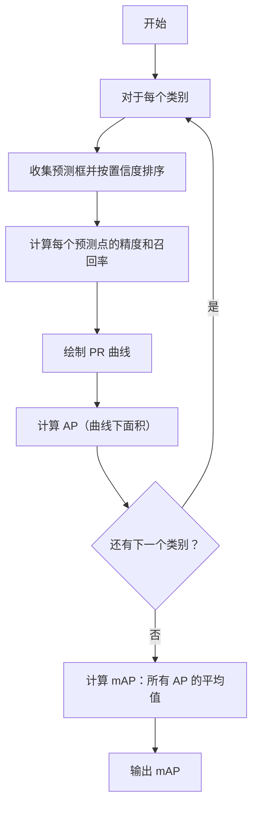

好的，我来详细讲解一下mAP（mean Average Precision），我会尽量用大白话和简单的例子来解释，让你即使没有任何背景知识也能听懂。过程中我会使用一些文本图表和Mermaid流程图来帮助理解。

### 1. mAP 是什么？
mAP 是“平均精度均值”（mean Average Precision）的缩写。它主要用于评估目标检测模型（比如识别图片中的猫、狗、汽车等）的性能。简单来说，mAP 是一个数字（比如0.8或80%），用来衡量模型在检测多个物体时的整体准确度。数字越高，模型越好。

为什么需要mAP？因为模型在预测时可能会犯两种错误：
- **漏检**：该检测到的物体没检测到。
- **误检**：把不是物体的东西误认为是物体。

mAP 综合考虑了这两种错误，给出一个公平的评价。

---

### 2. 核心概念：精度和召回率
要理解mAP，必须先了解两个基本概念：**精度**和**召回率**。我们来用一个找球的游戏比喻：

- 假设你有一个袋子，里面有10个红球和10个蓝球（总共20个球），但红球是我们关心的“目标”。
- 你用一个模型（比如一个智能助手）来找出红球。模型会预测一些球是红球，但可能预测错。

现在，定义一些术语：
- **TP（True Positive）**：模型正确预测为红球的球（即确实是红球）。
- **FP（False Positive）**：模型错误预测为红球的球（实际上是蓝球，但被当成红球）。
- **FN（False Negative）**：模型漏掉的红球（本来是红球，但模型没预测出来）。

然后：
- **精度（Precision）**：模型预测出的红球中，有多少是真的红球。公式：`精度 = TP / (TP + FP)`。精度高表示模型“不乱说”，预测时很准确。
- **召回率（Recall）**：所有真正的红球中，模型找出了多少。公式：`召回率 = TP / (TP + FN)`。召回率高表示模型“不漏检”，能找到大部分红球。

精度和召回率是“权衡”关系：如果模型只预测一个高置信度的红球（精度高），但漏掉很多红球（召回率低）；反之，如果模型预测很多球都是红球（召回率高），但其中很多是蓝球（精度低）。

#### 文本图表示例：
假设袋子有10个红球，模型预测了5个球是红球，其中3个是真正的红球（TP），2个是蓝球（FP），那么：
- 精度 = 3 / (3 + 2) = 0.6（60%）
- 召回率 = 3 / 10 = 0.3（30%），因为总共有10个红球，模型只找到3个。

---

### 3. 目标检测中的关键：IoU（交并比）
在目标检测中，模型会输出“边界框”（一个矩形框，标出物体的位置）。如何判断预测框是否正确？我们用IoU（Intersection over Union）来衡量。

IoU 计算预测框和真实框的重叠程度：
- **交集**：预测框和真实框重叠的区域面积。
- **并集**：预测框和真实框总共覆盖的面积。
- **IoU = 交集 / 并集**

通常，如果 IoU ≥ 0.5（即重叠面积超过50%），就认为预测正确（TP）；否则是错误（FP）。

#### 文本图表示例：
```
真实框: [坐标]
预测框: [坐标]
重叠区域: ███
IoU = 重叠面积 / (真实框面积 + 预测框面积 - 重叠面积)
```
如果 IoU = 0.7，大于0.5，所以是 TP；如果 IoU = 0.3，小于0.5，所以是 FP。

---

### 4. 计算 AP（Average Precision）
AP 是单个类别的平均精度。例如，只针对“猫”这个类别计算 AP。计算步骤：

1. **收集所有预测框**：对于“猫”类别，模型会输出多个预测框，每个框有一个置信度（表示模型有多确信这是猫）。
2. **按置信度排序**：从高到低排序预测框。
3. **计算每个预测点的精度和召回率**：从置信度最高的框开始，逐个判断是 TP 还是 FP，并累积计算精度和召回率。
4. **绘制 PR 曲线**：以召回率为横轴，精度为纵轴，画出曲线。
5. **计算 AP**：AP 是 PR 曲线下的面积（通常用近似方法计算，比如插值）。

#### 示例：假设有5个预测框 for "猫"，真实猫有3只。
| 预测框 | 置信度 | 是否正确 (TP/FP) | 累积 TP | 累积 FP | 精度 | 召回率 |
|--------|--------|------------------|---------|---------|------|--------|
| Box1   | 0.9    | TP               | 1       | 0       | 1.0  | 0.33   |
| Box2   | 0.8    | FP               | 1       | 1       | 0.5  | 0.33   |
| Box3   | 0.7    | TP               | 2       | 1       | 0.67 | 0.67   |
| Box4   | 0.6    | TP               | 3       | 1       | 0.75 | 1.0    |
| Box5   | 0.5    | FP               | 3       | 2       | 0.6  | 1.0    |

- 总真实正例数（猫的数量）= 3
- 精度和召回率计算：
  - 在 Box1：精度 = 1/1 = 1.0，召回率 = 1/3 ≈ 0.33
  - 在 Box2：精度 = 1/2 = 0.5，召回率 = 1/3 ≈ 0.33
  - 在 Box3：精度 = 2/3 ≈ 0.67，召回率 = 2/3 ≈ 0.67
  - 在 Box4：精度 = 3/4 = 0.75，召回率 = 3/3 = 1.0
  - 在 Box5：精度 = 3/5 = 0.6，召回率 = 3/3 = 1.0

然后，我们绘制 PR 曲线（召回率从0到1，精度变化）。AP 是曲线下的面积。通常，我们使用插值法使曲线单调下降，然后计算面积。简单来说，AP 可以看作是平均精度。

在这个例子中，AP 的计算可能如下（使用11点插值法）：
- 在召回率点 0, 0.1, 0.2, ..., 1.0 处取精度的最大值，然后平均。
但为了简化，我们直接说 AP ≈ (1.0 + 0.67 + 0.75 + 0.6) / 4 ≈ 0.755（这只是示意）。

---

### 5. 计算 mAP（mean Average Precision）
mAP 很简单：对于多个类别（比如猫、狗、汽车），每个类别计算一个 AP，然后取平均值。

#### 示例：
- 猫的 AP = 0.75
- 狗的 AP = 0.80
- 汽车的 AP = 0.85
- mAP = (0.75 + 0.80 + 0.85) / 3 = 0.80

所以 mAP 是 0.8 或 80%。

---

### 6. 整体流程用 Mermaid 图表示
下面是一个 Mermaid 流程图，展示了计算 mAP 的步骤：



这个图显示了计算 mAP 是一个循环过程：对每个类别计算 AP，然后平均。

---

### 7. 总结
- **mAP** 是目标检测模型的整体性能指标，值越高越好。
- 它基于**精度**和**召回率**，考虑了漏检和误检。
- 计算过程：先对每个类别计算 **AP**（通过 PR 曲线），然后对所有类别的 AP 取平均得到 **mAP**。
- 在目标检测中，IoU 用于判断预测框是否正确。

