## 🌀 第一部分：动态系统 —— 世界的本质是"变化"

### 1.1 什么是动态系统？

想象一下你观察一个**摆动的钟摆**：
- 钟摆**现在的位置**取决于它**刚才的位置**和**受到的力**
- 要预测钟摆**未来的位置**，你需要知道它的**整个运动历史**

这就是动态系统：**系统的当前状态依赖于过去的状态**

**生活中的动态系统例子：**
- 🎵 **音乐**：每个音符的意义都依赖于前面的旋律
- 💬 **对话**：你下一句话说什么，取决于刚才的聊天内容
- 📈 **股票价格**：今天的股价受到昨天、上周、甚至去年价格的影响

### 1.2 为什么传统神经网络处理不了这类问题？

传统的前馈神经网络就像**失忆的人**：
- 每次看到新信息，都会**完全忘记**之前看到的一切
- 无法理解"上下文"和"序列关系"

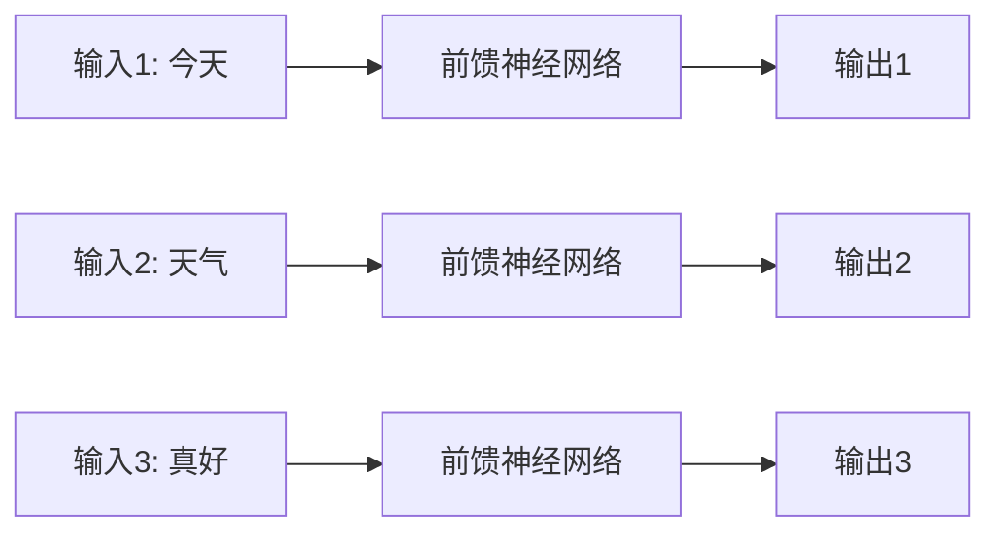
**问题**：看到"今天"、"天气"、"真好"三个词，但不知道它们组成了一个完整的句子！

---

## 🔁 第二部分：反馈连接 —— 给神经网络"装上记忆"

### 2.1 前馈网络 vs 反馈网络

**前馈网络（像单向流水线）：**
```
输入 → 隐藏层 → 输出
```
信息只向前流动，没有回头路

**反馈网络（像有记忆的对话）：**
```
输入 → 隐藏层 → 输出
         ↑      │
         └──────┘
```
隐藏层不仅接收输入，还接收**自己上一时刻的输出**！

### 2.2 反馈连接的直观理解

想象你在**读一本小说**：
- 看到第5页时，你的理解基于：
  - 第5页的内容（**当前输入**）
  - 前4页的情节（**历史记忆**）
- 你的大脑在**持续更新**对故事的理解

反馈神经网络就是这样工作的！

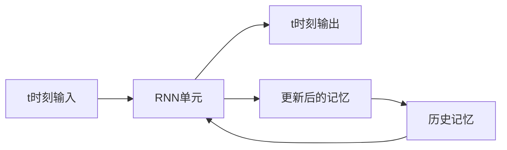

---

## 🧠 第三部分：RNNs是动态系统

### 3.1 两种经典的RNN结构

#### a) Elman网络（更常用）
**核心思想**：隐藏层会记住**自己的历史状态**

**数学公式**：
$$ h(t) = \sigma(W_h x(t) + U_h h(t-1) + b_h) $$
$$ y(t) = \sigma(W_y h(t) + b_y) $$

**通俗解释**：
- `h(t)` = 新的记忆 = σ(当前输入的影响 + 历史记忆的影响 + 偏置)
- `y(t)` = 当前输出 = σ(当前记忆的影响 + 偏置)

#### b) Jordan网络
**核心思想**：隐藏层会记住**之前的输出**

**数学公式**：
$$ h(t) = \sigma(W_h x(t) + U_h y(t-1) + b_h) $$
$$ y(t) = \sigma(W_y h(t) + b_y) $$

**比喻**：
- **Elman网络**：像在写日记，每次都在之前所有记录的基础上添加新内容
- **Jordan网络**：像在回复邮件，每次只参考上一封邮件的内容

### 3.2 用具体例子理解Elman网络

假设我们在处理句子："我爱深度学习"

**时间步1：处理"我"**
```
记忆h(0) = [空]
输入x(1) = "我"
新记忆h(1) = σ(W_h·"我" + U_h·[空] + b_h) = [关于"我"的记忆]
输出y(1) = σ(W_y·[关于"我"的记忆] + b_y) = [可能是个名词]
```

**时间步2：处理"爱"**
```
记忆h(1) = [关于"我"的记忆]
输入x(2) = "爱"
新记忆h(2) = σ(W_h·"爱" + U_h·[关于"我"的记忆] + b_h) 
           = [关于"我爱"的记忆]
输出y(2) = σ(W_y·[关于"我爱"的记忆] + b_y) = [可能是个动词短语]
```

**时间步3：处理"深度学习"**
```
记忆h(2) = [关于"我爱"的记忆]
输入x(3) = "深度学习"
新记忆h(3) = σ(W_h·"深度学习" + U_h·[关于"我爱"的记忆] + b_h)
           = [关于"我爱深度学习"的完整记忆]
输出y(3) = σ(W_y·[完整记忆] + b_y) = [这是一个完整的句子]
```

---

## 🔬 第四部分：使用RNN对动态系统建模

### 4.1 建模过程

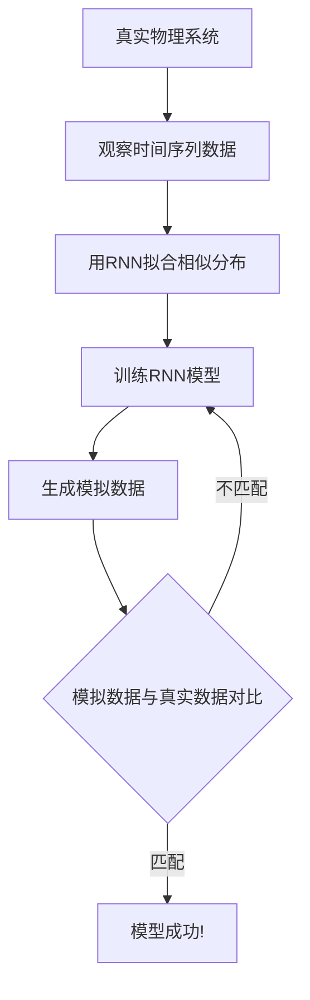

### 4.2 实际应用例子：股票预测

**任务**：预测明天的股价

**可用数据**：
- 过去100天的股价序列
- 相关的经济指标

**RNN如何工作**：
```
第1天股价 + 经济指标 → RNN → 预测第2天股价
第2天股价 + 经济指标 + 第1天记忆 → RNN → 预测第3天股价
第3天股价 + 经济指标 + 前2天记忆 → RNN → 预测第4天股价
...
```

RNN通过**学习历史模式**来预测未来走势！

---

## ❓ 第五部分：为什么RNN可行？

### 5.1 短期记忆机制

RNN的隐藏状态 `h(t)` 实际上是一个**压缩的历史总结**：

$$ h(t) = f(h(t-1), x(t), y(t)) $$

**这就像你的短期记忆**：
- 你能记住刚才对话的内容
- 但记不住昨天这个时候的对话细节

### 5.2 通过时间反向传播（BPTT）

**关键突破**：我们可以把RNN在时间上"展开"，变成**一个很深的前馈网络**！

**展开过程**：
```
原始RNN： h(0) → h(1) → h(2) → h(3)
展开后： h(0) → h(1) → h(2) → h(3)
          ↓      ↓      ↓      ↓
         x(1)   x(2)   x(3)   x(4)
```

展开后，我们就可以用熟悉的**反向传播算法**来训练了！

### 5.3 为什么这很厉害？

1. **理论上通用**：RNN可以被证明是**图灵完备的**，意味着它可以模拟任何计算机程序
2. **实践有效**：在很多序列任务上取得了突破性成果
3. **生物启发**：类似于大脑处理信息的方式

---

## 🧠 第六部分：解释大脑如何工作

### 6.1 联想记忆：大脑的"自动补全"

想象一下：
- 你闻到烤面包的香味 → 自动想起早餐的场景
- 听到歌曲的前奏 → 自动想起整首歌词

这就是大脑的**联想记忆**：**用部分信息恢复完整信息**

### 6.2 Hopfield网络：人工的联想记忆

Hopfield网络是早期的反馈神经网络，它具有**吸引子（Attractors）**：

**工作原理**：
- 网络有多个"稳定状态"（就像记忆模式）
- 当输入一个**不完整或噪声版本**时，网络会自动**收敛到最接近的稳定状态**

**例子**：
```
存储的模式： "CAT"（猫）, "DOG"（狗）, "CAR"（汽车）
输入： "C-T"（不完整的猫）
输出： "CAT"（完整的猫）
```

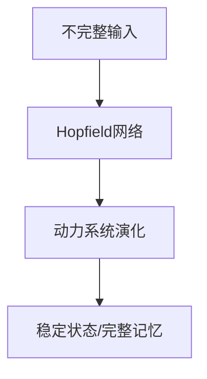

### 6.3 这如何解释大脑工作？

1. **模式完成**：看到朋友背影就能认出是谁
2. **噪声鲁棒性**：在嘈杂环境中也能听懂对话
3. **内容寻址**：通过内容而非地址来检索记忆

---

## 📜 第七部分：RNN的历史演进

### 7.1 重要里程碑

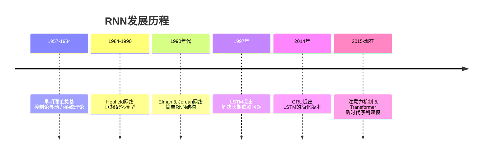

### 7.2 关键人物和贡献

**Stephen Grossberg（1960-70s）**：
- 研究生物神经网络中的适应性和学习
- 为RNN提供了数学理论基础

**John Hopfield（1982）**：
- 提出Hopfield网络
- 证明了神经网络可以拥有稳定的吸引子状态

**Jeffrey Elman（1990）**：
- 提出Elman网络（简单RNN）
- 首次成功将RNN应用于自然语言处理

**Michael Jordan（1986）**：
- 提出Jordan网络
- 在机器人控制和序列学习中应用RNN

### 7.3 从大脑到机器的思想传承

**核心思想演变**：
```
生物神经元 → 人工神经元(McCulloch-Pitts, 1943)
短期记忆 → 反馈连接(1980s-1990s)  
联想记忆 → Hopfield网络(1982)
序列处理 → Elman/Jordan网络(1990)
长期依赖 → LSTM(1997)
```


---

## 🤖 第一部分：简单RNNs —— 给神经网络装上"短期记忆"

### 1.1 什么是简单RNN？

想象一下传统神经网络是个**金鱼**（记忆只有7秒），那么简单RNN就是**正常人**，能记住刚才发生的事情。

**核心思想**：让网络在处理当前信息时，能够**参考之前的信息**。

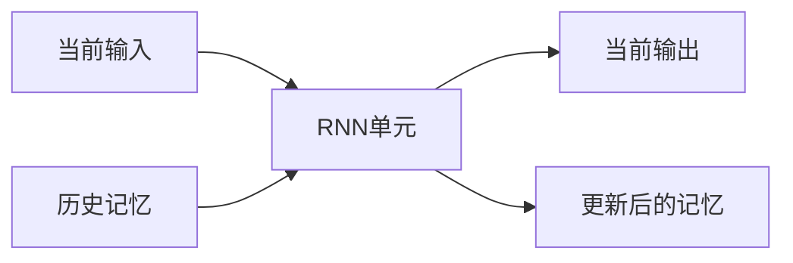

---

## 📝 第二部分：Jordan网络 —— "基于输出的记忆"

### 2.1 Jordan网络的工作原理

**核心特征**：网络会记住**上一时刻的输出**，并用它来帮助处理当前输入。

**数学公式**：
$$ h(t) = \sigma_h(W_h x(t) + U_h y(t-1) + b_h) $$
$$ y(t) = \sigma_y(W_y h(t) + b_y) $$

**拆解理解**：
- `h(t)` = 新的隐藏状态 = σ(当前输入的影响 + 上一输出影响 + 偏置)
- `y(t)` = 当前输出 = σ(当前隐藏状态的影响 + 偏置)

### 2.2 具体例子：自动写诗

假设我们在生成诗句："春风又绿江南岸"

**时间步1：生成"春风"**
```
初始状态：y(0) = [起始标记]
输入：x(1) = [主题: 春天]
计算：
h(1) = σ(W_h·[春天] + U_h·[起始标记] + b_h) = [关于春天的初步想法]
y(1) = σ(W_y·[关于春天的初步想法] + b_y) = "春风"
```

**时间步2：生成"又绿"**
```
现在有：y(1) = "春风"
输入：x(2) = [继续生成]
计算：
h(2) = σ(W_h·[继续生成] + U_h·"春风" + b_h) = [春风相关的进一步发展]
y(2) = σ(W_y·[春风相关的进一步发展] + b_y) = "又绿"
```

**时间步3：生成"江南岸"**
```
现在有：y(2) = "又绿"  
输入：x(3) = [继续生成]
计算：
h(3) = σ(W_h·[继续生成] + U_h·"又绿" + b_h) = [绿色江南的完整意境]
y(3) = σ(W_y·[绿色江南的完整意境] + b_y) = "江南岸"
```

### 2.3 Jordan网络的优缺点

**优点**：
- 输出通常比隐藏状态更有语义信息
- 在某些任务中效果不错

**缺点**：
- 输出信息可能不够丰富（比如经过softmax后变成one-hot向量）
- 记忆能力相对有限

---

## 🧠 第三部分：Elman网络 —— "基于状态的记忆"

### 3.1 Elman网络的工作原理

**核心特征**：网络会记住**上一时刻的隐藏状态**，这是更丰富的内部记忆。

**数学公式**：
$$ h(t) = \sigma_h(W_h x(t) + U_h h(t-1) + b_h) $$
$$ y(t) = \sigma_y(W_y h(t) + b_y) $$

**关键区别**：这里用的是 `h(t-1)` 而不是 `y(t-1)`

### 3.2 具体例子：对话机器人

假设对话：
用户："今天天气怎么样？"
机器人："今天晴天，温度25度。"
用户："适合出去玩吗？"

**处理第一轮对话**：
```
初始：h(0) = [空记忆]
输入：x(1) = "今天天气怎么样？"
计算：
h(1) = σ(W_h·"今天天气怎么样？" + U_h·[空记忆] + b_h) 
     = [理解这是天气查询]
y(1) = σ(W_y·[理解这是天气查询] + b_y) = "今天晴天，温度25度。"
```

**处理第二轮对话**：
```
现在有：h(1) = [理解这是天气查询]
输入：x(2) = "适合出去玩吗？"
计算：
h(2) = σ(W_h·"适合出去玩吗？" + U_h·[理解这是天气查询] + b_h)
     = [结合天气信息判断适宜性]
y(2) = σ(W_y·[结合天气信息判断适宜性] + b_y) = "晴天适合外出游玩。"
```

### 3.3 Elman网络的优缺点

**优点**：
- 隐藏状态包含更丰富的信息
- 记忆能力更强
- 在实践中更常用

**缺点**：
- 训练时容易出现梯度消失/爆炸问题

---

## 🔄 第四部分：通过时间反向传播(BPTT) —— RNN的训练秘籍

### 4.1 BPTT的直观理解

**问题**：RNN在时间上有依赖关系，如何计算梯度？

**解决方案**：把RNN在时间上"展开"，变成**一个很深的前馈网络**！

### 4.2 BPTT的具体过程

以Elman网络为例，展开3个时间步：

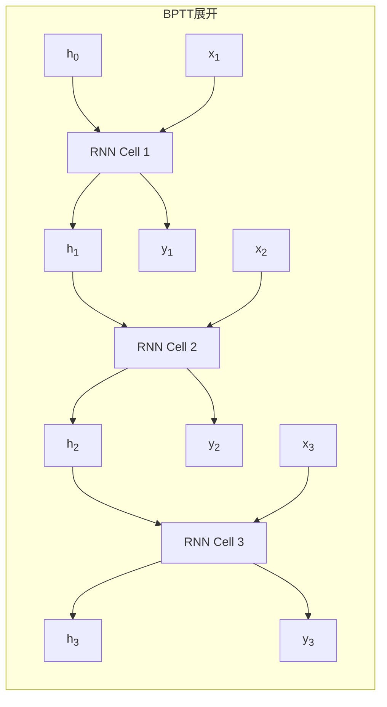

**关键点**：所有时间步**共享相同的权重**（W_h, U_h, W_y）

### 4.3 BPTT的数学计算

**损失函数**：通常是所有时间步损失的总和
$$ L = \sum_{t=1}^T L(t) $$

**梯度计算**：需要计算 $\frac{\partial L}{\partial W_h}$，这涉及链式法则沿着时间回溯：

$$ \frac{\partial L}{\partial W_h} = \sum_{t=1}^T \frac{\partial L(t)}{\partial W_h} $$

由于 $h(t)$ 依赖于 $h(t-1)$，而 $h(t-1)$ 又依赖于 $W_h$，所以：

$$ \frac{\partial h(t)}{\partial W_h} = \frac{\partial h(t)}{\partial h(t-1)} \cdot \frac{\partial h(t-1)}{\partial W_h} + \frac{\partial h(t)}{\partial W_h} $$

这会形成一个**连乘**的链条！

### 4.4 BPTT的问题：梯度消失/爆炸

**梯度消失例子**：
假设每个时间步的梯度是0.5，经过10个时间步：
$$ 0.5^{10} = 0.0009765625 $$
梯度几乎消失！

**梯度爆炸例子**：
假设每个时间步的梯度是2，经过10个时间步：
$$ 2^{10} = 1024 $$
梯度爆炸式增长！

---

## 🕰️ 第五部分：展开Elman网络 —— 四种常见模式

### 5.1 情况1：单输入 → 多步处理 → 单输出

**模式**：
- 输入 `x` 只出现在第一层
- 标签 `r` 只出现在最后一层
- 用于：图像分类、序列编码

**例子**：用RNN处理图像
```
输入：一张猫的图片
过程：RNN逐步"思考"这张图片的特征
输出：最终判断为"猫"
```

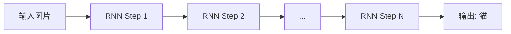

### 5.2 情况2：固定输入 → 多步处理 → 单输出

**模式**：
- 输入 `x` 是固定的，但出现在所有层
- 标签 `r` 只出现在最后一层
- 用于：注意力机制的前身

**例子**：反复观察同一张图片来识别
```
每一步都看同一张图片，但逐步提取不同特征
最终综合所有观察结果做出判断
```

### 5.3 情况3：序列输入 → 多步处理 → 单输出

**模式**：
- 输入 `x(t)` 随时间变化
- 标签 `r` 只出现在最后一层
- 用于：文本分类、情感分析

**例子**：电影评论情感分析
```
输入：["这部电影", "真的很", "精彩"]
每一步处理一个词，积累情感信息
输出：最终判断为"正面评价"
```

### 5.4 情况4：序列输入 → 多步处理 → 序列输出

**模式**：
- 输入 `x(t)` 随时间变化
- 标签 `r(t)` 在所有时间步都出现
- 用于：语音识别、机器翻译

**例子**：语音识别
```
输入：音频帧序列
输出：每个时间步对应的音素或字符
["silence", "h", "e", "l", "l", "o", "silence"]
```

---

## 📊 第六部分：展开Jordan网络

### 6.1 Jordan网络的展开

Jordan网络的展开与Elman网络类似，但反馈连接来自输出：

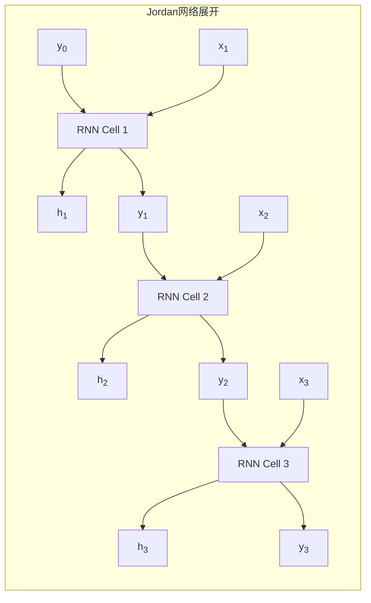

### 6.2 Jordan网络的特点

**计算能力限制**：Jordan网络被证明**不能模拟通用图灵机**，因为它的记忆只来自输出，信息容量有限。

**适用场景**：
- 序列生成任务
- 需要基于之前输出做决策的任务
- 相对简单的序列建模

---
### BPTT的核心思想：

1. **时间展开**：把时间序列变成深度网络
2. **权重共享**：所有时间步用同一组参数
3. **梯度回溯**：沿着时间反向传播误差
4. **连乘效应**：导致梯度消失/爆炸问题

### 四种展开模式的应用：

| 模式 | 输入特点 | 输出特点 | 典型应用 |
|------|----------|----------|----------|
| **模式1** | 单次输入 | 最终输出 | 图像分类、序列编码 |
| **模式2** | 固定重复输入 | 最终输出 | 注意力机制、强化学习 |
| **模式3** | 序列输入 | 最终输出 | 文本分类、情感分析 |
| **模式4** | 序列输入 | 序列输出 | 语音识别、机器翻译 |

---

## 👨‍🏫 第一部分：强制教学(Teacher Forcing) —— "手把手教学"的智慧

### 1.1 什么是强制教学？

想象一下教小孩说话：
- **错误方式**：让孩子自己瞎猜，猜错了也不纠正
- **正确方式**：你说一句，让孩子重复一句，错了立即纠正

**强制教学**就是第二种方式：在训练时，我们直接把**正确答案**作为下一时刻的输入，而不是用模型自己的预测结果。

### 1.2 强制教学的工作流程

**没有强制教学（自由运行）的问题：**
```
真实序列: "我" → "爱" → "学习"
模型预测: "我" → "喜欢" → "玩耍"  ❌
下一时刻输入: "喜欢"（错误的输入！）
```

**使用强制教学：**
```
真实序列: "我" → "爱" → "学习"
模型预测: "我" → "喜欢" → "玩耍"  ❌
下一时刻输入: "爱"（强制使用真实值！）
```

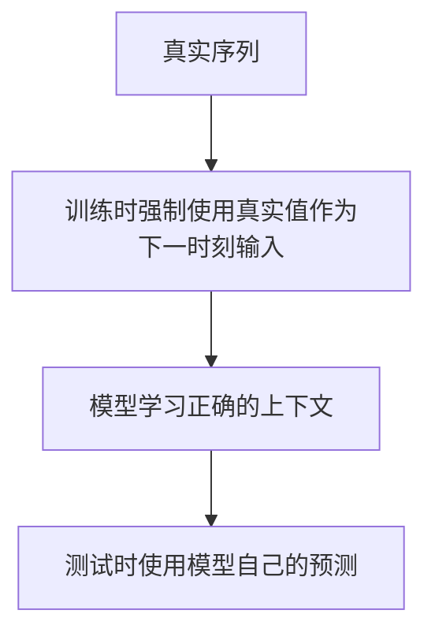

### 1.3 具体例子：训练诗歌生成模型

**训练过程（使用强制教学）：**
```
时间步1:
输入: [开始标记]
真实输出应该是: "春"
模型预测: "春" ✅
强制下一时刻输入: "春"（真实值）

时间步2:
输入: "春"（真实值）
真实输出应该是: "风"
模型预测: "花" ❌
强制下一时刻输入: "风"（真实值，不是"花"！）

时间步3:
输入: "风"（真实值）
真实输出应该是: "又"
模型预测: "又" ✅
...
```

### 1.4 强制教学的巨大优势

**1. 训练稳定性**：模型不会因为自己的错误预测而陷入恶性循环
**2. 训练速度**：所有时间步可以**并行计算**！
**3. 收敛更快**：模型直接学习正确的映射关系

**数学上的好处**：
没有强制教学时，损失函数是：
$$ L = \sum_{t=1}^T L(y_t, \hat{y}_t) $$
其中 $\hat{y}_t$ 依赖于之前所有的预测，这很复杂！

使用强制教学后，每个时间步**独立**，可以并行计算梯度。

### 1.5 强制教学的问题：曝光偏差(Exposure Bias)

**问题**：训练时总是看到"完美答案"，但测试时要靠自己！

这就像：
- **训练**：老师手把手教你做题，总给你正确答案参考
- **考试**：突然让你独立完成，容易犯错

**解决方案**：计划采样(Scheduled Sampling)
- 训练初期：100%使用强制教学
- 训练后期：逐渐增加使用模型自己预测的比例
- 最终：完全使用模型自己的预测

---

## 🔄 第二部分：双向RNN —— "既看前文，又看后文"

### 2.1 为什么需要双向？

在自然语言中，很多词的含义需要**前后文**共同决定：

**例子**：
- "这个**银行**的服务很好"（金融机构）
- "河边的**银行**很陡峭"（河岸）

单向RNN只能看到前文："这个" → 猜"银行"可能是金融机构
双向RNN能看到前后文："这个" + "服务很好" → 确定是金融机构

### 2.2 双向RNN的结构

双向RNN包含**两个独立的RNN**：
- **前向RNN**：从左到右处理序列，捕获**上文信息**
- **后向RNN**：从右到左处理序列，捕获**下文信息**

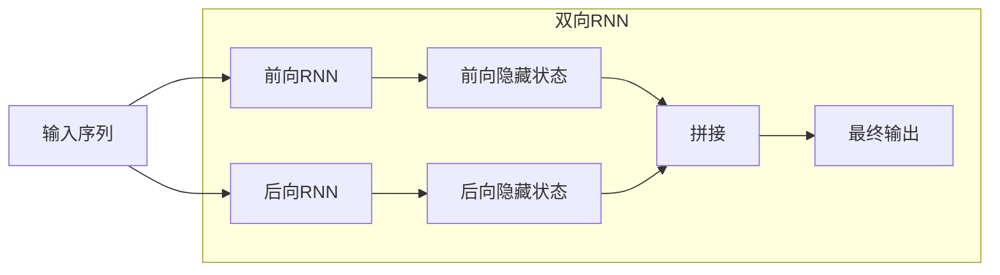

### 2.3 数学表达

**前向RNN**：
$$ \overrightarrow{h}(t) = \sigma(W_{\overrightarrow{h}} x(t) + U_{\overrightarrow{h}} \overrightarrow{h}(t-1) + b_{\overrightarrow{h}}) $$

**后向RNN**：
$$ \overleftarrow{h}(t) = \sigma(W_{\overleftarrow{h}} x(t) + U_{\overleftarrow{h}} \overleftarrow{h}(t+1) + b_{\overleftarrow{h}}) $$

**最终隐藏状态**：
$$ h(t) = [\overrightarrow{h}(t), \overleftarrow{h}(t)] $$

**输出**：
$$ y(t) = \sigma(W_y h(t) + b_y) $$

### 2.4 具体例子：命名实体识别

任务：识别句子中的地名
句子："我昨天去了北京天安门"

**双向RNN的处理**：
```
词:   我    昨天   去了   北京   天安门
前向: →    →     →     →     →
后向: ←    ←     ←     ←     ←

对于"北京"：
- 前向RNN看到: "我昨天去了"
- 后向RNN看到: "天安门"
- 综合判断: "北京"是一个地名
```

### 2.5 双向RNN的局限性

**不能用于序列生成**：因为生成时还没有"未来"信息！
- 适合：分类、标注、理解任务
- 不适合：机器翻译、文本生成（实时生成的任务）

---

## 🏗️ 第三部分：深度RNNs —— "堆叠的智慧"

### 3.1 什么是深度RNN？

就像CNN通过多层卷积提取从简单到复杂的特征，深度RNN通过**堆叠多层RNN**来提取不同抽象层次的时序特征。

**单层RNN**：学习浅层时序模式
**深度RNN**：底层学习局部模式，高层学习全局模式

### 3.2 深度RNN的架构

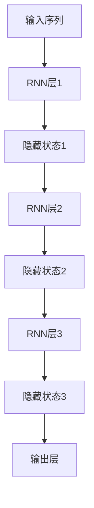

### 3.3 具体例子：语音识别系统

**3层深度RNN用于语音识别**：

```
第1层（底层）：
输入: 音频帧特征
学习: 音素级别的模式（如元音、辅音特征）
输出: 初级语音特征

第2层（中层）：
输入: 初级语音特征  
学习: 音节级别的模式（如ba、ma等音节）
输出: 中级语音特征

第3层（高层）：
输入: 中级语音特征
学习: 词语级别的模式
输出: 文字序列
```

### 3.4 深度RNN的优势

**层次化特征学习**：
- 底层：短时依赖，局部模式
- 中层：中等时长依赖
- 高层：长时依赖，全局语义

**表达能力更强**：更多的非线性变换，可以学习更复杂的时序关系

### 3.5 深度RNN的挑战

**梯度问题加剧**：层数越多，梯度消失/爆炸问题越严重
**计算成本高**：参数数量和计算量大幅增加
**过拟合风险**：需要更多数据和正则化技术

---

## ⚠️ 第四部分：挑战 —— RNN的"阿喀琉斯之踵"

### 4.1 梯度消失/爆炸问题的数学本质

考虑一个简化的Elman网络（没有输入，没有激活函数）：
$$ h(t) = U h(t-1) $$

展开后：
$$ h(t) = U^t h(0) $$

梯度计算时会出现：
$$ \frac{\partial h(t)}{\partial h(0)} = U^t $$

**关键洞察**：
- 如果 $U$ 的特征值 $|\lambda| < 1$：$U^t$ 指数衰减 → **梯度消失**
- 如果 $U$ 的特征值 $|\lambda| > 1$：$U^t$ 指数增长 → **梯度爆炸**

### 4.2 梯度消失的灾难性后果

**例子**：学习长距离依赖
句子："我在十年前买的那本书，现在终于找到了"

要建立"书"和"找到"之间的联系，需要跨越10个词：
- 每个时间步信息衰减为原来的0.9
- 经过10步：$0.9^{10} = 0.35$，只剩35%的信息
- 经过20步：$0.9^{20} = 0.12$，几乎消失！

### 4.3 梯度爆炸的问题

**现象**：训练过程中loss突然变成NaN（不是数字）
**原因**：梯度值过大，导致参数更新步长巨大，网络"崩溃"
**解决方案**：梯度裁剪(Gradient Clipping)

```python
# 梯度裁剪伪代码
grad_norm = calculate_gradient_norm()
if grad_norm > threshold:
    gradients = gradients * (threshold / grad_norm)
```

### 4.4 长期依赖学习困难

**生物学对比**：
- 人类大脑：可以记住几小时前的重要信息
- 简单RNN：通常只能有效记忆10-20个时间步

**任务影响**：
- 适合：短文本分类、股票短期预测
- 困难：长文档理解、长期趋势预测

---

## 💡 第五部分：说明 —— 理论的严谨性

### 5.1 数学推广的严谨性

前面关于梯度问题的结论可以**严格推广**到多维情况：

**定理**：对于多维Elman网络，如果权重矩阵 $U$ 是**对称的**，那么：
- 梯度行为由 $U$ 的特征值决定
- 最大特征值 > 1 → 梯度爆炸
- 最大特征值 < 1 → 梯度消失

**现实情况**：即使 $U$ 不对称，类似的结论仍然成立，只是分析更复杂。

### 5.2 Jordan网络的同样问题

对于Jordan网络，我们可以将 $y(t)$ 表示为 $y(0)$ 和 $x(1), ..., x(t)$ 的函数，同样会发现：

$$ \frac{\partial y(t)}{\partial y(0)} \propto U^t $$

同样的梯度消失/爆炸问题！

### 5.3 理论的意义

这些数学分析不是纯理论的游戏，而是：
1. **解释了现象**：为什么简单RNN难以学习长期依赖
2. **指导了改进**：促使研究者开发LSTM、GRU等解决方案
3. **提供了工具**：梯度裁剪、权重初始化等实用技术

---

## 🎯 总结：RNN进阶概念的核心要点

### 关键技术对比：

| 技术 | 核心思想 | 适用场景 | 局限性 |
|------|----------|----------|---------|
| **强制教学** | 训练时用真实值作为输入 | 序列生成训练 | 曝光偏差 |
| **双向RNN** | 同时考虑前后文信息 | 分类、标注任务 | 不能实时生成 |
| **深度RNN** | 堆叠多层提取层次特征 | 复杂序列建模 | 梯度问题加剧 |

### 核心挑战总结：

1. **梯度消失**：信息随时间指数衰减，难以学习长期依赖
2. **梯度爆炸**：训练不稳定，需要梯度裁剪
3. **长期记忆**：简单RNN的记忆窗口有限
4. **训练测试差异**：强制教学导致的曝光偏差

### 解决思路演进：

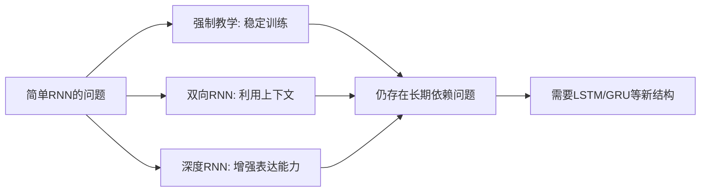


## 门控RNN

---

## 🧠 第一部分：长短时记忆(LSTM)单元 —— RNN的"超级大脑"

### 1.1 LSTM要解决的核心问题

**简单RNN的致命缺陷**：短期记忆太短！
- 就像一个人只能记住最近几分钟的对话
- 无法建立长距离的因果关系

**LSTM的突破**：给RNN装上"长期记忆硬盘"，而不仅仅是"短期记忆内存"

### 1.2 LSTM的设计哲学：组合创新

LSTM不是凭空创造的，它巧妙结合了两种简单RNN的优点：

- **Elman网络**的自循环机制
- **Jordan网络**的输出反馈机制

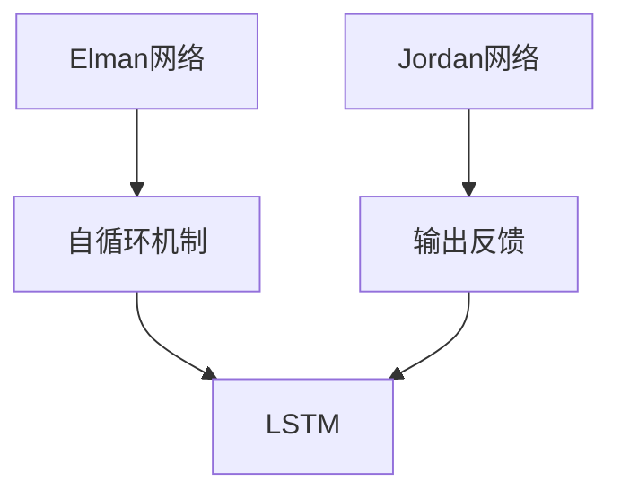

---

## 🔄 第二部分：第1步 - 添加一个自循环

### 2.1 从Jordan网络出发

我们先从Jordan网络开始：
```
h(t) = σ(W_h·x(t) + U_h·y(t-1) + b_h)
y(t) = σ(W_y·h(t) + b_y)
```

### 2.2 关键创新：引入细胞状态

LSTM引入了一个新的状态——**细胞状态(cell state)**，专门用来存储长期记忆：

```
h(t) = σ(W_h·x(t) + U_h·y(t-1) + b_h)
c(t) = c(t-1) + h(t)          ← 这是关键！
y(t) = σ_y(c(t))              ← 注意：去掉了W_y
```

**这个简单的加法带来了革命性变化！**

### 2.3 为什么加法如此重要？

**对比传统RNN的乘法更新**：
`h(t) = σ(··· + U_h·h(t-1))`
- 梯度涉及连乘：`∂h(t)/∂h(t-1) ∝ U_h`
- 容易梯度消失/爆炸

**LSTM的加法更新**：
`c(t) = c(t-1) + h(t)`
- 梯度：`∂c(t)/∂c(t-1) = 1`
- 梯度可以无损传播！

### 2.4 直观例子：记忆累积

想象你在记录重要事件：

```
第1天：c(1) = 0 + "项目启动" = "项目启动"
第2天：c(2) = "项目启动" + "需求分析完成" = "项目启动，需求分析完成"
第3天：c(3) = "项目启动，需求分析完成" + "设计稿确认" = "项目启动，需求分析完成，设计稿确认"
...
```

信息不断累积，不会丢失！

---

## 🚪 第三部分：第2步 - 添加三个门

### 3.1 问题：简单的加法会无限累积

如果只是不断累加，细胞状态会变得杂乱无章。我们需要**选择性记忆**机制。

### 3.2 三个智能门的引入

LSTM添加了三个门来控制信息流动：

#### 1. 遗忘门(Forget Gate) - "决定忘记什么"
```
f(t) = σ(W_f·x(t) + U_f·y(t-1) + b_f)
```
作用：决定从长期记忆中丢弃哪些旧信息

#### 2. 输入门(Input Gate) - "决定记住什么"
```
i(t) = σ(W_i·x(t) + U_i·y(t-1) + b_i)
```
作用：决定哪些新信息值得存入长期记忆

#### 3. 输出门(Output Gate) - "决定输出什么"
```
o(t) = σ(W_o·x(t) + U_o·y(t-1) + b_o)
```
作用：基于长期记忆，决定当前输出什么

### 3.3 完整的LSTM更新方程

```
# 1. 计算候选信息
h̃(t) = tanh(W_h·x(t) + U_h·y(t-1) + b_h)

# 2. 计算三个门
f(t) = σ(W_f·x(t) + U_f·y(t-1) + b_f)  # 遗忘门
i(t) = σ(W_i·x(t) + U_i·y(t-1) + b_i)  # 输入门  
o(t) = σ(W_o·x(t) + U_o·y(t-1) + b_o)  # 输出门

# 3. 更新细胞状态（长期记忆）
c(t) = f(t) ⊙ c(t-1) + i(t) ⊙ h̃(t)

# 4. 计算输出（短期记忆）
y(t) = o(t) ⊙ tanh(c(t))
```

其中 `⊙` 表示逐元素相乘

### 3.4 具体例子：对话系统中的LSTM

假设对话：
用户："我明天要去北京出差"
用户："对了，北京的天气怎么样？"

**处理第一句话**：
```
输入："我明天要去北京出差"
遗忘门：忘记无关信息
输入门：记住"北京"、"明天"、"出差"
细胞状态：存储[地点:北京, 时间:明天, 目的:出差]
输出：生成回应
```

**处理第二句话**：
```
输入："北京的天气怎么样？"
遗忘门：保持相关信息，忘记部分细节
输入门：记住"天气"查询
细胞状态：结合[地点:北京]和[天气查询]，知道要查询北京天气
输出："明天北京晴天，25度"
```

---

## 🎛️ 第四部分：门由什么决定？

### 4.1 门的输入来源

所有三个门都由相同的输入计算：
- **当前输入** `x(t)`
- **上一时刻输出** `y(t-1)`

**数学表达**：
```
f(t) = σ(W_f·x(t) + U_f·y(t-1) + b_f)  # 遗忘门
i(t) = σ(W_i·x(t) + U_i·y(t-1) + b_i)  # 输入门
o(t) = σ(W_o·x(t) + U_o·y(t-1) + b_o)  # 输出门
```

### 4.2 为什么用Sigmoid函数？

**Sigmoid的输出范围是(0,1)**，正好表示"门的开合程度"：
- 0 = 完全关闭
- 1 = 完全打开  
- 0.5 = 半开半闭

### 4.3 窥视孔连接(Peepholes) - 高级特性

更先进的LSTM变体让门也看到细胞状态：
```
f(t) = σ(W_f·x(t) + U_f·y(t-1) + P_f·c(t-1) + b_f)
```
这样门可以基于长期记忆的内容来做决策。

---

## 📚 第五部分：术语澄清

### 5.1 LSTM中的各种状态

| 术语 | 符号 | 通俗解释 | 作用 |
|------|------|----------|------|
| **细胞状态** | `c(t)` | 长期记忆硬盘 | 存储重要信息，跨越长时间 |
| **隐藏状态** | `h(t)` | 候选记忆 | 当前输入产生的待选信息 |
| **输出** | `y(t)` | 短期记忆输出 | 当前时间步的预测结果 |

### 5.2 注意：术语的混淆

在实践中，人们有时把：
- `y(t)` 称为LSTM的隐藏状态
- 特别是在将LSTM集成到更大系统中时

**关键要理解**：`c(t)` 是真正的长期记忆，`y(t)` 是基于长期记忆的当前输出。

---

## 💭 第六部分：思考题深度解析

### 6.1 LSTM能否保留更长记忆？为什么？

**绝对可以！** 原因在于：

**数学原理**：
```
传统RNN: h(t) = σ(··· + U·h(t-1))
梯度: ∂h(t)/∂h(t-1) ∝ U

LSTM: c(t) = f(t)⊙c(t-1) + i(t)⊙h̃(t)  
梯度: ∂c(t)/∂c(t-1) = f(t) + (其他项)
```

即使 `f(t)` 很小，只要不为0，梯度就不会完全消失！

**直观比喻**：
- 传统RNN：像在沙滩上写字，浪一来就冲没了
- LSTM：像在石头上刻字，可以保存很久

### 6.2 理想的内存保持情况

如果要永远保持 `t=n` 时刻的记忆 `c(n)`，需要：

```
对于所有 t > n:
f(t) = 1     # 完全记住过去
i(t) = 0     # 不添加新信息
```

这样 `c(t) = 1·c(t-1) + 0·h̃(t) = c(t-1)`，记忆永远不变！

---

## 🏆 第七部分：LSTM的巨大优势

### 7.1 解决长期依赖问题

**实际成就**：
- 机器翻译：处理50+个词的长句子
- 语音识别：理解复杂的口语表达
- 文档摘要：从长文章中提取关键信息

### 7.2 门控机制的广泛影响

LSTM的门控思想影响了整个深度学习领域：

**Highway Networks (2015)**：在CNN中引入门控捷径
**SEnet (2018)**：通过门控机制重新校准通道重要性
**SKnet (2019)**：动态选择不同大小的卷积核

### 7.3 注意力机制的基础

LSTM的门控机制实际上是**自注意力**的雏形：
- 门决定"关注"哪些信息
- 为后来的Transformer架构奠定了基础

---

## ⚡ 第八部分：门控循环单元(GRU) - LSTM的简化版

### 8.1 GRU的设计哲学：简洁高效

**观察**：LSTM参数太多（3个门），能否简化？

**GRU的核心创新**：
1. **合并细胞状态和隐藏状态**：直接使用 `h(t)` 同时作为记忆和输出
2. **减少门数量**：从3个门减少到2个门
3. **重新设计更新机制**

### 8.2 GRU的三个关键想法

#### 想法1：更新门代替输入门+遗忘门
```
z(t) = σ(W_z·x(t) + U_z·h(t-1) + b_z)
```
`z(t)` 同时控制：
- 保留多少旧信息（类似遗忘门）
- 添加多少新信息（类似输入门）

#### 想法2：直接使用隐藏状态作为输出
```
y(t) = h(t)
```
简化了信息流动

#### 想法3：重置门调节历史信息
```
r(t) = σ(W_r·x(t) + U_r·h(t-1) + b_r)
```
控制历史信息对当前候选状态的影响

### 8.3 GRU的完整方程

```
# 1. 计算两个门
z(t) = σ(W_z·x(t) + U_z·h(t-1) + b_z)  # 更新门
r(t) = σ(W_r·x(t) + U_r·h(t-1) + b_r)  # 重置门

# 2. 计算候选状态（考虑重置门）
h̃(t) = tanh(W_h·x(t) + U_h·(r(t)⊙h(t-1)) + b_h)

# 3. 更新隐藏状态
h(t) = z(t)⊙h(t-1) + (1-z(t))⊙h̃(t)

# 4. 输出就是隐藏状态
y(t) = h(t)
```

---

## 📊 第九部分：GRU总结

### 9.1 GRU的优雅设计

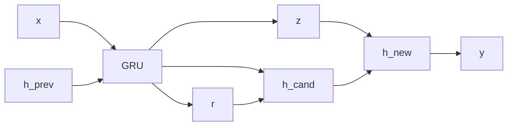

### 9.2 GRU vs LSTM 参数对比

| 组件 | LSTM | GRU | 参数减少 |
|------|------|-----|----------|
| 状态数量 | 2个(c,h) | 1个(h) | - |
| 门数量 | 3个 | 2个 | 33% |
| 总参数量 | ~4n² | ~3n² | 25% |

(n为隐藏层维度)

---

## ⚖️ 第十部分：LSTM vs GRU - 哪个更优？

### 10.1 权威研究结论

根据Greff等人的系统研究(2017)：
> "LSTM和GRU在许多任务上表现相似，没有明显的赢家。它们的各种变体在所有任务中都无法稳定击败这两个标准版本。"

### 10.2 实际选择建议

**选择LSTM当**：
- 任务非常复杂，需要精细的记忆控制
- 数据充足，不怕参数多
- 需要最大化的性能

**选择GRU当**：
- 数据有限或计算资源紧张
- 需要更快的训练速度
- 任务相对简单

### 10.3 业界实践

- **Google翻译**：早期使用LSTM，后来转向Transformer
- **语音识别**：多使用LSTM变体
- **推荐系统**：常用GRU，因为效率更重要

---

## 🎯 总结：门控RNN的革命性贡献

### 关键突破点：

1. **解决梯度消失**：通过加法更新和门控机制
2. **长期记忆**：细胞状态可以跨越数百个时间步
3. **选择性注意力**：门控机制让网络学会关注重要信息

### 设计思想演进：

```
简单RNN (记忆短)
    ↓
LSTM (3个门，精细控制) 
    ↓  
GRU (2个门，简洁高效)
    ↓
Transformer (自注意力，并行处理)
```

### 为什么这些知识如此重要？

1. **理解现代AI基础**：LSTM/GRU是2015-2018年很多突破的核心
2. **实际问题解决**：知道何时选择LSTM vs GRU
3. **技术演进逻辑**：理解从简单到复杂再到简洁的设计哲学
4. **创新思维启发**：门控机制的思想可以应用到其他领域

## 🎤 语音识别任务简介

**语音识别**（Automatic Speech Recognition, ASR）的目标是将输入的**语音信号**转换为对应的**文本序列**。这是一个典型的序列到序列（Sequence-to-Sequence）任务。想象一下，你对着手机说"今天天气怎么样"，手机需要将这一串声音波形转化为文字，这个过程就是语音识别。

语音识别面临几个核心挑战：
1.  **输入输出长度不一**：语音帧序列和文本序列长度通常不同。
2.  **上下文依赖**：人类语言的理解往往需要联系上下文。
3.  **环境噪音**：现实环境中的噪音会增加识别难度。

### 🧠 RNN的设置

在语音识别中，我们通常使用**每个时间步都有输出**的RNN结构（对应之前讲解的Elman网络展开的情况4）。

-   **输入**：在时间步 \( t \)，输入 \( x^{(t)} \) 是语音信号的一段**声学特征**，例如**频谱图**（Spectrogram）或其相关特征。
-   **隐藏状态**：\( h^{(t)} \) 表示到当前时间步为止，RNN积累的历史语音信息。
-   **输出**：每一个时间步的输出 \( y^{(t)} \) 通常是一个向量，表示在当前位置对应各个发音单元（如音素或字符）的分数或概率。

### 🎯 目标函数与CTC损失

我们需要一个能够处理输入输出序列长度差异的损失函数。**连接主义时间分类（Connectionist Temporal Classification, CTC）** 损失函数就是为了解决这个问题而提出的。

CTC引入了一个特殊的 **`blank`** 符号（通常用 `φ` 表示），代表"非输出"或"静音"。通过动态规划算法，CTC可以高效地计算所有能通过合并重复字符和去除 `blank` 符号从而映射到正确标签序列的路径概率之和。训练的目标就是**最大化这个概率和**，这等价于**最小化CTC损失**。

例如，对于语音片段"hello"的一个可能对齐路径，在CTC中可能是 `"φ φ h e l l l o o φ"`，经过合并重复字符和去除 `blank` 后，得到最终的 `"hello"`。

### 🔁 使用双向LSTM

在语音识别中，为了更好地利用上下文信息，我们常常使用**双向RNN**，特别是**双向LSTM**（Bi-LSTM）。

-   **原因**：一个词的发音和理解，往往需要结合它**前面和后面**的声音信息。
-   **工作原理**：双向LSTM包含一个**前向LSTM**（从序列开头到结尾处理）和一个**后向LSTM**（从序列结尾到开头处理）。每个时间步的最终输出由前向和后向LSTM的隐藏状态共同决定。
-   **优势**：这种结构能够同时捕捉**过去**和**未来**的上下文信息，显著提高识别的准确性。

### 🚀 深度RNN与百度Deep Speech 2

**Deep Speech 2** 是百度在2015年推出的一个端到端深度学习语音识别系统，它展示了深度RNN在语音识别中的强大能力。

**Deep Speech 2的主要特点：**

1.  **端到端学习**：直接从音频频谱图特征映射到文本字符，简化了传统语音识别复杂的处理流程。
2.  **深度架构**：网络结构可能包含：
    -   **卷积层**：用于提取音频特征并降低序列长度。
    -   **多层RNN**：使用多层**双向RNN**，可以是GRU或LSTM，用于序列建模。
    -   **全连接层**：用于最终的分类输出。
3.  **高性能计算**：利用高性能计算技术加速大规模数据的训练。
4.  **多语言支持**：该系统同时支持英文和中文普通话的识别。
5.  **CTC损失函数**：使用CTC作为损失函数，处理序列对齐问题。

### 📊 数据预处理

在将语音输入模型之前，需要进行预处理，将原始的音频波形转换为更适合模型处理的特征。常见的步骤包括：

-   **特征提取**：通常模型的输入不是原始的wav信号，而是**频谱特征**。例如，一些系统会使用基于傅立叶变换的**梅尔频率倒谱系数**或其衍生物作为特征。
-   **归一化**：对特征进行归一化处理，例如使得每个特征维度在整个训练集上具有零均值和单位方差，以帮助模型稳定训练。

### 📚 基准数据集

为了训练和评估语音识别系统，研究人员使用了一系列标准数据集：

-   **LibriSpeech**：包含约1000小时的英文朗读语音，是目前广泛使用的基准数据集之一。
-   **Switchboard**：包含约260小时的英文电话对话语音。
-   **CHiME**：包含多种环境噪音的语音数据，用于挑战噪音环境下的识别。
-   **中文数据集**：例如**DTZH1505**（1505小时中文普通话语音）、**AISHELL**系列等，为中文语音识别研究提供了重要资源。

### 🏆 当前最佳水平与发展趋势

语音识别技术在近年来发展迅速：

-   **技术演进**：从早期的**GMM-HMM**模型，到**DNN-HMM**混合模型，再到如今的**端到端深度学习模型**（如基于CTC、RNN-T、注意力机制的模型），以及当前基于**Transformer**和**Conformer**的架构。
-   **当前最佳水平**：例如，微软曾宣布其语音识别系统在Switchboard数据集上的**词错误率**降低至**5.1%**，达到了人类专业转录员的水平。
-   **研究趋势**：
    -   **自监督学习**：如wav2vec 2.0等模型，利用大量无标签语音数据学习通用语音表征。
    -   **大规模弱监督学习**：例如OpenAI的Whisper模型，在海量未经严格标注的音频数据上进行训练，展现了强大的鲁棒性和多语言能力。
    -   **流式识别**：为了满足实时交互需求，如何在不使用未来信息或有限未来信息的前提下进行准确的流式语音识别也是一个研究热点。

### 💎 总结

反馈神经网络，特别是**LSTM**和**GRU**，通过其门控机制有效捕捉长距离依赖，结合**双向结构**充分利用上下文，并通过**CTC损失函数**解决了序列对齐的核心难题，奠定了深度学习时代语音识别技术的基础。从**Deep Speech 2**等端到端系统中，我们可以看到RNNs在复杂序列建模任务中的关键作用。

### 📖 主要参考文献与延伸阅读

1.  **核心参考**：
    -   Graves, A., Mohamed, A., & Hinton, G. (2013). *Speech recognition with deep recurrent neural networks.* IEEE ICASSP. (这篇论文详细介绍了如何使用双向LSTM进行语音识别)
    -   Amodei, D., et al. (2016). *Deep Speech 2: End-to-End Speech Recognition in English and Mandarin.* ICML. (详细介绍了Deep Speech 2架构)
    -   Graves, A., et al. (2006). *Connectionist Temporal Classification: Labelling Unsegmented Sequence Data with Recurrent Neural Networks.* ICML. (CTC损失函数的原始论文)
2.  **延伸阅读**：
    -   **《Deep Learning》**(Goodfellow, Bengio, Courville) 第10章：系统介绍了RNN及其在语音识别等任务中的应用。
    -   **理解LSTM网络** (http://colah.github.io/posts/2015-08-Understanding-LSTMs/)：直观讲解LSTM的经典博客。
    -   关于**流式语音识别**（如RNN-T, Transformer-Transducer）的最新研究。

希望这部分讲解能帮助你理解RNN在语音识别中的应用。如果对某个细节还有疑问，我们可以继续深入探讨。
