## 一、自然语言处理（NLP）概述

自然语言处理是人工智能的一个核心领域，目标是让计算机能够**理解、解释和生成人类语言**。它不仅仅是“处理文字”，而是要让机器具备某种程度的“语言智能”。

> 💡 **大白话理解**：就像教一个外星人学中文，不仅要教它认字，还要教它语法、语境、甚至幽默和讽刺。

---

## 二、典型任务详解

### 1. 词性标注 & 句法分析

#### 词性标注：
- **是什么**：给句子中的每个词打上一个“语法标签”，比如名词、动词、形容词等。
- **例子**：
  - 句子：`The movie is very interesting`
  - 标注：`The/DT movie/NN is/VBZ very/RB interesting/JJ`

#### 句法分析：
- **是什么**：分析句子的语法结构，找出主谓宾、定状补等成分，形成一棵“语法树”。
- **例子**（对同一句子进行分析）：

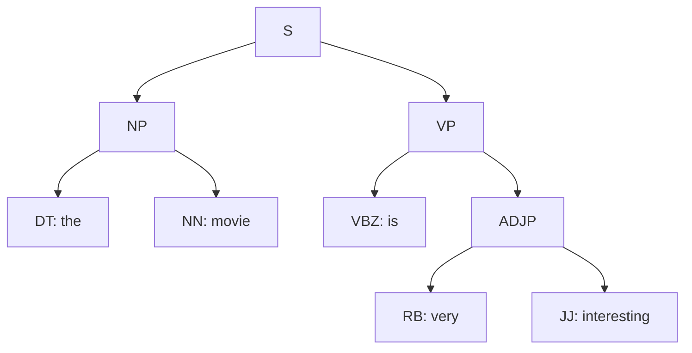

> 💡 **意义**：这是理解句子结构的基础，是后续所有高级任务（如翻译、问答）的基石。

---

### 2. 问答系统 & 对话系统

#### 问答系统：
- **是什么**：根据用户的问题，从知识库或文本中找出精确答案。
- **例子**：
  - Q: How many people live in Beijing?
  - A: About **22 million**.

#### 对话系统：
- **是什么**：与用户进行多轮、有上下文的对话，完成特定任务（如订餐、客服）。
- **例子**：
```
用户: can you book a table in a cheap price range in London
系统: I’m on it. Any preference on a type of cuisine?
用户: with french food
系统: how many people would be in your party?
...
```

> 💡 **核心挑战**：理解上下文、记住对话历史、生成自然流畅的回复。

---

### 3. 文本/文档分类 & 情感分析

#### 是什么：
- 给一段文本打上预定义的标签。
- **情感分析**是其中一种，判断文本的情感倾向（正面/负面/中性）。

#### 例子：
- `Deep learning is so cool.` → **Positive**
- `This skirt looks ugly!` → **Negative**
- `I attended the lecture today.` → **Neutral** (或按主题分类，如“教育”)

> 💡 **应用**：垃圾邮件过滤、新闻分类、电商评论分析、社交媒体监控。

---

### 4. 机器翻译

#### 是什么：
- 将一种语言的句子自动翻译成另一种语言。
- 早期基于规则和统计，现在主流是**神经网络机器翻译**。

#### 例子：
- 中文：`我觉得深度学习很酷，但是有太多东西要学了，感觉时间有点不够用。`
- 英文：`I think deep learning is cool, but there are so many things to learn, and I feel that time is not enough.`

> 💡 **技术核心**：使用**Seq2Seq模型**，包含一个**编码器**（理解原句）和一个**解码器**（生成目标句）。

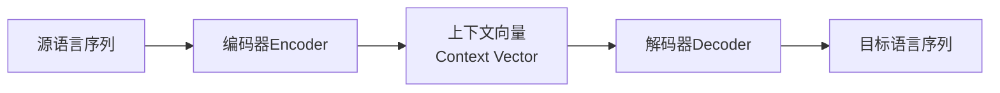

---

### 5. 文本生成：中国对联 & 古诗生成

这是NLP中非常有趣且具有文化特色的任务，展示了模型的“创造力”。

#### 中国对联生成：
- **规则**：上下联字数相同、平仄相对、词性相对、意境相关。
- **例子**：
  - 上联：`青山不墨千秋画`
  - 下联：`绿水无弦万古琴`
- **系统实现**：给定上联，模型（如RNN或Transformer）会生成多个候选下联供选择。

#### 中国古代诗歌生成：
- **规则**：遵循严格的格律（平仄、押韵）、意象和意境。
- **例子**（系统生成）：
  ```
  江上风初息
  天寒乌未翔
  不堪残夜月
  孤影度窗光
  ```
- **技术**：通常使用**循环神经网络**或**Transformer**，在大量古诗数据集上训练，学习其格律和用词模式。

> 💡 **本质**：这类生成任务不是真正的“创作”，而是模型在学习了海量数据后，对**语言模式和概率分布**的模仿与重组。

---

## 三、总结

这些典型任务构成了NLP的核心应用版图，从基础的**词和句法分析**，到实用的**分类、问答和翻译**，再到充满挑战的**文本生成**。它们背后的共同基础是：

1.  **词的表示**：如何将文字转化为计算机能理解的数值（如Word2Vec）。
2.  **序列建模**：如何理解和生成有顺序的文本（如RNN, LSTM, Transformer）。
3.  **上下文理解**：如何捕捉词与词、句与句之间的关系（如Attention机制）。
---

## 一、词表示：从符号到向量的进化

### 1. 独热表示 - 最原始的编码方式

**是什么**：每个词用一个很长的向量表示，向量长度等于词汇表大小，只有对应词的位置是1，其他都是0。

**例子**：
- 词汇表： ["apple", "banana", "cat", "dog", "eat", "fruit", "like", "pet", "run", ...]（假设有10,000个词）
- `apple` = [1, 0, 0, 0, 0, 0, 0, 0, 0, ...]  
- `banana` = [0, 1, 0, 0, 0, 0, 0, 0, 0, ...]

**问题**：
- **维度灾难**：词汇表可能有百万级，向量维度太高
- **语义鸿沟**：所有词之间的距离都相等，无法表达"苹果和香蕉都是水果"这种语义关系

> 💡 **大白话**：就像给学校每个学生一个学号，只知道"张三是001，李四是002"，但不知道他们是什么关系、有什么共同点。

---

## 二、基于窗口的共现矩阵

### 核心思想："观其友，知其人"
通过统计一个词周围经常出现哪些词来了解这个词的含义。

**例子**：
语料库：
- "I like deep learning"
- "I like NLP"  
- "I enjoy flying"

构建共现矩阵（窗口大小=1）：

| 词      | I | like | deep | learning | NLP | enjoy | flying |
|---------|---|------|------|----------|-----|-------|--------|
| I       | 0 | 2    | 0    | 0        | 0   | 1     | 0      |
| like    | 2 | 0    | 1    | 0        | 1   | 0     | 0      |
| deep    | 0 | 1    | 0    | 1        | 0   | 0     | 0      |
| learning| 0 | 0    | 1    | 0        | 0   | 0     | 0      |
| NLP     | 0 | 1    | 0    | 0        | 0   | 0     | 0      |
| enjoy   | 1 | 0    | 0    | 0        | 0   | 0     | 1      |
| flying  | 0 | 0    | 0    | 0        | 0   | 1     | 0      |

**解读**：从"like"的行可以看到，它经常与"I"、"deep"、"NLP"一起出现。

---

## 三、问题：共现矩阵的局限性

1. **维度依然很高**：矩阵大小 = 词汇表 × 词汇表
2. **数据稀疏**：大部分单元格都是0
3. **不够鲁棒**：小规模语料下统计不稳定
4. **扩展困难**：新增一个词需要重新计算整个矩阵

> 💡 **本质问题**：我们需要一种更紧凑、更智能的表示方法。

---

## 四、用低维向量表示单词

**目标**：把每个词表示成一个**稠密、低维**的向量（通常25-1000维），同时保留语义信息。

**关键突破**：
- **神经概率语言模型**（Bengio等，2003）
- **word2vec**（Mikolov等，2013） - 更简单、更高效

> 💡 **大白话**：原来用1万个数字表示一个词（其中9999个是0），现在只用100个有意义的数字，这些数字编码了词的"含义"。

---

## 五、神经概率语言模型的影响

**历史意义**：Yoshua Bengio在2003年的这篇论文是NLP深度学习的开山之作，他也因此获得2018年图灵奖。

**核心贡献**：首次用神经网络来学习词的分布式表示，证明了：
- 神经网络可以自动学习到有意义的词向量
- 这些向量能够捕捉语法和语义关系

---

## 六、word2vec的主要思想

### 核心突破：从"计数"到"预测"
不再统计词共现次数，而是训练神经网络来**预测一个词周围的词**。

**两种训练方式**：
1. **Skip-gram**：用一个词预测它周围的词
2. **CBOW**：用周围的词预测中间的那个词

> 💡 **大白话**：不是问"banking这个词经常和哪些词一起出现？"，而是问"给定banking这个词，你能猜出它周围可能是什么词吗？"

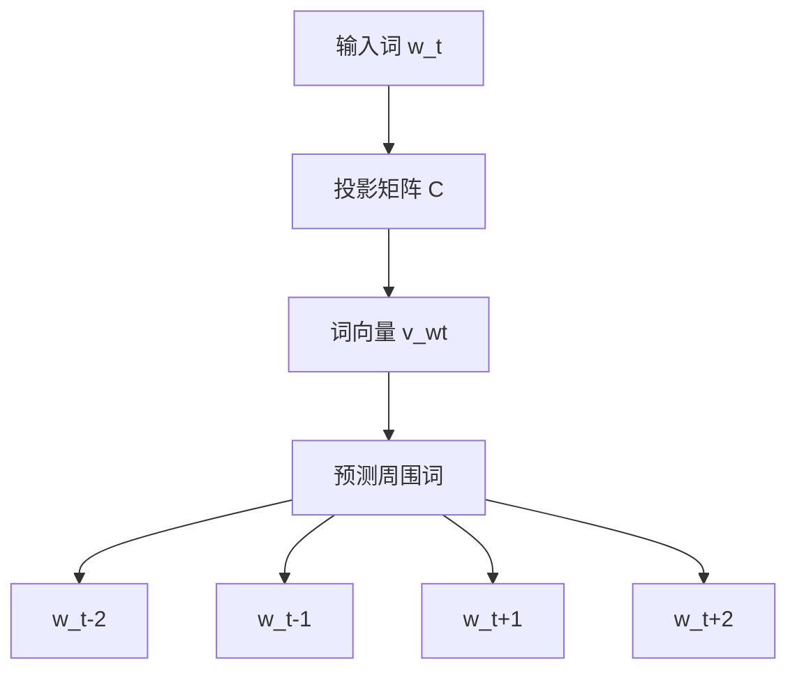

---

## 七、输入向量与输出向量

在word2vec模型中，实际上有两套向量：

- **输入向量**（矩阵C的列）：用于表示"中心词"
- **输出向量**（矩阵K的行）：用于表示"周围词"

**最终表示**：训练完成后，通常取输入向量，或者输入输出向量的平均值作为词的最终表示。

> 💡 **类比**：就像一个人既有"被认识"的特征（别人怎么看他），也有"认识别人"的特征（他怎么看待别人），综合起来才是完整的他。

---

## 八、公式：Skip-gram模型的数学表达

给定中心词 $w_t$，预测周围词 $w_{t+j}$ 的概率：

$$p(w_{t+j} | w_t) = \frac{\exp(\mathbf{v}'_{w_{t+j}} \cdot \mathbf{v}_{w_t})}{\sum_{m=1}^{|V|} \exp(\mathbf{v}'_{w_m} \cdot \mathbf{v}_{w_t})}$$

**公式解读**：
- $\mathbf{v}_{w_t}$：中心词的输入向量
- $\mathbf{v}'_{w_{t+j}}$：周围词的输出向量  
- 分子：中心词与某个周围词的"亲密程度"
- 分母：与所有可能词的亲密程度之和，确保是个概率分布

---

## 九、目标函数：模型的学习目标

要最大化周围词出现的平均对数概率：

$$J(\theta) = -\frac{1}{T} \sum_{t=1}^{T} \sum_{-c \leq j \leq c, j \neq 0} \ln p(w_{t+j}|w_t)$$

**解读**：
- 对文本中每个位置 $t$ 的中心词
- 对窗口内每个周围位置 $j$（排除自身）
- 最大化真实周围词出现的概率

**训练方法**：用**反向传播**和**随机梯度下降**来优化这个目标。

---

## 十、softmax的替代方法

### 为什么需要替代？
计算完整的softmax代价太高！每次都要对词汇表中所有词计算，词汇表可能有百万级别。

### 两种高效替代方案：

#### 1. 层次化softmax
**思想**：把词汇表组织成一棵二叉树，把$O(|V|)$的计算复杂度降到$O(\log|V|)$

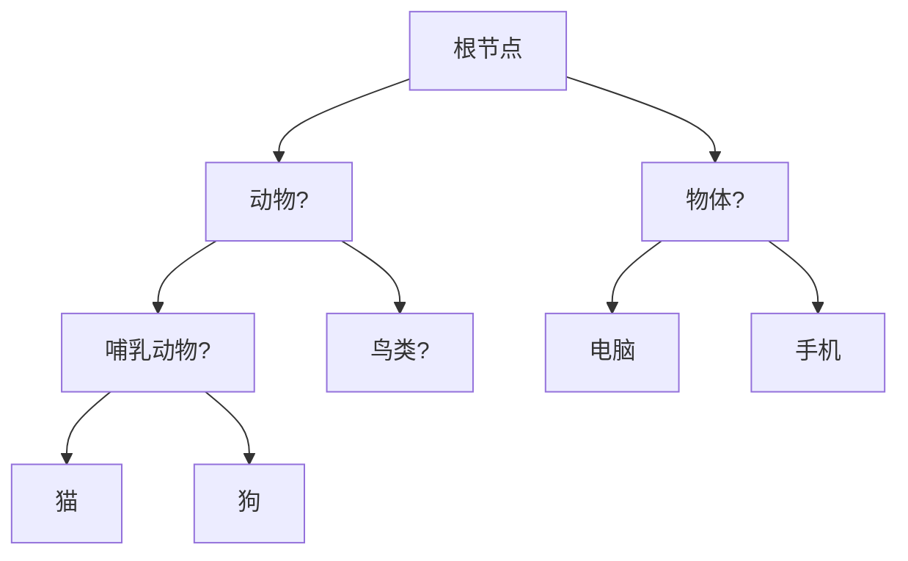

预测"猫"时，只需要计算从根到"猫"路径上的节点概率。

#### 2. 负采样
**思想**：不计算所有词的softmax，而是：
- 优化"正样本"（真实周围词）的概率
- 同时优化少量"负样本"（随机抽样的非周围词）不被选择的概率

> 💡 **大白话**：原来要判断"在全校1万名学生中找出张三个好朋友"，现在改成"确认张三是李四的好朋友，同时确认张三不是随机5个陌生人的好朋友"。

---

## 十一、结果：词向量的神奇特性

### 1. 语义关系保持
词向量空间中，语义相似的词会聚集在一起：

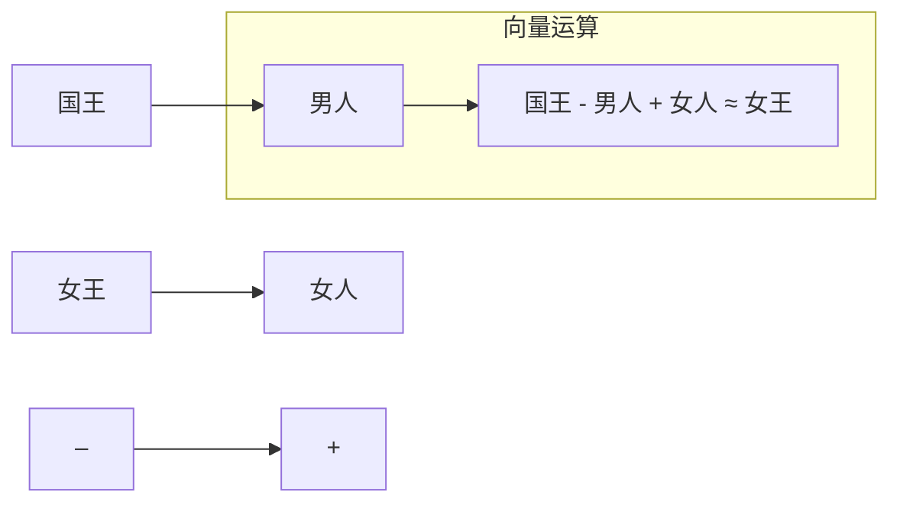

### 2. 类比关系
经典的例子：
- `king - man + woman ≈ queen`
- `Paris - France + Germany ≈ Berlin`

### 3. 聚类效果
PCA降维可视化后，国家、首都、货币等会自动聚类：

```
国家：     中国  日本  德国  法国
          ↓    ↓    ↓    ↓  
首都：     北京  东京  柏林  巴黎
```

### 4. 实际应用例子
从论文中的表格：
- `Czech + currency ≈ koruna`（捷克货币是克朗）
- `Vietnam + capital ≈ Hanoi`（越南首都是河内）
- `German + airlines ≈ Lufthansa`（德国航空公司是汉莎航空）

---

## 总结：词表示的革命意义

word2vec为代表的词向量技术，彻底改变了NLP：
1. **统一表示**：所有词变成统一维度的向量
2. **语义编码**：向量空间中的几何关系对应语义关系
3. **下游任务基石**：成为几乎所有NLP任务的标配输入
4. **可计算**：词义可以用数学运算来表达

> 💡 **最终理解**：词向量就像给每个词赋予了"数学DNA"，计算机终于能真正"理解"词的含义和关系了，而不仅仅是字符串匹配。
---

## 一、问题：从词到句子的表示挑战

### 核心问题：如何把变长的句子变成定长的向量？

**之前的进展**：
- 我们已经学会了把**词**变成向量（word2vec）
- 但现实任务中需要处理的是**句子、段落、文档**

**挑战**：
- 句子长度不固定
- 词序很重要："狗咬人" vs "人咬狗"
- 需要捕捉局部特征和全局语义

> 💡 **大白话**：就像我们有了砖头（词向量），现在要建造房子（句子表示），但每栋房子的设计图纸都不一样。

---

## 二、神经网络进行文本分类

### 1. 卷积神经网络（CNN）用于文本分类

**核心思想**：把文本看作"一维图像"，用卷积核扫描来提取局部特征。

**模型结构**（Yoon Kim, 2014）：

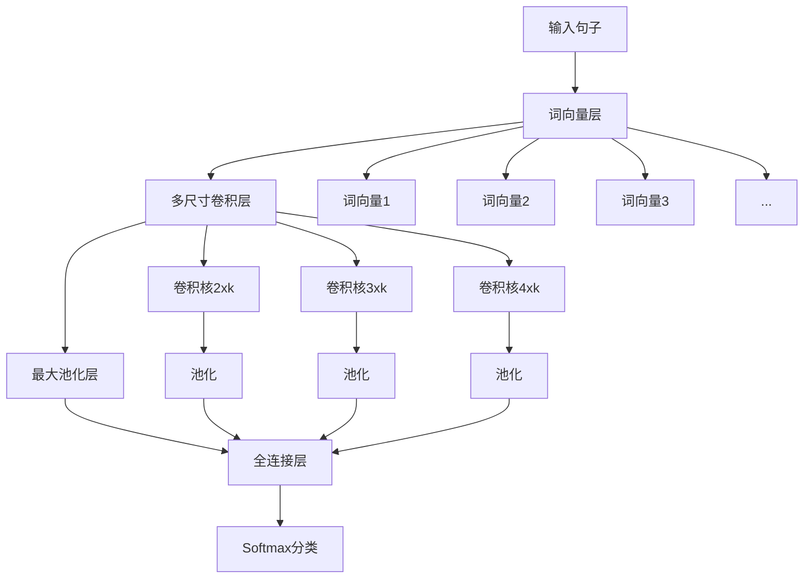

**具体流程**：

1. **输入表示**：
   - 句子：`"wait for the video and do n't rent it"`
   - 每个词变成k维向量，句子变成 $n \times k$ 矩阵

2. **卷积操作**：
   - 使用不同高度的卷积核：2, 3, 4个词
   - 每个卷积核在文本上滑动，检测特定模式
   - 例子：3-gram卷积核可能学到`"very good"`这样的短语特征

3. **最大池化**：
   - 对每个特征图取最大值
   - 保留最显著的特征，忽略位置信息
   - 输出固定长度的向量

4. **分类**：
   - 拼接所有特征，通过全连接层
   - Softmax输出各类别概率

**为什么有效**？
- 卷积：捕捉局部n-gram特征
- 池化：处理变长输入，保留重要信息
- 多尺寸卷积核：捕获不同粒度的特征

> 💡 **类比**：就像用不同大小的渔网在文本中捕捞重要特征，然后把最好的"鱼"留下来做判断。

---

## 三、简单的想法，巨大的影响力

### Yoon Kim (2014) 的贡献

**论文**：《Convolutional Neural Networks for Sentence Classification》

**影响力指标**：
- 被引用**9129次**（截至统计时）
- 开创了CNN在文本分类中的应用
- 方法简单有效，成为baseline

**为什么这么有影响力**？
1. **简单性**：模型结构清晰易懂
2. **有效性**：在多个数据集上达到state-of-the-art
3. **通用性**：可迁移到各种文本分类任务
4. **启发性**：为后续研究开辟了新方向

> 💡 **启示**：有时候最好的创新不是复杂的新结构，而是把已有技术用在合适的新领域。

---

## 四、这个模型有什么问题？

尽管简单有效，但浅层CNN模型存在明显局限：

### 1. 深度不够
- 只有一层卷积+一层池化
- 无法学习深层次的语义组合

### 2. 特征不够多样化
- 每个卷积核只产生一个标量特征
- 全局最大池化丢失了序列信息

### 3. 难以捕获长距离依赖
- 卷积核大小有限（通常2-5个词）
- 无法理解跨越整个句子的关系

### 4. 位置信息丢失
- 最大池化后，特征顺序信息完全丢失
- `"不太好吃"`和`"好吃不太"`可能被判断为相同

**把模型做深的主要困难**：
- 文本的**序列特性**与图像的**空间特性**不同
- 直接堆叠卷积层会导致信息损失
- 需要专门设计来处理变长序列

> 💡 **大白话**：就像只用放大镜看文本的局部，但缺少望远镜看整体结构。

---

## 五、一个更深的模型

### Kalchbrenner et al., 2014 的改进

**核心创新**：

#### 1. K-最大池化
- 不是只保留最大的1个值，而是保留前K个最大值
- 保留了更多的特征信息和相对顺序

**例子**：
- 特征图：[0.8, 0.2, 0.9, 0.1, 0.7]
- 全局最大池化 → 0.9
- 3-最大池化 → [0.9, 0.8, 0.7]

#### 2. 动态时间池化
- 动态调整K的值，适应不同长度的输入
- 保证输出固定尺寸

#### 3. 折叠操作
- 将相邻的特征向量相加
- 一种轻量的降维方式

**模型结构**：
```
输入 → 宽卷积 → 动态K-最大池化 → 折叠 → 宽卷积 → ... → 全连接
```

**优势**：
- 更深：可以堆叠更多层
- 更丰富：保留更多特征信息
- 更灵活：适应不同长度输入

> 💡 **进步**：从"选美冠军"（只要最好的）变成了"选拔团队"（要前K名优秀者）。

---

## 六、RNN进行文本分类

### 循环神经网络的天然优势

**核心思想**：按顺序处理文本，逐步积累信息，最后的状态包含整个序列的信息。

#### Elman RNN 基本结构：

$$h(t) = \sigma_h(W_hx(t) + U_hh(t-1) + b_h)$$
$$y(t) = \sigma_y(W_yh(t) + b_y)$$

**文本分类应用**：

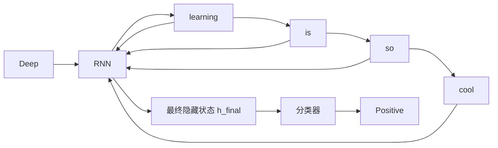

**具体例子**：
- 句子：`"Deep learning is so cool."`
- 逐步处理：
  - `"Deep"` → 隐藏状态h₁
  - `"learning"` → 基于h₁和当前词更新为h₂
  - `"is"` → h₃
  - `"so"` → h₄
  - `"cool."` → h₅（最终状态）
- 用h₅作为整个句子的表示，进行分类

#### 改进版本：

**1. LSTM/GRU**：
- 解决长序列梯度消失问题
- 更好地捕捉长距离依赖

**2. 双向RNN**：
- 同时考虑前向和后向信息
- 更好地理解上下文

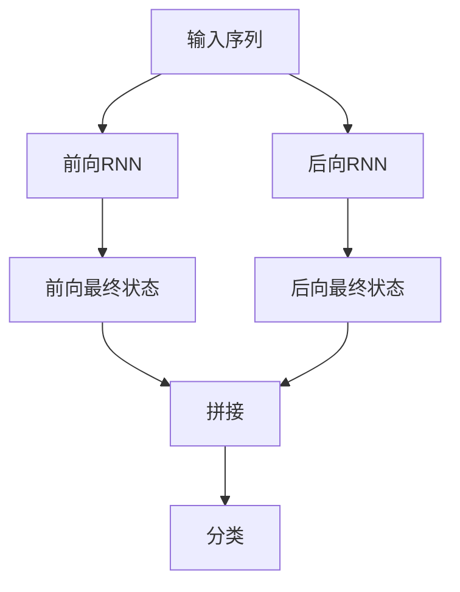

**3. 多层RNN**：
- 堆叠多个RNN层
- 每层学习不同抽象级别的特征

### RNN vs CNN 对比

| 特性 | CNN | RNN |
|------|-----|-----|
| 序列处理 | 并行，局部 | 顺序，全局 |
| 长距离依赖 | 有限 | 较好（尤其LSTM） |
| 位置信息 | 池化后丢失 | 天然保留顺序 |
| 训练速度 | 较快 | 较慢（无法并行） |
| 特征提取 | 局部n-gram | 全局语义 |

**适用场景**：
- **CNN**：关键词、短语重要的任务（情感分析、主题分类）
- **RNN**：语义理解、长文档、需要上下文的任务（机器翻译、文本生成）

---

## 总结：神经网络文本分类的演进

从简单的CNN到复杂的RNN，文本分类技术的发展体现了深度学习在NLP中的成熟：

1. **CNN路线**：从浅层CNN → 深层CNN（K-最大池化）
   - 优势：并行计算、局部特征强
   - 适合：短文本、模式明显的分类

2. **RNN路线**：从简单RNN → LSTM/GRU → 双向/多层
   - 优势：序列建模、长距离依赖
   - 适合：长文本、语义复杂的分类

> 💡 **现状**：现代方法往往结合两者优点，或者使用更强大的Transformer架构。但这些基础模型仍然是理解深度学习文本处理的基石。

这种演进不仅提升了分类准确率，更重要的是让机器能够更好地"理解"人类语言的复杂结构和深层含义。

---

## 一、序列到序列学习

### 核心思想：端到端的序列转换

**是什么**：将一个序列（如法语句子）转换成另一个序列（如英语句子），整个过程端到端学习。

**基本架构**：编码器-解码器框架

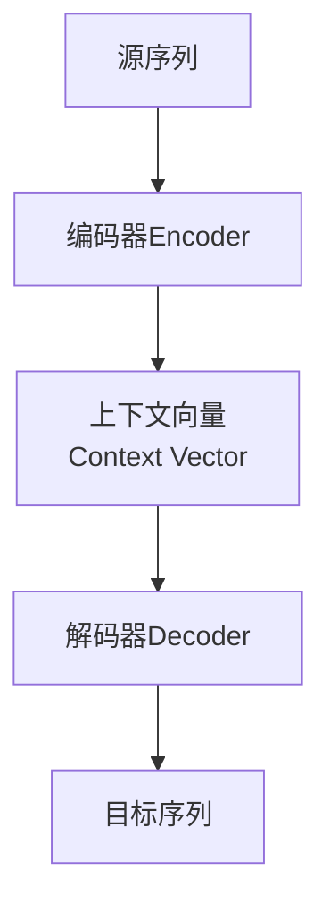

**应用场景**：
- 机器翻译：`法语 → 英语`
- 文本摘要：`长文本 → 短摘要`
- 对话系统：`用户输入 → 系统回复`
- 代码生成：`自然语言 → Python代码`
- 语音识别：`音频序列 → 文本序列`

> 💡 **大白话**：就像一个人先听懂整句法语（编码），然后在脑中转换成英语思路（上下文向量），最后用英语说出来（解码）。

---

## 二、机器翻译

### 神经机器翻译工作流程

**例子**：
- 源语句：`les pauvres sont demunis`（法语）
- 目标语句：`the poor don't have any money`（英语）

**测试时的工作方式**：

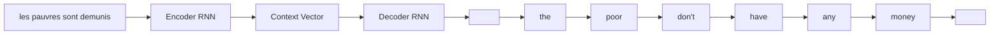

**关键特点**：
- 解码器每一步的输出作为下一步的输入（自回归生成）
- 整个过程基于编码器产生的上下文向量

---

## 三、编码器和解码器

### 编码器
- **输入**：源语言词序列（one-hot或词嵌入）
- **输出**：上下文向量（通常是最后一个隐藏状态）
- **可选**：使用预训练的词向量（如word2vec）

### 解码器  
- **输入**：上下文向量 + 开始标记`<START>`
- **输出**：目标语言词序列
- **表示**：使用one-hot向量表示输出词

### 重要细节：

1. **词表问题**：
   - 机器翻译：编码器解码器词表**不同**
   - 文本摘要/对话：词表**相同**

2. **网络结构**：
   - 编码器和解码器通常是不同的RNN
   - 可以使用深度RNN（多层）
   - 常用LSTM/GRU缓解梯度消失

3. **为什么解码器用one-hot？**
   - 需要在每一步计算所有可能词的概率分布
   - 便于计算交叉熵损失

> 💡 **设计哲学**：编码器负责"理解"，解码器负责"生成"，分工明确。

---

## 四、训练NMT系统

### 训练过程：教师强制

**核心思想**：训练时，解码器的输入是**真实的目标序列**，而不是自己上一步的预测。

**损失函数**：对所有时间步的交叉熵损失求平均

$$J = \frac{1}{T} \sum_{t=1}^{T} J_t = -\frac{1}{T} \sum_{t=1}^{T} \ln p(w_t | w_{<t}, \text{源语句})$$

**图示理解**：
```
源语句: les pauvres sont demunis
解码器输入: <START> the poor don't have any money
解码器应该输出: the poor don't have any money <END>
```

**反向传播**：整个Seq2Seq系统作为一个整体进行端到端训练

> 💡 **训练技巧**：就像教小孩说话，我们先说完整的正确句子，让他模仿，而不是让他自己瞎猜。

---

## 五、瓶颈问题

### 问题的本质

**核心问题**：编码器需要把**整个源语句的所有信息**压缩到一个**固定维度**的上下文向量中。

**就像**：要把一本厚书的所有内容总结成一句话，必然会丢失大量细节。

**具体表现**：
- 长句子翻译质量下降
- 细节信息丢失（如修饰词、语气等）
- 上下文向量"不堪重负"

**架构图示**：
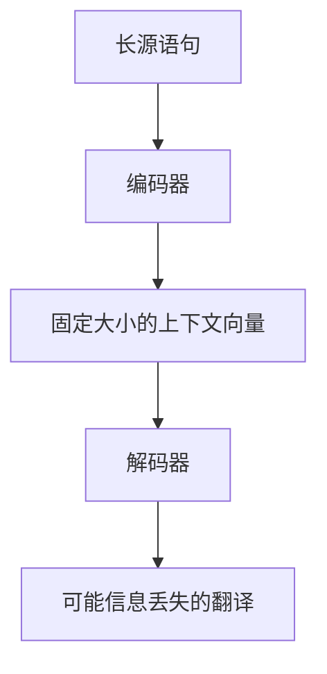

