## 一、两种类型的机器学习模型

### 1. 判别式模型（Discriminative Models）

**通俗理解**：就像是一个**分类专家**，专注于学习"如何区分"不同类别的东西。

**核心思想**：
- 建模条件分布 $P(y|x)$ - 给定数据 $x$ 时，标签 $y$ 的概率
- 直接学习决策边界

**例子**：
- **垃圾邮件分类**：给定一封邮件内容（x），判断是垃圾邮件还是正常邮件（y）
- **手写数字识别**：给定一张手写数字图片，判断是0-9中的哪个数字

**常见模型**：
- 支持向量机（SVM）
- 多层感知器（MLP）
- 卷积神经网络（CNN）

### 2. 生成式模型（Generative Models）

**通俗理解**：就像是**数据世界的创造者**，不仅知道如何区分，还知道每类数据"长什么样"。

**核心思想**：
- 建模数据分布 $P(x)$ - 学习数据本身的分布规律
- 可以生成新的数据样本

**例子**：
- **人脸生成**：学习大量人脸图片的分布后，可以生成不存在的新人脸
- **文本创作**：学习诗歌的规律后，可以自动创作新的诗歌

**常见模型**：
- 受限玻尔兹曼机（RBM）
- 深度信念网络（DBN）
- 生成对抗网络（GAN）

```mermaid
graph TD
    A[机器学习模型] --> B[判别式模型]
    A --> C[生成式模型]
    
    B --> D[学习条件分布 P y|x]
    B --> E[专注于分类边界]
    B --> F[例子: SVM, CNN]
    
    C --> G[学习数据分布 P x]
    C --> H[可以生成新数据]
    C --> I[例子: GAN, VAE]
```

## 二、深度学习生成的数据

**神奇之处**：深度学习生成模型可以创造前所未有的内容！

**实际应用**：
- **AI作诗**：学习古典诗歌规律后生成新诗
- **AI绘画**：根据文字描述生成图像
- **AI作曲**：创作新的音乐旋律

**例子说明**：
```
AI生成的诗句：
"人事要知何处是
工夫唯有一篇诗
智中妙用无穷尽
能使风流在此时"
```

这展示了模型学习了诗歌的韵律、意境和用词习惯。

## 三、概率图模型

### 基本概念

**通俗理解**：用"图"的方式来描述变量之间的依赖关系，就像画一张**关系网**。

**核心组成**：
- **节点**：代表随机变量
- **边**：代表变量之间的关系

### 两种主要类型

#### 1. 有向图模型（贝叶斯网络）
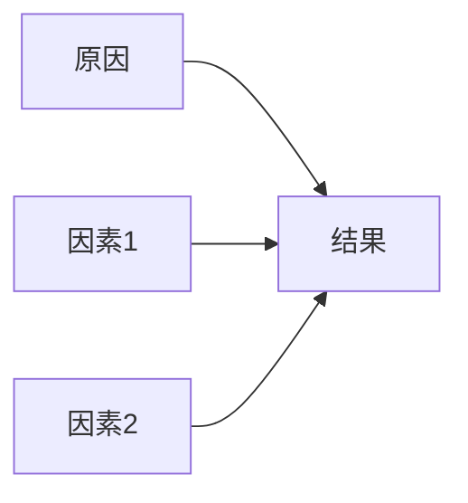

**例子**：疾病诊断
- 节点：症状、疾病、风险因素
- 边：因果关系（吸烟 → 肺癌）

#### 2. 无向图模型（马尔可夫随机场）
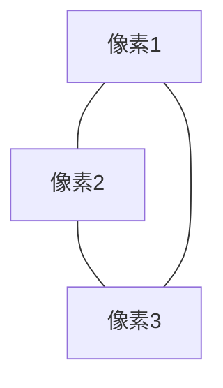

**例子**：图像去噪
- 节点：图像中的每个像素
- 边：相邻像素之间的相关性

## 四、具有随机二值单元的概率图模型

### 玻尔兹曼机（Boltzmann Machine）

**通俗理解**：一个**相互连接的神经元网络**，每个神经元随机地开启或关闭。

**数学表达**：
每个单元 $v_i$ 开启（=1）的概率：
$$P(v_i = 1) = \sigma\left(\sum_j w_{ij}v_j + b_i\right)$$

其中 $\sigma(x) = \frac{1}{1 + e^{-x}}$ 是sigmoid函数。

**现实比喻**：就像一群人在派对上，每个人是否跳舞取决于：
- 朋友是否在跳舞（权重 $w_{ij}$）
- 自己天生爱跳舞的程度（偏置 $b_i$）

### 受限玻尔兹曼机（RBM）

**核心改进**：限制了连接方式，形成**二分图结构**

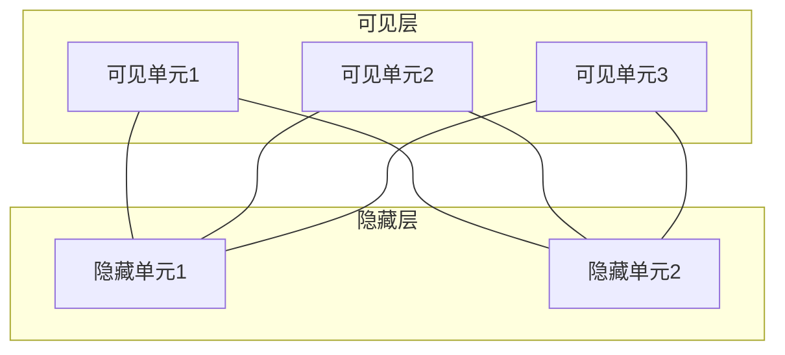

**关键特性**：
- 可见层单元之间不连接
- 隐藏层单元之间不连接
- 只有可见层与隐藏层之间有连接

**条件概率**：
- 给定可见层时，隐藏单元独立：
  $$P(h_j = 1|v) = \sigma\left(\sum_i v_i w_{ij} + c_j\right)$$
- 给定隐藏层时，可见单元独立：
  $$P(v_i = 1|h) = \sigma\left(\sum_j w_{ij} h_j + b_i\right)$$

**例子应用**：
- **手写数字重建**：用RBM学习MNIST数字分布，能够从部分信息重建完整数字

## 五、生成模型的三重任务

### 1. 生成（Generation）
**目标**：从学习到的分布中采样，生成新的数据样本

**例子**：训练好的手写数字生成模型可以画出新的数字

### 2. 推断（Inference）
**目标**：根据观测数据，推断隐藏变量的状态

**例子**：给定一张不完整的手写数字，推断缺失部分应该是什么

### 3. 学习（Learning）
**目标**：调整模型参数，使模型更可能生成训练数据

**学习过程**：通常交替进行推断和生成

### 能量模型视角

**能量函数**：
$$E(v, h) = -v^\top Wh - b^\top v - c^\top h$$

**联合概率**：
$$P(v, h) = \frac{\exp(-E(v, h))}{Z}$$

其中 $Z = \sum_{v, h} \exp(-E(v, h))$ 是配分函数。

**通俗理解**：
- **低能量** = 模型喜欢这种配置（高概率）
- **高能量** = 模型不喜欢这种配置（低概率）

## 六、核心学习算法

### 对比散度（Contrastive Divergence）

**直观理解**：让模型学会区分"真实数据"和"模型幻想"

**学习规则**：
$$\Delta w_{ij} = \epsilon(\langle v_i h_j \rangle_{data} - \langle v_i h_j \rangle_{model})$$

**CD-1算法步骤**：
1. 用训练数据初始化可见层
2. 更新隐藏层（正向传播）
3. 更新可见层（反向传播，得到"重建"）
4. 再次更新隐藏层
5. 用数据和重建的差异更新权重

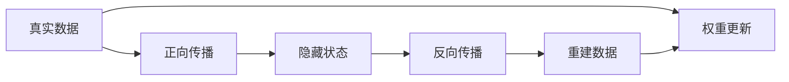

## 总结

生成式模型是深度学习中极其强大的工具，它们不仅能够理解数据的内在结构，还能够创造全新的数据。从简单的玻尔兹曼机到复杂的生成对抗网络，这些模型在不同领域都有着广泛的应用。

**关键收获**：
- 生成模型学习数据的**分布规律**，而不只是分类边界
- 概率图模型提供了描述变量关系的强大框架
- RBM等模型通过能量函数来建模概率分布
- 对比散度等算法让训练变得可行

# 受限玻尔兹曼机（RBM）深入讲解

## 一、从玻尔兹曼机到受限玻尔兹曼机

### 玻尔兹曼机（Boltzmann Machine）

**通俗理解**：就像一个**完全连接的社会网络**，每个人都可以直接影响其他人。

**结构特点**：
- 所有单元（神经元）之间都有连接
- 既是输入又是输出，没有明确的层次结构

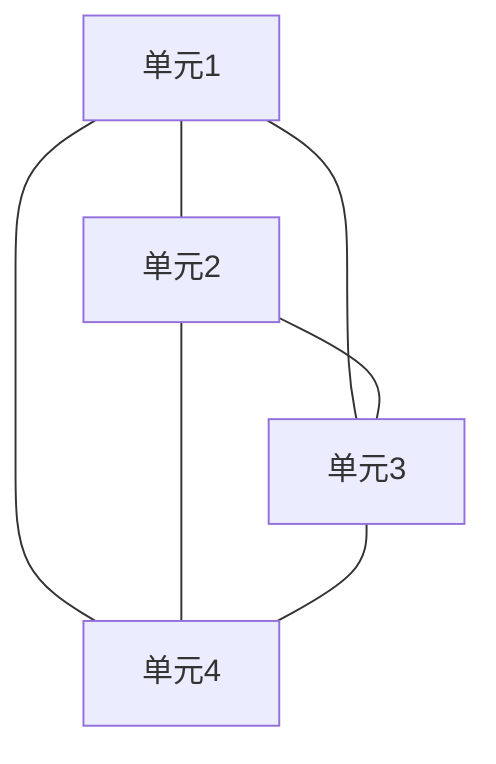

**问题**：训练极其困难！因为：
- 连接太多，计算复杂度高
- 需要大量的采样步骤才能收敛

### 受限玻尔兹曼机（RBM）的革命性改进

**核心创新**：**限制连接**，形成清晰的二分图结构

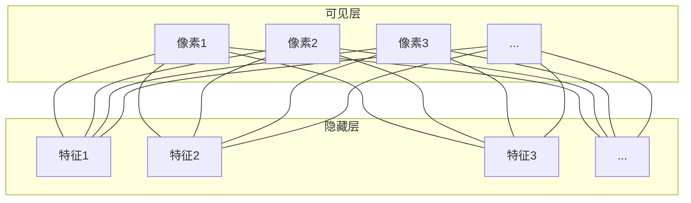

**关键特性**：
- 🚫 **层内无连接**：可见单元之间不连接，隐藏单元之间不连接
- ✅ **层间全连接**：每个可见单元连接到所有隐藏单元
- 🔄 **双向对称**：权重是对称的（$w_{ij} = w_{ji}$）

## 二、能量模型：RBM的"价值观系统"

### 能量函数

$$E(v, h) = -v^\top Wh - b^\top v - c^\top h$$

**展开形式**：
$$E(v, h) = -\sum_{i}\sum_{j} v_i w_{ij} h_j - \sum_{i} b_i v_i - \sum_{j} c_j h_j$$

**通俗理解**：
- **低能量** = "喜欢"这种配置 = 高概率
- **高能量** = "不喜欢"这种配置 = 低概率

**例子比喻**：
想象一个**社交派对**：
- $v_i$：客人的行为（可见）
- $h_j$：客人的心情（隐藏）
- $w_{ij}$：行为对心情的影响权重
- $b_i$：客人天生倾向于某种行为
- $c_j$：客人生来的性格基调

### 概率分布

**联合概率**：
$$P(v, h) = \frac{\exp(-E(v, h))}{Z}$$

**配分函数**：
$$Z = \sum_{v, h} \exp(-E(v, h))$$

**数据概率**（边缘分布）：
$$P(v) = \sum_h P(v, h) = \frac{1}{Z} \sum_h \exp(-E(v, h))$$

## 三、最大化数据对数似然

### 目标函数

我们希望模型生成的分布 $P_{model}(v)$ 尽可能接近真实数据分布 $P_{data}(v)$。

**最大似然估计**：
$$\max \langle \ln P[v] \rangle_{data}$$

其中 $\langle \cdot \rangle$ 表示对所有训练样本取平均。

### 梯度计算

**权重梯度**：
$$\frac{\partial \ln P[v]}{\partial w_{ij}} = \langle v_i h_j \rangle_{data} - \langle v_i h_j \rangle_{model}$$

**偏置梯度**：
$$\frac{\partial \ln P[v]}{\partial b_i} = \langle v_i \rangle_{data} - \langle v_i \rangle_{model}$$
$$\frac{\partial \ln P[v]}{\partial c_j} = \langle h_j \rangle_{data} - \langle h_j \rangle_{model}$$

**直观理解**：
- **正相位**：让模型记住数据中的模式
- **负相位**：让模型忘记自己幻想出来的模式

## 四、Gibbs采样：RBM的"想象力"

### 为什么要采样？

计算 $\langle \cdot \rangle_{model}$ 需要在整个状态空间求和，计算量巨大！Gibbs采样提供了一种近似方法。

### 块状Gibbs采样

由于RBM的二分图结构，我们可以**同时采样整个层**！

**采样过程**：
```mermaid
graph LR
    A[可见层v⁽ᵗ⁾] -->|P h|v | B[隐藏层h⁽ᵗ⁾]
    B -->|P v|h | C[可见层v⁽ᵗ⁺¹⁾]
    C -->|P h|v | D[隐藏层h⁽ᵗ⁺¹⁾]
```

**具体公式**：
$$P(h_j = 1|v) = \sigma\left(\sum_i v_i w_{ij} + c_j\right)$$
$$P(v_i = 1|h) = \sigma\left(\sum_j w_{ij} h_j + b_i\right)$$

**例子**：手写数字识别
- 给定数字"2"的图片（v），采样得到隐藏特征（h）
- 从隐藏特征再采样，应该能重建出"2"的图片

## 五、对比散度（CD）学习：实用的训练方法

### 问题：传统采样太慢！

需要采样直到收敛（$t \to \infty$），这在实际中不可行。

### 解决方案：对比散度（CD-k）

**核心思想**：只进行**k步**Gibbs采样，而不是等到收敛。

**CD-1算法**（最常用）：
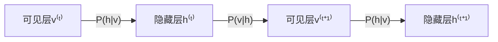

**更新规则**：
$$\Delta w_{ij} = \epsilon(\langle v_i h_j \rangle^0 - \langle v_i h_j \rangle^1)$$
$$\Delta b_i = \epsilon(\langle v_i \rangle^0 - \langle v_i \rangle^1)$$
$$\Delta c_j = \epsilon(\langle h_j \rangle^0 - \langle h_j \rangle^1)$$

**为什么有效**：
- 虽然不是精确梯度，但在实践中效果很好
- 计算效率大大提高

## 六、学习图示：RBM的"学习过程可视化"

### 权重更新可视化

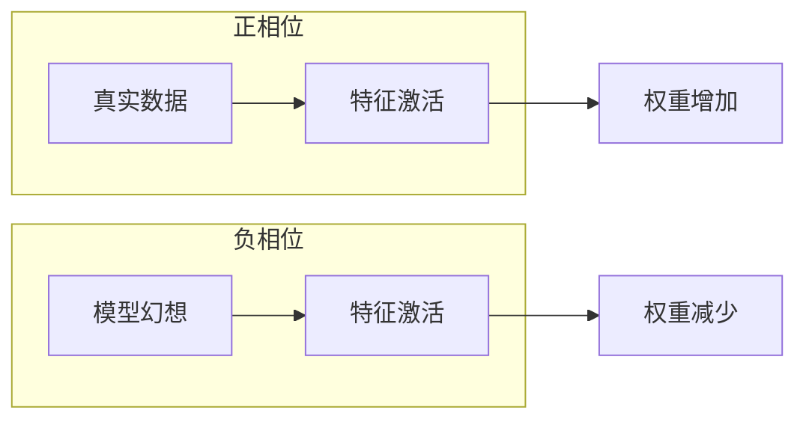

**具体过程**：
1. **t=0**（数据）：输入真实数据，计算隐藏层激活
2. **t=1**（重建）：从隐藏层重建可见层
3. **t=2,3,...**：继续Gibbs采样
4. **t=∞**（幻想）：模型收敛后的状态

**权重更新**：
$$w_{ij} = w_{ij} + \epsilon(\langle h_j v_i \rangle^0 - \langle h_j v_i \rangle^\infty)$$

## 七、MNIST上的例子：实战演示

### 实验设置

**数据**：MNIST手写数字（16×16像素 = 256个可见单元）
**模型**：50个隐藏单元的RBM
**训练**：仅使用数字"2"的图片

### 重建结果

```
原始数据：    [2] [2] [2] [2] [2]
重建结果：    [2] [2] [2] [2] [2]
```

**惊人发现**：
- 即使从**部分激活的隐藏特征**，也能重建出完整的数字
- 模型学会了数字"2"的**本质特征**

### 隐藏单元的可视化

每个隐藏单元学习到了不同的笔画特征：
- 单元1：识别左上角的弯钩
- 单元2：识别底部的横线
- 单元3：识别中间的弧线
- ...

### 生成新样本

通过从随机隐藏状态开始Gibbs采样，可以生成新的"2"的数字图片！

## 总结：RBM的核心价值

### 🎯 **特征学习**
RBM的隐藏层自动学习数据的重要特征，无需人工设计特征。

### 🔄 **双向推理**
既可以从可见层推断隐藏特征，也可以从隐藏特征生成可见数据。

### 🧩 **模块化构建**
RBM可以堆叠形成深度信念网络（DBN），是深度学习的重要基础。

### 💡 **理论优美**
基于能量模型和统计物理的理论基础，数学上很优雅。

**关键公式回顾**：
- 能量函数：$E(v, h) = -v^\top Wh - b^\top v - c^\top h$
- 条件概率：$P(h_j=1|v) = \sigma(\sum_i v_i w_{ij} + c_j)$
- 学习规则：$\Delta w_{ij} = \epsilon(\langle v_i h_j \rangle_{data} - \langle v_i h_j \rangle_{model})$

RBM虽然现在被更现代的生成模型取代，但它提出的**能量模型**、**对比散度训练**等思想对后续研究产生了深远影响！

# 深度信念网络（DBN）深入讲解

## 一、动机：为什么需要深度信念网络？

### 各模型的局限性

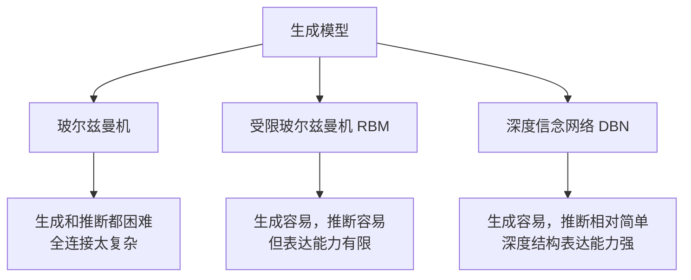

**具体分析**：

#### 1. 玻尔兹曼机的问题
- **全连接**：所有单元都相互连接
- **计算复杂**：训练和推断都需要大量计算
- **难以收敛**：参数空间太大

#### 2. RBM的优势与局限
- ✅ **优势**：层内无连接，训练相对容易
- ❌ **局限**：单层结构，表达能力有限
- ❌ **局限**：无法学习层次化特征

#### 3. DBN的解决方案
> "我们可以用深度概率图模型来解决这个问题！"

## 二、深度信念网络（DBN）的学习

### 核心思想：逐层贪婪预训练

**通俗理解**：就像**盖楼房**，一层一层地建，每层都建稳固了再建下一层。

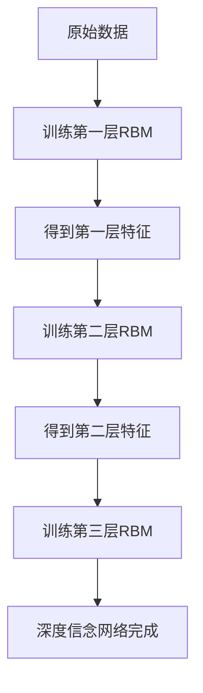

### 具体训练步骤

#### 步骤1：训练第一层RBM
- **输入**：原始像素数据
- **输出**：第一层隐藏特征
- **目标**：学习数据的基本特征

**例子**：手写数字识别
- 输入：28×28像素 = 784个可见单元
- 输出：500个隐藏单元（学习到边缘、笔画等低级特征）

#### 步骤2：训练第二层RBM
- **输入**：第一层隐藏特征的激活概率
- **输出**：第二层隐藏特征
- **目标**：学习更抽象的特征组合

**例子**：手写数字识别
- 输入：500个第一层特征
- 输出：500个第二层特征（学习到笔画组合、局部形状）

#### 步骤3：训练第三层RBM
- **输入**：第二层隐藏特征的激活概率
- **输出**：第三层隐藏特征
- **目标**：学习高级语义特征

**例子**：手写数字识别
- 输入：500个第二层特征
- 输出：200个第三层特征（学习到数字的整体结构）

### 数学保证：变分下界

**关键定理**：每次添加一层时，都会提高训练数据对数概率的**变分下界**。

**通俗理解**：
- 每加一层，模型对数据的描述能力都变强
- 就像用更复杂的语言描述同一件事，可以描述得更精确

**数学表达**：
$$\ln P(data) \geq \mathcal{L}(q) + \text{常数}$$

其中 $\mathcal{L}(q)$ 是证据下界（ELBO），随着层数增加而提高。

## 三、深度信念网络的生成过程

### 混合系统结构

DBN实际上是**RBM**和**有向信念网络**的混合体：

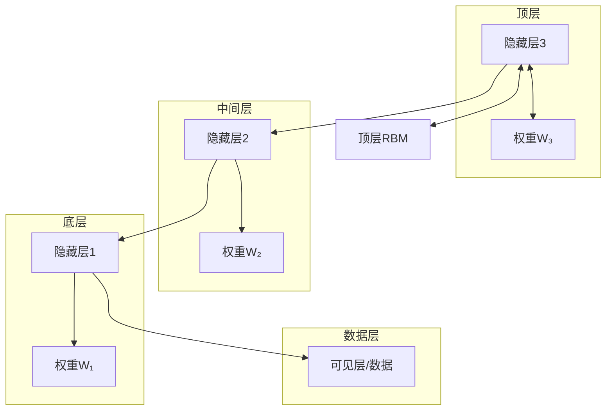

**关键特点**：
- **最顶层**：无向图（RBM）
- **下面各层**：有向图（信念网络）
- **生成过程**：自上而下

### 生成数据的具体过程

#### 阶段1：从顶层RBM采样
```python
# 伪代码示例
def sample_top_rbm():
    # 通过Gibbs采样从顶层RBM获取无偏样本
    for t in range(1000):  # 长时间运行确保收敛
        h3 = sample_from_P(h3 | h2)  # 更新隐藏层
        h2 = sample_from_P(h2 | h3)  # 更新"可见"层
    return h3, h2
```

**为什么需要长时间采样**？
- 确保从RBM的平稳分布中采样
- 得到真正有代表性的样本

#### 阶段2：自上而下生成
```python
def top_down_generation(h3):
    # 从顶层开始，逐层向下生成
    h2 = sample_from_P(h2 | h3)      # 第三层 → 第二层
    h1 = sample_from_P(h1 | h2)      # 第二层 → 第一层
    v = sample_from_P(v | h1)        # 第一层 → 可见层
    return v
```

**条件概率公式**：
$$P(h_2 | h_3) = \sigma(W_3 h_3 + b_2)$$
$$P(h_1 | h_2) = \sigma(W_2 h_2 + b_1)$$
$$P(v | h_1) = \sigma(W_1 h_1 + b_0)$$

### 生成过程实例

**例子**：生成手写数字"8"
1. **顶层RBM**：采样得到"数字8"的高级概念
2. **第三层→第二层**：生成数字8的总体结构特征
3. **第二层→第一层**：生成笔画组合和局部形状
4. **第一层→像素层**：生成具体的像素图像

## 四、与其他模型整合

### 为什么需要整合？

**DBN的本质**：无监督生成模型
- ✅ 擅长学习数据的内在结构
- ❌ 不直接面向具体任务

**解决方案**：与判别模型结合，实现**无监督预训练 + 有监督微调**

### 分类任务整合

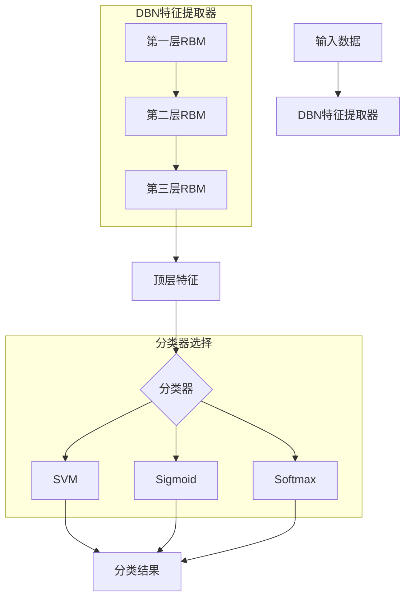

#### 具体整合方式

**方法1：特征提取 + 独立分类器**
```python
# 步骤1：用DBN提取特征
features = dbn.extract_features(training_data)

# 步骤2：用SVM等分类器训练
svm_classifier = SVM().fit(features, labels)

# 步骤3：预测
test_features = dbn.extract_features(test_data)
predictions = svm_classifier.predict(test_features)
```

**方法2：端到端微调**
```python
# 步骤1：DBN预训练（无监督）
dbn.pretrain(training_data)

# 步骤2：添加分类层
dbn_with_classifier = dbn.add_classification_layer(num_classes=10)

# 步骤3：有监督微调（反向传播）
dbn_with_classifier.fine_tune(training_data, labels)
```

### 优势：迁移学习

**预训练权重的价值**：
- DBN在大量无标签数据上预训练
- 学到的特征具有很好的泛化能力
- 即使有标签数据很少，也能取得好效果

**例子**：
- 在ImageNet上预训练的DBN
- 迁移到医疗影像分类任务
- 只需要少量医疗影像标签数据

## 五、语音识别中的应用突破

### 传统方法 vs DBN方法

#### 传统方法：CD-GMM-HMM
- **GMM**（高斯混合模型）：建模语音特征的分布
- **HMM**（隐马尔可夫模型）：建模语音的时间序列结构
- **问题**：特征表示能力有限

#### 深度学习方法：CD-DNN-HMM
- **DBN预训练的DNN**：替换GMM进行特征提取
- **HMM**：仍然建模时间序列结构
- **突破**：深度特征大大提升了性能

### 关键技术细节

#### 训练准则
1. **最大似然（ML）准则**：传统方法
2. **最小音素错误率（MPE）准则**：直接优化识别准确率

#### 实验结果
| 方法 | 准确率提升 |
|------|------------|
| CD-GMM-HMM (基线) | 0% |
| CD-DNN-HMM (ML准则) | +5.8% |
| CD-DNN-HMM (MPE准则) | +9.2% |

**意义**：这是深度学习在语音识别领域的**里程碑式突破**！

### 系统架构

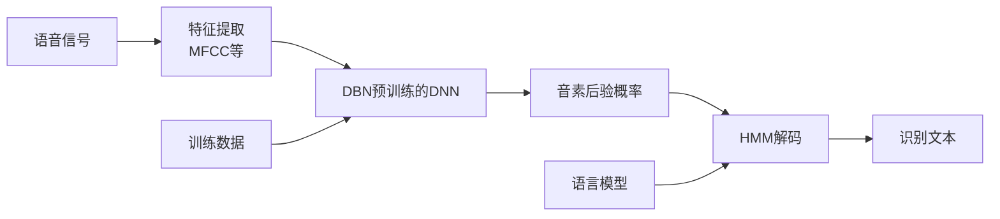

### 为什么DBN在语音识别中有效？

#### 1. 层次化特征学习
- **低层**：学习语音的频谱特征
- **中层**：学习音素的基本单元
- **高层**：学习音素组合和上下文信息

#### 2. 鲁棒性
- DBN学到的特征对噪声、说话人变化等不敏感
- 比手工设计的特征更稳定

#### 3. 数据效率
- 可以先在大量无标签语音数据上预训练
- 然后用少量有标签数据微调

## 总结：DBN的历史地位

### 🎯 **核心贡献**
- 提出了**深度神经网络的有效训练方法**
- 证明了**无监督预训练**的价值
- 开启了**深度学习在工业界的成功应用**

### 🔄 **工作流程回顾**
1. **逐层贪婪预训练**：用RBM一层层构建深度网络
2. **生成采样**：从顶层RBM开始，自上而下生成数据
3. **判别任务整合**：添加分类层，进行有监督微调
4. **实际应用**：在语音识别、图像识别等领域取得突破

### 💡 **历史意义**
DBN虽然现在被更简单的端到端方法取代，但它：
- 解决了深度网络训练的难题
- 证明了深度学习的实用性
- 为后续研究（如GAN、VAE）奠定了基础

**关键启示**：有时候，通过巧妙的**分层训练策略**，可以解决端到端训练难以收敛的问题！

# 生成对抗网络（GAN）全面深入讲解

## 一、动机：GAN的革命性思想

### 传统生成模型的困境

**问题**：如何衡量生成数据与真实数据的相似性？

传统方法：
- 最小化 $P_{data}(x)$ 和 $P_{gen}(x)$ 之间的KL散度
- 最大化似然 $P_{gen}(x)$
- 为 $P_{gen}(x)$ 预设数学形式（如高斯分布）

**局限**：
- 需要很强的分布假设
- 复杂真实数据分布难以用简单数学形式描述

### GAN的突破性解决方案

> "与其预设分布，不如训练一个神经网络来评判生成质量！"

**核心思想**：让两个神经网络相互博弈、共同进步

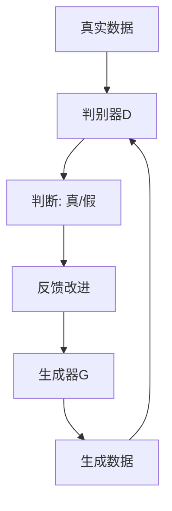

## 二、生成对抗网络(GAN)基本架构

### 网络结构

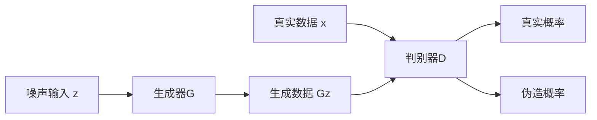

### 角色分工

#### 生成器G（造假者）
- **输入**：随机噪声 $z \sim p_z(z)$
- **输出**：生成数据 $G(z)$
- **目标**：让生成数据尽可能像真实数据

#### 判别器D（鉴定专家）
- **输入**：真实数据 $x \sim p_{data}(x)$ 或生成数据 $G(z)$
- **输出**：输入是真实数据的概率 $D(x) \in [0,1]$
- **目标**：准确区分真实数据和生成数据

### 对抗过程形象化

**警察与小偷的比喻**：
- **判别器D**：像警察，学习识别假币
- **生成器G**：像造假者，学习制造更逼真的假币
- 两者在博弈中共同进步！

## 三、Minimax两人游戏

### 目标函数推导

#### 判别器D的目标
- 对真实数据 $x \sim p_{data}$：$D(x)$ 应该大
- 对生成数据 $G(z)$：$D(G(z))$ 应该小

**数学表达**：
$$\max_D V(D,G) = \mathbb{E}_{x \sim p_{data}}[\log D(x)] + \mathbb{E}_{z \sim p_z}[\log(1 - D(G(z)))]$$

#### 生成器G的目标
让判别器对生成数据判断错误：
$$\min_G V(D,G) = \mathbb{E}_{z \sim p_z}[\log(1 - D(G(z)))]$$

### 统一的Minimax目标

$$\min_G \max_D V(D,G) = \mathbb{E}_{x \sim p_{data}}[\log D(x)] + \mathbb{E}_{z \sim p_z}[\log(1 - D(G(z)))]$$

**直观理解**：
- 判别器D想**最大化**这个函数
- 生成器G想**最小化**这个函数

## 四、训练算法

### 随机梯度下降训练流程

```python
for 训练轮数 do:
    # 训练判别器k次（通常k=1）
    for k步 do:
        # 采样小批量
        噪声样本 {z¹, ..., zᵐ} ∼ p_z(z)
        真实样本 {x¹, ..., xᵐ} ∼ p_data(x)
        
        # 更新判别器（梯度上升）
        ∇θ_d ← 1/m ∑[log D(xⁱ) + log(1 - D(G(zⁱ)))]
        θ_d ← θ_d + ε·∇θ_d
    end for
    
    # 训练生成器
    噪声样本 {z¹, ..., zᵐ} ∼ p_z(z)
    
    # 更新生成器（梯度下降）
    ∇θ_g ← 1/m ∑[log(1 - D(G(zⁱ)))]  # 或使用 -log D(G(zⁱ))
    θ_g ← θ_g - ε·∇θ_g
end for
```

### 训练技巧

**实际改进**：生成器使用 $-log D(G(z))$ 而不是 $log(1 - D(G(z)))$

**原因**：在训练初期，$D(G(z))$ 很小，$log(1 - D(G(z)))$ 梯度饱和，训练缓慢。

## 五、学习过程实例

### 训练动态可视化

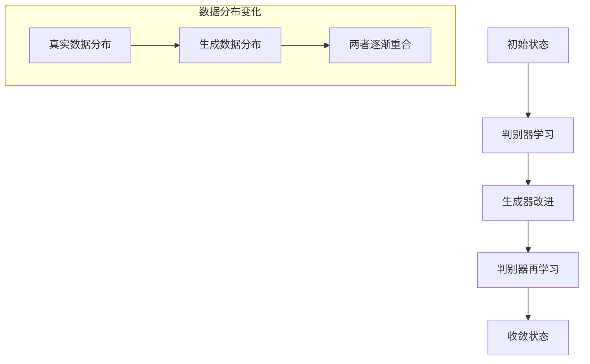

**具体阶段**：

1. **初始**：生成数据分布与真实分布差异大
2. **判别器学习**：快速学会区分真假
3. **生成器改进**：生成更逼真的数据
4. **交替进步**：两者能力同步提升
5. **收敛**：生成数据分布 ≈ 真实数据分布

## 六、理论结果

### 全局最优解

**定理**：当且仅当 $p_g = p_{data}$ 时，达到全局最优。

**证明思路**：
对于固定G，最优判别器为：
$$D^*(x) = \frac{p_{data}(x)}{p_{data}(x) + p_g(x)}$$

代入目标函数：
$$C(G) = \max_D V(G,D) = -\log(4) + 2 \cdot JSD(p_{data} \| p_g)$$

其中JSD是Jensen-Shannon散度，当 $p_{data} = p_g$ 时最小为0。

### 实践意义

- 理论上保证能够学习到真实数据分布
- 实际中由于网络容量和训练限制，只能近似

## 七、条件GAN

### 动机：控制生成过程

**问题**：基础GAN生成随机，无法控制内容
**解决方案**：为D和G引入条件变量 $y$

### 网络结构

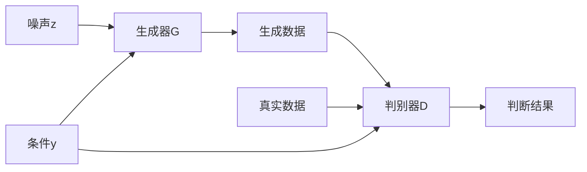

### 目标函数

$$\min_G \max_D V(D,G) = \mathbb{E}_{x \sim p_{data}}[\log D(x|y)] + \mathbb{E}_{z \sim p_z}[\log(1 - D(G(z|y)))]$$

### 应用实例

**控制生成数字**：
- 条件 $y$ = 数字标签（0-9）
- 可以指定生成特定数字
- 在MNIST上展示条件生成效果

## 八、MNIST上的实验

### 网络架构

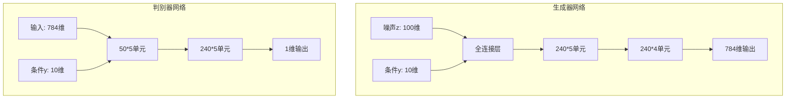

### 实验结果

- **无条件生成**：可以生成各种手写数字
- **条件生成**：每行对应一个数字标签，生成特定数字
- **质量评估**：生成数字与真实数字视觉上难以区分

## 九、为什么不用CNN？→ DCGAN的诞生

### 全连接网络的局限

- 参数量大
- 空间结构信息利用不充分
- 生成图像模糊、质量不高

### 解决方案：深度卷积GAN（DCGAN）

**核心创新**：将CNN引入GAN的生成器和判别器

## 十、深度卷积GAN（DCGAN）

### 网络架构改进

```mermaid
graph TD
    subgraph 生成器
        A[噪声z 100维] --> B[全连接]
        B --> C[重塑为4x4x1024]
        C --> D[转置卷积x4]
        D --> E[64x64x3输出]
    end
    
    subgraph 判别器
        F[输入图像] --> G[卷积层x4]
        G --> H[全连接]
        H --> I[真/假判断]
    end
```

### 主要技巧

1. **替换池化层**：
   - 判别器：带步长卷积
   - 生成器：分数步长卷积（转置卷积）

2. **批归一化**：
   - 生成器和判别器都使用BatchNorm
   - 稳定训练，改善梯度流

3. **移除全连接隐藏层**：
   - 实现更深架构
   - 减少参数数量

4. **激活函数**：
   - 生成器：输出层用Tanh，其他用ReLU
   - 判别器：所有层用LeakyReLU

## 十一、LSUN上的实验

### 实验设置
- **数据集**：LSUN卧室场景
- **分辨率**：64×64像素
- **训练**：5个epoch

### 结果
- 生成的卧室图像细节丰富
- 包含床、窗户、家具等合理布局
- 证明DCGAN处理复杂场景的能力

## 十二、在隐空间行走

### 概念：隐空间插值

**方法**：在两个随机噪声向量 $z_1$ 和 $z_2$ 之间线性插值

```python
def interpolate_generation(z1, z2, steps=10):
    for alpha in np.linspace(0, 1, steps):
        z = alpha * z1 + (1 - alpha) * z2
        image = generator(z)
        display(image)
```

### 发现
- 生成图像在语义空间平滑过渡
- 证明隐空间学习到了有意义的表示
- 可用于图像编辑和风格转换

## 十三、人脸样本的向量算法

### 语义算术运算

在隐空间中进行向量运算，对应语义变化：

```
微笑女人 = 中性女人 + (微笑男人 - 中性男人)
```

```mermaid
graph LR
    A[中性女人] --> B[向量运算]
    C[微笑男人] --> D[中性男人]
    D --> E[微笑向量]
    B --> F[微笑女人]
    E --> B
```

### 具体应用
- **添加微笑**：中性人脸 + 微笑向量
- **添加眼镜**：无眼镜人脸 + 眼镜向量
- **性别转换**：通过向量运算改变性别特征

## 十四、像素空间中的向量算法

### 对比分析

**隐空间运算**：
- 在噪声向量空间进行算术
- 语义明确，效果自然
- 是GAN的真正优势

**像素空间运算**：
- 直接在图像像素上运算
- 通常效果较差，产生伪影
- 如：平均两张人脸得到模糊结果

## 十五、总结

### GAN的核心贡献

1. **新的训练范式**：对抗训练代替最大似然
2. **无需预设分布**：通过判别器自动学习分布
3. **高质量生成**：特别是DCGAN之后
4. **隐空间发现**：学习到有意义的表示空间

### 技术演进

```mermaid
timeline
    title GAN技术发展 timeline
    2014 : 原始GAN提出
    2014 : 条件GAN
    2015 : DCGAN
    2017 : CycleGAN
    2018 : StyleGAN
```

### 应用领域
- 图像生成与编辑
- 风格迁移
- 数据增强
- 艺术创作

## 十六、主要参考文献

1. **Goodfellow et al. (2014)** - Generative Adversarial Nets
   - GAN的开山之作，提出基本框架

2. **Mirza & Osindero (2014)** - Conditional GAN
   - 引入条件生成，增强控制能力

3. **Radford et al. (2016)** - DCGAN
   - 将CNN引入GAN，大幅提升生成质量

4. **Hinton et al. (2006)** - Deep Belief Nets
   - 为深度生成模型奠定基础

## 十七、延伸阅读

### 重要进展

1. **CycleGAN (Zhu et al., 2017)**
   - 无配对图像到图像翻译
   - 应用：马→斑马，夏季→冬季

2. **BigGAN (Brock et al., 2018)**
   - 大规模GAN训练
   - 生成高分辨率、高质量图像

3. **StyleGAN (Karras et al., 2019)**
   - 更精细的风格控制
   - 生成逼真人脸

### 当前挑战
- 训练稳定性
- 模式崩溃问题
- 评估指标
- 伦理问题（深度伪造）

GAN开启了生成模型的新时代，其"对抗训练"的思想深远影响了整个深度学习领域！