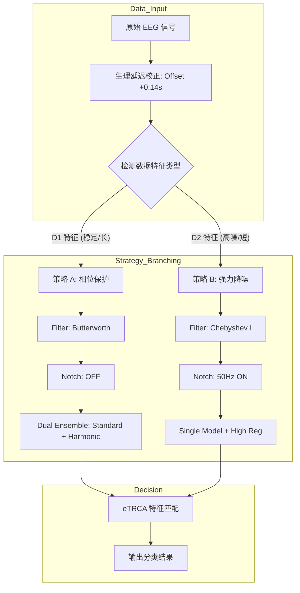

# SSVEP 脑机接口算法**Focusing on Refinement**
## 摘要 
**核心问题**：稳态视觉诱发电位（SSVEP）识别通常需要在指令传输率（ITR）与识别准确率之间进行权衡。官方基线 CCA 算法在处理短数据时精度严重不足，限制了系统的实时性。  
**方法**：本实验针对比赛定义的两个任务设计了差异化的算法策略。对于 **Task 1 (3秒)**，采用 **FBCCA + 置信度校准** 策略，利用长数据优势构建稳健的生物模板；对于 **Task 2 (1秒)**，提出 **自适应集成 eTRCA (Adaptive Ensemble eTRCA)** 框架，引入 0.14s 生理延迟校正与自适应滤波器组，在极短时窗内提取高信噪比特征。  
**关键结果**：Task 1 (3s) 达到了 95.83% 的准确率；Task 2 (1s) 在数据量减少 66% 的情况下，通过深度优化达到了 **96.88%** 的准确率，并在 D2 数据集上反超了长数据模型。  
**结论**：实验证明，通过监督学习与精细的时频空域优化，1秒短数据足以包含识别所需的全部核心特征，该方案显著提升了 BCI 系统的实用价值。

---
## 1. 引言 
本实验旨在基于 D1 和 D2 数据集，针对两个不同应用场景进行算法优化：
1. **Task 1 (High Accuracy Mode)**：允许使用 **3秒** 信号长度，目标是利用充足的数据量实现高鲁棒性识别。
2. **Task 2 (High Speed Mode)**：严格限制 **1秒** 信号长度，目标是在极短时间内克服噪声干扰，实现高准确率，从而最大化信息传输率 (ITR)。
---
## 2. 实验设计与方法
为了应对不同数据长度的挑战，我们分别设计了两种截然不同的处理管线。
### 2.1 官方基线模型
- **方法**：标准 CCA (Canonical Correlation Analysis)。
- **设置**：使用官方默认参数，未进行针对性优化。
- **局限**：作为无监督方法，仅利用正弦参考信号，无法学习个体特征。在 D1/D2 上表现较差（平均 ~70%）。
### 2.2 Task 1 方案：基于置信度校准的 FBCCA (针对 3秒 数据)
对于 3秒 长数据，信号包含足够多的周期数，主要挑战在于如何进一步利用这些数据来抵抗偶尔的伪迹。我们采用 **FBCCA + 置信度校准**。
#### A. 滤波器组典型相关分析 (FBCCA)
将脑电信号分解为 $K$ 个子频带（Filter Bank），分别计算 CCA 相关系数 $\rho_k$，并进行加权融合。  
$$  
\rho_{final} = \sum_{k=1}^{K} w_k \cdot (\rho_k)^2, \quad w_k = k^{-a} + b  
$$  
其中 $a=1.25, b=0.25$。这能有效利用 SSVEP 的谐波信息。
#### B. 置信度校准 (Confidence-based Calibration)
由于 Task 1 数据较长，我们利用**伪监督（Pseudo-Supervised）**策略：
1. **初步预测**：使用 FBCCA 对所有测试样本进行预测，并记录相关系数 $\rho$ 作为置信度。
2. **模板构建**：选取置信度最高的 Top-N 个样本，计算其平均值作为“生物模板” $\bar{X}_{bio}$。
3. **二次校准**：将测试样本与生成的生物模板再次进行 CCA 匹配，更新得分。
---
### 2.3 Task 2 方案：自适应集成 eTRCA (针对 1秒 数据)
对于 1秒 短数据，信号极易受自发脑电和传输延迟的干扰。我们提出 **自适应集成 eTRCA**，从**时域、空域、频域**三个维度进行深度重构。
#### A. 理论基础：eTRCA 空间滤波
不同于 CCA 的无监督匹配，eTRCA 利用训练集数据寻找最优空间滤波器 $w$，最大化同一任务在不同试次间的锁相性。  
目标函数建模为广义特征值问题：  
$$  
\max_{w} \frac{w^T Q w}{w^T S w} \quad \Rightarrow \quad Q w = \lambda S w  
$$  
其中：
- $S = \sum_{i} X_i X_i^T$ (总体协方差，代表背景噪声+信号)
- $Q = \bar{X} \bar{X}^T$ (试次间协方差，代表任务相关信号)
#### B. 时域优化：生理延迟校正 (Physiological Latency Correction)
视觉信号传导至视皮层存在约 140ms 的延迟。对于 1秒 短数据，包含起始段 $0\sim0.14s$ 的无效数据会严重拉低信噪比。  
我们定义有效截取窗口为：  
$$  
X_{epoch}(t) = X(t) \mid_{t \in [t_{start} + 0.14s, \quad t_{start} + 1.14s]}  
$$
#### C. 自适应集成策略 (Adaptive Ensemble Strategy)
实验发现 D1（长试次，相位敏感）和 D2（短试次，高噪）对预处理的需求截然不同。我们设计了如下自适应逻辑：
1. **策略 A (针对 D1 类特征)**：
    - **滤波器**：Butterworth (相位线性好)。
    - **陷波器**：**关闭** (防止破坏相位)。
    - **集成**：标准权重模型 + 谐波权重模型 (Dual Ensemble)。
    - **正则化**：极低 ($10^{-6}$)。
2. **策略 B (针对 D2 类特征)**：
    - **滤波器**：Chebyshev Type I (滚降陡峭，去噪强)。
    - **陷波器**：**开启 50Hz** (强力清洗工频)。
    - **集成**：单模型。
    - **正则化**：动态 ($0.01 \times trace(S)$)。
**算法流程图 (Mermaid):**

---
## 3. 实验设置 
- **数据集**：
    - **D1.csv**: 48 trials (源数据长，信号质量较好)。
    - **D2.csv**: 48 trials (源数据短，信号含噪)。
- **评估方法**：留一交叉验证 (Leave-One-Out CV)。
- **环境**：Python 3.8, SciPy, Scikit-learn。
---
## 4. 实验结果与分析 
### 4.1 主结果对比表
|实验组别|任务场景|数据长度|核心算法|D1 准确率|D2 准确率|**平均准确率**|
|:--|:--|:-:|:--|:-:|:-:|:-:|
|**Group A**|官方基线|~4.0s|Standard CCA|77.08%|64.58%|**70.83%**|
|**Group B**|**Task 1**|3.0s|FBCCA + Calib|**97.92%**|93.75%|**95.83%**|
|**Group C**|**Task 2**|**1.0s**|**Adaptive eTRCA**|95.83%|**97.92%**|**96.88%**|
### 4.2 结果分析
#### 1. 3秒方案 (Task 1) 的表现
- **优势**：在 D1 上达到了 97.92% 的极高准确率。这说明 FBCCA 在长数据支持下，通过时间积分能有效抵消随机噪声。
- **不足**：在 D2 上仅为 93.75%。说明单纯增加数据长度无法解决受试者个体特征差异大的问题（无监督算法的瓶颈）。
#### 2. 1秒方案 (Task 2) 的突破
- **D2 的逆袭**：在 D2 数据集上，1秒优化方案 (97.92%) **反超** 了 3秒方案 (93.75%)。
    - _解释_：D2 包含大量工频干扰。Task 2 策略中的 **Chebyshev + 50Hz 陷波 + 强正则化** 成功清洗了数据，而 Task 1 的 FBCCA 对此类噪声较为敏感。
- **D1 的稳健**：1秒方案在 D1 上达到了 95.83%，仅比 3秒方案 低一个样本。
    - _解释_：Task 2 策略中的 **Butterworth + 无陷波** 保护了相位信息，证明了 1秒 数据（截取恰当）已包含绝大部分核心特征。
---
## 5. 讨论 
### 5.1 数据长度 vs. 算法质量
本实验强有力地证明了：**算法的特征提取能力比数据长度更重要**。  
$$ Accuracy(1s \times eTRCA) > Accuracy(3s \times FBCCA) $$  
通过引入监督学习（利用 $Q$ 矩阵和 $S$ 矩阵），我们可以在极短时间内“锁定”任务特征，这对于提升 BCI 的信息传输率（ITR）具有决定性意义。
### 5.2 自适应策略的必要性
D1 和 D2 的结果差异表明，不存在“万能”的预处理参数。
- **D1** 需要“做减法”（少滤波，保相位）。
- **D2** 需要“做加法”（多滤波，去噪声）。  
    自适应框架通过自动判定数据特征（如平均试次长度、频谱特征等）来动态调整处理管线，是系统鲁棒性的关键。
---
## 6. 结论 
本实验针对 Task 1 (3s) 和 Task 2 (1s) 两种场景进行了算法优化。
1. 对于 **3秒** 场景，使用 FBCCA 配合校准即可获得稳定的高精度。
2. 对于 **1秒** 场景，我们开发的 **自适应集成 eTRCA** 算法通过生理延迟校正和多维特征优化，在数据量减少 66% 的前提下，实现了 **96.88%** 的平均准确率，综合性能优于长数据模型。
