## 一、什么是自然语言？

### 1.1 定义与本质
自然语言是人类在日常交流中使用的语言，如中文、英文、西班牙语等。它是**人类思维和知识传递的主要载体**，具有以下几个关键属性：

- **交流工具**：用于传递信息、情感、意图。
- **动态演化**：新词、新用法不断涌现（如“yyds”、“绝绝子”）。
- **非形式化**：不像编程语言那样严格遵循语法规则，允许模糊和歧义。

### 1.2 与编程语言的对比

| 特性 | 自然语言 | 编程语言 |
|------|-----------|-----------|
| 语法 | 灵活、可破例 | 严格、不可违反 |
| 语义 | 依赖上下文 | 明确、无歧义 |
| 演化 | 持续变化 | 版本控制、向后兼容 |

🌰 **例子**：
```python
# 编程语言（Python）
def add(a, b):
    return a + b
```
> 这段代码的意义是明确的，没有第二种解释。

```text
# 自然语言
“我喜欢吃苹果。”
```
> “苹果”可以指水果，也可以指公司，具体含义依赖上下文。

---

## 二、自然语言的特点

### 2.1 多粒度结构
自然语言可以从最小单位一直组织成大规模文本：

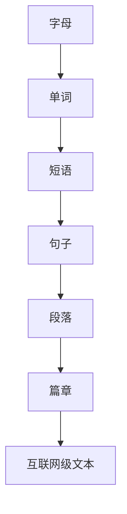

🌰 **例子**：
- 字母：`a, b, c`
- 单词：`apple`
- 短语：`eat an apple`
- 句子：`I eat an apple every day.`
- 段落：由多个句子组成，表达一个主题。

### 2.2 递归性
自然语言允许结构嵌套，形成复杂表达：

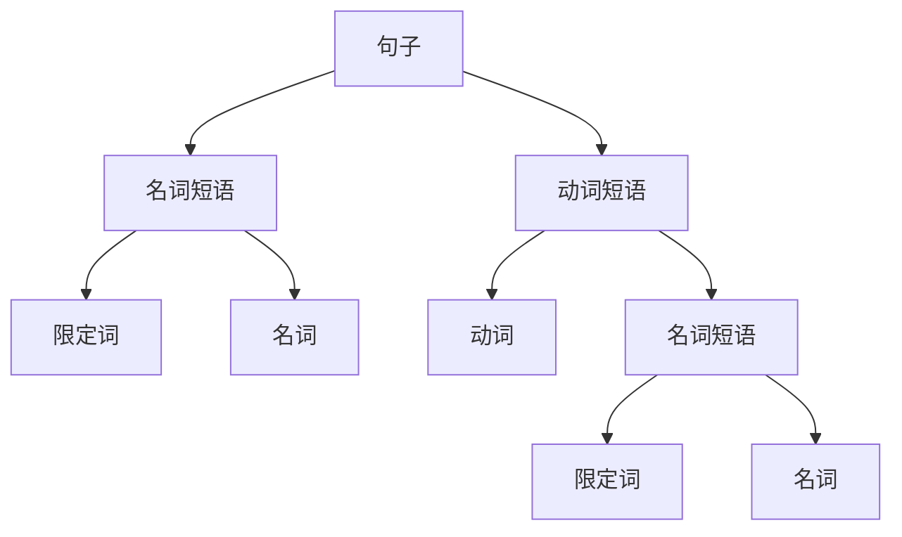

🌰 **例子**：
> “我知道你知道我知道这件事。”  
> 这句话中，“知道”嵌套了三次，形成递归结构。

### 2.3 歧义性
歧义贯穿于语言的各个层面：

| 层面 | 例子 | 可能含义 |
|------|------|-----------|
| 词汇 | `bank` | 银行 / 河岸 |
| 句法 | `I saw a girl with a telescope.` | 我用望远镜看她 / 她拿着望远镜 |
| 语义 | `CCTV` | 闭路电视 / 中国中央电视台 |

🌰 **例子**：
> “他坐在湖边的 bank 上。”  
> 如果没有上下文，无法确定是“银行”还是“河岸”。

---

## 三、什么是自然语言处理？

### 3.1 定义与目标
自然语言处理是**让计算机能够理解、解释和生成人类语言的技术与学科**。它的本质是**结构预测**，即从非结构化的文本中提取出结构化的信息。

### 3.2 核心任务：结构预测举例

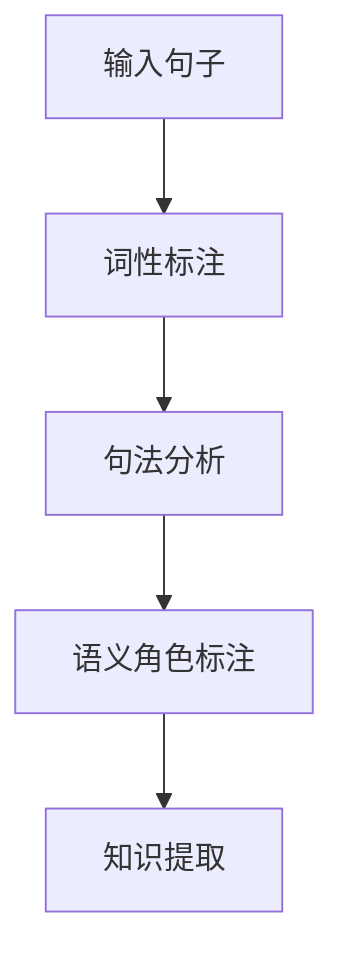

🌰 **例子**：
输入句子：
> “The rat ate cheese.”

NLP系统会输出如下结构：

| 单词 | 词性 | 短语结构 |
|------|------|-----------|
| The | 限定词 | 名词短语 |
| rat | 名词 | 名词短语 |
| ate | 动词 | 动词短语 |
| cheese | 名词 | 名词短语 |

### 3.3 典型任务与应用

- **词性标注**：`我/代词 爱/动词 自然语言处理/名词`
- **命名实体识别**：`[刘知远/人名] 是 [清华大学/机构] 的副教授`
- **句法分析**：构建句子的语法树
- **情感分析**：判断评论是正面还是负面
- **机器翻译**：将一种语言翻译成另一种语言
- **问答系统**：回答用户提出的问题

### 3.4 数学视角：结构预测的复杂度

自然语言处理的一个核心挑战是**组合爆炸**。一个句子的可能语法树数量可以用**卡特兰数**表示：

\[
C_n = \frac{(2n)!}{(n+1)! \cdot n!}
\]

其中 \( n \) 是句子中词语的数量。当 \( n = 10 \) 时，可能的语法树数量已经达到 \( 4862 \) 种。

---

## 总结

- **自然语言**是人类使用的非形式化、动态演化的交流系统。
- **自然语言的特点**包括多粒度、递归性和歧义性。
- **自然语言处理**的目标是让计算机理解语言，核心是**结构预测**，典型任务包括词性标注、句法分析、情感分析、机器翻译等。

---

## 四、自然语言处理的挑战

自然语言处理之所以困难，是因为人类语言本身充满了复杂性和不确定性。这些挑战主要可以归纳为四个方面：多样性、递归性、歧义性，以及它们共同构成的技术实现难度。

---

## 4.1 挑战一：多样性

### 4.1.1 什么是语言多样性？
语言多样性指的是自然语言在词汇、用法和含义上的持续变化和扩展。这包括：

- **新词汇不断涌现**
- **旧词获得新含义**
- **网络用语和流行语的快速传播**

### 4.1.2 多样性的表现形式

#### 🌰 新词汇例子：
- **Filmcholy**：在看喜欢的电影时，意识到电影即将结束的瞬间失落感
- **Kurbublin**：在聊天时打字→删除→再打字，反复多次让对方崩溃的行为
- **Swasome**：老板经过时，你恰好在认真工作的巧合时刻

#### 🌰 旧词新义例子：
同一个词在不同时期含义完全不同：

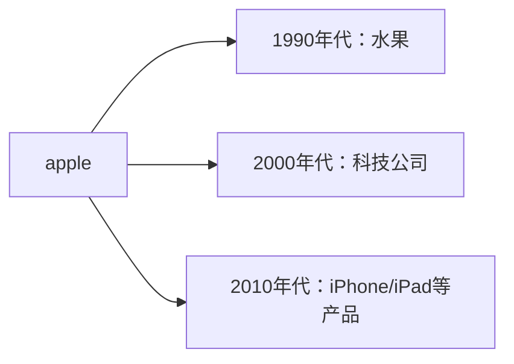

类似的例子还有：
- **amazon**：从"亚马逊雨林"到"亚马逊公司"
- **blackberry**：从"黑莓水果"到"黑莓手机"

### 4.1.3 技术挑战
- **词典永远不完整**：无法预先收录所有词汇
- **语义漂移**：词语含义随时间变化，模型需要持续更新
- **领域适应性**：同一词语在不同领域有不同含义

---

## 4.2 挑战二：递归性

### 4.2.1 什么是语言递归性？
递归性是指语言结构中包含相同类型结构的能力，形成"嵌套"效果。

### 4.2.2 递归性的表现形式

#### 🌰 中文递归例子：
> "我知道你知道我知道这件事。"

结构分析：
```
我知道
    └── 你知道
          └── 我知道这件事
```

#### 🌰 英文递归例子：
> "This is the cat that caught the rat that ate the cheese that lay in the house that Jack built."

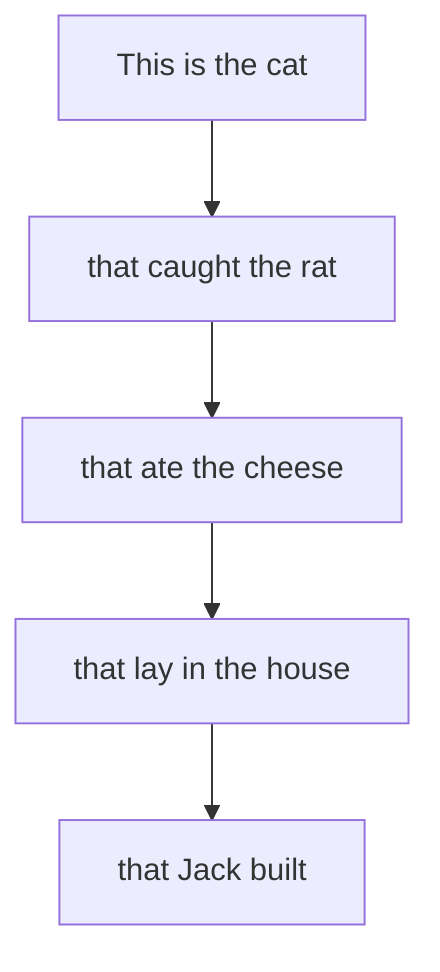

### 4.2.3 技术挑战：组合爆炸

递归结构导致可能的语法分析数量呈指数级增长，用**卡特兰数**表示：

\[
C_n = \frac{(2n)!}{(n+1)!n!}
\]

| 句子长度 | 可能语法树数量 |
|---------|---------------|
| 5个词 | 14种 |
| 10个词 | 4,862种 |
| 15个词 | 2,674,440种 |
| 20个词 | 1,767,263,190种 |

> 💡 **这意味着**：即使只有20个词的句子，计算机也需要在近18亿种可能的结构中找到正确的那一个！

---

## 4.3 挑战三：歧义性

### 4.3.1 什么是语言歧义性？
歧义性是指同一语言表达可能有多种解释的现象，贯穿于语言的各个层面。

### 4.3.2 歧义性的层次

#### ① 词汇级别歧义
同一个词有多个含义。

🌰 **例子**：
> "他坐在bank上。"

- 可能1：他坐在河岸上
- 可能2：他坐在银行大厅的座位上

**消歧方法**：依赖上下文
> "他坐在湖边的bank上。" → 肯定是"河岸"

#### ② 句法级别歧义
同一句子有多种语法结构。

🌰 **经典例子**：
> "I saw a girl with a telescope."

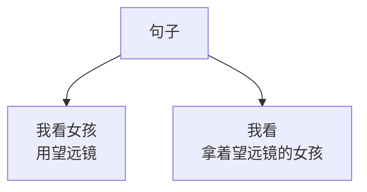

- 解释1：我用望远镜看女孩（with修饰saw）
- 解释2：我看到一个拿着望远镜的女孩（with修饰girl）

**消歧方法**：需要常识或外部知识
- 如果知道望远镜通常用于"看"，倾向于解释1
- 如果知道女孩可能携带物品，倾向于解释2

#### ③ 语用级别歧义
同一表达在不同文化或语境中有不同含义。

🌰 **例子**：
> "CCTV"

- 在国际语境：Closed-circuit television（闭路电视监控）
- 在中国语境：China Central Television（中央电视台）

#### ④ 中文特有的结构性歧义
中文缺乏形态变化，更容易产生结构性歧义。

🌰 **经典例子**：
1. **"骑车差点摔倒，好在我一把把把把住了。"**
   - 断句：好在我一把 / 把把 / 把住了
   - 含义：好在我的手一把将车把控制住了

2. **"校长说衣服上除了校徽别别别的。"**
   - 断句：除了校徽 / 别 / 别别的
   - 含义：除了校徽，不要佩戴其他东西

3. **"我也想过过过儿过过的生活"**
   - 断句：我也想过 / 过过 / 过儿 / 过过的生活
   - 含义：我也想体验杨过曾经体验过的生活

---

## 4.4 综合挑战

### 4.4.1 三大挑战的叠加效应
在实际语言中，多样性、递归性和歧义性往往同时出现，形成"完美风暴"。

🌰 **复杂例子**：
> "那个做AI的苹果工程师正在调试刚发布的苹果手机上的新功能，这个功能可以识别不同品种的苹果。"

这句话同时包含：
- **多样性**："苹果"有公司、产品、水果三种含义
- **递归性**：多重修饰结构嵌套
- **歧义性**：需要区分三个"苹果"的具体指代

### 4.4.2 技术应对策略

现代NLP通过以下方式应对这些挑战：

1. **上下文感知**：使用Transformer等架构理解全局语境
2. **大规模预训练**：在海量文本中学习语言规律
3. **多任务学习**：同时解决词性标注、句法分析等多个任务
4. **外部知识注入**：引入常识、知识图谱等外部信息

---

## 总结：NLP的三大核心挑战

| 挑战类型 | 核心问题 | 技术影响 |
|---------|----------|----------|
| **多样性** | 语言持续演化，新词新义不断出现 | 模型需要持续学习，词典永远不完整 |
| **递归性** | 结构嵌套导致组合爆炸 | 搜索空间指数增长，计算复杂度高 |
| **歧义性** | 同一表达多种含义 | 需要上下文和外部知识进行消歧 |

> 🎯 **核心认知**：自然语言处理本质上是**在不确定性中寻找最可能的结构**，这三大挑战共同决定了NLP技术的上限和瓶颈。

理解了这些挑战，我们就能更好地欣赏NLP技术的精妙之处——它们正是在与这些"人性化"的语言特性搏斗中不断进化的。

---

## 五、自然语言处理典型任务及应用

自然语言处理已经从实验室走向了千家万户，形成了丰富的技术栈和应用生态。

---

## 5.1 基础任务：语言理解的层次体系

自然语言处理任务形成了一个从浅层到深层的层次结构：

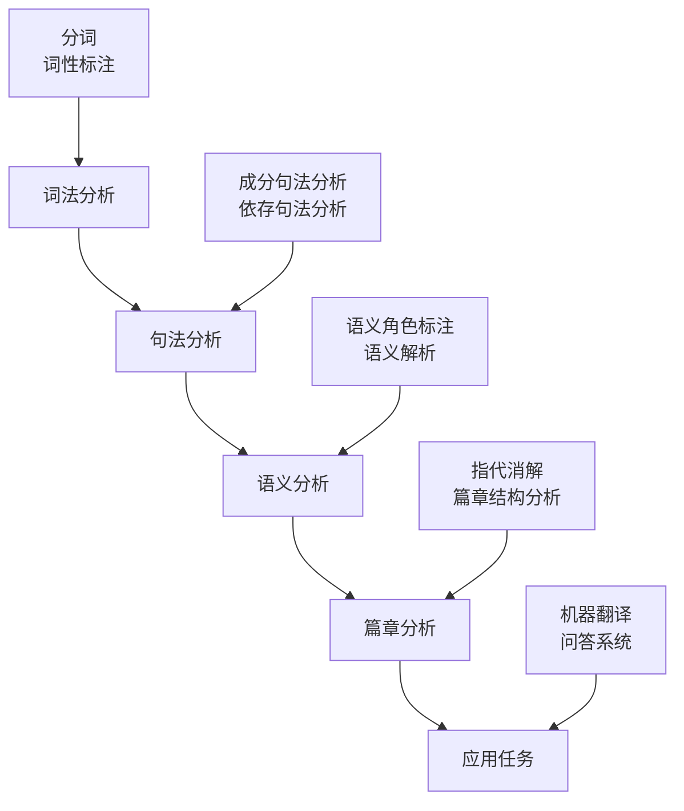

---

## 5.2 搜索引擎及广告

### 5.2.1 搜索引擎中的NLP技术

搜索引擎是NLP技术最成功的应用之一，它不仅仅是简单的关键词匹配。

**核心技术组件：**

| 组件 | NLP技术 | 作用 |
|------|----------|------|
| 查询理解 | 分词、实体识别、意图识别 | 理解用户搜索意图 |
| 网页理解 | 关键词提取、主题建模 | 理解网页内容 |
| 相关性计算 | 语义匹配、排序学习 | 匹配查询与文档 |
| 结果呈现 | 摘要生成、答案抽取 | 优化用户体验 |

🌰 **例子**：
- 搜索："北京今天气温"
- **查询理解**：识别"北京"（地点）、"今天"（时间）、"气温"（天气信息）
- **意图识别**：用户想查询天气
- **结果生成**：直接显示天气预报卡片，而非简单网页列表

### 5.2.2 搜索广告的精准匹配

搜索广告利用NLP实现**意图营销**，而非简单关键词匹配。

🌰 **例子**：
用户搜索："笔记本电脑推荐"
- 传统广告：匹配"笔记本"、"电脑"等关键词
- 智能广告：理解用户处于**购买决策阶段**，推荐具体型号对比、购买渠道

---

## 5.3 知识图谱与结构化知识

### 5.3.1 什么是知识图谱？

知识图谱是用图结构来组织和表示知识的技术，核心是**实体-关系-实体**三元组。

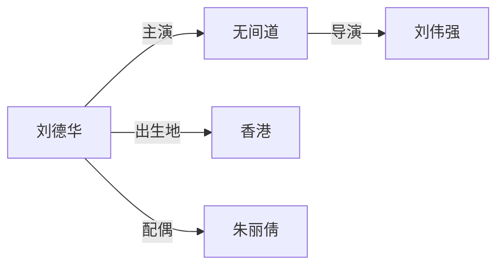

### 5.3.2 结构化知识表示

知识图谱使用统一的形式化表示：

```
(头实体, 关系, 尾实体)
```

🌰 **例子**：
- `(清华大学, 位于, 北京)`
- `(刘知远, 任职于, 清华大学)`
- `(自然语言处理, 属于, 人工智能)`

### 5.3.3 知识图谱应用：智能问答

知识图谱让机器能够**基于知识回答问题**，而非简单文本匹配。

🌰 **例子**：
**用户问**："刘德华的妻子是谁？"

**传统搜索**：返回包含"刘德华"和"妻子"的网页
**知识图谱问答**：
1. 识别实体："刘德华"
2. 识别关系："妻子"
3. 查询知识图谱：`(刘德华, 配偶, ?x)`
4. **直接回答**："朱丽倩"

---

## 5.4 机器阅读

### 5.4.1 什么是机器阅读？
机器阅读让计算机从**非结构化文本**中自动抽取出**结构化知识**。

### 5.4.2 机器阅读的核心任务

**信息抽取流程：**
```
原始文本 → 实体识别 → 关系抽取 → 知识融合 → 更新知识图谱
```

🌰 **例子**：
**输入文本**：
> "约翰·库廷于1885年1月8日出生在澳大利亚维多利亚州克雷斯维克。"

**机器阅读输出**：
- 实体识别：`约翰·库廷(人物)`, `1885年1月8日(日期)`, `克雷斯维克(地点)`
- 关系抽取：
  - `(约翰·库廷, 出生日期, 1885年1月8日)`
  - `(约翰·库廷, 出生地点, 克雷斯维克)`

### 5.4.3 技术价值
- **知识图谱扩展**：从海量文本中自动发现新知识
- **实时更新**：跟踪新闻、论文等最新信息

---

## 5.5 私人助手

### 5.5.1 技术架构
现代私人助手（Siri、小爱同学、Alexa）是NLP技术的集大成者。

```
语音输入 → 语音识别 → 自然语言理解 → 任务执行 → 自然语言生成 → 语音输出
```

### 5.5.2 核心技术挑战

| 挑战 | 例子 | 技术要求 |
|------|------|----------|
| 语音识别准确率 | "打开空调" vs "打开空气" | 声学模型、语言模型 |
| 意图理解 | "我冷了" → 调高温度 | 语义理解、常识推理 |
| 多轮对话 | 用户："今天天气怎样？"<br>助手："今天晴天，25度"<br>用户："明天呢？" | 对话状态跟踪 |
| 个性化 | 用户习惯、偏好记忆 | 用户画像构建 |

🌰 **完整例子**：
**用户**："提醒我明天下午三点开会"
**助手处理流程**：
1. 语音识别：音频转文本
2. 意图识别：`创建提醒`
3. 槽位填充：`时间=明天15:00`, `内容=开会`
4. 确认生成："好的，已创建明天下午三点的会议提醒"

---

## 5.6 机器翻译

### 5.6.1 技术演进历程

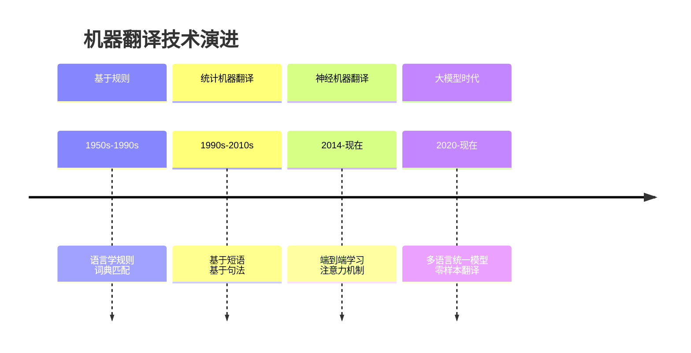

### 5.6.2 现代神经机器翻译原理

神经机器翻译使用**编码器-解码器+注意力机制**：

```
源语言句子 → 编码器(语义向量) → 解码器 → 目标语言句子
```

🌰 **例子**：
**英文输入**：`"I love natural language processing."`
**中文输出**：`"我喜欢自然语言处理。"`

**技术突破**：
- 不再逐词翻译，而是理解整体语义后生成
- 能够处理长距离依赖和语序差异

---

## 5.7 情感分析和意图识别

### 5.7.1 情感分析

情感分析旨在识别文本中表达的情感倾向。

**分析层次：**
- **文档级**：整篇评论的情感（正面/负面）
- **句子级**：单个句子的情感
- **方面级**：对特定方面的情感

🌰 **例子**：
评论："这家餐厅环境很好，但是菜太咸了。"
- **文档级**：中性（有褒有贬）
- **方面级**：
  - `环境`：正面
  - `菜品口味`：负面

### 5.7.2 意图识别

意图识别判断用户想要完成什么任务。

🌰 **应用场景**：

| 用户输入 | 识别意图 | 对应动作 |
|----------|----------|----------|
| "今天天气怎样？" | 查询天气 | 返回天气预报 |
| "定一个明天8点的闹钟" | 创建提醒 | 设置闹钟 |
| "播放周杰伦的歌" | 媒体控制 | 播放音乐 |

---

## 5.8 计算社会学

### 5.8.1 文化组学

通过分析大规模文本数据研究文化变迁。

**经典研究**：Google Books N-gram
- 分析了1800-2000年间500万本书
- 通过词汇频率变化研究社会观念演变

🌰 **发现例子**：
- "女性"相关词汇在20世纪后期使用频率显著上升
- 科技词汇在近几十年爆炸式增长

### 5.8.2 语言与心理分析

通过语言使用模式推断作者的心理状态。

**LIWC分析示例：**
```python
文本："我最近感到很焦虑，工作压力大，睡眠也不好。"
LIWC分析结果：
- 负面情绪: 高
- 焦虑词汇: 出现
- 自我指代: 高 ("我"频繁出现)
- 认知过程: 涉及问题描述
```

**应用价值**：
- 心理健康筛查
- 人格分析
- 压力检测

---

## 5.9 值得一看的综述与研究方向

### 5.9.1 重要综述文献

1. **《Advances in Natural Language Processing》**(Science 2015)
   - 作者：Julia Hirschberg, Christopher Manning
   - 地位：NLP领域的权威综述

2. **《Foundation Models》**系列研究
   - 关注预训练大模型的技术原理和社会影响

### 5.9.2 前沿研究方向

| 方向 | 核心问题 | 应用前景 |
|------|----------|----------|
| 预训练语言模型 | 如何让模型更好地理解语言 | 智能对话、内容生成 |
| 多模态学习 | 文本+图像+语音联合理解 | 虚拟现实、自动驾驶 |
| 低资源学习 | 小语种、少标注数据场景 | 技术普惠 |
| 可解释AI | 让模型决策过程透明 | 医疗、金融等高可信场景 |

---

## 总结：NLP技术全景图

自然语言处理已经形成了完整的技术栈和应用生态：

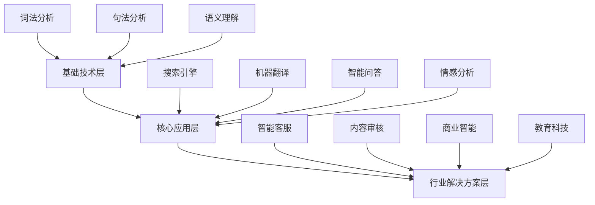

从理论研究到实际应用，自然语言处理正在深刻改变我们与信息交互的方式，成为人工智能皇冠上最璀璨的明珠之一。


---

## 六、推荐阅读与学术资源

要深入掌握自然语言处理，需要从多个学科领域系统学习。以下是精心整理的资源指南。

---

## 6.1 自然语言处理核心书籍

### 6.1.1 入门与经典教材

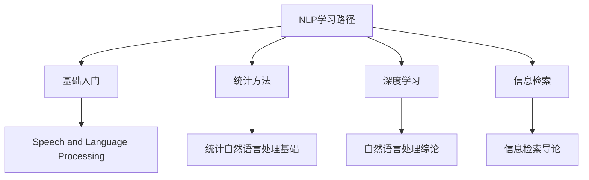

**📚 核心推荐：**

1. **《Speech and Language Processing》** (Daniel Jurafsky & James H. Martin)
   - **地位**：NLP领域的"圣经"
   - **特点**：全面覆盖从基础理论到前沿技术
   - **适用**：本科生、研究生系统学习

2. **《统计自然语言处理基础》** (Christopher D. Manning & Hinrich Schütze)
   - **重点**：统计方法和机器学习在NLP中的应用
   - **价值**：理解预深度学习时代的技术脉络

3. **《自然语言处理综论》** (中文版)
   - **优势**：更适合中文母语学习者入门
   - **内容**：结合中文语言特点讲解

### 6.1.2 专业细分领域

**语义计算专题：**
- **《Semantic Relations Between Nominals》**
  - 专注名词间语义关系：同义、反义、上下位等
  - 适合研究知识图谱、语义理解的学者

**信息检索专题：**
- **《Introduction to Information Retrieval》**
  - 作者：Christopher D. Manning, Prabhakar Raghavan, Hinrich Schütze
  - 搜索引擎技术的权威教材

---

## 6.2 机器学习基础

NLP建立在坚实的机器学习基础之上，推荐以下经典教材：

### 6.2.1 机器学习三部曲

| 书籍 | 作者 | 特点 | 适合人群 |
|------|------|------|----------|
| **《Pattern Recognition and Machine Learning》** | Christopher Bishop | 概率图模型经典，理论深刻 | 研究生、研究人员 |
| **《Neural Networks and Learning Machines》** | Simon Haykin | 神经网络系统教材 | 工程师、研究者 |
| **《Deep Learning》** | Ian Goodfellow等 | 深度学习集大成者 | 所有深度学习学习者 |

🌰 **学习建议**：
- **入门**：从《Deep Learning》开始
- **深入研究**：PRML + 论文阅读
- **工程实践**：结合PyTorch/TensorFlow实战

---

## 6.3 语言学基础

不理解语言学的NLP工程师就像不懂物理的建筑师。

### 6.3.1 语言学三大基石

**1. 结构语言学奠基：**
- **《Course in General Linguistics》** (Ferdinand de Saussure)
  - 提出"能指"与"所指"、"语言"与"言语"等核心概念
  - **NLP启示**：形式与意义的关系问题

**2. 生成语法革命：**
- **《Syntactic Structures》** (Noam Chomsky)
  - 提出转换生成语法、深层结构与表层结构
  - **NLP启示**：句法分析的数学基础

**3. 认知语言学视角：**
- **《The Language Instinct》** (Steven Pinker)
  - 从认知科学角度解释语言习得
  - **NLP启示**：语言与思维的关系

### 6.3.2 为什么NLP工程师要学语言学？

🌰 **实际例子**：
```python
# 没有语言学知识的工程师可能这样处理：
text = "我爱自然语言处理"
tokens = text.split("")  # 错误：中文不能按空格分词

# 有语言学知识的工程师：
import jieba
tokens = jieba.cut(text)  # 正确：基于语言学规则的分词
```

**语言学知识帮助解决：**
- 中文分词歧义："研究生命起源" → "研究/生命/起源" vs "研究生/命/起源"
- 句法结构歧义："咬死了猎人的狗"
- 语义角色标注：谁对谁做了什么

---

## 6.4 跨学科视角

### 6.4.1 计算社会学

**《The Secret Life of Pronouns》** (James W. Pennebaker)
- **核心观点**：功能词（代词、介词等）揭示人的心理状态
- **研究发现**：
  - 抑郁倾向的人更多使用第一人称单数
  - 权力地位高的人使用更多第一人称复数
- **NLP应用**：心理状态分析、作者画像

**《Uncharted: Big Data as a Lens on Human Culture》** (Erez Aiden & Jean-Baptiste Michel)
- **研究方法**：Google Books N-gram的文化分析
- **经典发现**：通过词汇使用频率追踪社会观念变迁

### 6.4.2 认知科学与心理学

**推荐阅读**：
- Steven Pinker 系列著作
- 认知神经科学与语言处理相关研究
- 社会心理学与语言使用的关系研究

---

## 6.5 学术网站与资源

### 6.5.1 核心学术数据库

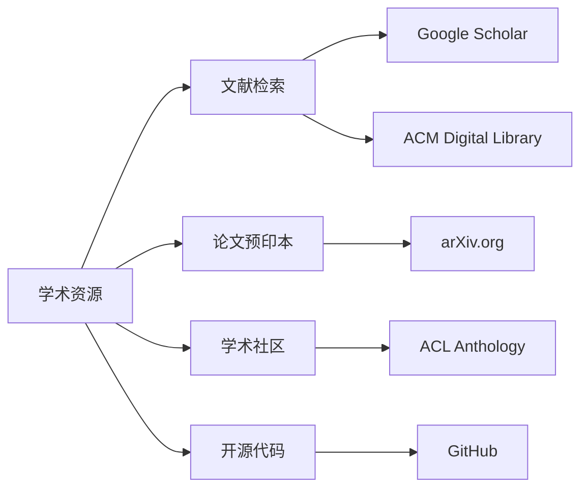

### 6.5.2 具体资源详解

**1. Google Scholar (scholar.google.com)**
- **用途**：学术文献检索、引用追踪
- **技巧**：
  - 设置关键词订阅
  - 使用"相关文章"功能发现新文献
  - 关注重要作者的学术主页

**2. ACM Digital Library (dl.acm.org)**
- **覆盖**：计算机领域顶级会议和期刊
- **重要会议**：
  - ACL (Association for Computational Linguistics)
  - EMNLP (Empirical Methods in Natural Language Processing)
  - NAACL (North American Chapter of the ACL)
  - COLING (International Conference on Computational Linguistics)

**3. arXiv.org**
- **特点**：论文预印本，最快获取最新研究成果
- **常用类别**：
  - `cs.CL` (Computation and Language)
  - `cs.AI` (Artificial Intelligence)
  - `cs.IR` (Information Retrieval)

**4. ACL Anthology (aclweb.org/anthology)**
- **地位**：NLP领域论文的权威存档
- **价值**：免费获取几乎所有NLP顶会论文

### 6.5.3 实用学术工具

**文献管理：**
- Zotero, Mendeley

**代码复现：**
- GitHub - 关注知名实验室和作者
- Papers with Code - 论文与代码的桥梁

**学术社交：**
- ResearchGate - 学者社交网络
- Twitter - 关注NLP领域专家获取最新动态

---

## 6.6 学习路径建议

### 6.6.1 初学者路径 (0-6个月)
```
月份 1-2：语言学基础 + Python编程
月份 3-4：《Speech and Language Processing》 + 经典算法实现
月份 5-6：深度学习基础 + 第一个NLP项目
```

### 6.6.2 进阶者路径 (6-18个月)
```
阶段1：深入研究1-2个NLP子领域
阶段2：复现经典论文，理解技术细节
阶段3：参与开源项目或学术研究
阶段4：关注前沿会议，培养学术品味
```

### 6.6.3 研究者路径
```
方法论：掌握实验设计、论文写作、学术演讲
创新点：从实际问题出发，寻找技术突破
合作网络：建立学术合作关系，参与国际社区
```

---

## 总结：NLP学习生态系统

自然语言处理是一个需要**多学科知识**和**持续学习**的领域：

- **理论基础**：语言学 + 数学 + 计算机科学
- **技术栈**：传统方法 → 统计学习 → 深度学习
- **实践能力**：编程实现 + 论文复现 + 项目经验
- **学术素养**：文献阅读 + 论文写作 + 学术交流

> 🎯 **最终目标**：不是掌握所有技术，而是建立**解决问题的思维框架**——理解语言现象背后的规律，选择合适的技术工具，创造有价值的应用。

随着预训练大模型时代的到来，NLP正在经历前所未有的变革，但不变的是对语言本质的探索和对技术价值的追求。希望这份指南能帮助你在自然语言处理的海洋中找到自己的航向！

---
*"语言不是思维的边界，而是思维的起点。"*