# NLP模型基础 - 词表示详解

## 一、词表示（Word Representation）

### 1.1 什么是词表示？

**核心概念：** 词表示是将自然语言中的词转换为机器可以理解和处理的数学形式的过程。

**通俗理解：** 想象你要教一个从未接触过人类语言的机器人理解"苹果"这个词。你不能直接告诉它汉字"苹果"是什么，而要用机器能懂的"语言"（数字）来描述它。这就是词表示要做的事情。


**意义的定义：**
- 一个词想要传达的内容
- 一个词在逻辑上的延伸含义

---

## 二、词表示的目标

词表示不是随便给词分配数字，而是要让这些数字"有意义"。具体来说有两大目标：

### 2.1 目标一：计算词与词的相似度

**理论：** 让意思相近的词在数学空间中也靠近。

**例子：**
- $WR(\text{Star}) \approx WR(\text{Sun})$
  - "Star"（星星）和"Sun"（太阳）都是天体，应该相似
- $WR(\text{Motel}) \approx WR(\text{Hotel})$
  - "Motel"（汽车旅馆）和"Hotel"（酒店）都是住宿场所

### 2.2 目标二：推测词与词的关系

**理论：** 词之间的关系可以通过向量运算来表达。

**经典例子：**

1. **地理关系：**
   $$WR(\text{China}) - WR(\text{Beijing}) \approx WR(\text{Japan}) - WR(\text{Tokyo})$$
   - 大白话：中国-北京 的关系 ≈ 日本-东京 的关系（都是国家和首都）

2. **性别关系：**
   $$WR(\text{Man}) \approx WR(\text{King}) - WR(\text{Queen}) + WR(\text{Woman})$$
   - 大白话：King - Queen + Woman ≈ Man
   - 国王是男性统治者，王后是女性统治者，那么"国王"去掉"女性"加上"女性"就是"男人"

3. **时态关系：**
   $$WR(\text{Swimming}) \approx WR(\text{Walking}) - WR(\text{Walk}) + WR(\text{Swim})$$
   - Walking和Walk的区别（进行时），应该和Swimming和Swim的区别相同

---

## 三、早期方法：同义词与上位词

### 3.1 基本思想

**理论：** 用一个词相关的同义词集合或上位词来表示这个词。

**什么是上位词？** 更抽象、更上层的概念。

**例子：**

使用WordNet词典：

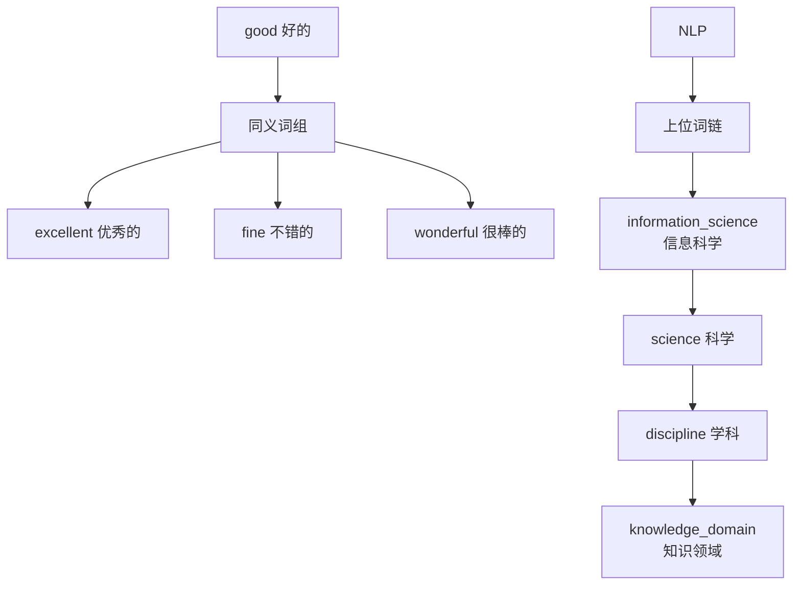

**"good"的同义词包括：**
- excellent（优秀的）
- fine（不错的）
- beneficial（有益的）
- skillful（熟练的）

**"NLP"的上位词链：**
NLP → 信息科学 → 科学 → 学科 → 知识领域 → 认知 → 心理特征 → 抽象概念 → 实体

### 3.2 这种方法的问题

虽然思路很直观，但有明显缺陷：

1. **丢失细微差别**
   - 例子："proficient"（精通的）和"good"（好的）只在特定上下文是同义词
   - "He is proficient in Python"（他精通Python）✓
   - "He is good in Python"（有歧义）

2. **无法获得新含义**
   - "Apple"：水果 🍎 → IT公司
   - "Amazon"：森林 🌳 → IT公司 📦
   - 词典更新跟不上语言变化

3. **主观性强**
   - 不同人对同义词的理解可能不同

4. **数据稀疏**
   - 需要大量人工标注
   - 很多词没有收录

---

## 四、One-hot表示

### 4.1 核心思想

**理论：** 把每个词看作完全独立的符号，用一个只有一位是1、其余全是0的向量来表示。

**通俗解释：** 就像给每个词发一个独特的"身份证号"。

### 4.2 具体例子

假设词表只有5个词：`[the, cat, sat, on, mat]`

| 词 | ID | One-hot向量 |
|---|---|---|
| the | 0 | [1, 0, 0, 0, 0] |
| cat | 1 | [0, 1, 0, 0, 0] |
| sat | 2 | [0, 0, 1, 0, 0] |
| on | 3 | [0, 0, 0, 1, 0] |
| mat | 4 | [0, 0, 0, 0, 1] |

**向量维度 = 词表大小**

如果词表有10万个词，每个词的one-hot向量就有10万维！

### 4.3 One-hot的致命缺陷

**问题：所有词之间都是正交的（垂直的）**

计算"star"和"sun"的相似度：
$$similarity(\text{star}, \text{sun}) = v_{star} \cdot v_{sun} = 0$$

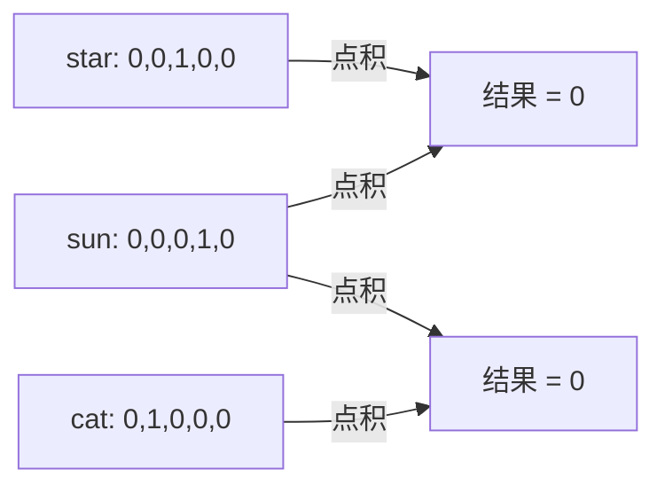

**大白话：** 在one-hot表示中，"太阳"和"星星"的相似度 = "太阳"和"猫"的相似度 = 0。这显然不合理！

---

## 五、上下文词表示（Distributional Representation）

### 5.1 核心哲学

**Firth名言（1957）：**
> "You shall know a word by the company it keeps."
> "要了解一个词，看它周围都有什么词。"

**通俗理解：**
- 如果两个词经常出现在相似的上下文中，它们的意思可能相近
- 例如："医生开了___" 和 "药店买了___"，空格里可能填"药"或"处方"

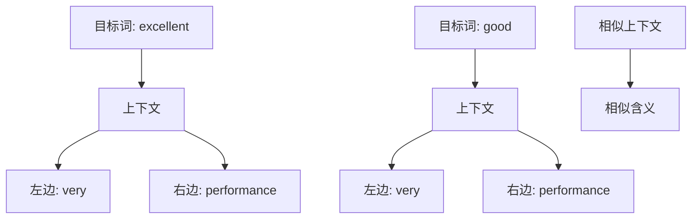

### 5.2 实现方式

有两种主要的统计方法：
1. **共现统计**（基于计数）
2. **词嵌入**（基于学习）

我们先看共现统计。

---

## 六、共现统计（Co-occurrence Statistics）

### 6.1 什么是共现？

**定义：** 两个词在一定窗口范围内一起出现。

**例子：**
句子："The cat sat on the mat"
窗口大小 = 2（前后各2个词）

对于目标词"sat"：
- 上下文窗口：[cat, **sat**, on, the]
- 共现词：cat, on, the

### 6.2 两种矩阵

#### A. Term-Term矩阵（词-词矩阵）

**记录：** 一个词出现在另一个词周围的次数

**公式：**
$$C_{i,j} = \sum_{\Delta x=-m}^{m} \sum_{x=-\Delta x}^{n-\Delta x-1} \begin{cases} 1, & \text{if } \Delta x \neq 0, I_x=i \text{ and } I_{x+\Delta x}=j \\ 0, & \text{otherwise} \end{cases}$$

**语料库示例：**
```
1. I like deep learning.
2. I like NLP.
3. I enjoy flying.
```

**窗口大小=2的Term-Term矩阵：**

|        | I | like | enjoy | deep | learning | NLP | flying | . |
|--------|---|------|-------|------|----------|-----|--------|---|
| I      | 0 | 2    | 1     | 1    | 0        | 1   | 1      | 0 |
| like   | 2 | 0    | 0     | 1    | 1        | 1   | 0      | 1 |
| enjoy  | 1 | 0    | 0     | 0    | 0        | 0   | 1      | 1 |
| deep   | 1 | 1    | 0     | 0    | 1        | 0   | 0      | 1 |
| learning| 0| 1    | 0     | 1    | 0        | 0   | 0      | 1 |
| NLP    | 1 | 1    | 0     | 0    | 0        | 0   | 0      | 1 |
| flying | 1 | 0    | 1     | 0    | 0        | 0   | 0      | 1 |
| .      | 0 | 1    | 1     | 1    | 1        | 1   | 1      | 0 |

**解读：**
- "I"和"like"共现2次（两个句子中都有）
- "like"和"deep"共现1次
- 矩阵是对称的

**窗口大小的影响：**
- 小窗口（m ∈ [1,3]）→ 捕捉**句法信息**（语法结构）
- 大窗口（m ∈ [4,10]）→ 捕捉**语义信息**（意思相关）

#### B. Term-Document矩阵（词-文档矩阵）

**记录：** 一个词在每个文档中出现的次数

**同样语料，3个文档：**

|          | D1 | D2 | D3 |
|----------|----|----|----|
| I        | 1  | 1  | 1  |
| like     | 1  | 1  | 0  |
| enjoy    | 0  | 0  | 1  |
| deep     | 1  | 0  | 0  |
| learning | 1  | 0  | 0  |
| NLP      | 0  | 1  | 0  |
| flying   | 0  | 0  | 1  |
| .        | 1  | 1  | 1  |

**用途：**
- 每个文档可以用一个向量表示（每一列）
- 每个词也可以用一个向量表示（每一行）
- D是文档数量，V是词表大小

---

## 七、相似度计算

### 7.1 点积（Dot Product）

**公式：**
$$\langle v, w \rangle = v \cdot w = \sum_{i=1}^{D} v_i \cdot w_i = v_1w_1 + v_2w_2 + \cdots + v_Dw_D$$

**例子：**
```
v = [3, 1, 2]（"like"的共现向量）
w = [3, 0, 2]（"enjoy"的共现向量）

点积 = 3×3 + 1×0 + 2×2 = 9 + 0 + 4 = 13
```

**问题：** 向量长度影响点积大小

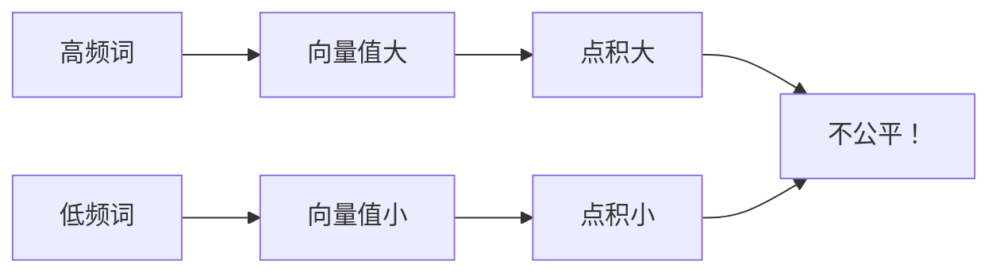

### 7.2 余弦相似度（Cosine Similarity）

**公式：**
$$cosine\_similarity(v, w) = \frac{v \cdot w}{||v|| \cdot ||w||}$$

其中 $||v|| = \sqrt{\sum_{i=1}^{D} v_i^2}$ 是向量的长度。

**几何意义：** 两个向量夹角θ的余弦值

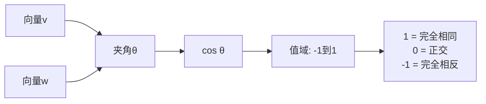

**例子：**
```
v = [3, 1, 2]，||v|| = √(9+1+4) = √14 ≈ 3.74
w = [3, 0, 2]，||w|| = √(9+0+4) = √13 ≈ 3.61

余弦相似度 = 13 / (3.74 × 3.61) ≈ 0.96
```

**优势：** 归一化了向量长度，只看方向！

---

## 八、基于统计表示的不足

虽然共现统计比one-hot好，但还是有问题：

### 8.1 规模问题

**问题：** 随着词表增长，矩阵急剧膨胀

**例子：**
- 词表10,000词 → Term-Term矩阵：10,000 × 10,000 = 1亿个数
- 词表100,000词 → 100亿个数！

**存储空间巨大！**

### 8.2 稀疏问题

**问题：** 大部分位置都是0

**例子：**
```
"quantum"（量子）在日常语料中很少出现
→ 它的共现向量大部分是0
→ 难以计算准确的相似度
→ 后续模型不稳定
```

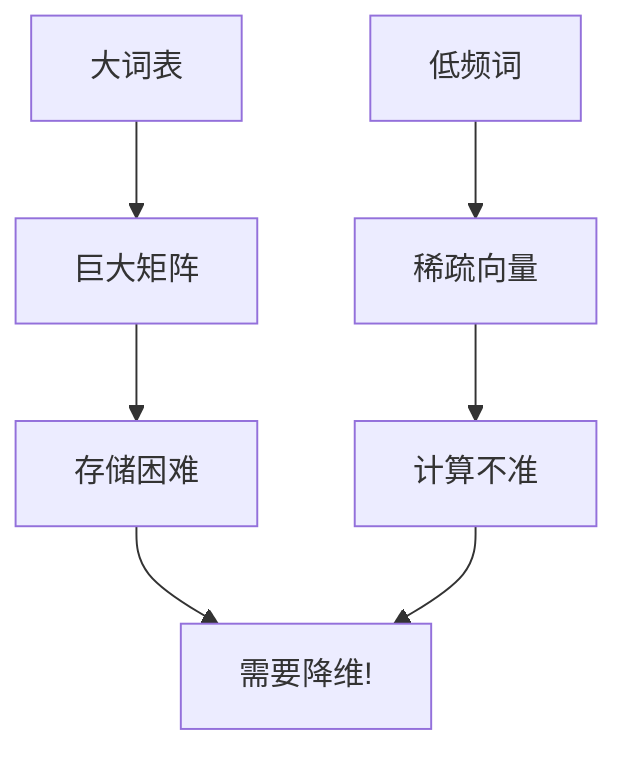

---

## 九、稠密向量（Dense Vectors）

### 9.1 为什么需要稠密向量？

**对比：**

| 特性 | 稀疏向量（共现矩阵） | 稠密向量 |
|-----|---------------------|----------|
| 维度 | 很高（=词表大小） | 较低（200-500） |
| 大部分值 | 0 | 非零 |
| 泛化能力 | 差 | 好 |
| 存储 | 大 | 小 |

**机器学习的经验：** 低维稠密特征通常效果更好！

### 9.2 如何获得稠密向量？

**方法：** 对稀疏的共现矩阵进行**降维**

---

## 十、奇异值分解（SVD）

### 10.1 核心思想

**理论：** 将大矩阵分解成小矩阵的乘积

**公式：**
$$M = U \Sigma V^*$$

其中：
- $M$：原始的 $m \times n$ 矩阵（如Term-Term矩阵）
- $U$：$m \times k$ 矩阵（**行=词，列=隐含特征维度**）
- $\Sigma$：$k \times k$ 对角矩阵（奇异值，表示每个维度的重要性）
- $V^*$：$k \times n$ 矩阵

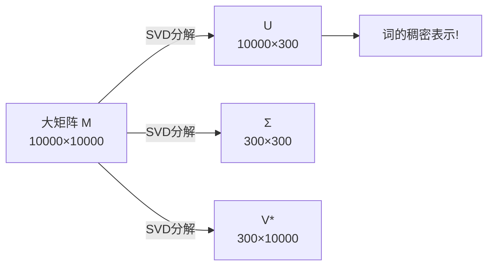

### 10.2 降维过程

**步骤：**

1. **完全分解：** $M = U\Sigma V^*$，$k$ 可能很大

2. **选择Top-k：** 只保留最大的$k$个奇异值（如300个）
   - 相当于保留最重要的300个"主题"或"概念"

3. **近似重构：** $M \approx U_k \Sigma_k V_k^*$

4. **提取词向量：** $U_k$ 的每一行就是一个词的300维稠密向量！

### 10.3 直观例子

**原始Term-Term矩阵（简化版）：**
```
      cat  dog  pet  car  bus
cat    0    5    8    1    0
dog    5    0    7    0    1
pet    8    7    0    2    1
car    1    0    2    0    6
bus    0    1    1    6    0
```

**SVD降维到2维后（示意）：**
```
词     维度1   维度2
cat    2.3    -0.1    ← 动物主题
dog    2.1     0.2    ← 动物主题
pet    2.5     0.1    ← 动物主题
car   -0.3     2.1    ← 交通主题
bus   -0.2     1.9    ← 交通主题
```

**发现：**
- 相关的词在新空间中靠近！
- 维度可以理解为"隐含主题"

---

## 十一、词嵌入（Word Embedding）

### 11.1 从统计到学习

**分布式表示（Distributed Representation）：**
- 不再手工统计共现
- 通过**机器学习**在大规模语料上学习
- 为每个词建立一个稠密向量

**代表方法：** Word2Vec（下一部分详细讲解）

### 11.2 优势总结

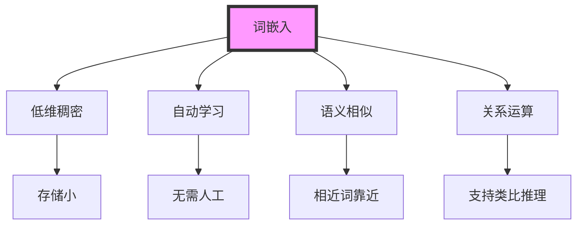

---

## 总结对比表

| 方法 | 维度 | 相似度 | 优点 | 缺点 |
|-----|------|--------|------|------|
| 同义词/上位词 | 不固定 | 基于词典 | 直观 | 覆盖不全、主观 |
| One-hot | =词表大小 | 全为0 | 简单 | 无语义信息 |
| 共现矩阵 | =词表大小 | 可计算 | 有语义 | 稀疏、高维 |
| SVD降维 | 可调（如300） | 可计算 | 稠密、低维 | 静态、计算量大 |
| 词嵌入 | 可调（如300） | 可计算 | 稠密、可学习 | 需要训练 |

**进化路线：**
```
符号表示 → 统计表示 → 降维表示 → 学习表示
(离散)    (稀疏)      (稠密)      (优化)
```

# 分布式词表示 - 语言模型详解

## 一、语言模型（Language Model）

### 1.1 什么是语言模型？

**核心定义：** 语言模型是一个概率分布，用来估计一个词序列（句子）出现的概率。

**数学表达：**
$$P(w_1, w_2, w_3, \ldots, w_n)$$

其中 $w_1, w_2, \ldots, w_n$ 是一个词序列。

**通俗理解：** 语言模型要回答："这句话听起来像人话吗？"

**例子：**
- $P(\text{"我爱吃苹果"})$ = 0.01（比较常见）
- $P(\text{"我爱吃汽车"})$ = 0.000001（很奇怪）
- $P(\text{"苹果吃我爱"})$ = 0.0000001（语法错误）

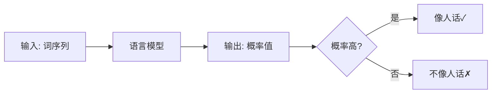

### 1.2 为什么需要语言模型？

**应用场景：**

1. **机器翻译：**
   - 英文："I love you"
   - 候选1："我爱你" $P = 0.8$
   - 候选2："我爱妳" $P = 0.05$
   - 选概率高的！

2. **语音识别：**
   - 听到："shi yan shi"
   - 候选1："实验室" $P = 0.7$
   - 候选2："十眼十" $P = 0.001$

3. **文本生成：**
   - 给定："今天天气"
   - 接续："很好" $P = 0.3$
   - 接续："不错" $P = 0.25$
   - 接续："变化" $P = 0.1$

### 1.3 链式法则分解

**理论：** 利用条件概率的链式法则，将整个序列的概率分解：

$$P(w_1, w_2, \ldots, w_n) = P(w_1) \cdot P(w_2|w_1) \cdot P(w_3|w_1,w_2) \cdots P(w_n|w_1,\ldots,w_{n-1})$$

**更紧凑的形式：**
$$P(w_1, w_2, \ldots, w_n) = \prod_{i=1}^{n} P(w_i | w_1, \ldots, w_{i-1})$$

**例子：** "我/爱/吃/苹果"

$$P(\text{我, 爱, 吃, 苹果}) = P(\text{我}) \cdot P(\text{爱}|\text{我}) \cdot P(\text{吃}|\text{我, 爱}) \cdot P(\text{苹果}|\text{我, 爱, 吃})$$

**直观理解：**
- 第1步：句子以"我"开头的概率
- 第2步：说"我"后，接"爱"的概率
- 第3步：说"我爱"后，接"吃"的概率
- 第4步：说"我爱吃"后，接"苹果"的概率

---

## 二、N-gram模型

### 2.1 马尔可夫假设（Markov Assumption）

**问题：** 计算 $P(w_i | w_1, \ldots, w_{i-1})$ 需要考虑所有历史词，太复杂！

**解决方案：** 只看前 $n-1$ 个词（近似假设）

$$P(w_i | w_1, \ldots, w_{i-1}) \approx P(w_i | w_{i-n+1}, \ldots, w_{i-1})$$

**通俗理解：** 人说话时，下一个词主要受最近几个词的影响，不需要记住整个历史。

### 2.2 常见的N-gram

**Unigram（1-gram）：** 假设词之间完全独立
$$P(w_1, w_2, w_3, w_4) = P(w_1) \cdot P(w_2) \cdot P(w_3) \cdot P(w_4)$$

**例子：**
$$P(\text{我, 爱, 吃, 苹果}) = P(\text{我}) \cdot P(\text{爱}) \cdot P(\text{吃}) \cdot P(\text{苹果})$$

**Bigram（2-gram）：** 每个词只依赖前一个词
$$P(w_1, w_2, w_3, w_4) = P(w_1) \cdot P(w_2|w_1) \cdot P(w_3|w_2) \cdot P(w_4|w_3)$$

**例子：**
$$P(\text{我, 爱, 吃, 苹果}) = P(\text{我}) \cdot P(\text{爱}|\text{我}) \cdot P(\text{吃}|\text{爱}) \cdot P(\text{苹果}|\text{吃})$$

**Trigram（3-gram）：** 每个词依赖前两个词
$$P(w_i | w_1, \ldots, w_{i-1}) \approx P(w_i | w_{i-2}, w_{i-1})$$

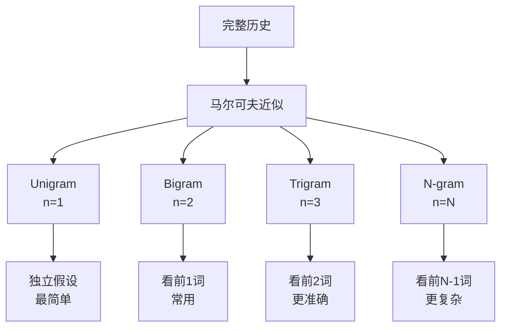

### 2.3 参数估计（极大似然估计）

**如何计算概率？** 统计语料库中的频次！

**Bigram的极大似然估计（MLE）：**
$$P(w_i | w_{i-1}) = \frac{\text{count}(w_{i-1}, w_i)}{\text{count}(w_{i-1})}$$

**例子：**

假设语料库：
```
我爱吃苹果
我爱吃香蕉
我喜欢苹果
他爱吃苹果
```

**统计：**
- count(我, 爱) = 2
- count(我, 喜欢) = 1
- count(我) = 3

**计算：**
$$P(\text{爱}|\text{我}) = \frac{\text{count}(\text{我, 爱})}{\text{count}(\text{我})} = \frac{2}{3} \approx 0.67$$

$$P(\text{喜欢}|\text{我}) = \frac{\text{count}(\text{我, 喜欢})}{\text{count}(\text{我})} = \frac{1}{3} \approx 0.33$$

**Trigram的极大似然估计：**
$$P(w_i | w_{i-2}, w_{i-1}) = \frac{\text{count}(w_{i-2}, w_{i-1}, w_i)}{\text{count}(w_{i-2}, w_{i-1})}$$

**例子：**
$$P(\text{苹果}|\text{爱, 吃}) = \frac{\text{count}(\text{爱, 吃, 苹果})}{\text{count}(\text{爱, 吃})} = \frac{2}{3} \approx 0.67$$

---

## 三、N-gram的不足

### 3.1 数据稀疏问题（Sparsity）

**问题：** 很多n-gram组合在训练语料中从未出现

**例子：**
- 训练集只有："我爱吃苹果"
- 测试时遇到："我爱吃榴莲"
- count(爱, 吃, 榴莲) = 0
- $P(\text{榴莲}|\text{爱, 吃}) = \frac{0}{\text{count}(\text{爱, 吃})} = 0$

**后果：** 整个句子概率变为0！

$$P(\text{我, 爱, 吃, 榴莲}) = P(\text{我}) \cdot P(\text{爱}|\text{我}) \cdot \underbrace{P(\text{吃}|\text{爱}) \cdot P(\text{榴莲}|\text{爱, 吃})}_{= 0} = 0$$

**解决方案（传统）：**
1. **平滑技术（Smoothing）：** 给零概率分配一个小值
2. **回退（Back-off）：** Trigram没有就用Bigram，Bigram没有就用Unigram

### 3.2 无法捕捉长距离依赖

**问题：** N通常只能取2-5，无法处理长句依赖

**例子：**
```
句子："昨天我在超市买了很多新鲜的[苹果]"
Trigram只看："新鲜的 [?]"
但实际上"超市"、"买"也很重要！
```

**改进方向：** 我们需要一个能够：
1. 处理未见过的词组合
2. 捕捉长距离依赖
3. 自动学习词的表示

**答案：** 神经语言模型（Neural Language Model）

---

## 四、神经语言模型（Neural Language Model）

### 4.1 整体架构

**核心思想：** 用神经网络来估计条件概率 $P(w_t | w_{t-n+1}, \ldots, w_{t-1})$

**经典模型：** Bengio等人（2003）提出的前馈神经网络语言模型（NNLM）

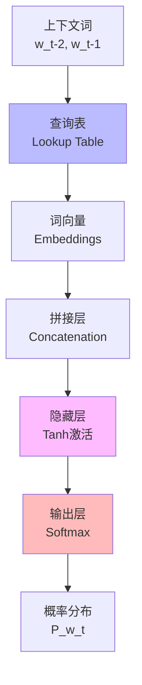

**数学流程：**
1. 输入上下文：$w_{t-n+1}, \ldots, w_{t-1}$
2. 查询词向量：$\mathbf{e}_{w_{t-n+1}}, \ldots, \mathbf{e}_{w_{t-1}}$
3. 拼接向量：$\mathbf{x} = [\mathbf{e}_{w_{t-n+1}}; \ldots; \mathbf{e}_{w_{t-1}}]$
4. 隐藏层计算：$\mathbf{h} = \tanh(W_h \mathbf{x} + \mathbf{b}_h)$
5. 输出层计算：$\mathbf{z} = W_o \mathbf{h} + \mathbf{b}_o$
6. Softmax归一化：$P(w_t | \text{context}) = \text{softmax}(\mathbf{z})$

---

## 五、查询表（Lookup Table）

### 5.1 核心概念

**定义：** 一个可学习的矩阵，存储所有词的向量表示（词嵌入）。

**数学表示：**
$$C \in \mathbb{R}^{|V| \times d}$$

其中：
- $|V|$：词表大小（如10,000）
- $d$：词向量维度（如100）

**结构示意：**

```
         维度1  维度2  维度3  ...  维度100
词1(我)    0.5    -0.3   0.8   ...   0.1
词2(爱)   -0.2     0.6   0.4   ...  -0.3
词3(吃)    0.8    -0.1   0.2   ...   0.5
...
词10000   0.3     0.4  -0.6   ...   0.2
```

### 5.2 查询过程

**输入：** 词的索引 $i$（整数）
**输出：** 词向量 $\mathbf{e}_i$（实数向量）

$$\mathbf{e}_i = C[i, :] \in \mathbb{R}^d$$

**例子：**
- 输入：词"吃"的索引 = 3
- 输出：$\mathbf{e}_{\text{吃}} = [0.8, -0.1, 0.2, \ldots, 0.5]$

**代码等价物（伪代码）：**
```python
embedding_matrix = [[...], [...], ...]  # |V| × d
word_index = 3  # "吃"
word_vector = embedding_matrix[word_index]  # 第3行
```

### 5.3 为什么叫"Lookup"？

**通俗理解：** 就像查字典！
- 输入：词的"页码"（索引）
- 输出：词的"释义"（向量）

**关键特性：**
- 初始：随机初始化
- 训练中：不断调整，学习每个词的最佳表示
- 结果：相似的词向量相近

---

## 六、接续词（Next Word）概率

### 6.1 目标

**任务：** 给定上下文 $w_{t-n+1}, \ldots, w_{t-1}$，预测下一个词 $w_t$ 的概率分布。

**数学表达：**
$$P(w_t = w | w_{t-n+1}, \ldots, w_{t-1})$$

对于词表中的每个词 $w$，都有一个概率值。

### 6.2 具体例子

**上下文：** "我 爱 吃"（假设n=3，看前2个词）
**目标：** 预测第4个词

**理想输出（概率分布）：**

| 候选词 | 概率 |
|--------|------|
| 苹果 | 0.25 |
| 香蕉 | 0.20 |
| 米饭 | 0.15 |
| 西瓜 | 0.10 |
| 汽车 | 0.001 |
| ... | ... |

**约束条件：**
$$\sum_{w \in V} P(w_t = w | \text{context}) = 1$$

---

## 七、双曲正切函数（Tanh Activation）

### 7.1 数学定义

$$\tanh(x) = \frac{e^x - e^{-x}}{e^x + e^{-x}} = \frac{e^{2x} - 1}{e^{2x} + 1}$$

**等价形式：**
$$\tanh(x) = 2\sigma(2x) - 1$$

其中 $\sigma(x) = \frac{1}{1+e^{-x}}$ 是sigmoid函数。

### 7.2 函数特性

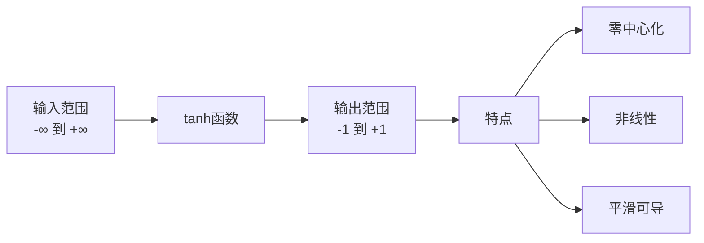

**关键点：**
- $\tanh(0) = 0$（零中心）
- $\tanh(+\infty) = 1$
- $\tanh(-\infty) = -1$
- $\tanh'(x) = 1 - \tanh^2(x)$（导数）

**图形示意：**
```
        tanh(x)
   1 |     ___---
     |   /
   0 |--/--------
     | /
  -1 |/
     +----------> x
    -5  0   5
```

### 7.3 在神经网络中的作用

**隐藏层计算：**
$$\mathbf{h} = \tanh(W_h \mathbf{x} + \mathbf{b}_h)$$

其中：
- $\mathbf{x} \in \mathbb{R}^{(n-1) \times d}$：拼接的上下文词向量
- $W_h \in \mathbb{R}^{m \times (n-1) \times d}$：权重矩阵
- $\mathbf{b}_h \in \mathbb{R}^m$：偏置
- $\mathbf{h} \in \mathbb{R}^m$：隐藏层输出

**逐元素应用：**
$$h_i = \tanh\left(\sum_{j} W_{h,ij} x_j + b_{h,i}\right)$$

**作用：**
1. **非线性变换：** 让网络能拟合复杂函数
2. **特征组合：** 融合上下文词的信息
3. **梯度传播：** 相比sigmoid，缓解梯度消失

**例子：**
```
输入向量 x = [0.5, -0.3, 0.8]
权重 W_h = [[1, -1, 0.5],
            [0.2, 0.3, -0.4]]
偏置 b_h = [0.1, -0.2]

线性变换：
z_1 = 1×0.5 + (-1)×(-0.3) + 0.5×0.8 + 0.1 = 1.2
z_2 = 0.2×0.5 + 0.3×(-0.3) + (-0.4)×0.8 - 0.2 = -0.51

激活：
h_1 = tanh(1.2) ≈ 0.834
h_2 = tanh(-0.51) ≈ -0.471

隐藏层输出 h = [0.834, -0.471]
```

---

## 八、Softmax及接续词预测

### 8.1 Softmax函数

**定义：** 将任意实数向量转换为概率分布

$$\text{softmax}(\mathbf{z})_i = \frac{e^{z_i}}{\sum_{j=1}^{|V|} e^{z_j}}$$

其中：
- $\mathbf{z} \in \mathbb{R}^{|V|}$：输出层的原始分数（logits）
- $\text{softmax}(\mathbf{z})_i$：词 $i$ 的预测概率

**性质：**
1. $\text{softmax}(\mathbf{z})_i \in (0, 1)$（每个值都是正的）
2. $\sum_{i=1}^{|V|} \text{softmax}(\mathbf{z})_i = 1$（归一化）

### 8.2 具体例子

**输出层分数（简化版，只有5个词）：**

| 词 | 原始分数 $z_i$ | $e^{z_i}$ | Softmax概率 |
|---|---|---|---|
| 苹果 | 2.5 | 12.18 | 0.54 |
| 香蕉 | 1.8 | 6.05 | 0.27 |
| 米饭 | 0.9 | 2.46 | 0.11 |
| 汽车 | -1.2 | 0.30 | 0.01 |
| 昨天 | -2.0 | 0.14 | 0.01 |

**计算过程：**
$$\sum e^{z_i} = 12.18 + 6.05 + 2.46 + 0.30 + 0.14 = 21.13$$

$$P(\text{苹果}) = \frac{e^{2.5}}{21.13} = \frac{12.18}{21.13} \approx 0.58$$

### 8.3 完整前向传播

**步骤1：查询词向量**
```
上下文："我" "爱" "吃"
→ e_我 = [0.5, -0.3, 0.8, ...]
→ e_爱 = [-0.2, 0.6, 0.4, ...]
→ e_吃 = [0.8, -0.1, 0.2, ...]
```

**步骤2：拼接**
$$\mathbf{x} = [\mathbf{e}_{\text{我}}; \mathbf{e}_{\text{爱}}; \mathbf{e}_{\text{吃}}] \in \mathbb{R}^{3d}$$

**步骤3：隐藏层**
$$\mathbf{h} = \tanh(W_h \mathbf{x} + \mathbf{b}_h) \in \mathbb{R}^m$$

**步骤4：输出层**
$$\mathbf{z} = W_o \mathbf{h} + \mathbf{b}_o \in \mathbb{R}^{|V|}$$

其中 $W_o \in \mathbb{R}^{|V| \times m}$

**步骤5：Softmax**
$$P(w_t = w_i | \text{context}) = \frac{e^{z_i}}{\sum_{j=1}^{|V|} e^{z_j}}$$

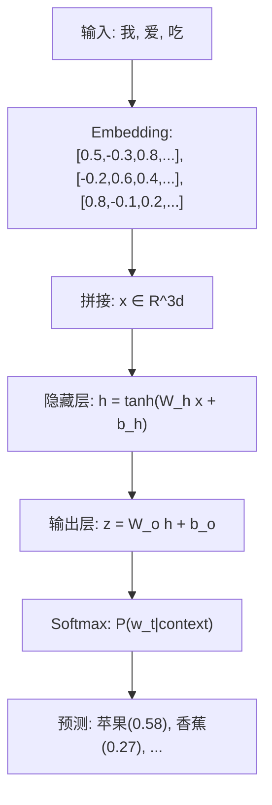

---

## 九、损失计算

### 9.1 训练目标

**目标：** 最大化正确词的预测概率

**给定训练样本：**
- 上下文：$w_{t-2}, w_{t-1}$ = "爱吃"
- 真实下一个词：$w_t^*$ = "苹果"

**希望：**
$$P(w_t = \text{苹果} | \text{爱, 吃}) \to 1$$

### 9.2 负对数似然（Negative Log-Likelihood）

**单个样本的损失：**
$$L = -\log P(w_t^* | w_{t-n+1}, \ldots, w_{t-1})$$

**为什么取负对数？**

1. **概率 → 损失：** 概率高 → 损失低
   - $P = 0.9 \to L = -\log(0.9) = 0.105$（损失小）
   - $P = 0.1 \to L = -\log(0.1) = 2.303$（损失大）

2. **数值稳定：** 避免概率相乘下溢

3. **可加性：** 多个样本的对数可以相加

**整个语料库的损失：**
$$\mathcal{L} = -\sum_{t=1}^{T} \log P(w_t | w_{t-n+1}, \ldots, w_{t-1})$$

### 9.3 具体例子

**训练数据：** "我 爱 吃 苹果"

**三个训练样本（trigram）：**

| 样本 | 上下文 | 目标词 | 预测概率 | 损失 |
|------|--------|--------|----------|------|
| 1 | [我] | 爱 | 0.7 | $-\log(0.7) = 0.36$ |
| 2 | [我, 爱] | 吃 | 0.6 | $-\log(0.6) = 0.51$ |
| 3 | [爱, 吃] | 苹果 | 0.8 | $-\log(0.8) = 0.22$ |

**总损失：**
$$\mathcal{L} = 0.36 + 0.51 + 0.22 = 1.09$$

---

## 十、交叉熵损失函数（Cross-Entropy Loss）

### 10.1 理论基础

**交叉熵定义：** 衡量两个概率分布的差异

$$H(p, q) = -\sum_{i} p_i \log q_i$$

其中：
- $p$：真实分布（真实标签）
- $q$：预测分布（模型输出）

### 10.2 在语言模型中的应用

**真实分布（one-hot）：**
$$p_i = \begin{cases} 1, & \text{if } i = w_t^* \text{ (正确词)} \\ 0, & \text{otherwise} \end{cases}$$

**预测分布：**
$$q_i = P(w_t = i | \text{context}) = \text{softmax}(\mathbf{z})_i$$

**交叉熵损失：**
$$L_{CE} = -\sum_{i=1}^{|V|} p_i \log q_i = -\log q_{w_t^*}$$

**解释：** 因为只有 $p_{w_t^*} = 1$，其他都是0，所以求和后只剩下正确词的项！

### 10.3 数值例子

**真实词：** "苹果"（索引=100）

**真实分布 $p$：**
```
p = [0, 0, ..., 0, 1, 0, ..., 0]
              位置100↑
```

**预测分布 $q$（Softmax输出）：**
```
q_1 = 0.01（词1）
q_2 = 0.02（词2）
...
q_100 = 0.58（苹果）← 正确词
...
q_10000 = 0.001（词10000）
```

**损失计算：**
$$L_{CE} = -\log(0.58) \approx 0.545$$

**如果预测更准确：**
$$q_{100} = 0.95 \to L_{CE} = -\log(0.95) \approx 0.051$$

### 10.4 梯度推导

**对输出层分数 $z_j$ 的梯度：**

$$\frac{\partial L_{CE}}{\partial z_j} = q_j - p_j = \begin{cases} q_j - 1, & \text{if } j = w_t^* \\ q_j, & \text{otherwise} \end{cases}$$

**直观解释：**
- 正确词：梯度 = 预测概率 - 1（负值，减小分数）
- 错误词：梯度 = 预测概率（正值，增大分数的负方向）

**例子：**
```
真实词：苹果（索引100）
预测：q_100 = 0.58，q_50 = 0.20

梯度：
∂L/∂z_100 = 0.58 - 1 = -0.42  ← 增大苹果的分数
∂L/∂z_50 = 0.20 - 0 = 0.20    ← 减小其他词的分数
```

---

## 十一、反向传播（Backpropagation）

### 11.1 核心思想

**目标：** 计算损失函数对所有参数的梯度

**参数列表：**
- 词嵌入矩阵：$C \in \mathbb{R}^{|V| \times d}$
- 隐藏层权重：$W_h, \mathbf{b}_h$
- 输出层权重：$W_o, \mathbf{b}_o$

**链式法则：**
$$\frac{\partial L}{\partial \theta} = \frac{\partial L}{\partial z} \cdot \frac{\partial z}{\partial h} \cdot \frac{\partial h}{\partial x} \cdot \frac{\partial x}{\partial \theta}$$

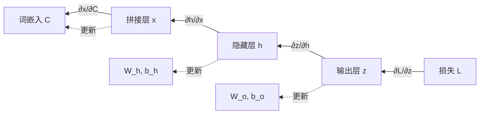

### 11.2 逐层梯度计算

**第1步：输出层梯度**

对 $W_o$ 的梯度：
$$\frac{\partial L}{\partial W_o} = \frac{\partial L}{\partial \mathbf{z}} \cdot \mathbf{h}^T$$

其中 $\frac{\partial L}{\partial \mathbf{z}} = [q_1 - p_1, q_2 - p_2, \ldots, q_{|V|} - p_{|V|}]$

**第2步：隐藏层梯度**

对 $W_h$ 的梯度：
$$\frac{\partial L}{\partial W_h} = \frac{\partial L}{\partial \mathbf{h}} \cdot \mathbf{x}^T$$

其中：
$$\frac{\partial L}{\partial \mathbf{h}} = W_o^T \frac{\partial L}{\partial \mathbf{z}} \odot (1 - \mathbf{h}^2)$$

（$\odot$ 是逐元素乘法，$(1 - \mathbf{h}^2)$ 是tanh的导数）

**第3步：词嵌入梯度**

对上下文词 $w_{t-1}$ 的嵌入向量：
$$\frac{\partial L}{\partial \mathbf{e}_{w_{t-1}}} = W_h^T \frac{\partial L}{\partial \mathbf{h}}$$

### 11.3 数值例子（简化）

**前向传播结果：**
```
x = [0.5, -0.3, 0.8]    (拼接的词向量)
h = [0.834, -0.471]     (隐藏层，tanh后)
z = [2.5, 1.8, 0.9, -1.2, -2.0]  (输出层，5个词)
q = [0.54, 0.27, 0.11, 0.01, 0.01]  (Softmax)
真实词：词1（苹果）
```

**反向传播：**

**输出层梯度：**
$$\frac{\partial L}{\partial \mathbf{z}} = [0.54-1, 0.27-0, 0.11-0, 0.01-0, 0.01-0]$$
$$= [-0.46, 0.27, 0.11, 0.01, 0.01]$$

**隐藏层梯度（假设 $W_o$ 是2×5矩阵）：**
$$\frac{\partial L}{\partial \mathbf{h}} = W_o^T \cdot \begin{bmatrix} -0.46 \\ 0.27 \\ 0.11 \\ 0.01 \\ 0.01 \end{bmatrix} \odot [1 - 0.834^2, 1 - (-0.471)^2]$$

**词嵌入梯度：**
每个上下文词的向量都会得到一个梯度，用于更新。

---

## 十二、参数优化

### 12.1 梯度下降法

**核心公式：**
$$\theta^{(t+1)} = \theta^{(t)} - \eta \frac{\partial L}{\partial \theta}$$

其中：
- $\theta$：参数（如 $W_h, W_o, C$）
- $\eta$：学习率（如0.01）
- $t$：迭代轮次

### 12.2 随机梯度下降（SGD）

**算法流程：**

```
for epoch in 1 to N:
    for 每个训练样本 (context, target):
        1. 前向传播：计算预测概率
        2. 计算损失：L = -log P(target|context)
        3. 反向传播：计算梯度
        4. 更新参数：θ = θ - η * ∇L
```

**小批量SGD（Mini-batch SGD）：**
- 每次用一批样本（如32个）
- 平均梯度后更新
- 平衡速度与稳定性

### 12.3 优化器

**常用优化器：**

1. **SGD：**
   $$\theta \leftarrow \theta - \eta \nabla L$$

2. **Momentum：**
   $$v \leftarrow \beta v + \nabla L$$
   $$\theta \leftarrow \theta - \eta v$$

3. **Adam（最常用）：**
   $$m \leftarrow \beta_1 m + (1-\beta_1) \nabla L$$
   $$v \leftarrow \beta_2 v + (1-\beta_2) (\nabla L)^2$$
   $$\theta \leftarrow \theta - \eta \frac{m}{\sqrt{v} + \epsilon}$$

**通俗理解：**
- SGD：直接沿着梯度走
- Momentum：加入"惯性"，加速收敛
- Adam：自适应学习率，每个参数有不同的更新速度

### 12.4 学习率调度

**策略：**

1. **固定学习率：** $\eta = 0.01$

2. **衰减：** $\eta_t = \eta_0 \cdot 0.9^{t/1000}$

3. **Warm-up + Decay：**
   ```
   阶段1：线性增加（0 → η_max）
   阶段2：余弦衰减（η_max → η_min）
   ```

**例子：**
```
初始：η = 0.001
第1000步：η = 0.01
第10000步：η = 0.005
第50000步：η = 0.0001
```

---

## 十三、神经语言模型总结

### 13.1 完整训练流程

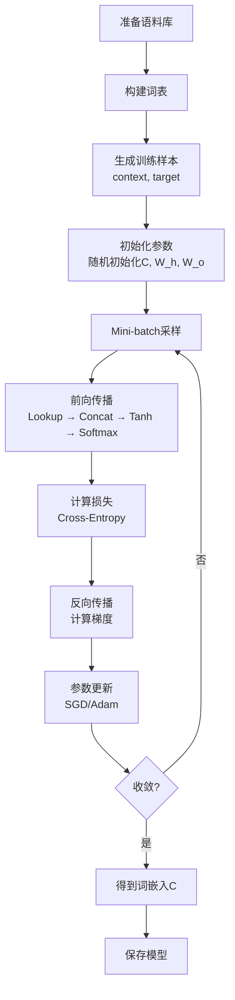

### 13.2 模型优势

**与N-gram相比：**

| 特性    | N-gram | 神经语言模型  |      |     |     |                               |     |     |
| ----- | ------ | ------- | ---- | --- | --- | ----------------------------- | --- | --- |
| 参数量   | $O(    | V       | ^n)$ | $O( | V   | \cdot d + d \cdot m + m \cdot | V   | )$  |
| 泛化能力  | 差      | 强       |      |     |     |                               |     |     |
| 未登录词  | 无法处理   | 可学习相似表示 |      |     |     |                               |     |     |
| 长距离依赖 | 不支持    | 部分支持    |      |     |     |                               |     |     |

**核心创新：**
1. **词嵌入：** 自动学习词的稠密表示
2. **参数共享：** 相似词共享统计强度
3. **平滑：** 自然地对未见n-gram泛化

---

## 十四、神经语言模型的挑战

### 14.1 计算复杂度高

**瓶颈：Softmax层**

$$P(w_t | \text{context}) = \frac{e^{z_{w_t}}}{\sum_{w \in V} e^{z_w}}$$

**问题：** 分母需要对整个词表求和！

**复杂度：**
- 前向传播：$O(|V| \cdot m)$（输出层矩阵乘法）
- 反向传播：$O(|V| \cdot m)$（梯度计算）

**当 $|V| = 100,000$ 时：**
- 每个样本需要计算10万个词的分数
- 训练100万样本 → $10^{11}$ 次计算！

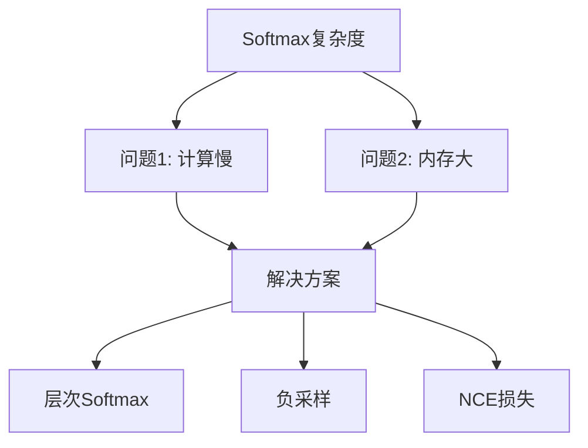

### 14.2 解决方案预告

**1. 层次Softmax（Hierarchical Softmax）**
- 用树结构代替平坦分类
- 复杂度：$O(\log |V|)$

**2. 负采样（Negative Sampling）**
- 不计算所有词，只采样少量负样本
- 复杂度：$O(k)$，$k$ 是采样数（如5-20）

**3. NCE（Noise Contrastive Estimation）**
- 将问题转化为二分类
- 区分真实词 vs 噪声词

### 14.3 长距离依赖问题

**问题：** 前馈网络只能看固定窗口

**例子：**
```
句子："昨天我在超市买了很多新鲜的水果，今天打算做个____"

前馈NNLM（窗口=3）只看：
"打算" "做" "个" → 预测下一个词

无法利用"水果"这个关键信息！
```

**解决方向：**
- 循环神经网络（RNN）
- 长短期记忆网络（LSTM）
- Transformer

### 14.4 训练数据需求大

**挑战：**
- 需要大规模语料库（GB级文本）
- 训练时间长（天到周）
- 计算资源需求高（GPU/TPU）

**例子：**
- 小数据集（1MB）：效果差，过拟合
- 中等数据集（100MB）：效果一般
- 大数据集（10GB）：效果好

**实践经验：**
```
数据量 ∝ 模型性能
10× 数据 ≈ 2× 性能提升
```

### 14.5 可解释性差

**问题：** 词向量是黑盒

**疑问：**
- 为什么"king"的向量是[0.5, -0.3, 0.8, ...]？
- 每个维度代表什么含义？

**部分解释方法：**
- 可视化（t-SNE, PCA）
- 类比任务（king - man + woman ≈ queen）
- 最近邻分析

---

## 总结：从统计到神经的进化

### 进化链条


### 核心贡献

**神经语言模型的历史意义：**

1. **首次提出词嵌入：** 开创了分布式词表示的先河

2. **端到端学习：** 不需要手工特征工程

3. **参数共享：** 解决数据稀疏问题

4. **为深度学习NLP铺路：** 影响了后续所有模型

**关键论文：**
- Bengio et al. (2003): *A Neural Probabilistic Language Model*
- Mikolov et al. (2013): *Efficient Estimation of Word Representations*（Word2Vec）

### 实践要点

**训练技巧：**
1. 预处理：小写化、去停用词、词频过滤
2. 初始化：Xavier或He初始化
3. 正则化：Dropout（防止过拟合）
4. 批归一化：加速训练
5. 早停：验证集性能不提升时停止

**超参数：**
- 词向量维度 $d$：50-300
- 隐藏层大小 $m$：100-500
- 学习率 $\eta$：0.001-0.01
- 批大小：32-256
- 上下文窗口 $n$：3-5

---

# 词嵌入与 Word2Vec 详解

## 一、词嵌入 (Word Embeddings)

### 1.1 核心概念回顾

我们在上一节讲过，**词嵌入**就是将高维、稀疏的离散词（One-hot）映射到一个低维、稠密的连续向量空间。

**本质：** 学习一个映射函数 $f: V \to \mathbb{R}^d$，其中 $V$ 是词表，$d$ 是向量维度（通常是50~300）。

### 1.2 为什么叫"Embedding"（嵌入）？

想象一张巨大的二维纸（高维空间），上面稀疏地撒满了点（词）。"嵌入"就像是把这张纸揉成一团（流形学习），或者找到一个更紧凑的低维空间，把这些点"嵌"进去，同时保持它们之间的相对位置关系（语义相似度）。

---

## 二、Word2Vec：由简入繁

**Word2Vec** 不是一个单一的算法，而是一组用于生成词嵌入的模型架构，由 Google 的 Mikolov 等人在 2013 年提出。

**核心假设（分布式假设）：**
上下文相似的词，其语义也相似。

**两个典型模型：**
1.  **CBOW (Continuous Bag-of-Words)：** 连续词袋模型
2.  **Skip-gram：** 跳字模型

在深入模型之前，先理解数据是如何准备的。

---

## 三、滑动窗口 (Sliding Window)

### 3.1 什么是滑动窗口？

为了让神经网络学习，我们需要把文本变成成对的训练样本。滑动窗口就是产生这些样本的机制。

**定义：** 一个固定大小的窗口在文本序列上移动，窗口内的中心词和周围词构成训练数据。

### 3.2 滑动窗口示例

**句子：** "The quick brown fox jumps over the lazy dog"
**窗口大小 (Window Size)：** 2 (即中心词左右各看2个词)

| 步骤 | 窗口位置 | 中心词 (Target) | 上下文词 (Context) | 训练样本 (Input, Output) |
| :--- | :--- | :--- | :--- | :--- |
| 1 | [**The**, quick, brown] fox ... | The | quick, brown | (The, quick), (The, brown) |
| 2 | [The, **quick**, brown, fox] jumps ... | quick | The, brown, fox | (quick, The), (quick, brown), (quick, fox) |
| 3 | ... [The, quick, **brown**, fox, jumps] ... | brown | The, quick, fox, jumps | (brown, The), (brown, quick), ... |

**注意：**
*   如果是 CBOW，输入是Context，预测Target。
*   如果是 Skip-gram，输入是Target，预测Context。

---

## 四、连续词袋模型 (CBOW)

### 4.1 核心思想

**任务：** 根据周围的词（上下文），填空中间的词。

**例子：** "The quick \_\_\_\_\_ fox jumps" -> 预测 "brown"

**"Bag-of-Words"（词袋）的含义：**
在输入层，我们把上下文所有词的向量加起来（或取平均）。在这个过程中，**词序信息丢失了**（"quick brown" 和 "brown quick" 加起来是一样的），就像把词扔进一个袋子里一样，所以叫"词袋"。

### 4.2 模型架构

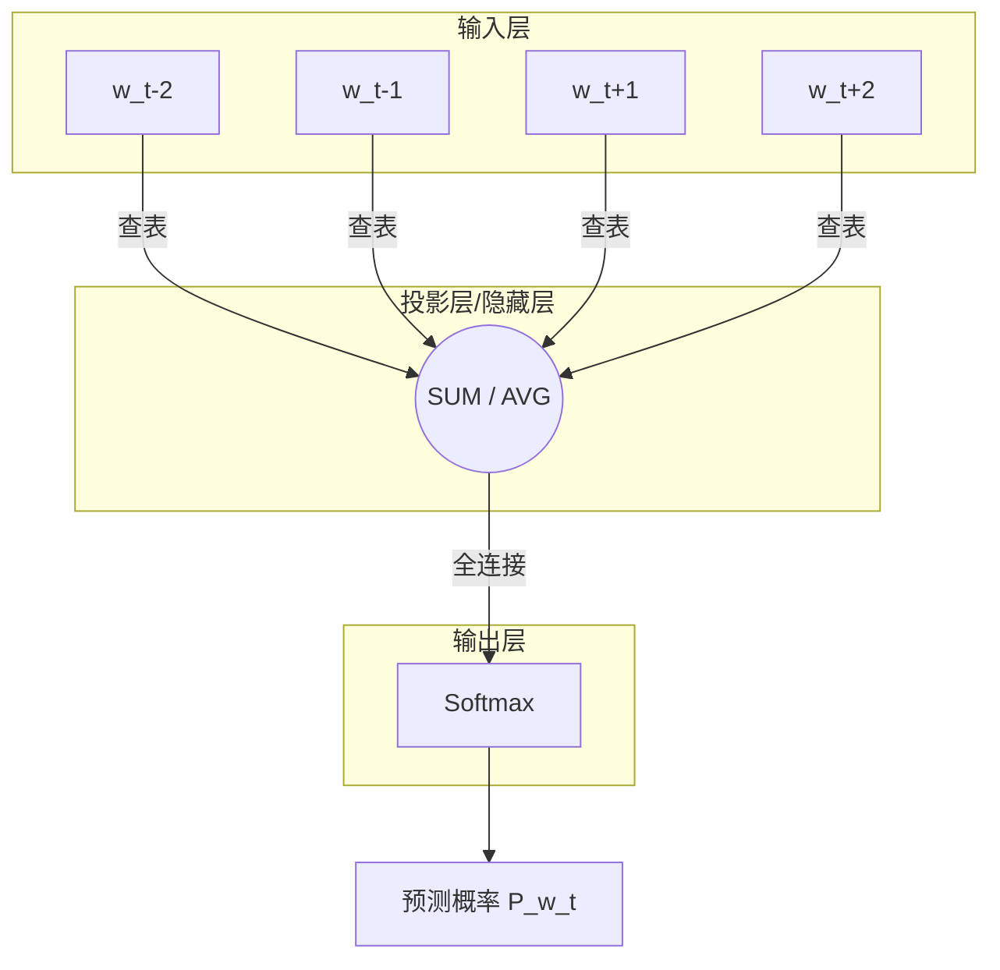

**数学过程：**
1.  **输入：** 上下文词的 One-hot 向量。
2.  **查表（Projection）：** 得到上下文词向量 $v_{c1}, v_{c2}, \dots, v_{c2m}$。
3.  **聚合：** 求平均向量 $\hat{v} = \frac{1}{2m} \sum_{i=1}^{2m} v_{ci}$。
4.  **输出计算：** $z = U \hat{v}$ （$U$ 是输出矩阵）。
5.  **概率：** $y = \text{softmax}(z)$。
6.  **损失：** 最小化真实中心词的交叉熵损失。

---

## 五、Skip-gram 模型

### 5.1 核心思想

**任务：** 给定一个中心词，预测它周围可能出现的词。

**例子：** 给定 "brown"，预测 "quick", "fox", "The"。

**直观理解：** Skip-gram 试图让中心词能够"生成"它的上下文。这比 CBOW 更难，但在处理生僻词时效果往往更好。

### 5.2 模型架构

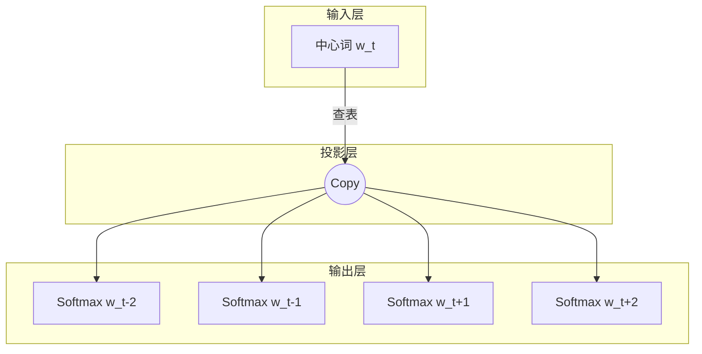

**数学过程：**
1.  **输入：** 中心词 $w_t$ 的向量 $v_t$。
2.  **输出：** 计算预测每个上下文词的概率。
    $$P(w_{t+j} | w_t) = \text{softmax}(u_{t+j}^T v_t)$$
    这里 $u$ 是输出权重矩阵中的向量，$v$ 是输入矩阵中的向量。
3.  **损失：** 上下文窗口内所有词的预测损失之和。

---

## 六、CBOW 与 Skip-gram 的对比

| 特性 | CBOW (连续词袋) | Skip-gram (跳字模型) |
| :--- | :--- | :--- |
| **输入** | 上下文 (Context) | 中心词 (Target) |
| **输出** | 中心词 (Target) | 上下文 (Context) |
| **速度** | 快 (只需计算一次平均) | 慢 (每个上下文词都要算一次) |
| **生僻词** | 效果一般 (平滑掉了) | **效果好** (专门训练每个配对) |
| **准确率** | 语法任务较好 | 语义任务较好 |
| **适用场景** | 大规模语料快速训练 | 小规模语料、追求高质量向量 |

---

## 七、完全 Softmax 存在的问题

### 7.1 计算瓶颈

无论是 CBOW 还是 Skip-gram，最后一层都是 Softmax：

$$P(w_O | w_I) = \frac{\exp(v'_{w_O}{}^T v_{w_I})}{\sum_{w=1}^{V} \exp(v'_w{}^T v_{w_I})}$$

**问题所在：** 分母 $\sum_{w=1}^{V}$ 需要遍历整个词表！
*   假设词表 $V = 100,000$。
*   每预测一个词，都要算 10 万次指数和加法。
*   训练几十亿个词的语料，计算量是天文数字，完全不可行。

**解决方案：** 近似计算（Approximation）。
1.  负采样 (Negative Sampling)
2.  分级 Softmax (Hierarchical Softmax)

---

## 八、负采样 (Negative Sampling)

### 8.1 核心思想

**把"多分类问题"转化为"二分类问题"。**

*   **原问题：** 从 10 万个词里选出正确的那个词（太难）。
*   **新问题：**
    *   这是一对真实的 (中心词, 上下文词) 吗？ -> YES (正样本)
    *   这是一对 (中心词, 随机噪声词) 吗？ -> NO (负样本)

### 8.2 怎么做？

对于每个正样本 $(w, c)$（例如：brown, fox）：
1.  **正样本：** 目标是最大化概率 $\sigma(u_c^T v_w)$。
2.  **负样本：** 随机抽取 $K$ 个词（例如 5 个）作为"噪声"（如：apple, car, run...），这些词大概率不是真正的上下文。
3.  **目标：** 最小化这些负样本的概率，即最大化 $\sigma(-u_{neg}^T v_w)$。

**损失函数：**
$$J = -\log \sigma(u_c^T v_w) - \sum_{k=1}^{K} \log \sigma(-u_{neg_k}^T v_w)$$

**优点：**
每次只需要更新 $1 + K$ 个向量（例如 1+5=6 个），而不是 10 万个！**效率提升成千上万倍。**

---

## 九、分级 Softmax (Hierarchical Softmax)

### 9.1 核心思想

利用 **哈夫曼树 (Huffman Tree)** 结构来代替扁平的 Softmax 层。

### 9.2 结构图解

```mermaid
graph TD
    R((Root)) --> N1((Node 1))
    R --> N2((Node 2))
    N1 --> N3((Node 3))
    N1 --> L1[词: Apple]
    N2 --> L2[词: Banana]
    N3 --> L3[词: Cat]
    N3 --> L4[词: Dog]
```

*   **叶子节点：** 词表中的所有词。
*   **内部节点：** 包含一个向量参数（逻辑回归分类器）。

### 9.3 预测过程

要计算 $P(\text{Dog} | \text{Context})$：
1.  从根节点出发，向下走。
2.  在每个内部节点，做一个二分类判断（向左走还是向右走？）。
3.  概率 = 路径上所有二分类概率的乘积。

**复杂度：**
从 $O(V)$ 降低到 $O(\log_2 V)$（树的深度）。
如果是 10 万个词，只需要计算约 16-17 次，而不是 10 万次。

**高频词优化：** 哈夫曼树会将高频词（如 the, a）放在离根节点近的地方，路径更短，计算更快。

---

## 十、其他词嵌入的技巧

为了让 Word2Vec 效果更好，还有一些实用 Trick：

1.  **高频词重采样 (Subsampling of Frequent Words)：**
    *   像 "the", "is", "a" 出现频率太高，包含信息量少。
    *   以一定概率丢弃这些词，公式：$P(w_i) = 1 - \sqrt{\frac{t}{f(w_i)}}$。
    *   效果：扩大了上下文窗口的有效范围，加速训练。

2.  **动态窗口 (Dynamic Context Window)：**
    *   设定最大窗口 $L=5$。
    *   实际训练时，随机选择一个 $R \in [1, L]$ 作为当前窗口大小。
    *   效果：离中心词越近的词，被选中的概率越高，权重越大（符合直觉）。

---

## 十一、其他词向量模型：GloVe

### 11.1 Word2Vec 的局限

*   Word2Vec 是基于**局部**滑动窗口的，没有直接利用整个语料库的**全局统计信息**。

### 11.2 GloVe (Global Vectors for Word Representation)

斯坦福大学提出的一种结合了**矩阵分解**（全局统计）和**浅层窗口**（局部上下文）优点的方法。

**核心思想：**
词向量的点积应该等于它们共现概率的对数。

$$w_i^T w_j + b_i + b_j = \log X_{ij}$$

*   $X_{ij}$：词 $i$ 和词 $j$ 在整个语料库中共同出现的次数。
*   $w_i, w_j$：词向量。

**损失函数：**
$$J = \sum_{i,j=1}^{V} f(X_{ij}) (w_i^T w_j + b_i + b_j - \log X_{ij})^2$$

*   $f(X_{ij})$ 是一个权重函数，避免低频共现（噪音）影响太大，也不让高频共现主导。

**GloVe vs Word2Vec：**
*   **GloVe：** 训练快，更容易并行化，适合小语料，倾向于捕捉共现关系。
*   **Word2Vec：** 预测任务表现通常更好，特别是捕捉类比关系。
*   两者在实际应用中效果往往不相上下。

---

## 十二、词嵌入的评估

模型训练好了，怎么知道向量好不好？

### 12.1 评估任务一：类比推理 (Analogy Reasoning)

这是 Word2Vec 最著名的评估方式。

**形式：** "A is to B as C is to ?"
**数学计算：** 寻找向量 $x$，使得 $x \approx w_B - w_A + w_C$。

**经典例子：**
*   **语义类比：**
    *   $Beijing - China + Japan \approx Tokyo$
    *   $Man - King + Queen \approx Woman$
*   **句法类比：**
    *   $Apple - Apples + Cars \approx Car$
    *   $Slow - Slower + Faster \approx Fast$

**准确率：** 看计算出的向量 $x$ 最接近的词是否是标准答案。

### 12.2 评估任务二：词相似度 (Word Similarity)

**方法：**
1.  **人工数据集：** 语言学家给每对词打分（例如：WordSim-353 数据集）。
    *   (tiger, cat) -> 8.5/10
    *   (tiger, book) -> 0.1/10
2.  **模型计算：** 计算词向量的余弦相似度 (Cosine Similarity)。
3.  **对比：** 计算"模型排名"与"人工排名"的相关系数（Spearman/Pearson Correlation）。

**相关系数越高，说明词向量越符合人类的认知。**

---

### 总结

这一章节我们从**词嵌入**的概念出发，详细拆解了 **Word2Vec** 的两大神器 **CBOW** 和 **Skip-gram**。

*   我们明白了**滑动窗口**是训练数据的来源。
*   我们发现了完全 Softmax 的计算黑洞，并用**负采样**和**分级 Softmax** 巧妙解决了它。
*   我们了解了 **GloVe** 如何利用全局统计信息。
*   最后，我们介绍了如何通过**类比推理**和**相似度**来给词向量打分。

# 神经网络基础详解

## 一、神经元（Neuron）

### 1.1 生物学启发

**神经元**是神经网络最基础的计算单元，灵感来源于生物大脑中的神经细胞。

**生物神经元结构：**
```mermaid
graph LR
    A[树突<br/>Dendrites] -->|接收信号| B[细胞体<br/>Soma]
    B -->|处理信号| C[轴突<br/>Axon]
    C -->|传递信号| D[突触<br/>Synapse]
    D --> E[下一个神经元]
```

**关键对应：**
- **树突** → 输入层（接收多个信号）
- **细胞体** → 加权求和 + 激活
- **轴突** → 输出（传递处理后的信号）
- **突触** → 权重（连接强度）

### 1.2 人工神经元的数学模型

**核心公式：**
$$y = f\left(\sum_{i=1}^{n} w_i x_i + b\right) = f(w^T x + b)$$

**符号说明：**
- $x_i$：第 $i$ 个输入特征
- $w_i$：第 $i$ 个权重（weight）
- $b$：偏置项（bias）
- $f(\cdot)$：激活函数（activation function）
- $y$：输出

```mermaid
graph LR
    subgraph 输入
    X1[x_1]
    X2[x_2]
    X3[x_3]
    X4[x_n]
    end

    subgraph 神经元
    S((Σ))
    A[激活函数 f]
    end

    subgraph 输出
    Y[y]
    end

    X1 -->|w_1| S
    X2 -->|w_2| S
    X3 -->|w_3| S
    X4 -->|w_n| S
    S -->|z = Σw_i x_i + b| A
    A --> Y
```

### 1.3 具体例子

**任务：** 判断一个学生是否会通过考试

**输入特征：**
- $x_1 = 0.8$（学习时长，归一化后）
- $x_2 = 0.6$（作业完成率）
- $x_3 = 0.3$（缺勤率，越高越不好）

**权重和偏置（假设已训练好）：**
- $w_1 = 2.0$（学习时长很重要）
- $w_2 = 1.5$（作业也重要）
- $w_3 = -3.0$（缺勤率负相关）
- $b = -0.5$

**计算过程：**

**步骤1：加权求和**
$$z = w_1 x_1 + w_2 x_2 + w_3 x_3 + b$$
$$z = 2.0 \times 0.8 + 1.5 \times 0.6 + (-3.0) \times 0.3 + (-0.5)$$
$$z = 1.6 + 0.9 - 0.9 - 0.5 = 1.1$$

**步骤2：激活函数（使用Sigmoid）**
$$y = \sigma(z) = \frac{1}{1 + e^{-z}} = \frac{1}{1 + e^{-1.1}} \approx 0.75$$

**结果解释：** 有 75% 的概率通过考试。

---

## 二、神经网络（Neural Network）

### 2.1 从单个神经元到网络

**单个神经元**的局限：
- 只能学习**线性可分**的问题
- 例如：AND、OR 门可以学，但 XOR（异或）不行

**解决方案：** 将多个神经元组合成**层**（Layer），再将多层堆叠。

### 2.2 三层神经网络结构

```mermaid
graph LR
    subgraph 输入层
    I1((x_1))
    I2((x_2))
    I3((x_3))
    end

    subgraph 隐藏层
    H1((h_1))
    H2((h_2))
    H3((h_3))
    H4((h_4))
    end

    subgraph 输出层
    O1((y_1))
    O2((y_2))
    end

    I1 --> H1
    I1 --> H2
    I1 --> H3
    I1 --> H4
    I2 --> H1
    I2 --> H2
    I2 --> H3
    I2 --> H4
    I3 --> H1
    I3 --> H2
    I3 --> H3
    I3 --> H4

    H1 --> O1
    H1 --> O2
    H2 --> O1
    H2 --> O2
    H3 --> O1
    H3 --> O2
    H4 --> O1
    H4 --> O2
```

**术语：**
- **输入层（Input Layer）：** 接收原始特征，不做计算
- **隐藏层（Hidden Layer）：** 中间的计算层，可以有多层
- **输出层（Output Layer）：** 产生最终预测结果

**全连接（Fully Connected）：** 每一层的每个神经元都与下一层的所有神经元相连。

### 2.3 层的数学表示

**第 $l$ 层的计算：**
$$\mathbf{z}^{(l)} = W^{(l)} \mathbf{a}^{(l-1)} + \mathbf{b}^{(l)}$$
$$\mathbf{a}^{(l)} = f^{(l)}(\mathbf{z}^{(l)})$$

**符号说明：**
- $\mathbf{a}^{(l)}$：第 $l$ 层的激活值（activation）
- $W^{(l)}$：第 $l$ 层的权重矩阵
- $\mathbf{b}^{(l)}$：第 $l$ 层的偏置向量
- $f^{(l)}$：第 $l$ 层的激活函数
- $\mathbf{z}^{(l)}$：第 $l$ 层的线性组合结果（未激活）

---

## 三、矩阵标识（Matrix Notation）

### 3.1 为什么要用矩阵？

**原因：**
1. **简洁：** 一行公式代替成百上千个标量计算
2. **高效：** 利用 GPU/TPU 的并行计算能力
3. **易于实现：** 现代深度学习框架（PyTorch, TensorFlow）都基于矩阵运算

### 3.2 单层的矩阵形式

**假设：**
- 输入维度：$n_{in} = 3$
- 输出维度（神经元数）：$n_{out} = 4$

**权重矩阵：**
$$W \in \mathbb{R}^{n_{out} \times n_{in}} = \begin{bmatrix} w_{11} & w_{12} & w_{13} \\ w_{21} & w_{22} & w_{23} \\ w_{31} & w_{32} & w_{33} \\ w_{41} & w_{42} & w_{43} \end{bmatrix}$$

**输入向量：**
$$\mathbf{x} \in \mathbb{R}^{n_{in}} = \begin{bmatrix} x_1 \\ x_2 \\ x_3 \end{bmatrix}$$

**偏置向量：**
$$\mathbf{b} \in \mathbb{R}^{n_{out}} = \begin{bmatrix} b_1 \\ b_2 \\ b_3 \\ b_4 \end{bmatrix}$$

**矩阵乘法：**
$$\mathbf{z} = W \mathbf{x} + \mathbf{b}$$

**展开形式：**
$$\begin{bmatrix} z_1 \\ z_2 \\ z_3 \\ z_4 \end{bmatrix} = \begin{bmatrix} w_{11} & w_{12} & w_{13} \\ w_{21} & w_{22} & w_{23} \\ w_{31} & w_{32} & w_{33} \\ w_{41} & w_{42} & w_{43} \end{bmatrix} \begin{bmatrix} x_1 \\ x_2 \\ x_3 \end{bmatrix} + \begin{bmatrix} b_1 \\ b_2 \\ b_3 \\ b_4 \end{bmatrix}$$

**每个神经元的计算：**
$$z_1 = w_{11}x_1 + w_{12}x_2 + w_{13}x_3 + b_1$$
$$z_2 = w_{21}x_1 + w_{22}x_2 + w_{23}x_3 + b_2$$
$$\vdots$$

### 3.3 批量处理（Batch Processing）

**处理多个样本（如32个）：**

**输入矩阵：**
$$X \in \mathbb{R}^{B \times n_{in}}$$
其中 $B$ 是批量大小（batch size）

**输出矩阵：**
$$Z = X W^T + \mathbf{b}$$

**维度变化：**
$$(B \times n_{in}) \times (n_{in} \times n_{out}) = (B \times n_{out})$$

**例子：**
```python
# B=32 个样本，每个样本 n_in=3 维
X = torch.randn(32, 3)

# 权重矩阵：4个神经元，每个接收3个输入
W = torch.randn(4, 3)
b = torch.randn(4)

# 计算
Z = X @ W.T + b  # 结果形状：(32, 4)
```

---

## 四、多层神经网络（Multi-layer Neural Network）

### 4.1 深度网络的定义

**深度神经网络（DNN）：** 包含2层或更多隐藏层的网络。

**典型结构：**
```
输入层 → 隐藏层1 → 隐藏层2 → ... → 隐藏层N → 输出层
```

### 4.2 层的命名与编号

**约定：**
- 输入层：第 0 层（$l=0$）
- 第一个隐藏层：第 1 层（$l=1$）
- 输出层：第 $L$ 层（$l=L$）

**参数表示：**
- $n^{[l]}$：第 $l$ 层的神经元数量
- $W^{[l]}$：第 $l$ 层的权重矩阵，形状 $(n^{[l]}, n^{[l-1]})$
- $\mathbf{b}^{[l]}$：第 $l$ 层的偏置向量，形状 $(n^{[l]}, 1)$

### 4.3 具体例子：三层网络

**网络架构：**
- 输入：2个特征（$n^{[0]} = 2$）
- 隐藏层1：4个神经元（$n^{[1]} = 4$）
- 隐藏层2：3个神经元（$n^{[2]} = 3$）
- 输出：1个神经元（$n^{[3]} = 1$）

**参数维度：**

| 层 | 权重矩阵 $W$ | 偏置向量 $\mathbf{b}$ | 参数总数 |
|---|---|---|---|
| Layer 1 | $(4, 2)$ | $(4, 1)$ | $4 \times 2 + 4 = 12$ |
| Layer 2 | $(3, 4)$ | $(3, 1)$ | $3 \times 4 + 3 = 15$ |
| Layer 3 | $(1, 3)$ | $(1, 1)$ | $1 \times 3 + 1 = 4$ |

**总参数：** $12 + 15 + 4 = 31$

---

## 五、前馈计算（Forward Propagation）

### 5.1 定义

**前馈计算**是指信号从输入层单向传播到输出层的过程，不存在反向或循环连接。

### 5.2 逐层计算流程

**第 $l$ 层的计算步骤：**

1. **线性变换（Affine Transformation）：**
   $$\mathbf{z}^{[l]} = W^{[l]} \mathbf{a}^{[l-1]} + \mathbf{b}^{[l]}$$

2. **非线性激活（Activation）：**
   $$\mathbf{a}^{[l]} = f^{[l]}(\mathbf{z}^{[l]})$$

**初始条件：**
$$\mathbf{a}^{[0]} = \mathbf{x} \quad \text{（输入特征）}$$

**最终输出：**
$$\hat{y} = \mathbf{a}^{[L]} \quad \text{（预测值）}$$

### 5.3 完整前馈计算示例

**网络：** 2 → 3 → 2 → 1

**输入：**
$$\mathbf{x} = \begin{bmatrix} 0.5 \\ 0.3 \end{bmatrix}$$

**Layer 1（隐藏层1）：**
$$W^{[1]} = \begin{bmatrix} 0.2 & -0.1 \\ 0.4 & 0.3 \\ -0.3 & 0.5 \end{bmatrix}, \quad \mathbf{b}^{[1]} = \begin{bmatrix} 0.1 \\ -0.2 \\ 0.3 \end{bmatrix}$$

$$\mathbf{z}^{[1]} = W^{[1]} \mathbf{x} + \mathbf{b}^{[1]} = \begin{bmatrix} 0.2 \times 0.5 + (-0.1) \times 0.3 + 0.1 \\ 0.4 \times 0.5 + 0.3 \times 0.3 - 0.2 \\ -0.3 \times 0.5 + 0.5 \times 0.3 + 0.3 \end{bmatrix} = \begin{bmatrix} 0.17 \\ 0.09 \\ 0.45 \end{bmatrix}$$

$$\mathbf{a}^{[1]} = \text{ReLU}(\mathbf{z}^{[1]}) = \begin{bmatrix} 0.17 \\ 0.09 \\ 0.45 \end{bmatrix}$$

**Layer 2（隐藏层2）：**
$$W^{[2]} = \begin{bmatrix} 0.5 & 0.3 & -0.2 \\ -0.1 & 0.4 & 0.6 \end{bmatrix}, \quad \mathbf{b}^{[2]} = \begin{bmatrix} 0.2 \\ -0.1 \end{bmatrix}$$

$$\mathbf{z}^{[2]} = W^{[2]} \mathbf{a}^{[1]} + \mathbf{b}^{[2]}$$

**计算细节（第一个神经元）：**
$$z_1^{[2]} = 0.5 \times 0.17 + 0.3 \times 0.09 + (-0.2) \times 0.45 + 0.2 = 0.222$$

$$\mathbf{a}^{[2]} = \text{ReLU}(\mathbf{z}^{[2]}) = \begin{bmatrix} 0.222 \\ 0.318 \end{bmatrix}$$

**Layer 3（输出层）：**
$$W^{[3]} = \begin{bmatrix} 0.8 & -0.4 \end{bmatrix}, \quad b^{[3]} = 0.1$$

$$z^{[3]} = 0.8 \times 0.222 + (-0.4) \times 0.318 + 0.1 = 0.151$$

$$\hat{y} = a^{[3]} = \sigma(z^{[3]}) = \frac{1}{1 + e^{-0.151}} \approx 0.538$$

**流程图：**
```mermaid
graph LR
    A[输入 x] -->|W1, b1| B[z1]
    B -->|ReLU| C[a1]
    C -->|W2, b2| D[z2]
    D -->|ReLU| E[a2]
    E -->|W3, b3| F[z3]
    F -->|Sigmoid| G[输出 y_hat]
```

---

## 六、非线性函数（Activation Function）

### 6.1 为什么需要激活函数？

**核心问题：** 如果没有激活函数会怎样？

**没有激活函数的网络：**
$$\mathbf{z}^{[1]} = W^{[1]} \mathbf{x} + \mathbf{b}^{[1]}$$
$$\mathbf{z}^{[2]} = W^{[2]} \mathbf{z}^{[1]} + \mathbf{b}^{[2]}$$
$$\mathbf{z}^{[2]} = W^{[2]} (W^{[1]} \mathbf{x} + \mathbf{b}^{[1]}) + \mathbf{b}^{[2]}$$
$$\mathbf{z}^{[2]} = (W^{[2]} W^{[1]}) \mathbf{x} + (W^{[2]} \mathbf{b}^{[1]} + \mathbf{b}^{[2]})$$
$$\mathbf{z}^{[2]} = W' \mathbf{x} + \mathbf{b}'$$

**结论：** 多层线性变换等价于单层线性变换！**无论多少层，都只能拟合线性函数。**

**激活函数的作用：** 引入**非线性**，让网络能够学习复杂的非线性关系。

### 6.2 经典激活函数

#### **1. Sigmoid 函数**

**公式：**
$$\sigma(x) = \frac{1}{1 + e^{-x}}$$

**导数：**
$$\sigma'(x) = \sigma(x) \cdot (1 - \sigma(x))$$

**特点：**
- 输出范围：$(0, 1)$
- 可解释为概率
- **缺点：**
  - **梯度消失**（gradient vanishing）：当 $|x|$ 很大时，梯度接近0
  - 输出不以0为中心

**图形：**
```
   σ(x)
1  |        ___---
   |     /
0.5|----●--------
   |   /
0  |--/
   +-----------> x
  -5  0   5
```

**使用场景：** 二分类问题的输出层

---

#### **2. Tanh 函数**

**公式：**
$$\tanh(x) = \frac{e^x - e^{-x}}{e^x + e^{-x}} = 2\sigma(2x) - 1$$

**导数：**
$$\tanh'(x) = 1 - \tanh^2(x)$$

**特点：**
- 输出范围：$(-1, 1)$
- **零中心化**（zero-centered）
- 梯度比Sigmoid稍好，但仍有梯度消失问题

**图形：**
```
  tanh(x)
1  |     ___---
   |   /
0  |--●--------
   | /
-1 |/
   +-----------> x
  -5  0   5
```

**使用场景：** RNN/LSTM 的内部门控

---

#### **3. ReLU（Rectified Linear Unit）**

**公式：**
$$\text{ReLU}(x) = \max(0, x) = \begin{cases} x, & x > 0 \\ 0, & x \leq 0 \end{cases}$$

**导数：**
$$\text{ReLU}'(x) = \begin{cases} 1, & x > 0 \\ 0, & x \leq 0 \end{cases}$$

**特点：**
- **计算简单**（只需比较和选择）
- **缓解梯度消失**（正区域梯度恒为1）
- **稀疏激活**（约50%的神经元输出0）
- **缺点：** "神经元死亡"（Dead ReLU）问题

**图形：**
```
  ReLU(x)
   |    /
   |   /
   |  /
   | /
   |/
---●-----------> x
   0
```

**使用场景：** 深度网络的隐藏层（**最常用**）

---

#### **4. Leaky ReLU**

**公式：**
$$\text{Leaky ReLU}(x) = \begin{cases} x, & x > 0 \\ \alpha x, & x \leq 0 \end{cases}$$

通常 $\alpha = 0.01$

**改进点：** 解决"死亡ReLU"问题，负区域有小的梯度

---

#### **5. ELU（Exponential Linear Unit）**

**公式：**
$$\text{ELU}(x) = \begin{cases} x, & x > 0 \\ \alpha (e^x - 1), & x \leq 0 \end{cases}$$

**特点：** 平滑曲线，输出均值接近0，但计算稍慢

---

#### **6. GELU（Gaussian Error Linear Unit）**

**公式：**
$$\text{GELU}(x) = x \cdot \Phi(x)$$

其中 $\Phi(x)$ 是标准正态分布的累积分布函数。

**近似形式：**
$$\text{GELU}(x) \approx 0.5x \left(1 + \tanh\left[\sqrt{\frac{2}{\pi}}(x + 0.044715x^3)\right]\right)$$

**特点：** Transformer（如BERT、GPT）的默认激活函数

---

### 6.3 激活函数对比表

| 激活函数 | 输出范围 | 梯度消失 | 计算复杂度 | 零中心 | 主要应用 |
|---|---|---|---|---|---|
| **Sigmoid** | $(0, 1)$ | ✗（严重） | 中 | ✗ | 二分类输出 |
| **Tanh** | $(-1, 1)$ | ✗（中等） | 中 | ✓ | RNN/LSTM |
| **ReLU** | $[0, +\infty)$ | ✓ | 低 | ✗ | CNN/深度网络 |
| **Leaky ReLU** | $(-\infty, +\infty)$ | ✓ | 低 | ✗ | 深度网络 |
| **GELU** | $(-\infty, +\infty)$ | ✓ | 中 | ✗ | Transformer |

---

## 七、非线性函数的选择

### 7.1 选择原则

**根据层的位置：**

**隐藏层：**
- **首选 ReLU**（计算快，效果好）
- 如果遇到"死亡ReLU"，换 Leaky ReLU 或 ELU
- Transformer 系列用 GELU

**输出层：**
- **二分类：** Sigmoid
- **多分类：** Softmax
- **回归任务：** 线性（无激活函数）或 ReLU（输出非负）

### 7.2 实践建议

**默认选择：**
```python
# 隐藏层
hidden = torch.nn.ReLU()(linear_output)

# 输出层（分类）
output = torch.nn.Softmax(dim=-1)(logits)

# 输出层（回归）
output = logits  # 不加激活
```

**调参技巧：**
1. 先用 ReLU 跑通
2. 如果效果不好，尝试 GELU 或 Leaky ReLU
3. 观察训练曲线，判断是否梯度消失（loss 不下降）

---

## 八、为什么要多层？

### 8.1 表达能力的提升

**理论结果（万能近似定理）：**
> 一个具有足够多神经元的**单隐藏层**网络可以逼近任何连续函数。

**那为什么还要多层？**

**原因1：效率**
- 单层网络可能需要指数级的神经元数量
- 多层网络用更少的参数就能表达相同复杂度的函数

**例子：** 计算 $x_1 \oplus x_2 \oplus \cdots \oplus x_n$（n位异或）
- **单层网络：** 需要 $2^n$ 个神经元
- **多层网络：** 只需要 $O(n)$ 个神经元

---

### 8.2 层次化特征学习

**深度网络的自动特征提取：**

```mermaid
graph TD
    A[原始输入<br/>像素] --> B[低层特征<br/>边缘、纹理]
    B --> C[中层特征<br/>局部形状、部件]
    C --> D[高层特征<br/>物体、场景]
    D --> E[输出<br/>类别标签]
```

**具体例子（图像识别）：**
- **第1层：** 检测边缘（水平、垂直、对角线）
- **第2层：** 组合成简单形状（圆形、矩形）
- **第3层：** 识别物体部件（眼睛、鼻子、轮子）
- **第4层：** 识别完整物体（人脸、汽车）

**类比人类认知：**
```
看到图片 → 注意到边缘 → 识别形状 → 理解物体 → 知道是什么
```

---

### 8.3 非线性组合能力

**多层的威力：**

**单层：**
$$y = f(W_1 x + b_1)$$
只能学习**一次非线性变换**

**两层：**
$$y = f_2(W_2 f_1(W_1 x + b_1) + b_2)$$
可以学习**复合非线性变换**

**多层：**
$$y = f_L(W_L f_{L-1}(\cdots f_1(W_1 x + b_1) \cdots) + b_L)$$
每增加一层，表达空间呈指数增长！

---

### 8.4 实验证据

**图像分类任务（ImageNet）：**

| 网络深度 | Top-5 错误率 | 年份 |
|---|---|---|
| AlexNet（8层） | 16.4% | 2012 |
| VGG（19层） | 7.3% | 2014 |
| ResNet（152层） | 3.57% | 2015 |
| EfficientNet（深+宽） | 2.9% | 2019 |

**趋势：** 更深的网络 → 更好的性能（在有足够数据和技巧的前提下）

---

## 九、总结

### 9.1 核心概念回顾

**神经元：** 最小计算单元
$$y = f\left(\sum w_i x_i + b\right)$$

**神经网络：** 神经元的层次化组织
$$\mathbf{a}^{[l]} = f^{[l]}(W^{[l]} \mathbf{a}^{[l-1]} + \mathbf{b}^{[l]})$$

**前馈计算：** 信息从输入到输出的单向传播

**激活函数：** 引入非线性的关键
- **隐藏层首选：** ReLU
- **输出层：** 根据任务选择（Sigmoid/Softmax/Linear）

**多层的意义：**
1. 提高参数效率
2. 自动学习层次化特征
3. 增强非线性表达能力

---

### 9.2 关键公式速查

**单个神经元：**
$$y = f(w^T x + b)$$

**矩阵形式（批量）：**
$$Z = XW^T + b$$

**逐层前馈：**
$$\mathbf{z}^{[l]} = W^{[l]} \mathbf{a}^{[l-1]} + \mathbf{b}^{[l]}$$
$$\mathbf{a}^{[l]} = f^{[l]}(\mathbf{z}^{[l]})$$

**常用激活函数：**
- ReLU: $\max(0, x)$
- Sigmoid: $\frac{1}{1+e^{-x}}$
- Tanh: $\frac{e^x - e^{-x}}{e^x + e^{-x}}$

---

### 9.3 实践检查清单

**设计网络时问自己：**
- [ ] 输入维度是多少？
- [ ] 需要几个隐藏层？（先从1-2层开始）
- [ ] 每层多少神经元？（通常递减：512 → 256 → 128）
- [ ] 用什么激活函数？（隐藏层 ReLU，输出层看任务）
- [ ] 参数总量是多少？（避免过拟合）

**调试网络时检查：**
- [ ] 梯度是否消失/爆炸？（检查梯度范数）
- [ ] 训练损失是否下降？（如果不降，可能学习率不对）
- [ ] 验证损失是否过拟合？（如果是，加正则化）

---

### 9.4 下一步学习方向

现在你已经掌握了前馈神经网络的基础。接下来可以学习：

1. **反向传播算法：** 如何计算梯度并更新参数
2. **优化算法：** SGD、Adam、学习率调度
3. **正则化技术：** Dropout、Batch Normalization、权重衰减
4. **卷积神经网络（CNN）：** 处理图像
5. **循环神经网络（RNN/LSTM）：** 处理序列
6. **Transformer：** 现代NLP的基石

**恭喜你完成了神经网络基础的学习！** 🎉

---

# 神经网络训练详解

## 一、目标函数（Objective Function）

### 1.1 什么是目标函数？

**定义：** 目标函数（也叫损失函数、代价函数）量化了模型预测与真实值之间的差距。

**核心思想：** 训练神经网络就是找到一组参数 $\theta$，使得目标函数最小。

$$\theta^* = \arg\min_{\theta} \mathcal{L}(\theta)$$

**通俗理解：**
- 目标函数像一个"成绩表"，告诉我们模型表现有多差
- 训练过程就是不断调整参数，让"成绩"越来越好（损失越来越小）

### 1.2 常见损失函数

#### **1. 均方误差（MSE - Mean Squared Error）**

**适用：** 回归任务

**公式：**
$$\mathcal{L}_{MSE} = \frac{1}{N} \sum_{i=1}^{N} (y_i - \hat{y}_i)^2$$

**例子：** 预测房价
```
真实值: y = [200, 300, 250]  (万元)
预测值: ŷ = [210, 280, 260]
误差²: [(10)², (-20)², (10)²] = [100, 400, 100]
MSE = (100 + 400 + 100) / 3 = 200
```

**特点：**
- 对异常值敏感（误差平方会放大）
- 可微，便于优化

---

#### **2. 交叉熵损失（Cross-Entropy Loss）**

**适用：** 分类任务

**二分类：**
$$\mathcal{L}_{CE} = -\frac{1}{N} \sum_{i=1}^{N} \left[y_i \log(\hat{y}_i) + (1-y_i)\log(1-\hat{y}_i)\right]$$

**多分类：**
$$\mathcal{L}_{CE} = -\frac{1}{N} \sum_{i=1}^{N} \sum_{c=1}^{C} y_{i,c} \log(\hat{y}_{i,c})$$

其中 $y_{i,c}$ 是one-hot编码，$\hat{y}_{i,c}$ 是softmax输出的概率。

**例子：** 三分类问题
```
真实标签: y = [0, 1, 0]  (第2类)
预测概率: ŷ = [0.1, 0.7, 0.2]

Loss = -(0×log(0.1) + 1×log(0.7) + 0×log(0.2))
     = -log(0.7)
     ≈ 0.357
```

**如果预测更准确：**
```
预测概率: ŷ = [0.05, 0.9, 0.05]
Loss = -log(0.9) ≈ 0.105  (更小！)
```

---

#### **3. Hinge Loss（SVM损失）**

**适用：** 二分类（特别是支持向量机）

**公式：**
$$\mathcal{L}_{Hinge} = \frac{1}{N} \sum_{i=1}^{N} \max(0, 1 - y_i \cdot \hat{y}_i)$$

其中 $y_i \in \{-1, +1\}$

---

### 1.3 总体目标函数

**完整形式（包含正则化）：**
$$\mathcal{L}(\theta) = \frac{1}{N} \sum_{i=1}^{N} \ell(y_i, f(x_i; \theta)) + \lambda R(\theta)$$

**组成部分：**
- $\ell(\cdot)$：样本损失（如MSE、交叉熵）
- $R(\theta)$：正则化项（防止过拟合）
- $\lambda$：正则化系数

**常见正则化：**
- **L2正则（权重衰减）：** $R(\theta) = \frac{1}{2}\|\theta\|^2 = \frac{1}{2}\sum \theta_i^2$
- **L1正则：** $R(\theta) = \|\theta\|_1 = \sum |\theta_i|$

---

## 二、随机梯度下降（SGD - Stochastic Gradient Descent）

### 2.1 梯度下降的直觉

**想象场景：** 你在一个山谷里（损失函数的曲面），目标是找到最低点（最小损失）。

```mermaid
graph TD
    A[当前位置<br/>高损失] -->|沿着最陡下降方向| B[下一个位置<br/>较低损失]
    B -->|继续下降| C[更低位置]
    C -->|重复迭代| D[谷底<br/>最小损失]
```

**核心思想：**
1. 计算当前位置的坡度（梯度）
2. 沿着坡度的反方向迈一小步
3. 重复直到到达谷底

### 2.2 梯度下降的数学形式

**参数更新规则：**
$$\theta_{t+1} = \theta_t - \eta \nabla_{\theta} \mathcal{L}(\theta_t)$$

**符号说明：**
- $\theta_t$：第 $t$ 步的参数
- $\eta$：学习率（步长）
- $\nabla_{\theta} \mathcal{L}$：损失函数对参数的梯度

### 2.3 三种梯度下降变体

#### **1. 批量梯度下降（Batch GD）**

**每次使用全部数据计算梯度：**
$$\theta_{t+1} = \theta_t - \eta \nabla_{\theta} \left[\frac{1}{N}\sum_{i=1}^{N} \ell(y_i, f(x_i; \theta_t))\right]$$

**优点：** 梯度准确，收敛稳定
**缺点：** 计算慢，内存占用大

---

#### **2. 随机梯度下降（Stochastic GD）**

**每次只用一个样本计算梯度：**
$$\theta_{t+1} = \theta_t - \eta \nabla_{\theta} \ell(y_i, f(x_i; \theta_t))$$

**优点：** 更新快，可以在线学习
**缺点：** 梯度噪声大，收敛不稳定

---

#### **3. 小批量梯度下降（Mini-batch GD）⭐**

**每次用一小批样本（如32个）计算梯度：**
$$\theta_{t+1} = \theta_t - \eta \nabla_{\theta} \left[\frac{1}{B}\sum_{i \in \mathcal{B}} \ell(y_i, f(x_i; \theta_t))\right]$$

**优点：** 平衡了速度和稳定性，最常用
**批量大小选择：** 通常是32, 64, 128, 256

---

### 2.4 学习率的选择

**学习率过大：**
```
损失曲线：震荡或发散
    ↑
    |    /\  /\
    |   /  \/  \
    +------------→ 迭代次数
```

**学习率过小：**
```
损失曲线：收敛太慢
    ↑
    |\___________
    |
    +------------→ 迭代次数
```

**合适的学习率：**
```
损失曲线：平稳下降
    ↑
    |\
    | \___
    |     \___
    +------------→ 迭代次数
```

**经验值：**
- Adam优化器：$\eta = 0.001$ 或 $0.0001$
- SGD：$\eta = 0.01$ 或 $0.1$

---

## 三、梯度（Gradient）

### 3.1 标量函数的梯度

**定义：** 梯度是函数相对于其所有输入变量的偏导数组成的向量。

**单变量函数：**
$$f(x) = x^2 + 3x + 5$$
$$\frac{df}{dx} = 2x + 3$$

**多变量函数：**
$$f(x_1, x_2) = x_1^2 + 3x_1 x_2 + x_2^2$$

**梯度：**
$$\nabla f = \begin{bmatrix} \frac{\partial f}{\partial x_1} \\ \frac{\partial f}{\partial x_2} \end{bmatrix} = \begin{bmatrix} 2x_1 + 3x_2 \\ 3x_1 + 2x_2 \end{bmatrix}$$

### 3.2 梯度的几何意义

**梯度方向：** 函数增长最快的方向
**梯度大小：** 函数变化率

```mermaid
graph TD
    A[等高线图] --> B[梯度垂直于等高线]
    B --> C[指向函数值增大的方向]
    C --> D[优化时沿负梯度方向]
```

**例子：** 二维函数 $f(x, y) = x^2 + y^2$

```
    y
    ↑
    |    圆形等高线
    | ◯◯◯◯◯
    |◯     ◯
    ◯  ●→  ◯  梯度指向外
    |◯     ◯
    | ◯◯◯◯◯
    +-------→ x
        ●是最小值点
```

在点 $(2, 1)$：
$$\nabla f = \begin{bmatrix} 2x \\ 2y \end{bmatrix} = \begin{bmatrix} 4 \\ 2 \end{bmatrix}$$

梯度指向 $(4, 2)$ 方向，所以要往 $(-4, -2)$ 方向移动才能下降。

---

## 四、Jacobian矩阵：梯度的计算

### 4.1 向量函数的导数

**问题：** 如果函数输入是向量，输出也是向量，怎么求导？

**向量函数：**
$$\mathbf{f}: \mathbb{R}^n \to \mathbb{R}^m$$
$$\mathbf{f}(\mathbf{x}) = \begin{bmatrix} f_1(x_1, \ldots, x_n) \\ f_2(x_1, \ldots, x_n) \\ \vdots \\ f_m(x_1, \ldots, x_n) \end{bmatrix}$$

### 4.2 Jacobian矩阵定义

**Jacobian矩阵：** 所有偏导数组成的矩阵

$$J = \frac{\partial \mathbf{f}}{\partial \mathbf{x}} = \begin{bmatrix} \frac{\partial f_1}{\partial x_1} & \frac{\partial f_1}{\partial x_2} & \cdots & \frac{\partial f_1}{\partial x_n} \\ \frac{\partial f_2}{\partial x_1} & \frac{\partial f_2}{\partial x_2} & \cdots & \frac{\partial f_2}{\partial x_n} \\ \vdots & \vdots & \ddots & \vdots \\ \frac{\partial f_m}{\partial x_1} & \frac{\partial f_m}{\partial x_2} & \cdots & \frac{\partial f_m}{\partial x_n} \end{bmatrix}$$

**维度：** $J \in \mathbb{R}^{m \times n}$

**每一行：** 一个输出分量对所有输入的偏导数
**每一列：** 所有输出分量对一个输入的偏导数

---

## 五、链式法则（Chain Rule）

### 5.1 单变量链式法则

**复合函数：**
$$y = f(g(x))$$

**导数：**
$$\frac{dy}{dx} = \frac{dy}{dg} \cdot \frac{dg}{dx}$$

**例子：**
$$y = (3x + 2)^2$$

令 $g(x) = 3x + 2$，则 $y = g^2$

$$\frac{dy}{dx} = \frac{dy}{dg} \cdot \frac{dg}{dx} = 2g \cdot 3 = 2(3x+2) \cdot 3 = 6(3x+2)$$

### 5.2 多变量链式法则

**复合函数：**
$$z = f(y_1, y_2), \quad y_1 = g_1(x_1, x_2), \quad y_2 = g_2(x_1, x_2)$$

**对 $x_1$ 的偏导数：**
$$\frac{\partial z}{\partial x_1} = \frac{\partial z}{\partial y_1} \cdot \frac{\partial y_1}{\partial x_1} + \frac{\partial z}{\partial y_2} \cdot \frac{\partial y_2}{\partial x_1}$$

**矩阵形式（Jacobian）：**
$$\frac{\partial z}{\partial \mathbf{x}} = \frac{\partial z}{\partial \mathbf{y}} \cdot \frac{\partial \mathbf{y}}{\partial \mathbf{x}}$$

---

## 六、Jacobian计算样例

### 6.1 简单例子

**函数：**
$$\mathbf{f}(\mathbf{x}) = \begin{bmatrix} x_1^2 + x_2 \\ x_1 x_2 \end{bmatrix}, \quad \mathbf{x} = \begin{bmatrix} x_1 \\ x_2 \end{bmatrix}$$

**Jacobian矩阵：**
$$J = \begin{bmatrix} \frac{\partial f_1}{\partial x_1} & \frac{\partial f_1}{\partial x_2} \\ \frac{\partial f_2}{\partial x_1} & \frac{\partial f_2}{\partial x_2} \end{bmatrix} = \begin{bmatrix} 2x_1 & 1 \\ x_2 & x_1 \end{bmatrix}$$

**在点 $(x_1, x_2) = (3, 2)$ 处：**
$$J = \begin{bmatrix} 6 & 1 \\ 2 & 3 \end{bmatrix}$$

### 6.2 神经网络中的例子

**前向传播：**
$$\mathbf{z} = W\mathbf{x} + \mathbf{b}$$
$$\mathbf{a} = \sigma(\mathbf{z})$$

**计算 $\frac{\partial \mathbf{a}}{\partial \mathbf{x}}$：**

**步骤1：** $\frac{\partial \mathbf{z}}{\partial \mathbf{x}} = W$

**步骤2：** $\frac{\partial \mathbf{a}}{\partial \mathbf{z}}$ 是对角矩阵
$$\frac{\partial \mathbf{a}}{\partial \mathbf{z}} = \text{diag}(\sigma'(z_1), \sigma'(z_2), \ldots, \sigma'(z_n))$$

**步骤3：** 链式法则
$$\frac{\partial \mathbf{a}}{\partial \mathbf{x}} = \frac{\partial \mathbf{a}}{\partial \mathbf{z}} \cdot \frac{\partial \mathbf{z}}{\partial \mathbf{x}} = \text{diag}(\sigma'(\mathbf{z})) \cdot W$$

---

## 七、神经网络梯度计算

### 7.1 需要计算的梯度

**参数：**
- 权重 $W^{[l]}$
- 偏置 $\mathbf{b}^{[l]}$

**目标：** 计算 $\frac{\partial \mathcal{L}}{\partial W^{[l]}}$ 和 $\frac{\partial \mathcal{L}}{\partial \mathbf{b}^{[l]}}$

### 7.2 三层网络的完整例子

**网络结构：**
$$\mathbf{a}^{[0]} = \mathbf{x}$$
$$\mathbf{z}^{[1]} = W^{[1]}\mathbf{a}^{[0]} + \mathbf{b}^{[1]}$$
$$\mathbf{a}^{[1]} = \text{ReLU}(\mathbf{z}^{[1]})$$
$$\mathbf{z}^{[2]} = W^{[2]}\mathbf{a}^{[1]} + \mathbf{b}^{[2]}$$
$$\mathbf{a}^{[2]} = \text{softmax}(\mathbf{z}^{[2]})$$
$$\mathcal{L} = -\sum y_i \log(a_i^{[2]})$$

**需要计算：**
$$\frac{\partial \mathcal{L}}{\partial W^{[2]}}, \frac{\partial \mathcal{L}}{\partial \mathbf{b}^{[2]}}, \frac{\partial \mathcal{L}}{\partial W^{[1]}}, \frac{\partial \mathcal{L}}{\partial \mathbf{b}^{[1]}}$$

---

## 八、反向传播（Backpropagation）

### 8.1 核心思想

**问题：** 直接计算梯度效率低（重复计算）

**解决方案：** 利用链式法则，从输出层向输入层**反向传播**梯度。

**关键洞察：**
后面层的梯度可以通过前面层的梯度计算得到，避免重复！

```mermaid
graph RL
    A[损失 L] -->|∂L/∂a3| B[输出层 a3]
    B -->|∂a3/∂z3| C[z3]
    C -->|∂z3/∂a2| D[隐藏层 a2]
    D -->|∂a2/∂z2| E[z2]
    E -->|∂z2/∂W1| F[权重 W1]

    style A fill:#f99
    style F fill:#9f9
```

### 8.2 反向传播算法步骤

**前向传播（Forward Pass）：**
1. 计算每一层的 $\mathbf{z}^{[l]}$ 和 $\mathbf{a}^{[l]}$
2. 保存中间结果（用于反向传播）
3. 计算损失 $\mathcal{L}$

**反向传播（Backward Pass）：**
1. 计算输出层梯度：$\frac{\partial \mathcal{L}}{\partial \mathbf{a}^{[L]}}$
2. 逐层向前传播梯度：
   $$\frac{\partial \mathcal{L}}{\partial \mathbf{z}^{[l]}} = \frac{\partial \mathcal{L}}{\partial \mathbf{a}^{[l]}} \odot f'(\mathbf{z}^{[l]})$$
   $$\frac{\partial \mathcal{L}}{\partial W^{[l]}} = \frac{\partial \mathcal{L}}{\partial \mathbf{z}^{[l]}} \cdot (\mathbf{a}^{[l-1]})^T$$
   $$\frac{\partial \mathcal{L}}{\partial \mathbf{b}^{[l]}} = \frac{\partial \mathcal{L}}{\partial \mathbf{z}^{[l]}}$$
   $$\frac{\partial \mathcal{L}}{\partial \mathbf{a}^{[l-1]}} = (W^{[l]})^T \cdot \frac{\partial \mathcal{L}}{\partial \mathbf{z}^{[l]}}$$

**参数更新：**
$$W^{[l]} \leftarrow W^{[l]} - \eta \frac{\partial \mathcal{L}}{\partial W^{[l]}}$$
$$\mathbf{b}^{[l]} \leftarrow \mathbf{b}^{[l]} - \eta \frac{\partial \mathcal{L}}{\partial \mathbf{b}^{[l]}}$$

---

## 九、计算图（Computational Graph）

### 9.1 什么是计算图？

**定义：** 用有向图表示数学运算的流程，节点是操作，边是数据流。

**例子：** 计算 $f(x, y) = (x + y) \times (y + 2)$

```mermaid
graph LR
    X((x)) --> A[+]
    Y((y)) --> A
    Y --> B[+]
    C((2)) --> B
    A --> D[×]
    B --> D
    D --> F((f))
```

**前向传播：** 从输入到输出计算值
**反向传播：** 从输出到输入计算梯度

### 9.2 计算图的反向传播

**具体数值例子：** $x=3, y=4$

**前向传播：**
```
x = 3 ─┐
       ├─→ a = x+y = 7 ─┐
y = 4 ─┼─→ b = y+2 = 6 ─┼─→ f = a×b = 42
       └───────────────┘
```

**反向传播（梯度）：**
```
∂f/∂f = 1

∂f/∂a = b = 6
∂f/∂b = a = 7

∂f/∂x = ∂f/∂a × ∂a/∂x = 6 × 1 = 6
∂f/∂y = ∂f/∂a × ∂a/∂y + ∂f/∂b × ∂b/∂y
      = 6 × 1 + 7 × 1 = 13
```

**图示：**
```mermaid
graph RL
    F((f<br/>∂=1)) -->|∂f/∂a=6| A[a<br/>∂=6]
    F -->|∂f/∂b=7| B[b<br/>∂=7]
    A -->|∂a/∂x=1| X((x<br/>∂=6))
    A -->|∂a/∂y=1| Y1[y累加器]
    B -->|∂b/∂y=1| Y1
    Y1 --> Y((y<br/>∂=13))
```

---

## 十、反向传播：单节点

### 10.1 常见操作的梯度

#### **1. 加法节点**
$$z = x + y$$

**前向：** $z = x + y$
**反向：**
$$\frac{\partial z}{\partial x} = 1, \quad \frac{\partial z}{\partial y} = 1$$

**梯度分配：** 上游梯度平等传给两个输入

#### **2. 乘法节点**
$$z = x \times y$$

**前向：** $z = xy$
**反向：**
$$\frac{\partial z}{\partial x} = y, \quad \frac{\partial z}{\partial y} = x$$

**梯度分配：** 上游梯度乘以另一个输入

#### **3. 最大值节点**
$$z = \max(x, y)$$

**前向：** $z = \max(x, y)$
**反向：**
$$\frac{\partial z}{\partial x} = \begin{cases} 1, & x > y \\ 0, & x \leq y \end{cases}$$

**梯度分配：** 只传给较大的输入

#### **4. ReLU节点**
$$y = \max(0, x)$$

**前向：** $y = \text{ReLU}(x)$
**反向：**
$$\frac{\partial y}{\partial x} = \begin{cases} 1, & x > 0 \\ 0, & x \leq 0 \end{cases}$$

**梯度分配：** 负数输入梯度为0（"死亡"）

### 10.2 矩阵乘法节点

**前向：**
$$Y = XW$$

其中 $X \in \mathbb{R}^{B \times n}, W \in \mathbb{R}^{n \times m}, Y \in \mathbb{R}^{B \times m}$

**反向：**
$$\frac{\partial \mathcal{L}}{\partial X} = \frac{\partial \mathcal{L}}{\partial Y} \cdot W^T$$
$$\frac{\partial \mathcal{L}}{\partial W} = X^T \cdot \frac{\partial \mathcal{L}}{\partial Y}$$

**维度检查：**
- $\frac{\partial \mathcal{L}}{\partial X}$: $(B \times m) \times (m \times n) = (B \times n)$ ✓
- $\frac{\partial \mathcal{L}}{\partial W}$: $(n \times B) \times (B \times m) = (n \times m)$ ✓

---

## 十一、完整例子

### 11.1 问题设置

**任务：** 二分类问题
**网络：** 2层，结构为 2 → 3 → 1

**输入：** $\mathbf{x} = \begin{bmatrix} 0.5 \\ 0.8 \end{bmatrix}$
**真实标签：** $y = 1$

**参数（简化初始化）：**
$$W^{[1]} = \begin{bmatrix} 0.1 & 0.2 \\ 0.3 & 0.4 \\ 0.5 & 0.6 \end{bmatrix}, \quad \mathbf{b}^{[1]} = \begin{bmatrix} 0.1 \\ 0.2 \\ 0.3 \end{bmatrix}$$

$$W^{[2]} = \begin{bmatrix} 0.7 & 0.8 & 0.9 \end{bmatrix}, \quad b^{[2]} = 0.1$$

### 11.2 前向传播

**Layer 1：**
$$\mathbf{z}^{[1]} = W^{[1]}\mathbf{x} + \mathbf{b}^{[1]} = \begin{bmatrix} 0.1 \times 0.5 + 0.2 \times 0.8 + 0.1 \\ 0.3 \times 0.5 + 0.4 \times 0.8 + 0.2 \\ 0.5 \times 0.5 + 0.6 \times 0.8 + 0.3 \end{bmatrix} = \begin{bmatrix} 0.31 \\ 0.67 \\ 1.03 \end{bmatrix}$$

$$\mathbf{a}^{[1]} = \text{ReLU}(\mathbf{z}^{[1]}) = \begin{bmatrix} 0.31 \\ 0.67 \\ 1.03 \end{bmatrix}$$

**Layer 2：**
$$z^{[2]} = W^{[2]}\mathbf{a}^{[1]} + b^{[2]} = 0.7 \times 0.31 + 0.8 \times 0.67 + 0.9 \times 1.03 + 0.1 = 1.761$$

$$a^{[2]} = \sigma(z^{[2]}) = \frac{1}{1+e^{-1.761}} \approx 0.853$$

**损失：**
$$\mathcal{L} = -[y\log(a^{[2]}) + (1-y)\log(1-a^{[2]})] = -\log(0.853) \approx 0.159$$

### 11.3 反向传播

**输出层梯度：**
$$\frac{\partial \mathcal{L}}{\partial a^{[2]}} = -\frac{y}{a^{[2]}} + \frac{1-y}{1-a^{[2]}} = -\frac{1}{0.853} \approx -1.172$$

**实际上，对于sigmoid + 交叉熵，有简化公式：**
$$\frac{\partial \mathcal{L}}{\partial z^{[2]}} = a^{[2]} - y = 0.853 - 1 = -0.147$$

**Layer 2 参数梯度：**
$$\frac{\partial \mathcal{L}}{\partial W^{[2]}} = \frac{\partial \mathcal{L}}{\partial z^{[2]}} \cdot (\mathbf{a}^{[1]})^T = -0.147 \times \begin{bmatrix} 0.31 & 0.67 & 1.03 \end{bmatrix}$$
$$= \begin{bmatrix} -0.046 & -0.098 & -0.151 \end{bmatrix}$$

$$\frac{\partial \mathcal{L}}{\partial b^{[2]}} = -0.147$$

**传递到Layer 1：**
$$\frac{\partial \mathcal{L}}{\partial \mathbf{a}^{[1]}} = (W^{[2]})^T \cdot \frac{\partial \mathcal{L}}{\partial z^{[2]}} = \begin{bmatrix} 0.7 \\ 0.8 \\ 0.9 \end{bmatrix} \times (-0.147) = \begin{bmatrix} -0.103 \\ -0.118 \\ -0.132 \end{bmatrix}$$

**ReLU梯度（所有激活值>0，梯度直接传递）：**
$$\frac{\partial \mathcal{L}}{\partial \mathbf{z}^{[1]}} = \frac{\partial \mathcal{L}}{\partial \mathbf{a}^{[1]}} \odot \text{ReLU}'(\mathbf{z}^{[1]}) = \begin{bmatrix} -0.103 \\ -0.118 \\ -0.132 \end{bmatrix}$$

**Layer 1 参数梯度：**
$$\frac{\partial \mathcal{L}}{\partial W^{[1]}} = \frac{\partial \mathcal{L}}{\partial \mathbf{z}^{[1]}} \cdot \mathbf{x}^T = \begin{bmatrix} -0.103 \\ -0.118 \\ -0.132 \end{bmatrix} \times \begin{bmatrix} 0.5 & 0.8 \end{bmatrix}$$
$$= \begin{bmatrix} -0.052 & -0.082 \\ -0.059 & -0.094 \\ -0.066 & -0.106 \end{bmatrix}$$

$$\frac{\partial \mathcal{L}}{\partial \mathbf{b}^{[1]}} = \begin{bmatrix} -0.103 \\ -0.118 \\ -0.132 \end{bmatrix}$$

### 11.4 参数更新（学习率 $\eta = 0.1$）

$$W^{[2]} \leftarrow W^{[2]} - 0.1 \times \begin{bmatrix} -0.046 & -0.098 & -0.151 \end{bmatrix}$$
$$= \begin{bmatrix} 0.705 & 0.810 & 0.915 \end{bmatrix}$$

**其他参数类似更新...**

---

## 十二、总结

### 12.1 核心要点

**1. 目标函数：**
- 量化模型预测误差
- 回归用MSE，分类用交叉熵

**2. 随机梯度下降：**
- 沿负梯度方向更新参数
- Mini-batch是实践中的标准

**3. 梯度计算：**
- 单变量：导数
- 多变量：梯度向量
- 向量函数：Jacobian矩阵

**4. 链式法则：**
- 复合函数求导的核心
- 反向传播的数学基础

**5. 反向传播：**
- 从输出层向输入层传播梯度
- 利用链式法则避免重复计算
- 计算图是理解的关键工具

### 12.2 反向传播公式总结

**逐层梯度（第 $l$ 层）：**

1. **对激活值的梯度：**
   $$\delta^{[l]} = \frac{\partial \mathcal{L}}{\partial \mathbf{z}^{[l]}}$$

2. **递推关系：**
   $$\delta^{[l]} = (W^{[l+1]})^T \delta^{[l+1]} \odot f'(\mathbf{z}^{[l]})$$

3. **参数梯度：**
   $$\frac{\partial \mathcal{L}}{\partial W^{[l]}} = \delta^{[l]} \cdot (\mathbf{a}^{[l-1]})^T$$
   $$\frac{\partial \mathcal{L}}{\partial \mathbf{b}^{[l]}} = \delta^{[l]}$$

**输出层特殊情况（Softmax + 交叉熵）：**
$$\delta^{[L]} = \mathbf{a}^{[L]} - \mathbf{y}$$

### 12.3 实践建议

**调试反向传播：**
1. **梯度检查：** 用数值梯度验证解析梯度
   $$\frac{\partial \mathcal{L}}{\partial \theta} \approx \frac{\mathcal{L}(\theta + \epsilon) - \mathcal{L}(\theta - \epsilon)}{2\epsilon}$$

2. **维度检查：** 确保梯度形状与参数相同

3. **梯度消失/爆炸检测：** 打印梯度范数

**优化技巧：**
- 使用成熟框架（PyTorch/TensorFlow）的自动微分
- 不需要手写反向传播（但要理解原理）
- 关注网络架构和超参数调优

### 12.4 完整训练流程图

```mermaid
graph TD
    A[初始化参数] --> B[Mini-batch采样]
    B --> C[前向传播<br/>计算损失]
    C --> D[反向传播<br/>计算梯度]
    D --> E[参数更新<br/>SGD/Adam]
    E --> F{收敛?}
    F -->|否| B
    F -->|是| G[训练完成]

    style C fill:#bbf
    style D fill:#fbb
    style E fill:#bfb
```

**伪代码：**
```python
for epoch in range(num_epochs):
    for batch in dataloader:
        # 1. 前向传播
        output = model(batch.x)
        loss = criterion(output, batch.y)

        # 2. 反向传播
        loss.backward()  # 自动计算梯度

        # 3. 参数更新
        optimizer.step()  # W = W - η∇L
        optimizer.zero_grad()  # 清空梯度
```

---

恭喜你完成了神经网络训练的核心内容！🎉

你现在掌握了：
- ✅ 如何定义训练目标（损失函数）
- ✅ 如何优化参数（梯度下降）
- ✅ 如何计算梯度（链式法则 + Jacobian）
- ✅ 如何高效计算梯度（反向传播）

这些是深度学习的数学基础，后续学习任何先进模型（CNN、RNN、Transformer）都会用到这些原理。

-----


# 循环神经网络 & 卷积神经网络：句子建模基础

我们已经有了**词嵌入**（将词变成向量）和**神经网络基础**（反向传播训练）。现在面临的核心问题是：**如何处理一整句话？**

词是离散的点，句子是这些点的序列。句子有长有短，词序包含重要含义。这节课我们将探讨如何对句子进行建模。

---

## 一、句子建模 (Sentence Modeling)

### 1.1 什么是句子建模？

**定义：** 句子建模是指设计一种数学函数，将一个由词组成的序列（Sequence of Words）映射为一个固定长度的向量，或者预测序列的概率。

**输入：** $S = \{w_1, w_2, \dots, w_n\}$
**输出：**
1.  **分类任务：** 情感标签（正面/负面）、意图分类。
2.  **生成任务：** 下一个词的概率（语言模型）。
3.  **表示学习：** 一个代表整个句子语义的向量 $\mathbf{v}_S$。

### 1.2 难点在哪里？

1.  **变长输入（Variable Length）：** "你好"（2个词）和"你今天过得怎么样"（4个词），长度不同，但传统神经网络通常要求固定维度的输入。
2.  **词序信息（Word Order）：** "狗咬人" vs "人咬狗"，词向量一样，但顺序不同，意思截然相反。
3.  **长距离依赖（Long-term Dependency）：** 句子开头的词可能决定了句子结尾的词。

---

## 二、语言模型回顾 (Language Model Review)

我们在讲 N-gram 时提到过语言模型，这里再次回顾，作为引入 RNN 的铺垫。

### 2.1 目标

计算序列的联合概率：
$$P(w_1, w_2, \dots, w_T) = \prod_{t=1}^{T} P(w_t | w_1, \dots, w_{t-1})$$

### 2.2 传统方法的局限

*   **N-gram：** 假设下一个词只依赖于前 $n-1$ 个词（马尔可夫假设）。
    *   *问题：* 无法捕捉超过 $n$ 的距离。数据稀疏。
*   **固定窗口神经语言模型 (Bengio et al., 2003)：**
    *   *做法：* 拼接前 $n-1$ 个词的向量，喂给前馈神经网络。
    *   *问题：* 依然受限于窗口大小。如果窗口是5，它就看不到第6个词之前的信息。

---

## 三、简单神经网络 (Simple Neural Network)

在引入 RNN 之前，我们先看看能不能用刚学的**前馈神经网络 (MLP)** 来粗暴地处理句子。

### 3.1 方法一：词向量求和/平均 (Sum/Avg)

**做法：** 将句子中所有词的 Embedding 相加或取平均，得到一个向量，然后丢进 MLP。

$$\mathbf{v}_{sentence} = \frac{1}{n} \sum_{i=1}^{n} \mathbf{e}(w_i)$$

**优点：**
*   可以处理任意长度（求和后维度不变）。
*   计算非常快。

**缺点（致命）：**
*   **丢失词序信息！**
*   例子：
    *   S1: "I like deep learning, but I hate exams." (整体可能偏负面)
    *   S2: "I hate deep learning, but I like exams."
    *   这两个句子的词完全一样，平均后向量一模一样，模型无法区分。

### 3.2 方法二：固定大窗口 (Fixed Context Window)

**做法：** 规定一个足够大的窗口（例如 10 个词），不足的补零（Padding），超出的截断。

**结构：**
$$Input = [\mathbf{e}_{w_1}; \mathbf{e}_{w_2}; \dots; \mathbf{e}_{w_{10}}]$$

**缺点：**
*   **参数量巨大：** 权重矩阵 $W$ 的大小取决于窗口大小。
*   **位置不共享：** 假如模型学会了在位置1的"not"表示否定，它无法自动迁移去理解位置5的"not"也是否定。
*   **不够灵活：** 即使设为100，总有句子长度是101。

---

## 四、更好的模型架构 (Better Model Architectures)

为了解决上述问题，我们需要能够处理**序列**和**局部特征**的架构。这就引出了两大主角：

1.  **循环神经网络 (RNN)：** 专门处理序列，让信息在时间步上流动。
2.  **卷积神经网络 (CNN)：** 专门提取局部特征（N-gram），并处理变长输入。

---

## 五、循环神经网络 (Recurrent Neural Networks - RNN)

### 5.1 核心思想

RNN 的核心在于**记忆**（Memory）。它在阅读句子时，不仅看当前的词，还拿着一个"小本子"（隐藏状态 Hidden State），记录之前读过的内容。

**直观比喻：**
你读文章时，不会读一个词忘一个词。你脑海中始终保持着对上文的理解（Context），这种理解随着你读入新的词而不断更新。

### 5.2 数学模型

RNN 对序列中的每一个时间步 $t$ 进行处理：

**输入：**
*   $x_t$：当前时间步的输入向量（如词向量）。
*   $h_{t-1}$：上一个时间步的隐藏状态（记忆）。

**输出：**
*   $h_t$：当前时间步的隐藏状态（更新后的记忆）。
*   $y_t$：当前时间步的预测输出（可选）。

**核心公式：**
$$h_t = \tanh(W_h h_{t-1} + W_x x_t + b)$$

或者写成拼接形式：
$$h_t = \tanh(W [h_{t-1}; x_t] + b)$$

**参数共享（Parameter Sharing）：**
这是 RNN 最牛的地方。**不管句子多长，权重矩阵 $W_h$ 和 $W_x$ 是自始至终不变的！** 模型用同一套逻辑处理第1个词和第100个词。

### 5.3 结构图解 (Unrolling the Loop)

我们将 RNN 按时间展开：

```mermaid
graph LR
    subgraph t-1时刻
    X_prev[x_t-1] --> H_prev((h_t-1))
    H_prev_prev[h_t-2] --> H_prev
    H_prev --> Y_prev[y_t-1]
    end

    subgraph t时刻
    X_curr[x_t] --> H_curr((h_t))
    H_prev -->|传递记忆| H_curr
    H_curr --> Y_curr[y_t]
    end

    subgraph t+1时刻
    X_next[x_t+1] --> H_next((h_t+1))
    H_curr -->|传递记忆| H_next
    H_next --> Y_next[y_t+1]
    end

    style H_curr fill:#f9f,stroke:#333,stroke-width:2px
```

### 5.4 例子：RNN做语言模型

**句子：** "the students opened their ____" (预测 books)

1.  **$t=1$ (the):** $h_1 = f(W_x \cdot e(\text{the}) + W_h \cdot h_0)$。$h_1$ 记住了"the"。
2.  **$t=2$ (students):** $h_2 = f(W_x \cdot e(\text{students}) + W_h \cdot h_1)$。$h_2$ 记住了"the students"（复数主语）。
3.  **$t=3$ (opened):** $h_3$ 更新，记住了谓语动词。
4.  **$t=4$ (their):** $h_4$ 更新，包含完整上下文。
5.  **预测：** 将 $h_4$ 放入 Softmax 层，预测下一个词。由于 $h_4$ 包含"students"的信息，模型大概率会给复数名词（books, laptops）更高的概率。

### 5.5 RNN的优点与不足

*   **优点：**
    *   处理任意长度序列。
    *   利用历史信息。
    *   模型大小不随序列长度增加。
*   **不足：**
    *   **串行计算慢：** 必须算出 $h_{t-1}$ 才能算 $h_t$，无法并行（GPU 很闲）。
    *   **梯度消失/爆炸：** 句子很长时，最初的信息在反向传播中会丢失（很难记住100个词之前的"not"）。

---

## 六、卷积神经网络 (Convolutional Neural Networks - CNN)

### 6.1 为什么文本可以用 CNN？

CNN 通常用于图像（2D），寻找边缘、纹理等局部特征。
**文本是 1D 的序列。** 但如果我们把句子看作一个矩阵（行是词向量，列是词序），它就变成了一张"图片"。

**核心思想：** 利用卷积核（Filter/Kernel）在句子上滑动，捕捉**局部特征**（Local Features），比如 N-gram 短语。

### 6.2 1D 卷积操作

假设词向量维度 $d=300$。
句子长度 $n=7$。
输入矩阵大小：$7 \times 300$。

**滤波器 (Filter)：**
*   **宽度：** 必须等于词向量维度 ($300$)。
*   **高度 (Window Size)：** 类似 N-gram 的 N。比如 $h=2$ (Bi-gram), $h=3$ (Tri-gram)。
*   **大小：** $2 \times 300$ 或 $3 \times 300$。

**滑动过程：**
滤波器沿着句子长度方向（从上往下）滑动。

$$c_i = f(\mathbf{w} \cdot \mathbf{x}_{i:i+h-1} + b)$$

*   $c_i$：卷积得到的特征值。
*   $\mathbf{w}$：滤波器权重。
*   $\mathbf{x}_{i:i+h-1}$：句子中第 $i$ 到 $i+h-1$ 个词的向量拼接。

### 6.3 最大池化 (Max Pooling)

卷积后得到一个特征序列 $\mathbf{c} = [c_1, c_2, \dots, c_{n-h+1}]$。
这个序列长度依然随句子长度变化。

**关键一步：Max-over-time Pooling**
$$\hat{c} = \max(\mathbf{c})$$

**含义：**
*   这个滤波器是在检测某种特征（比如"非常棒"这个短语）。
*   Max Pooling 问的是：**"这句话里有没有出现过'非常棒'？我不管它出现在哪里，只要有，就提取出来。"**
*   这解决了**变长输入**的问题，最终得到固定维度的输出。

### 6.4 完整 CNN 文本分类架构

```mermaid
graph TD
    A[输入句子矩阵<br/>N个词 × D维] --> B[卷积层<br/>多个不同大小的Filter<br/>2-gram, 3-gram, 4-gram]
    B --> C[Feature Maps<br/>特征序列]
    C --> D[最大池化层<br/>Max Pooling]
    D --> E[拼接<br/>Concatenate]
    E --> F[全连接层 + Softmax]
    F --> G[分类结果]
```

### 6.5 CNN 的优点与不足

*   **优点：**
    *   **并行计算快：** 这里的卷积不需要等上一步，所有窗口可以同时算。
    *   **捕捉局部关键信息：** 非常适合关键词检测、情感分析（看到"hate"就知道是负面）。
*   **不足：**
    *   **无法捕捉长距离依赖：** 受限于卷积核窗口大小（虽然可以堆叠多层扩大感受野，但不如 RNN 直接）。
    *   **丢失位置信息：** Max Pooling 扔掉了特征出现的位置。

---

## 七、总结：RNN vs CNN vs Simple NN

| 特性 | 简单神经网络 (Sum/Avg) | RNN (循环神经网络) | CNN (卷积神经网络) |
| :--- | :--- | :--- | :--- |
| **词序信息** | 丢失 ❌ | **很强** (时序结构) ✅ | 局部词序 (N-gram) ✅ |
| **长距离依赖**| 无 | **强** (理论上) | 弱 (受限于窗口) |
| **计算效率** | 极快 | **慢** (串行) | **快** (并行) |
| **核心逻辑** | 词袋模型 | 记忆与更新 | 模式匹配与提取 |
| **适用场景** | 简单基准测试 | 语言模型、序列标注 | 文本分类、短语识别 |

**下一步预告：**
虽然 RNN 理论上能记忆，但在实际中经常"健忘"（梯度消失）。下一节我们将学习 RNN 的升级版 —— **LSTM (长短期记忆网络)** 和 **GRU**，看看它们是如何通过精妙的"门控机制"来解决这个问题的。

-----
# 循环神经网络详解（RNNs）

## 一、Sequential Memory（序列记忆）

### 1.1 什么是序列记忆？

**核心问题：** 如何让神经网络"记住"序列中之前出现过的信息？

**生活中的序列记忆：**
```
场景：你在看侦探小说
第1页："凶手戴着黑色手套"
第50页："房间里发现了黑色纤维"
第100页："警察发现嫌疑人没有黑色手套"

你的大脑会自动连接这些线索（记忆）
```

**在NLP中：**
```
句子："The cat, which had been sleeping on the warm sofa all afternoon, suddenly ____"

预测空格处的词需要记住：
- 主语是"cat"（单数）
- 它在沙发上睡觉（状态）
- 时态是过去时
```

### 1.2 序列记忆的挑战

```mermaid
graph LR
    A[第1个词] -->|信息| B[第2个词]
    B -->|信息累积| C[第3个词]
    C -->|信息累积| D[...]
    D -->|信息衰减| E[第100个词]

    style A fill:#9f9
    style E fill:#f99
```

**关键问题：**
1. **如何存储历史信息？**（记忆机制）
2. **如何更新记忆？**（什么信息保留，什么丢弃）
3. **记忆能保持多久？**（长距离依赖）

---

## 二、循环神经网络（Recurrent Neural Networks）

### 2.1 RNN的核心结构

**Vanilla RNN（标准RNN）的数学定义：**

**在时间步 $t$：**
$$h_t = \tanh(W_{hh} h_{t-1} + W_{xh} x_t + b_h)$$
$$y_t = W_{hy} h_t + b_y$$

**符号说明：**
- $x_t \in \mathbb{R}^{d}$：当前时刻的输入（词向量）
- $h_t \in \mathbb{R}^{h}$：当前时刻的隐藏状态（记忆）
- $y_t \in \mathbb{R}^{V}$：当前时刻的输出（预测分数）
- $W_{hh} \in \mathbb{R}^{h \times h}$：隐藏状态到隐藏状态的权重
- $W_{xh} \in \mathbb{R}^{h \times d}$：输入到隐藏状态的权重
- $W_{hy} \in \mathbb{R}^{V \times h}$：隐藏状态到输出的权重

### 2.2 RNN的展开视图

**循环视图（Folded）：**
```mermaid
graph LR
    X[x_t] --> H((RNN<br/>Cell))
    H -->|h_t| H
    H --> Y[y_t]

    style H fill:#f9f,stroke:#333,stroke-width:3px
```

**时间展开视图（Unfolded）：**
```mermaid
graph LR
    subgraph t1["t=1"]
    X1[x_1] --> H1((h_1))
    H0[h_0=0] --> H1
    H1 --> Y1[y_1]
    end

    subgraph t2["t=2"]
    X2[x_2] --> H2((h_2))
    H1 --> H2
    H2 --> Y2[y_2]
    end

    subgraph t3["t=3"]
    X3[x_3] --> H3((h_3))
    H2 --> H3
    H3 --> Y3[y_3]
    end

    subgraph tT["t=T"]
    XT[x_T] --> HT((h_T))
    H3 -.-> HT
    HT --> YT[y_T]
    end

    style H1 fill:#bbf
    style H2 fill:#bbf
    style H3 fill:#bbf
    style HT fill:#bbf

```

**关键特性：**
- **参数共享：** 所有时间步使用**相同的**权重矩阵 $W_{hh}, W_{xh}, W_{hy}$
- **递归关系：** $h_t$ 依赖于 $h_{t-1}$
- **信息传递：** 信息通过隐藏状态在时间上传播

### 2.3 具体计算例子

**任务：** 处理句子 "I love NLP"

**参数设置：**
- 词向量维度：$d = 3$
- 隐藏状态维度：$h = 2$
- 词表大小：$V = 5$

**词向量（简化）：**
$$e(\text{I}) = \begin{bmatrix} 0.5 \\ 0.2 \\ 0.8 \end{bmatrix}, \quad e(\text{love}) = \begin{bmatrix} 0.3 \\ 0.9 \\ 0.4 \end{bmatrix}, \quad e(\text{NLP}) = \begin{bmatrix} 0.7 \\ 0.1 \\ 0.6 \end{bmatrix}$$

**权重矩阵（随机初始化）：**
$$W_{xh} = \begin{bmatrix} 0.1 & 0.2 & 0.3 \\ 0.4 & 0.5 & 0.6 \end{bmatrix}, \quad W_{hh} = \begin{bmatrix} 0.7 & 0.8 \\ 0.9 & 1.0 \end{bmatrix}, \quad b_h = \begin{bmatrix} 0.1 \\ 0.2 \end{bmatrix}$$

**时间步 $t=1$（处理"I"）：**

初始隐藏状态：$h_0 = \begin{bmatrix} 0 \\ 0 \end{bmatrix}$

$$z_1 = W_{hh} h_0 + W_{xh} x_1 + b_h$$
$$= \begin{bmatrix} 0.7 & 0.8 \\ 0.9 & 1.0 \end{bmatrix} \begin{bmatrix} 0 \\ 0 \end{bmatrix} + \begin{bmatrix} 0.1 & 0.2 & 0.3 \\ 0.4 & 0.5 & 0.6 \end{bmatrix} \begin{bmatrix} 0.5 \\ 0.2 \\ 0.8 \end{bmatrix} + \begin{bmatrix} 0.1 \\ 0.2 \end{bmatrix}$$

$$= \begin{bmatrix} 0 \\ 0 \end{bmatrix} + \begin{bmatrix} 0.05 + 0.04 + 0.24 \\ 0.20 + 0.10 + 0.48 \end{bmatrix} + \begin{bmatrix} 0.1 \\ 0.2 \end{bmatrix} = \begin{bmatrix} 0.43 \\ 0.98 \end{bmatrix}$$

$$h_1 = \tanh(z_1) = \begin{bmatrix} \tanh(0.43) \\ \tanh(0.98) \end{bmatrix} = \begin{bmatrix} 0.405 \\ 0.754 \end{bmatrix}$$

**时间步 $t=2$（处理"love"）：**

$$z_2 = W_{hh} h_1 + W_{xh} x_2 + b_h$$
$$= \begin{bmatrix} 0.7 & 0.8 \\ 0.9 & 1.0 \end{bmatrix} \begin{bmatrix} 0.405 \\ 0.754 \end{bmatrix} + W_{xh} \cdot e(\text{love}) + b_h$$

$$= \begin{bmatrix} 0.887 \\ 1.118 \end{bmatrix} + \text{(输入贡献)} + \text{(偏置)}$$

$$h_2 = \tanh(z_2) \approx \begin{bmatrix} 0.82 \\ 0.91 \end{bmatrix}$$

**观察：**
- $h_1$ 包含了"I"的信息
- $h_2$ 包含了"I"和"love"的信息（通过 $W_{hh}h_1$ 项传递）
- 信息在时间步之间流动

---

## 三、RNN语言模型（RNN Language Model）

### 3.1 任务定义

**目标：** 给定前面的词，预测下一个词的概率分布

$$P(w_t | w_1, w_2, \ldots, w_{t-1})$$

**RNN的优势：** 不像N-gram那样受限于固定窗口，理论上可以利用所有历史信息。

### 3.2 RNN-LM架构

```mermaid
graph TB
    subgraph 输入层
    W1[w_1<br/>the] --> E1[Embedding]
    W2[w_2<br/>cat] --> E2[Embedding]
    W3[w_3<br/>sat] --> E3[Embedding]
    end

    subgraph RNN层
    E1 --> H1((h_1))
    H1 --> H2((h_2))
    E2 --> H2
    H2 --> H3((h_3))
    E3 --> H3
    end

    subgraph 输出层
    H1 --> S1[Softmax]
    H2 --> S2[Softmax]
    H3 --> S3[Softmax]
    S1 --> P1[P_w_2]
    S2 --> P2[P_w_3]
    S3 --> P3[P_w_4]
    end

    style H1 fill:#bbf
    style H2 fill:#bbf
    style H3 fill:#bbf
```

**每个时间步：**
1. **输入：** 当前词的词向量 $x_t = e(w_t)$
2. **更新隐藏状态：** $h_t = \tanh(W_{hh}h_{t-1} + W_{xh}x_t + b_h)$
3. **计算输出分数：** $s_t = W_{hy}h_t + b_y$
4. **概率分布：** $P(w_{t+1} | w_1, \ldots, w_t) = \text{softmax}(s_t)$

### 3.3 详细例子

**训练数据：** "the cat sat on the mat"

**时间步分解：**

| 时刻 $t$ | 输入词 $w_t$ | 隐藏状态 $h_t$ | 预测目标 $w_{t+1}$ |
|---------|-------------|---------------|-------------------|
| 0 | `<START>` | $h_0 = 0$ | the |
| 1 | the | $h_1$ | cat |
| 2 | cat | $h_2$ | sat |
| 3 | sat | $h_3$ | on |
| 4 | on | $h_4$ | the |
| 5 | the | $h_5$ | mat |
| 6 | mat | $h_6$ | `<END>` |

**预测过程（推理时）：**
```
输入 <START>
→ h_1 → 预测"the" (概率0.3)
→ 输入"the" → h_2 → 预测"cat" (概率0.2)
→ 输入"cat" → h_3 → 预测"sat" (概率0.15)
...
```

### 3.4 RNN-LM vs N-gram

**对比：**

| 特性 | N-gram | RNN-LM |
|------|--------|--------|
| **上下文长度** | 固定（n-1个词） | 理论上无限 |
| **参数量** | $O(\|V\|^n)$ 指数级 | $O(\|V\| \cdot d + h^2)$ 线性 |
| **泛化能力** | 差（未见过的n-gram概率为0） | 强（通过向量相似性泛化） |
| **计算效率** | 查表（快） | 串行计算（慢） |

**RNN-LM的突破：**
即使训练集中从未出现"quantum computer"，如果：
- "quantum physics"在训练集中
- "computer science"在训练集中

RNN可能学会：$h(\text{quantum}) \approx h(\text{computer})$ 的某些维度，从而给"quantum computer"合理的概率。

---

## 四、训练RNN语言模型（Training RNN-LM）

### 4.1 损失函数

**交叉熵损失（Cross-Entropy Loss）：**

对于单个序列 $w_1, w_2, \ldots, w_T$：
$$\mathcal{L} = -\frac{1}{T} \sum_{t=1}^{T} \log P(w_t | w_1, \ldots, w_{t-1})$$

**展开形式：**
$$\mathcal{L} = -\frac{1}{T} \sum_{t=1}^{T} \log \text{softmax}(W_{hy} h_t + b_y)_{w_t}$$

**通俗理解：**
- 在每个时间步 $t$，模型给出词表中所有词的概率分布
- 损失函数惩罚模型没有给正确词 $w_t$ 足够高的概率

**困惑度（Perplexity）：**
$$\text{PPL} = \exp(\mathcal{L}) = \exp\left(-\frac{1}{T}\sum_{t=1}^{T} \log P(w_t | w_1, \ldots, w_{t-1})\right)$$

**解释：** 困惑度越低，模型越"不困惑"，性能越好。
- PPL = 100：平均每步要从100个等可能的词中选择
- PPL = 10：平均每步只在10个词之间犹豫

### 4.2 BPTT（Backpropagation Through Time）

**反向传播的特殊性：**
由于RNN在时间上展开，梯度需要沿着时间反向传播。

**前向传播（Forward Pass）：**
$$h_1 \to h_2 \to h_3 \to \cdots \to h_T$$

**反向传播（Backward Pass）：**
$$\frac{\partial \mathcal{L}}{\partial h_T} \leftarrow \frac{\partial \mathcal{L}}{\partial h_{T-1}} \leftarrow \cdots \leftarrow \frac{\partial \mathcal{L}}{\partial h_1}$$

**梯度计算：**

**对输出层权重：**
$$\frac{\partial \mathcal{L}}{\partial W_{hy}} = \sum_{t=1}^{T} \frac{\partial \mathcal{L}_t}{\partial W_{hy}} = \sum_{t=1}^{T} \delta_t \cdot h_t^T$$

其中 $\delta_t = \hat{y}_t - y_t$ （softmax + 交叉熵的简化梯度）

**对隐藏状态：**
$$\frac{\partial \mathcal{L}}{\partial h_t} = \frac{\partial \mathcal{L}_t}{\partial h_t} + \frac{\partial \mathcal{L}}{\partial h_{t+1}} \cdot \frac{\partial h_{t+1}}{\partial h_t}$$

**对循环权重（关键）：**
$$\frac{\partial \mathcal{L}}{\partial W_{hh}} = \sum_{t=1}^{T} \frac{\partial \mathcal{L}}{\partial h_t} \cdot \frac{\partial h_t}{\partial W_{hh}}$$

**链式法则展开：**
$$\frac{\partial h_t}{\partial W_{hh}} = \frac{\partial h_t}{\partial h_{t-1}} \cdot \frac{\partial h_{t-1}}{\partial W_{hh}} + \text{直接项}$$

这导致了**梯度需要经过多个时间步反向传播**。

### 4.3 Truncated BPTT

**问题：** 如果序列很长（如1000个词），BPTT计算量巨大，内存占用高。

**解决方案：** 截断BPTT（Truncated BPTT）

**做法：**
- 将长序列切分成固定长度的片段（如50个词）
- 每个片段内做完整的BPTT
- 片段之间传递隐藏状态，但**不传递梯度**

```mermaid
graph LR
    subgraph 片段1
    H1_1 --> H1_2 --> H1_50
    end

    subgraph 片段2
    H2_1 --> H2_2 --> H2_50
    end

    H1_50 -.->|传递h<br/>不传递梯度| H2_1

    style H1_50 fill:#f99
    style H2_1 fill:#9f9
```

**权衡：**
- ✅ 降低计算复杂度
- ❌ 无法学习超过片段长度的依赖关系

---

## 五、RNN中的梯度计算问题

### 5.1 梯度消失（Vanishing Gradient）

**问题根源：**

回忆隐藏状态更新公式：
$$h_t = \tanh(W_{hh}h_{t-1} + W_{xh}x_t + b_h)$$

**梯度在时间上的传播：**
$$\frac{\partial h_t}{\partial h_{t-1}} = W_{hh}^T \cdot \text{diag}(\tanh'(z_t))$$

其中 $\tanh'(z) = 1 - \tanh^2(z) \in [0, 1]$

**跨越多个时间步的梯度：**
$$\frac{\partial h_t}{\partial h_k} = \prod_{i=k+1}^{t} \frac{\partial h_i}{\partial h_{i-1}} = \prod_{i=k+1}^{t} W_{hh}^T \cdot \text{diag}(\tanh'(z_i))$$

**数值分析：**

假设：
- $W_{hh}$ 的最大特征值 $\lambda_{\max} = 0.9$
- $\tanh'(z) \approx 0.5$（平均值）

经过 $T$ 个时间步：
$$\left\|\frac{\partial h_t}{\partial h_k}\right\| \approx (0.9 \times 0.5)^{t-k} = 0.45^{t-k}$$

**具体数值：**
- $t - k = 10$：$0.45^{10} \approx 3.4 \times 10^{-4}$
- $t - k = 20$：$0.45^{20} \approx 1.2 \times 10^{-7}$
- $t - k = 50$：$0.45^{50} \approx 2.8 \times 10^{-18}$（几乎为0！）

**后果：**
```
句子："The cat that we found in the garden yesterday [49个词] ____"

预测空格时，"cat"的信息几乎完全丢失
模型无法判断主语是单数还是复数
```

**图示：**
```
梯度大小
  ↑
1 |●
  |  ●
  |    ●
0.1|      ●
  |        ●●
0.01|          ●●●
  |             ●●●●●●●
0.001|                   ●●●●●●●●●●●
  +--------------------------------→ 时间步距离
     5    10    15    20    25    30
```

### 5.2 梯度爆炸（Exploding Gradient）

**相反情况：** 如果 $\lambda_{\max} > 1$

假设 $W_{hh}$ 的最大特征值 $\lambda_{\max} = 1.1$：
$$1.1^{50} \approx 117$$

梯度指数级增长！

**后果：**
- 参数更新步长过大
- 损失函数出现NaN（数值溢出）
- 训练崩溃

### 5.3 为什么梯度消失/爆炸是问题？

**梯度消失的影响：**
```python
# 伪代码展示权重更新
W_hh = W_hh - learning_rate * gradient

# 如果gradient ≈ 0
W_hh = W_hh - 0.01 * 1e-10  # 几乎不更新
# 模型无法学习长距离依赖
```

**梯度爆炸的影响：**
```python
# 如果gradient = 1e8
W_hh = W_hh - 0.01 * 1e8  # 参数跳到很远的地方
# 可能跳出最优解附近，训练无法收敛
```

### 5.4 解决方案

#### **1. 梯度裁剪（Gradient Clipping）**

**对付梯度爆炸：**
```python
# 伪代码
if ||gradient|| > threshold:
    gradient = gradient * (threshold / ||gradient||)
```

**数学表达：**
$$\mathbf{g} = \begin{cases} \mathbf{g}, & \|\mathbf{g}\| \leq \tau \\ \frac{\tau}{\|\mathbf{g}\|} \mathbf{g}, & \|\mathbf{g}\| > \tau \end{cases}$$

**效果：** 限制梯度的最大范数，防止参数更新过大。

#### **2. 权重初始化**

**Xavier/He初始化：** 让初始权重的方差适中
$$W \sim \mathcal{N}\left(0, \frac{2}{n_{in} + n_{out}}\right)$$

使得初始时 $\lambda_{\max} \approx 1$

#### **3. 使用更好的激活函数**

**ReLU的问题：** 梯度要么是0，要么是1（不缓解消失）

**但在RNN中通常仍用Tanh：** 因为需要输出范围有界（$[-1, 1]$）

#### **4. 更先进的架构（重点）⭐**

这是最根本的解决方案：

**LSTM（Long Short-Term Memory）：**
- 引入"门控机制"
- 允许梯度跳过某些时间步（高速公路）
- 缓解梯度消失

**GRU（Gated Recurrent Unit）：**
- LSTM的简化版
- 更少的参数，训练更快

**Transformer：**
- 完全抛弃循环结构
- 使用自注意力机制
- 无梯度消失问题（路径长度固定）

---

## 六、总结

### 6.1 RNN的核心思想

**记忆机制：**
```
h_t = f(h_{t-1}, x_t)
     = 旧记忆 + 新输入
```

**参数共享：**
所有时间步使用相同的权重，模型大小不随序列长度增长。

**时间展开：**
循环网络在计算上等价于一个非常深的前馈网络。

### 6.2 RNN语言模型

**优势：**
- 理论上可以建模任意长度的上下文
- 参数量相对N-gram大幅减少
- 更好的泛化能力

**实践表现：**
- 在Penn Treebank等标准数据集上，RNN-LM的困惑度远低于N-gram
- 但受限于梯度消失，实际上难以利用超过10-20步的历史信息

### 6.3 梯度问题

**梯度消失：** 标准RNN的致命缺陷
$$\text{梯度} \propto \lambda^T \to 0 \quad (\text{当 } \lambda < 1)$$

**解决途径：**
1. **短期方案：** 梯度裁剪、更好的初始化
2. **长期方案：** LSTM/GRU（下节课重点）

### 6.4 公式速查表

**前向传播：**
$$h_t = \tanh(W_{hh}h_{t-1} + W_{xh}x_t + b_h)$$
$$y_t = W_{hy}h_t + b_y$$
$$P(w_{t+1} | w_1, \ldots, w_t) = \text{softmax}(y_t)$$

**损失函数：**
$$\mathcal{L} = -\frac{1}{T}\sum_{t=1}^{T} \log P(w_t | w_1, \ldots, w_{t-1})$$

**梯度传播：**
$$\frac{\partial h_t}{\partial h_{t-1}} = W_{hh}^T \cdot \text{diag}(\tanh'(z_t))$$

**跨时间步梯度：**
$$\frac{\partial h_t}{\partial h_k} = \prod_{i=k+1}^{t} W_{hh}^T \cdot \text{diag}(\tanh'(z_i))$$

---

### 6.5 下一步：LSTM与GRU

标准RNN虽然优雅，但梯度消失使其在实践中受限。下节课我们将学习：

1. **LSTM（长短期记忆网络）：**
   - 遗忘门、输入门、输出门
   - 细胞状态的"高速公路"
   - 如何缓解梯度消失

2. **GRU（门控循环单元）：**
   - 更简洁的门控机制
   - LSTM的高效替代品

3. **双向RNN（Bidirectional RNN）：**
   - 同时利用前向和后向上下文

这些改进使得RNN在机器翻译、语音识别等任务上取得了突破性进展，为后来的Transformer奠定了基础。

-----

# RNN变种详解：从梯度消失到树形结构

## 一、解决方案概览

### 1.1 梯度消失问题回顾

**核心矛盾：**
标准RNN通过乘法链传递梯度：
$$\frac{\partial h_t}{\partial h_k} = \prod_{i=k+1}^{t} W_{hh}^T \cdot \text{diag}(\tanh'(z_i))$$

当 $t - k$ 很大时，连乘导致梯度指数级衰减。

**实际后果：**
```
句子："The keys to the cabinet are on the table"
      ↑_____________________________↑
      主语（复数）              谓语（应该用are）

标准RNN：距离太远，"keys"的信息丢失
预测时可能错误使用"is"
```

### 1.2 设计思路

**关键洞察：** 不是所有信息都应该一视同仁地衰减。

**人类记忆的特点：**
- 重要信息（如主语）→ 长期保持
- 无关信息（如"the", "of"）→ 快速遗忘

**解决方案的核心：引入"门控机制"（Gating Mechanism）**

```mermaid
graph LR
    A[旧记忆 h_t-1] -->|遗忘门| B{保留多少?}
    C[新输入 x_t] -->|输入门| D{接受多少?}
    B --> E[更新记忆]
    D --> E
    E --> F[新记忆 h_t]
```

---

## 二、门控循环单元（GRU - Gated Recurrent Unit）

### 2.1 核心思想

**GRU（Cho et al., 2014）：** 在标准RNN的基础上增加两个门：
1. **重置门（Reset Gate）$r_t$：** 控制"遗忘多少过去"
2. **更新门（Update Gate）$z_t$：** 控制"保留多少旧记忆 vs 接受多少新信息"

**直觉：**
- 遇到重要信息（如主语）→ 更新门关闭（$z_t \to 0$）→ 牢牢记住
- 遇到无关词（如"the"）→ 更新门打开（$z_t \to 1$）→ 允许覆盖

### 2.2 数学公式

**在时间步 $t$：**

**1. 重置门：**
$$r_t = \sigma(W_r \cdot [h_{t-1}, x_t] + b_r)$$

**2. 更新门：**
$$z_t = \sigma(W_z \cdot [h_{t-1}, x_t] + b_z)$$

**3. 候选隐藏状态（使用重置门）：**
$$\tilde{h}_t = \tanh(W_h \cdot [r_t \odot h_{t-1}, x_t] + b_h)$$

**4. 最终隐藏状态（使用更新门）：**
$$h_t = (1 - z_t) \odot h_{t-1} + z_t \odot \tilde{h}_t$$

**符号说明：**
- $\sigma(\cdot)$：Sigmoid函数，输出 $(0, 1)$
- $\odot$：逐元素乘法（Hadamard product）
- $[h_{t-1}, x_t]$：拼接向量
- $W_r, W_z, W_h$：权重矩阵
- $b_r, b_z, b_h$：偏置

### 2.3 详细计算例子

**设置：**
- 隐藏状态维度：$h = 2$
- 输入维度：$d = 2$

**时间步 $t$：**
$$h_{t-1} = \begin{bmatrix} 0.6 \\ 0.8 \end{bmatrix}, \quad x_t = \begin{bmatrix} 0.3 \\ 0.5 \end{bmatrix}$$

**参数（简化）：**
$$W_r = \begin{bmatrix} 0.5 & 0.3 & 0.2 & 0.1 \\ 0.4 & 0.6 & 0.1 & 0.3 \end{bmatrix}, \quad b_r = \begin{bmatrix} 0.1 \\ 0.2 \end{bmatrix}$$

**步骤1：计算重置门**
$$[h_{t-1}, x_t] = \begin{bmatrix} 0.6 \\ 0.8 \\ 0.3 \\ 0.5 \end{bmatrix}$$

$$r_t = \sigma\left(\begin{bmatrix} 0.5 & 0.3 & 0.2 & 0.1 \\ 0.4 & 0.6 & 0.1 & 0.3 \end{bmatrix} \begin{bmatrix} 0.6 \\ 0.8 \\ 0.3 \\ 0.5 \end{bmatrix} + \begin{bmatrix} 0.1 \\ 0.2 \end{bmatrix}\right)$$

$$= \sigma\left(\begin{bmatrix} 0.3 + 0.24 + 0.06 + 0.05 + 0.1 \\ 0.24 + 0.48 + 0.03 + 0.15 + 0.2 \end{bmatrix}\right) = \sigma\left(\begin{bmatrix} 0.75 \\ 1.10 \end{bmatrix}\right)$$

$$r_t = \begin{bmatrix} 0.68 \\ 0.75 \end{bmatrix}$$

**步骤2：计算更新门**（类似过程）
$$z_t = \begin{bmatrix} 0.60 \\ 0.55 \end{bmatrix}$$

**步骤3：计算候选状态**
$$r_t \odot h_{t-1} = \begin{bmatrix} 0.68 \times 0.6 \\ 0.75 \times 0.8 \end{bmatrix} = \begin{bmatrix} 0.408 \\ 0.60 \end{bmatrix}$$

$$\tilde{h}_t = \tanh\left(W_h \cdot \begin{bmatrix} 0.408 \\ 0.60 \\ 0.3 \\ 0.5 \end{bmatrix} + b_h\right) = \begin{bmatrix} 0.82 \\ 0.91 \end{bmatrix}$$

**步骤4：计算最终状态**
$$h_t = (1 - z_t) \odot h_{t-1} + z_t \odot \tilde{h}_t$$

$$= \begin{bmatrix} 0.40 \\ 0.45 \end{bmatrix} \odot \begin{bmatrix} 0.6 \\ 0.8 \end{bmatrix} + \begin{bmatrix} 0.60 \\ 0.55 \end{bmatrix} \odot \begin{bmatrix} 0.82 \\ 0.91 \end{bmatrix}$$

$$= \begin{bmatrix} 0.24 \\ 0.36 \end{bmatrix} + \begin{bmatrix} 0.492 \\ 0.501 \end{bmatrix} = \begin{bmatrix} 0.732 \\ 0.861 \end{bmatrix}$$

### 2.4 门的作用分析

**重置门 $r_t$ 的作用：**

**当 $r_t \approx 0$（接近关闭）：**
$$r_t \odot h_{t-1} \approx 0$$
候选状态 $\tilde{h}_t$ 主要依赖当前输入 $x_t$，**忽略过去**。

**当 $r_t \approx 1$（完全打开）：**
$$r_t \odot h_{t-1} \approx h_{t-1}$$
候选状态同时考虑历史和当前输入。

**应用场景：**
```
句子："I think, therefore I am"
           ↑逗号位置

重置门可能在逗号处激活：
前半句"I think"记忆被重置
开始处理新的独立子句"I am"
```

---

**更新门 $z_t$ 的作用：**

**当 $z_t \approx 0$：**
$$h_t \approx h_{t-1}$$
**完全保留旧记忆**，新信息被忽略（复制机制）

**当 $z_t \approx 1$：**
$$h_t \approx \tilde{h}_t$$
**完全接受新信息**，旧记忆被覆盖

**当 $z_t \approx 0.5$：**
$$h_t \approx 0.5 h_{t-1} + 0.5 \tilde{h}_t$$
新旧信息各占一半

**应用场景：**
```
句子："The cat that we found yesterday is cute"
      ↑____________________↑
      主语                谓语

在处理"that we found yesterday"时：
更新门关闭（z_t ≈ 0）
"cat"的信息被保护，直到谓语出现
```

### 2.5 梯度流动分析

**关键优势：** GRU允许梯度"跳过"某些时间步

**隐藏状态更新：**
$$h_t = (1 - z_t) \odot h_{t-1} + z_t \odot \tilde{h}_t$$

**梯度传播：**
$$\frac{\partial h_t}{\partial h_{t-1}} = (1 - z_t) + z_t \cdot \frac{\partial \tilde{h}_t}{\partial h_{t-1}}$$

**当 $z_t \approx 0$ 时：**
$$\frac{\partial h_t}{\partial h_{t-1}} \approx 1$$

梯度几乎无损传递！这就是"梯度高速公路"。

**跨越多个时间步：**
$$\frac{\partial h_T}{\partial h_0} = \prod_{t=1}^{T} \frac{\partial h_t}{\partial h_{t-1}} \approx \prod_{t=1}^{T} (1 - z_t)$$

只要某些时间步的 $z_t$ 接近0，梯度就能长距离传播。

---

## 三、GRU vs. RNN对比

### 3.1 结构对比

| 特性 | 标准RNN | GRU |
|------|---------|-----|
| **参数量** | $W_{hh}, W_{xh}$ | $W_r, W_z, W_h$（约3倍） |
| **门控机制** | 无 | 重置门 + 更新门 |
| **记忆保持** | 被动衰减 | **主动选择** |
| **梯度流动** | 连乘衰减 | **跳跃连接** |
| **长距离依赖** | 差（10-20步） | **好（50+步）** |

### 3.2 计算复杂度

**单个时间步的计算量：**

**标准RNN：**
$$\text{FLOPs} = 2h^2 + 2hd$$
（一次矩阵乘法）

**GRU：**
$$\text{FLOPs} = 6h^2 + 6hd$$
（三个门，每个门一次矩阵乘法）

**结论：** GRU约是标准RNN的**3倍**计算量，但换来了**更强的建模能力**。

### 3.3 实验对比

**任务：** 序列复制（Copy Task）
```
输入：[3, 7, 2, 9, 5, 0, 0, 0, 0, 0]
     （前5个是信号，后5个是空白）
输出：[0, 0, 0, 0, 0, 3, 7, 2, 9, 5]
     （延迟10步后复制）
```

**结果（延迟100步）：**
- 标准RNN：**失败**（损失不下降）
- GRU：**成功**（准确率>95%）

---

## 四、长短时记忆网络（LSTM - Long Short-Term Memory）

### 4.1 历史与动机

**LSTM（Hochreiter & Schmidhuber, 1997）：** 比GRU更早提出，是第一个成功的门控RNN。

**设计哲学：**
- GRU：简洁（2个门）
- LSTM：精细控制（3个门 + 独立的细胞状态）

### 4.2 核心结构

**LSTM引入双轨制：**
1. **细胞状态（Cell State）$c_t$：** 长期记忆，像"传送带"
2. **隐藏状态（Hidden State）$h_t$：** 短期记忆，给输出层

```mermaid
graph LR
    C_prev[c_t-1<br/>长期记忆] -->|遗忘门| F{×}
    F --> C_curr[c_t]
    I[输入门] -->|×| C_curr
    C_curr -->|输出门| H[h_t<br/>短期记忆]

    style C_prev fill:#9cf
    style C_curr fill:#9cf
    style H fill:#fc9
```

### 4.3 数学公式

**三个门 + 两个状态：**

**1. 遗忘门（Forget Gate）：**
$$f_t = \sigma(W_f \cdot [h_{t-1}, x_t] + b_f)$$

**作用：** 决定从 $c_{t-1}$ 中丢弃什么信息（0=完全遗忘，1=完全保留）

---

**2. 输入门（Input Gate）：**
$$i_t = \sigma(W_i \cdot [h_{t-1}, x_t] + b_i)$$
$$\tilde{c}_t = \tanh(W_c \cdot [h_{t-1}, x_t] + b_c)$$

**作用：**
- $i_t$ 决定接受多少新信息
- $\tilde{c}_t$ 是候选的新信息

---

**3. 更新细胞状态：**
$$c_t = f_t \odot c_{t-1} + i_t \odot \tilde{c}_t$$

**解读：**
- $f_t \odot c_{t-1}$：保留的旧记忆
- $i_t \odot \tilde{c}_t$：加入的新记忆

---

**4. 输出门（Output Gate）：**
$$o_t = \sigma(W_o \cdot [h_{t-1}, x_t] + b_o)$$

**5. 隐藏状态：**
$$h_t = o_t \odot \tanh(c_t)$$

**作用：** 从细胞状态 $c_t$ 中筛选出哪些信息暴露给外部

### 4.4 LSTM vs GRU

| 特性 | LSTM | GRU |
|------|------|-----|
| **门数量** | 3个（遗忘、输入、输出） | 2个（重置、更新） |
| **状态数量** | 2个（$c_t, h_t$） | 1个（$h_t$） |
| **参数量** | 4倍于标准RNN | 3倍于标准RNN |
| **表达能力** | 更强（独立的长短期记忆） | 稍弱（单一状态） |
| **训练速度** | 稍慢 | 稍快 |
| **实践表现** | 任务依赖 | 任务依赖 |

**经验法则：**
- 数据充足 + 任务复杂 → **LSTM**
- 数据较少 + 计算受限 → **GRU**
- 不确定时 → 都试试（差别通常不大）

### 4.5 LSTM的梯度流动

**细胞状态的更新：**
$$c_t = f_t \odot c_{t-1} + i_t \odot \tilde{c}_t$$

**梯度传播：**
$$\frac{\partial c_t}{\partial c_{t-1}} = f_t$$

**关键观察：**
- 如果 $f_t \approx 1$（遗忘门打开），梯度几乎无损传递
- 不需要经过tanh或其他非线性函数
- 这是LSTM能学习长距离依赖的核心原因

**对比标准RNN：**
$$\frac{\partial h_t}{\partial h_{t-1}} = W_{hh}^T \cdot \text{diag}(\tanh'(z_t))$$
每步都乘以 $\tanh'$ 导致衰减

---

## 五、双向循环神经网络（Bidirectional RNN）

### 5.1 动机

**单向RNN的局限：**
```
句子："The animal didn't cross the street because it was too ____"

单向RNN在处理"it"时：
只看到 ← "The animal didn't cross the street because it"
看不到 → "was too [tired/wide]"

无法判断"it"指代的是"animal"还是"street"
```

**人类理解：** 我们理解一个词时，会同时参考前后文。

### 5.2 结构

**Bi-RNN（Schuster & Paliwal, 1997）：** 两个独立的RNN，一个前向，一个后向。

```mermaid
graph LR
    subgraph 前向RNN
    X1[x_1] --> HF1[h_1→]
    X2[x_2] --> HF2[h_2→]
    X3[x_3] --> HF3[h_3→]
    HF1 --> HF2
    HF2 --> HF3
    end

    subgraph 后向RNN
    X3B[x_3] --> HB3[h_3←]
    X2B[x_2] --> HB2[h_2←]
    X1B[x_1] --> HB1[h_1←]
    HB3 --> HB2
    HB2 --> HB1
    end

    subgraph 输出
    HF2 --> OUT2[输出层]
    HB2 --> OUT2
    end

    style HF2 fill:#9f9
    style HB2 fill:#f99
```

**数学公式：**

**前向RNN：**
$$\overrightarrow{h}_t = f(\overrightarrow{W}_{hh} \overrightarrow{h}_{t-1} + \overrightarrow{W}_{xh} x_t + \overrightarrow{b}_h)$$

**后向RNN：**
$$\overleftarrow{h}_t = f(\overleftarrow{W}_{hh} \overleftarrow{h}_{t+1} + \overleftarrow{W}_{xh} x_t + \overleftarrow{b}_h)$$

**拼接：**
$$h_t = [\overrightarrow{h}_t; \overleftarrow{h}_t]$$

**输出：**
$$y_t = W_y h_t + b_y$$

### 5.3 优缺点

**优点：**
- **完整上下文：** 每个词都能"看到"整个句子
- **提升性能：** 在序列标注（如NER、POS tagging）任务上显著提升

**缺点：**
- **无法实时处理：** 必须等整个句子结束
- **计算量翻倍：** 两个独立的RNN
- **不适用于语言模型：** 生成任务中，未来词是未知的

**适用场景：**
- ✅ 序列分类（情感分析）
- ✅ 序列标注（命名实体识别）
- ✅ 机器翻译的编码器
- ❌ 语言模型（生成任务）

---

## 六、深度双向循环神经网络（Deep Bidirectional RNN）

### 6.1 堆叠多层

**动机：** 单层RNN的表达能力有限，就像前馈网络一样，堆叠多层可以学习更抽象的特征。

**结构：**
```mermaid
graph TB
    subgraph 第1层
    X1[x_1] --> L1H1[h_1^1→]
    X2[x_2] --> L1H2[h_1^2→]
    L1H1 --> L1H2
    L1H2B[h_1^2←] --> L1H1B[h_1^1←]
    end

    subgraph 第2层
    L1H1 --> L2H1[h_2^1→]
    L1H2 --> L2H2[h_2^2→]
    L2H1 --> L2H2
    L2H2B[h_2^2←] --> L2H1B[h_2^1←]
    end

    subgraph 第3层
    L2H2 --> L3H2[h_3^2→]
    L3H2 --> OUT[输出]
    L3H2B[h_3^2←] --> OUT
    end

    style L1H2 fill:#9f9
    style L2H2 fill:#9cf
    style L3H2 fill:#fc9
```

**数学表示：**

**第 $\ell$ 层的前向：**
$$\overrightarrow{h}_t^{(\ell)} = f(\overrightarrow{W}_{hh}^{(\ell)} \overrightarrow{h}_{t-1}^{(\ell)} + \overrightarrow{W}_{xh}^{(\ell)} h_t^{(\ell-1)} + \overrightarrow{b}_h^{(\ell)})$$

注意：**输入是下一层的输出** $h_t^{(\ell-1)}$

### 6.2 层次化特征

**类比CNN：**
- **第1层：** 检测局部模式（如字符组合、短语）
- **第2层：** 组合成更复杂的模式（如短语类型、语法结构）
- **第3层：** 学习句子级别的语义

**实验观察（ELMo论文）：**
- **底层：** 学习句法特征（词性、句法角色）
- **顶层：** 学习语义特征（词义、语义角色）

### 6.3 实践建议

**层数选择：**
- **1-2层：** 小数据集、简单任务
- **3-4层：** 标准配置（BERT用12层Transformer）
- **6+层：** 大规模数据 + 强大计算资源

**正则化：**
- **Dropout：** 在层与层之间加Dropout
- **层归一化：** Layer Normalization稳定训练

**训练技巧：**
```python
# 伪代码
model = nn.LSTM(
    input_size=300,    # 词向量维度
    hidden_size=512,   # 隐藏状态维度
    num_layers=3,      # 堆叠3层
    bidirectional=True,# 双向
    dropout=0.3        # 层间Dropout
)
```

---

## 七、句子结构：从序列到树

### 7.1 序列模型的局限

**问题：** 自然语言不是简单的线性序列，而是有**层次结构**的。

**例子：**
```
句子："The cat on the mat sat"

线性视角：The → cat → on → the → mat → sat

树形视角：
           sat
          /   \
     cat       ？
    /   \
  The   on
       /  \
     the  mat
```

**依存关系：**
- "sat"的主语是"cat"（不是"mat"）
- "on the mat"修饰"cat"
- 序列RNN很难直接建模这种非相邻的依赖

### 7.2 树形RNN的动机

**核心思想：** 如果我们知道句子的句法结构（Parse Tree），能否设计一种RNN沿着树的结构传播信息？

**优势：**
- 符合语言学理论（短语结构、依存关系）
- 更短的路径连接相关的词
- 显式建模组合语义（compositionality）

---

## 八、Child-Sum Tree LSTM

### 8.1 结构

**Tree LSTM（Tai et al., 2015）：** 将LSTM推广到树结构。

**核心区别：**
- 序列LSTM：每个节点有1个父节点
- Tree LSTM：每个节点可以有**多个子节点**

```mermaid
graph TB
    ROOT((sat)) --> CHILD1((cat))
    ROOT --> CHILD2((?))
    CHILD1 --> LEAF1((The))
    CHILD1 --> LEAF2((on))
    LEAF2 --> LEAF3((the))
    LEAF2 --> LEAF4((mat))

    style ROOT fill:#f99
    style CHILD1 fill:#9f9
    style CHILD2 fill:#9cf
```

### 8.2 数学公式

**对于节点 $j$，设其子节点集合为 $C(j)$：**

**1. 子节点的隐藏状态求和：**
$$\tilde{h}_j = \sum_{k \in C(j)} h_k$$

**2. 输入门和候选状态（类似LSTM）：**
$$i_j = \sigma(W_i x_j + U_i \tilde{h}_j + b_i)$$
$$\tilde{c}_j = \tanh(W_c x_j + U_c \tilde{h}_j + b_c)$$

**3. 遗忘门（每个子节点一个）：**
$$f_{jk} = \sigma(W_f x_j + U_f h_k + b_f), \quad \forall k \in C(j)$$

**关键：** 对每个子节点独立计算遗忘门，决定保留多少来自该子节点的信息。

**4. 更新细胞状态：**
$$c_j = i_j \odot \tilde{c}_j + \sum_{k \in C(j)} f_{jk} \odot c_k$$

**5. 输出门和隐藏状态：**
$$o_j = \sigma(W_o x_j + U_o \tilde{h}_j + b_o)$$
$$h_j = o_j \odot \tanh(c_j)$$

### 8.3 前向传播过程

**例子：** 处理句子 "(The cat) sat"

**步骤1：叶子节点**
$$h_{\text{The}} = \text{LSTM}(x_{\text{The}}, \emptyset)$$
（无子节点，类似标准LSTM）

**步骤2：内部节点**
$$h_{\text{cat}} = \text{TreeLSTM}(x_{\text{cat}}, \{h_{\text{The}}\})$$

计算：
- $\tilde{h}_{\text{cat}} = h_{\text{The}}$
- $f_{\text{cat,The}}$ 决定保留多少"The"的信息
- 结合当前词"cat"更新状态

**步骤3：根节点**
$$h_{\text{sat}} = \text{TreeLSTM}(x_{\text{sat}}, \{h_{\text{cat}}, h_{?}\})$$

计算：
- $\tilde{h}_{\text{sat}} = h_{\text{cat}} + h_{?}$
- 分别计算 $f_{\text{sat,cat}}$ 和 $f_{\text{sat,?}}$
- 聚合两个子树的信息

**优势：**
"sat"直接连接到"cat"，路径长度为1（而不是序列RNN中的5）。

---

## 九、N-ary Tree LSTM

### 9.1 Child-Sum的局限

**问题：** Child-Sum对所有子节点一视同仁（简单求和）。

**改进动机：** 不同位置的子节点可能有不同的语义角色。

**例子：**
```
      gave
     /  |  \
   I  book  him
  主语 宾语  间接宾语
```

我们希望模型能区分主语、宾语等不同位置。

### 9.2 N-ary Tree LSTM

**假设：** 每个节点最多有 $N$ 个子节点（如二叉树 $N=2$）。

**关键区别：** 为每个子位置学习**独立的参数**。

**公式（二叉树为例）：**

$$\tilde{h}_j = h_{j_{\text{left}}} + h_{j_{\text{right}}}$$

**遗忘门（两个独立的门）：**
$$f_{j,\text{left}} = \sigma(W_f^{(\text{left})} x_j + U_f^{(\text{left})} h_{j_{\text{left}}} + b_f^{(\text{left})})$$
$$f_{j,\text{right}} = \sigma(W_f^{(\text{right})} x_j + U_f^{(\text{right})} h_{j_{\text{right}}} + b_f^{(\text{right})})$$

**细胞状态更新：**
$$c_j = i_j \odot \tilde{c}_j + f_{j,\text{left}} \odot c_{j_{\text{left}}} + f_{j,\text{right}} \odot c_{j_{\text{right}}}$$

### 9.3 应用场景

**情感分析：**
```
句子："not very good"

树结构：
      not
       |
     very
       |
     good

标准顺序："good" → "very" → "not"
可能错误解析为"非常好"

Tree LSTM：
"good"的正面情感 → "very"强化 → "not"翻转
正确理解为"不太好"（负面）
```

**优势：**
- 显式建模否定、修饰等组合语义
- 在Stanford Sentiment Treebank上超越序列模型

---

## 十、总结

### 10.1 RNN变种的演化路径

```mermaid
graph TD
    A[标准RNN] -->|梯度消失| B[GRU/LSTM]
    B -->|单向局限| C[双向RNN]
    C -->|深度不足| D[深度双向RNN]
    A -->|序列局限| E[Tree LSTM]

    style A fill:#f99
    style B fill:#9f9
    style D fill:#9cf
    style E fill:#fc9
```

### 10.2 核心技术对比

| 模型 | 参数复杂度 | 长距离依赖 | 计算效率 | 适用场景 |
|------|-----------|-----------|---------|---------|
| **标准RNN** | 最低 | ❌ 差 | 快 | 简单任务、基线 |
| **GRU** | 3× | ✅ 好 | 中等 | **通用序列建模** |
| **LSTM** | 4× | ✅ 很好 | 稍慢 | **复杂序列任务** |
| **Bi-RNN** | 2× | ✅ 完整上下文 | 慢 | 序列标注、编码器 |
| **Deep Bi-RNN** | $2L$× | ✅ 层次特征 | 很慢 | 大规模任务 |
| **Tree LSTM** | 取决于树 | ✅ 句法捷径 | 慢 | 句法敏感任务 |

### 10.3 实践建议

**1. 默认选择：**
```python
# 标准配置（覆盖大部分任务）
model = nn.LSTM(
    input_size=embed_dim,
    hidden_size=512,
    num_layers=2,
    bidirectional=True,
    dropout=0.3
)
```

**2. 根据任务调整：**
- **生成任务（语言模型）：** 单向LSTM/GRU
- **序列标注（NER）：** 双向LSTM + CRF
- **情感分析：** 双向LSTM/GRU
- **句法任务：** Tree LSTM（如果有句法树）

**3. 优化技巧：**
- **梯度裁剪：** 防止梯度爆炸
  ```python
  nn.utils.clip_grad_norm_(model.parameters(), max_norm=5.0)
  ```
- **学习率调度：** 从高到低逐渐衰减
- **正则化：** Dropout（0.2-0.5）+ 权重衰减

**4. 何时不用RNN：**
- **计算受限：** 用CNN（TextCNN）
- **超长序列（>500词）：** 用Transformer
- **实时推理：** 用CNN或轻量级模型

### 10.4 公式速查

**GRU：**
$$r_t = \sigma(W_r[h_{t-1}, x_t])$$
$$z_t = \sigma(W_z[h_{t-1}, x_t])$$
$$\tilde{h}_t = \tanh(W_h[r_t \odot h_{t-1}, x_t])$$
$$h_t = (1-z_t) \odot h_{t-1} + z_t \odot \tilde{h}_t$$

**LSTM：**
$$f_t = \sigma(W_f[h_{t-1}, x_t])$$
$$i_t = \sigma(W_i[h_{t-1}, x_t])$$
$$\tilde{c}_t = \tanh(W_c[h_{t-1}, x_t])$$
$$c_t = f_t \odot c_{t-1} + i_t \odot \tilde{c}_t$$
$$o_t = \sigma(W_o[h_{t-1}, x_t])$$
$$h_t = o_t \odot \tanh(c_t)$$

**梯度传播（LSTM）：**
$$\frac{\partial c_t}{\partial c_{t-1}} = f_t \quad \text{（接近1时梯度无损）}$$

---

### 10.5 历史意义与未来

**RNN的巅峰时期（2014-2017）：**
- 机器翻译（Seq2Seq + Attention）
- 语音识别（Deep LSTM）
- 图像描述生成（CNN + LSTM）

**被Transformer取代的原因：**
- ❌ 无法并行计算（训练慢）
- ❌ 梯度问题依然存在（虽然LSTM缓解了）
- ❌ 难以捕捉超长距离依赖（>1000词）

**但RNN仍然有价值：**
- ✅ 参数效率高（同等性能下参数少）
- ✅ 适合流式处理（在线推理）
- ✅ 在某些小数据任务上仍是SOTA


# 卷积神经网络详解（CNNs for NLP）

## 一、卷积神经网络（Convolutional Neural Networks）

### 1.1 从图像到文本

**CNN的起源：** 最初为计算机视觉设计（LeNet, AlexNet, VGG等），用于识别图像中的局部模式。

**关键洞察：** 文本也有"局部模式"！

**图像中的局部模式：**
```
边缘 → 纹理 → 部件 → 物体
```

**文本中的局部模式：**
```
字符 → N-gram短语 → 句子结构 → 文档主题
```

**例子：**
```
句子："The food was not very good"

局部模式（Tri-gram）：
- "not very good" → 否定短语（负面情感）
- "very good" → 单独看是正面，但被"not"修饰

CNN可以捕捉这种连续的N-gram特征
```

### 1.2 为什么文本可以用CNN？

**文本作为"图像"：**
```
句子矩阵（每行是一个词的词向量）：

        维度1  维度2  维度3  ...  维度d
the     0.2    -0.1   0.5   ...  0.3
cat     0.5     0.8  -0.2   ...  0.1
sat     -0.1    0.3   0.7   ...  0.4
on      0.3    -0.2   0.1   ...  0.6
the     0.2    -0.1   0.5   ...  0.3
mat     0.4     0.2  -0.3   ...  0.2

形状：(句子长度 × 词向量维度)
```

**卷积核在文本上的移动：**
```mermaid
graph LR
    A[卷积核<br/>h × d] -->|滑动| B[第1个窗口<br/>词1-3]
    B -->|滑动| C[第2个窗口<br/>词2-4]
    C -->|滑动| D[第3个窗口<br/>词3-5]
    D -->|滑动| E[...]
```

**关键区别（文本 vs 图像）：**
| 特性 | 图像CNN | 文本CNN |
|------|---------|---------|
| **卷积方向** | 2D（高×宽） | **1D**（只沿句子长度） |
| **卷积核宽度** | 可变（3×3, 5×5） | **固定**（=词向量维度） |
| **卷积核高度** | 可变 | 可变（N-gram的N） |
| **通道数** | RGB 3通道 | 1通道（或多个词向量表示） |

---

## 二、模型结构（Model Architecture）

### 2.1 整体架构

**经典文本CNN（Kim, 2014）：**

```mermaid
graph TB
    A[输入层<br/>词向量矩阵] --> B[卷积层<br/>多个不同大小的卷积核]
    B --> C[激活函数<br/>ReLU]
    C --> D[池化层<br/>Max-over-time Pooling]
    D --> E[拼接层<br/>Concatenate]
    E --> F[全连接层<br/>Dropout + FC]
    F --> G[输出层<br/>Softmax]

    style A fill:#9cf
    style B fill:#f99
    style D fill:#9f9
    style G fill:#fc9
```

**逐层详解：**
1. **输入层：** 将句子转换为矩阵
2. **卷积层：** 提取N-gram特征
3. **激活层：** 引入非线性（ReLU）
4. **池化层：** 降维，提取最重要特征
5. **全连接层：** 分类决策

---

## 三、输入层（Input Layer）

### 3.1 词向量矩阵构建

**给定句子：**
```python
sentence = ["I", "love", "this", "movie"]
```

**步骤1：查询词向量（Embedding Lookup）**
```python
# 假设词向量维度 d = 5
embeddings = {
    "I":     [0.2, -0.1, 0.5, 0.3, 0.8],
    "love":  [0.5,  0.8, -0.2, 0.1, 0.3],
    "this":  [-0.1, 0.3, 0.7, 0.4, -0.2],
    "movie": [0.4,  0.2, -0.3, 0.6, 0.5]
}
```

**步骤2：堆叠成矩阵**
$$X = \begin{bmatrix} 0.2 & -0.1 & 0.5 & 0.3 & 0.8 \\ 0.5 & 0.8 & -0.2 & 0.1 & 0.3 \\ -0.1 & 0.3 & 0.7 & 0.4 & -0.2 \\ 0.4 & 0.2 & -0.3 & 0.6 & 0.5 \end{bmatrix}$$

**形状：** $X \in \mathbb{R}^{n \times d}$
- $n = 4$（句子长度）
- $d = 5$（词向量维度）

### 3.2 处理变长句子（Padding）

**问题：** 不同句子长度不同，但卷积需要批量处理。

**解决方案：** 填充（Padding）

**例子：**
```python
# 原始句子
s1 = ["I", "love", "NLP"]           # 长度3
s2 = ["This", "is", "great"]        # 长度3
s3 = ["Short"]                      # 长度1

# 填充到最大长度（3）
s1_padded = ["I", "love", "NLP"]
s2_padded = ["This", "is", "great"]
s3_padded = ["Short", "<PAD>", "<PAD>"]
```

**词向量：**
```python
embedding["<PAD>"] = [0, 0, 0, 0, 0]  # 零向量
```

**批量矩阵：** $X_{\text{batch}} \in \mathbb{R}^{B \times n_{\max} \times d}$
- $B$：批量大小（如32）
- $n_{\max}$：批次中最长句子的长度

---

## 四、卷积层（Convolutional Layer）

### 4.1 卷积核设计

**卷积核（Filter/Kernel）：** 一个可学习的权重矩阵。

**文本CNN的卷积核形状：**
$$W_f \in \mathbb{R}^{h \times d}$$

**参数：**
- $h$：窗口大小（height），对应N-gram的N
  - $h=2$：Bi-gram
  - $h=3$：Tri-gram
  - $h=4$：4-gram
- $d$：词向量维度（必须等于输入的 $d$）

**例子：**
```
词向量维度 d = 5
Tri-gram卷积核：W_f ∈ R^(3×5)

卷积核可视化：
┌─────────────┐
│ w11  w12  w13  w14  w15 │ ← 第1个词的权重
│ w21  w22  w23  w24  w25 │ ← 第2个词的权重
│ w31  w32  w33  w34  w35 │ ← 第3个词的权重
└─────────────┘
```

### 4.2 卷积操作

**滑动窗口：**
```
句子矩阵（4个词）：
┌──────┐
│  I   │ ← 窗口1（词1-3）
│ love │
│ this │
│ movie│
└──────┘
```

**第 $i$ 个窗口的特征计算：**
$$c_i = f\left(\sum_{j=1}^{h} \sum_{k=1}^{d} W_{f,jk} \cdot X_{i+j-1, k} + b\right)$$

**简化形式（矩阵乘法）：**
$$c_i = f(W_f \odot X_{i:i+h-1} + b)$$

其中：
- $X_{i:i+h-1}$：窗口内的词向量（$h \times d$ 矩阵）
- $\odot$：逐元素乘法后求和
- $f(\cdot)$：激活函数（ReLU）
- $b$：偏置项（标量）

### 4.3 详细计算例子

**输入矩阵：**
$$X = \begin{bmatrix} 0.2 & -0.1 & 0.5 & 0.3 & 0.8 \\ 0.5 & 0.8 & -0.2 & 0.1 & 0.3 \\ -0.1 & 0.3 & 0.7 & 0.4 & -0.2 \\ 0.4 & 0.2 & -0.3 & 0.6 & 0.5 \end{bmatrix}$$

**卷积核（$h=2$, Bi-gram）：**
$$W_f = \begin{bmatrix} 0.1 & 0.2 & -0.1 & 0.3 & 0.2 \\ -0.2 & 0.1 & 0.3 & -0.1 & 0.4 \end{bmatrix}, \quad b = 0.5$$

**窗口1（词1-2："I love"）：**
$$X_{1:2} = \begin{bmatrix} 0.2 & -0.1 & 0.5 & 0.3 & 0.8 \\ 0.5 & 0.8 & -0.2 & 0.1 & 0.3 \end{bmatrix}$$

$$z_1 = \sum_{j,k} W_{f,jk} \cdot X_{1:2,jk} + b$$

**展开计算：**
$$z_1 = (0.1 \times 0.2) + (0.2 \times -0.1) + (-0.1 \times 0.5) + (0.3 \times 0.3) + (0.2 \times 0.8)$$
$$\quad + (-0.2 \times 0.5) + (0.1 \times 0.8) + (0.3 \times -0.2) + (-0.1 \times 0.1) + (0.4 \times 0.3) + 0.5$$

$$z_1 = 0.02 - 0.02 - 0.05 + 0.09 + 0.16 - 0.10 + 0.08 - 0.06 - 0.01 + 0.12 + 0.5 = 0.73$$

**激活：**
$$c_1 = \text{ReLU}(z_1) = \max(0, 0.73) = 0.73$$

**窗口2（词2-3："love this"）：**
$$c_2 = \text{ReLU}(W_f \odot X_{2:3} + b) = 0.85$$

**窗口3（词3-4："this movie"）：**
$$c_3 = \text{ReLU}(W_f \odot X_{3:4} + b) = 0.62$$

**特征向量（Feature Map）：**
$$\mathbf{c} = [c_1, c_2, c_3] = [0.73, 0.85, 0.62]$$

**维度分析：**
- 输入句子长度：$n = 4$
- 卷积核高度：$h = 2$
- 特征向量长度：$n - h + 1 = 4 - 2 + 1 = 3$

---

## 五、卷积层（Padding）

### 5.1 为什么需要Padding？

**问题：** 卷积后长度变短
$$n_{\text{out}} = n - h + 1$$

**后果：**
- 边缘词的信息被利用次数少
- 多层卷积后长度急剧缩短

**解决方案：** 在句子两端填充特殊标记。

### 5.2 Padding策略

**Zero Padding：**
```python
# 原句：["I", "love", "NLP"]
# h=3 的卷积核，需要前后各填充 (h-1) = 2 个

padded = ["<PAD>", "<PAD>", "I", "love", "NLP", "<PAD>", "<PAD>"]
```

**效果：**
```
原始长度：n = 3
Padding后：n' = 3 + 2×(h-1) = 3 + 4 = 7
卷积后长度：n' - h + 1 = 7 - 3 + 1 = 5
```

**Valid Padding（不填充）：**
- 卷积后长度 = $n - h + 1$
- 信息损失，但计算快

**Same Padding（保持长度）：**
- 填充 $(h-1)$ 个
- 卷积后长度 = $n$
- 保留边缘信息

### 5.3 实践中的选择

**文本分类任务：**
通常**不使用Padding**，因为后续有Max Pooling，最终只保留最大值。

**序列标注任务：**
使用**Same Padding**，保持每个词都有对应的特征。

---

## 六、最大池化层（Max Pooling Layer）

### 6.1 Max-over-time Pooling

**动机：**
- 卷积后得到变长的特征向量
- 需要固定维度的输出（用于全连接层）
- 提取最重要的特征

**操作：**
$$\hat{c} = \max(\mathbf{c}) = \max(c_1, c_2, \ldots, c_{n-h+1})$$

**例子：**
```python
# 卷积后的特征向量
c = [0.73, 0.85, 0.62, 0.91, 0.45]

# Max Pooling
c_hat = max(c) = 0.91
```

**直觉：**
- 卷积核是一个"特征检测器"（如检测"not very"这种否定短语）
- Max Pooling问："这个句子里有没有出现这个特征？"
- 不管特征出现在句子的哪里，只要出现过，就提取出来

### 6.2 可视化理解

**句子：** "This movie is not very good but acting is excellent"

**卷积核检测：**
- **Filter 1（否定短语）：**
  - 窗口"not very good" → 高激活（0.95）✓
  - 其他窗口 → 低激活（0.1-0.3）
  - Max Pooling → 0.95（捕捉到否定）

- **Filter 2（正面词）：**
  - 窗口"is excellent" → 高激活（0.88）✓
  - 其他窗口 → 低激活
  - Max Pooling → 0.88（捕捉到正面）

**最终特征：** $[0.95, 0.88, \ldots]$
模型学会："有否定，但也有正面，综合判断为中性或正面"

### 6.3 其他池化方式

**Average Pooling：**
$$\hat{c} = \frac{1}{n-h+1} \sum_{i=1}^{n-h+1} c_i$$

**优点：** 保留全局信息
**缺点：** 稀释重要特征

**K-Max Pooling：**
$$\hat{\mathbf{c}} = \text{top-k}(\mathbf{c})$$

**例子：**
```python
c = [0.73, 0.85, 0.62, 0.91, 0.45]
k = 2
c_hat = [0.91, 0.85]  # 保留最大的2个
```

**优点：** 保留多个重要特征及其相对顺序
**应用：** 长文本分类

---

## 七、非线性层（Activation Layer）

### 7.1 激活函数的作用

**为什么需要：**
卷积操作本质是线性的（加权求和），**必须有非线性函数**才能学习复杂模式。

### 7.2 ReLU（最常用）

**公式：**
$$f(x) = \max(0, x) = \begin{cases} x, & x > 0 \\ 0, & x \leq 0 \end{cases}$$

**位置：** 在卷积操作后立即应用
$$c_i = \text{ReLU}(W_f \odot X_{i:i+h-1} + b)$$

**优点：**
- 计算快（比较+选择）
- 稀疏激活（约50%神经元为0）
- 缓解梯度消失

**例子：**
```python
z = [-0.5, 0.3, -1.2, 0.8, 0.1]
c = ReLU(z) = [0, 0.3, 0, 0.8, 0.1]
```

### 7.3 其他激活函数

**Tanh：**
$$f(x) = \tanh(x) = \frac{e^x - e^{-x}}{e^x + e^{-x}}$$

**特点：** 输出 $[-1, 1]$，零中心化
**应用：** 早期CNN，现在较少用

**Leaky ReLU：**
$$f(x) = \begin{cases} x, & x > 0 \\ \alpha x, & x \leq 0 \end{cases}, \quad \alpha = 0.01$$

**优点：** 解决"死亡ReLU"问题（负值梯度不为0）

---

## 八、多个卷积核（Multiple Filters）

### 8.1 为什么需要多个卷积核？

**单个卷积核的局限：** 只能检测一种模式。

**类比图像：**
- Filter 1：检测水平边缘
- Filter 2：检测垂直边缘
- Filter 3：检测对角线

**在文本中：**
- Filter 1：检测否定短语（"not good", "don't like"）
- Filter 2：检测正面词（"excellent", "amazing"）
- Filter 3：检测转折词（"but", "however"）

### 8.2 不同窗口大小的卷积核

**多尺度特征提取：**
```mermaid
graph TB
    A[输入矩阵<br/>n×d] --> B[h=2 卷积核<br/>100个]
    A --> C[h=3 卷积核<br/>100个]
    A --> D[h=4 卷积核<br/>100个]

    B --> E[Max Pooling<br/>→ 100维]
    C --> F[Max Pooling<br/>→ 100维]
    D --> G[Max Pooling<br/>→ 100维]

    E --> H[拼接<br/>Concatenate]
    F --> H
    G --> H

    H --> I[全连接层<br/>300 → 2]

    style B fill:#f99
    style C fill:#9f9
    style D fill:#9cf
```

**每种窗口大小：**
- $h=2$：捕捉Bi-gram（"very good", "not bad"）
- $h=3$：捕捉Tri-gram（"not very good", "do not like"）
- $h=4$：捕捉4-gram（"I do not like"）

### 8.3 具体配置

**Kim (2014) 的经典配置：**
```python
filter_sizes = [3, 4, 5]      # 三种窗口大小
num_filters = 100              # 每种窗口100个卷积核
total_filters = 3 × 100 = 300  # 总共300个特征

# 卷积后
feature_maps = {
    3: [c1_3, c2_3, ..., c100_3],  # 100个Tri-gram特征
    4: [c1_4, c2_4, ..., c100_4],  # 100个4-gram特征
    5: [c1_5, c2_5, ..., c100_5]   # 100个5-gram特征
}

# Max Pooling 每个卷积核得到1个标量
pooled_features = [
    max(c1_3), max(c2_3), ..., max(c100_3),  # 100维
    max(c1_4), max(c2_4), ..., max(c100_4),  # 100维
    max(c1_5), max(c2_5), ..., max(c100_5)   # 100维
]

# 拼接
final_feature = concat(pooled_features)  # 300维
```

### 8.4 完整前向传播例子

**任务：** 情感分类（正面/负面）

**输入：**
```python
sentence = "This movie is not very good"
n = 6  # 句子长度
d = 50  # 词向量维度
```

**步骤1：词嵌入**
$$X \in \mathbb{R}^{6 \times 50}$$

**步骤2：卷积（以 $h=3$ 为例）**
- 100个卷积核，每个 $W_f \in \mathbb{R}^{3 \times 50}$
- 每个卷积核在句子上滑动，得到 $n-h+1 = 4$ 个值
- 100个卷积核 → 100个特征向量，每个长度4

$$\mathbf{c}^{(i)} = [c_1^{(i)}, c_2^{(i)}, c_3^{(i)}, c_4^{(i)}], \quad i=1, \ldots, 100$$

**步骤3：Max Pooling**
$$\hat{c}^{(i)} = \max(\mathbf{c}^{(i)}), \quad i=1, \ldots, 100$$

得到 $[0.85, 0.92, 0.73, \ldots, 0.68]$（100维）

**步骤4：拼接（如果有多种窗口）**
$$\mathbf{z} = [\hat{\mathbf{c}}^{h=3}; \hat{\mathbf{c}}^{h=4}; \hat{\mathbf{c}}^{h=5}] \in \mathbb{R}^{300}$$

**步骤5：全连接层**
$$\mathbf{y} = W_{fc} \mathbf{z} + b_{fc}$$

其中 $W_{fc} \in \mathbb{R}^{2 \times 300}$（2分类）

**步骤6：Softmax**
$$P(\text{positive}) = \frac{e^{y_1}}{e^{y_1} + e^{y_2}}$$

---

## 九、总结（Summary）

### 9.1 文本CNN的完整流程

**公式总结：**

**1. 输入层：**
$$X \in \mathbb{R}^{n \times d}$$

**2. 卷积层（第 $i$ 个卷积核）：**
$$c_j^{(i)} = \text{ReLU}\left(\sum_{k=1}^{h} \sum_{l=1}^{d} W_{kl}^{(i)} X_{j+k-1, l} + b^{(i)}\right)$$

$$\mathbf{c}^{(i)} = [c_1^{(i)}, c_2^{(i)}, \ldots, c_{n-h+1}^{(i)}]$$

**3. Max Pooling：**
$$\hat{c}^{(i)} = \max_{j} c_j^{(i)}$$

**4. 拼接（多个卷积核）：**
$$\mathbf{z} = [\hat{c}^{(1)}, \hat{c}^{(2)}, \ldots, \hat{c}^{(m)}] \in \mathbb{R}^m$$

**5. 全连接层 + Dropout：**
$$\mathbf{z}' = \text{Dropout}(\mathbf{z}, p=0.5)$$
$$\mathbf{y} = W_{fc} \mathbf{z}' + b_{fc}$$

**6. 输出层：**
$$\hat{y} = \text{softmax}(\mathbf{y})$$

### 9.2 关键超参数

| 超参数 | 典型值 | 说明 |
|--------|--------|------|
| **词向量维度** $d$ | 50, 100, 300 | Word2Vec/GloVe预训练 |
| **窗口大小** $h$ | [3, 4, 5] | 覆盖不同长度的N-gram |
| **卷积核数量** $m$ | 100-300 | 每种窗口大小100个 |
| **Dropout率** | 0.5 | 防止过拟合 |
| **批量大小** | 32, 64 | 根据内存调整 |
| **学习率** | 0.001 | Adam优化器 |

### 9.3 实现示例（PyTorch风格）

```python
class TextCNN(nn.Module):
    def __init__(self, vocab_size, embed_dim, num_classes):
        super(TextCNN, self).__init__()

        # 词嵌入层
        self.embedding = nn.Embedding(vocab_size, embed_dim)

        # 多种窗口大小的卷积核
        self.convs = nn.ModuleList([
            nn.Conv2d(1, 100, (h, embed_dim))
            for h in [3, 4, 5]
        ])

        # Dropout + 全连接层
        self.dropout = nn.Dropout(0.5)
        self.fc = nn.Linear(300, num_classes)

    def forward(self, x):
        # x: (batch_size, seq_len)

        # 词嵌入：(batch, seq_len, embed_dim)
        x = self.embedding(x)

        # 增加通道维度：(batch, 1, seq_len, embed_dim)
        x = x.unsqueeze(1)

        # 卷积 + ReLU + Max Pooling
        x = [F.relu(conv(x)).squeeze(3) for conv in self.convs]
        # 每个x[i]: (batch, 100, seq_len - h + 1)

        x = [F.max_pool1d(i, i.size(2)).squeeze(2) for i in x]
        # 每个x[i]: (batch, 100)

        # 拼接
        x = torch.cat(x, 1)  # (batch, 300)

        # Dropout + FC
        x = self.dropout(x)
        logits = self.fc(x)  # (batch, num_classes)

        return logits
```

---

## 十、CNN vs. RNN

### 10.1 全方位对比

| 维度 | CNN | RNN (LSTM/GRU) |
|------|-----|----------------|
| **建模对象** | 局部N-gram模式 | 序列时序依赖 |
| **计算方式** | **并行**（所有窗口同时算） | **串行**（必须逐步计算） |
| **训练速度** | ⚡ **快**（GPU友好） | 🐢 慢 |
| **长距离依赖** | ❌ 弱（受限于窗口大小） | ✅ 强（理论上无限） |
| **位置信息** | ❌ Max Pooling后丢失 | ✅ 隐式保留 |
| **参数量** | 少（与序列长度无关） | 多（隐藏状态大） |
| **可解释性** | ✅ 好（卷积核=特征检测器） | ❌ 差（隐藏状态黑盒） |

### 10.2 适用场景

**推荐使用CNN的场景：**
- ✅ **文本分类**（情感分析、主题分类、垃圾邮件检测）
  - 关键词/短语是主要特征
  - 不太依赖长距离依赖

- ✅ **关键短语提取**
  - 识别"not very good"等固定模式

- ✅ **计算资源受限**
  - 需要快速训练/推理

**推荐使用RNN的场景：**
- ✅ **序列标注**（NER、POS Tagging、分词）
  - 每个词都需要输出标签
  - 位置信息很重要

- ✅ **语言模型**
  - 需要捕捉长距离依赖
  - 生成任务

- ✅ **机器翻译**
  - 源语言和目标语言长度不同
  - 需要记忆完整语义

### 10.3 性能对比（实验数据）

**任务：情感分类（IMDb数据集）**

| 模型 | 准确率 | 训练时间（epoch） | 参数量 |
|------|--------|------------------|--------|
| TextCNN | **89.2%** | 2分钟 | 5M |
| LSTM | 88.5% | 18分钟 | 10M |
| Bi-LSTM | 89.0% | 30分钟 | 20M |

**任务：序列标注（CoNLL 2003 NER）**

| 模型 | F1分数 | 训练时间 | 备注 |
|------|--------|---------|------|
| TextCNN | 85.3% | 快 | 难以处理边界 |
| LSTM | 88.7% | 中 | - |
| **Bi-LSTM + CRF** | **91.2%** | 慢 | SOTA |

### 10.4 混合模型

**CNN + RNN：**
```mermaid
graph LR
    A[输入] --> B[CNN层<br/>提取局部特征]
    B --> C[LSTM层<br/>建模序列依赖]
    C --> D[输出]

    style B fill:#f99
    style C fill:#9f9
```

**优势：**
- CNN快速提取N-gram特征
- RNN建模长距离依赖
- 结合两者优点

**应用：**
- 情感分析（句子级 + 文档级）
- 阅读理解（局部匹配 + 全局推理）

### 10.5 实践建议

**决策树：**
```mermaid
graph TD
    A{任务类型?} -->|分类| B{关键词驱动?}
    A -->|序列标注| C[Bi-LSTM + CRF]
    A -->|生成| D[RNN/Transformer]

    B -->|是| E[**TextCNN**]
    B -->|否| F{长距离依赖?}

    F -->|不重要| E
    F -->|重要| G[Bi-LSTM]

    style E fill:#9f9
    style C fill:#9cf
    style G fill:#fc9
```

**快速原型开发：**
1. **第一步：** 试 TextCNN（快速迭代）
2. **第二步：** 如果不够好，试 LSTM
3. **第三步：** 如果数据充足，试 Transformer（BERT等）

---

### 10.6 历史发展

**时间线：**
```
2014: Kim的TextCNN论文
      - 简单但有效
      - 成为文本分类基准

2015-2017: RNN/LSTM的黄金时期
           - 序列建模主流
           - Seq2Seq + Attention

2018-现在: Transformer时代
           - BERT, GPT等预训练模型
           - CNN/RNN成为辅助工具
```

**但CNN仍有价值：**
- 工业界对速度要求高的场景
- 资源受限的边缘设备
- 作为预训练模型的下游任务头部

---

## 总结

**文本CNN的核心思想：**
1. 卷积提取局部N-gram特征
2. Max Pooling提取最重要的特征
3. 多窗口多卷积核覆盖不同模式
4. 并行计算，训练快速

**关键公式：**
$$c_i = \text{ReLU}(W_f \odot X_{i:i+h-1} + b)$$
$$\hat{c} = \max(c_1, c_2, \ldots, c_{n-h+1})$$

**何时用CNN：**
- 文本分类任务
- 需要快速训练/推理
- 局部模式比长距离依赖更重要

**何时用RNN：**
- 序列标注任务
- 语言模型/生成任务
- 长距离依赖很重要

**未来方向：**
虽然Transformer在大多数任务上超越了CNN和RNN，但理解CNN和RNN的原理对于理解Transformer的设计动机至关重要。下节课我们将学习Attention机制，它是Transformer的核心。

-----
# Transformer详解：注意力机制的革命

## 一、Transformer模型（Transformer Model）

### 1.1 历史背景与动机

**2017年的突破：** Google的论文《Attention Is All You Need》提出了Transformer架构，彻底改变了NLP领域。

**之前模型的痛点：**

| 模型 | 核心问题 | 后果 |
|------|----------|------|
| **RNN/LSTM** | 串行计算（$h_t$ 依赖 $h_{t-1}$） | 训练慢，无法利用GPU并行 |
| **RNN/LSTM** | 梯度消失（即使有门控） | 长距离依赖仍然困难（>100步） |
| **CNN** | 固定窗口大小 | 难以捕捉任意距离的依赖 |

**Transformer的革命性思想：**
> "抛弃循环和卷积，完全依靠注意力机制（Attention）"

```mermaid
graph LR
    A[RNN时代<br/>串行计算] -->|2017| B[Transformer时代<br/>并行计算]
    B --> C[BERT<br/>2018]
    B --> D[GPT系列<br/>2018-2023]
    C --> E[NLP新范式<br/>预训练+微调]
    D --> E

    style B fill:#f99,stroke:#333,stroke-width:3px
    style E fill:#9f9
```

### 1.2 核心优势

**1. 完全并行化：**
```python
# RNN: 必须串行
for t in range(seq_len):
    h[t] = f(h[t-1], x[t])  # 依赖上一步

# Transformer: 完全并行
Q, K, V = Linear(X)  # 一次性处理整个序列
Attention = softmax(Q @ K.T) @ V
```

**2. 常数级路径长度：**
```
RNN中词之间的路径长度：
词1 → 词2 → 词3 → ... → 词n
路径长度 = O(n)（距离越远，信息衰减越严重）

Transformer中词之间的路径长度：
词1 ⟷ 词2
词1 ⟷ 词3
...
词1 ⟷ 词n
路径长度 = O(1)（任意两个词直接连接！）
```

**3. 可解释性强：**
注意力权重可以可视化，看到模型在关注什么。

---

## 二、提纲（Outline）

### 2.1 整体架构

**Transformer由两大部分组成：**

```mermaid
graph TB
    subgraph Encoder编码器
    A[输入嵌入 + 位置编码] --> B[多头自注意力]
    B --> C[Add & Norm]
    C --> D[前馈网络]
    D --> E[Add & Norm]
    E -->|×N层| B
    end

    subgraph Decoder解码器
    F[输出嵌入 + 位置编码] --> G[掩码多头自注意力]
    G --> H[Add & Norm]
    H --> I[编码器-解码器注意力]
    I --> J[Add & Norm]
    J --> K[前馈网络]
    K --> L[Add & Norm]
    L -->|×N层| G
    end

    E --> I
    L --> M[线性层 + Softmax]

    style B fill:#f99
    style I fill:#9cf
```

**本节重点：编码器（Encoder）**
解码器的结构类似，主要增加了掩码和交叉注意力。

### 2.2 核心组件

我们将按以下顺序详细讲解：

1. **输入编码（Input Encoding）**
   - 词嵌入（Word Embedding）
   - 位置编码（Positional Encoding）

2. **注意力层（Attention Layer）**
   - 自注意力机制（Self-Attention）
   - 多头注意力（Multi-Head Attention）

3. **前馈网络（Feed-Forward Network）**

4. **残差连接与层归一化（Residual & Layer Norm）**

5. **完整Encoder堆叠**

---

## 三、输入编码（Input Encoding）

### 3.1 词嵌入（Word Embedding）

**与之前相同：** 将每个词映射为稠密向量。

**公式：**
$$\mathbf{e}_i = \text{Embedding}(w_i) \in \mathbb{R}^{d_{\text{model}}}$$

**例子：**
```python
sentence = ["The", "cat", "sat"]
vocab = {"The": 0, "cat": 1, "sat": 2, ...}

# 查询嵌入矩阵
embedding_matrix = torch.randn(vocab_size, d_model)  # (10000, 512)

# 获取词向量
e_The = embedding_matrix[0]  # (512,)
e_cat = embedding_matrix[1]  # (512,)
e_sat = embedding_matrix[2]  # (512,)

X = torch.stack([e_The, e_cat, e_sat])  # (3, 512)
```

**维度选择：**
- 原始Transformer：$d_{\text{model}} = 512$
- BERT-base：$d_{\text{model}} = 768$
- GPT-3：$d_{\text{model}} = 12288$

### 3.2 位置编码（Positional Encoding）

**关键问题：** Transformer没有循环或卷积，如何知道词的顺序？

**回顾对比：**
- **RNN：** 位置信息隐式编码在隐藏状态的递推中
- **CNN：** 位置信息通过卷积的滑动窗口保留
- **Transformer：** 需要**显式添加**位置信息

**解决方案：位置编码（Positional Encoding）**

### 3.3 位置编码公式

**Sinusoidal位置编码（原始论文）：**

对于位置 $\text{pos}$ 和维度 $i$：

$$PE_{(\text{pos}, 2i)} = \sin\left(\frac{\text{pos}}{10000^{2i/d_{\text{model}}}}\right)$$

$$PE_{(\text{pos}, 2i+1)} = \cos\left(\frac{\text{pos}}{10000^{2i/d_{\text{model}}}}\right)$$

**参数说明：**
- $\text{pos}$：词在句子中的位置（0, 1, 2, ...）
- $i$：维度索引（0, 1, 2, ..., $d_{\text{model}}/2 - 1$）
- 偶数维度用 $\sin$，奇数维度用 $\cos$

**直觉理解：**
- 不同维度使用不同频率的正弦波
- 类似二进制编码，但是连续的
- 使模型能学习相对位置（"第3个词在第1个词之后2步"）

### 3.4 位置编码计算例子

**设置：**
- $d_{\text{model}} = 4$（简化，实际是512）
- 句子长度 $n = 3$

**计算位置0的编码（第一个词）：**

$$PE_{(0,0)} = \sin\left(\frac{0}{10000^{0/4}}\right) = \sin(0) = 0$$

$$PE_{(0,1)} = \cos\left(\frac{0}{10000^{0/4}}\right) = \cos(0) = 1$$

$$PE_{(0,2)} = \sin\left(\frac{0}{10000^{2/4}}\right) = \sin(0) = 0$$

$$PE_{(0,3)} = \cos\left(\frac{0}{10000^{2/4}}\right) = \cos(0) = 1$$

$$PE_{(0)} = [0, 1, 0, 1]$$

**计算位置1的编码（第二个词）：**

$$PE_{(1,0)} = \sin\left(\frac{1}{10000^{0/4}}\right) = \sin(1) \approx 0.841$$

$$PE_{(1,1)} = \cos\left(\frac{1}{10000^{0/4}}\right) = \cos(1) \approx 0.540$$

$$PE_{(1,2)} = \sin\left(\frac{1}{10000^{2/4}}\right) = \sin(0.01) \approx 0.010$$

$$PE_{(1,3)} = \cos\left(\frac{1}{10000^{2/4}}\right) = \cos(0.01) \approx 0.999$$

$$PE_{(1)} = [0.841, 0.540, 0.010, 0.999]$$

**位置编码矩阵（3个位置）：**
$$PE = \begin{bmatrix} 0 & 1 & 0 & 1 \\ 0.841 & 0.540 & 0.010 & 0.999 \\ 0.909 & -0.416 & 0.020 & 0.998 \end{bmatrix}$$

**与词嵌入相加：**
$$X_{\text{input}} = X_{\text{embed}} + PE$$

```python
# 伪代码
word_embeddings = [[0.2, -0.1, 0.5, 0.3],   # "The"
                   [0.5, 0.8, -0.2, 0.1],   # "cat"
                   [-0.1, 0.3, 0.7, 0.4]]   # "sat"

positional_encodings = [[0, 1, 0, 1],
                        [0.841, 0.540, 0.010, 0.999],
                        [0.909, -0.416, 0.020, 0.998]]

input_embeddings = word_embeddings + positional_encodings
# [[0.2, 0.9, 0.5, 1.3],
#  [1.341, 1.34, -0.19, 1.099],
#  [0.809, -0.116, 0.72, 1.398]]
```

### 3.5 为什么用正弦函数？

**优势1：有界性**
$$PE \in [-1, 1]$$
不会因为位置增大而无限增长

**优势2：外推性**
模型在训练时见过的最大长度是 $L$，测试时遇到长度 $L+k$ 的句子，正弦函数依然能生成合理的位置编码。

**优势3：相对位置关系**
$$PE_{\text{pos}+k}$$ 可以表示为 $$PE_{\text{pos}}$$ 的线性函数，使得模型更容易学习相对位置。

**数学证明（简化）：**
$$\sin(\alpha + \beta) = \sin\alpha \cos\beta + \cos\alpha \sin\beta$$

因此 $PE_{\text{pos}+k}$ 可以通过 $PE_{\text{pos}}$ 和常数矩阵线性变换得到。

---

## 四、位置编码可视化（Positional Encoding Visualization）

### 4.1 热力图可视化

**横轴：** 维度（0 到 $d_{\text{model}}-1$）
**纵轴：** 位置（0 到 $n-1$）
**颜色：** 位置编码的值（-1到1）

```
维度 →
位   0    100   200   300   400   500
置   ┌────────────────────────────────┐
↓  0 │████░░░░████░░░░████░░░░████░░│  低频
   10│███░░░░░███░░░░░███░░░░░███░░│
   20│██░░░░░░██░░░░░░██░░░░░░██░░░│
   30│█░░░░░░░█░░░░░░░█░░░░░░░█░░░░│  高频
   40│░░░░░░░░░░░░░░░░░░░░░░░░░░░░│
     └────────────────────────────────┘
```

**观察：**
- **低维度（左侧）：** 高频振荡（快速变化）→ 编码细粒度位置差异
- **高维度（右侧）：** 低频振荡（缓慢变化）→ 编码粗粒度位置信息

### 4.2 波形可视化

**固定维度，观察不同位置：**

```
PE[:, 0]（第0维，高频）
 1 |  /\    /\    /\    /\
   | /  \  /  \  /  \  /  \
 0 |------●---------------------- 位置
   |      \  /  \  /  \  /
-1 |       \/    \/    \/

PE[:, 256]（第256维，低频）
 1 |    ___---
   |  /
 0 |●------------------ 位置
   |
-1 |
```

**类比：** 类似于二进制编码，但是连续且可微
- 二进制：$[001, 010, 011, 100, ...]$
- 位置编码：连续的波形组合

---

## 五、注意力层（Attention Layer）

### 5.1 注意力机制的直觉

**核心思想：** 在处理一个词时，动态地关注句子中其他相关的词。

**人类阅读例子：**
```
句子："The animal didn't cross the street because it was too tired"

理解"it"时：
- 查看前文："animal", "street"
- 判断："it"更可能指代"animal"（因为"tired"是动物的属性）
- 权重分配：animal(0.7), street(0.1), 其他词(0.2)
```

**Attention做的事：**
给句子中的每个词分配一个权重，表示当前词应该"关注"它们的程度。

### 5.2 自注意力机制（Self-Attention）

**"自"的含义：** 句子关注自己内部的词（而非另一个句子）。

**三个核心概念：**

```mermaid
graph LR
    A[输入词向量] --> Q[Query 查询<br/>我想找什么?]
    A --> K[Key 键<br/>我提供什么?]
    A --> V[Value 值<br/>我的内容是什么?]

    Q --> M[匹配分数]
    K --> M
    M --> W[注意力权重]
    W --> O[加权求和]
    V --> O

    style Q fill:#f99
    style K fill:#9f9
    style V fill:#9cf
```

**数学定义：**

**步骤1：生成Q, K, V**
$$Q = XW^Q, \quad K = XW^K, \quad V = XW^V$$

其中：
- $X \in \mathbb{R}^{n \times d_{\text{model}}}$：输入序列
- $W^Q, W^K, W^V \in \mathbb{R}^{d_{\text{model}} \times d_k}$：可学习的权重矩阵
- $Q, K, V \in \mathbb{R}^{n \times d_k}$：查询、键、值矩阵

**步骤2：计算注意力分数**
$$\text{Score} = \frac{QK^T}{\sqrt{d_k}}$$

**为什么除以 $\sqrt{d_k}$？** 缩放点积，防止softmax饱和。

**步骤3：Softmax归一化**
$$\text{Attention}(Q, K, V) = \text{softmax}\left(\frac{QK^T}{\sqrt{d_k}}\right)V$$

**完整公式：**
$$\text{Attention}(Q, K, V) = \text{softmax}\left(\frac{QK^T}{\sqrt{d_k}}\right)V$$

### 5.3 详细计算例子

**句子：** "The cat sat"

**设置：**
- $d_{\text{model}} = 4$
- $d_k = 2$（Query/Key维度）

**输入矩阵（词嵌入+位置编码）：**
$$X = \begin{bmatrix} 0.5 & 0.3 & 0.8 & 0.2 \\ 0.6 & 0.9 & 0.1 & 0.7 \\ 0.2 & 0.4 & 0.5 & 0.3 \end{bmatrix}$$

**权重矩阵（简化的随机初始化）：**
$$W^Q = \begin{bmatrix} 0.2 & 0.1 \\ -0.1 & 0.3 \\ 0.4 & 0.2 \\ 0.1 & -0.2 \end{bmatrix}, \quad W^K = \begin{bmatrix} 0.3 & -0.1 \\ 0.2 & 0.4 \\ -0.2 & 0.1 \\ 0.3 & 0.2 \end{bmatrix}$$

**步骤1：计算Q和K**
$$Q = XW^Q = \begin{bmatrix} 0.5 & 0.3 & 0.8 & 0.2 \\ 0.6 & 0.9 & 0.1 & 0.7 \\ 0.2 & 0.4 & 0.5 & 0.3 \end{bmatrix} \begin{bmatrix} 0.2 & 0.1 \\ -0.1 & 0.3 \\ 0.4 & 0.2 \\ 0.1 & -0.2 \end{bmatrix}$$

**计算第一行（"The"的Query）：**
$$q_1 = [0.5 \times 0.2 + 0.3 \times (-0.1) + 0.8 \times 0.4 + 0.2 \times 0.1, \, \ldots]$$
$$q_1 = [0.1 - 0.03 + 0.32 + 0.02, \, 0.05 + 0.09 + 0.16 - 0.04] = [0.41, 0.26]$$

类似地：
$$Q = \begin{bmatrix} 0.41 & 0.26 \\ 0.32 & 0.58 \\ 0.41 & 0.35 \end{bmatrix}, \quad K = \begin{bmatrix} 0.52 & 0.15 \\ 0.53 & 0.48 \\ 0.33 & 0.28 \end{bmatrix}$$

**步骤2：计算注意力分数**
$$QK^T = \begin{bmatrix} 0.41 & 0.26 \\ 0.32 & 0.58 \\ 0.41 & 0.35 \end{bmatrix} \begin{bmatrix} 0.52 & 0.53 & 0.33 \\ 0.15 & 0.48 & 0.28 \end{bmatrix}$$

$$= \begin{bmatrix} 0.41 \times 0.52 + 0.26 \times 0.15 & \cdots & \cdots \\ \vdots & \ddots & \vdots \\ \cdots & \cdots & 0.41 \times 0.33 + 0.35 \times 0.28 \end{bmatrix}$$

$$= \begin{bmatrix} 0.252 & 0.342 & 0.208 \\ 0.253 & 0.448 & 0.268 \\ 0.266 & 0.385 & 0.233 \end{bmatrix}$$

**缩放：**
$$\frac{QK^T}{\sqrt{d_k}} = \frac{QK^T}{\sqrt{2}} = \begin{bmatrix} 0.178 & 0.242 & 0.147 \\ 0.179 & 0.317 & 0.190 \\ 0.188 & 0.272 & 0.165 \end{bmatrix}$$

**步骤3：Softmax（对每一行）**
$$\text{Softmax}(\text{第1行}) = \frac{e^{[0.178, 0.242, 0.147]}}{\sum e^{[0.178, 0.242, 0.147]}}$$

$$= \frac{[1.195, 1.274, 1.158]}{3.627} = [0.330, 0.351, 0.319]$$

完整注意力权重矩阵：
$$A = \begin{bmatrix} 0.330 & 0.351 & 0.319 \\ 0.316 & 0.364 & 0.320 \\ 0.326 & 0.355 & 0.319 \end{bmatrix}$$

**解读第1行（"The"的注意力分布）：**
- 关注"The"自己：33.0%
- 关注"cat"：35.1%（最高！）
- 关注"sat"：31.9%

**步骤4：加权求和Value**
$$V = XW^V = \begin{bmatrix} v_1^T \\ v_2^T \\ v_3^T \end{bmatrix}$$

$$\text{Output} = AV = \begin{bmatrix} 0.330 & 0.351 & 0.319 \\ 0.316 & 0.364 & 0.320 \\ 0.326 & 0.355 & 0.319 \end{bmatrix} \begin{bmatrix} v_1^T \\ v_2^T \\ v_3^T \end{bmatrix}$$

**"The"的输出（第1行）：**
$$\text{out}_1 = 0.330 \cdot v_1 + 0.351 \cdot v_2 + 0.319 \cdot v_3$$

这是"The", "cat", "sat"三个词的Value的加权平均！

---

## 六、组成单元（Building Blocks）

### 6.1 多头注意力（Multi-Head Attention）

**动机：** 单个注意力头可能只捕捉一种关系，多个头可以学习不同的模式。

**类比：**
```
头1：关注句法关系（主谓宾）
头2：关注语义相关词（同义词、反义词）
头3：关注远距离依赖
头4：关注局部N-gram
...
```

**数学定义：**

$$\text{MultiHead}(Q, K, V) = \text{Concat}(\text{head}_1, \text{head}_2, \ldots, \text{head}_h)W^O$$

其中每个头：
$$\text{head}_i = \text{Attention}(QW_i^Q, KW_i^K, VW_i^V)$$

**参数：**
- $h$：头数（原始Transformer：$h=8$）
- $W_i^Q, W_i^K, W_i^V \in \mathbb{R}^{d_{\text{model}} \times d_k}$：每个头的投影矩阵
- $d_k = d_{\text{model}} / h$（例如：$512 / 8 = 64$）
- $W^O \in \mathbb{R}^{d_{\text{model}} \times d_{\text{model}}}$：输出投影

**流程图：**
```mermaid
graph TB
    A[输入 X] --> B1[头1]
    A --> B2[头2]
    A --> B3[...]
    A --> B8[头8]

    B1 --> C[拼接]
    B2 --> C
    B3 --> C
    B8 --> C

    C --> D[线性投影 W^O]
    D --> E[输出]

    style B1 fill:#f99
    style B2 fill:#9f9
    style B8 fill:#9cf
```

**维度变化：**
```
X:              (batch, n, d_model)      例如 (32, 50, 512)

每个头：
  Q_i:          (batch, n, d_k)          (32, 50, 64)
  K_i:          (batch, n, d_k)          (32, 50, 64)
  V_i:          (batch, n, d_k)          (32, 50, 64)
  Attn_i:       (batch, n, d_k)          (32, 50, 64)

拼接：          (batch, n, h×d_k)        (32, 50, 512)
投影后：        (batch, n, d_model)      (32, 50, 512)
```

### 6.2 前馈网络（Feed-Forward Network）

**结构：** 两层全连接网络，中间使用ReLU激活。

**公式：**
$$\text{FFN}(x) = \text{ReLU}(xW_1 + b_1)W_2 + b_2$$

**参数：**
- $W_1 \in \mathbb{R}^{d_{\text{model}} \times d_{ff}}$（扩展）
- $W_2 \in \mathbb{R}^{d_{ff} \times d_{\text{model}}}$（压缩）
- $d_{ff} = 4 \times d_{\text{model}}$（原始Transformer：$2048 = 4 \times 512$）

**维度变化：**
```
输入:  (batch, n, d_model)    (32, 50, 512)
  ↓ W_1
中间:  (batch, n, d_ff)        (32, 50, 2048)
  ↓ ReLU
激活:  (batch, n, d_ff)        (32, 50, 2048)
  ↓ W_2
输出:  (batch, n, d_model)    (32, 50, 512)
```

**作用：**
1. 增加模型容量（中间维度扩大4倍）
2. 引入非线性（ReLU）
3. 位置独立（每个位置独立处理，无参数共享）

### 6.3 残差连接（Residual Connection）

**公式：**
$$\text{Output} = \text{LayerNorm}(x + \text{Sublayer}(x))$$

**为什么需要：**
- 缓解梯度消失（梯度可以直接跳过子层）
- 允许堆叠更深的网络（100+层）

**图示：**
```mermaid
graph LR
    A[x] --> B[Multi-Head<br/>Attention]
    A -->|跳跃连接| C[+]
    B --> C
    C --> D[Layer Norm]
    D --> E[x']

    E --> F[Feed-Forward<br/>Network]
    E -->|跳跃连接| G[+]
    F --> G
    G --> H[Layer Norm]

    style A fill:#9cf
    style E fill:#9cf
```

### 6.4 层归一化（Layer Normalization）

**公式：**
$$\text{LayerNorm}(x) = \gamma \odot \frac{x - \mu}{\sqrt{\sigma^2 + \epsilon}} + \beta$$

其中：
- $\mu = \frac{1}{d_{\text{model}}} \sum_{i=1}^{d_{\text{model}}} x_i$（均值）
- $\sigma^2 = \frac{1}{d_{\text{model}}} \sum_{i=1}^{d_{\text{model}}} (x_i - \mu)^2$（方差）
- $\gamma, \beta$：可学习的缩放和偏移参数
- $\epsilon$：防止除零（如 $10^{-6}$）

**作用：**
- 稳定训练（归一化激活值）
- 加速收敛
- 减少对初始化的敏感性

**与Batch Norm的区别：**

| 特性 | Batch Norm | Layer Norm |
|------|-----------|-----------|
| **归一化维度** | 跨批次 | 跨特征 |
| **依赖批量大小** | 是 | **否** |
| **RNN友好** | 否 | **是** |
| **NLP常用** | 否 | **是** |

### 6.5 完整Encoder层

**单个Encoder块的组成：**

```python
class EncoderLayer(nn.Module):
    def __init__(self, d_model, num_heads, d_ff, dropout):
        super().__init__()
        # 多头注意力
        self.self_attn = MultiHeadAttention(d_model, num_heads)

        # 前馈网络
        self.ffn = nn.Sequential(
            nn.Linear(d_model, d_ff),
            nn.ReLU(),
            nn.Linear(d_ff, d_model)
        )

        # 层归一化
        self.norm1 = nn.LayerNorm(d_model)
        self.norm2 = nn.LayerNorm(d_model)

        # Dropout
        self.dropout = nn.Dropout(dropout)

    def forward(self, x):
        # 子层1：多头自注意力 + 残差 + 归一化
        attn_output = self.self_attn(x, x, x)
        x = self.norm1(x + self.dropout(attn_output))

        # 子层2：前馈网络 + 残差 + 归一化
        ffn_output = self.ffn(x)
        x = self.norm2(x + self.dropout(ffn_output))

        return x
```

**数据流：**
```
输入 x
  ↓
多头注意力 → Dropout → Add(x) → LayerNorm
  ↓
前馈网络 → Dropout → Add(x) → LayerNorm
  ↓
输出 x'
```

---

## 七、实验结果（Experimental Results）

### 7.1 机器翻译任务

**数据集：** WMT 2014 English-German

| 模型 | BLEU分数 | 参数量 | 训练时间 |
|------|---------|--------|---------|
| LSTM (Luong et al.) | 24.9 | - | - |
| ConvS2S (Gehring et al.) | 25.2 | - | - |
| **Transformer (base)** | **27.3** | 65M | 12小时 |
| **Transformer (big)** | **28.4** | 213M | 3.5天 |

**突破：**
- BLEU提升2-3分（显著提升）
- 训练速度比LSTM快一个数量级

### 7.2 英法翻译

**数据集：** WMT 2014 English-French

| 模型 | BLEU分数 |
|------|---------|
| 之前SOTA | 39.0 |
| **Transformer (big)** | **41.0** |

**新SOTA！**

### 7.3 消融实验（Ablation Study）

**研究各个组件的贡献：**

| 配置 | BLEU | 说明 |
|------|------|------|
| 完整模型 | 27.3 | 基准 |
| 无位置编码 | 25.1 | -2.2（位置信息很重要） |
| 单头注意力（h=1） | 26.5 | -0.8（多头有帮助） |
| d_model=256 | 24.9 | -2.4（维度不够） |
| 无残差连接 | 训练失败 | 无法收敛 |
| 无Layer Norm | 训练不稳定 | - |

**结论：**
- 每个组件都是必要的
- 位置编码和残差连接最关键

### 7.4 注意力可视化

**句子：** "The animal didn't cross the street because it was too tired"

**Query词：** "it"

**注意力权重分布（某个头）：**
```
The      ███░░░░░  0.05
animal   ████████  0.62  ← 最高权重！
didn't   ██░░░░░░  0.03
cross    ██░░░░░░  0.04
the      ███░░░░░  0.05
street   ████░░░░  0.12
because  ██░░░░░░  0.03
it       ██░░░░░░  0.02
was      ██░░░░░░  0.02
too      ██░░░░░░  0.01
tired    ███░░░░░  0.05
```

**观察：** 模型正确地将"it"与"animal"关联！

**另一个头可能学习不同模式：**
```
Query: "tired"
was      ████████  0.55  ← 关注系动词
too      ████████  0.35  ← 关注程度副词
...
```

### 7.5 不同头学习的模式

**论文发现多个头专注于不同的语言现象：**

**头1：** 学习长距离依赖
```
主语（句首） ⟷ 谓语（句尾）
```

**头2：** 学习局部语法
```
形容词 ⟷ 名词
动词 ⟷ 宾语
```

**头3：** 学习位置模式
```
每个词主要关注前一个词（类似Bi-gram）
```

**头4-8：** 学习更复杂的语义关系

---

## 八、总结与对比

### 8.1 Transformer vs. RNN vs. CNN

| 维度 | RNN/LSTM | CNN | Transformer |
|------|----------|-----|-------------|
| **并行性** | ❌ 串行 | ✅ 完全并行 | ✅ **完全并行** |
| **长距离依赖** | ⚠️ 中等（梯度问题） | ❌ 弱（窗口限制） | ✅ **强（直接连接）** |
| **路径长度** | $O(n)$ | $O(\log n)$（堆叠层） | $O(1)$ |
| **计算复杂度（每层）** | $O(n \cdot d^2)$ | $O(n \cdot d^2 \cdot k)$ | $O(n^2 \cdot d)$ |
| **最大路径长度** | $O(n)$ | $O(\log_k n)$ | **$O(1)$** |
| **可解释性** | ❌ 差 | ⚠️ 中等 | ✅ **好（注意力权重）** |

**复杂度解读：**
- RNN：每步 $O(d^2)$（矩阵乘法），$n$ 步串行
- CNN：卷积核大小 $k$，$n$ 个位置并行
- **Transformer：** $n \times n$ 的注意力矩阵（每个词关注所有词）

**限制：**
Transformer的 $O(n^2)$ 复杂度在超长序列（>512）时成为瓶颈。

### 8.2 关键创新点

**1. Self-Attention：**
$$\text{Attention}(Q, K, V) = \text{softmax}\left(\frac{QK^T}{\sqrt{d_k}}\right)V$$

**2. Multi-Head Attention：**
并行学习多种关系模式

**3. Positional Encoding：**
$$PE_{(pos,2i)} = \sin\left(\frac{pos}{10000^{2i/d}}\right)$$
显式注入位置信息

**4. 残差连接 + Layer Norm：**
稳定深层网络训练

### 8.3 实践建议

**超参数选择（标准配置）：**
```python
# Transformer-Base
d_model = 512
num_heads = 8
d_ff = 2048
num_layers = 6
dropout = 0.1

# Transformer-Big
d_model = 1024
num_heads = 16
d_ff = 4096
num_layers = 6
```

**训练技巧：**
1. **学习率预热（Warmup）：**
   $$\text{lr} = d_{\text{model}}^{-0.5} \cdot \min(\text{step}^{-0.5}, \text{step} \cdot \text{warmup\_steps}^{-1.5})$$

2. **标签平滑（Label Smoothing）：**
   减少过拟合

3. **梯度裁剪：**
   防止梯度爆炸

### 8.4 影响与后续发展

**Transformer的影响：**
```mermaid
graph TD
    A[Transformer<br/>2017] --> B[BERT<br/>2018]
    A --> C[GPT<br/>2018]
    B --> D[RoBERTa, ALBERT<br/>2019]
    C --> E[GPT-2<br/>2019]
    E --> F[GPT-3<br/>2020]
    F --> G[GPT-4, ChatGPT<br/>2022-2023]

    style A fill:#f99
    style B fill:#9f9
    style C fill:#9cf
    style G fill:#fc9
```

**关键后续工作：**
- **BERT：** 双向Transformer + 预训练（Masked LM）
- **GPT系列：** 单向Transformer + 自回归生成
- **T5：** 统一的文本到文本框架
- **Vision Transformer (ViT)：** 将Transformer扩展到图像

**当前地位：**
Transformer已成为NLP的**事实标准**架构，几乎所有SOTA模型都基于Transformer。

---

## 完整公式总结

**输入编码：**
$$X_{\text{input}} = \text{Embedding}(X) + \text{PositionalEncoding}(X)$$

**Self-Attention：**
$$\text{Attention}(Q, K, V) = \text{softmax}\left(\frac{QK^T}{\sqrt{d_k}}\right)V$$

**Multi-Head Attention：**
$$\text{MultiHead}(Q, K, V) = \text{Concat}(\text{head}_1, \ldots, \text{head}_h)W^O$$
$$\text{where } \text{head}_i = \text{Attention}(QW_i^Q, KW_i^K, VW_i^V)$$

**Feed-Forward：**
$$\text{FFN}(x) = \max(0, xW_1 + b_1)W_2 + b_2$$

**Encoder层：**
$$x' = \text{LayerNorm}(x + \text{MultiHeadAttn}(x))$$
$$x'' = \text{LayerNorm}(x' + \text{FFN}(x'))$$

**Layer Normalization：**
$$\text{LayerNorm}(x) = \gamma \odot \frac{x - \mu}{\sqrt{\sigma^2 + \epsilon}} + \beta$$

---
