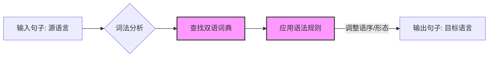
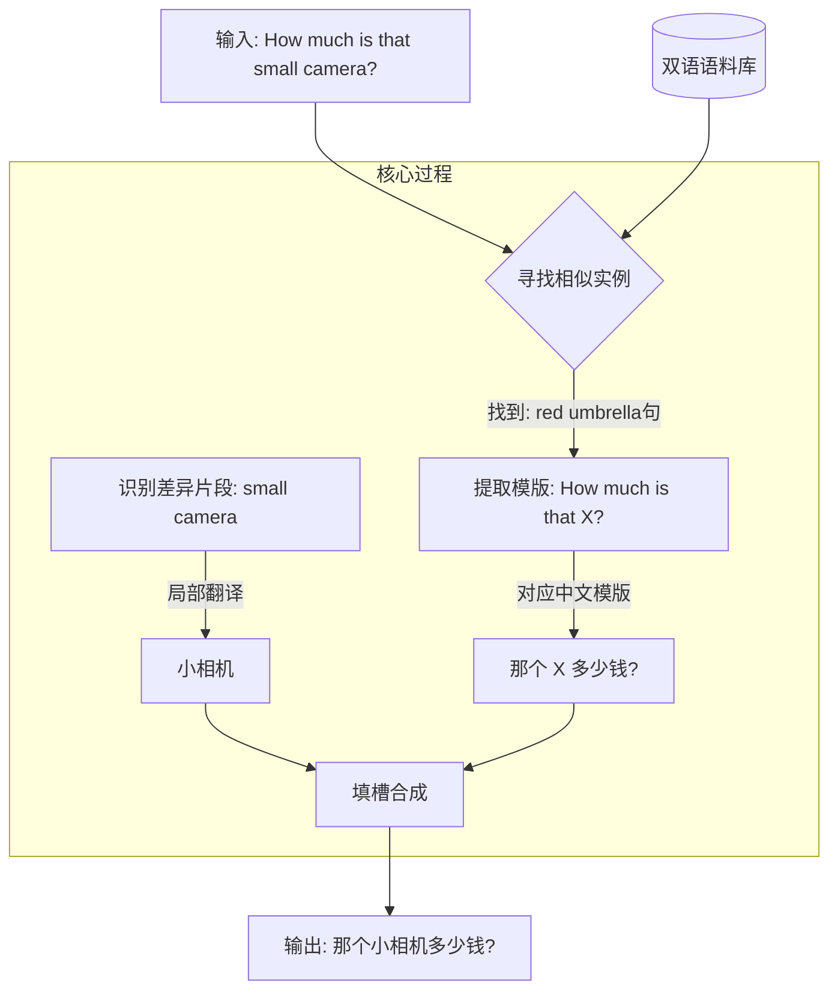
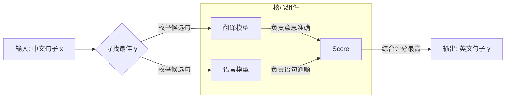
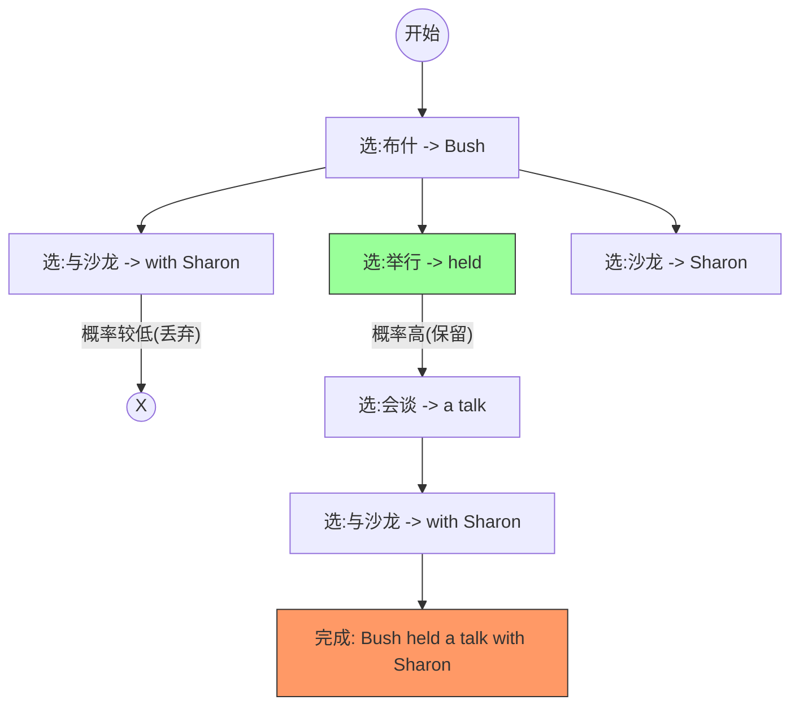
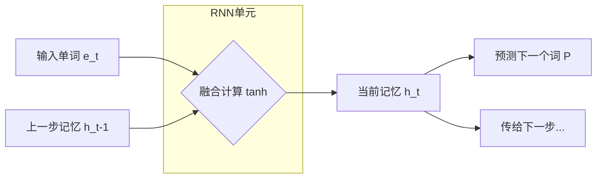
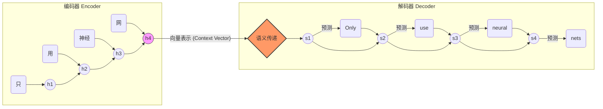
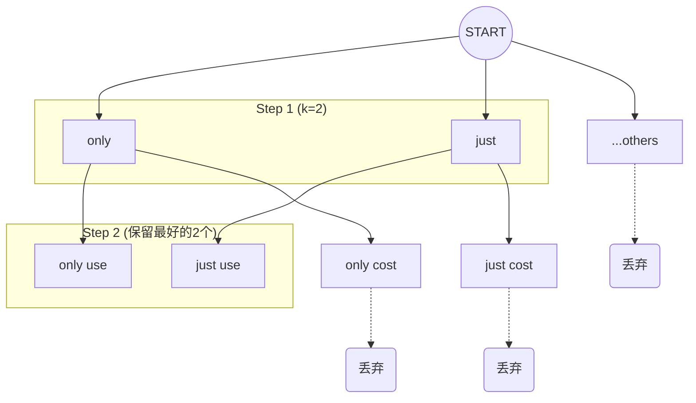
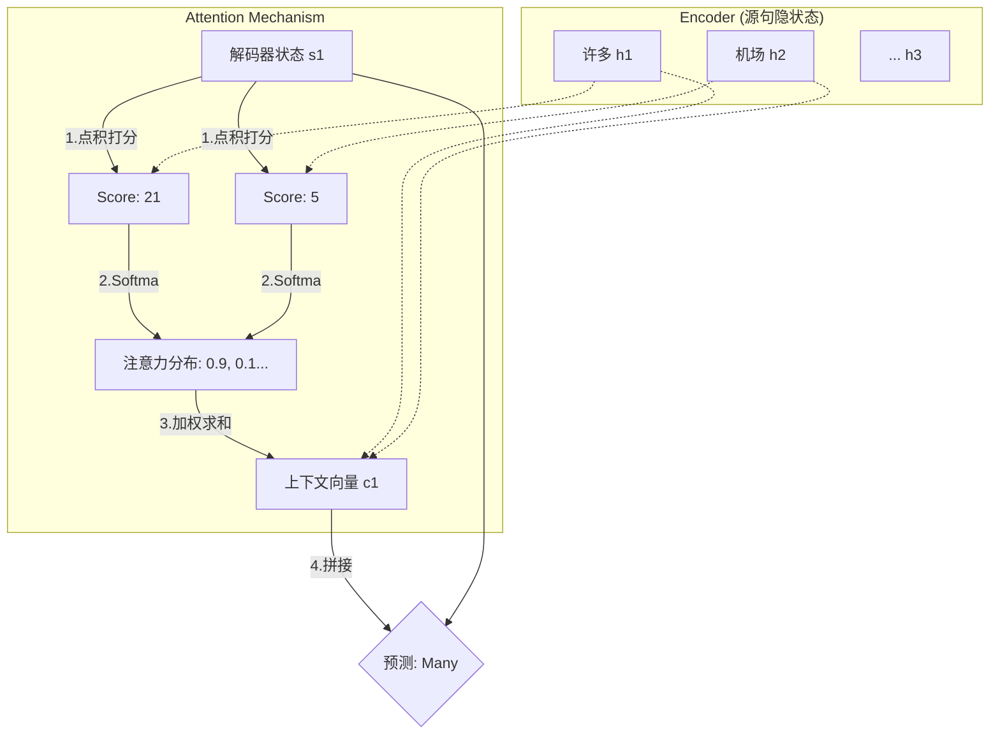

### 一、 机器翻译简介 (Machine Translation Introduction)

#### 1. 核心概念

机器翻译（Machine Translation, MT）是自然语言处理（NLP）中最经典的任务之一。它的定义非常直观：**旨在将文本从一种源语言（Source Language）自动翻译到另一种目标语言（Target Language）。**

#### 2. 通俗解读

如果把机器翻译比作一个黑盒子，你从左边塞进去一句中文（源语言），黑盒子内部经过一系列计算，从右边吐出一句意思对应的英文（目标语言）。这不仅仅是查字典，而是要理解句子的结构、语义，然后用另一种语言习惯重新表达出来。

#### 3. 经典案例

文档中给出了一个非常典型的中英翻译例子：

- **源语言（中文）：** 布什与沙龙举行了会谈
    
- **目标语言（英文）：** Bush held a talk with Sharon
    

在这个例子中，机器不仅要将“布什”对应到“Bush”，还要处理语序和动词搭配（比如“举行了会谈”翻译为“held a talk”）。

#### 4. 机器翻译的历史背景

文档中提到的链接虽然无法点击，但指出了机器翻译拥有悠久的历史。它是人工智能领域最早的尝试之一，伴随着计算机技术的发展，从最早的冷战时期一直演变至今。

---

### 二、 基于规则的机器翻译 (Rule-Based Machine Translation, RBMT)

#### 1. 历史背景：冷战的产物

这是机器翻译的“祖师爷”流派，研究最早开始于 **20世纪50年代**。

- **驱动力：** 冷战（Cold War）。
    
- **核心场景：** 当时美国为了情报需求，急需将大量的 **俄语** 文本翻译成 **英语**。
    

#### 2. 核心原理：字典 + 规则

RBMT 的工作方式非常像我们在学校里学外语的初级阶段——“查字典”加上“套语法公式”。

- **双语词典：** 系统内部有一个庞大的词典，用来将源语言（如俄语单词）一对一或一对多地映射到目标语言（英语单词）。
    
- **规则（Rules）：** 这是最难的部分。语言学家需要手动编写大量的规则来调整语序、词形变化等。
    

#### 3. 通俗解读与挑战

想象一下，你要教一个完全不懂中文的外国人翻译中文。  
你给了他一本《新华字典》（词典），然后给了他一本厚厚的《语法手册》（规则）。  
手册里写着：“如果遇到‘形容词+的+名词’，翻译成英语时去掉‘的’……”  
**问题在于：** 语言是灵活多变的。

- **复杂性：** 设计这些规则非常复杂！
    
- **维护难：** 只要出现一个新的语言现象，就需要人去写新规则。这也是文档中提到的“大多数系统的设计相当复杂”的原因。
    

#### 4. 流程图解 (Mermaid)

---

### 三、 基于实例的机器翻译 (Example-Based Machine Translation, EBMT)

#### 1. 历史背景：思维的转变

到了 **1984年**，研究者们提出了一种新的思路。既然写规则太累太难，那能不能让机器学会“照猫画虎”？这就是基于实例的机器翻译。

#### 2. 核心思想：类比 (Analogy)

EBMT 的核心思想是 **通过实例类比对于短语片段进行翻译**。  
它不再试图理解深层的语法规则，而是去寻找“以前是怎么翻的”。

- **核心资源：** 双语语料库（Bilingual Corpus），即一大堆已经翻译好的中英文句对。
    
- **操作步骤：**
    
    1. **抽取模版：** 从现有的双语语料中找到匹配的模版。
        
    2. **填槽：** 将新句子的内容填入模版中。
        

#### 3. 核心优势

文档中明确指出，EBMT 相比 RBMT 有两个显著优点：

1. **省时：** 不需要花费大量时间设计复杂的语言学规则（rules）。
    
2. **灵活：** 不需要专门考虑规则之外的特殊情况（exceptions），因为它是基于数据统计和匹配的。
    

#### 4. 深度案例解析 (文档示例)

让我们通过文档中的例子来彻底理解 EBMT 的“类比”过程。

**假设数据库里已经有一句学过的翻译（实例）：**

- 英文：_How much is that **red umbrella**?_
    
- 中文：_那个 **红雨伞** 多少钱？_
    

**现在，机器遇到了一句新话要翻译（输入）：**

- 英文：_How much is that **small camera**?_
    

**EBMT 的处理逻辑：**

1. **匹配与抽取模版：** 机器发现这句话的结构和上面那句很像，只是中间的物品变了。于是它提取出一个模版：
    
    - 英：`How much is that ______ ?`
        
    - 中：`那个 ______ 多少钱？`
        
2. **翻译片段：** 机器只需要单独翻译差异部分，即 `small camera` -> `小相机`。
    
3. **合成：** 将“小相机”填入中文模版的空缺处。
    
4. **输出结果：** _那个 **小相机** 多少钱？_
    

#### 5. 原理图解 (Mermaid)

---

### 总结 (Summary)

到目前为止，我们讲解了机器翻译的早期发展脉络：

1. **机器翻译任务：** 源语言 →rightarrow 目标语言。
    
2. **基于规则 (RBMT)：** 靠人写规则，像**查字典+套公式**，精确但太复杂，维护成本极高。
    
3. **基于实例 (EBMT)：** 靠数据类比，像**照猫画虎**，通过模仿已有的翻译例子来处理新句子，省去了写死板规则的麻烦。
---

### 一、 统计机器翻译 (Statistical Machine Translation, SMT)

#### 1. 核心思路：从规则到概率

与之前的“基于规则”或“基于实例”不同，统计机器翻译的核心思想发生了巨大的转变：**从数据中学习一个概率模型**。

**通俗解读：**  
机器不再试图去“理解”语法规则，而是通过分析海量的双语数据，计算出“当中文是A时，英文是B的概率是多少”。翻译问题被转化成了一个数学计算问题。

#### 2. 核心公式与推导

文档中给出了统计机器翻译最著名的“噪声信道模型”推导过程。

**任务目标：**  
给定一个中文句子 $x$，我们想要找到一个最好的英文翻译 $y$，使得概率 $P(y|x)$ 最大。用数学公式表示就是：  
$argmaxyP(y∣x)=\text{argmax}_y P(y|x)$

**贝叶斯公式展开：**  
为了更好地计算，SMT 利用贝叶斯公式将上述公式展开：  
$argmaxyP(y∣x)=argmaxyP(x∣y)P(y)P(x)\text{argmax}_y P(y|x) = \text{argmax}_y \frac{P(x|y)P(y)}{P(x)}$

因为输入的中文句子 $x$ 是固定的，所以 $P(x)$ 是个常数，可以忽略。最终我们只需要关注分子部分：  
$argmaxyP(x∣y)P(y)\text{argmax}_y P(x|y)P(y)$

#### 3. 两个关键模型的含义

这个公式将翻译任务拆解成了两个独立的子模型，这在SMT中至关重要：

- **翻译模型 (Translation Model) - $P(x|y)$**
    
    - **含义：** 假设如果是英文句子 $y$，它翻译回中文是 $x$ 的概率有多大？
        
    - **作用：** 确保“忠实度” (Adequacy)**。它从平行语料（中英文对照数据）中学习单词和短语的对应关系（例如：知道“会谈”对应“talk”）。
        
    - **通俗理解：** 就像一个“词典专家”**，负责确认意思对不对。
        
- **语言模型 (Language Model) - $P(y)$**
    
    - **含义：** 这个英文句子 $y$ 本身像不像一句人话？它的流畅度如何？
        
    - **作用：** 确保**“流畅度” (Fluency)**。它从单语语料（只有英文数据）中学习英语的语法习惯（例如：知道 "held a talk" 比 "held talk a" 概率更高）。
        
    - **通俗理解：** 就像一个“语法专家”**，负责确认句子顺不顺。
        

#### 4. Mermaid 原理图

---

### 二、 启发式搜索算法 (Heuristic Search Algorithm)

#### 1. 为什么要搜索？

根据上面的公式，我们需要计算 $\text{argmax}_y$。这意味着理论上我们需要枚举所有可能的英文句子 $y$，算出概率，然后挑最高的。  
**问题：** 英文句子的组合是无穷无尽的，枚举所有可能性的效率太低，根本算不完！  
**解决方案：** 使用 **启发式搜索算法**。不要瞎猜，而是有方向、有策略地逐步生成翻译。

#### 2. 搜索过程演示：布什与沙龙的会谈

文档通过一个具体的例子展示了搜索过程：

- **输入：** 布什 与 沙龙 举行 了 会谈
    
- **目标：** Bush held a talk with Sharon
    

**搜索步骤解析（基于文档图示）：**

1. **切分与短语翻译：**  
    算法首先会在输入句子中选取短语，并查表找到对应的英文翻译。注意，短语可能包含多个单词。
    
    - `布什` -> `Bush`
        
    - `与` -> `with`
        
    - `沙龙` -> `Sharon`
        
    - `举行` -> `held` / `hold`
        
    - `会谈` -> `a talk` / `talk`
        
2. **逐步生成与重排序 (Reordering)：**  
    这是SMT最关键的特征之一。**选取短语时，可以不依照原来的顺序！** 因为中文和英文的语序往往不同（比如中文的状语前置）。
    
    - **Step 1:** 机器可能先选了“布什” -> 生成 `Bush`。
        
    - **Step 2:** 接下来，机器面临分叉路口（搜索树）：
        
        - 路径 A: 接着翻译“与沙龙” -> `Bush with Sharon ...` (语序像中文，概率可能较低)
            
        - 路径 B: 跳过中间，先翻译“举行” -> `Bush held ...` (符合英文习惯，语言模型 $P(y)$ 会给高分)
            
    - **Step 3:** 沿着路径 B 继续，把剩下的补齐 -> `Bush held a talk ...`
        
    - **Step 4:** 最后把剩下的“与沙龙”补上 -> `Bush held a talk with Sharon`。
        
3. **剪枝 (Pruning)：**  
    在搜索过程中，会生成成千上万条路径（如 `Bush with...`, `Bush hold...`, `Bush Sharon...`）。  
    文档提到：**具有较低概率的句子被丢弃**。这就像修剪树枝一样，只保留最有希望的那几条路，从而提高效率。
    

#### 3. 搜索树示意图 (Mermaid)

---

### 三、 统计机器翻译的总结与局限

根据文档第22页的内容，虽然SMT曾经统治了翻译界很久，但它依然有明显的局限性。

#### 1. 系统的复杂性

最好的 SMT 系统往往**非常复杂**。它不是一个简单的整体，而是由多个分开设计的子部件构成（翻译模型、语言模型、调序模型等）。

#### 2. 特征工程 (Feature Engineering)

SMT 极度依赖**特征工程**。

- 你需要人工定义很多特征告诉机器怎么翻比较好。
    
- 你需要为特殊的语言现象专门设计特征（比如中文的量词、英文的时态）。
    

#### 3. 维护成本

由于系统是拼装的且依赖人工特征，因此**依赖大量的人力进行维护**。虽然比基于规则的方法进步了，但依然不够“智能”和“端到端”。

---

**总结：**  
统计机器翻译 (SMT) 用概率数学（贝叶斯公式）取代了死板的规则，通过**翻译模型**保证意思，**语言模型**保证通顺，并利用**启发式搜索**在茫茫句海中寻找最优解。但它的系统架构松散且复杂，为后来神经机器翻译 (NMT) 的出现埋下了伏笔。

---

### 一、 神经机器翻译 (Neural Machine Translation, NMT)

#### 1. 核心定义：端到端 (End-to-End)

根据文档第24页，神经机器翻译（NMT）的定义非常简洁有力：**使用神经网络进行端到端的文本翻译**。

- **对比 SMT：**
    
    - 在之前的统计机器翻译（SMT）中，我们看到系统是由很多个子部件拼起来的（翻译模型+语言模型+调序模型...）。
        
    - 在 NMT 中，**没有单独的翻译模型和语言模型**。整个翻译过程被一个巨大的神经网络模型包办了。你给它中文，它直接输出英文，中间不再需要人为拆解步骤。
        
- **常用架构：**  
    最经典的架构就是 **序列到序列模型 (Seq2Seq)**。而在讲 Seq2Seq 之前，我们需要先复习一下它的基本组件——**RNN**。
    

---

### 二、 用于语言建模的 RNN (Recurrent Neural Network)

#### 1. 为什么用 RNN？

文档第28页提到，RNN 极其擅长建模 **序列信息**。语言本质上就是一种时间序列（单词是一个接一个出现的），所以 RNN 非常适合处理文本。它可以被用来做：

- 词性标注
    
- 情感分类
    
- **核心用法：** 作为**编码器 (Encoder)** 来建模句子的语义表示。
    

#### 2. RNN 的工作原理 (以预测下一个词为例)

文档第25-27页通过一个例子展示了 RNN 如何工作。

- **任务：** 给定序列 `never too late to`，预测下一个词。
    
- **输入形式：** 单词通过 One-hot 编码转化为 **词向量 (Word Embedding)** $e_t$。
    

**核心机制：隐状态 (Hidden State) 的传递**  
RNN 的精髓在于它有一个“记忆”——**隐状态 $h$**。

- **公式：**  
    $ht=tanh⁡(Weet+Whht−1+b1)h_t = \tanh(W_e e_t + W_h h_{t-1} + b_1)$
    
    - $h_t$：当前的隐状态。
        
    - $e_t$：当前的输入单词（的新信息）。
        
    - $h_{t-1}$：上一步的隐状态（过去的记忆）。
        
    
    **通俗大白话：**  
    想象你在读一句话。当你读到第3个词时，你的脑子里不仅有第3个词的意思（$e_t$），还残留着前两个词留下的印象（$h_{t-1}$）。RNN 就是通过不断把“新输入”和“旧记忆”融合，生成一个新的“当前记忆”。
    
- **输出概率：**  
    $P=softmax(Uht+b2)P = \text{softmax}(U h_t + b_2)$
    最后，利用当前的隐状态，通过 Softmax 函数计算词表中每个单词成为下一个词的概率。
    

#### 3. RNN 运作流程图 (Mermaid)

---

### 三、 Seq2Seq 模型 (Sequence to Sequence)

#### 1. 什么是 Seq2Seq？

根据文档第29页，Seq2Seq 是 NMT 的标准架构。既然翻译是从“源语言序列”变到“目标语言序列”，这个模型顾名思义就是**序列到序列**。

它由两大部分组成，就像两个接力跑的运动员：

1. **编码器 RNN (Encoder)：** 负责“读”。学习源语言（中文）的表示。
    
2. **解码器 RNN (Decoder)：** 负责“写”。基于编码器学到的东西，生成目标语言（英文）。
    

#### 2. 详细工作流程 (Step-by-Step)

我们将文档第30-35页的动画演示过程拆解开来：

**例子：**

- 输入：`只 用 神经 网` (源序列)
    
- 输出：`Only use neural nets` (目标序列)
    

**第一阶段：编码 (Encoding)**

1. 编码器 RNN 依次读取中文单词：
    
    - 读入 `<START>` -> 更新隐状态 $h_1$
        
    - 读入 `只` -> 更新隐状态 $h_2$
        
    - ...
        
    - 读入 `网` -> 更新隐状态 $h_4$
        
2. **关键点：** 最后的隐状态 $h_4$ 非常重要！文档第31页指出，**$h_4$ 是源语言的最终表示**。它浓缩了整句“只用神经网”的精华信息。
    

**第二阶段：传递 (Passing Context)**

- 编码器的最终隐状态 $h_4$ 被传递给解码器，作为解码器的**初始隐状态**（或者作为输入的一部分）。这就像接力赛中的接力棒，把理解到的句意传给下一棒。
    

**第三阶段：解码 (Decoding)**  
解码器 RNN 开始工作，它其实就是一个**条件语言模型**：

1. **Step 1:** 拿着接力棒（句意信息），收到 `<START>` 指令。
    
    - 计算输出概率：$P_1 = \text{softmax}(\dots)$
        
    - 机器算出概率最高的词是 `Only`。
        
2. **Step 2:** 把上一步生成的 `Only` 喂回给自己作为输入，结合隐状态。
    
    - 预测下一个词是 `use`。
        
3. **Step 3...:** 依次生成 `neural`, `nets`。
    
4. **Step 4:** 直到生成特殊符号 `<END>`，翻译结束。
    

#### 3. Seq2Seq 架构示意图 (Mermaid)

---

### 总结 (Summary)

在这一部分，我们了解了机器翻译技术的重大飞跃：

1. **NMT：** 抛弃了复杂的子模块，采用**端到端**的神经网络。
    
2. **RNN：** 利用**隐状态**记忆过去的信息，非常适合处理文本序列。
    
3. **Seq2Seq：** 完美的翻译搭档。
    
    - **编码器**负责把中文读懂，压缩成一个向量（语义胶囊）。
        
    - **解码器**拿着这个向量，把英文一个个词吐出来。
        

好的，我们继续深入讲解 **神经机器翻译 (NMT)** 的训练、使用（解码）以及评估方法，最后对NMT进行总结。

---

### 一、 训练方式 (Training)

#### 1. 核心目标：最小化损失

在 Seq2Seq 模型搭建好之后，我们需要“教”它翻译。
- **输入：** 比如中文句子 `只 用 神经 网`。
    
- **正确答案 (Gold Standard)：** 英文句子 `Only use neural nets`。
    
训练的目标是让模型生成的概率分布尽可能接近正确答案。我们使用 **交叉熵 (Cross-Entropy)** 作为损失函数。

#### 2. 计算过程详解 (以文档为例)

文档第37-39页详细展示了损失是如何计算的：

1. **预测：**  
    当解码器在第一步时，输入 `<START>`，它会输出整个词表上所有单词的概率。  
    假设模型预测单词 `Only` 的概率是 $0.7$（即 $P(\text{Only}) = 0.7$）。
    
2. **对比：**  
    正确答案确实是 `Only`（在One-hot编码中，该位置为1，其他为0）。
    
3. **计算单步损失：**  
    根据交叉熵公式 $Loss = -\log(P(\text(correct_Word))$。  
    这里就是 $-\log(0.7)$。
    
4. **全局损失 $J$：**  
    将句子里每一个位置的损失加起来。  
    $J=∑(−log⁡(0.7)−log⁡(0.5)−… )J = \sum (- \log(0.7) - \log(0.5) - \dots)$ 
    我们希望这个 $J$ 越小越好（意味着预测概率越接近 1）。
    

#### 3. 训练机制：端到端反向传播

**通俗理解：**  
整个 Seq2Seq 模型就像串在一起的糖葫芦。当我们算出最后的误差（Loss）后，我们通过**反向传播 (Backpropagation)**，一次性调整编码器 (Encoder) 和解码器 (Decoder) 中所有的参数（权重）。这就叫“端到端”训练，不再需要像统计机器翻译那样分别训练好几个模型。

---

### 二、 解码策略 (Decoding Strategies)

训练好了模型，现在我们要用它来翻译新句子。如何根据模型输出的概率找到最好的句子？这里有几种策略。

#### 1. 贪婪解码 (Greedy Decoding)

- **策略：** 目光短浅。每一步都只选概率最大的那个词，不管后面会发生什么。
    
- **问题：** 就像下棋只看一步。一旦前面选错（比如把“Bush”后面接了“and”而不是“held”），后面就全完了，而且**无法撤销**。通常无法得到全局最优解。
    

#### 2. 理想解法：枚举所有可能

- **策略：** 算出所有可能的英文句子组合，挑概率最高的。
    
- **问题：** 词表如果是几万个词，句子长度是20，组合数就是天文数字。**复杂度 $O(V^T)$**，完全不可行。
    

#### 3. 束搜索 (Beam Search) —— 最佳平衡点

这是实际中最常用的方法（文档第44-50页重点讲解）。

- **核心思想：** 在每一步，不再只留这1个最好的，也不留所有，而是保留前 **$k$** 个最有希望的候选结果（$k$ 称为束宽，Beam Width，通常设为5-10）。
    
- **文档案例演示 ($k=2$)：**
    
    - **Step 1:** 机器翻译第一个词，概率最高的两个是 `only` 和 `just`。保留这两个。
        
    - **Step 2:**
        
        - 沿着 `only` 继续猜：可能是 `only use` 或 `only cost`。
            
        - 沿着 `just` 继续猜：可能是 `just use` 或 `just cost`。
            
        - 现在有4个候选。计算它们的累积概率，**只保留前2名**（假设是 `only use` 和 `just use`）。其他的剪掉。
            
    - **Step 3:** 继续基于保留的那两个扩展...
        

通过这种方式，我们在“效率”和“准确率”之间找到了平衡。

#### 4. 束搜索示意图 (Mermaid)

---

### 三、 评价指标 (Evaluation Metrics)

机器翻得好不好，不能总靠人看，需要自动打分。最常用的指标是 **BLEU**。

#### 1. BLEU (Bilingual Evaluation Understudy)

BLEU 的核心逻辑是：**机器翻出来的句子，和人类专家翻译的参考答案（Reference）长得越像，得分越高。**

#### 2. 计算公式与含义

$BLEU=BP×exp⁡(∑wnlog⁡pn)BLEU = BP \times \exp(\sum w_n \log p_n)$

它由两部分组成：

1. **N-gram 精度 ($p_n$)：**
    
    - 看单词是否重合。
        
    - 不仅看单个词 (1-gram)，还要看双词短语 (2-gram)、三词短语 (3-gram) 是否一致。
        
    - _例子：_ 参考答案是 `Israeli officials`，机器如果也翻出 `Israeli officials`，2-gram 精度就高。
        
2. **简短惩罚 (BP, Brevity Penalty)：**
    
    - 如果参考答案很长，机器只翻了一个词 `The`。虽然 `The` 在参考答案里有，精度很高，但这显然是作弊。
        
    - 所以，**如果翻译结果太短，BLEU会给予惩罚扣分**。
        

#### 3. BLEU 的局限性

文档第56页指出，BLEU 并不完美。

- **同义词问题：**
    
    - 参考答案：`I ate the apple`
        
    - 机器翻译：`I consumed the apple`
        
    - 虽然意思完全对，但因为 `ate` 和 `consumed` 单词不同，BLEU 分数可能会低。这意味着好的翻译不一定总能拿到高 BLEU 分。
        

---

### 四、 总结 (Summary)

最后，我们结合文档第58-59页及最后一部分，对神经机器翻译（NMT）做一个优缺点总结。

#### 1. NMT 的优势 (相比 SMT)

- **性能更好：** 翻译更流畅，更能利用上下文信息（RNN的功劳）。
    
- **端到端：** 一个神经网络搞定所有，不需要像SMT那样分别搞翻译模型、语言模型。
    
- **省力：** 不需要做复杂的特征工程（Feature Engineering），不需要为了特定语言设计特定规则。
    

#### 2. NMT 的缺点

- **不可解释性（黑盒）：** 神经网络内部是数百万个参数，为什么它把“apple”翻译错了？很难调试查错。
    
- **难以控制：** 你很难像 RBMT 那样直接加一条规则说“在这个场景下必须这么翻”。
    
- **安全性：** 可能产生幻觉或不当内容。
    

#### 3. 机器翻译发展简史

回顾整个课程脉络：

1. **RBMT:** 规则驱动，查字典。
    
2. **EBMT:** 实例驱动，找模版。
    
3. **SMT:** 统计驱动，算概率（贝叶斯）。
    
4. **NMT:** 神经网络驱动，端到端学习（Seq2Seq）。
    

至此，关于 Seq2Seq 架构下的神经机器翻译基础已经讲解完毕。但 Seq2Seq 模型存在一个著名的**瓶颈问题**，这将引出下一个核心概念——注意力机制（这是下一部分的内容）。

---

### 一、 为什么要引入注意力机制？ (The Bottleneck Problem)

#### 1. Seq2Seq 的“记忆瓶颈”

还记得我们刚才讲的 Seq2Seq 模型吗？编码器（Encoder）读完整个中文句子后，必须把所有信息压缩到一个**单一的固定向量**（通常是最后一个隐状态）中，然后扔给解码器（Decoder）。

- **问题所在：**
    
    - **容量有限：** 无论句子多长（比如100个词），都要压进这一个向量里，这就像让一个人死记硬背一篇课文，然后只允许他用一个成语来概括整篇课文给别人听。
        
    - **信息丢失：** 很多细节（尤其是句子开头的信息）在传递到最后时容易被遗忘。
        
    - **噪声干扰：** 生成每一个词时，这个单一向量里包含了整句话的所有信息，其中大部分其实是当前不需要的“噪声”。
        

#### 2. 注意力机制的直观解法

注意力机制的出现，就是为了打破这个瓶颈。  
**核心思路：**  
机器在翻译（解码）每一个词时，不应该死盯着那个固定的句意向量，而应该**回头看一看源句子**。并且，不是眉毛胡子一把抓，而是**有侧重地关注**与当前要翻译的词最相关的那个部分。

---

### 二、 Seq2Seq 中的注意力 (Attention in Seq2Seq)

文档第64-74页通过非常细致的步骤展示了注意力是如何工作的。

#### 1. 场景设定

- **源句子（中文）：** 许多 机场 都 被迫 关闭 了
    
- **目标（英文）：** Many airports ...
    

#### 2. 工作流程详解

当解码器准备生成第1个词 `Many` 时：

1. **打分 (Scoring / Dot Product)：**  
    解码器当前的隐状态 $s_1$（准备生成Many的状态）会和编码器中每一个词的隐状态 ($h_1$ 到 $h_7$) 进行**点积**运算。
    
    - 点积代表了**相似度**或**相关性**。
        
    - 机器计算发现，$s_1$ 和 $h_1$ ("许多") 的得分为21，最高；和其他词的得分较低。
        
2. **计算分布 (Softmax)：**  
    将这些分数通过 Softmax 函数转换成概率分布（加起来等于1）。
    
    - 结果可能是：对“许多”的关注度是0.8，对其他词是0.05等。这就是**注意力分布**。
        
3. **加权求和 (Weighted Sum)：**  
    用这个概率作为权重，将编码器所有的隐状态加起来，得到一个**上下文向量 (Context Vector, $c_1$)**。
    
    - 因为“许多”的权重最大，所以这个 $c_1$ 向量里主要包含的就是“许多”的信息。
        
4. **预测与拼接：**  
    将这个 $c_1$ 和解码器自己的状态 $s_1$ 拼接起来，用来预测单词 `Many`。
    

**当生成第2个词 `airports` 时：**  
解码器状态变为 $s_2$。机器再次回头看源句子。这次它发现 $s_2$ 和 $h_2$ ("机场") 的相关性最高。于是注意力“聚光灯”从“许多”移到了“机场”上，生成的上下文向量 $c_2$ 主要包含了“机场”的信息。

#### 3. Mermaid 流程图

---

### 三、 注意力机制的定义与公式 (Definition & Math)

文档第75-80页给出了形式化的定义。

#### 1. 核心公式

- **注意力得分 (Attention Score) $e$:**  
    $et=[stTh1,…,stThN]∈RNe^t = [s_t^T h_1, \dots, s_t^T h_N] \in \mathbb{R}^N$
    这里使用点积 ($s_t^T h_i$) 来计算解码器在 $t$ 时刻的状态 $s_t$ 与编码器各个状态 $h_i$ 的匹配程度。
    
- **注意力分布 (Attention Distribution) $\alpha$:**  
    $αt=softmax(et)∈R^N\alpha^t = \text{softmax}(e^t) \in \mathbb{R}^N$
    将得分归一化为概率。
    
- **注意力输出/上下文向量 (Context Vector) $a_t$:**  
    $at=∑i=1Nαithi∈Rda_t = \sum_{i=1}^{N} \alpha_i^t h_i \in \mathbb{R}^d$
    这是所有编码器隐状态的加权平均值。
    

#### 2. 通用定义 (Query, Key, Value)

文档第79页将注意力机制提升到了一个通用的高度：

- **查询 (Query, $q$):** 比如解码器的当前状态。
    
- **值 (Value, $v$):** 比如编码器的隐状态集合。
    
- **定义：** 注意力机制就是根据 **Query** 对 **Values** 进行加权求和。加权求和的结果是对 Values 的一个**选择性总结**。
    

---

### 四、 注意力变体 (Attention Variants)

计算“得分”的方式不仅仅只有点积，文档介绍了三种常见变体：

1. **点积注意力 (Dot-product Attention):**  
    $score(s,h)=sThscore(s, h) = s^T h$
    
    - 最简单，计算快。
        
    - 要求 $s$ 和 $h$ 的向量维度必须相同。
        
2. **乘性注意力 (Multiplicative Attention):**  
    $score(s,h)=sTWhscore(s, h) = s^T W h$
    
    - 中间加了一个可学习的参数矩阵 $W$。
        
    - 允许 $s$ 和 $h$ 维度不同，更加灵活。
        
3. **加性注意力 (Additive Attention):**  
    $score(s,h)=vTtanh⁡(W1h+W2s)score(s, h) = v^T \tanh(W_1 h + W_2 s)$
    
    - 这是最早被提出来的版本（Bahdanau Attention）。它实际上是用一个小型的神经网络来计算得分。
        

---

### 五、 注意力机制的应用 (Applications)

注意力机制不仅用于机器翻译，还被广泛应用在其他领域。

#### 1. 图像描述 (Image Captioning)

- **任务：** 给一张图，机器自动生成一句话描述它。
    
- **原理：**
    
    - **编码器：** CNN（卷积神经网络）提取图像特征。
        
    - **解码器：** RNN 生成句子。
        
    - **注意力：** 当RNN生成单词时，会关注图像的不同区域。
        
- **例子：** 文档第84页展示，当生成单词 "frisbee"（飞盘）时，模型在图像上的注意力热力图主要集中在飞盘那个小区域；生成 "woman" 时，关注点在人身上。
    

#### 2. 文本摘要 (Text Summarization)

- **任务：** 把长文章压缩成短摘要。
    
- **问题：** 传统的解码器容易生成重复的内容（比如一直重复一句话）。
    
- **解决方案：自注意力 (Self-Attention) / 内部注意力 (Intra-Attention)**。
    
    - 在解码器内部，让当前的隐状态去“关注”解码器**之前生成过的状态**。
        
    - **作用：** 机器可以知道“哦，这个概念我刚才已经讲过了”，从而避免重复，并理清句子内部的逻辑关系。
        

---

### 六、 全文总结 (Overall Summary)

基于文档最后一部分，我们将整个 Unit.03 的内容串联起来：

1. **发展历程：**
    
    - **RBMT (基于规则):** 复杂的规则，人工成本高。
        
    - **EBMT (基于实例):** 利用语料类比，无需深究规则。
        
    - **SMT (统计):** 概率模型，特征工程，复杂流水线。
        
    - **NMT (神经):** Seq2Seq 架构，端到端学习，性能飞跃。
        
2. **核心技术点：**
    
    - **RNN/LSTM/GRU:** 处理序列数据的基础。
        
    - **Encoder-Decoder:** 翻译的标准范式。
        
    - **Beam Search:** 寻找最优译文的策略。
        
    - **BLEU:** 评估好坏的标准。
        
3. **MVP (最有价值球员) —— 注意力机制：**
    
    - 解决了 Seq2Seq 的**长句子瓶颈问题**。
        
    - 解决了**梯度消失**问题（提供了直连通道）。
        
    - 提供了**可解释性**（我们可以通过看注意力图，知道机器翻译某个词时在看哪里）。
        
    - 它是现代 NLP 模型（如 Transformer）的基石。
        
