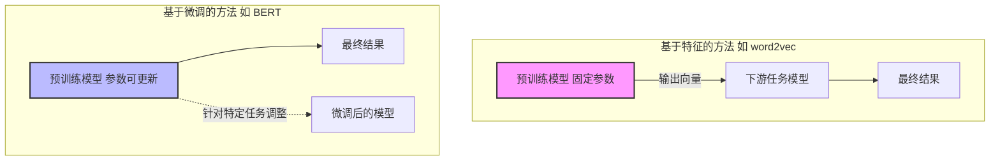
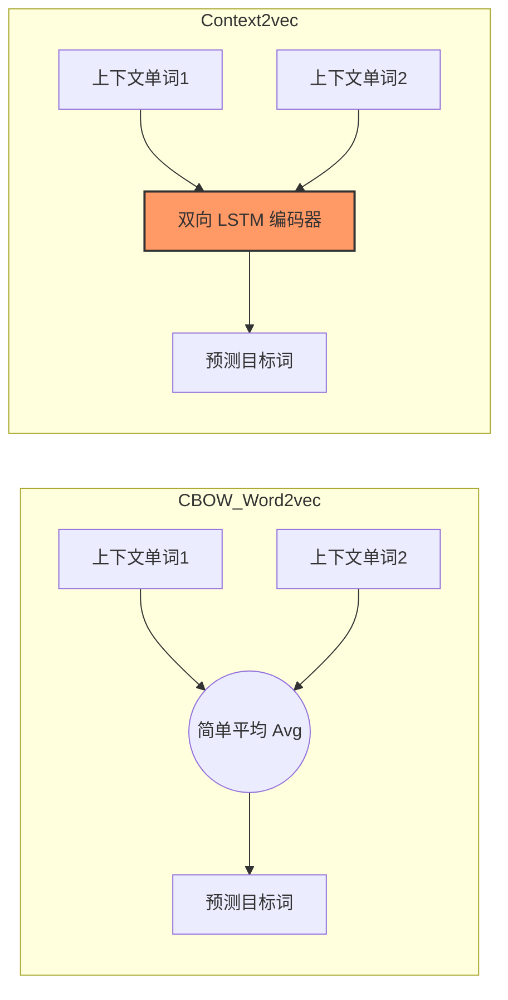
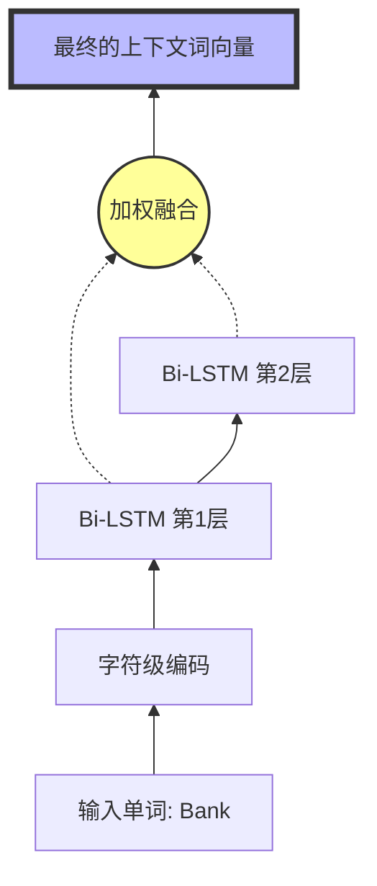
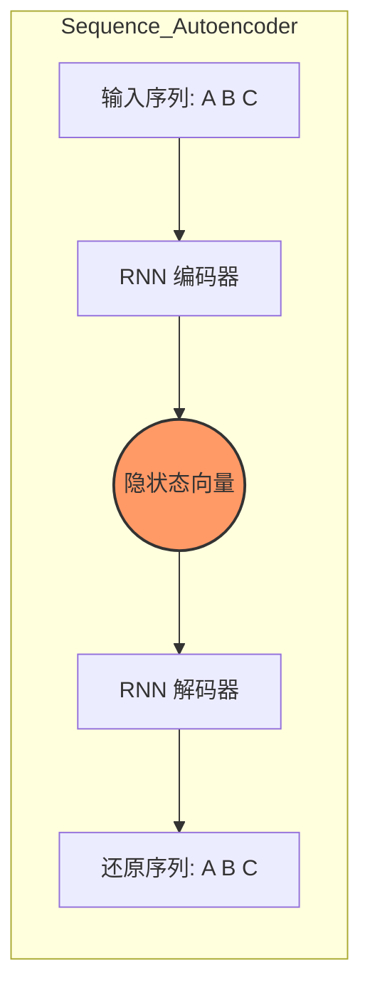
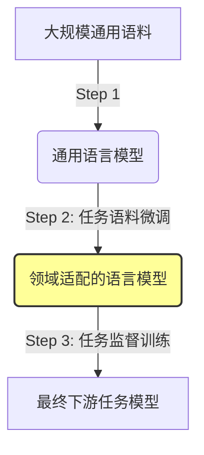
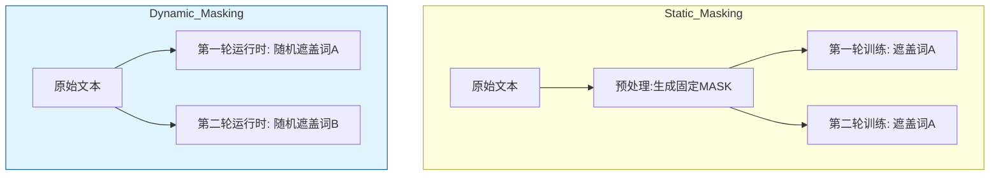
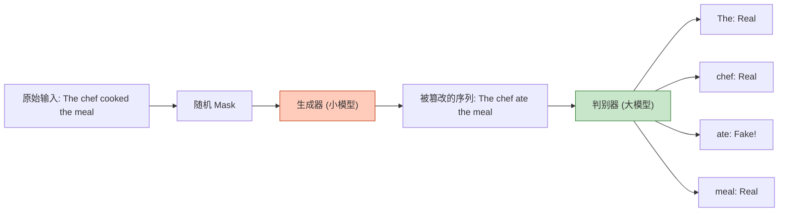

# 预训练语言模型 (Pre-trained Language Models)

## 1. 什么是预训练语言模型？

**📖 课件核心理论：**  
预训练语言模型（Pre-trained Language Models, PLMs）是指在大规模语料上预先训练好的模型。它们的核心特征是具有**很强的迁移能力**。也就是说，先在一个通用的任务上把模型“练好”，然后可以把它应用到其他的 NLP（自然/语言处理）任务上，并且通常能取得很好的效果。

- **早期代表：** word2vec（深度学习时代早期）。
    
- **当今主流：** 基于 Transformer 架构的模型（如 BERT、GPT）。
    

**🗣️ 大白话讲解：**  
想象你要培养一个“语言天才”。

- **不使用预训练：** 就像让一个刚出生的婴儿直接去学写法律文书，他既不懂字也不懂语法，从零开始太难了。
    
- **使用预训练：** 就像先让这个孩子读完九年义务教育和大学（**预训练**），让他掌握了通用的语言知识、词汇和语法。之后，如果你让他去写法律文书（**下游任务**），他只需要再进行一点点专业的职业培训，就能做得非常好。这个“大学毕业生”就是预训练语言模型。
    

---

## 2. 两种主流的预训练模型

根据课件，目前的预训练模型主要分为两大流派。它们的区别主要在于**如何使用**这个“练好”的模型。

| 类型       | **基于特征的方法 (Feature-based)**              | **基于微调的方法 (Fine-tuning)**              |
| :------- | :--------------------------------------- | :------------------------------------- |
| **代表模型** | **word2vec**                             | **BERT**                               |
| **核心逻辑** | 把预训练模型的**输出**（比如词向量）拿出来，作为下游任务模型的**输入**。 | 预训练模型**本身**就是下游任务模型的一部分。               |
| **参数更新** | 预训练模型的参数**固定不变**（只当成一个查字典的工具）。           | 预训练模型的参数会随着下游任务的训练**一起更新**（Fine-tune）。 |
|          |                                          |                                        |

**📊 Mermaid 架构对比图：**

---

# 基于特征的方法 (Feature-based Approaches)

这一部分主要回顾经典的 word2vec 及其后续的改进模型，直到 ELMo。

## 1. word2vec 回顾

**📖 课件核心理论：**  
word2vec 是深度学习早期的代表，它提供了两种预测框架来训练词向量：

1. **CBOW (Continuous Bag-of-Words):** 根据上下文预测中间的词。
    
2. **Skip-gram:** 根据中间的词预测上下文。
    

**🌰 例子：**  
句子："The quick **brown** fox jumps"

- **CBOW:**以此为例，看到 "The", "quick", "fox", "jumps"，模型要猜出中间缺的是 "**brown**"。
    
- **Skip-gram:** 看到 "**brown**"，模型要猜出它旁边可能是 "quick" 或者 "fox"。
    

## 2. word2vec 的问题

**⚠️ 核心痛点：词向量是上下文无关的 (Context-independent)**

**🗣️ 大白话讲解：**  
在 word2vec 中，一个词在训练好之后，它的向量就固定了，无论放在哪里都一样。

- **例子：** 单词 "Apple"。
    
    - 在句子 "I ate an **Apple**" 中，它指水果。
        
    - 在句子 "**Apple** released a new iPhone" 中，它指公司。
        
    - **word2vec 的尴尬：** 它只能给 "Apple" 分配**一个**固定的向量。这个向量可能既不像水果也不像公司，或者是两者的混合。它无法根据当前的句子语境来改变自己的含义。
        

---

## 3. context2vec

为了解决 word2vec 上下文无关的问题，研究者提出了 **context2vec**。

**📖 课件核心理论：**

- **基本思想：** 源自 CBOW（根据上下文预测目标词）。
    
- **改进点：** CBOW 只是简单地把上下文词向量取**平均值**（例如 [Avg(Embedding(John), Embedding(a))]）来代表上下文。而 context2vec 使用了一个更复杂的参数化网络——**单层 Bi-LSTM**（双向长短期记忆网络）来对上下文信息进行编码。
    
- **不同点：**
    
    - **word2vec:** 词向量只和词本身有关。
        
    - **context2vec:** 词向量只和当前的上下文有关，但是**忽略了词本身**。
        
- **地位：** 它是结合上下文词向量（Contextualized word embedding）的一个初步尝试。
    

**📊 Mermaid 原理对比：**

---

## 4. 从 word2vec 到语言模型

**📖 课件核心理论：**

- word2vec 的训练非常高效，其实可以看作是语言模型的一种**简化版**。
    
- 随着硬件（GPU/TPU）的发展，在更大规模语料上训练**完整的语言模型**成为可能。
    
- 完整的语言模型训练过程能帮助我们得到更好的模型表示。
    

---

## 5. ELMo (Embeddings from Language Models)

ELMo 是该领域的一个里程碑（NAACL 2018 最佳论文），它真正实现了“深度上下文词向量”。

### A. 模型架构与核心特征

1. **上下文相关 (Context-dependent):** 每个词的表示向量不再是死的，而是取决于它所属的**整个上下文**。
    
2. **网络深 (Deep):** 它的词向量结合了一个预训练过的深度神经网络的**所有层**信息（不仅仅是最后一层）。
    
3. **基础模型:** 使用**多层 Bi-LSTM**（双向 LSTM）。
    
4. **字符级别输入 (Character-level):** 它不是以词为单位输入，而是以字符为单位。这很好地解决了 **OOV (Out-of-Vocabulary)** 问题（即遇到训练时没见过的生僻词也能处理，因为它认识组成词的字母）。
    

### B. ELMo 的工作步骤 (Pipeline)

这是一套典型的**基于特征**的流程：

1. **预训练 (Pre-training):** 在大规模语料库上训练一个双向语言模型（Bi-LM）。
    
2. **固定模型 (Fix):** 训练好后，这个语言模型的参数就固定住了，不再改变。
    
3. **编码 (Encoding):** 当有新的下游任务（比如文本分类）来了，把句子输入给 ELMo。ELMo 会根据当前的上下文，计算出每个单词的动态词向量。
    
4. **使用 (Usage):** 把这些计算好的、带有上下文信息的向量，作为下游任务模型的**输入**（Feature）。
    

### C. 为什么 ELMo 比 word2vec 强？

**🗣️ 深度解析与例子：**

- **场景：** 区分多义词 "Bank"。
    
    - **句子 A:** "I went to the **bank** to deposit money." (银行)
        
    - **句子 B:** "I sat on the river **bank**." (河岸)
        
- **word2vec 的做法：**  
    无论在 A 还是 B 中，"bank" 的向量是完全一样的（比如是 [0.5, 0.2]）。模型很困惑。
    
- **ELMo 的做法：**
    
    - 在句子 A 中，ELMo 看到 "deposit", "money" 这些上下文，它生成的 "bank" 向量会非常接近“金融机构”的含义。
        
    - 在句子 B 中，ELMo 看到 "river", "sat" 这些上下文，它生成的 "bank" 向量会非常接近“地理位置”的含义。
        
    - **结论：** 实验结果表明，ELMo 的效果明显优于 word2vec。
        

**📊 ELMo 结构示意图：**

_(注：ELMo 将每一层的隐状态结合在一起作为最终的词向量，这使得它既包含了底层的语法信息，又包含了高层的语义信息。)_

---

你好！我们将继续深入讲解 PDF 文档中的精彩内容。

上一部分我们讲到了 ELMo，它虽然引入了上下文相关的词向量，但仍然属于“基于特征”的方法（把训练好的向量喂给下游模型）。接下来，我们将进入 NLP 发展史上的一个转折点——**基于微调（Fine-tuning）的方法**。这一流派直接导致了 BERT 和 GPT 的诞生，彻底改变了 NLP 的游戏规则。

---

# 基于微调的方法 (Fine-tuning Approaches)

这一流派的核心思想是：**不再只是把预训练模型当成一个“字典”来查向量，而是把整个预训练模型作为下游任务模型的一部分，带着它一起继续训练（微调）。**

## 1. RNN 的问题与微调的引入

**📖 课件核心理论：**  
在 Transformer 出现之前，RNN（循环神经网络）是主流，但它有严重的先天缺陷：

1. **梯度问题：** 容易出现梯度消失（Vanishing gradients）或梯度爆炸（Exploding gradients），导致深层网络很难训练。
    
2. **数据饥渴：** RNN 需要海量数据才能训练出一个好模型。
    

**💡 解决方案：**  
既然从零训练 RNN 很难，那不如先**预训练**一个 RNN，然后再对它进行**微调**。这能解决上述训练难的问题，高效获得好模型。

---

## 2. Semi-supervised Sequence Learning (半监督序列学习)

这是 NLP 领域第一个使用微调方法的代表性工作（NIPS 2015）。

**📖 课件核心理论：**

- **核心思想：** 既然 RNN 难训练，那就先用无监督的方法把它“预热”一下。
    
- **两种预训练方式：**
    
    1. **传统的语言模型 (Conventional LM):** 根据上文预测下一个词。
        
    2. **序列自编码器 (Sequence Autoencoder):** 也就是 SA-LSTM。受到机器翻译 Seq2Seq 的启发。
        

**🔍 深度解析：序列自编码器 vs 语言模型**

- **语言模型：** 边读边猜。读了 "A", 猜 "B"。
    
- **序列自编码器：** 先把整句话读完，压缩成一个“记忆向量”（隐状态），然后再凭记忆把这句话复述出来。
    
    - _优势：_ 编码后的隐状态包含了重构整个序列所需的信息，表示能力很强。
        

**📊 Mermaid 原理图：**

**✅ 实验结论：**  
这证明了 LSTM 其实有很强的序列建模能力，之前效果不好只是因为没有找到合适的训练方式（即：预训练+微调是正解）。

---

## 3. ULMFiT (Universal Language Model Fine-tuning)

ULMFiT 进一步完善了微调框架，它提出了一个关键的**三步走**策略（ACL 2018）。

**📖 课件核心理论：**

1. **LM Pre-training (通用预训练):** 在大规模通用语料上训练语言模型。
    
2. **LM Fine-tuning (领域微调):** **(关键创新点)** 在做具体任务之前，先用任务相关的语料把语言模型微调一下。
    
3. **Classifier Fine-tuning (分类器微调):** 最后再接上分类器进行具体任务的训练。
    

**🗣️ 大白话例子：**

- **Step 1 (通用预训练):** 读完《百科全书》，学会了通用英语。
    
- **Step 2 (领域微调):** 假如你要做医学文本分类，就先让他读几天《医学期刊》，适应一下医学术语和行文风格。这能解决下游数据和通用语料分布不一致的问题。
    
- **Step 3 (分类器微调):** 开始做具体的“根据病历判断病情”的考试题。
    

**📊 Mermaid 流程图：**

---

## 4. GPT (Generative Pre-Training)

GPT 是第一个将 **Transformer** 架构用于预训练语言模型的尝试（OpenAI 2018）。

**📖 课件核心理论：**

- **架构：** Transformer 的解码器部分（Transformer + left-to-right LM）。
    
- **模式：** 预训练 + 下游任务微调。
    
- **成功关键：** 大量数据 + 深度神经网络（Transformer 可以比 LSTM 做得深得多）。
    

---

## 5. GPT-2

**📖 课件核心理论：**  
GPT-2 本质上就是一个**超大号**的 GPT。

- **数据：** 40GB 大规模语料。
    
- **性能：** 在未见过的数据集上取得了最好的困惑度（Perplexity）。
    
- **超越语言模型（Beyond Language Modeling）：** GPT-2 开启了**零次学习 (Zero-shot Learning)** 的时代。
    

**🗣️ 核心概念：零次学习 (Zero-shot)**  
不需要专门针对某个任务训练，直接通过**提示符 (Prompt)** 让模型干活。

**🌰 例子：**

- **机器翻译：** 不用专门训练翻译模型。直接输入：`<context> <question> A:`，或者直接给它英语，让它补全法语。
    
- **文本摘要：** 输入一篇文章，后面加一个 `TL;DR:` (Too Long; Didn't Read)，模型就会自动生成摘要。
    
- **开放问答：** 直接问 `<question> A:`。
    

**✅ 结论：**  
GPT 系列证明了，只要模型够大、数据够多、网络够深，生成模型（Generative Model）可以具有惊人的迁移能力，甚至不需要微调也能做任务。

---

# BERT (Bi-directional Encoder Representations from Transformers)

如果说 GPT 是“生成式”的王者，BERT 就是“理解式”的霸主。它在 2019 年横扫 NLP 界，拿下了 NAACL 最佳论文，改变了 NLP 的基本范式。

## 1. 之前方法的问题 (BERT 的动机)

**⚠️ 核心痛点：单向性 (Unidirectional)**

- **GPT (左到右):** 只能根据上文猜下文。
    
- **ELMo (双向拼接):** 虽然用了双向 LSTM，但它是把“左到右”和“右到左”的两个向量简单拼接，并不是真正的深层双向融合。
    

**🗣️ 为什么需要双向？**

- **例子：** "I went to the **bank** to deposit money."
    
    - 如果你只看左边 "I went to the..."，你完全不知道这个 **bank** 是河岸还是银行。你必须**同时**看到右边的 "deposit money" 才能确定它的含义。
        
- **以前为什么不做双向？**
    
    - 因为在预测下一个词时，如果允许双向看，单词就能“看见自己”（看到答案），训练就作弊了，模型学不到东西。
        

---

## 2. BERT 的解决方案：Masked LM (遮盖语言模型)

BERT 引入了 **Masked LM (MLM)** 任务来解决“看见自己”的问题，从而实现了真正的双向编码。

**📖 课件核心理论：**

- **做法：** 随机遮盖输入中 $k$ 的单词（BERT 中 $k=15$），然后让模型根据上下文去把这些遮盖的词猜出来。
    - _这就好比英语考试中的“完形填空”。_
**⚠️ Masking 的策略与问题：**  
如果只是简单地把词换成 `[MASK]` 符号，会产生一个问题：**微调的时候（做实际任务时）输入里是没有 `[MASK]` 这个符号的。** 这导致预训练和微调的数据格式不匹配。

**💡 BERT 的精细化策略：**  
在被选中要预测的那 15% 的单词中：

1. **80% 的情况：** 替换为 `[MASK]`。
    
    - _例：_ `went to the store` $\rightarrow$ `went to the [MASK]`
        
2. **10% 的情况：** 替换为一个**随机词**。
    
    - _例：_ `went to the store` $\rightarrow$ `went to the running`
        
    - _目的：_ 迫使模型时刻保持警惕，关注上下文，因为看到的词可能是错的。
        
3. **10% 的情况：** 保持**原词不变**。
    
    - _例：_ `went to the store` $\rightarrow$ `went to the store`
        
    - _目的：_ 让模型偏向于相信输入，为了缓解预训练和微调的不匹配。
        

---

## 3. Next Sentence Prediction (下句预测)

为了让模型理解**句子之间**的关系（这对问答、推理任务很重要），BERT 增加了第二个预训练任务：**NSP**。

**📖 任务描述：**  
给定句子 A 和句子 B，预测 B 是否是 A 的下一句。

- **50% 正例：** B 真的是 A 的下一句。
    
- **50% 负例：** B 是语料库里随机抽的一句话。
    

---

## 4. 模型结构与输入表示

**📖 输入表示 (Input Representation)：**  
BERT 的输入不仅仅是词向量，它是三个向量之和：

1. **Token Embeddings:** 词本身的向量。
    
2. **Segment Embeddings:** 用来区分是句子 A 还是句子 B。
    
3. **Position Embeddings:** 标记词在句子中的位置（因为 Transformer 不像 RNN 自带时序性）。
    

$$Input = Token + Segment + Position$$

**📖 模型结构 (Model Structure)：**

- 基于 **Transformer Encoder**（注意：GPT 是 Decoder，BERT 是 Encoder）。
    
- **优势：** 自注意力机制（Self-Attention）没有局部偏差，长距离的上下文和近距离的上下文拥有“相同的机会”被关注到，且在 GPU 上并行计算效率极高。
    

**📖 模型细节 (Model Details)：**

- **数据：** Wikipedia (25亿词) + BookCorpus (8亿词)。
    
- **BERT-Base:** 12层, 768维, 12个注意力头。
    
- **BERT-Large:** 24层, 1024维, 16个注意力头。
    
- **训练时间：** 在 TPU 上训练了 4 天。
    

---

## 5. 实验结果与分析

BERT 在 GLUE（通用语言理解评估基准）上取得了惊人的成绩，全面超越之前的模型。

### A. 预训练任务的影响 (Ablation Study)

- **Masked LM vs 单向 LM:** 实验证明，Masked LM（双向）带来的提升非常明显。
    
- **NSP:** 去掉 NSP 任务后，涉及句子关系的推理任务效果下降明显。
    

### B. 训练方式和时间的影响

- **收敛速度：** Masked LM 因为每句话只预测 15% 的词（信号少），所以比单向 LM（预测 100% 的词）需要更长的训练步骤才能收敛。
    

### C. 模型大小的影响

- **更大 = 更好：** 即使在只有 3600 个样本的小数据集上，使用更大的模型（BERT-Large vs Base）仍然能学到更多有用的信息，效果更好。
    

### D. 遮盖策略的影响

- 实验对比了“100%替换为MASK”和“80/10/10混合策略”。结果显示，混合策略确实比单纯使用 MASK 效果更好，缓解了特征失配问题。
    

---

## 6. BERT 总结

**📖 核心结论：**

1. BERT 证明了**双向**上下文信息对于语言理解至关重要。
    
2. **更大 == 更好**（Bigger is Better）：至今还没看到模型性能随规模增加而饱和的明确上界。
    
3. 对于个人和公司来说，BERT 提供了一个极好的**预训练底座**，大家不需要从头造轮子，只需要在其基础上微调即可。
    

---

## 7. 全文总结 (Summary)

根据文档，我们可以将预训练语言模型的发展梳理如下表：

|方法类型|代表模型|特点|适用性|
|:--|:--|:--|:--|
|**基于特征**|word2vec, ELMo|训练好向量，作为下游输入的特征|可迁移上下文表示，但模型主体需从头练|
|**基于微调**|GPT, BERT|整个模型迁移，下游只微调参数|**效果更好**，目前研究的主流方向|

**实验结果表明：基于微调的模型比基于特征的模型效果更好。**

---
# BERT 之后的预训练模型

## 1. BERT 是完美的吗？

**📖 课件核心理论：**  
虽然 BERT 效果拔群，但研究人员发现了它存在的几个潜在问题：

1. **预训练过程优化：** 现有的训练参数和策略是不是最优的？
    
2. **预训练与微调的差异 (Mismatch)：** BERT 在预训练时使用了 `[MASK]` 符号，但在下游任务微调时，真实数据中从来不出现 `[MASK]`。这造成了不一致。
    
3. **效率问题：** BERT 每次只预测 15% 的被遮盖单词，这意味着模型每看一个句子，只能从这 15% 的信号中学习，训练效率相对较低。
    

---

# RoBERTa (A Robustly Optimized BERT Pretraining Approach)

RoBERTa 的名字意思是“鲁棒性优化的 BERT 预训练方法”。它并没有改变 BERT 的核心架构（还是 Transformer），而是通过**一系列精细的调优技巧**，证明了 BERT 其实被“低估”了——只要练得好，原本的 BERT 还能更强。

## A. 动态遮盖 (Dynamic Masking)

**📖 课件核心理论：**

- **静态遮盖 (Static Masking, BERT原版)：** 在数据预处理阶段就先把单词遮好。这意味着在整个训练过程中，对于同一句话，遮住的词永远是固定的。
    
- **动态遮盖 (Dynamic Masking, RoBERTa)：** 不在预处理时遮盖，而是在每次数据输入给模型时，**实时随机**地进行遮盖。
    

**🗣️ 大白话讲解与例子：**  
假设我们要训练句子："I love machine learning."

- **静态遮盖：**
    
    - 第 1 轮训练：I love `[MASK]` learning.
        
    - 第 10 轮训练：I love `[MASK]` learning. (模型早背下来这里是 machine 了)
        
- **动态遮盖：**
    
    - 第 1 轮训练：I love `[MASK]` learning.
        
    - 第 10 轮训练：I `[MASK]` machine learning.
        
    - 第 20 轮训练：`[MASK]` love machine learning.
        
    - **优势：** 模型能看到同一句话的不同侧面，学习到的特征更丰富、更鲁棒。
        

**📊 Mermaid 流程对比：**

## B. 模型输入格式和下句预测 (NSP)

**📖 课件核心理论：**  
RoBERTa 团队对 BERT 的 NSP（下句预测）任务和输入格式进行了深入实验。

- **BERT 原版：** 使用 `SEGMENT-PAIR + NSP`（两段文本 + 预测是否相邻）。
    
- **RoBERTa 的探索：**
    
    - `SENTENCE-PAIR`: 两个单句。
        
    - `FULL-SENTENCES`: 完整的长文本（跨文档）。
        
    - `DOC-SENTENCES`: 完整的长文本（不跨文档）。
        
- **结论：** 实验发现，**移除 NSP 任务**，并使用**更长、更连贯的文本（FULL-SENTENCES 或 DOC-SENTENCES）**作为输入，效果反而更好。
    

**💡 核心发现：** 单独的句子对（过短）会伤害模型性能；NSP 任务并不像 BERT 论文中宣称的那么重要，去掉它反而让模型专注于理解语言本身。

## C. 更多的数据 (More Data)

**📖 课件核心理论：**  
这就是“大力出奇迹”的典范。

- **数据量：** 从 BERT 的 16GB 增加到 **160GB** 语料。
    
- **Batch Size：** 使用超大批量训练（Large Batches），这有助于模型优化更稳定。
    
- **训练时长：** 训练步数更多。
    

---

# XLNet

XLNet 指出了 BERT 存在的理论缺陷，并试图结合**自回归（Autoregressive）**和**自编码（Autoencoder）**的优势。

## A. 核心动机：BERT 的缺陷

**📖 课件核心理论：**

1. **独立性假设 (Independence Assumption)：** BERT 在预测被遮盖的词时，假设这些词之间是独立的。
    
    - _例子：_ 句子 "New York is a city". 遮盖为 "`[MASK]` `[MASK]` is a city". BERT 预测 "New" 时不会考虑 "York"（因为它也被盖住了），反之亦然。但实际上 "New" 和 "York" 是强相关的。
        
2. **噪声输入 (Noise Input)：** 也就是前面提到的预训练有 `[MASK]` 但微调时没有。
    

## B. 排列语言模型 (Permutation Language Modeling)

XLNet 提出了一种全新的预训练目标。它本质上是一个**自回归模型**（像 GPT 一样预测下一个词），但为了获得双向上下文，它对序列进行了**排列（Permutation）**。

**🗣️ 大白话讲解：**

- **常规自回归 (GPT)：** 只能看左边。预测 sequence $[x_1, x_2, x_3, x_4]$ 中的 $x_3$，只能看 $x_1, x_2$。
    
- **排列语言模型 (XLNet)：**
    
    - 我想预测 $x_3$，但我希望也能看到 $x_4$ 的信息。
        
    - **做法：** 我把句子顺序打乱（分解顺序 Factorization Order），比如变成 $[x_2, x_4, x_3, x_1]$。
        
    - 现在按照这个新顺序，预测 $x_3$ 的时候，模型已经“看过”了 $x_2$ 和 $x_4$。
        
    - **结果：** 模型依然是预测“下一个词”，避免了 `[MASK]` 符号，但通过打乱顺序，实际上利用了左右两边的信息（双向）。
        

**📊 概念示意图：**  
假设输入序列是 $X = [x_1, x_2, x_3, x_4]$。  
我们要预测 $x_3$。

- **排列 1:** $1 \rightarrow 2 \rightarrow \mathbf{3} \rightarrow 4$ (看到 $x_1, x_2$ - 只有上文)
    
- **排列 2:** $4 \rightarrow 2 \rightarrow \mathbf{3} \rightarrow 1$ (看到 $x_4, x_2$ - 包含下文！)
    

通过随机采样多种排列，模型就能学会利用所有方向的信息。

## C. 改进的自注意力机制 (Improved Self-Attention)

为了实现上述的排列预测，XLNet 修改了标准的 Transformer 结构，使用了 **Two-Stream Self-Attention（双流自注意力机制）**（虽然课件图中未详细展开名称，但这是实现机制）。

- 主要解决的问题是：在预测 $x_3$ 时，我需要知道位置信息（即“我现在要预测第 3 个位置的词”），但我不能知道第 3 个位置的内容是什么。
    

## D. 训练细节

- **不预测所有词：** 为了效率，XLNet 不预测排列后的所有词，只预测序列末尾的 $1/K$ 个词（实验中 $K=6$ 或 $7$）。
    
- **公平比较：** 实验证明，在同等参数和数据下，XLNet 效果优于 BERT。
    

---

# ELECTRA

ELECTRA 关注的重点是**预训练的效率**（Efficiency）。

## A. 核心动机：BERT 的效率问题

**📖 课件核心理论：**

- **BERT (Masked LM):** 只有 15% 的词被用于计算 Loss（损失）。模型看了一万字的书，老师只考它 1500 个字。这太浪费数据了。
    
- **ELECTRA 的目标：** **100% 的预测**。让每一个词都参与训练。
    

## B. 替换单词检测 (Replaced Token Detection)

ELECTRA 借鉴了 GAN（生成对抗网络）的思想，设计了一个由**生成器 (Generator)** 和 **判别器 (Discriminator)** 组成的架构。

**🗣️ 大白话讲解（伪钞识别机）：**

1. **生成器 (小偷)：** 它是一个小型的 BERT。它的任务是把输入句子中的一些词遮住，然后填上它认为合理的**假词**。
    
    - _原句：_ The chef cooked the meal.
        
    - _生成器篡改后：_ The chef **ate** the meal. (把 cooked 改成了 ate)
        
2. **判别器 (警察)：** 它是我们要训练的主角。它看到 "The chef ate the meal" 这句话，它不需要还原被改的词，而是要对**每一个词**进行判断：**“这个词是原装的，还是被篡改过的？”**
    

**💡 核心优势：**  
判别器必须对序列中的**每一个词**（chef, ate, meal...）都给出一个是非（Real/Fake）的判断。因此，**所有位置的 Token 都参与了训练**，信号利用率是 BERT 的几倍。

**📊 ELECTRA 架构图：**

## C. 结果

- ELECTRA 在使用更少算力的情况下，达到了与 RoBERTa 和 XLNet 相当甚至更好的效果。
    

---

# 总结 (Summary)

根据 PDF 文档，我们回顾了 NLP 预训练技术的宏大发展史：

1. **基于特征的时代 (Feature-based):**
    
    - 从 **word2vec**（上下文无关，词向量固定）到 **ELMo**（上下文相关，使用 Bi-LSTM）。
        
    - 核心是将预训练作为特征提取器。
        
2. **基于微调的时代 (Fine-tuning):**
    
    - **GPT** 引入 Transformer 做单向预测。
        
    - **BERT** 引入 Masked LM 实现双向预测，成为里程碑。
        
    - 核心是将预训练模型作为下游任务的底座，一起更新参数。
        
3. **BERT 后的百花齐放:**
    
    - **RoBERTa:** 证明了 BERT 还能通过更多数据、动态遮盖挖掘潜力。
        
    - **XLNet:** 用排列语言模型解决了 `[MASK]` 带来的不一致性。
        
    - **ELECTRA:** 用“找假词”的任务实现了 100% 的数据利用率。
        

**📝 最终建议：**  
正如文档最后所说：“当你打算建模一个 NLP 问题时，**优先考虑使用预训练语言模型**。” 这已经成为当前 NLP 领域的标准范式。