# 知识图谱 (Knowledge Graph)

## 1. 什么是知识图谱？

### 简介

**理论层面**：  
根据文档，知识图谱本质上提供关于某个主题的**结构化的详细信息**。它不像传统的文本是一大段话，而是把知识拆解成一个个具体的点（实体）和连接它们的线（关系），形成一张巨大的网络。

**大白话理解**：  
想象一下你读维基百科。普通的网页是一篇长文，机器读起来很累，它不知道“苹果”是指水果还是手机公司。但知识图谱就像把这篇文章肢解了，整理成一张Excel表或者一张关系图：

- **主题**：苹果公司
    
- **属性**：创始人 -> 乔布斯；总部 -> 加州；产品 -> iPhone。  
    机器一下子就能看懂这种结构化的数据。
    

### 从数据到知识

文档中提到了一个非常经典的**DIK**（Data-Information-Knowledge）层级结构，这是理解知识图谱价值的核心。

1. **数据 (Data)**：未经处理的事实和信号。
    
    - _例子_：看到数字 `39`。
        
2. **信息 (Information)**：经过解释、被赋予意义的数据。
    
    - _例子_：`39` 是指“体温 39 摄氏度”。
        
3. **知识 (Knowledge)**：对被选中的信息的理解。
    
    - _例子_：成年人体温 39 度意味着“发烧生病了”，需要看医生。知识图谱做的就是这一层。
        

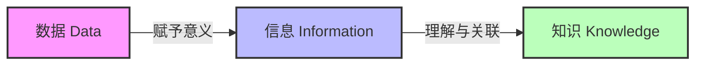

---

## 2. 知识图谱历史演变

知识图谱并非横空出世，它是人工智能几十年来对“如何让机器变聪明”这一问题探索的延续。

### 50-60年代：符号逻辑与自动推理

**核心**：这个时期不仅是AI的起步，也是**符号主义**的黄金期。人们试图用逻辑符号来表示知识。

- **通用问题解算器 (GPS)**：试图将“知识”和解题的“逻辑”分开。
    
- **语义网络 (Semantic Network)**：这是知识图谱的雏形。
    
- **例子**：
    
    - 逻辑推理：大前提“人都会死”，小前提“苏格拉底是人”，结论“苏格拉底会死”。
        
    - 语义网络：画一个圈代表“鸟”，画一个箭头指向“翅膀”，写上“有”。
        

### 70-80年代：专家系统与数据管理

**核心**：人们发现通用的AI太难做，于是开始做垂直领域的**专家系统**，并开始思考如何管理大量数据。

- **专家系统**：结合逻辑与特定领域数据。比如文档提到的 **MYCIN**（医疗诊断系统），它里面存了很多医生的规则。
    
- **面向对象数据库 (OODB)**：开始像现在写代码一样，把数据看作有属性的对象。
    
- **例子**：如果病人“发烧”且“头痛”，则有 80% 概率是“流感”。这就是典型的专家系统规则。
    

### 90年代：万维网与人工知识库

**核心**：互联网（Web 1.0）来了。人们开始尝试构建大规模的、人工整理的知识库。

- **人工知识库**：
    
    - **Cyc**：试图把人类所有的常识（比如“水往下流”）都教给机器。
        
    - **WordNet**：英语词汇的概念库。
        
    - **HowNet (知网)**：董振东先生创建的中文常识知识库。
        
- **半结构化数据**：XML, HTML 等标签语言出现，让网页数据带上了一点点结构。
    

### 21世纪：群体智慧与语义网

**核心**：Web 2.0 时代，大家一起贡献内容（**Wikipedia**），数据量爆炸。

- **群体智慧**：维基百科是典型代表，靠全世界的人一起写，形成了巨大的知识源。
    
- **语义网 (Semantic Web)**：万维网之父 Tim Berners-Lee 提出的愿景，希望网页内容不仅给人看，也能给机器看（即数据的含义与图一起编码）。
    

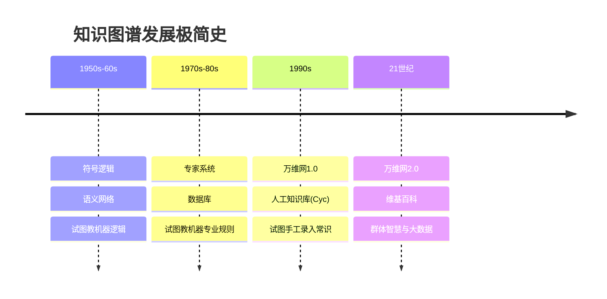

---

## 3. 现今的知识图谱 & 里程碑

### 现今的格局

现在的知识图谱主要分为两大阵营：

1. **开源社区驱动**：
    
    - **DBpedia / YAGO / Wikidata**：这些大多是从维基百科里抽取结构化数据生成的。
        
    - **Freebase**：曾经非常著名，后被 Google 收购，是 Google 知识图谱的基础。
        
2. **企业驱动**：
    
    - **Google Knowledge Graph**：当你搜“刘德华”，右边出来的那个详细卡片就是它。
        
    - **Facebook / LinkedIn**：社交图谱（人与人的关系）。
        
    - **Amazon**：商品图谱（商品与商品的关系）。
        

### 关键里程碑

- **1985 Cyc**：常识推理的先驱。
    
- **1990 WordNet**：词汇关系的基石。
    
- **2001 Wikipedia**：高质量数据源，拥有 Infobox（信息框）、Category（分类）等丰富的结构化数据，是现代知识图谱的奶牛。
    
- **2012 Google Knowledge Graph**：Google 正式发布知识图谱，将这个概念推向大众，标志着搜索从“关键词匹配”走向“实体理解”。
    

---

## 4. 结构化知识：核心构造

### 实体和关系

这是知识图谱最基本的**原子单位**。知识图谱本质上就是一张图（Graph）。

- **节点 (Node)** = **实体 (Entity)**：世间万物，如人、地名、电影、概念。
    
- **边 (Edge)** = **关系 (Relation)**：连接实体的纽带。
    

### 三元组 (The Triplet)

文档中强调了事实（Fact）的表达方式：**[(头实体, 关系, 尾实体)]**  
或者用公式表示：( (Head, Relation, Tail) )，简称 ( (h, r, t) )。

- **头 (Subject)**：主体实体
    
- **关系 (Predicate)**：关系类别
    
- **尾 (Object)**：客体实体
    

**例子**：  
我们有一句话：“Paul Schuster 出生于 Dresden。”  
在知识图谱中，它被表示为：

- **头实体**：Paul Schuster
    
- **关系**：born_in (出生于)
    
- **尾实体**：Dresden
    

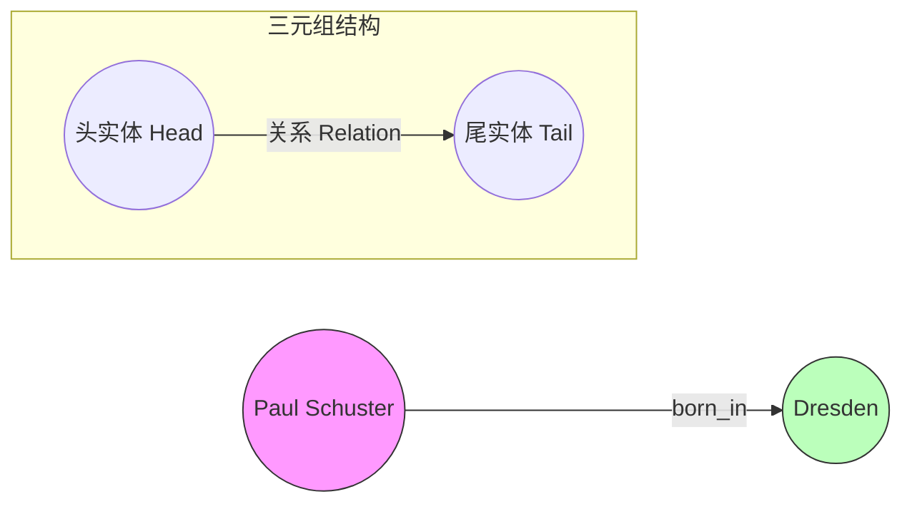

### 知识图谱的特征

1. **图结构**：非线性的，像神经网络一样四通八达。
    
2. **语义丰富**：数据的含义直接编码在图中（比如“出生于”这个边本身就有明确含义）。
    
3. **接近自然语言**：相比于冷冰冰的 SQL 数据库表格，( (Paul, born_in, Dresden) ) 这种形式更像人类的语言逻辑。
    

---

## 5. 知识图谱实例

文档列举了几个著名的库：

- **DBpedia**：直接从维基百科的 Infobox（就是词条右边的那个属性框）里抽取数据。
    
- **YAGO**：结合了 Wikipedia 的广度和 WordNet 的深度（分类体系）。
    
- **Wikidata**：维基媒体基金会运作的，任何人都可以去编辑的结构化数据库（在这个库里，每个实体都有一个Q号，比如地球是 Q2）。
    

---

## 6. 知识图谱的应用

为什么我们要费这么大劲构建知识图谱？文档列举了三个最主要的应用场景。

### 1. 问答系统 (Question Answering)

传统的搜索是匹配关键词。如果你搜“美国总统的老婆”，传统引擎可能会找包含这三个词的文章。  
但在知识图谱中，系统进行的是**图上的推理**。

- **原理**：
    
    1. 定位实体：“美国总统”（这里可能指代当前的总统，比如 Biden）。
        
    2. 寻找关系：“Spouse”（配偶）。
        
    3. 找到尾实体：“Jill Biden”。
        
- **优势**：直接给出精准答案，而不是十个蓝色链接。
    

### 2. 搜索引擎 (Search Engines)

- **语义理解**：解决歧义。比如你搜“苹果”，如果你之前搜过“乔布斯”，知识图谱知道你现在关注的是科技公司，而不是水果。
    
- **知识卡片**：Google 搜索结果右侧的卡片，直接把实体的所有属性（身高、年龄、作品）展示给你，不需要你点进网页看。
    

### 3. 推荐系统 (Recommendation Systems)

传统的推荐可能基于“买了尿布的人也买了啤酒”。知识图谱推荐则基于**深层逻辑**。

- **例子**：你看了电影《星际穿越》。
    
    - 知识图谱分析：
        
        - $(\text{星际穿越}, \text{导演}, \text{诺兰})$
            
        -  $(\text{星际穿越}, \text{类型}, \text{科幻})$
            
    - 推理：你可能喜欢“诺兰”导的片子，或者“硬科幻”。
        
    - 推荐：推荐《盗梦空间》（也是诺兰导的）或《火星救援》（也是硬科幻）。
        
- **优势**：具有**可解释性**（“推荐这部片是因为你喜欢诺兰导演”）。
    

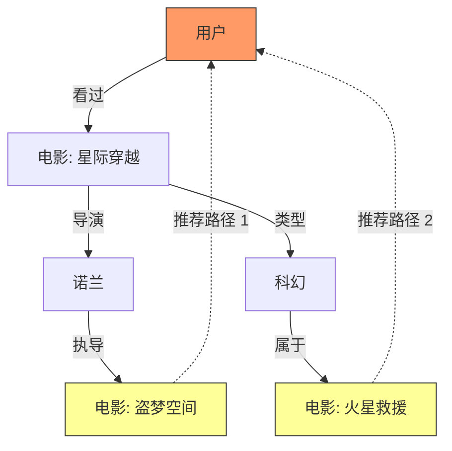

---
你好！我是 Gemini Enterprise。我们将继续深入《05_知识图谱.pdf》的核心部分。

上一节我们讲到知识图谱是由“实体”和“关系”构成的图。这一节我们将进入**“知识表示学习”**（Knowledge Representation Learning, KRL）。

简单来说，这一部分的任务是：**如何把这一张巨大的图，塞进计算机能懂的“数学空间”里，让计算机能算、能推理。**

---

# 知识表示学习 (Knowledge Representation Learning)

## 1. 动机与目标

### 机器学习的核心公式

文档引用了图灵奖得主 Yoshua Bengio 的观点：  
$$ \text{机器学习} = \text{表示 (Representation)} + \text{目标 (Objective)} + \text{优化 (Optimization)} $$

其中，**数据表示**是基础。如果数据表达得好，模型学起来就容易；表达得不好，模型就很难从里面提取规律。

### 什么是表示学习？ (One-hot vs. Distributed)

为了让计算机理解词语，我们经历了两个阶段：

1. **One-hot 表示 (独热表示)**：这是传统词袋模型的基础。
    
    - **原理**：假设字典里有1000个词，每个词就是一个长长的向量，只有一个位置是1，其他全是0。
        
    - **例子**：
        
        - Sun (太阳): $[0, 0, ..., 1, 0, ...]$
            
        - Star (星星): $[0, 0, ..., 0, 1, ...]$
            
    - **缺陷**：文档中给出了一个关键公式 $sim(star, sun) = 0$。在计算机看来，这两个向量正交（垂直），没有任何相似性。但实际上太阳就是恒星，它们应该很像。这种表示太稀疏，切断了词与词之间的联系。
        
2. **分布式表示 / 嵌入 (Distributed Representation / Embedding)**：
    
    - **原理**：把对象表示为**稠密 (Dense)**、**实值 (Real-valued)**、**低维 (Low-dimensional)** 的向量。
        
    - **优势**：捕捉语义。比如“太阳”和“星星”在向量空间里的距离会很近。
        

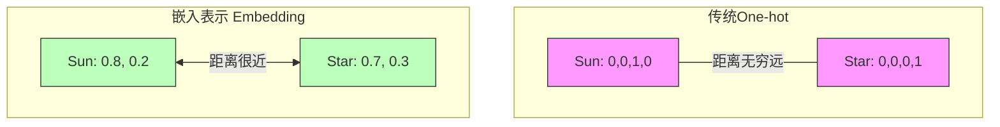

### 表示学习的主要思想

文档强调了三个关键词来描述这种表示：

1. **稠密 (Dense)**：不是只有0和1，而是充满了具体的小数。
    
2. **实值 (Real-valued)**：连续的数值。
    
3. **低维 (Low-dimensional)**：相比于词表成千上万的维度，这里通常只有几十到几百维。
    

**主要目标**：

- 缓解稀疏性问题（Sparsity）。
    
- 实现知识迁移：因为是在同一个空间里，苹果（水果）和梨（水果）的属性可以相互参考。
    

### 知识图谱的表示：从符号到向量

- **传统方法 (RDF 符号三元组)**：计算机只知道 `(A, relation, B)`，但它很难高效计算 A 和 B 的相似度。
    
- **KRL (知识表示学习)**：目标是将知识图谱中的实体和关系**编码到低维向量空间**。
    

---

# 基础模型 (Basic Models)

为了把三元组 $(h, r, t)$ 变成向量，我们需要定义一个**评分函数 (Scoring Function)**。这个函数的作用是给三元组打分：**如果这个三元组是真的，分数要高（或能量要低）；如果是假的，分数要低。**

文档将模型主要分为两类：

1. **平移距离模型**：基于距离测度。
    
2. **语义匹配模型**：基于相似度匹配。
    

---

## 2. 平移模型：TransE

这是最经典、最基础的模型（Bordes et al., NIPS 2013）。

### 核心直觉：平移 (Translation)

它的灵感来自于词向量中的经典例子：  
$$ C(\text{King}) - C(\text{Man}) + C(\text{Woman}) \approx C(\text{Queen}) $$  
$$ C(\text{China}) - C(\text{Beijing}) \approx C(\text{France}) - C(\text{Paris}) $$

TransE 把这个思想搬到了知识图谱中。它认为**“关系”就是从“头实体”到“尾实体”的一次平移运动**。

**公式**：  
对于一个正确的三元组 $(h, r, t)$，我们希望：  
$$ \mathbf{h} + \mathbf{r} \approx \mathbf{t} $$  
即：头实体向量 + 关系向量 $\approx$ 尾实体向量。

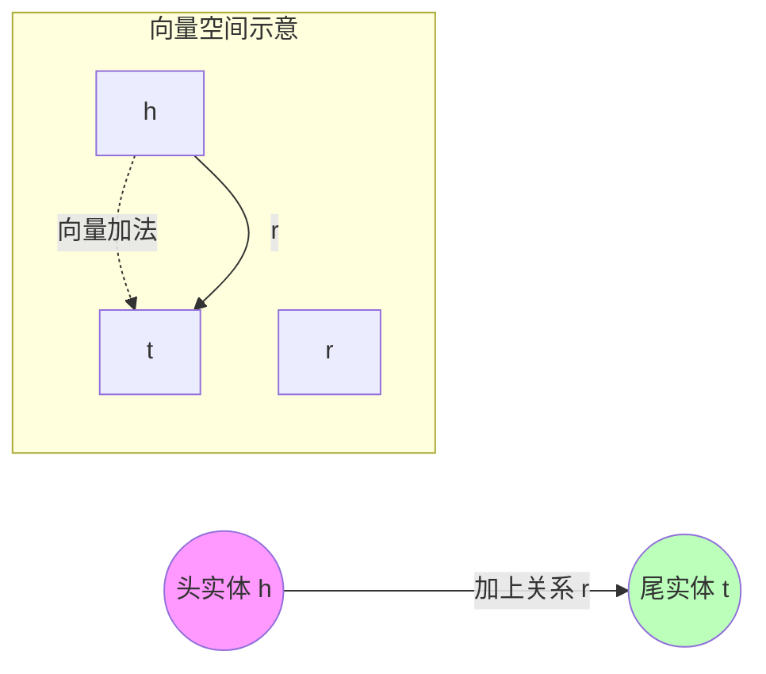

### 目标函数 (Objective Function)

为了训练这个模型，我们需要定义好坏的标准。

- **能量函数 (Energy Function)**：衡量 $h+r$ 和 $t$ 离得有多远。  
    $$ f(h, r, t) = || \mathbf{h} + \mathbf{r} - \mathbf{t} || $$  
    对于正确的三元组，这个值越小越好（最好是0）。
    
- **训练目标**：这是一个**Margin-based ranking loss**（基于间隔的排序损失）。
    
    - 让图谱中存在的**正例**（True Triplet）能量低（距离近）。
        
    - 让图谱中不存在的**负例**（Corrupted Triplet，比如把头换成错的）能量高（距离远）。
        
    - 二者之间要拉开一个安全距离（Margin, $\gamma$）。
        

### 实体预测 (Entity Prediction)

一旦模型训练好了，我们就可以做填空题。  
**例子**：  
已知：`WALL-E` (瓦力) + `has_genre` (类型) = `?`

1. 计算向量：$\mathbf{v}_{\text{WALL-E}} + \mathbf{v}_{\text{genre}}$
    
2. 在向量空间里找：谁离这个计算结果最近？
    
3. 发现 `Animation` (动画片) 的向量就在附近。
    
4. 预测结果：`Animation`。
    

**预测性能**：文档提到在数据集 **Freebase15K** 上，TransE 展现了很好的效果，成为了后续所有模型的基准（Baseline）。

---

## 3. 语义模型 (Semantic Models)

这类模型不玩“向量加法”，而是玩“矩阵乘法”或“点积”，以此来衡量头实体和尾实体的匹配程度。

### RESCAL (双线性模型)

- **原理**：它把每个关系 $r$ 看作一个**矩阵** $M_r$。这个矩阵描述了头实体 $h$ 和尾实体 $t$ 之间所有维度的交互。
    
- **评分函数**：  
    $$ f(h, r, t) = \mathbf{h}^T \mathbf{M}_r \mathbf{t} $$
    
- **特点**：捕捉能力很强，因为矩阵 $M_r$ 包含了 $h$ 和 $t$ 所有部分之间的关系。但缺点是参数太多了（矩阵很大），容易过拟合，计算量大。
    

### DistMult (对角矩阵模型)

- **原理**：为了给 RESCAL 减肥，DistMult 强行规定关系矩阵 $M_r$ 必须是**对角矩阵**（只有对角线上有值，其他都是0）。
    
- **评分函数**：这本质上变成了三个向量的**逐元素相乘**：  
    $$ f(h, r, t) = \mathbf{h}^T \text{diag}(\mathbf{r}) \mathbf{t} = \sum_i h_i \cdot r_i \cdot t_i $$
    
- **特点**：参数大大减少，计算非常快。但因为它只是简单的乘积，它是**对称的**（$h$ 和 $t$ 换位置结果一样），所以很难处理有方向的关系（比如“父亲”关系，A是B父亲，B肯定不是A父亲，但DistMult分不清）。
    

### HolE (全息嵌入)

- **原理**：试图结合 RESCAL 的表达能力和 DistMult 的效率。
    
- **评分函数**：使用了**循环相关 (Circular Correlation)** 操作。
    
- **特点**：它既像 RESCAL 一样能捕捉复杂关系，又像 DistMult 一样参数少。它通过一种压缩的方式（全息）来存储实体间的交互信息。
    

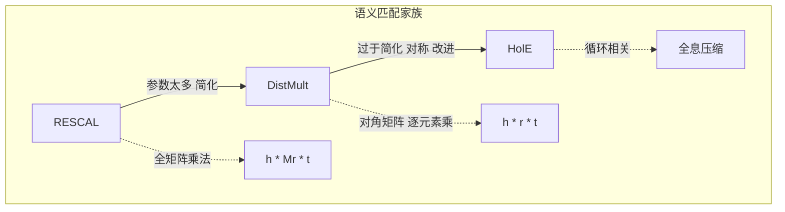

---
你好！我是 Gemini Enterprise。我们继续深入《05_知识图谱.pdf》的讲解。

上一节我们介绍了最基础的 TransE 模型，它假设 $h+r=t$。但在现实世界中，关系远比简单的“1对1”平移要复杂得多。这一节我们将探讨如何解决这些**关键挑战**，特别是如何处理**复杂关系**。

---

# 知识表示学习的关键挑战

根据文档，知识表示学习面临三大核心挑战：

1. **处理复杂关系** (Handling Complex Relations)
    
2. **融合外部信息** (Incorporating External Information)
    
3. **知识推理** (Knowledge Reasoning)
    

本节我们将重点攻克第一个挑战：**处理复杂关系**。

为了解决这个问题，研究人员提出了多种思路：

- **投影 (Projection)**：把实体投影到特定的空间去。
    
- **嵌入空间 (Embedding Space)**：换个数学空间玩（比如复数空间、高斯分布）。
    
- **编码模型 (Encoding Models)**：用更强的神经网络（CNN, Transformer, GNN）来硬算。

---
## 1. 复杂关系 (Complex Relations)

### 什么是复杂关系？

TransE 模型有一个致命的弱点，它处理不好 **1对N** (1-to-N)、**N对1** (N-to-1) 和 **N对N** (N-to-N) 的关系。

**例子**：

- **事实1**：(美国, 总统, 奥巴马) $\rightarrow$ $(USA, president, Obama)$
    
- **事实2**：(美国, 总统, 特朗普) $\rightarrow$ $(USA, president, Trump)$
    

**TransE 的困境**：  
如果用 TransE 的公式 $h + r = t$：  
$$ \text{USA} + \text{president} \approx \text{Obama} $$  
$$ \text{USA} + \text{president} \approx \text{Trump} $$  
数学告诉我们要让这两个式子同时成立，就必须：  
$$ \text{Obama} \approx \text{Trump} $$  
这意味着在向量空间里，奥巴马和特朗普变成了同一个人（向量极度重合）。但这显然是错的，他们是两个完全不同的实体。这就是 TransE 在处理“一对多”关系时的局限性。

---

## 2. 投影模型 (Projection Models)

为了解决上面的问题，核心思想是：**不要让同一个实体在所有关系里都用同一个向量，而是根据不同的关系，把实体“变身”（投影）成不同的样子。**

### TransH (将实体投影到超平面)

**原理**：  
TransH 认为，一个实体（比如“美国”）有多个侧面。当我们谈论“总统”关系时，应该把“美国”投影到“政治”这个侧面（超平面）上去比较。

- **机制**：对于每个关系 $r$，它定义一个超平面（由法向量 $w_r$ 决定）。
    
- **公式**：它不直接算 $h+r=t$，而是先算出投影后的向量 $h_{\perp}$ 和 $t_{\perp}$，然后在超平面上满足：  
    $$ h_{\perp} + d_r \approx t_{\perp} $$  
    其中 $d_r$ 是关系在超平面上的平移向量。
    
- **效果**：这样，奥巴马和特朗普虽然在原空间不同，但在“美国总统”这个超平面上的投影可以很接近，或者允许“美国”针对不同的人有不同的投影点。
    

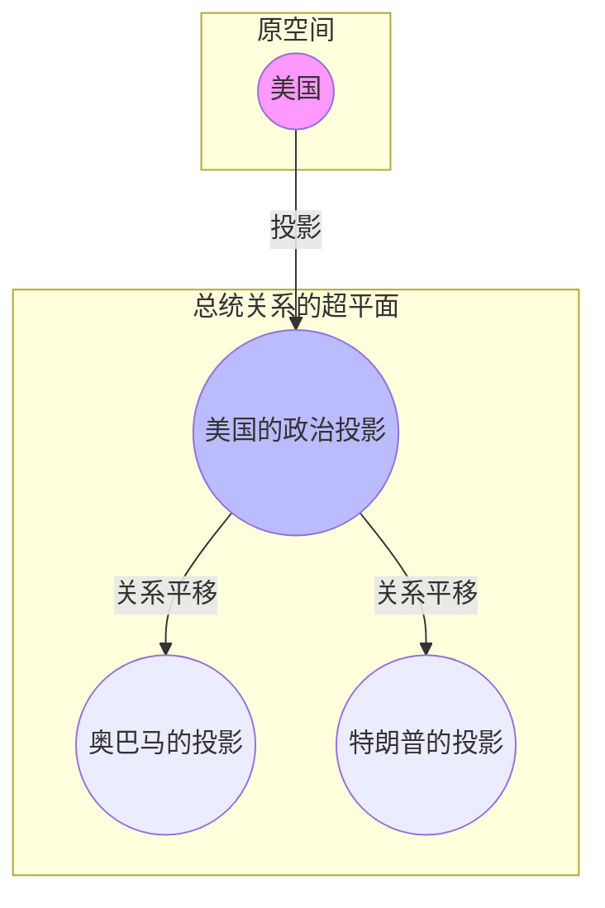

### TransR (将实体投影到关系空间)

**原理**：  
TransH 只是投影到平面，TransR 更进一步：它认为**实体空间**和**关系空间**根本就是两个不同的世界。

- **机制**：对于每个关系 $r$，定义一个投影矩阵 $M_r$。
    
- **公式**：先用矩阵把头尾实体从“实体空间”搬运到“关系空间”：  
    $$ h_r = h M_r, \quad t_r = t M_r $$  
    然后在关系空间里做加法：  
    $$ h_r + r \approx t_r $$
    
- **大白话**：就像“苹果”这个词，在“水果空间”里它和梨很近；在“科技空间”里它和微软很近。TransR 就是负责根据语境（关系）切换空间的。
    

### 实例对比

文档中列举了 Titanic（泰坦尼克号）的例子。

- 泰坦尼克号既是 `War_film`（战争片），又是 `Romance_Film`（爱情片）。
    
- **TransE** 会糊涂，觉得战争片和爱情片是一回事。
    
- **TransR** 会把泰坦尼克号分别投影：
    
    - 在“战争”关系空间里，它靠近其他战争片。
        
    - 在“爱情”关系空间里，它靠近其他爱情片。
        

### TransD (动态映射矩阵)

**原理**：  
TransR 的问题是矩阵 $M_r$ 参数太多了，算起来慢。TransD 提出，投影矩阵不仅应该跟**关系**有关，还应该跟**实体**自己有关（比如头实体和尾实体的类型不同，投影方式也该不同）。

- **机制**：它用两个向量的运算动态生成一个投影矩阵，既灵活又省参数。
    

---

## 3. 嵌入空间：玩转复数与高斯分布 (Embedding Space)

前面的模型大多是在**实数向量空间**里做加法或乘法，这一类模型试图通过改变底层的数学空间来突破瓶颈。

### ComplEx (复数空间)

**原理**：  
它把实体和关系表示为**复数向量** (Complex Numbers)，而不是实数。

- **核心优势**：解决**对称与反对称关系**。
    
    - 实数点积是对称的 ($a \cdot b = b \cdot a$)。
        
    - 复数有个“共轭”操作。ComplEx 计算 $Re(<h, r, \bar{t}>)$。
        
    - 这让它能很好地区分“A是B的朋友”（对称）和“A是B的父亲”（反对称）。
        

### RotatE (旋转模型)

**原理**：  
受**欧拉公式** ($e^{i\theta} = \cos\theta + i\sin\theta$) 启发，RotatE 认为关系不是平移，而是**旋转**。

- **公式**：将关系 $r$ 建模为在复数空间中从 $h$ 到 $t$ 的旋转。  
    $$ t = h \circ r \quad (\text{其中 } |r_i|=1) $$
    
- **大白话**：头实体是一个点，关系就是把它在圆圈上转一个角度 $\theta$，转完之后这就变成了尾实体。
    
- **优势**：非常擅长表示对称（转180度回原位）、反对称、互逆（反着转）等逻辑模式。
    

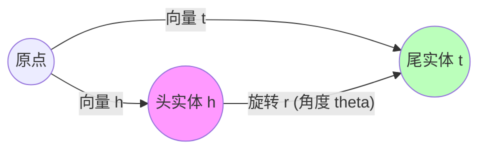

### KG2E (高斯分布)

**原理**：  
它认为之前的模型都太绝对了，每个实体就是一个确定的点。但现实中是有**不确定性**的。

- **机制**：将实体和关系建模为**高斯分布**（正态分布）。每个实体由“均值”和“协方差”组成。
    
- **优势**：如果一个概念很模糊（比如“大型猫科动物”），它的协方差就很大（涵盖范围广）；如果很具体（比如“这只猫”），协方差就很小。用 KL 散度来衡量两个分布的距离。
    

---

## 4. 编码模型：神经网络派 (Encoding Models)

这一派不纠结于几何解释（平移、旋转），而是直接上强力的神经网络架构来提取特征。

### NTN (神经张量网络)

- **机制**：结合了双线性模型（关联矩阵）和多层感知器（MLP）。它用一个张量（三维矩阵）来从不同角度“切片”分析 $h$ 和 $t$ 的关系。
    
- **缺点**：参数量巨大，算不动。
    

### ConvE (2D 卷积)

- **机制**：把头实体向量 $\mathbf{h}$ 和关系向量 $\mathbf{r}$ **重塑 (Reshape)** 成 2D 的图片（矩阵），然后用处理图像的 **CNN (卷积神经网络)** 去扫一遍，提取特征。
    
- **优势**：参数少，能捕捉深层的非线性特征。
    

### ConvKB (卷积编码)

- **机制**：不把向量变图片，而是直接把 $h, r, t$ 三个向量拼在一起，像一句话一样，用 1D 卷积去卷。
    

### CoKE (Transformer 编码)

- **机制**：用 **Transformer** (类似 BERT 的架构) 作为编码器。
    
- **优势**：利用了 Transformer 强大的上下文理解能力，它不只看三元组，还能看图谱中的路径和上下文信息。
    

### R-GCN (关系图卷积网络)

- **机制**：这是**图神经网络 (GNN)** 的代表。
    
- **原理**：一个实体的表示不仅仅取决于它自己，还取决于它的**邻居**。R-GCN 通过在图上进行**信息传播 (Aggregation)** 和 **更新 (Update)**，聚合邻居的信息来强化当前实体的表示。
    
- **大白话**：要了解“奥巴马”，不仅看他自己，还要看他周围连接的“美国”、“米歇尔”、“哈佛大学”等节点，把这些邻居的信息吸取过来，形成更完整的奥巴马向量。
    

---

## 5. 总结

文档最后对这些模型做了一个小结：

- **基础模型** (TransE 等) 简单高效，但不能很好地处理复杂关系。
    
- **进阶模型** 各显神通：
    
    - **投影派** (TransH, TransR, TransD) 解决一对多问题。
        
    - **空间派** (RotatE, ComplEx, KG2E) 解决对称、不确定性问题。
        
    - **神经网络派** (ConvE, R-GCN, CoKE) 利用深度学习架构提取深层特征。
        

---

# 挑战二：融合外部信息 (Incorporating External Information)

知识图谱虽然结构清晰，但往往信息量有限（稀疏）。为了让模型更聪明，我们需要引入“外援”。文档指出了三种核心外部信息源：

1. **文本信息 (Text)**：维基百科里的详细描述。
    
2. **结构信息 (Structure)**：层级分类（比如 猫 -> 猫科 -> 哺乳动物）。
    
3. **图像信息 (Image)**：实体的照片。
    

---

## 1. 文本信息：让模型“读”书

仅仅知道 `(Steve Jobs, founder_of, Apple)` 是不够的。如果我们有一段关于乔布斯的传记描述，模型就能更全面地理解他。

### DKRL (基于描述的知识表示学习)

- **原理**：
    
    - **结构通道**：照常学习 TransE 的向量（$h_s$）。
        
    - **描述通道**：用 **CNN**（卷积神经网络）去读实体的文本描述，提取出一个描述向量（$h_d$）。
        
    - **融合**：迫使这两个向量尽可能一致，或者把它们拼起来。
        
- **大白话**：就像相亲。你看照片（结构）是一个印象，看他的自我介绍（文本描述）是另一个印象。DKRL 就是要把这两个印象结合起来，形成一个更真实的人设。即使这个人没照片（不在图谱训练集中），光看自我介绍也能猜个八九不离十（Zero-shot 能力）。
    

### SSP (语义空间投影)

- **原理**：
    
    - 它认为文本描述和三元组之间有强关联。
        
    - **机制**：将文本描述产生的向量投影到一个**语义超平面**上，作为一个约束条件来指导 Embedding 的学习。
        

---

## 2. 结构信息：利用层级分类

世界是有层级的。一个实体往往属于某种“类型” (Type)。

### TKRL (基于层级类型的知识表示学习)

- **动机**：一个实体在不同场景下身份不同。
    
    - **例子**：特朗普。
        
        - 在 `(Trump, president_of, USA)` 里，他是**政治家**。
            
        - 在 `(Trump, acted_in, Home Alone 2)` 里，他是**演员**。
            
        - 在 `(Trump, father_of, Ivanka)` 里，他是**人/父亲**。
            
- **原理**：
    
    - TKRL 为每个实体引入了**类型投影矩阵**。
        
    - **递归层级编码器 (RHE)**：类型是有树状结构的（人 -> 政治家）。模型会顺着这个树，把各层级的信息编码进去。
        
- **优势**：特别适合**长尾数据**（Long-tail）。有些冷门实体数据很少，但只要知道它的“类型”（比如它是一种罕见的草药），模型就能根据类别的先验知识猜出它的大致属性。
    

### KR-EAR (区分属性与关系)

- **动机**：图谱里混杂着两类边：
    
    1. **关系 (Relation)**：连接两个实体（如：北京 -> 中国）。
        
    2. **属性 (Attribute)**：描述实体的数值或特征（如：鸟 -> 有翅膀，姚明 -> 2.26米）。
        
- **原理**：KR-EAR 提出要把这两者分开建模。用**关系三元组编码器**处理实体间关系，用**属性三元组编码器**处理属性值。这样互不干扰，效果更好。
    

---

## 3. 图像信息：让模型“看”图

### IKRL (基于图像的知识表示学习)

- **动机**：有些东西文字说不清，看图秒懂。比如形状、颜色、外观。
    
- **原理**：
    
    - **图像编码器**：使用经典的 **AlexNet** 等神经网络提取图片的视觉特征。
        
    - **注意力机制 (Attention)**：一个实体可能有的一张正脸照，一张侧脸照。模型会自动学习哪张照片对当前任务更重要，然后融合这些特征。
        
- **例子**：判断 `(长颈鹿, feature, 长脖子)`。如果模型看过长颈鹿的照片，它通过视觉特征能很容易学会这个知识。
    

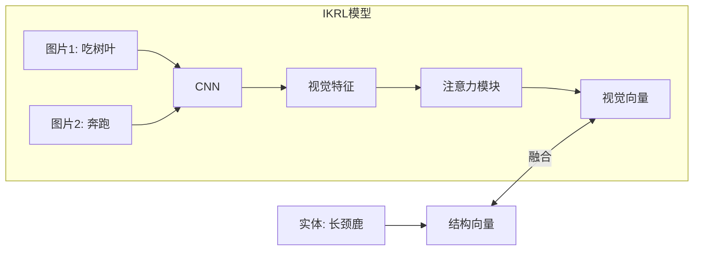

---

# 挑战三：知识推理 (Knowledge Reasoning)

这是知识图谱最高级的应用：**基于已有的知识，推断出未知的新知识。**  
文档重点介绍了两种推理路径：**基于路径** 和 **基于逻辑规则**。

## 1. 基于路径的方法 (Path-based)

如果 A 和 B 之间没有直接连线，但通过 A->X->Y->B 能连通，这条路径就蕴含了推理逻辑。

### Path-Ranking (PRA, 路径排序算法)

- **原理**：**随机游走 (Random Walk)**。
    
    - 想预测 A 和 B 有没有关系？从 A 开始随机在图上瞎逛。
        
    - 如果在有限步数内，经常能逛到 B，说明 A 和 B 关系密切。
        
    - 模型会发现特定的路径模式：比如 `Grandfather` 关系往往对应 `Father` -> `Father` 这条路径。
        
- **优缺点**：可解释性很强（你可以看到它是怎么走的），但难以处理大规模图谱（路太多了走不过来）。
    

### Path-based TransE (PTransE)

- **原理**：结合了 TransE 的嵌入和路径信息。
    
- **公式**：对于路径 $h \xrightarrow{r_1} \dots \xrightarrow{r_n} t$，它希望：  
    $$ h + (r_1 + r_2 + \dots + r_n) \approx t $$  
    或者用 RNN (循环神经网络) 来把路径上的关系序列组合起来。
    

---

## 2. 逻辑规则 (Logic Rules)

利用人类总结的逻辑公式来推理。

### 常见的逻辑规则

- **结合律**：如果 A 是 B 父亲，B 是 C 父亲 $\rightarrow$ A 是 C 爷爷。
    
- **逆律**：A 是 B 老师 $\rightarrow$ B 是 A 学生。
    
- **对称律**：A 是 B 配偶 $\rightarrow$ B 是 A 配偶。
    

### KALE (联合嵌入)

- **原理**：将三元组（事实）和逻辑规则（规则）放在同一个框架下训练。
    
- **机制**：
    
    - 事实的评分：用 TransE 的分数。
        
    - 规则的评分：通过 t-norm模糊逻辑理论，计算该规则被满足的程度。
        
    - **目标**：让事实尽可能真，同时让规则尽可能被满足。
        

### pLogicNet (概率逻辑神经网络)

- **原理**：结合了 **马尔科夫逻辑网络 (MLN)** 和知识表示学习。
    
- **算法**：使用**变分 EM 算法**（Expectation-Maximization）。
    
    - **E-step (推理)**：利用现有的逻辑规则，去推断缺失的三元组（填补空白）。
        
    - **M-step (学习)**：根据补全后的图谱，重新更新逻辑规则的权重（看看哪条规则更靠谱）。
        
- **优势**：在推理的同时，还能筛选出高质量的规则。
    

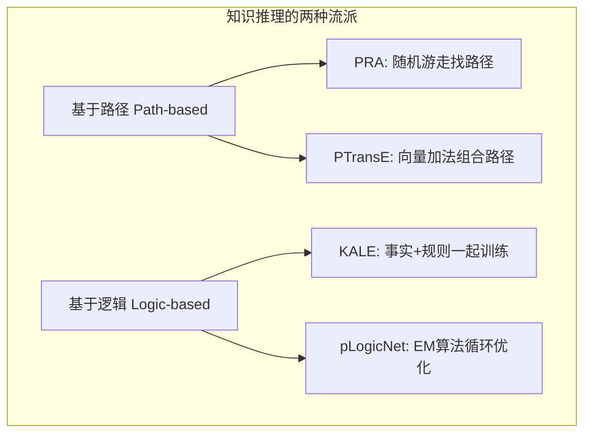

---

# 总结与展望

## 1. 其他挑战

文档简要提及了知识表示学习还面临的问题：

- **在线/快速学习**：图谱每天都在更新，不能每次加一个新词就重训整个模型。
    
- **稀疏性**：长尾分布严重，很多实体只有一两条记录（Few-shot / Zero-shot Learning）。
    

## 2. 开源代码

文档推荐了清华大学 NLP 实验室（THUNLP）开发的开源工具包：

- **OpenKE**：集成了 TransE, TransH, TransR, PTransE 等主流模型，非常适合上手实践。
    
    - _GitHub_: `https://github.com/thunlp`
        

## 3. 课堂总结 (Takeaway)

- **核心地位**：知识表示学习（Embedding）是连接离散符号（知识图谱）和连续计算（深度学习）的桥梁。
    
- **未来方向**：
    
    - **从人类学习**：人类具有极强的抽象和泛化能力（看一眼就能学会新概念），机器目前还差得远。
        
    - **深度融合**：深度学习 + 知识图谱 = **自然语言处理的变革**。
        
        - **理解**：让机器读懂复杂的阅读理解题。
            
        - **生成**：在法律、金融、医疗等专业领域，生成严谨、有逻辑的内容。
            

---
