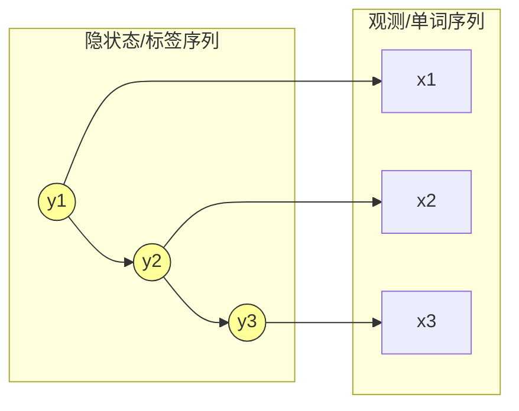
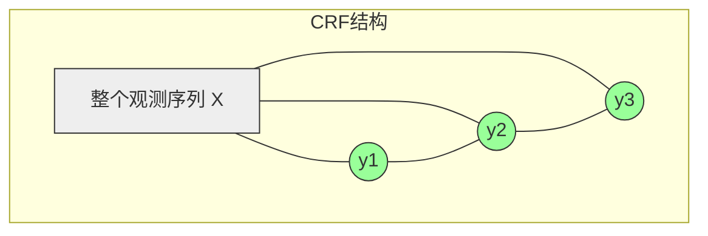
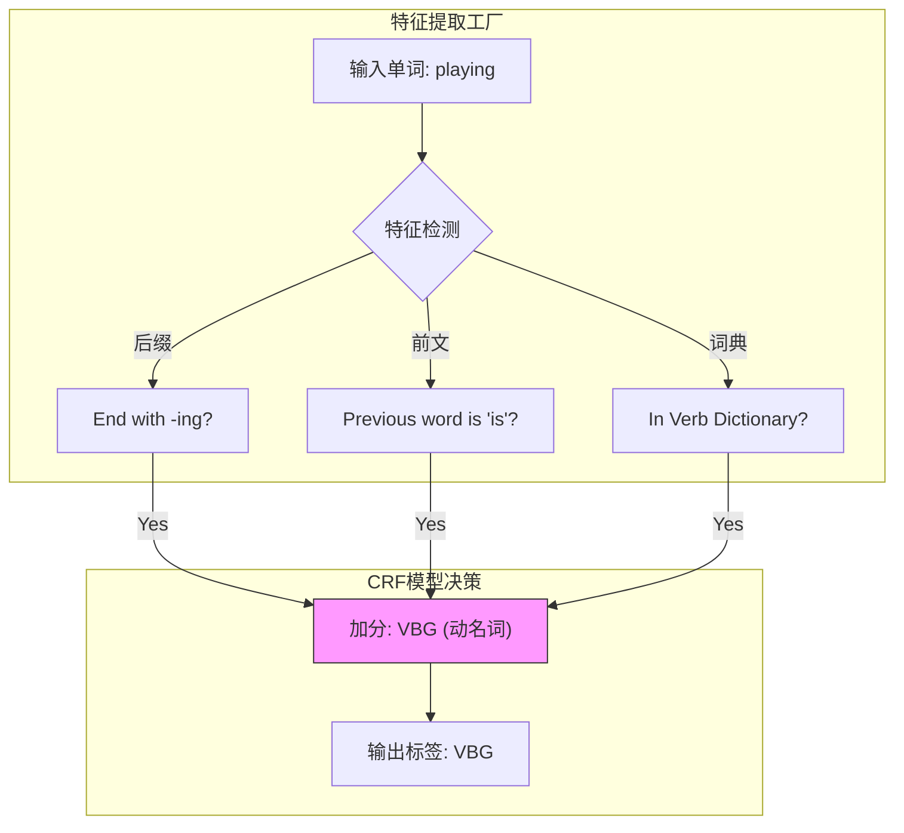
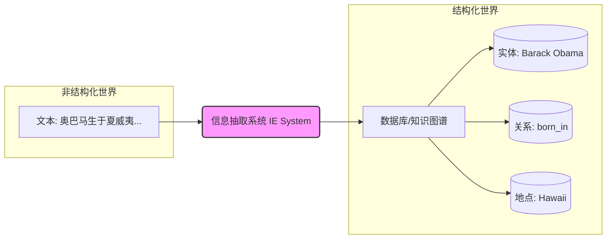
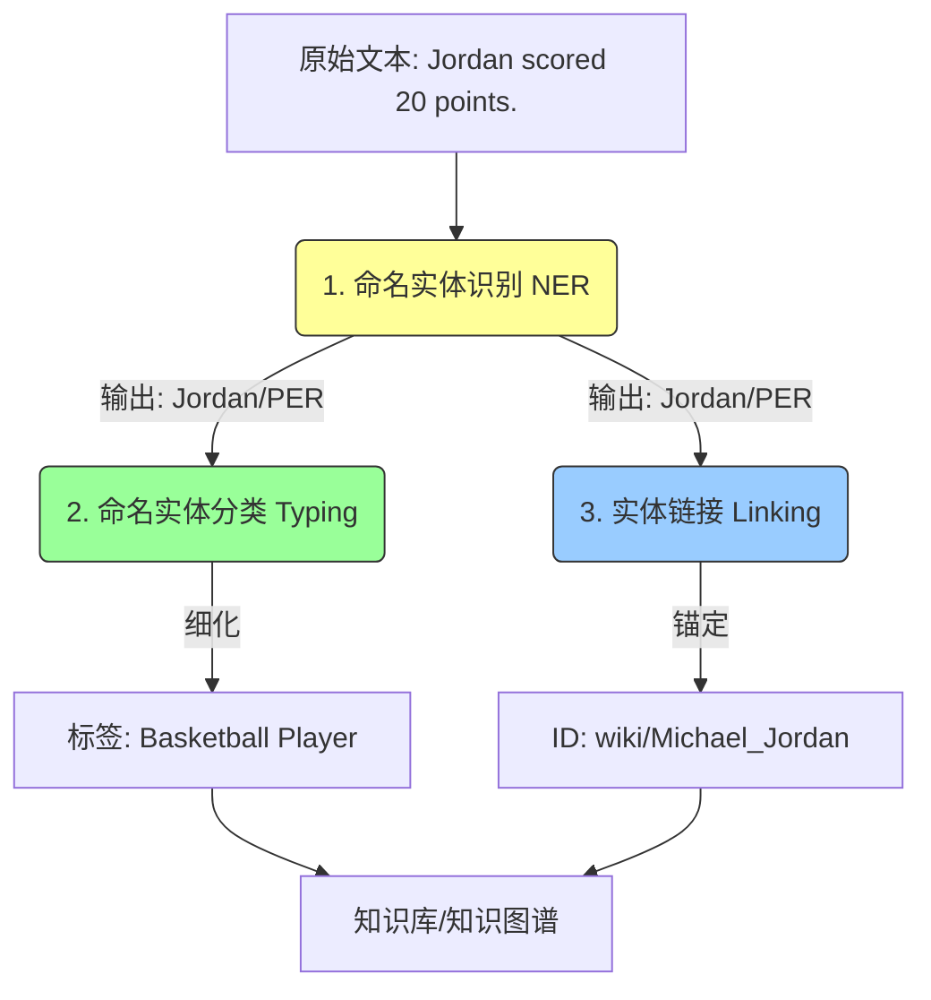
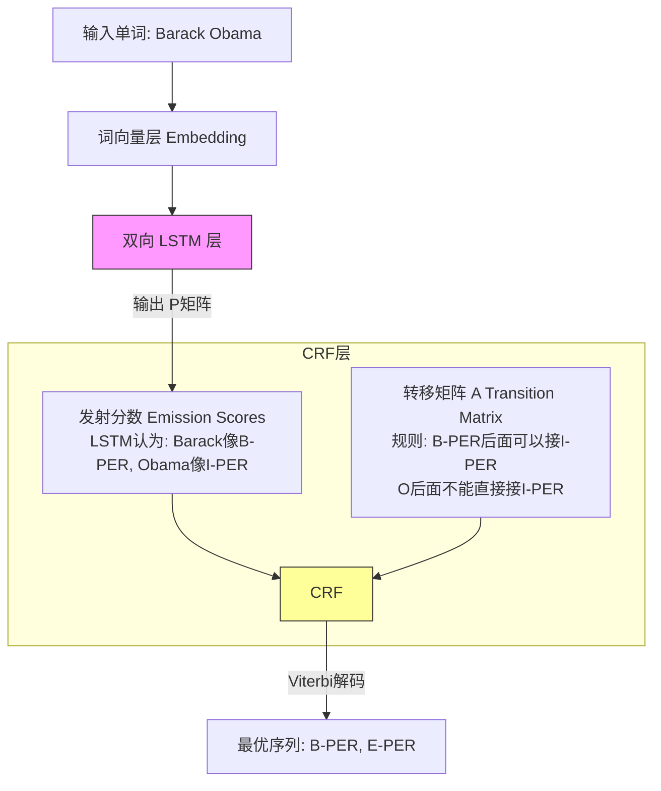
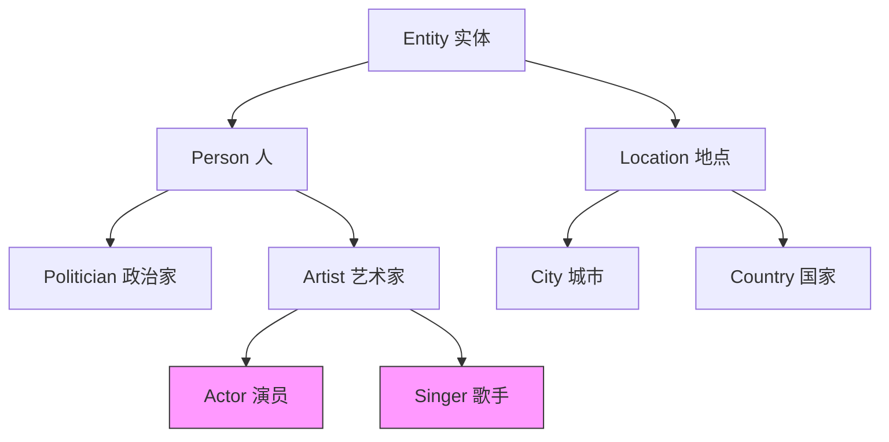
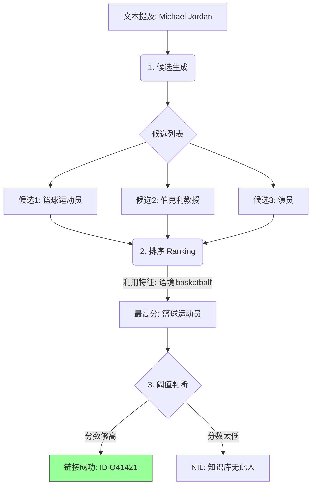

# 第一部分：序列标注的本质与框架

### 1. 什么是序列标注？（The "What"）

**第一性原理视角**：  
自然语言处理（NLP）中，很多任务本质上都是在做“映射”。序列标注解决的是**Sequence-to-Sequence (Seq2Seq)** 的一种特殊情况：输入一个序列，输出一个**等长**的标签序列。

- **输入（Input）**：一个观测序列 ($x_{1:T}$)（例如一句话中的单词）。
    
- **输出（Output）**：一个标签序列 ($y_{1:T}$)（例如每个单词对应的词性或实体类别）。
    

**大白话解释**：  
想象你在给一排站好的士兵（单词）贴标签。你不能随意贴，因为士兵之间是有关系的（比如“排长”后面通常跟着“班长”）。序列标注就是给队列里的每一个人贴上正确的身份牌。

**清晰例子**：

- **输入 (x)**：Barack Obama was born in Hawaii.
    
- **输出 (y)**：`NNP` (专有名词) `NNP` `VBD` (动词过去式) `VBN` (过去分词) `IN` (介词) `NNP`
    

### 2. 数学框架

根据文档，序列标注的问题可以定义为：

- 特征集合 $({f_i})$：连续的向量或离散的符号。
     
- 标签集合 ($l_i$)：**离散且有限**的集合（比如词性集合、实体类别集合）。
    

我们的目标是找到一个函数或模型，能够最准确地预测标签序列。

---

# 第二部分：模型的演进之路

文档中介绍了三种解决序列标注的思路，这是一条从“简单粗暴”到“精细化考虑上下文”的进化之路。

## 阶段一：简单分类（Simple Classification）

### 1. 核心思想

**“各自为战”**。  
不考虑相邻状态之间的联系，把序列中的每一个位置单独拿出来，做一个分类任务。

### 2. 局限性

- **大白话**：就像在做完形填空，但你只盯着那一个空看，完全不看前后的词。
    
- **例子**：单词 "book"。
    
    - 在 "I **book** a flight" 中是动词。
        
    - 在 "Read a **book**" 中是名词。
        
    - 简单分类模型如果只统计频率，可能会永远猜它是名词（因为名词用法更常见），从而导致错误。
        

尽管如此，文档提到这种方法有时能达到 ~93% 的准确率，因为很多词的词性是固定的。

---

## 阶段二：隐马尔可夫模型（HMM）——生成模型的代表

为了解决“各自为战”的问题，我们引入了**概率图模型（PGM）**。HMM 是其中的经典。

### 1. 第一性原理：生成过程（Generative Process）

HMM 认为，我们看到的句子（观测序列 (x)）是由背后看不见的“隐状态”（标签序列 (y)）生成的。

它基于两个核心假设（**马尔可夫假设**）：

1. **齐次马尔可夫假设**：现在的状态只和前一个状态有关（(y_t) 只依赖 (y_{t-1})）。
    
2. **观测独立假设**：现在的观测值只依赖于现在的状态（(x_t) 只依赖 (y_t)）。
    

### 2. 核心公式

HMM 建模的是联合概率密度：  
$P(x_{1:T}, y_{1:T}) = \prod_{t=1}^{T} P(y_t | y_{t-1}) \cdot P(x_t | y_t)$

这里包含两个关键矩阵（模型的参数 (\lambda)）：

1. **转移概率（Transition Probability）** ($P(y_t | y_{t-1})$)：标签之间的跳转关系。
    
    - _例子_：由“动词”变成“名词”的概率是多少？
        
2. **生成概率/发射概率（Emission Probability）** ($P(x_t | y_t)$)：由标签生成单词的概率。
    
    - _例子_：如果当前标签是“名词”，生成单词“Hawaii”的概率是多少？
        

### 3. 大白话解释 HMM

HMM 就像一个**蹩脚的剧本作家**。

- 他先脑子里想好下一个词的词性（比如“现在我要写一个动词”），这取决于他上一个词写了什么词性（**转移**）。
    
- 确定了词性后，他再去字典里那个词性分类下查字，挑一个词写在纸上（**生成/发射**）。
    
- 作为读者的我们，只看得到纸上的字（(x)），要反推作家脑子里的词性序列（(y)）。
    

### 4. HMM 的三个核心问题

文档中重点提到了 HMM 的运作机制：

1. **有监督学习**：简单的统计。数数多少次“名词”后面跟“动词”，数数多少次“名词”对应单词“Apple”。
    
2. **无监督学习**：如果只有 (x) 没有 (y)，怎么学？使用 **EM算法（前向后向算法）**。
    
3. **推断（解码）**：已知模型参数和一句话，怎么找到最可能的标签序列？使用 **维特比算法（Viterbi）**。
    
    - _直觉_：动态规划。不要每条路都走到黑，每一步都保留当前最好的路径概率，步步为营。
        

---

## 阶段三：条件随机场（CRF）——判别模型的王者

HMM 有个缺点：它假设 (x_t) 只依赖 (y_t)。但实际上，一个词的词性可能和整个句子的上下文都有关。为了解决这个问题，CRF 登场了。

### 1. 第一性原理：判别模型（Discriminative Model）

CRF 不去管数据是怎么生成的（不建模 (P(x,y))），而是直接面对问题：给你 (x)，最可能的 (y) 是什么？即建模条件概率 (P(y|x))。

**线性链 CRF（Linear Chain CRF）** 是最常用的形式。

### 2. 核心公式与全局归一化

CRF 使用一个打分函数，然后用 Softmax 归一化：

$P(y_{1:T} | x_{1:T}) = \frac{1}{Z} \exp \left( \sum_{t=1}^{T} \sum_{k} w_k f_k(y_t, y_{t-1}, x_{1:T}, t) \right)$

- **特征函数 ($f_k$)**：这是 CRF 强大的地方。它可以是任意特征！
    
    - _例子_：如果 ($x_t$) 是 "Bank" 且 ($x_{t-1}$) 是 "River"，则 ($y_t$) 很可能是 "名词"。HMM 很难直接利用 "River" 来推断 "Bank"，但 CRF 可以轻松定义这种特征。
        
- **权重 ($w_k$)**：每个特征的重要性，通过训练学得。
    
- **(Z)**：归一化因子（Partition Function）。它确保所有可能的路径概率加起来等于 1。这需要计算所有可能的标签序列的和，计算量大，但保证了**全局最优**。
    

### 3. 大白话解释 CRF

CRF 就像一个**纵观全局的评审团**。

- HMM 还在纠结“上一个词是啥，这一个词是啥”的局部关系。
    
- CRF 则说：“我不管你是怎么生成的，我只看整个句子。如果这句话里出现了‘River’，哪怕隔了两个词，‘Bank’也得是名词！”
    
- 它给各种搭配打分（特征函数），最后选出总分最高的那一种标注方式。
    

### 4. CRF 的训练

- **目标函数**：负对数似然函数（Negative Log Likelihood）。
    
- **正则化**：文档特别提到 ($+\frac{\lambda}{2} |w|^2$)，这是为了防止模型过拟合（参数过大）。
    

_(注意：在 CRF 中，边是无向的，表示相互依赖，且 $y$ 可以看到整个 $X$)_

---

# 第三部分：总结与对比

根据文档（Slide 28），我们对 HMM 和 CRF 做一个系统性对比：

|维度|隐马尔可夫模型 (HMM)|条件随机场 (CRF)|
|:--|:--|:--|
|**模型类型**|生成模型 (Generative)|判别模型 (Discriminative)|
|**建模对象**|联合概率 (P(x, y))|条件概率 (P(y|
|**依赖假设**|强假设：(x_t) 只依赖 (y_t)|弱假设：(y_t) 可依赖整个 (x) 和 (y_{t-1})|
|**特征灵活度**|较低，难以融合复杂特征|极高，可定义任意全局特征|
|**优缺点**|训练快，但受限于独立性假设|准确率通常更高，解决了标记偏置问题，但训练慢|

**总结**：  
序列标注从**简单分类**（只看自己），进化到 **HMM**（看前一个标签，形成链条），再进化到 **CRF**（看前一个标签 + 整个句子的上下文，进行全局打分）。这就是序列标注技术发展的核心脉络。
# 第四部分：词性标注（Part-of-Speech Tagging）

### 1. 为什么我们需要词性标注？（First Principles）

**第一性原理：句法（Syntax）与语义（Semantics）的分离。**

语言的结构（骨架）和语言的意义（血肉）是可以分离的。机器想要理解人类语言，首先得搞清楚骨架结构。

文档中举了两个非常经典的例子来阐述这个原理（Slide 31）：

1. **“Colorless green ideas sleep furiously”**
    
    - 这句话在语义上完全是胡扯（无色的绿色想法愤怒地睡觉？），但在**句法上是完美的**。形容词修饰名词，主语接谓语，副词修饰动词。
        
    - 这证明了：即使不懂意思，我们也能分析出结构。
        
2. **“I no like mathematical”**
    
    - 这句话如果你听到了，你能懂对方的意思（语义正确），但它在**句法上是错误的**（像是个语法初学者说的）。
        

**结论**：词性标注的核心价值，就是帮助机器从**句法（Syntactic）** 层面去“解码”语言的结构，而不必深陷于复杂的语义泥潭。

---

### 2. 什么是词性标注？

**定义**：将具有相似语法性质的词归类，并给每个词打上标签。

**大白话**：  
就像给句子里的每个单词发一张“身份证”。

- 你是干活的（动词 Verb）
    
- 你是被干的或者干活的人（名词 Noun）
    
- 你是负责修饰打扮的（形容词 Adjective）
    

**文档中的例子（Slide 32）**：  
输入句子：`Barack Obama was born in Hawaii.`

|单词|标签|含义|
|:--|:--|:--|
|Barack|**NNP**|专有名词（人名/地名）|
|Obama|**NNP**|专有名词|
|was|**VBD**|动词（过去式）|
|born|**VBN**|动词（过去分词）|
|in|**IN**|介词|
|Hawaii|**NNP**|专有名词|

_注：这些标签（如 NNP, VBD）来自 **Penn Treebank** 标签集，这是NLP界通用的标准数据集（Slide 33）。_

---

### 3. 词性标注有什么用？（Utility）

你可能会问：“给词贴个标签有什么了不起？” 文档（Slide 35）给出了三个非常直观的“实战”用途：

#### A. 文本转语音（Text-to-Speech, TTS）—— 读音决定

同一个单词，词性不同，读音可能完全不同。

- **例子**：“They **refuse** to permit us to obtain the **refuse** permit.”
    
    - 第一个 **refuse**（拒绝）：动词，重音在第二个音节 `/rɪˈfjuːz/`。
        
    - 第二个 **refuse**（垃圾）：名词，重音在第一个音节 `/ˈrɛfjuːs/`。
        
    - 如果没有词性标注，Siri 或 Alexa 读这句话就会闹笑话。
        

#### B. 词形还原（Lemmatization）—— 找回原形

机器在查字典时，需要把变形的词还原回去。

- **Saw**：
    
    - 如果是动词（看）：原形是 **See**。
        
    - 如果是名词（锯子）：原形就是 **Saw**。
        
- 词性标注告诉系统该往哪个方向还原。
    

#### C. 为下游任务铺路

它是更高级任务（如我们后面要讲的**命名实体识别**）的基石。

---

### 4. 如何实现？（Implementation）

这里我们要把之前学的 **CRF（条件随机场）** 理论应用进来了（Slide 36）。

既然词性标注是一个序列标注问题，我们就可以套用 CRF 的公式：

$$ P(y_{1:T}|x_{1:T}) = \frac{1}{Z} \exp \left( \sum_{t=1}^{T} w f(y_t, y_{t-1}, x_{1:T}, t) \right) $$

**关键在于特征工程**：  
在那个深度学习还没完全统治一切的年代，设计特征 (f) 是核心工作。文档列举了英语中判断词性的几个**黄金特征**：

1. **词缀特征（Morphology）**：
    
    - 后缀是 `-ing`, `-ed`？大概率是动词。
        
    - 后缀是 `-tion`, `-ment`？大概率是名词。
        
    - 前缀是 `un-`, `in-`？
        
2. **上下文特征（Context）**：
    
    - 看前一个词 $(x_{t-1})$和后一个词 $(x_{t+1})$。
        
    - 比如“the”后面很大概率接名词或形容词，绝不会接动词原形。
        
3. **词形特征**：
    
    - **长度**：文档提到一个有趣的统计，功能词（如 in, the）平均长度 **3.13** 个字母，而内容词（如 apple, run）平均 **6.47** 个字母。
        
    - **符号**：是否包含数字？是否包含连字符？
        
    - **大小写**：首字母大写？可能是专有名词（NNP）。
        

**总结**：  
词性标注是序列标注理论的第一次“落地”。它利用单词自身的形态（长相）和上下文（邻居），通过模型给每个词赋予语法角色，从而让机器迈出了理解人类语言结构的第一步。

---
# 第五部分：信息抽取简介（Introduction to Information Extraction）

### 1. 为什么要进行信息抽取？（First Principles）

**第一性原理：非结构化数据与结构化数据的鸿沟。**

在这个世界上，数据主要以两种形式存在（Slide 38）：

1. **非结构化数据（Unstructured Data）**：
    
    - **形式**：书籍、网页、电子邮件、PDF文档（比如我们现在读的这个）。
        
    - **特点**：模糊、复杂、充满歧义。人类读起来很亲切，但**计算机非常讨厌**，因为无法直接进行 SQL 查询或统计分析。
        
2. **结构化数据（Structured Data）**：
    
    - **形式**：Excel 表格、关系型数据库（MySQL）、知识图谱。
        
    - **特点**：易于存储、易于搜索、易于计算。
        

**信息抽取的本质**：  
它是一座**桥梁**。它的任务就是把混乱的“非结构化文本”提炼成干净的“结构化知识”，最终填入**知识库（Knowledge Base）** 中。

---

### 2. 核心概念：命名实体（Named Entity）

在抽取信息之前，我们先定义要抽取的“原子”单位——**命名实体**（Slide 42）。

- **定义**：现实世界中可以用**专有名词**指代的具体对象。
    
- **常见类型**：
    
    - 姓名（Person）：Barack Obama
        
    - 组织（Organization）：Google, 清华大学
        
    - 地点（Location）：Beijing, Hawaii
        
    - 时间（Time）：2026年
        
    - 数量（Quantity）：$100, 5kg
        
- **实体提及（Entity Mention）**：当这些实体出现在文本中时，我们称之为“提及”。比如文本中出现了三次“奥巴马”，就是三个 Mentions，但它们都指向同一个 Entity。
    

---

### 3. 信息抽取的三大核心任务

文档（Slide 41-45）将信息抽取拆解为三个层层递进的任务。为了让你理解得更透彻，我们可以把这看作是**认识一个陌生人**的三个步骤。

我们使用文档中的经典例句：

> **"Barack Obama was born in Hawaii in 1961."**

#### 任务一：命名实体识别（Named Entity Recognition, NER）

- **目标**：**发现（Detect）**。
    
- **做什么**：在茫茫字海中，圈出哪些词是实体，并给出一个**粗粒度**的标签。
    
- **大白话**：就像你在读报纸，拿红笔把人名圈出来，拿蓝笔把地名圈出来。
    
- **文档示例（Slide 43）**：
    
    - `Barack Obama` $\rightarrow$ **PER** (人名)
        
    - `Hawaii` $\rightarrow$ **LOC** (地名)
        
    - `1961` $\rightarrow$ **TIME** (时间)
        

#### 任务二：命名实体分类（Named Entity Typing）

- **目标**：**细化（Refine）**。
    
- **做什么**：在已知实体边界的情况下（比如已经知道 "Barack Obama" 是个实体），给它打上更**细粒度**的标签。
    
- **区别**：NER 只要分出“人”就行，Typing 要分出“总统”、“丈夫”、“艺术家”等。
    
- **大白话**：光知道他是“人”不够，我还要知道他的职业、身份。
    
- **文档示例（Slide 44）**：
    
    - `Barack Obama` $\rightarrow$ **President** (总统) / **Husband** (丈夫)
        
    - `Hawaii` $\rightarrow$ **State** (州) / **Island** (岛屿)
        
    - `1961` $\rightarrow$ **Year** (年份)
        

#### 任务三：实体链接（Entity Linking）

- **目标**：**锚定（Grounding）**。
    
- **做什么**：把文本中的词，和**知识库**（如 Wikipedia, Wikidata）中唯一的 ID 对应起来。这是最关键的一步，解决了歧义问题。
    
- **大白话**：世界上叫 "Michael Jordan" 的人很多（篮球飞人？还是加州大学的教授？）。实体链接就是要确定，你说的到底是哪一个“迈克尔·乔丹”。
    
- **文档示例（Slide 45）**：
    
    - `Barack Obama` $\rightarrow$ `https://en.wikipedia.org/wiki/Barack_Obama` (唯一链接)
        
    - `Hawaii` $\rightarrow$ `https://en.wikipedia.org/wiki/Hawaii`
        

---

### 4. 系统性总结：三者的关系

我们可以用一个简单的流程图来展示这三个任务是如何协作，将文本转化为知识的：

**总结**：

- **词性标注**帮我们看清了句子的**骨架**（语法）。
    
- **信息抽取**则帮我们提取了句子的**血肉**（知识）。
    
- 它通过 **识别 (NER)** $\rightarrow$ **分类 (Typing)** $\rightarrow$ **链接 (Linking)** 这三部曲，将人类语言中的每一个名词，都精准地映射到了数字世界的数据库中。
    
---
# 第六部分：命名实体识别（NER）

### 1. 核心难点：为什么 NER 很难？（First Principles）

**第一性原理：语言的组合性（Compositionality）与歧义性（Ambiguity）。**

如果实体都只是一个词（比如 "Apple"），那我们只需要查字典就行了。但现实世界非常复杂，文档（Slide 47）指出了两个核心难点：

1. **长度不固定（边界识别难）**：
    
    - 实体往往由多个词组成。
        
    - _例子_：“**New York City**”（三个词是一个实体）、“**清华大学**”（中文分词后可能是一个或两个词）。机器必须精确地知道在哪里开始（Start），在哪里结束（End）。
        
2. **语义组合的歧义**：
    
    - _例子_：“**Romeo and Juliet**”。
        
    - 如果指两个**人**：这是 `[PER] and [PER]`。
        
    - 如果指这部**电影**或**书**：这是 `[WORK_OF_ART]`。
        
    - 机器需要根据上下文来判断这三个词合起来到底指代什么。
        

---

### 2. 标注范式：如何教机器“画圈”？（Tagging Schemes）

为了解决“多词实体”的边界问题，我们不能只标 `PER` 或 `LOC`，我们需要一套能够表达“开始”、“中间”、“结束”的符号系统。

文档（Slide 48-50）介绍了两种最主流的标注范式：

#### A. IOB 标注法

这是最基础的方案。

- **B (Beginning)**：实体的开头词。
    
- **I (Inside)**：实体的内部词。
    
- **O (Outside)**：不属于任何实体。
    

#### B. BIOES 标注法（更常用，表达力更强）

这是目前最广泛使用的方案，它把实体的状态分得更细：

- **B (Beginning)**：开头。
    
- **I (Inside)**：中间。
    
- **E (End)**：结尾。
    
- **S (Single)**：单字成实体。
    
- **O (Outside)**：非实体。
    

**清晰例子对比（Slide 50）：**  
句子：`Barack Obama was born in Hawaii`

|单词|IOB 标签|BIOES 标签|解析|
|:--|:--|:--|:--|
|**Barack**|B-PER|**B-PER**|人名开始|
|**Obama**|I-PER|**E-PER**|人名结束（BIOES能明确标出这是结尾）|
|**was**|O|**O**|-|
|**born**|O|**O**|-|
|**in**|O|**O**|-|
|**Hawaii**|B-LOC|**S-LOC**|单个词的地名（BIOES用S表示单字）|

**为什么 BIOES 更好？**  
它提供了更明确的边界信息，有助于模型学习到实体的长度模式（比如 S-LOC 告诉模型地名经常很短）。

---

### 3. 技术演进：从 CRF 到 Deep Learning

NER 本质上还是一个序列标注问题。文档（Slide 51-55）展示了 NER 技术的进化路径：**从纯 CRF 到 LSTM-CRF**。

#### A. 传统方法：纯 CRF 模型

- **原理**：我们之前讲过的公式：  
    $$ P(y|x) = P(y|x) = \frac{1}{Z}\exp(\sum w_k f_k)$$
    
- **做法**：依赖**人工设计的特征**（Feature Engineering）。
    
    - 你需要告诉模型：“看看当前词是不是大写？”、“看看后缀是不是 -son？”、“看看前一个词是不是 Mr.？”
        
- **局限**：太累了，而且特征设计得好不好完全看工程师的水平。
    

#### B. 现代架构：Bi-LSTM + CRF（深度学习时代的标准答案）

这是文档重点讲解的架构（Slide 53-55），它是“深度学习”与“概率图模型”的完美结合。

**第一性原理：互补优势。**

- **LSTM 的优势**：擅长**理解**。它能自动提取上下文特征（Embedding），不需要人工设计规则。它负责计算“这个词看起来像什么”。
    
- **CRF 的优势**：擅长**约束**。它掌握了标签之间的规则（比如“动词后面不能接形容词后缀”）。_序列标注.pdf》深入讲解下一章节。
    

刚才我们了解了信息抽取的宏观概念，现在我们要进入其中最核心、最基础的任务——**命名实体识别（Named Entity Recognition, NER）**。

这是目前 NLP 工业界落地最广泛的任务之一。

---

# 第六部分：命名实体识别（NER）

### 1. 核心难点：为什么 NER 很难？（First Principles）

**第一性原理：语言的组合性（Compositionality）与歧义性（Ambiguity）。**

如果实体都只是一个词（比如 "Apple"），那我们只需要查字典就行了。但现实世界非常复杂，文档（Slide 47）指出了两个核心难点：

1. **长度不固定（边界识别难）**：
    
    - 实体往往由多个词组成。
        
    - _例子_：“**New York City**”（三个词是一个实体）、“**清华大学**”（中文分词后可能是一个或两个词）。机器必须精确地知道在哪里开始（Start），在哪里结束（End）。
        
2. **语义组合的歧义**：
    
    - _例子_：“**Romeo and Juliet**”。
        
    - 如果指两个**人**：这是 `[PER] and [PER]`。
        
    - 如果指这部**电影**或**书**：这是 `[WORK_OF_ART]`。
        
    - 机器需要根据上下文来判断这三个词合起来到底指代什么。
        

---

### 2. 标注范式：如何教机器“画圈”？（Tagging Schemes）

为了解决“多词实体”的边界问题，我们不能只标 `PER` 或 `LOC`，我们需要一套能够表达“开始”、“中间”、“结束”的符号系统。

文档（Slide 48-50）介绍了两种最主流的标注范式：

#### A. IOB 标注法

这是最基础的方案。

- **B (Beginning)**：实体的开头词。
    
- **I (Inside)**：实体的内部词。
    
- **O (Outside)**：不属于任何实体。
    

#### B. BIOES 标注法（更常用，表达力更强）

这是目前最广泛使用的方案，它把实体的状态分得更细：

- **B (Beginning)**：开头。
    
- **I (Inside)**：中间。
    
- **E (End)**：结尾。
    
- **S (Single)**：单字成实体。
    
- **O (Outside)**：非实体。
    

**清晰例子对比（Slide 50）：**  
句子：`Barack Obama was born in Hawaii`

|单词|IOB 标签|BIOES 标签|解析|
|:--|:--|:--|:--|
|**Barack**|B-PER|**B-PER**|人名开始|
|**Obama**|I-PER|**E-PER**|人名结束（BIOES能明确标出这是结尾）|
|**was**|O|**O**|-|
|**born**|O|**O**|-|
|**in**|O|**O**|-|
|**Hawaii**|B-LOC|**S-LOC**|单个词的地名（BIOES用S表示单字）|

**为什么 BIOES 更好？**  
它提供了更明确的边界信息，有助于模型学习到实体的长度模式（比如 S-LOC 告诉模型地名经常很短）。

---

### 3. 技术演进：从 CRF 到 Deep Learning

NER 本质上还是一个序列标注问题。文档（Slide 51-55）展示了 NER 技术的进化路径：**从纯 CRF 到 LSTM-CRF**。

#### A. 传统方法：纯 CRF 模型

- **原理**：我们之前讲过的公式：  
    $$P(y|x) = \frac{1}{Z}\exp(\sum w_k f_k)$$
    
- **做法**：依赖**人工设计的特征**（Feature Engineering）。
    
    - 你需要告诉模型：“看看当前词是不是大写？”、“看看后缀是不是 -son？”、“看看前一个词是不是 Mr.？”
        
- **局限**：太累了，而且特征设计得好不好完全看工程师的水平。
    

#### B. 现代架构：Bi-LSTM + CRF（深度学习时代的标准答案）

这是文档重点讲解的架构（Slide 53-55），它是“深度学习”与“概率图模型”的完美结合。

**第一性原理：互补优势。**

- **LSTM 的优势**：擅长**理解**。它能自动提取上下文特征（Embedding），不需要人工设计规则。它负责计算“这个词看起来像什么”。
    
- **CRF 的优势**：擅长**约束**。它掌握了标签之间的规则（比如“动词后面不能接形容词后缀”）。它负责计算“这个标签序列合不合法”。
    

**模型架构图解**：

**数学公式拆解（Slide 53）**：  
整个序列的得分 $S(x, y)$ 由两部分组成：  
$$ S(x_{1:T}, y_{1:T}) = \sum_{i=0}^{n} \underbrace{A_{y_i, y_{i+1}}}_{\text{CRF: 转移得分}} + \sum_{i=1}^{n} \underbrace{P_{i, y_i}}_{\text{LSTM: 发射得分}} $$

**说明**：  
- 公式中的 $n$ 表示序列长度（$T$ 同理），$y_0$ 和 $y_{n+1}$ 分别代表序列的开始与结束标签。  
- 第一项为 CRF 的**转移得分**，计算相邻标签间的转移概率（包括开始/结束标签）。  
- 第二项为 LSTM 的**发射得分**，表示每个位置 $i$ 生成标签 $y_i$ 的分数（通常来自 LSTM 输出层的 log 概率）。

1. **发射得分 (Emission Score,**发射得分 (Emission Score, $P$)**：由 LSTM 算出。比如 LSTM 看了上下文觉得第 $i$ 个词有 90% 的概率是 `B-PER`。
    
2. **转移得分 (Transition Score, $A$)**：由 CRF 参数矩阵提供。比如 CRF 学习到 `B-PER` 后面接 `I-PER`I-PER` 的概率很高，但接 `S-LOC` 的概率极低。
    

**为什么必须加 CRF？（**为什么必须加 CRF？（Slide 54-55 对比）**

- **没有 CRF**：LSTM 对每个词独立分类。它可能会犯低级错误，比如预测出 `[B-PER, I-LOC]`（一个人名开头后面接了一个地名中间）。这在逻辑上是不通的。
    
- **加上 CRF**：CRF 的转移矩阵 $A$ 会给 `B-PER -> I-LOC` 这种路径打一个极低的分数，从而强制模型输出合法的序列。
    

---

### 4. NER 的实际应用（Applications）

文档（Slide 56-58）列举了 NER 在真实世界中的三个关键用途：

1. **推荐系统（Recommendation System**推荐系统（Recommendation System）**
    
    - 如果你在看一篇文章，NER 识别出里面提到了“**Iron Man**”和“**Robert Downey Jr.**”。
        
    - 系统就会给你推荐相关的电影或演员周边。
        
2. **新闻分类（News Classification）**
    
    - 一篇文章如果包含大量的 `[ORG]`（公司名）和 `[MONEY]`（金额），系统自动将其归类为**财经新闻**。
        
    - 如果包含大量的 `[TEAM]`（队伍）和 `[SCORE]`（比分），则归类为**体育新闻**。
        
3. **高效搜索（Search）**
    
    - 当你在 Google 搜索“**Barack Obama birth**Barack Obama birth date**”。
        
    - NER 识别出 `Barack Obama` 是实体，直接去知识库里提取 `birth date` 属性，直接在搜索结果顶端告诉你“August 4, 1961”，而不是只给你一堆网页链接。
        

---

**总结**：  
命名实体识别（NER）通过 **BIOES 标注**定义了实体的边界，通过 **Bi-LSTM** 捕捉语义特征，再通过 **CRF** 约束标签逻辑，最终实现了从文本中“挖掘”出人名、地名、机构名等关键信息的能力。

---
你好！我是 Gemini Enterprise。我们要继续根据文档《06_序列标注.pdf》深入讲解下一章节。

刚才我们讲完了 **NER（命名实体识别）**，它帮我们圈出了文本中的“重点词汇”并给出了一个大概的分类（比如“人名”）。

但是，仅仅知道“Barack Obama”是“人”，对于很多应用来说还不够详细。这就像你认识了一个新朋友，光知道他是“人类”没用，你更想知道他是“程序员”还是“医生”。

这就是我们今天要讲的——**命名实体分类（Named Entity Typing）**。

---

# 第七部分：命名实体分类（Named Entity Typing）

### 1. 它是做什么的？（The "What"）

**第一性原理：粒度（Granularity）的细化。**

如果说 NER 是在做“粗加工”（把石头里的玉找出来），那么命名实体分类就是在做“精加工”（鉴别这块玉是和田玉还是翡翠，是用来做手镯还是印章）。

- **输入**：一个已经识别好边界的实体提及（Mention） + 它的上下文。
    
- **输出**：该实体具体的、细粒度的类别标签。
    

**文档中的例子（Slide 44 & 62）**：

> 句子：`Barack Obama was born in Hawaii.`

- **NER 告诉我们**：`Barack Obama` $\rightarrow$ `[PER]` (人)
    
- **Typing 告诉我们**：`Barack Obama` $\rightarrow$ `[Politician]` (政治家) / `[President]` (总统) / `[Author]` (作家)
    

---

### 2. 核心挑战：多标签与层次性（Multi-label & Hierarchy）

与普通的分类任务（一张图要么是猫要么是狗）不同，实体分类面临着更复杂的现实世界逻辑（Slide 62）：

#### A. 多分类特性（Multi-label）

一个实体通常同时属于多个标签，而且这些标签不是互斥的。

- _例子_：`Chicago`。
    
    - 它可以被标记为 `Location`（地点）。
        
    - 也可以被标记为 `City`（城市）。
        
    - 这两个标签是对的。
        

#### B. 层次性标签（Hierarchical）

标签之间存在像家谱一样的树状结构。

- _路径_：`Entity` $\rightarrow$ `Person` $\rightarrow$ `Artist` $\rightarrow$ `Actor`。
    
- **直觉**：如果你预测某个人是 `Actor`，那他通过逻辑推导必然也是 `Artist` 和 `Person`。粗粒度（上层）和细粒度（下层）的预测是可以互相辅助_序列标注.pdf》深入讲解下一章节。
    

刚才我们讲完了 **NER（命名实体识别）**，它帮我们圈出了文本中的“重点词汇”并给出了一个大概的分类（比如“人名”）。

但是，仅仅知道“Barack Obama”是“人”，对于很多应用来说还不够详细。这就像你认识了一个新朋友，光知道他是“人类”没用，你更想知道他是“程序员”还是“医生”。

这就是我们今天要讲的——**命名实体分类（Named Entity Typing）**。

---
# 第七部分：命名实体分类（Named Entity Typing）

### 1. 它是做什么的？（The "What"）

**第一性原理：粒度（Granularity）的细化。**

如果说 NER 是在做“粗加工”（把石头里的玉找出来），那么命名实体分类就是在做“精加工”（鉴别这块玉是和田玉还是翡翠，是用来做手镯还是印章）。

- **输入**：一个已经识别好边界的实体提及（Mention） + 它的上下文。
    
- **输出**：该实体具体的、细粒度的类别标签。
    

**文档中的例子（Slide 44 & 62）**：

> 句子：`Barack Obama was born in Hawaii.`

- **NER 告诉我们**：`Barack Obama` $\rightarrow$ `[PER]` (人)
    
- **Typing 告诉我们**：`Barack Obama` $\rightarrow$ `[Politician]` (政治家) / `[President]` (总统) / `[Author]` (作家)
    

---

### 2. 核心挑战：多标签与层次性（Multi-label & Hierarchy）

与普通的分类任务（一张图要么是猫要么是狗）不同，实体分类面临着更复杂的现实世界逻辑（Slide 62）：

#### A. 多分类特性（Multi-label）

一个实体通常同时属于多个标签，而且这些标签不是互斥的。

- _例子_：`Chicago`。
    
    - 它可以被标记为 `Location`（地点）。
        
    - 也可以被标记为 `City`（城市）。
        
    - 这两个标签是对的。
        

#### B. 层次性标签（Hierarchical）

标签之间存在像家谱一样的树状结构。

- _路径_：`Entity` $\rightarrow$ `Person` $\rightarrow$ `Artist` $\rightarrow$ `Actor`。
    
- **直觉**：如果你预测某个人是 `Actor`，那他通过逻辑推导必然也是 `Artist` 和 `Person`。粗粒度（上层）和细粒度（下层）的预测是可以互相辅助_序列标注.pdf》深入讲解下一章节。
    

刚才我们讲完了 **NER（命名实体识别）**，它帮我们圈出了文本中的“重点词汇”并给出了一个大概的分类（比如“人名”）。

但是，仅仅知道“Barack Obama”是“人”，对于很多应用来说还不够详细。这就像你认识了一个新朋友，光知道他是“人类”没用，你更想知道他是“程序员”还是“医生”。

这就是我们今天要讲的——**命名实体分类（Named Entity Typing）**。

---

# 第七部分：命名实体分类（Named Entity Typing）

### 1. 它是做什么的？（The "What"）

**第一性原理：粒度（Granularity）的细化。**

如果说 NER 是在做“粗加工”（把石头里的玉找出来），那么命名实体分类就是在做“精加工”（鉴别这块玉是和田玉还是翡翠，是用来做手镯还是印章）。

- **输入**：一个已经识别好边界的实体提及（Mention） + 它的上下文。
    
- **输出**：该实体具体的、细粒度的类别标签。
    

**文档中的例子（Slide 44 & 62）**：

> 句子：`Barack Obama was born in Hawaii.`

- **NER 告诉我们**：`Barack Obama` $\rightarrow$ `[PER]` (人)
    
- **Typing 告诉我们**：`Barack Obama` $\rightarrow$ `[Politician]` (政治家) / `[President]` (总统) / `[Author]` (作家)
    

---

### 2. 核心挑战：多标签与层次性（Multi-label & Hierarchy）

与普通的分类任务（一张图要么是猫要么是狗）不同，实体分类面临着更复杂的现实世界逻辑（Slide 62）：

#### A. 多分类特性（Multi-label）

一个实体通常同时属于多个标签，而且这些标签不是互斥的。

- _例子_：`Chicago`。
    
    - 它可以被标记为 `Location`（地点）。
        
    - 也可以被标记为 `City`（城市）。
        
    - 这两个标签是对的。
        

#### B. 层次性标签（Hierarchical）

标签之间存在像家谱一样的树状结构。

- _路径_：`Entity` $\rightarrow$ `Person` $\rightarrow$ `Artist` $\rightarrow$ `Actor`。
    
- **直觉**：如果你预测某个人是 `Actor`，那他通过逻辑推导必然也是 `Artist` 和 `Person`。粗粒度（上层）和细粒度（下层）的预测是可以互相辅助的。
    

---

### 3. 如何构建模型？（Modeling）

文档（Slide 61）展示了一个经典的深度学习架构来解决这个问题。

**第一性原理：**第一性原理：实体含义 = 自身语义 + 上下文环境。**

要判断“乔丹”是指篮球运动员还是鞋子品牌，光看“乔丹”这两个字（自身语义）是不够的，必须看他是“扣篮”了还是“打折”了（上下文环境）。

#### 具体的网络结构：

1. **实**实体的表示（Entity Embedding）**：
    
    - 将实体包含的词向量取平均值。
        
    - - _公式概念_：$V_{entity} = \text{Average}(v_{Barack}, v_{Obama})$
            
2. **上下文的表示（Context Representation）**：
    
    - 使用 **LSTM** 对实体左右两边的词进行编码，捕捉环境信息。
        
3. **分类器**：
    
    - 将两者拼接，输入逻辑回归或 Softmax 层进行分类。
        

---

### 4. 进阶优化：结合文档语境与层次结构

为了做得更好，文档（Slide 64）提出了一些改进思路：

#### A. 引入文档级语境（Document-level Context）

有时候光看一句话不够，得看整篇文章。

- 比如文章第一段提到了“Apple发布了iPhone”，后面只提到了“Apple”。如果只看后面这句，可能不知道是水果还是公司。但结合第一段，就能确定是公司。
    

#### B. 调整预测权重（Loss Function Adjustment）

文档给出了一个修正概率的公式思路：  
$$ P'(y_{m,c}) = P(y_{m,c}) + \beta \sum_{t \in \Gamma}P'(y_{m,c}) = P(y_{m,c}) + \beta \sum_{t \in \Gamma} P(t_{m,c})$$

- **大白话解读**：
    
    - 我们在预测某个细标签 $y_{m,c}$（比如“演员”）的概率时，不仅要看它自己的得分，还要加上一项修正值。
        
    - 这项修正值 $\sum P(t_{m,c})$ 来自于与它相关的其他层级标签的得分。
        
    - **直觉**：如果模型非常确信这是个“人”（粗粒度得分高），那么它是“演员”（细粒度）的概率也应该相应提高。这利用了标签之间的**依赖关系**。
        

---

### 5. NER 与 Entity Typing 的关系（Relationship）

你可能会问：**为什么不直接在 NER 阶段就把细粒度标签（比如 President**为什么不直接在 NER 阶段就把细粒度标签（比如 President）标出来？为什么要分两步走？**

文档（Slide 65）给出了学术界的观点：**分而治之（Divide and Conquer）**。

- **NER 的职责**：专注于**检测边界（**检测边界（Detection）**。
    
    - 它的任务是把“Barack Obama”从句子里抠出来。这是一个**序列标注**问题。
        
- **Typing 的职责**：专注于**分类（Classification）**。
    
    - 它的任务是给抠出来的词贴标签。这是一个**分类**问题。
        

**分离的优势**：

1. **减小模型压力**：如果 NER 要预测几百种细粒度标签，搜索空间太大，效果会变差。
    
2. **迁移能力（Generalization）**：
    
    - 我们可以训练一个通用的 NER 模型（只识别人/地/物），用于各种领域。
        
    - 然后针对特定的领域（比如医疗、金融），单独训练一个 Typing 模型。这样更灵活。
        

---

**总结**：  
命名实体分类（Typing）是信息抽取的“精细化”阶段。它利用**层次化**的标签体系和**深度学习**对上下文的理解，将实体从简单的“人名”提升为具有丰富语义属性的“政治家”或“演员”，为构建高质量的知识图谱打下基础。

---
你好！我是 Gemini Enterprise。我们将完成信息抽取三部曲的最后乐章，根据文档《06_序列标注.pdf》讲解——**实体链接（Entity Linking）**。

如果说 NER 是在茫茫人海中找到了一个人，Typing 是看出了他的职业，那么**实体链接**就是查到了他的**身份证号**，彻底确认了他的身份。

---

# 第八部分：实体链接（Entity Linking）

### 1. 它的核心使命是什么？（First Principles）

**第一性原理：歧义消解（Disambiguation）与锚定（Grounding）。**

人类语言充满了模糊性。

- **多名一实**：同一个东西有不同的叫法。比如“清华”、“THU”、“五道口职业技术学院”都指同一个实体。
    
- **一名多实**：同一个名字指代不同的东西。比如“苹果”是指水果还是手机公司？
    

**实体链接的任务**：  
将文本中模糊的**实体提及（Mention）**，映射到**知识库（Knowledge Base）** 中确定的**实体（Entity）** 上。

**文档中的例子（Slide 45, 68-70）**：

> 文本：“What is the birthdate of the famous basketball player **Michael Jordan**?”

- **Mention**: `Michael Jordan`
    
- **链接目标**：`ID: Q41421` (篮球之神迈克尔·乔丹)
    
- **而不是**：`ID: Q3306659` (加州伯克利分校的教授迈克尔·乔丹)
    

---

### 2. 核心难点：为什么机器容易搞错？

文档（Slide 68-71）列举了拦路虎：

1. **命名变化（Name Variations）**：
    
    - 你需要知道 `NYC` = `New York City`。
        
2. **实体消歧（Entity Disambiguation）** —— **最重要！**
    
    - 这是最难的。机器必须读懂上下文：“basketball player”这个词就是破案的关键线索，排除了那个做机器学习的教授。
        
3. **相似问题**：
    
    - 它和**共指消解**（“他”指代谁？）、**词义消歧**（WSD）本质上是一样的，都是在消除不确定性。
        

---

### 3. 标准流程：三步走战略

文档（Slide 72-75）将实体链接的过程拆解为三个标准步骤。我们可以把它想象成警察抓嫌疑犯的过程。

#### 步骤一：候选实体生成（Candidate Entity Generation）

- **目标**：把所有可能的嫌疑人都列出来。
    
- **方法**：
    
    - **字典匹配**：查表。
        
    - **表面形式扩展（Surface Form Expansion）**：使用规则或搜索。比如看到 `CPC`，扩展出 `Communist Party of China`。
        

#### 步骤二：候选实体排序（Candidate Ranking）

- **目标**：在嫌疑人名单里，找出最可能的那个真凶。
    
- **看什么特征？**
    
    - **名字像不像**（String Matching）：比如 Jordon 和 Jordan。
        
    - **类型对不对**（Entity Type）：上下文说是“足球运动员”，就别连到“歌手”身上。
        
    - **红不红**（Popularity）：通常人们说“乔丹”指的都是篮球那个，而不是你隔壁班的乔丹。这是一个很强的先验概率。
        
    - **语境合不合**（Context Similarity）：这是核心。计算文本的语境向量和知识库中实体描述向量的相似度。
        

#### 步骤三：无法被链实体预测（Unlinkable Prediction/NIL）

- **目标**：确认真凶是否在数据库里。
    
- **逻辑**：
    
    - 有时候，文本里提到的人（比如你刚出道的朋友）根本就不在维基百科里。
        
    - 设置一个**阈值（Threshold）**。如果第一名的得分都很低，那就判定为 **NIL**（无链接），意味着这是一个新实体，可能需要补充进知识库。
        

---

### 4. 进阶玩法：NER + EL 联合建模

传统的做法是先做 NER，再做 EL。但文档（Slide 76-78）指出，这种“串行”模式有弊端。**联合建模（Joint Modeling）** 可以让两者互相帮助，形成闭环。

**好处 1：修正边界错误**

- **场景**：文本 `B. Obama's wife gave a speech...`
    
- **NER 错误**：可能把 `B. Obama` 和 `wife` 分开识别了。
    
- **EL 修正**：EL 系统发现知识库里有 `Michelle Obama` 关联着 `B. Obama`，但没有单独叫 `wife` 的实体。联合模型可能会倾向于把 `B. Obama's wife` 整体理解，或者更准确地定位实体。 _(注：此处文档例子Slide 76原意是NER可能识别为B.Obama & wife两个实体，而联合系统能识别出整体指代或者纠正边界)_
    

**好处 2：修正类型错误**

- **场景**：`The New York Times is a popular newspaper.`
    
- **NER 错误**：NER 看到 `New York`，可能直接标为 **Location**（地点）。
    
- **EL 修正**：EL 发现 `New York Times` 作为一个整体在知识库里是 **Organization**（报社）。这个信息会**反向传播**给 NER，告诉它：“哥们，标错了，这整体是个机构，不是地名。”
    

---

### 5. 终极形态：端到端神经实体链接

文档（Slide 79-83）最后介绍了一种基于深度学习的端到端方法，它不再依赖繁琐的手工特征。

#### 模型架构

1. **编码**：用 **Bi-LSTM** 对文本环境进行编码，生成动态词向量。
    
2. **提及表示（Mention Representation）**：  
    如何把一个不定长的词（比如 `New York City`）变成一个定长的向量 $g_m$？文档给出了一个拼接公式：  
    $$ g_m = [x_q; x_r; \hat{x}_m] $$
    
    - $x_q$：实体的**第一个词**的向量。
        
    - $x_r$：实体的**最后一个词**的向量。
        
    - $\hat{x}_m$：实体所有词向量的**平均值**（软注意力机制）。
        
    - **大白话**：记住头，记住尾，再记住中间的大概意思，这个实体的特征就抓住了。
        
3. **打分与匹配**：  
    计算提及向量 $g_m$ 与知识库中实体向量 $e_i$ 的点积（相似度）：  
    $$ \text{Score} = <g_m, e_i> $$
    
4. **全局一致性（Global Consistency）**：
    
    - 这是一个非常巧妙的设计。
        
    - **假设**：在一篇文章里出现的实体，它们之间应该是**语义相关**的。
        
    - _例子_：如果文章里同时出现了 `Jordan` 和 `Bulls`（公牛队），那么 `Jordan` 必然是篮球那个。因为“篮球乔丹”和“公牛队”在向量空间里离得很近。
        
    - **公式**：  
        $$ S(e_j, m) = \cos(e_j, x_V) $$  
        其中 $x_V$ 是文档中其他已确定实体的集合。如果一个候选实体能和大家都聊得来（相似度高），那它就是对的。
        

---

# 课堂总结（Wrap-up）

根据文档最后一页（Slide 84），我们回顾了这门课的完整旅程：

1. **序列标注（Sequence Labeling）**：这是地基。我们用 **CRF** 和 **HMM** 建立了给序列打标签的数学框架。
    
2. **词性标注（POS Tagging）**：这是第一层。我们给词语赋予了语法角色（动词、名词）。
    
3. **信息抽取（Information Extraction）**：这是顶层建筑。
    
    - **NER**：把实体找出来（画圈）。
        
    - **Typing**：把实体分好类（打标）。
        
    - **Linking**：把实体连入知识库（入库）。
        

