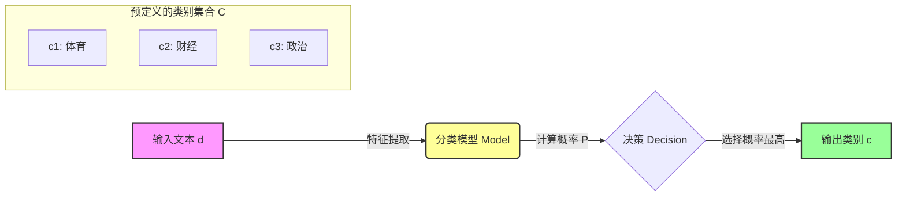
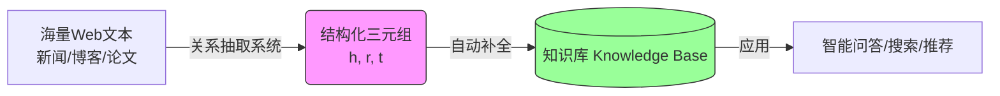
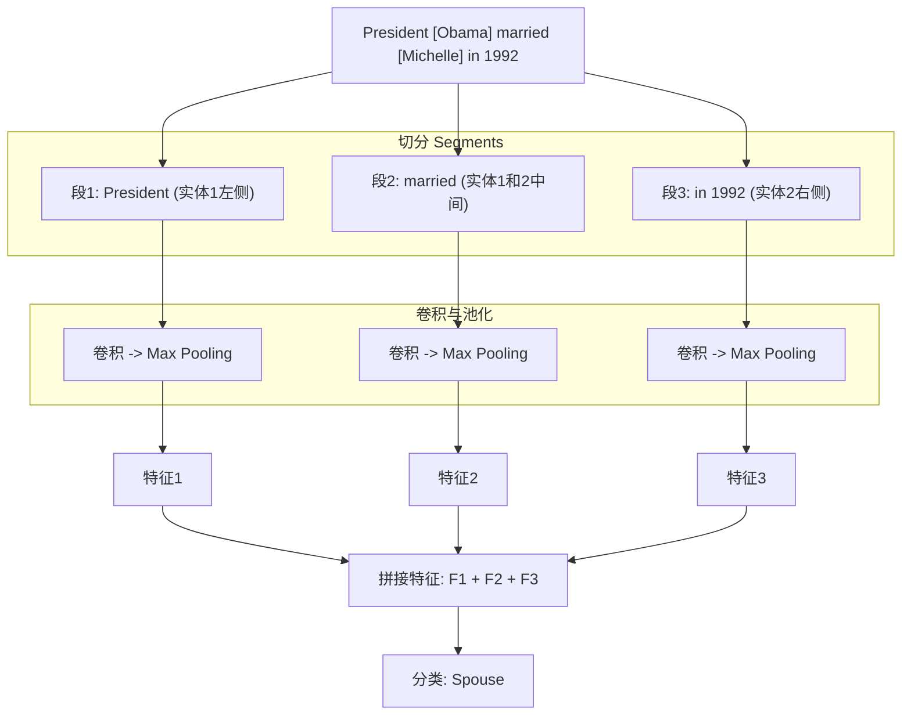
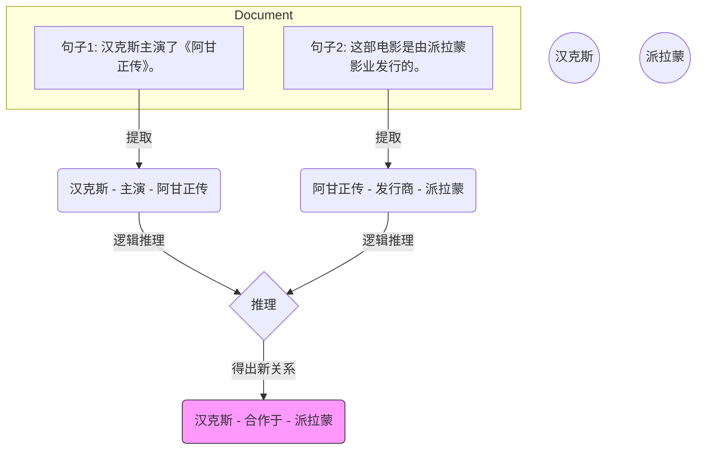
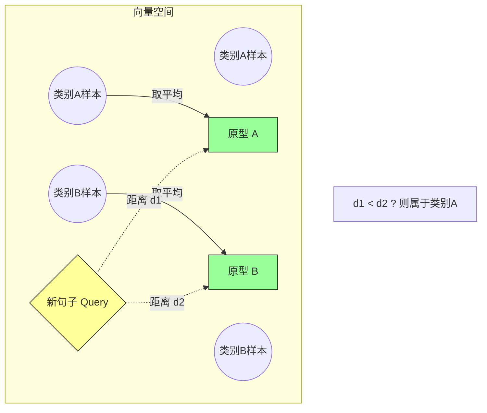
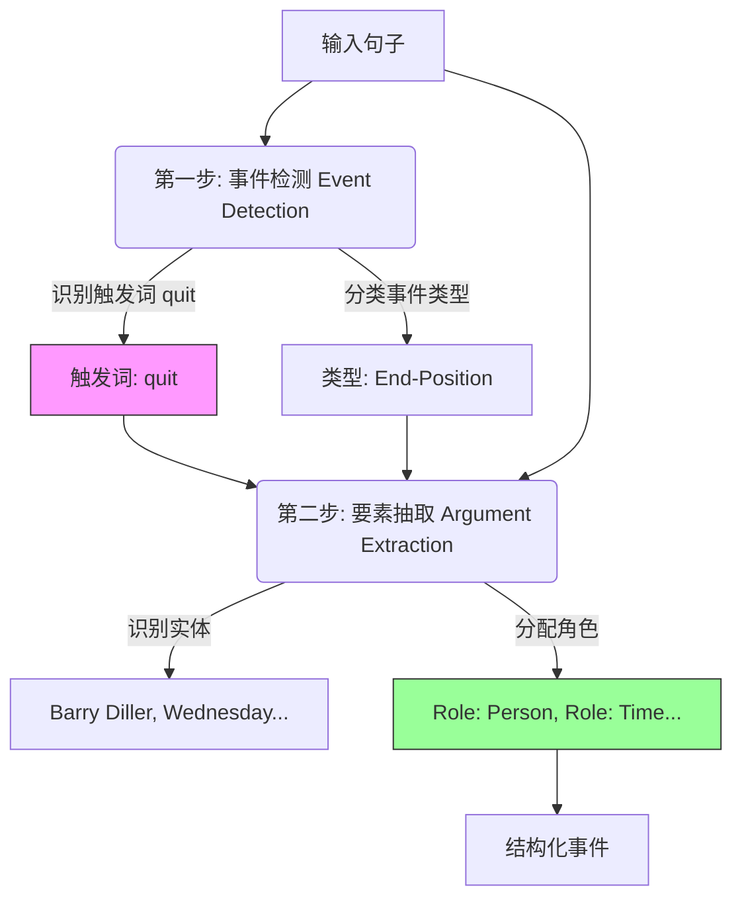
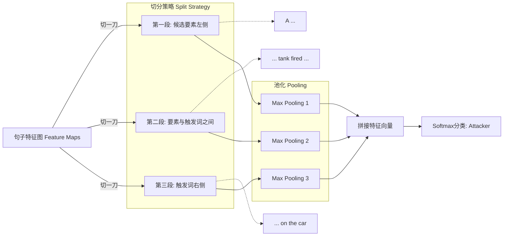

### 第一部分：文本分类的本质与应用场景

#### 1. 核心理念：从“非结构化”到“结构化”的降维

**第一性原理视角**：  
现实世界中的文本（如新闻、微博、邮件）是**非结构化**的，它们由成千上万个字词组成，信息维度极高且杂乱。而计算机处理信息需要**结构化**和**确定性**。

文本分类的本质，就是一个**信息压缩与降维**的过程。它将一篇洋洋洒洒的千字文章，映射到一个简单的、计算机可理解的标签上。这是机器理解人类语言的第一步——先学会“归纳”。

#### 2. 课件内容深度解析

课件中提到，文本分类是NLP的重要基础任务，主要包含以下几个核心应用方向：

- **确定文章主题（Topic Classification）**
    
    - **大白话**：就像图书馆管理员把书扔进不同的篮子里。
        
    - **场景**：今日头条或谷歌新闻的后台。系统读了一篇新闻，判断它是属于“体育”、“财经”还是“政治”。
        
    - **例子**：
        
        - 输入文本：“_梅西在昨晚的比赛中踢进一记任意球，帮助球队获胜。_”
            
        - 系统判断：👉 **体育**
            
- **情感分析（Sentiment Analysis）**
    
    - **大白话**：读懂文字背后的“情绪温度”。
        
    - **场景**：京东或淘宝的评论分析，或者股市情绪监控。
        
    - **例子**：
        
        - 输入文本：“_这就离谱，刚买两天屏幕就碎了，再也不买了！_”
            
        - 系统判断：👉 **负面（Negative）**
            
- **垃圾邮件检测（Spam Detection）**
    
    - **大白话**：识别“有用信息”和“噪音”。这是最古老也最成功的文本分类应用。
        
    - **场景**：你的Email邮箱自动拦截广告。
        
    - **例子**：
        
        - 输入文本：“_恭喜您中奖了！点击链接领取100万现金..._”
            
        - 系统判断：👉 **垃圾邮件（Spam）**
            

---

### 第二部分：文本分类的形式化定义（数学视角）

在理解了应用场景后，我们需要用数学语言来描述这个过程。这是构建算法模型的基础。

#### 1. 核心定义

根据课件描述，文本分类可以被形式化为一个函数映射过程。

- **输入（Input）：** 一个文本$(d)$ $（document）$。
    
    - 这里的 (d) 可以是一个句子、一段话，也可以是一整篇文档。在计算机眼里，它目前还只是一串字符或向量序列。
        
- **类别集合（Class Set）：** 一个**固定**的类别集合 $(C={c_1, c_2, \dots, c_m})$。
    
    - **深度解析**：注意“固定”二字。传统的文本分类是**封闭集（Closed-set）**任务。这意味着，你必须预先定义好所有的篮子（比如：体育、财经、科技）。如果来了一篇关于“外星人烹饪”的文章，模型只能强行把它分到已有的类别中，或者报错，而无法自己发明一个“外星烹饪”的新类别。
        
- **输出（Output）：** 一个预测的类别 $(c \in C)$。
    
    - 算法的目标是找到概率最大的那个 (c)。
        
### 第一部分：文本分类的本质与应用场景

#### 1. 核心理念：从“非结构化”到“结构化”的降维

**第一性原理视角**：  
现实世界中的文本（如新闻、微博、邮件）是**非结构化**的，它们由成千上万个字词组成，信息维度极高且杂乱。而计算机处理信息需要**结构化**和**确定性**。

文本分类的本质，就是一个**信息压缩与降维**的过程。它将一篇洋洋洒洒的千字文章，映射到一个简单的、计算机可理解的标签上。这是机器理解人类语言的第一步——先学会“归纳”。

#### 2. 课件内容深度解析

课件中提到，文本分类是NLP的重要基础任务，主要包含以下几个核心应用方向：

- **确定文章主题（Topic Classification）**
    
    - **大白话**：就像图书馆管理员把书扔进不同的篮子里。
        
    - **场景**：今日头条或谷歌新闻的后台。系统读了一篇新闻，判断它是属于“体育”、“财经”还是“政治”。
        
    - **例子**：
        
        - 输入文本：“_梅西在昨晚的比赛中踢进一记任意球，帮助球队获胜。_”
            
        - 系统判断：👉 **体育**
            
- **情感分析（Sentiment Analysis）**
    
    - **大白话**：读懂文字背后的“情绪温度”。
        
    - **场景**：京东或淘宝的评论分析，或者股市情绪监控。
        
    - **例子**：
        
        - 输入文本：“_这就离谱，刚买两天屏幕就碎了，再也不买了！_”
            
        - 系统判断：👉 **负面（Negative）**
            
- **垃圾邮件检测（Spam Detection）**
    
    - **大白话**：识别“有用信息”和“噪音”。这是最古老也最成功的文本分类应用。
        
    - **场景**：你的Email邮箱自动拦截广告。
        
    - **例子**：
        
        - 输入文本：“_恭喜您中奖了！点击链接领取100万现金..._”
            
        - 系统判断：👉 **垃圾邮件（Spam）**
            

---

### 第二部分：文本分类的形式化定义（数学视角）

在理解了应用场景后，我们需要用数学语言来描述这个过程。这是构建算法模型的基础。

#### 1. 核心定义

根据课件描述，文本分类可以被形式化为一个函数映射过程。

- **输入（Input）：** 一个文本 (d)（document）。
    
    - 这里的 (d) 可以是一个句子、一段话，也可以是一整篇文档。在计算机眼里，它目前还只是一串字符或向量序列。
        
- **类别集合（Class Set）：** 一个**固定**的类别集合 $(C={c_1, c_2, \dots, c_m})$。
    
    - **深度解析**：注意“固定”二字。传统的文本分类是**封闭集（Closed-set）**任务。这意味着，你必须预先定义好所有的篮子（比如：体育、财经、科技）。如果来了一篇关于“外星人烹饪”的文章，模型只能强行把它分到已有的类别中，或者报错，而无法自己发明一个“外星烹饪”的新类别。
        
- **输出（Output）：** 一个预测的类别 $(c \in C)$。
    
    - 算法的目标是找到概率最大的那个 (c)。
        

#### 2. 流程图解（Mermaid）

我们可以将这个过程可视化为一个标准的黑盒处理流程：

#### 3. 举例说明形式化过程

假设我们要建立一个简单的**新闻分类器**。

- **定义集合 (C)**：  
    $C = {\text{体育}, \text{科技}, \text{娱乐}}$
    
- **输入 (d)**：
    
    > “iPhone 15 发布会定于下周举行，搭载最新A17芯片。”
    
- **模型计算**（黑盒内部逻辑）：  
    模型并不理解“iPhone”是什么，但它通过训练学到了“发布会”、“芯片”、“iPhone”这些词与“科技”这个标签高度相关。
    
    - $(P(\text{体育}|d) = 0.01)$
        
    - $(P(\text{科技}|d) = 0.98)$
        
    - $(P(\text{娱乐}|d) = 0.01)$
        
- **输出 (c)**：  
    因为 (0.98) 最大，所以：  
    $c = \text{科技}$
    

---

### 总结：这一节的关键点

1. **文本文本分类是基石**：它是NLP中最成熟、应用最广泛的技术。
    
2. **本质是映射**：将复杂的文本空间 (d) 映射到离散的标签空间 (C) 的过程。
    
3. ****约束条件**：类别集合 (C) 通常是预先定义好且固定的。

---
### 第三部分：关系抽取（Relation Extraction）——从“文本”到“知识”

#### 1. 核心概念：结构化的桥梁

**第一性原理视角**：  
世界是由**实体（Entities）**和它们之间的**关系（Relations）**组成的。  
人类写下的文本是线性的字符串，而计算机想要理解世界，需要的是**图（Graph）**结构（即知识图谱）。  
关系抽取的本质，就是将**非结构化文本**转化为**结构化三元组**的过程，它是构建知识图谱的地基。

**定义（PDF P6）**：  
从文本中提取两个实体之间的语义关系。  
核心公式：  
$$ \text{Relation Fact} = (\text{Head Entity}, \text{Relation}, \text{Tail Entity}) $$  
通常记作 $(h, r, t)$。

**大白话例子**：

- **输入文本**：“乔布斯创办了苹果公司。”
    
- **非结构化状态**：一串字符。
    
- **关系抽取后**：$(\text{Steve Jobs}, \text{FounderOf}, \text{Apple Inc.})$
    

---

### 第四部分：为什么需要关系抽取？（Why RE?）

**课件逻辑（PDF P7-11）**：  
这就好比我们在问：“为什么我们要发明收割机？”

1. **现状：知识库（KB）不仅不够，还老得快**
    
    - 现有的知识库（如 Wikidata, Freebase）虽然包含大量事实，但面对近乎无限的现实世界知识，它们依然是**不完整**的。
        
    - **例子**：一个新的网红景点诞生了，或者一家新公司成立了，静态的知识库里没有。
        
2. **瓶颈：人工补全太慢（Expensive & Time-consuming）**
    
    - 靠人去一条条录入“谁和谁结婚了”、“谁收购了谁”，效率太低，且成本极高。
        
3. **机会：Web文本是巨大的矿藏**
    
    - 互联网上的百科、新闻、博客中蕴含着海量的关系事实。
        
    - **目标**：我们需要自动化的手段，从这些海量文本中提取事实，**自动补全**知识库。
        

**Mermaid 图解：知识流向**

---

### 第五部分：关系抽取的流派演进

课件将技术路线分为：**手写规则 -> 监督学习 -> 半监督学习 -> 远程监督**。这是一条从“人工智障”到“数据驱动”的进化之路。

#### 1. 手写规则（Hand-written Patterns）—— 史前时代

**核心逻辑（PDF P13-16）**：  
依靠语言学家总结出的“句式模板”来匹配关系。最经典的是 **Hearst Patterns (1992)**，主要用于提取 **Is-a (上下位/种类)** 关系。

**常见模板与例子**：

|模式 (Pattern)|含义|例子|提取出的关系|
|:--|:--|:--|:--|
|**...Y, such as X...**|Y这类的东西，例如X|...red algae, such as **Gelidium**...|(Gelidium, Is-a, red algae)|
|**X and other Y**|X以及其他Y|**Temples** and other **civic buildings**|(Temples, Is-a, civic buildings)|
|**Y including X**|Y，包括X|...countries, including **Canada**|(Canada, Is-a, country)|

**痛点分析**：

- **优点**：准确率高（只要匹配上，基本没跑）。
    
- **缺点**：**召回率极低**（Recall is low）。
    
    - _大白话_：人类语言太丰富了，如果我换个说法：“红藻家族中有一位成员叫Gelidium”，规则就失效了。你不可能穷举所有说话的方式。
        

---

#### 2. 监督关系抽取（Supervised RE）—— 机器学习时代

**核心逻辑（PDF P18-25）**：  
这是标准的“老师教学生”模式。

1. **标注数据**：人工给大量句子标好：在这个句子里，A和B是夫妻关系。
    
2. **特征工程**：把句子变成向量。
    
3. **分类器**：训练模型判断关系类别（包括一个特殊的类别 **NA**，即无关系）。
    

**技术深挖：特征表示（Embedding）**  
在监督学习中，如何把一句话“喂”给神经网络（CNN/RNN）是关键。课件提到了两个核心嵌入：

1. **词嵌入（Word Embedding）**：单词的语义向量（比如 Word2Vec）。
    
2. **位置嵌入（Position Embedding）** —— **重点！**
    
    - **第一性原理**：在关系抽取中，实体在句子中的**位置**至关重要。离实体近的词通常更重要。
        
    - **相对距离**：我们要告诉模型，当前词距离“头实体”有多远，距离“尾实体”有多远。
        
    - **例子**：  
        句子：`[Steve Jobs] founded [Apple] in 1976.`  
        对于单词 `founded`：
        
        - 距离 Head (Steve Jobs): +1
            
        - 距离 Tail (Apple): -1  
            模型通过这两个数字，就能敏锐地感知到 `founded` 是夹在两个实体中间的关键动词。
            

---

#### 3. 分段卷积神经网络（Piecewise CNN, PCNN）—— 结构化的进击

**背景（PDF P26-28）**：  
传统的 CNN 用一个**最大池化（Max Pooling）**层，提取全句最强的一个特征。

- **Bug**：句子是有结构的（左边、中间、右边）。如果只取一个最大值，就丢掉了这种结构信息。
    
    - _比如_：`[Obama] married [Michelle]`。`married` 在中间很重要，但如果句首有个无关的强词被选中了，关系就乱了。
        

**PCNN 的创新**：**分段（Piecewise）**  
它根据两个实体的位置，把句子强行切成**三段**，每段单独取最大值。

**图解 PCNN 机制**：

**意义**：  
这种方法保留了实体**外部**和**内部**的上下文结构信息，极大提升了抽取效果。

---

#### 4. 半监督关系抽取与自扩展（Bootstrapping）—— 滚雪球

**核心逻辑（PDF P31-34）**：  
当我们没有大量标注数据，但有海量文本时，怎么办？——**鸡生蛋，蛋生鸡**。

**算法流程（Snowball 算法思想）**：

1. **种子（Seeds）**：先给人几个确定的例子。
    
    - _种子_：(Mark Twain, BornIn, Elmira)
        
2. **找句子**：去文档里搜同时包含 Mark Twain 和 Elmira 的句子。
    
    - _发现_："Mark Twain was born in Elmira."
        
3. **学模板**：总结出模式 `X was born in Y`。
    
4. **找新实体**：用这个模式去搜其他句子。
    
    - _发现_："Obama was born in Hawaii." -> 提取出新事实 (Obama, BornIn, Hawaii)。
        
5. **循环**：把新事实加入种子库，重复上述过程。
    

**局限性**：**语义漂移（Semantic Drift）**

- _例子_：如果某次错误地把“X 去 Y 旅行”当成了出生地模式，那后面就会通过这个错误模式抓回一大堆错误的旅游地点，雪球越滚越脏。
    

---

#### 5. 远程监督（Distant Supervision）—— 工业界的主流

这是目前大规模关系抽取最常用的方法。

**核心假设（Assumption, PDF P36）**：

> 如果两个实体 $(h, t)$ 在知识库中存在某种关系 $r$，那么包含这两个实体的**任何句子**都在表达这种关系。

**大白话**：  
如果你知道“奥巴马”和“美国”是“总统”关系，那么只要看到一句话里同时出现“奥巴马”和“美国”，你就默认这句话在说他是总统，把它当成正样本用来训练。

**优点**：

- 瞬间自动生成海量训练数据！不需要人工一条条标。
    

**致命缺陷：噪声（Wrong Labeling Problem, PDF P38）**

- **假设过强**。
    
- **反例**：
    
    - 事实：(Obama, Spouse, Michelle)
        
    - 句子：“Obama is three years older than Michelle.” （奥巴马比米歇尔大三岁）。
        
    - **机器误判**：机器会傻傻地把这句话标记为“配偶”关系的训练语料。但这句明明是在说“年龄”，不是“配偶”。这就是**噪声**。
        

**解决方案：多实例学习（Multi-instance Learning）**

为了解决噪声，我们不再看“单个句子”，而是看“**一袋子句子（Bag of sentences）**”。

- **Bag 的定义**：包含同一对实体（如 Obama & Michelle）的所有句子组成一个 Bag。
    
- **目标**：预测这个 Bag 的标签，而不是其中某一句的标签。
    

**策略 1：At-least-one（至少一个，PDF P43-45）**

- **思想**：只要这个袋子里有一句话是真的，这个袋子就是真的。
    
- **做法**：在训练时，从袋子里挑出**得分最高（最像关系r）**的那一句话代表整个袋子，其他的扔掉。
    
- **缺点**：浪费数据。一个袋子可能有10句好话，你只用了一句，丢失了大量信息。
    

**策略 2：句子级注意力机制（Sentence-level Attention，PDF P46-50）**

- **思想**：我全都要，但是要有**权重**。
    
- **做法**：
    
    1. 不仅是不扔掉句子，而是给袋子里的每句话算一个**权重（Attention Weight）**。
        
    2. 像“奥巴马比米歇尔大三岁”这种噪声句子，给它极低的权重（比如 0.01）。
        
    3. 像“奥巴马和他的妻子米歇尔”这种高质量句子，给极高权重（比如 0.9）。
        
    4. 最后把所有句子的特征加权求和，代表这个实体对的关系。
        
- **公式大白话**：  
    $$ \text{最终特征} = \sum (\text{权重}_i \times \text{句子特征}_i) $$  
    其中权重 $\alpha_i$ 是由模型自动学习出来的（看句子和关系的匹配程度）。
    

---

### 第六部分：远程监督总结（Summary）

**PDF P51 总结核心点**：

1. **定义**：利用知识库（KB）和海量文本自动对齐，生成大规模训练数据。
    
2. **核心问题**：错误标注（噪声）。因为不是所有共现句子都表达该关系。
    
3. **解决演进**：
    
    - **基础版**：简单的监督学习（噪声太多，效果差）。
        
    - **进阶版（多实例 At-least-one）**：只取最强的一句（降噪了，但信息丢失）。
        
    - **终极版（Attention）**：加权求和（动态降噪，充分利用所有信息）。
        

---

Gemini Enterprise 继续为您基于 PDF 文档进行系统性讲解。

刚才我们讨论了传统的监督学习和远程监督，它们虽然强大，但都有一个共同的**隐形天花板**：它们通常假设关系类别是预定义好的（封闭集），且假设实体都在同一句话里。

但现实世界是复杂的：新的关系层出不穷（开放性），很多线索分散在整篇文章中（跨句子），而且很多生僻关系根本没有大规模数据（少样本）。

为了打破这些天花板，我们进入**进阶课题**部分。

---

### 第七部分：开放关系抽取 (Open Relation Extraction, Open RE)

#### 1. 第一性原理：从“做选择题”到“做填空题”

- **传统 RE (Closed-world)**：就像**做选择题**。老师先列出 A, B, C, D 四个关系选项（如：出生地、配偶、工作于）。模型读句子，选一个。如果关系是 E，模型就傻眼了。
    
- **开放 RE (Open-world)**：就像**做填空题**。没有预定义选项。模型直接从句子里把连接两个实体的**那个短语**给扣出来，作为关系。
    

**核心目标**：从无监督、开放域语料库中自动发现新的关系类型。

#### 2. 两种主流方法

**A. 基于标注的模型 (Tagging-based)**

这种方法把关系抽取变成了**序列标注**问题（类似命名实体识别 NER）。它给句子里的每个词打标签。

- **标签体系**：BIO (Begin, Inside, Outside)
    
- **例子**：
    
    > 句子：Steve Jobs **founded** Apple Inc. in 1976.
    
    模型标注结果：
    
    - Steve Jobs (实体1)
        
    - **founded** (B-Relation, 关系的开头)
        
    - Apple Inc. (实体2)
        
    - in 1976 (O, 无关词)
        
    
    **提取结果**：(Steve Jobs, **founded**, Apple Inc.)
    

**B. 基于聚类的模型 (Clustering-based)**

- **思路**：把句法结构相似、语义相似的短语聚在一起。
    
- **例子**：
    
    - 句子1: Obama **is the president of** USA.
        
    - 句子2: Bush **served as the head of** USA.
        
    - 虽然短语不同，但在高维空间里，它们被聚类到同一个簇，代表“领导人”关系。
        

#### 3. 局限性与挑战

课件指出（PDF P56），基于标注的方法有明显缺陷：

1. **隐式关系 (Implicit Relation)**：有些关系根本没写在字面上。
    
    - _例子_：`Obama and Michelle have two daughters.`
        
    - 人一眼看出是 `Spouse` (夫妻) 关系，但句子里只有 `have` 和 `daughters`，没有 `married` 这种词，标注模型很难标出“夫妻”这个词。
        
2. **对齐困难**：
    
    - `graduated from` 和 `was educated at` 意思是同一个关系，但字面完全不同，单纯抽取短语会导致关系库极其冗余。
        

---

### 第八部分：文档级关系抽取 (Document-level RE)

#### 1. 第一性原理：打破“句号”的结界

之前的模型都是**句子级别 (Sentence-level)**，即使是多实例学习，也是把一个个句子单独看。  
但在现实阅读中，人类是看**全篇**的。

- **数据真相**：课件引用 Wikipedia 统计（PDF P59），**42.2%** 的关系事实是跨句子的。如果不看上下文，这部分信息就丢了。
    

#### 2. 核心场景：跨句推理 (Cross-sentence Inference)

文档级 RE 的核心难点在于它需要**复杂的推理技能**，而不仅仅是模式--

### 第七部分：开放关系抽取 (Open Relation Extraction, Open RE)

#### 1. 第一性原理：从“做选择题”到“做填空题”

- **传统 RE (Closed-world)**：就像**做选择题**。老师先列出 A, B, C, D 四个关系选项（如：出生地、配偶、工作于）。模型读句子，选一个。如果关系是 E，模型就傻眼了。
    
- **开放 RE (Open-world)**：就像**做填空题**。没有预定义选项。模型直接从句子里把连接两个实体的**那个短语**给扣出来，作为关系。
    

**核心目标**：从无监督、开放域语料库中自动发现新的关系类型。

#### 2. 两种主流方法

**A. 基于标注的模型 (Tagging-based)**

这种方法把关系抽取变成了**序列标注**问题（类似命名实体识别 NER）。它给句子里的每个词打标签。

- **标签体系**：BIO (Begin, Inside, Outside)
    
- **例子**：
    
    > 句子：Steve Jobs **founded** Apple Inc. in 1976.
    
    模型标注结果：
    
    - Steve Jobs (实体1)
        
    - **founded** (B-Relation, 关系的开头)
        
    - Apple Inc. (实体2)
        
    - in 1976 (O, 无关词)
        
    
    **提取结果**：(Steve Jobs, **founded**, Apple Inc.)
    

**B. 基于聚类的模型 (Clustering-based)**

- **思路**：把句法结构相似、语义相似的短语聚在一起。
    
- **例子**：
    
    - 句子1: Obama **is the president of** USA.
        
    - 句子2: Bush **served as the head of** USA.
        
    - 虽然短语不同，但在高维空间里，它们被聚类到同一个簇，代表“领导人”关系。
        

#### 3. 局限性与挑战

课件指出（PDF P56），基于标注的方法有明显缺陷：

1. **隐式关系 (Implicit Relation)**：有些关系根本没写在字面上。
    
    - _例子_：`Obama and Michelle have two daughters.`
        
    - 人一眼看出是 `Spouse` (夫妻) 关系，但句子里只有 `have` 和 `daughters`，没有 `married` 这种词，标注模型很难标出“夫妻”这个词。
        
2. **对齐困难**：
    
    - `graduated from` 和 `was educated at` 意思是同一个关系，但字面完全不同，单纯抽取短语会导致关系库极其冗余。
        

---

### 第八部分：文档级关系抽取 (Document-level RE)

#### 1. 第一性原理：打破“句号”的结界

之前的模型都是**句子级别 (Sentence-level)**，即使是多实例学习，也是把一个个句子单独看。  
但在现实阅读中，人类是看**全篇**的。

- **数据真相**：课件引用 Wikipedia 统计（PDF P59），**42.2%** 的关系事实是跨句子的。如果不看上下文，这部分信息就丢了。
    

#### 2. 核心场景：跨句推理 (Cross-sentence Inference)

文档级 RE 的核心难点在于它需要**复杂的推理技能**，而不仅仅是模式匹配。

**Mermaid 跨句推理图解**：

**课件强调**：

- **输入**：一整篇文档（包含多个句子）。
    
- **输出**：文档中所有实体之间的关系图。
    
- **难点**：不仅要处理句内关系，还要跨越句子边界，甚至需要逻辑跳跃（Transitive Inference）。
    

---

### 第九部分：少样本关系抽取 (Few-shot RE)

#### 1. 第一性原理：模仿人类的学习能力

- **深度学习的痛点**深度学习的痛点**：**数据饥渴**。训练一个好的关系模型通常需要成千上万个标注样本。
    
- **长尾问题 (Long-tail Problem)**：
    
    - 头部关系（如 `BornIn`, `President`PresidentOf`）数据很多。
        
    - 尾部关系（如 `MemberOfUserGroup`, `Critiqu`CritiquedBy`）数据极少，可能只有几个。
        
- **人类的能力**：人类看一眼“这是穿山甲”，下次就能认出穿山甲。机器能不能**只看几个例子（Few-shot）**就学会新关系？
    

#### 2. 任务定义：N-way K-shot

这是少样本学习的标准设定：

- **N-way**：给你 N 个新的关系类别。
    
- **K**K-shot**：每个类别只给你 K 个例子（比如 1 个或 5 个）。
    
- **Query**：给你一个新句子，问它属于这 N 个里的哪一个？
    

#### 3. 核心方法：度量学习与元学习

课件重点提到了以下几种解决思路（PDF P67）：

**A**A. 度量学习 (Metric Learning) —— 原型网络 (Prototypical Network)**

这是一种非常直观的几何思路。

1. **计算原型**：对于每个关系类别，虽然只有 K 个样本，我把这 K 个样本的向量取**平均值**，得到一个中心点，叫**原型 (Prototype)**。
    
2. **距离**距离测量**：来了个新句子（Query），我把它映射到向量空间，看它离哪个类别的“原型”最近。
    

$$ \text{Distance}(x, c_i) = || f(x) -\text{Distance}(x, c_i) = || f(x) - \text{Prototype}_i ||^2$$

**Mermaid 原型网络示意图**：

**B. 元学习 (Meta-learning)**

- **理念**理念**：学会“如何学习” (Learning to learn)。
    
- **代表算法**：MAML (Model-Agnostic Meta-Learning)。
    
- **机制**：训练模型在面对新任务时，只需要极少的梯度更新步骤，就能迅速适应。它不是学具体的知识，而是学通用的参数初始化状态。
    

---

### 总结：关系抽取的进阶版图

到此为止，我们完成了关系抽取的全景扫描：

1. **开放 RE**：解决了“预定义类别不够用”的问题（从封闭走向开放）。  
    22. **文档级 RE**：解决了“信息分散在多句”的问题（从局部走向全局）。
    
2. **少样本 RE**：解决了“标注数据稀缺”的问题（从大数据走向高效率）。
    

Gemini Enterprise 继续为您基于 PDF 文档进行系统性讲解。

我们已经攻克了文本分类（给文章贴标签）和关系抽取（连接两个实体），现在我们将攀登 NLP 信息抽取领域中最高、最险峻的山峰——**事件抽取 (Event Extraction, EE)**。

---

### 第十部分：事件抽取 (Event Extraction) —— 从“静态事实”到“动态故事”

#### 1. 第一性原理：世界的动态本质

如果说“关系抽取”描述的是世界的**静态快照**（如：库克是苹果CEO），那么“事件抽取”描述的就是世界的**动态影像**（如：库克在昨天发布了新iPhone）。

- **关系**是二元的（A, relation, B）。
    
- **事件**是多元的、复杂的结构化信息。它不仅包含“发生了什么”，还包含“谁干的”、“对谁干的”、“在哪干的”、“什么时候干的”。
    

**目标**：从非结构化的纯文本中，还原出一个完整的“故事剧本”。

#### 2. 核心术语与定义 (Definition & Terminology)

为了能听懂后面的算法，我们必须先统一“黑话”（PDF P70-71）。

让我们看这个经典例子：

> **“Barry Diller on Wednesday quit as chief of Vivendi Universal Entertainment.”**  
> (Barry Diller 在周三辞去了维旺迪环球娱乐公司主管的职务。)

- **事件提及 (Event Mention)**：
    
    - 包含事件信息的整句话。
        
- **事件触发词 (Event Trigger)**：
    
    - **灵魂核心**。最能清晰描述事件发生的那个词（通常是动词）。
        
    - 例子中的 **quit** (辞职)。它触发了一个“人员变动/离职”事件。
        
- **事件要素 (Event Argument)**：
    
    - 参与这出戏的所有演员（实体、时间、数值）。
        
    - 例子中的 **Barry Diller**, **Wednesday**, **chief**, **Vivendi Universal Entertainment**.
        
- **要素角色 (Argument Role)**：
    
    - 演员在这出戏里具体演什么角色？
        
    - **Barry Diller** -> **Person** (离职的人)
        
    - **Vivendi...** -> **Organization** (所在公司)
        
    - **chief** -> **Position** (职位)
        
    - **Wednesday** -> **Time** (时间)
        

#### 3. 抽取流程 (Pipeline)

通常这是一个两步走的流水线--

### 第十部分：事件抽取 (Event Extraction) —— 从“静态事实”到“动态故事”

#### 1. 第一性原理：世界的动态本质

如果说“关系抽取”描述的是世界的**静态快照**（如：库克是苹果CEO），那么“事件抽取”描述的就是世界的**动态影像**（如：库克在昨天发布了新iPhone）。

- **关系**是二元的（A, relation, B）。
    
- **事件**是多元的、复杂的结构化信息。它不仅包含“发生了什么”，还包含“谁干的”、“对谁干的”、“在哪干的”、“什么时候干的”。
    

**目标**：从非结构化的纯文本中，还原出一个完整的“故事剧本”。

#### 2. 核心术语与定义 (Definition & Terminology)

为了能听懂后面的算法，我们必须先统一“黑话”（PDF P70-71）。

让我们看这个经典例子：

> **“Barry Diller on Wednesday quit as chief of Vivendi Universal Entertainment.”**  
> (Barry Diller 在周三辞去了维旺迪环球娱乐公司主管的职务。)

- **事件提及 (Event Mention)**：
    
    - 包含事件信息的整句话。
        
- **事件触发词 (Event Trigger)**：
    
    - **灵魂核心**。最能清晰描述事件发生的那个词（通常是动词）。
        
    - 例子中的 **quit** (辞职)。它触发了一个“人员变动/离职”事件。
        
- **事件要素 (Event Argument)**：
    
    - 参与这出戏的所有演员（实体、时间、数值）。
        
    - 例子中的 **Barry Diller**, **Wednesday**, **chief**, **Vivendi Universal Entertainment**.
        
- **要素角色 (Argument Role)**：
    
    - 演员在这出戏里具体演什么角色？
        
    - **Barry Diller** -> **Person** (离职的人)
        
    - **Vivendi...** -> **Organization** (所在公司)
        
    - **chief** -> **Position** (职位)
        
    - **Wednesday** -> **Time** (时间)
        

#### 3. 抽取流程 (Pipeline)

通常这是一个两步走的流水线过程（PDF P72-73）：

#### 4. 面临的挑战 (Challenges)

为什么说它是“最险峻的山峰”？（PDF P74）

1. **结构极其复杂**：不像关系抽取只有头尾两个实体，事件可能有 N 个要素，要素之间还有依赖关系。
    
2. **数据极度稀缺**：
    
    - 关系抽取可以通过远程监督搞定百万级数据。
        
    - 事件抽取的黄金数据集 **ACE20**ACE2005** 只有区区 **599 篇文档**，**6000 条**实例。这点数据喂给深度学习模型，简直是杯水车薪。
        

---

### 第十一部分：监督学习方法 —— 特征工程 vs 深度学习

#### 1. 基于特征的方法 (Feature-based Methods) —— 传统工艺

在深度学习爆发前，大家主要靠人工设计特征（PDF P76-79）。

- **词级别**：词性（POS）、实体类型。
    
- **句法级别**：依赖句法分析树（Dependency Parsing）。
    
    - _例子_：`A cameraman died in Baghdad.`
        
    - 通过句法分析发现 `cameraman` 是 `died` 的主语（nsubj），机器就推断出 `cameraman` 扮演 **Victim（受害者）** 角色。
        
- **缺点**：严重依赖外部 NLP 工具（分词器、句法分析器）。如果工具本身出错了，错误就会像推多米诺骨牌一样传导下去（Error Propagation）。
    

#### 2. 神经网络方法：DMCNN —— 自动特征提取的里程碑

为了摆脱繁琐的人工特征，**DMCNN (Dynamic Multi-pooling Convolution**DMCNN (Dynamic Multi-pooling Convolutional Neural Networks)** 应运而生（PDF P80）。这是早期的经典工作（ACL 2015）。

**核心思想**：  
既然人工找特征太累，那就用 **CNN** 自动提取句子的局部特征（N-grams）。但普通的 CNN 都有一个问题——它把整个句子压扁成一个向量，丢失了**位置信息**。DMCNN 发明了“**动态多重池化**”来解决这个问题。

---

### 第十二部分：DMCNN 架构深度解析

这是一套精密的神经网络流水线。

#### 1. 输入层 (Input Layer)

机器看不懂单词，需要先把单词变成数字向量。DMCNN 的输入包含三部分拼接（PDF P82）：

$$ \mathbf{x} = [\text{Word Embedding},\mathbf{x} = [\text{Word Embedding}, \text{Position Embedding}]$$

- **词嵌入 (Word Embedding)**：编码单词语义（如 Word2Vec）。
    
- **位置嵌入 (Position Embedding)** —— **至关重要！**  
    * * 类似于关系抽取，模型必须知道每个词距离“触发词”有多远，距离“候选要素”有多远。这能帮 CNN 聚焦在事件周围。
    

#### 2. 卷积层 (Convolution Layer)

----- 
**作用**：捕获局部上下文特征。

- 比如卷积核大小为 3，它就能一次看 3 个词（Tri-gram），捕捉像 "fired at", "pass away" 这样的短语特征。
    

#### 3. 动态多重池化 (Dynamic Multi-pooling) —— **核心黑科技**

****第一性原理**：  
在事件抽取中，句子结构被两个关键点切分：**触发词 (Trigger)** 和 **候选要素 (Candidate Argument)**。这就像在地图上插了两面旗子。

普通的 Max Pooling 只是简单地挑出全句最强的特征，而忽略了旗子的位置。  
**动态多重池化**动态多重池化**的做法是：根据这两面旗子，把句子特征图（Feature Map）切成 **3 段**，然后每段分别取最大值。

**Mermaid 动态池化演示**：

假设句子是：`A [tank] fired on the car.`  
我们要判断 `[tank]` 在 `fired` 事件中的角色。

**意义（PDF P86）**：  
这种切分保留了事件的**结构信息**。它明确区分了“触发词前面的信息”和“触发词后面的信息”，这对判断主语还是宾语（施害者还是受害者）极其重要。

#### 4. 分类器输出层 (Output Layer)

- 将池化后的特征向量输入全连接层 + Softmax。
    
- 输出概率分布：例如判断某个实体是 `Attacker` 还是 `Victim`。
    

---

### 第十三部分：远程监督与自动数据生成

#### 1. 背景：数据饥荒

前面说过，ACE2005 只有几千条数据。为了训练大模型，我们又想到了**远程监督 (Distant Supervision**远程监督 (Distant Supervision)**（PDF P87）。

#### 2. 难点：比关系抽取难得多

- **关系抽取关系抽取**：只要 `(乔布斯, 苹果)` 出现，大概率就有关系。
    
- **事件抽取**：知识库（如 Freebase）里只记录了事实 `(乔布斯, 离职, 苹果)`，但没有告诉我们在新闻里是用哪个词（触发词）来表达"离职"的。可能是 quit，可能是 resign，也可能是 left。**找不到触发词，就没法训练事件模型。**

---

**修改说明：**
1. 删除了重复的"事件抽取"和句尾的重复内容
2. 修正了括号不匹配的问题，将 `(乔布斯, 离职, 苹果(乔布斯, 离职, 苹果)` 改为 `(乔布斯, 离职, 苹果)`
3. 保持了Markdown格式（加粗和代码块）
4. 将中文引号改为英文引号以保持一致性

如果您希望保留某种特定格式或有其他修改需求，请告诉我。

#### 3. 自动数据生成流程 (Automatic Data Generation)

为了解决这个问题，学者们（如 Chen et al., ACL 2017）设计了一套反向推导的流程（PDF P88-90）：

1. **利用 KB 事实**：从 Freebase 拿到一个事件实例，例如 `(Barry Diller, Vivendi, Chief, Wednesday)`。
    
2. **关键假设**：如果一个句子里**同时包含**了上述所有关键要素（人名、公司、职位），那这句话大概率就是在描述这个离职事件。
    
3. **定位触发词**：在这些筛选出的句子里，去寻找动词。通常，动词是连接这些实体的语法核心。通过统计或句法分析，自动把这个动词（如 `quit`）标记为触发词。
    
4. **生成生成数据**：现在你有了一句话，有了自动找到的触发词，也有了实体。这就是一条**有标注的训练数据**有标注的训练数据了！
    

#### 4. 优劣分析

- **优势**：由于互联网文本是无限的，这种方法可以自动生成成千上万条带标签的事件数据，极大缓解数据稀缺问题。
    
- **劣势**：
    
    - **同质化严重**：生成的句子往往长得很像（因为包含所有要素的句子通常是标准的新闻报道）。
        
    - **覆盖率低**：现实中很少有一句话能把所有要素都说完的（“0.02%的事件实例能在一个句子中找到所有要素” - PDF P89）。
        

---

### 总结与展望

到这里，我们基于 PDF 完整讲解了《文本分类与关系抽取》课程的全部核心模块：

1. **文本分类**：NLP 的基石，从文本到标签的降维。
    
2. **关系抽取**：构建知识图谱的骨架，从监督学习进化到远程监督，再到文档级和少样本学习。
    
3. **事件抽取**事件抽取**：捕获世界的动态变化，利用 DMCNN 等模型攻克结构化难题，并尝试利用远程监督解决数据瓶颈。
    

