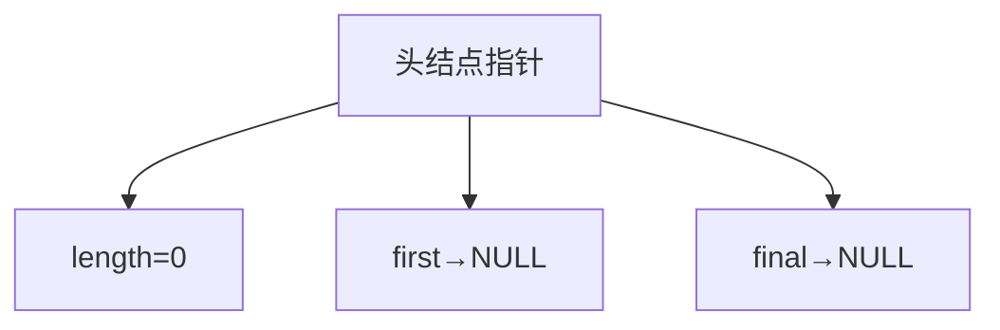
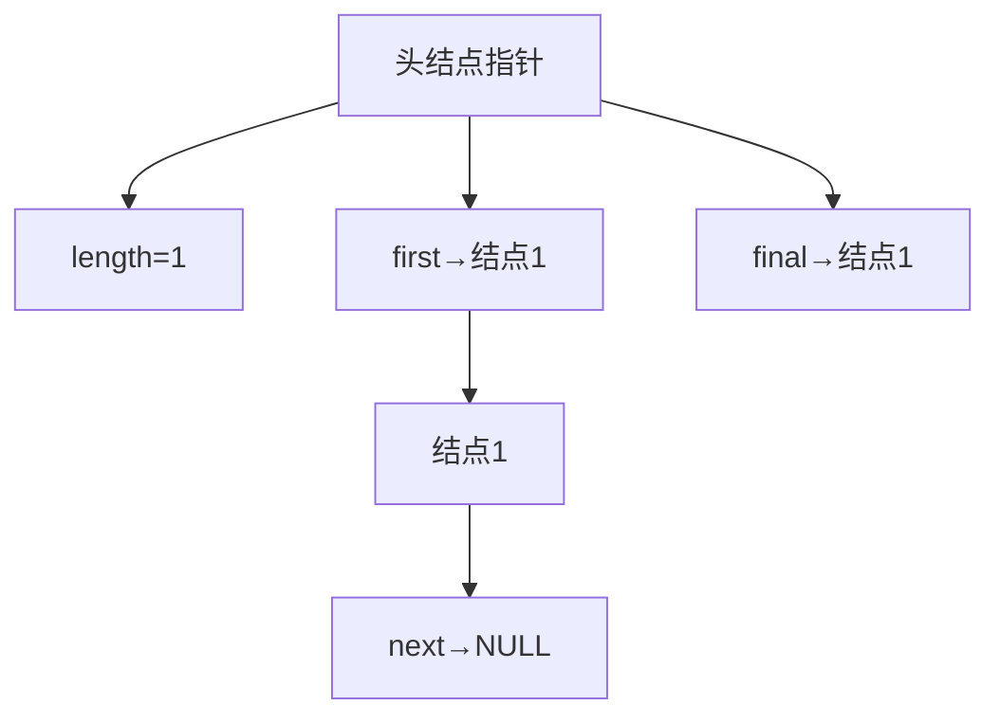
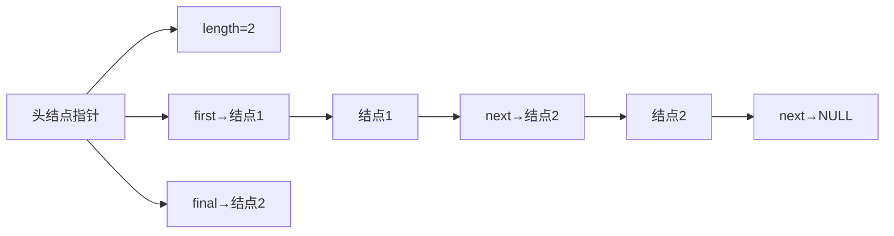
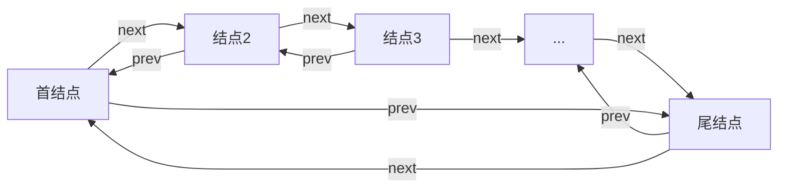

# 带头结点的链表

## 头节点引入原因
- 链表操作中获取长度需要遍历计数，占用CPU资源  
- 头节点用于存储链表属性信息，避免频繁遍历  

## 头节点定义
```cpp
struct HeadNode {
    int length;        // 链表长度
    NodeType* first;   // 首结点地址
    NodeType* final;   // 尾结点地址
};
```
**头节点特性**：  
1. 不参与链表长度计数  
2. 不参与链表遍历  
3. 不作为链表数据结点  
4. 专门存储链表信息  

## 创建步骤
### 从无到有创建


### 加入第一个结点


### 增加后续结点


### 删除结点
1. 删除首结点时更新`first`指针  
2. 删除尾结点时更新`final`指针  
3. 删除中间结点时维护前后链接  
4. 更新头节点中的`length`值  

---

# 循环链表
## 循环单链表
### 定义
最后一个数据结点的`next`指针指向首结点  


### 创建方法
1. 创建普通单链表  
2. 将尾结点的`next`指针指向首结点  

## 循环双链表
### 定义


### 创建方法
1. 将尾结点的`next`指针指向首结点  
2. 将首结点的`prev`指针指向尾结点  

## 循环链表遍历方法
### 方法一
1. 临时指针指向首结点  
2. 循环条件：`temp->next != head`  
3. 循环结束后单独处理尾结点  

### 方法二
```cpp
Node* start = head;
Node* current = head;

do {
    std::cout << current->data << " ";
    current = current->next;
} while(current != start);
```

---

# 链表闭环
## 闭环定义
尾结点指向链表中任意随机结点形成的环状结构  


## 闭环检测算法（快慢指针法）
### 实现原理
```cpp
bool hasCycle(Node* head) {
    if(head == nullptr) return false;
    
    Node* slow = head;      // 慢指针（每次1步）
    Node* fast = head->next; // 快指针（每次2步）
    
    while(fast != nullptr && fast->next != nullptr) {
        if(slow == fast) return true;  // 指针相遇说明有环
        
        slow = slow->next;          // 慢指针走1步
        fast = fast->next->next;    // 快指针走2步
    }
    return false;  // 快指针遇到空说明无环
}
```

### 算法特性
1. 时间复杂度：O(n)  
2. 空间复杂度：O(1)  
3. **有环判定**：快慢指针相遇  
4. **无环判定**：快指针遇到`nullptr`  

---

# 作业
完成所有链表数据结构相关作业，包括：  
1. 带头结点的单链表实现  
2. 循环单链表实现  
3. 循环双链表实现  
4. 链表闭环检测算法  
5. 完善链表模板类封装