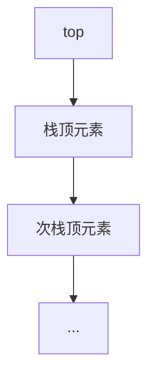
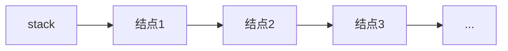

# 静态链表

## 静态链表定义
静态链表是一种使用数组实现链表概念的数据结构，通过在每个元素中存储下一个元素的索引来实现链式存储，在有限空间内有效管理大量元素。

## 静态链表实现
### 结点结构
```cpp
struct Node {
    ElementType data;  // 数据域
    int next;          // 指针域（存储下一个结点的数组下标）
};
```

### 创建静态链表
```cpp
struct Node static_list[100] = {0};  // 创建100个结点的静态链表

struct StaticList {
    Node nodes[100];
    int head_pos;  // 头指针位置
};

StaticList s1;  // 创建静态链表实例
```

### 初始化静态链表
```cpp
for(int i = 0; i < 100; i++) {
    s1.nodes[i].data = -1;  // 标记为空位置
    s1.nodes[i].next = -1;  // 无效下标标记
}
```

### 增加元素操作
1. **查找空位置**：
```cpp
int i = 0;
for(; i < 100; i++)
    if(static_list[i].data == -1)
        break;
```

2. **存入数据**：
```cpp
static_list[i].data = 100;
static_list[i].next = -1;  // 置空操作
```

3. **添加到链表尾部**：
```cpp
int j = 0;
for(; static_list[j].next != -1; j++);
static_list[j].next = i;  // 尾插法
```

### 静态链表特性
1. 在内存空间有限时使用  
2. 使用数组和下标指针实现链表功能  
3. 初始化需正确设置每个节点的data和next指针  
4. 添加元素前需检查是否已满  
5. 访问元素时需确保索引有效  
6. 大小固定，需合理估计最大元素数量  
7. 删除和增加时无需手动内存管理  

---

# 栈与队列（栈）

## 栈思想
- **先进后出，后进先出**（FILO）  
- 典型示例：弹夹装弹与发射  
  - 压子弹：从上方进入  
  - 发射子弹：从上方出去  

## 栈存储结构分类

### 顺序栈
#### 结构定义
```cpp
struct SeqStack {
    int top;               // 栈顶指针
    ElementType stack[N];  // 栈空间
};
```

#### 栈顶指针的两种实现方式
**方式1：top指向待插入位置**  

- **入栈操作**：  
  1. 元素存入`stack[top]`  
  2. `top++`（后移）  
- **出栈操作**：  
  1. `top--`（前移）  
  2. 取出`stack[top]`  

**方式2：top指向最后插入元素**  

- **入栈操作**：  
  1. `top++`（前移）  
  2. 元素存入`stack[top]`  
- **出栈操作**：  
  1. 取出`stack[top]`  
  2. `top--`（后移）  

**注意**：顺序栈出栈时仅移动指针未删除数据，新元素会覆盖旧数据  

### 链式栈
#### 结构定义
```cpp
struct Node {
    int value;     // 数据域
    Node* next;    // 指针域
};

Node* stack;  // 栈顶指针（指向首结点）
```

#### 操作特性
1. 单链表实现，仅在表头操作  
2. 空间动态分配，大小不固定  
3. 元素地址不连续  
4. 栈顶指针`stack`始终指向首结点  



#### 操作原理
- **入栈**：头插法（新结点插入表头）  
- **出栈**：删除首结点  

## 作业
实现链式栈的完整代码：
```cpp
#include <iostream>

template <typename T>
class LinkedStack {
private:
    struct Node {
        T data;
        Node* next;
        Node(T val) : data(val), next(nullptr) {}
    };
    
    Node* top_ptr;  // 栈顶指针
    
public:
    LinkedStack() : top_ptr(nullptr) {}
    
    // 入栈（头插法）
    void push(T val) {
        Node* newNode = new Node(val);
        newNode->next = top_ptr;
        top_ptr = newNode;
    }
    
    // 出栈
    T pop() {
        if(isEmpty()) {
            throw std::runtime_error("Pop from empty stack");
        }
        Node* temp = top_ptr;
        T val = temp->data;
        top_ptr = top_ptr->next;
        delete temp;
        return val;
    }
    
    // 查看栈顶元素
    T top() const {
        if(isEmpty()) {
            throw std::runtime_error("Top from empty stack");
        }
        return top_ptr->data;
    }
    
    // 判断栈空
    bool isEmpty() const {
        return top_ptr == nullptr;
    }
    
    // 析构函数
    ~LinkedStack() {
        while(top_ptr) {
            Node* temp = top_ptr;
            top_ptr = top_ptr->next;
            delete temp;
        }
    }
};
```