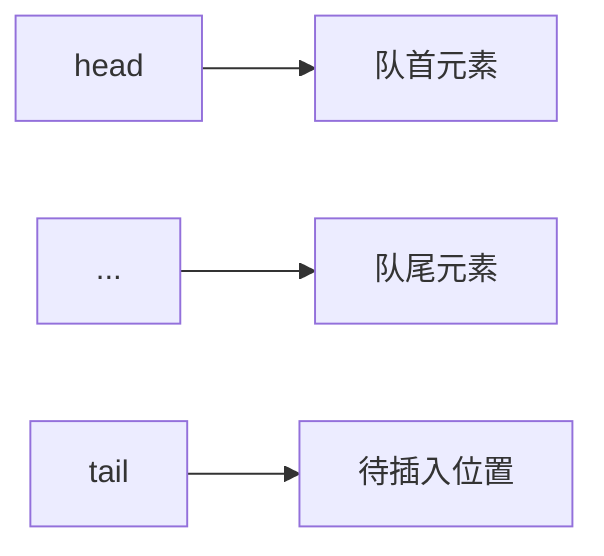
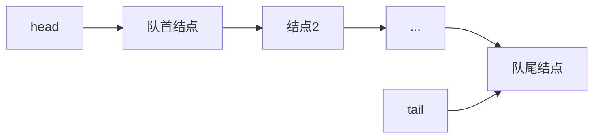

# 静态链表

## 静态链表定义
静态链表是一种使用数组实现链表概念的数据结构，通过在每个元素中存储下一个元素的索引来实现链式存储，在有限空间内有效管理大量元素。

## 静态链表实现
### 结点结构
```cpp
struct Node {
    ElementType data;  // 数据域
    int next;          // 指针域（存储下一个结点的数组下标）
};
```

### 创建静态链表
```cpp
struct Node static_list[100] = {0};  // 创建100个结点的静态链表

struct StaticList {
    Node nodes[100];
    int head_pos;  // 头指针位置
};

StaticList s1;  // 创建静态链表实例
```

### 初始化静态链表
```cpp
for(int i = 0; i < 100; i++) {
    s1.nodes[i].data = -1;  // 标记为空位置
    s1.nodes[i].next = -1;  // 无效下标标记
}
```

### 增加元素操作
1. **查找空位置**：
```cpp
int i = 0;
for(; i < 100; i++)
    if(static_list[i].data == -1)
        break;
```

2. **存入数据**：
```cpp
static_list[i].data = 100;
static_list[i].next = -1;  // 置空操作
```

3. **添加到链表尾部**：
```cpp
int j = 0;
for(; static_list[j].next != -1; j++);
static_list[j].next = i;  // 尾插法
```

### 静态链表特性
1. 在内存空间有限时使用  
2. 使用数组和下标指针实现链表功能  
3. 初始化需正确设置每个节点的data和next指针  
4. 添加元素前需检查是否已满  
5. 访问元素时需确保索引有效  
6. 大小固定，需合理估计最大元素数量  
7. 删除和增加时无需手动内存管理  

---

# 栈与队列（队列）

## 队列思想
- **先进先出，后进后出**（FIFO）  
- 典型示例：奶茶店排队  
  - 入队：顾客排到队伍末尾  
  - 出队：排在首位的顾客买到奶茶离开  

## 队列存储结构分类

### 顺序队列
#### 结构定义
```cpp
struct SeqQueue {
    int head;               // 队首指针（下标）
    int tail;               // 队尾指针（下标）
    ElementType queue[N];   // 队列空间
};
```

#### 操作原理

- **入队操作**：  
  1. 元素存入`queue[tail]`  
  2. `tail++`（后移）  
- **出队操作**：  
  1. 取出`queue[head]`  
  2. `head++`（后移）  

#### 循环队列
- **解决假溢出问题**：当tail到达数组末尾但队列未满时  
- **实现方式**：  
  ```cpp
  // 入队操作
  tail = (tail + 1) % N;
  
  // 出队操作
  head = (head + 1) % N;
  ```
- **浪费一个空间**：区分队列空和满状态  
  - 队列空：`head == tail`  
  - 队列满：`(tail + 1) % N == head`  

### 链式队列
#### 结构定义
```cpp
struct QueueNode {
    ElementType data;       // 数据域
    QueueNode* next;        // 指针域
};

struct QueueHead {
    int count;              // 队列元素数量
    QueueNode* head;        // 队首指针
    QueueNode* tail;        // 队尾指针
};
```

#### 操作原理

- **入队操作**：  
  1. 新结点添加到tail后面  
  2. 更新tail指向新结点  
- **出队操作**：  
  1. 从head取出结点  
  2. 更新head指向下一个结点  
  3. 如果队列为空，将tail也置为空  

#### 实现示例
```cpp
class LinkedQueue {
private:
    struct Node {
        int data;
        Node* next;
        Node(int val) : data(val), next(nullptr) {}
    };
    
    Node* head;  // 队首指针
    Node* tail;  // 队尾指针
    int count;   // 元素数量
    
public:
    LinkedQueue() : head(nullptr), tail(nullptr), count(0) {}
    
    // 入队
    void enqueue(int val) {
        Node* newNode = new Node(val);
        if(isEmpty()) {
            head = tail = newNode;
        } else {
            tail->next = newNode;
            tail = newNode;
        }
        count++;
    }
    
    // 出队
    int dequeue() {
        if(isEmpty()) throw runtime_error("Dequeue from empty queue");
        Node* temp = head;
        int val = head->data;
        head = head->next;
        if(head == nullptr) tail = nullptr;
        delete temp;
        count--;
        return val;
    }
    
    // 判空
    bool isEmpty() const {
        return count == 0;
    }
    
    // 队列大小
    int size() const {
        return count;
    }
};
```

---

# 栈实现四则运算计算器
## 基本思路（单数字版本）
1. 将算术表达式转为字符串  
2. 数字入栈  
3. 判断符号优先级：  
   - 优先级高：弹出数字与后续数字计算  
   - 优先级低：符号入栈  
4. 计算结果重新入栈  

## 多位数和括号扩展
```cpp
#include <stack>
#include <cctype>
#include <iostream>
#include <cmath>

int precedence(char op) {
    if(op == '+' || op == '-') return 1;
    if(op == '*' || op == '/') return 2;
    return 0;
}

int calculate(int a, int b, char op) {
    switch(op) {
        case '+': return a + b;
        case '-': return a - b;
        case '*': return a * b;
        case '/': return a / b;
    }
    return 0;
}

int evalExpression(const string& expr) {
    stack<int> values;
    stack<char> ops;
    
    for(int i = 0; i < expr.length(); i++) {
        // 处理空格
        if(expr[i] == ' ') continue;
        
        // 处理数字（多位数）
        if(isdigit(expr[i])) {
            int num = 0;
            while(i < expr.length() && isdigit(expr[i])) {
                num = num * 10 + (expr[i] - '0');
                i++;
            }
            i--;  // 回退一个字符
            values.push(num);
        }
        // 处理左括号
        else if(expr[i] == '(') {
            ops.push(expr[i]);
        }
        // 处理右括号
        else if(expr[i] == ')') {
            while(!ops.empty() && ops.top() != '(') {
                int val2 = values.top(); values.pop();
                int val1 = values.top(); values.pop();
                char op = ops.top(); ops.pop();
                values.push(calculate(val1, val2, op));
            }
            if(!ops.empty()) ops.pop();  // 弹出左括号
        }
        // 处理运算符
        else {
            while(!ops.empty() && precedence(ops.top()) >= precedence(expr[i])) {
                int val2 = values.top(); values.pop();
                int val1 = values.top(); values.pop();
                char op = ops.top(); ops.pop();
                values.push(calculate(val1, val2, op));
            }
            ops.push(expr[i]);
        }
    }
    
    // 处理剩余操作
    while(!ops.empty()) {
        int val2 = values.top(); values.pop();
        int val1 = values.top(); values.pop();
        char op = ops.top(); ops.pop();
        values.push(calculate(val1, val2, op));
    }
    
    return values.top();
}
```

## 作业
在基础四则运算计算器上添加：
1. 多位数计算支持  
2. 括号运算支持  
3. 错误处理机制  
4. 浮点数运算支持  
5. 函数扩展（sin, cos等）