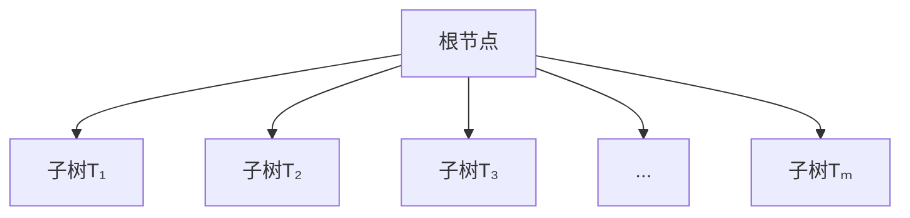
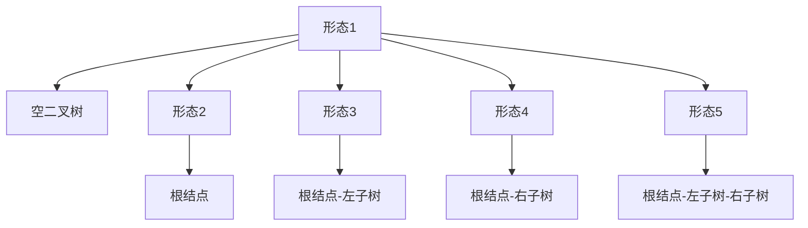

# 树与二叉树

## 树的概念
树（tree）是n（n≥0）个结点的有限集，在任意一棵非空树中：  
- 有且仅有一个特定的结点称为**根结点**（root）  
- 当n>1时，其余结点可分为m（m>0）个互不相交的有限集：T₁、T₂、T₃...Tₘ，其中每个有限集本身又是一棵树，称为根的**子树**  



### 树结点结构
树结点包含一个数据元素及若干指向其子树的指针：  
```cpp
// 树结点定义
struct TreeNode {
    ElementType Data;        // 数据域
    struct TreeNode* child1; // 分支1指针
    struct TreeNode* child2; // 分支2指针
    // ... 更多分支指针
};
```

### 替代实现方案
```cpp
// 使用链表管理子结点
struct ListNode {
    int index;            // 子结点在数组中的下标
    struct ListNode* next;// 指向下一个子结点指针
};

struct TreeNode {
    int data;               // 结点数据
    struct ListNode* childList; // 子结点链表头指针
};

// 创建包含10个结点的树
struct TreeNode tree[10] = {0};

// 初始化结点数据
for(int i = 0; i < 10; i++) {
    tree[i].data = i + 1;
    tree[i].childList = nullptr;
}

// 建立关系：结点0的子结点为1,2,3
addChild(&tree[0], 1);
addChild(&tree[0], 2);
addChild(&tree[0], 3);
```

### 树的基本术语
1. **结点层次**：  
   - 根结点为**第一层**  
   - 根的子结点为**第二层**  
   - 树中结点的最大层次称为**树的高度**或**深度**  

2. **结点的度**：  
   - 结点拥有的子树数量  
   - 度为0的结点称为**叶子结点**（leaf）或**终端结点**  
   - 度不为0的结点称为**分支结点**  

---

## 二叉树
### 二叉树特点
1. 每个结点最多有两个子树  
2. 子树有严格的左右之分，次序不能颠倒  
   - 左子树（left subtree）  
   - 右子树（right subtree）  

### 二叉树的五大形态
1. **空二叉树**：无任何结点  
2. **只有一个根结点**：无子结点  
3. **只有左子树**：根结点+左子树  
4. **只有右子树**：根结点+右子树  
5. **左右子树都存在**：完整二叉树结构  



### 二叉树的性质
1. **性质1**：在二叉树的第i层上至多有$2^{i-1}$个结点（i≥1）  
   - 第1层：$2^{0} = 1$个结点  
   - 第2层：$2^{1} = 2$个结点  
   - 第4层：$2^{3} = 8$个结点  

2. **性质2**：深度为k的二叉树至多有$2^{k}-1$个结点  

3. **性质3**：对任意二叉树，若叶子结点数为$n_0$，度为2的结点数为$n_2$，则$n_0 = n_2 + 1$  

4. **特殊二叉树**：  
   - **满二叉树**：深度为k且有$2^k-1$个结点的二叉树  
   - **完全二叉树**：  
     - 除最后一层外，其余层构成满二叉树  
     - 最后一层结点从左向右连续排列  

5. **性质4**：具有n个结点的完全二叉树，按层次编号（1~n），则：  
   - 结点i的左子结点编号：$2i$（若存在）  
   - 结点i的右子结点编号：$2i+1$（若存在）  
   - 结点i的父结点编号：$\lfloor i/2 \rfloor$（向下取整）  

6. **性质5**：具有n个结点的完全二叉树深度为$\lfloor \log_2n \rfloor + 1$  
   - 示例：n=11 → 深度=$\lfloor \log_211 \rfloor + 1 = 3 + 1 = 4$  

---

## 二叉树的存储结构
### 顺序存储结构
```cpp
int tree[10] = {0};  // 创建二叉树数组

// 存储规则（根结点索引为0）：
tree[0] = 1;        // 根结点
tree[1] = 2;        // 左子结点（2*0+1）
tree[2] = 3;        // 右子结点（2*0+2）
tree[3] = 4;        // 下一层左子结点（2*1+1）
tree[4] = 5;        // 下一层右子结点（2*1+2）
```

### 链式存储结构
```cpp
struct BinaryTreeNode {
    ElementType data;             // 数据域
    struct BinaryTreeNode* left;  // 左子结点指针
    struct BinaryTreeNode* right; // 右子结点指针
};
```

---

## 二叉树的遍历
遍历指按某条搜索路径访问树中每个结点，使每个结点被访问且仅被访问一次。

### 深度优先遍历
1. **先序遍历**（根左右）：  
   - 访问根结点  
   - 遍历左子树  
   - 遍历右子树  
   ```cpp
   void preOrder(TreeNode* root) {
       if(root == nullptr) return;
       visit(root);            // 访问根结点
       preOrder(root->left);   // 遍历左子树
       preOrder(root->right);  // 遍历右子树
   }
   ```

2. **中序遍历**（左根右）：  
   - 遍历左子树  
   - 访问根结点  
   - 遍历右子树  
   ```cpp
   void inOrder(TreeNode* root) {
       if(root == nullptr) return;
       inOrder(root->left);    // 遍历左子树
       visit(root);            // 访问根结点
       inOrder(root->right);   // 遍历右子树
   }
   ```

3. **后序遍历**（左右根）：  
   - 遍历左子树  
   - 遍历右子树  
   - 访问根结点  
   ```cpp
   void postOrder(TreeNode* root) {
       if(root == nullptr) return;
       postOrder(root->left);  // 遍历左子树
       postOrder(root->right); // 遍历右子树
       visit(root);            // 访问根结点
   }
   ```

### 广度优先遍历
- **层次遍历**：按层从上到下、从左到右访问结点  
  ```cpp
  void levelOrder(TreeNode* root) {
      if(root == nullptr) return;
      
      queue<TreeNode*> q;
      q.push(root);
      
      while(!q.empty()) {
          TreeNode* node = q.front();
          q.pop();
          visit(node);
          
          if(node->left) q.push(node->left);
          if(node->right) q.push(node->right);
      }
  }
  ```

---

## 作业：二叉树遍历推导
### 题目1
- 先序序列：11 9 3 5 6 99 32 15  
- 中序序列：3 5 6 9 11 15 32 99  
- 求后序序列：  

**推导步骤**：  
1. 先序首元素11为根结点  
2. 在中序中找到11：  
   - 左子树中序：3 5 6 9  
   - 右子树中序：15 32 99  
3. 递归求解子树  
4. **后序结果**：6 5 3 9 15 32 99 11  

### 题目2
- 中序序列：1 2 3 6 9 15 33 52  
- 先序序列：52 6 1 3 2 9 33 15  
- 求后序序列：  

**推导步骤**：  
1. 先序首元素52为根结点  
2. 在中序中找到52：  
   - 左子树中序：1 2 3 6 9 15 33  
   - 无右子树  
3. 递归求解左子树  
4. **后序结果**：2 3 1 15 33 9 6 52  

### 题目3
- 中序序列：8 13 19 20 21 35 66  
- 先序序列：35 21 13 8 19 20 66  
- 求后序序列：  

**推导步骤**：  
1. 先序首元素35为根结点  
2. 在中序中找到35：  
   - 左子树中序：8 13 19 20 21  
   - 右子树中序：66  
3. 递归求解子树  
4. **后序结果**：8 20 19 13 21 66 35