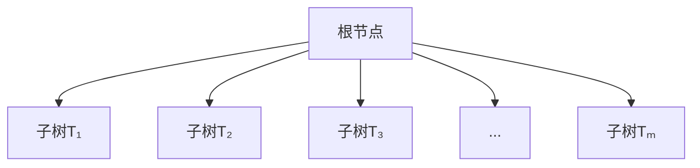
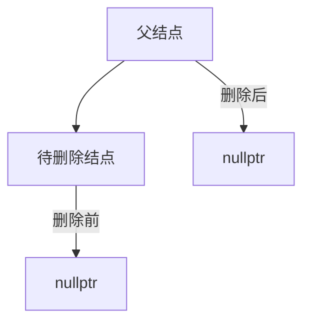
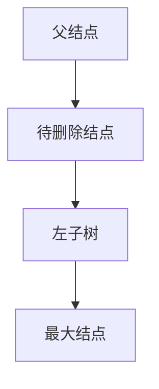
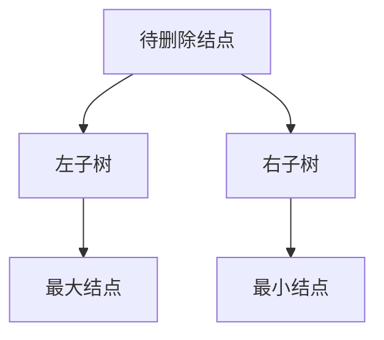
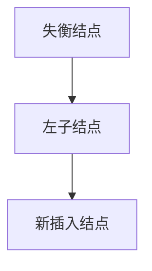
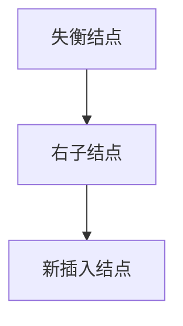

# 树与二叉树（含平衡二叉树）

## 树的概念
树（tree）是n（n≥0）个结点的有限集，在任意一棵非空树中：  
- 有且仅有一个特定的结点称为**根结点**（root）  
- 当n>1时，其余结点可分为m（m>0）个互不相交的有限集：T₁、T₂、T₃...Tₘ，其中每个有限集本身又是一棵树，称为根的**子树**  



### 树结点结构
```cpp
// 树结点定义
struct TreeNode {
    ElementType Data;        // 数据域
    struct ListNode* childList; // 子结点链表头指针
};

// 子结点链表结点
struct ListNode {
    int index;              // 子结点在数组中的下标
    struct ListNode* next;  // 指向下一个子结点
};

// 创建包含10个结点的树
struct TreeNode tree[10];

// 初始化结点数据
for(int i=0; i<10; i++) {
    tree[i].Data = i+1;
    tree[i].childList = nullptr;
}

// 建立关系：结点0的子结点为1,2,3
addChild(&tree[0], 1);
addChild(&tree[0], 2);
addChild(&tree[0], 3);
```

### 树的基本术语
1. **结点层次**：  
   - 根结点为**第一层**  
   - 树中结点的最大层次称为**树的高度**或**深度**  

2. **结点的度**：  
   - 结点拥有的子树数量  
   - 度为0的结点称为**叶子结点**  
   - 度不为0的结点称为**分支结点**  

---

## 二叉树
### 二叉树特点
1. 每个结点最多有两个子树  
2. 子树有严格的左右之分（左子树、右子树）  

### 二叉树的五大形态
1. **空二叉树**  
2. **只有根结点**  
3. **只有左子树**  
4. **只有右子树**  
5. **左右子树都存在**  

### 二叉树的性质
1. 第i层最多有$2^{i-1}$个结点  
2. 深度为k的二叉树最多有$2^k-1$个结点  
3. 叶子结点数$n_0$与度为2的结点数$n_2$关系：$n_0 = n_2 + 1$  
4. 完全二叉树结点编号规则：  
   - 结点i的左子结点：$2i$  
   - 结点i的右子结点：$2i+1$  
   - 结点i的父结点：$\lfloor i/2 \rfloor$  
5. n个结点的完全二叉树深度：$\lfloor \log_2n \rfloor + 1$  

---

## 二叉排序树
### 定义
以某个结点为准：  
- 左子树所有结点值 < 当前结点值  
- 右子树所有结点值 > 当前结点值  
- **不存在值相等的结点**  

### 结点插入
```cpp
void insertNode(TreeNode* &root, int value) {
    if(root == nullptr) {
        // 情况1：空树
        root = new TreeNode{value, nullptr, nullptr};
        return;
    }
    
    if(value < root->data) {
        if(root->left == nullptr) {
            // 左子树不存在，直接插入
            root->left = new TreeNode{value, nullptr, nullptr};
        } else {
            // 递归左子树
            insertNode(root->left, value);
        }
    } else if(value > root->data) {
        if(root->right == nullptr) {
            // 右子树不存在，直接插入
            root->right = new TreeNode{value, nullptr, nullptr};
        } else {
            // 递归右子树
            insertNode(root->right, value);
        }
    }
}
```

### 遍历特性
- **中序遍历**：输出有序序列（从小到大）  
  ```cpp
  void inOrder(TreeNode* root) {
      if(root == nullptr) return;
      inOrder(root->left);
      cout << root->data << " ";
      inOrder(root->right);
  }
  ```

### 结点删除
#### 情况1：叶子结点

1. 释放叶子结点空间  
2. 父结点对应指针置空  

#### 情况2：只有左子树

1. 找到左子树中值最大的结点  
2. 用最大结点替换待删除结点  
3. 调整指针关系  

#### 情况3：只有右子树

1. 找到右子树中值最小的结点  
2. 用最小结点替换待删除结点  
3. 调整指针关系  

#### 情况4：左右子树均存在

- 方案1：用左子树最大结点替换  
- 方案2：用右子树最小结点替换  

---

## 平衡二叉树（AVL树）
### 定义
1. 空树是平衡二叉树  
2. 左右子树都是平衡二叉树  
3. 左右子树高度差绝对值 ≤ 1  
4. **平衡因子** = 左子树高度 - 右子树高度  
   - 取值范围：-1, 0, 1  

### 平衡操作
#### 左深左插失衡（LL型）

**解决方案**：单向右旋  
1. 失衡结点的左指针 → 左子结点的右子树  
2. 左子结点的右指针 → 失衡结点  
3. 更新父结点指针  

```cpp
TreeNode* rightRotate(TreeNode* y) {
    TreeNode* x = y->left;
    TreeNode* T2 = x->right;
    
    // 旋转
    x->right = y;
    y->left = T2;
    
    // 更新高度
    y->height = max(height(y->left), height(y->right)) + 1;
    x->height = max(height(x->left), height(x->right)) + 1;
    
    return x;
}
```

#### 右深右插失衡（RR型）

**解决方案**：单向左旋  
1. 失衡结点的右指针 → 右子结点的左子树  
2. 右子结点的左指针 → 失衡结点  
3. 更新父结点指针  

```cpp
TreeNode* leftRotate(TreeNode* x) {
    TreeNode* y = x->right;
    TreeNode* T2 = y->left;
    
    // 旋转
    y->left = x;
    x->right = T2;
    
    // 更新高度
    x->height = max(height(x->left), height(x->right)) + 1;
    y->height = max(height(y->left), height(y->right)) + 1;
    
    return y;
}
```

### 平衡调整流程
1. 插入新结点  
2. 更新祖先结点高度  
3. 检查平衡因子  
4. 根据失衡类型旋转调整  
   - LL型：右旋  
   - RR型：左旋  
   - LR型：先左旋后右旋  
   - RL型：先右旋后左旋  

---

## 作业
1. 完成未实现的后序遍历和层次遍历代码  
2. 实现二叉排序树的销毁和循环删除操作  
3. 绘制右深右插（RR型）失衡的逻辑图  
4. 实现右深右插失衡的平衡操作代码  
5. 完善平衡二叉树的插入和删除操作