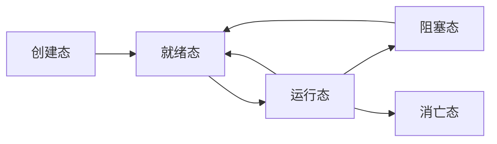

### 进程  
**程序**: 数据结构+算法  
- **数据结构**: 表示思维对象抽象概念的物理表现  
- **指令操作**: 对数据进行处理的规则  
- **计算**: 对有限数据集实施以解决问题的有限指令集合  
程序是数据和指令的集合，执行过程即计算。  

---

#### 程序的执行方式  
##### 顺序方式  
- 完全执行完一个程序才能执行下一个  
- **示例**: 游戏大厅选完角色后才能进入游戏界面  
- **缺陷**: CPU利用率低  

##### 并发执行  
- 将指令执行过程拆分为不同步骤  
- 不同硬件并行处理不同步骤  
- **目的**: 提高CPU利用率和系统吞吐量  

---

#### 进程定义  
进程是具有独立功能的程序在数据集合上的一次运行活动。  
**示例**:  
```c  
int main() {  
    int a = 11, b = 10;  
    int sum = a + b;  
    std::cout << "sum = " << sum << std::endl;  
    return 0;  
}  
```  
执行 `./a.out` 即启动一个进程。  

---

#### 进程与程序的区别  
| **程序**                     | **进程**                     |  
|------------------------------|------------------------------|  
| 静态概念（指令集合）          | 动态概念（活动实体）          |  
| 存储在文件系统中              | 运行时创建和消亡              |  
| 一个程序可对应多个进程        | 一次程序执行对应一个进程      |  
| -                            | 竞争系统资源的基本单位        |  
**类比**: "菜谱"（程序）与 "按菜谱炒菜"（进程）。  

---

#### 进程状态  
操作系统将进程执行分为多个阶段：  
1. **创建态**:  
   - 创建空白PCB（`struct task_struct`）  
   - 包含进程状态、ID、空间地址、文件表项等  
2. **就绪态**:  
   - 准备工作完成，等待CPU调度  
3. **运行态**:  
   - CPU正在执行进程指令  
4. **阻塞态**:  
   - 等待外部事件（如I/O完成）  
5. **消亡态**:  
   - 释放PCB资源  

**状态转换关系**:  

> **注意**: 阻塞态需先切回就绪态才能进入运行态。  

---

#### 进程调度策略  
| **调度类型** | **策略**                     | **示例系统**                  |  
|--------------|------------------------------|-------------------------------|  
| 分时系统     | 时间片轮转                   | Linux, Windows, macOS        |  
| 实时系统     | 优先级抢占                   | uCOS, FreeRTOS               |  
- **时间片轮转**: 每个进程执行固定时长后切换  
- **优先级抢占**: 高优先级进程可中断低优先级进程  

---

#### 进程地址空间分布  
Linux对进程数据分段管理：  
| **段**     | **内容**                          | **属性**               | **生命周期**         |  
|------------|-----------------------------------|------------------------|----------------------|  
| .text      | 代码                              | 只读、共享             | 随进程持续           |  
| .data      | 已初始化的全局变量/静态变量       | 可读写                 | 随进程持续           |  
| .bss       | 未初始化的全局变量/静态变量       | 可读写（初始化为0）    | 随进程持续           |  
| .rodata    | 只读数据（如字符串常量）          | 只读                  | 随进程持续           |  
| stack      | 局部变量                          | 可读写、自动释放       | 随代码块持续         |  
| heap       | `malloc`/`calloc`动态分配的内存   | 可读写、需手动释放     | 显式释放或进程结束   |  

> **关键点**:  
> - **栈空间**: 返回局部变量地址会导致悬空指针  
> - **堆空间**: 需手动释放避免内存泄漏  

---

#### Linux进程API  
##### 创建进程  
```c  
#include <sys/types.h>  
#include <unistd.h>  

pid_t fork(void);  
/*  
@描述:  
  创建子进程（复制父进程数据/指令/文件描述符等）  
@返回值:  
  成功:  
    父进程返回子进程ID (>0)  
    子进程返回0  
  失败: 返回-1（errno被设置）  
*/  
```  
**注意**:  
- 父子进程独立运行  
- 子进程从`fork()`返回处开始执行  

##### 获取进程ID  
```c  
pid_t getpid(void);  // 返回当前进程ID  
pid_t getppid(void); // 返回父进程ID  
```  

##### 进程退出  
```c  
#include <stdlib.h>  
void exit(int status);  // 正常退出（清理缓冲区）  
#include <unistd.h>  
void _exit(int status); // 立即退出（不做清理）  
```  
- **`status`**: 退出码（`0`表示成功，非`0`表示错误）  

##### 等待子进程  
```c  
#include <sys/wait.h>  

pid_t wait(int *wstatus);  
/*  
@描述:  
  等待任意子进程结束  
@wstatus: 存储子进程退出状态  
@返回值: 成功返回子进程ID，失败返回-1  
*/  

pid_t waitpid(pid_t pid, int *wstatus, int options);  
/*  
@pid:  
  >0: 指定进程ID  
  -1: 任意子进程  
  0: 同组任意子进程  
  <-1: 组ID为|pid|的任意子进程  
@options:  
  0: 阻塞等待  
  WNOHANG: 非阻塞  
*/  
```  

---

#### 特殊进程类型  
##### 僵尸进程  
- **定义**: 已结束但未被父进程`wait()`回收的进程  
- **风险**: 占用进程表项（不占内存/CPU）  
- **避免**: 父进程必须调用`wait()`/`waitpid()`  

##### 孤儿进程  
- **定义**: 父进程先于子进程结束  
- **处理**: 被`init`进程（PID=1）接管并自动回收  

##### 守护进程  
- **定义**: 后台运行且无控制终端的进程  
- **用途**: 系统级任务（如网络服务）  
- **创建步骤**:  
  1. `fork()`创建子进程，父进程退出  
  2. 子进程调用`setsid()`创建新会话  
  3. 更改工作目录（如`chdir("/")`）  
  4. 重设文件权限掩码（`umask(0)`）  
  5. 关闭继承的文件描述符  

**示例代码**:  
```c  
#include <unistd.h>  
#include <stdlib.h>  

void daemonize() {  
    pid_t pid = fork();  
    if (pid < 0) exit(EXIT_FAILURE);  
    if (pid > 0) exit(EXIT_SUCCESS); // 父进程退出  

    if (setsid() < 0) exit(EXIT_FAILURE); // 创建新会话  

    if (chdir("/") < 0) exit(EXIT_FAILURE); // 更改工作目录  

    // 守护进程主逻辑  
    while (1) { /* 执行任务 */ }  
}  
```  

---

#### 关键总结  
| **概念**       | **核心要点**                                  |  
|----------------|----------------------------------------------|  
| **进程 vs 程序** | 动态 vs 静态，一次执行 vs 持久存储            |  
| **进程状态**   | 创建→就绪→运行→阻塞→消亡                      |  
| **地址空间**   | 分段管理（.text/.data/.bss/stack/heap）       |  
| **僵尸进程**   | 父进程未调用`wait()`导致残留进程表项          |  
| **守护进程**   | 无终端关联的后台进程，需脱离父进程控制        |  

**作业**: 实现守护进程监控系统任务。