# 重庆邮电大学 802 数据结构——绪论笔记

> 范围：数据的基本概念、数据结构、算法、时间复杂度、空间复杂度。  
> Mermaid 兼容说明：节点文字已统一使用双引号包裹，并以 `flowchart` 代替部分渲染器不支持的 `mindmap`。

> 目标：能辨析概念，能判断逻辑结构与存储结构，能计算常见程序段的复杂度。

---

## 1. 数据结构研究什么

数据结构主要研究三部分：

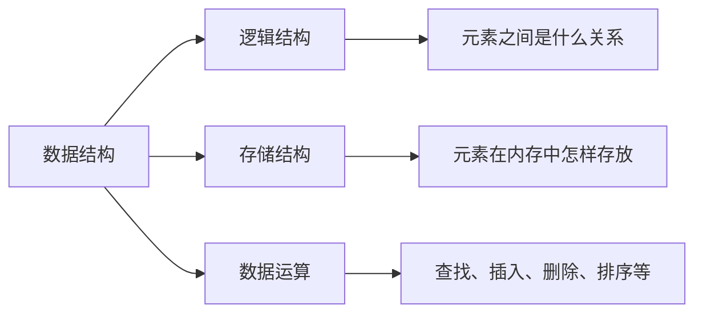

因此可以记为：

$$
\boxed{\text{数据结构}=\text{逻辑结构}+\text{存储结构}+\text{基本运算}}
$$

例如，线性表在逻辑上是一对一关系；它既可以采用顺序存储，也可以采用链式存储；其常见运算包括插入、删除和查找。

---

# 2. 数据的基本概念

## 2.1 数据

**数据（Data）**是能被计算机识别、存储和处理的符号集合。

数据不只包括数字，还包括：

- 字符与文字
- 图像
- 音频
- 视频
- 程序指令

---

## 2.2 数据元素

**数据元素（Data Element）**是数据的基本单位，在程序中通常作为一个整体进行处理。

例如，一个学生信息：

```text
学号：20260001
姓名：张三
成绩：90
```

“一名学生”就是一个数据元素。

---

## 2.3 数据项

**数据项（Data Item）**是组成数据元素的最小单位。

在学生数据元素中：

- 学号
- 姓名
- 成绩

都是数据项。

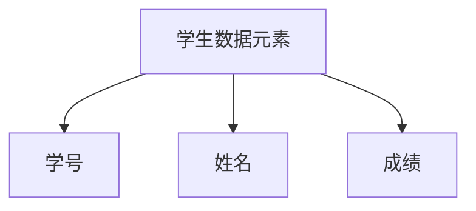

关系：

$$
\boxed{\text{数据元素由若干数据项组成}}
$$

---

## 2.4 数据对象

**数据对象（Data Object）**是性质相同的数据元素的集合，是数据的一个子集。

例如：

- 全体学生构成学生数据对象
- 全体整数构成整数数据对象

---

## 2.5 数据结构

**数据结构（Data Structure）**是相互之间存在一种或多种特定关系的数据元素的集合。

重点不只是“有哪些数据”，更重要的是：

$$
\boxed{\text{数据元素之间存在什么关系}}
$$

---

## 2.6 数据类型

**数据类型（Data Type）**是一组性质相同的值的集合，以及定义在这个集合上的一组操作。

例如，C 语言中的 `int`：

- 值的集合：整数
- 可进行的操作：加、减、乘、除、比较等

---

## 2.7 抽象数据类型

**抽象数据类型（ADT）**主要描述：

- 数据对象
- 数据关系
- 基本操作

但不规定具体怎样存储和实现。

例如“栈”只规定：

- 后进先出
- 可以入栈
- 可以出栈
- 可以读取栈顶元素

至于采用数组还是链表实现，不属于 ADT 本身关注的内容。

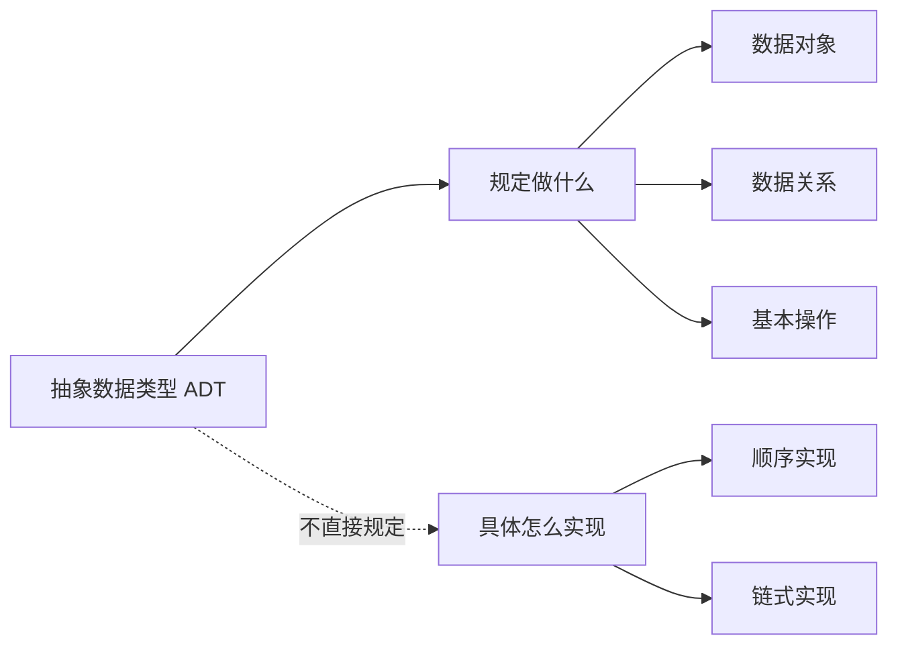

记忆：

$$
\boxed{\text{ADT 强调“做什么”，不强调“怎么做”}}
$$

---

# 3. 数据的逻辑结构

逻辑结构描述数据元素之间的逻辑关系，与其在计算机中的具体存储方式无关。

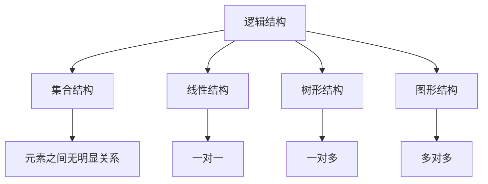

## 3.1 集合结构

数据元素之间除了属于同一个集合外，没有其他明确关系。

```text
{A, B, C, D}
```

---

## 3.2 线性结构

数据元素之间存在一对一关系。

除第一个元素外，每个元素只有一个直接前驱；除最后一个元素外，每个元素只有一个直接后继。

常见结构：

- 线性表
- 栈
- 队列
- 串

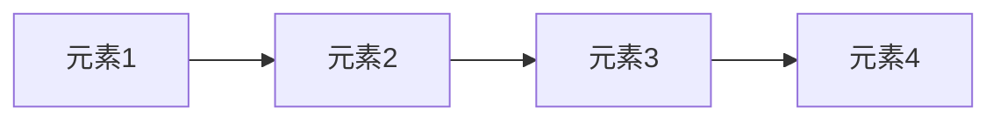

---

## 3.3 树形结构

数据元素之间存在一对多关系。

常见结构：

- 二叉树
- 二叉排序树
- AVL 树
- B 树

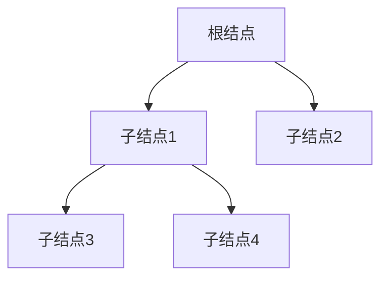

---

## 3.4 图形结构

数据元素之间存在多对多关系。

常见结构：

- 有向图
- 无向图
- 带权图
- 网

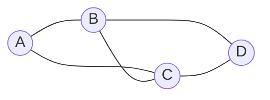

---

## 3.5 逻辑结构分类总结

| 结构 | 元素关系 | 常见例子 |
|---|---|---|
| 集合结构 | 无明显关系 | 集合 |
| 线性结构 | 一对一 | 线性表、栈、队列 |
| 树形结构 | 一对多 | 二叉树、B 树 |
| 图形结构 | 多对多 | 有向图、无向图 |

---

# 4. 数据的存储结构

存储结构也叫物理结构，描述数据在计算机内存中的实际存放方式。

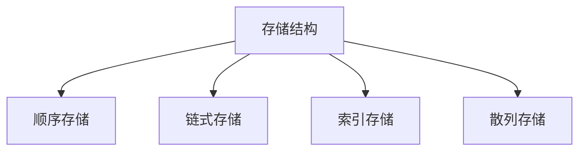

## 4.1 顺序存储

把逻辑上相邻的数据元素存放在物理地址连续的存储单元中。

典型例子：数组、顺序表。

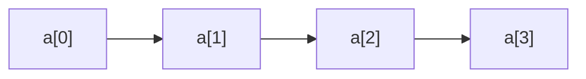

优点：

- 可以随机访问
- 按下标定位速度快

缺点：

- 插入、删除时可能移动大量元素
- 容量通常需要提前确定

---

## 4.2 链式存储

数据元素可以存放在不连续的存储单元中，通过指针表示元素之间的关系。

典型例子：链表。

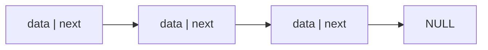

优点：

- 插入、删除方便
- 存储空间可以动态申请

缺点：

- 不能直接随机访问
- 需要额外空间保存指针

---

## 4.3 索引存储

除了存放数据元素，还建立索引表，通过索引快速定位数据。

典型例子：

- 数据库索引
- 分块查找中的索引表

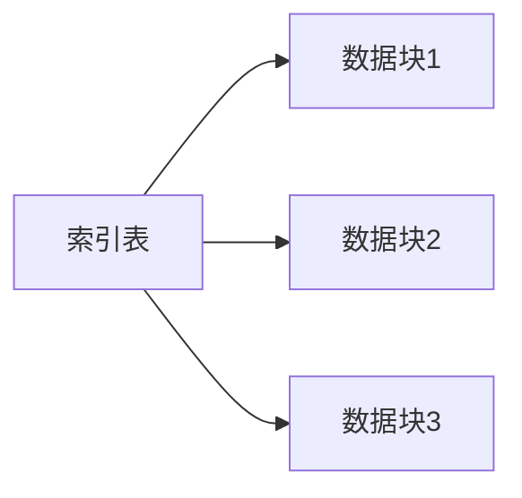

---

## 4.4 散列存储

根据关键字，通过散列函数直接计算存储地址。

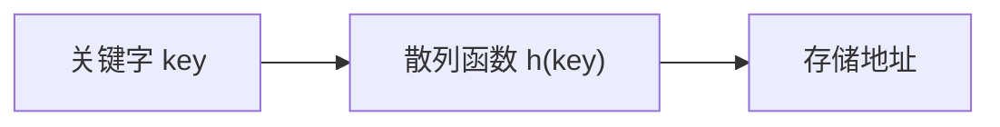

理想情况下，查找、插入、删除的平均时间复杂度可以达到：

$$
O(1)
$$

---

# 5. 逻辑结构与存储结构的区别

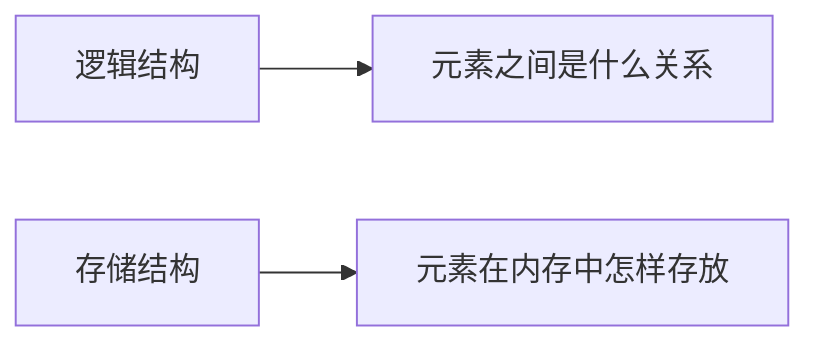

例如：

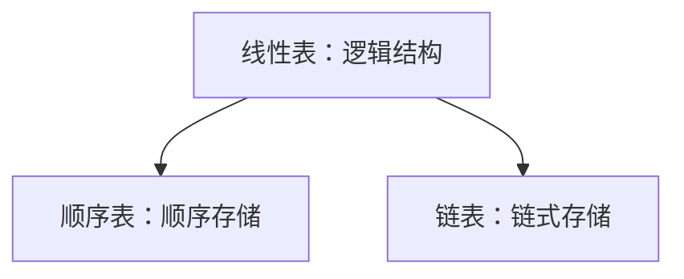

因此：

$$
\boxed{\text{同一种逻辑结构可以采用不同的存储结构}}
$$

---

# 6. 算法的基本概念

算法是解决特定问题的一组有限且明确的操作步骤。

## 6.1 算法的五个基本特性

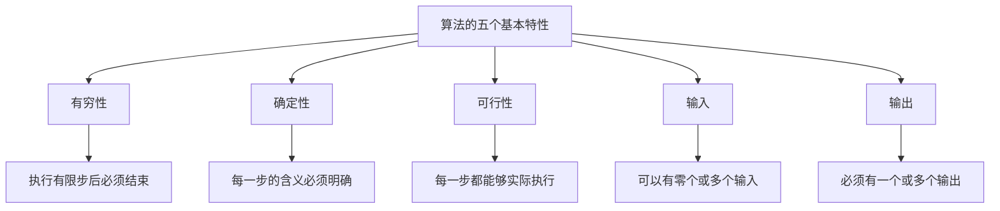

### 有穷性

算法必须在执行有限步之后结束。

### 确定性

算法的每一步都必须含义明确，不能有歧义。

### 可行性

算法中的每一步都能够通过有限次基本操作实现。

### 输入

一个算法可以有零个或多个输入。

### 输出

一个算法必须有一个或多个输出。

---

# 7. 好算法的评价标准

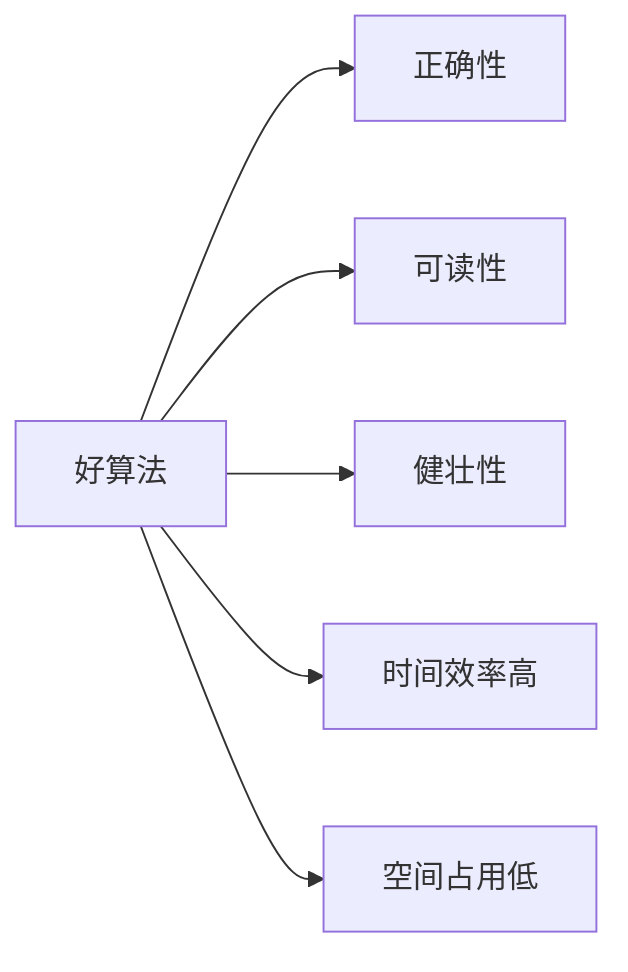

考试中最常分析的是：

- 时间复杂度
- 空间复杂度

---

# 8. 时间复杂度

## 8.1 时间复杂度研究什么

时间复杂度不是计算程序实际运行了多少秒，而是研究：

$$
\boxed{\text{基本操作执行次数随输入规模 }n\text{ 的增长趋势}}
$$

例如：

```c
for (int i = 0; i < n; i++)
    x++;
```

基本操作 `x++` 执行 $n$ 次：

$$
T(n)=n
$$

所以：

$$
\Theta(n)
$$

---

## 8.2 大 $O$、大 $\Theta$、大 $\Omega$

| 符号 | 含义 |
|---|---|
| $O$ | 渐进上界 |
| $\Omega$ | 渐进下界 |
| $\Theta$ | 渐进紧确界，同一数量级 |

一般数据结构题中，若没有特别区分，常直接用大 $O$ 表示复杂度。

---

## 8.3 复杂度只保留最高阶

例如：

$$
T(n)=3n^2+5n+10
$$

忽略常数系数和低阶项：

$$
\boxed{T(n)=\Theta(n^2)}
$$

常见规则：

$$
O(2n)=O(n)
$$

$$
O(n+100)=O(n)
$$

$$
O(n^2+n)=O(n^2)
$$

$$
O(\log_2 n)=O(\log_3 n)=O(\log n)
$$

因为：

$$
\log_a n=\frac{\log_b n}{\log_b a}
$$

换底只相差一个常数。

---

## 8.4 常见复杂度增长顺序

$$
\boxed{
O(1)
<
O(\log n)
<
O(\sqrt n)
<
O(n)
<
O(n\log n)
<
O(n^2)
<
O(n^3)
<
O(2^n)
<
O(n!)
}
$$

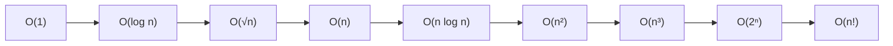

---

# 9. 单循环复杂度

单循环的通用方法：

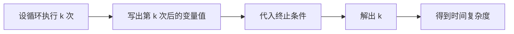

即：

$$
\boxed{
\text{设执行 }k\text{ 次}
\rightarrow
\text{写变量值}
\rightarrow
\text{代终止条件}
\rightarrow
\text{解 }k
}
$$

---

## 9.1 每次加常数

```c
int i = 1;
while (i <= n) {
    i += 3;
}
```

执行 $k$ 次后：

$$
i=1+3k
$$

终止临界：

$$
1+3k\approx n
$$

所以：

$$
k\approx \frac{n-1}{3}
$$

因此：

$$
\boxed{\Theta(n)}
$$

一般地，若：

```c
i = i + c;
```

其中 $c$ 为正常数，则通常为：

$$
\Theta(n)
$$

---

## 9.2 每次乘常数

```c
int i = 1;
while (i <= n) {
    i *= 2;
}
```

执行 $k$ 次后：

$$
i=2^k
$$

终止临界：

$$
2^k\approx n
$$

所以：

$$
k\approx \log_2 n
$$

因此：

$$
\boxed{\Theta(\log n)}
$$

---

## 9.3 循环条件中带幂

```c
int i = 1;
while (i * i <= n) {
    i++;
}
```

执行 $k$ 次后：

$$
i=1+k
$$

代入终止条件：

$$
(1+k)^2\approx n
$$

得到：

$$
k\approx \sqrt n
$$

因此：

$$
\boxed{\Theta(\sqrt n)}
$$

更一般地：

```c
while (pow(i, m) <= n)
    i++;
```

其复杂度为：

$$
\boxed{\Theta(n^{1/m})}
$$

---

## 9.4 每次平方

```c
int i = 2;
while (i <= n) {
    i = i * i;
}
```

变量变化：

$$
2\rightarrow4\rightarrow16\rightarrow256\rightarrow\cdots
$$

执行 $k$ 次后：

$$
i=2^{2^k}
$$

终止临界：

$$
2^{2^k}\approx n
$$

第一次取对数：

$$
2^k\approx\log_2 n
$$

再次取对数：

$$
k\approx\log_2\log_2 n
$$

因此：

$$
\boxed{\Theta(\log\log n)}
$$

---

## 9.5 形如 $i=2i+1$

```c
int i = 1;
while (i <= n) {
    i = 2 * i + 1;
}
```

递推式：

$$
i_{k+1}=2i_k+1
$$

两边加 $1$：

$$
i_{k+1}+1=2(i_k+1)
$$

所以真正每次翻倍的是 $i+1$：

$$
i_k+1=(i_0+1)2^k
$$

当 $i_0=1$ 时：

$$
i_k=2^{k+1}-1
$$

因此：

$$
\boxed{\Theta(\log n)}
$$

---

# 10. 双重循环复杂度

双重循环的核心方法：


即：

$$
\boxed{T(n)=\sum_{\text{外层每个 }i}f(i)}
$$

---

## 10.1 两层完全独立

```c
for (int i = 1; i <= n; i++)
    for (int j = 1; j <= n; j++)
        x++;
```

外层执行 $n$ 次，每轮内层执行 $n$ 次：

$$
T(n)=n\cdot n
$$

所以：

$$
\boxed{\Theta(n^2)}
$$

---

## 10.2 内层独立但为对数级

```c
for (int i = 1; i <= n; i++)
    for (int j = 1; j <= n; j *= 2)
        x++;
```

外层：

$$
\Theta(n)
$$

内层：

$$
\Theta(\log n)
$$

总复杂度：

$$
\boxed{\Theta(n\log n)}
$$

---

## 10.3 内层依赖外层变量

```c
for (int i = 1; i <= n; i++)
    for (int j = 1; j <= i; j++)
        x++;
```

第 $i$ 轮内层执行 $i$ 次：

$$
T(n)=1+2+\cdots+n
$$

$$
T(n)=\frac{n(n+1)}2
$$

因此：

$$
\boxed{\Theta(n^2)}
$$

---

## 10.4 外层倍增，内层执行 $i$ 次

```c
for (int i = 1; i <= n; i *= 2)
    for (int j = 1; j <= i; j++)
        x++;
```

外层变量取值：

$$
1,2,4,8,\ldots,n
$$

总次数：

$$
1+2+4+\cdots+n
$$

这是等比数列：

$$
1+2+4+\cdots+n=2n-1
$$

因此：

$$
\boxed{\Theta(n)}
$$

---

## 10.5 内层次数为 $\log i$

```c
for (int i = 1; i <= n; i++)
    for (int j = 1; j <= i; j *= 2)
        x++;
```

固定 $i$，内层执行：

$$
\Theta(\log i)
$$

所以：

$$
T(n)=\sum_{i=1}^{n}\log i
$$

又因为：

$$
\sum_{i=1}^{n}\log i=\log(n!)
$$

故：

$$
\boxed{\Theta(n\log n)}
$$

---

## 10.6 内层步长受外层影响

```c
for (int i = 1; i <= n; i++)
    for (int j = i; j <= n; j += i)
        x++;
```

固定 $i$，$j$ 的取值为：

$$
i,2i,3i,\ldots
$$

内层约执行：

$$
\frac{n}{i}
$$

所以：

$$
T(n)=\sum_{i=1}^{n}\frac{n}{i}
$$

$$
T(n)=n\left(1+\frac12+\frac13+\cdots+\frac1n\right)
$$

调和级数满足：

$$
1+\frac12+\frac13+\cdots+\frac1n=\Theta(\log n)
$$

因此：

$$
\boxed{\Theta(n\log n)}
$$

---

# 11. 多层循环复杂度

多层循环不能只看层数，必须从最内层开始向外逐层计算。

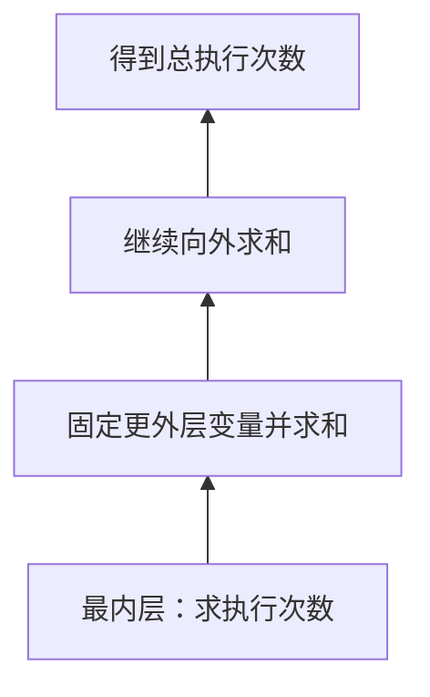

记忆：

$$
\boxed{\text{固定外层，从最内层开始数，再一层层往外加}}
$$

---

## 11.1 三层相关循环

```c
for (int i = 1; i <= n; i++)
    for (int j = 1; j <= i; j++)
        for (int k = 1; k <= j; k++)
            s++;
```

固定 $i,j$，最内层执行：

$$
j\text{ 次}
$$

固定 $i$，对 $j$ 求和：

$$
\sum_{j=1}^{i}j
=
\frac{i(i+1)}2
=
\Theta(i^2)
$$

再对 $i$ 求和：

$$
\sum_{i=1}^{n}\Theta(i^2)
=
\Theta(n^3)
$$

最终：

$$
\boxed{\Theta(n^3)}
$$

---

## 11.2 外层倍增的三层循环

```c
for (int i = 1; i <= n; i *= 2)
    for (int j = 1; j <= i; j++)
        for (int k = 1; k <= j; k++)
            s++;
```

固定 $i$，内部两层复杂度：

$$
\Theta(i^2)
$$

外层 $i$ 的取值：

$$
1,2,4,\ldots,n
$$

总次数：

$$
1^2+2^2+4^2+\cdots+n^2
$$

即：

$$
1+4+16+\cdots+n^2
$$

该等比数列由最后一项决定数量级：

$$
\boxed{\Theta(n^2)}
$$

---

## 11.3 最内层为对数级

```c
for (int i = 1; i <= n; i++)
    for (int j = 1; j <= i; j++)
        for (int k = 1; k <= j; k *= 2)
            s++;
```

固定 $i,j$，最内层执行：

$$
\Theta(\log j)
$$

固定 $i$：

$$
\sum_{j=1}^{i}\log j
=
\Theta(i\log i)
$$

再对 $i$ 求和：

$$
\sum_{i=1}^{n}i\log i
=
\boxed{\Theta(n^2\log n)}
$$

---

# 12. 常用求和公式

## 12.1 常数求和

$$
\sum_{i=1}^{n}1=n=\Theta(n)
$$

## 12.2 等差数列求和

$$
1+2+\cdots+n=\frac{n(n+1)}2=\Theta(n^2)
$$

## 12.3 平方和

$$
1^2+2^2+\cdots+n^2
=
\frac{n(n+1)(2n+1)}6
=
\Theta(n^3)
$$

## 12.4 立方和

$$
1^3+2^3+\cdots+n^3
=
\left[\frac{n(n+1)}2\right]^2
=
\Theta(n^4)
$$

## 12.5 等比数列求和

$$
1+r+r^2+\cdots+r^m
=
\frac{r^{m+1}-1}{r-1}
$$

当 $r>1$ 时，数量级通常由最后一项决定。

例如：

$$
1+2+4+\cdots+n=\Theta(n)
$$

$$
1+4+16+\cdots+n^2=\Theta(n^2)
$$

## 12.6 调和级数

$$
1+\frac12+\frac13+\cdots+\frac1n=\Theta(\log n)
$$

## 12.7 对数求和

$$
\sum_{i=1}^{n}\log i
=
\log(n!)
=
\Theta(n\log n)
$$

---

# 13. 递归算法复杂度

递归复杂度通常看两个方面：

```mermaid
flowchart LR
    A["递归复杂度"] --> B["每层做多少工作"]
    A --> C["递归深度是多少"]
```

---

## 13.1 每次规模减 $1$

```c
void fun(int n) {
    if (n <= 1) return;
    fun(n - 1);
}
```

递归深度：

$$
n
$$

每层只做常数次操作，所以：

$$
\boxed{\Theta(n)}
$$

---

## 13.2 每次规模减半

```c
void fun(int n) {
    if (n <= 1) return;
    fun(n / 2);
}
```

递归深度满足：

$$
\frac{n}{2^k}=1
$$

因此：

$$
k=\log_2 n
$$

时间复杂度：

$$
\boxed{\Theta(\log n)}
$$

---

## 13.3 二叉递归

```c
void fun(int n) {
    if (n <= 1) return;
    fun(n - 1);
    fun(n - 1);
}
```

递归树每层结点数翻倍，深度约为 $n$：

$$
\boxed{\Theta(2^n)}
$$

---

# 14. 最好、最坏与平均时间复杂度

以顺序查找为例：

```mermaid
flowchart TB
    A["顺序查找"] --> B["最好情况"]
    A --> C["最坏情况"]
    A --> D["平均情况"]

    B --> B1["第一个元素就是目标 O(1)"]
    C --> C1["最后找到或查找失败 O(n)"]
    D --> D1["平均检查约一半元素 O(n)"]
```

考试中若未特别说明，通常重点考虑：

$$
\boxed{\text{最坏时间复杂度}}
$$

但题目若明确要求平均查找长度，则需要按照概率求期望。

---

# 15. 空间复杂度

空间复杂度表示算法运行过程中，额外占用的存储空间随输入规模增长的趋势。

主要检查：

- 辅助变量
- 辅助数组
- 动态申请的结点
- 递归调用栈

```mermaid
flowchart LR
    A["空间复杂度"] --> B["辅助数组"]
    A --> C["动态结点"]
    A --> D["递归调用栈"]
    A --> E["少量普通变量"]
```

---

## 15.1 常数辅助空间

```c
int max = a[0];
for (int i = 1; i < n; i++) {
    if (a[i] > max)
        max = a[i];
}
```

只使用少量变量：

$$
\boxed{O(1)}
$$

---

## 15.2 长度为 $n$ 的辅助数组

```c
int b[n];
```

额外空间：

$$
\boxed{O(n)}
$$

---

## 15.3 二维辅助数组

```c
int b[n][n];
```

额外空间：

$$
\boxed{O(n^2)}
$$

---

## 15.4 递归空间

```c
void fun(int n) {
    if (n <= 1) return;
    fun(n - 1);
}
```

递归深度为 $n$，每层调用占用常数空间：

$$
\boxed{O(n)}
$$

注意：即使没有辅助数组，递归调用栈也会占用空间。

---

# 16. 复杂度标准答题流程

## 16.1 单循环

```mermaid
flowchart TD
    A["找循环变量和初值"] --> B["找每轮变化方式"]
    B --> C["设执行 k 次"]
    C --> D["写出第 k 次后的值"]
    D --> E["代入终止条件"]
    E --> F["解出 k"]
    F --> G["写复杂度"]
```

简写：

$$
\boxed{
\text{变化规律}
\rightarrow
\text{终止条件}
\rightarrow
\text{循环次数}
}
$$

---

## 16.2 双循环

```mermaid
flowchart TD
    A["看外层变量如何变化"] --> B["固定外层变量"]
    B --> C["求内层次数 f(i)"]
    C --> D["对所有 i 求和：T(n)=Σf(i)"]
    D --> E["保留最高阶"]
```

若两层完全独立，求和通常可直接化为相乘。

---

## 16.3 多层循环

```mermaid
flowchart BT
    A["最内层计数"] --> B["向外一层求和"]
    B --> C["继续向外求和"]
    C --> D["得到最终数量级"]
```

简写：

$$
\boxed{
\text{从最内层向外，一层一层把次数写成外层变量的函数}
}
$$

---

# 17. 常见易错点

## 17.1 看到等差数列就直接求和

单循环题通常不是求循环变量之和，而是求循环执行次数。

---

## 17.2 忘记代入终止条件

例如：

```c
i = 1;
while (i * i <= n)
    i++;
```

执行 $k$ 次后：

$$
i=1+k
$$

还要代入：

$$
(1+k)^2\le n
$$

才能得到：

$$
k=\Theta(\sqrt n)
$$

---

## 17.3 看到双循环就写 $O(n^2)$

必须检查：

- 内层上限是否依赖外层变量
- 内层步长是否依赖外层变量
- 循环变量是加法增长还是乘法增长

---

## 17.4 用内层最大次数乘外层次数

例如：

```c
for (i = 1; i <= n; i *= 2)
    for (j = 1; j <= i; j++)
```

不能写成：

$$
n\log n
$$

正确做法是：

$$
1+2+4+\cdots+n=\Theta(n)
$$

---

## 17.5 把所有乘法更新都当成普通等比

```mermaid
flowchart LR
    A["i *= 2"] --> B["指数增长"]
    B --> C["循环次数 O(log n)"]

    D["i = i * i"] --> E["双指数增长"]
    E --> F["循环次数 O(log log n)"]
```

---

## 17.6 忽略递归调用栈

递归算法即使没有辅助数组，也可能有：

$$
O(n)
$$

或：

$$
O(\log n)
$$

的空间复杂度。

---

## 17.7 混淆 $(\log n)^2$ 与 $\log(n^2)$

$$
(\log n)^2=\log n\cdot\log n
$$

而：

$$
\log(n^2)=2\log n=\Theta(\log n)
$$

二者数量级不同。

---

# 18. 考前速记图

```mermaid
flowchart TB
    A["绪论"]

    A --> B["数据结构"]
    A --> C["算法"]
    A --> D["复杂度分析"]

    B --> B1["逻辑结构"]
    B --> B2["存储结构"]
    B --> B3["基本运算"]

    B1 --> B11["集合、线性、树形、图形"]
    B2 --> B21["顺序、链式、索引、散列"]
    B3 --> B31["查找、插入、删除、排序"]

    C --> C1["算法五大特性"]
    C --> C2["时间复杂度"]
    C --> C3["空间复杂度"]

    D --> D1["单循环"]
    D --> D2["多层循环"]

    D1 --> D11["设执行 k 次"]
    D11 --> D12["写出变量变化式"]
    D12 --> D13["代入终止条件"]

    D2 --> D21["固定外层变量"]
    D21 --> D22["从最内层开始计数"]
    D22 --> D23["逐层向外求和"]
```

---

# 19. 高频结论

| 程序形式 | 时间复杂度 |
|---|---:|
| `i++`，直到 $i>n$ | $O(n)$ |
| `i*=2`，直到 $i>n$ | $O(\log n)$ |
| `i=i*i`，直到 $i>n$ | $O(\log\log n)$ |
| `i++`，直到 $i^2>n$ | $O(\sqrt n)$ |
| 两层各独立执行 $n$ 次 | $O(n^2)$ |
| 外层 $n$ 次，内层倍增 | $O(n\log n)$ |
| 外层倍增，内层执行 $i$ 次 | $O(n)$ |
| 第 $i$ 轮内层执行 $n/i$ 次 | $O(n\log n)$ |

---

# 20. 自测题

## 题 1

```c
int i = 1;
while (i <= n)
    i += 5;
```

答案：

$$
\Theta(n)
$$

---

## 题 2

```c
int i = 1;
while (i <= n)
    i *= 3;
```

答案：

$$
\Theta(\log n)
$$

---

## 题 3

```c
int i = 1;
while (i * i * i <= n)
    i++;
```

答案：

$$
\Theta(n^{1/3})
$$

---

## 题 4

```c
for (int i = 1; i <= n; i++)
    for (int j = 1; j <= i; j++)
        x++;
```

答案：

$$
\Theta(n^2)
$$

---

## 题 5

```c
for (int i = 1; i <= n; i *= 2)
    for (int j = 1; j <= i; j++)
        x++;
```

答案：

$$
\Theta(n)
$$

---

## 题 6

```c
for (int i = 1; i <= n; i++)
    for (int j = 1; j <= i; j *= 2)
        x++;
```

答案：

$$
\Theta(n\log n)
$$

---

## 题 7

```c
for (int i = 1; i <= n; i++)
    for (int j = i; j <= n; j += i)
        x++;
```

答案：

$$
\Theta(n\log n)
$$

---

## 题 8

```c
for (int i = 1; i <= n; i++)
    for (int j = 1; j <= i; j++)
        for (int k = 1; k <= j; k++)
            x++;
```

答案：

$$
\Theta(n^3)
$$

---

# 21. 一句话总复习

$$
\boxed{\text{数据结构看“关系与存储”，算法复杂度看“基本操作执行多少次”。}}
$$

$$
\boxed{\text{单循环找变化次数，多层循环从最内层向外逐层求和。}}
$$
