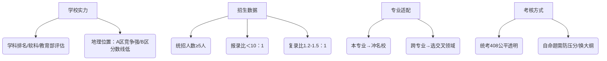

---

tips:这些都是参考我姐给我讲的去总结的，什么资料了，那个博主了，这个博主了，有，太多整理是个问题，这是之后的事

---
### **考研全攻略**
#### **一、考研本质与基础常识**  
| **维度**       | **核心要点**                                                                 |
|----------------|-----------------------------------------------------------------------------|
| **定义**       | 全国硕士生选拔考试，分初试（笔试）和复试（面试+笔试），决定硕士/博士入学资格。       |
| **门类**       | - **学硕**：学术研究导向（需论文），适合读博 - **专硕**：实践技能导向（重项目），适合就业 |
| **学习方式**   | - **全日制**：脱产学习，转档案 - **非全日制**：在职攻读，不转档案                |
| **关键流程**   | 报名（考前定1校1专业）→ 12月初试 → 次年3-4月复试 → 9月入学                     |
| **考试科目**   | 公共课（政治/英语/数学）+ 专业课（150分），计算机类统考科目为**408四门综合**（见下表） |

 **计算机统考408科目详解**  

| **科目**      | 分值  | 题型       | 难度排序      |     |
| ----------- | --- | -------- | --------- | --- |
| 数据结构（DS）    | 45分 | 11选择+2大题 | ★★★☆☆     |     |
| 计算机组成原理（CO） | 45分 | 11选择+2大题 | ★★★★★（最难） |     |
| 操作系统（OS）    | 35分 | 10选择+2大题 | ★★★☆☆     |     |
| 计算机网络（CN）   | 25分 | 8选择+1大题  | ★★☆☆☆     |     |

---

#### **二、择校核心策略与避坑指南**  
##### **1. 择校四维评估模型**

##### **2. 计算机专业择校特析**
| **类别**   | **学硕**                     | **专硕**                     |
|------------|------------------------------|------------------------------|
| **代码**   | 08开头（如0812计算机）        | **0854电子信息**（死亡代码）  |
| **特点**   | 竞争较小，要求论文            | 报考人数多，实践导向          |
| **推荐**   | 科研强校（中科院/985）        | 一线城市校企合作院校（深大/杭电） |

##### **3. 三大择校雷区（慎选！）**
- 🚫 **隐晦派**：不公布参考书目/考纲模糊  
- 🚫 **高风险派**：统招名额≤3人  
- 🚫 **黑历史派**：有歧视双非/专业课压分记录  

---

#### **三、全流程信息作战地图**  
##### **阶段1：基础调研（大三寒假-3月）**
- **查官方渠道**：  
  🔹 [研招网](https://yz.chsi.com.cn/)：国家线/院校库  
  🔹 **目标院校研究生院官网**：查历年报录比/复录比（关键！）  
- **定专业方向**：  
  ✅ 本专业：升级院校层次  
  ✅ 跨专业：选“跨度≤1级”领域（如机械→自动化）  

##### **阶段2：动态择校（6月模考后）**
| **能力定位**   | **院校档次**    | **计算机参考案例**          |
|----------------|----------------|---------------------------|
| 数学/专业课＞120分 | 冲刺档          | 浙大（408统考）            |
| 单科均＞100分   | 稳妥档          | 深圳大学（自命题数据结构）  |
| 擦线国家线      | 保底档          | 昆明理工（B区）            |

##### **阶段3：最终确认（9月招生简章发布后）**
- 紧盯目标院校：  
  🔸 **实际统招名额** = 总名额 - 推免人数  
  🔸 **复试规则变更**：笔试科目/英语占比调整  

---

#### **四、附：考研人必备工具箱**  
| **用途**         | **推荐渠道**                                                                 |
|------------------|-----------------------------------------------------------------------------|
| **政策查询**     | 研招网 + 院校研究生院官网（绝对权威！）                                        |
| **专业课资料**   | - 统考408：王道考研书系 - 自命题：院校真题（淘宝/学长学姐）                  |
| **经验参考**     | 目标院系公众号 + 知乎专栏（搜索“XX大学计算机考研经验”）                          |
| **防坑预警**     | 考研论坛（查“压分/歧视”关键词） + 多届学长学姐交叉验证                           |

> 💡 **终极建议**：  
> **择校是概率游戏**——用数据规避风险（看报录比/复录比），用实力提高胜率（重数学/专业课）。每年9月根据复习进度果断锁定目标，切忌摇摆！  
