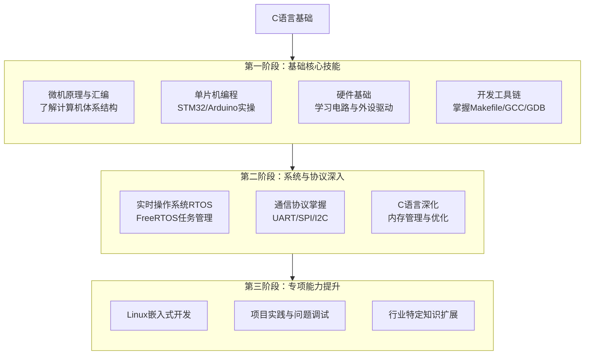
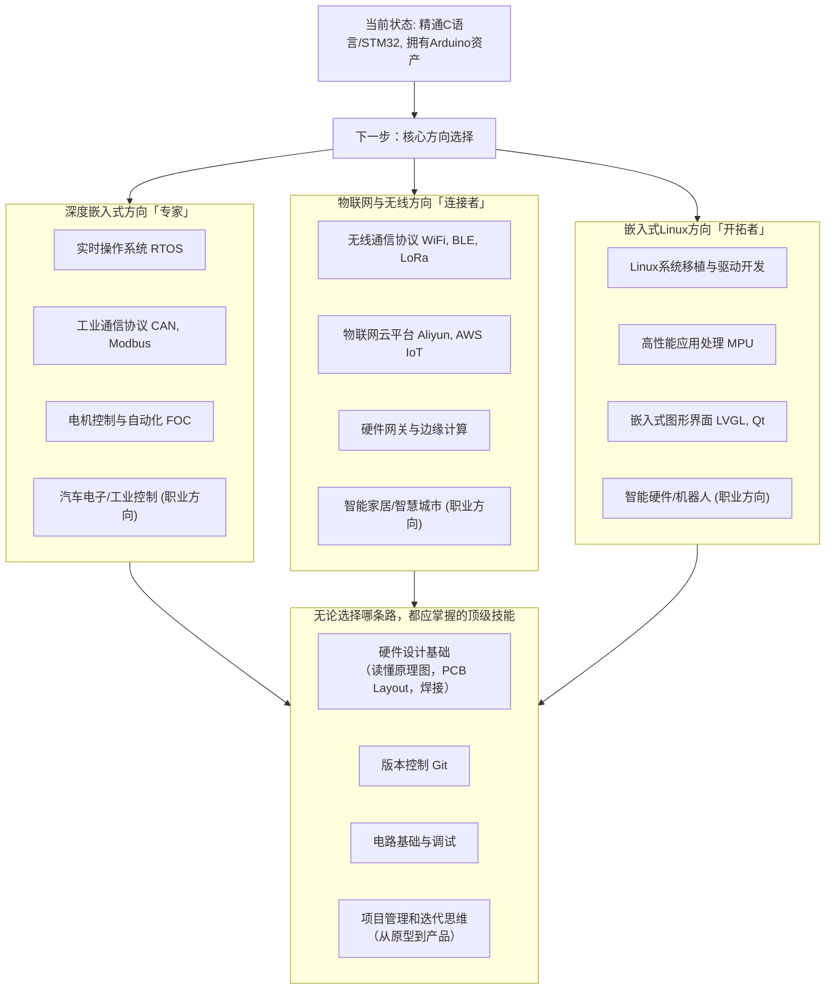
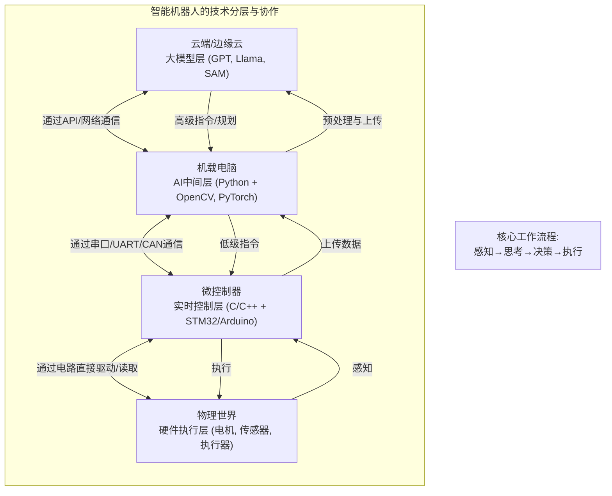

## C/py
（C是编译型、静态类型、底层语言；Python是解释型、动态类型、高级语言）
概念相同的
**变量和数据类型**
**运算符**
**控制流**
**函数**
但也存在实现的方式不同
### 数据结构（概念相通，实现不同）
比如**数组 （C） vs 列表 (Python)**
- **共同点**：都是有序的元素集合，可通过索引访问。
- **差异学习**：
    - C的数组长度固定，类型一致，是极其基础的数据结构。
    - ```C
      // 创建一个3层的货架，只能放书（整数） 
      int shelf[3]; 
      // 货架做好了，现在是空的
      ```
    - Python的列表长度可变，可包含不同类型的元素，是功能强大的高级对象。
    - ```python
		# 创建一个魔法背包，现在它是空的
		backpack = []
		# 也可以直接往里放点东西
		backpack = [10, "苹果", 3.14] # 数字、文字、小数都可以混着放
      ```
### 算法和逻辑思维
这是编程的本质，与语言无关

### 内存管理
- **Python**：自动垃圾回收。你不需要关心内存的分配和释放，可以专注于业务逻辑。
- **C**：手动内存管理。你必须使用 `malloc()` 和 `free()` 来显式地申请和释放内存。
- **学习价值**：通过学习C的内存管理，你会真正理解**指针**、**内存地址**、**堆和栈**等底层概念。


## C语言后续

之后
<br>1. **单片机/开发板**：STM32/ESP32<br>2. **IDE/工具**：Keil/STM32CubeIDE/PlatformIO<br>3. **基本外设**：GPIO, 定时器, UART, 中断
熟悉硬件平台与开发流程   最好做出项目

之后去使用adruino
尽可能的打造外部模块库和知识库（Arduino生态）

#### **树莓派和STM32单片机的核心区别**

这是最关键的概念，一定要讲清楚：

|特性|**STM32 (单片机/MCU)**|**树莓派 (微型电脑/MPU)**|
|---|---|---|
|**核心任务**|**控制** (Control)|**计算** (Computation)|
|**好比**|**汽车的发动机**|**汽车的驾驶员/中控台**|
|**擅长**|读传感器、控制电机、定时、响应中断|跑操作系统、处理图片、播放视频、连接网络、运行Python|
|**编程语言**|主要是**C/C++** (追求极致效率和硬件操作)|几乎是**任何语言** (Python, Java, C++, JavaScript…)|
|**开发方式**|直接操作寄存器/库函数，和硬件芯片手册打交道|在操作系统上调用高级的API和库，和文件、网络打交道|

之后你根据你的兴趣了
1. **如果你对控制本身特别着迷**（比如想自己做四轴飞行器、机械臂、智能车），喜欢研究如何让机器更精准、更高效地运动，那么选择 **路径一：深度嵌入式方向**。
2.  **如果你对“连接”更感兴趣**（比如想远程控制家里的电器、做环境监测站、可穿戴设备），喜欢开发与手机App、云平台交互的应用，那么选择 **路径二：物联网与无线方向**。**你的Arduino装备在这里能发挥最大价值**，用于快速验证各种物联网传感器节点。
3. **如果你对更复杂的系统感兴趣**（比如想开发智能家居中控屏、视频处理设备、运行复杂应用的智能设备），不畏惧学习操作系统层面的知识，那么选择 **路径三：嵌入式Linux方向**。这是挑战最大、薪资天花板也最高的方向。


我的推荐是RTOS 和嵌入式Linux方向  同时也非常建议学C++ 等相关知识

**深耕C语言和STM32** **引入树莓派和Linux基础**  **教他们“串口通信”**   **引入大模型API（部署）**

因为工作室的原由
机器人包括了嵌入式、控制理论、人工智能等多个领域
身体
大脑
灵魂

大模型----**全栈智能硬件工程师**
Python则是调用这个大脑、并与其沟通的**神经系统**。
云端 视觉   代码生成与辅助开发 自然语言等等
这三者是如何协同工作，共同构成一个智能机器人系统的



**SolidWorks**
- **C语言/单片机**：决定了你的产品**能不能动起来**，是否精准高效。
- **Python/树莓派**：决定了你的产品**能不能聪明地动**，是否功能丰富。
- **大模型**：决定了你的产品**能不能与人自然交互**，是否足够前沿。
而
- **SolidWorks**：决定了你的产品**能不能造出来**，是否合理可靠。
它是一款**三维计算机辅助设计（CAD）和工程（CAE）软件**。简单说，就是**高级版的、专为工业服务的“乐高设计软件”**。

- **做什么？** 用来画图，但不是平面图，是**精准的、带参数的、有物理属性的三维模型**。
- **画什么？** 你项目所需要的**一切机械结构**：机器人的底盘、车轮、传感器支架、摄像头云台、外壳、齿轮箱等等。

**理论与现实的桥梁**

**它的核心价值是【验证】与【协同】。**

1. **杜绝“空中楼阁”**：
    
    - **没有SolidWorks**：你脑子里有一个机器人的想法，直接就去买材料、焊接、3D打印。结果装到一半发现螺丝孔对不上，支架太软抖得厉害，线缆挤在一起塞不下。**时间、金钱、精力全部浪费。**
    - **有SolidWorks**：你在电脑里先把所有零件画出来，**虚拟地装配在一起**。软件可以告诉你有没有干涉（零件撞在一起），可以进行**运动仿真**（看看你的齿轮组转起来卡不卡），甚至可以进行**应力分析**（看看你的支架够不够结实）。**问题在数字阶段就全部解决。**
2. **工程师的“通用语言”**：
    
    - 你画好的标准图纸，可以直接发给加工商去**CNC加工、钣金切割、或者3D打印**。它是制造业的普通话。
    - 在团队协作中，机械的同学负责在SolidWorks里把结构件设计好，电子的同学才能根据预留的空间去设计电路板（PCB），嵌入式的同学才能知道传感器应该装在哪里、线有多长。